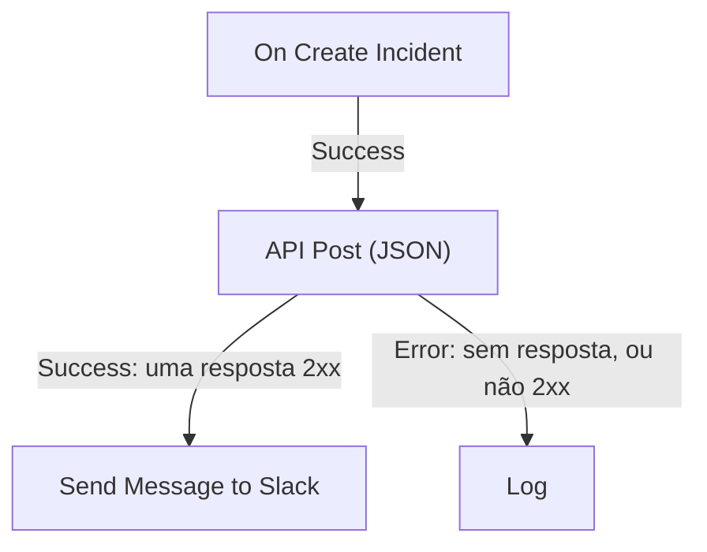

# Componentes de workflow

Os componentes são os blocos que você adiciona depois do gatilho. Cada um faz uma coisa só — envia uma mensagem, chama uma API, verifica uma condição, altera um registro do OneUptime — e depois toma uma das suas saídas em direção aos blocos ligados a ela. Esta página é o catálogo: do que cada bloco precisa, o que ele devolve e quando ele toma cada saída.

Raramente você vai precisar dela aberta enquanto monta. As configurações de cada bloco terminam com **How to use**: o que o bloco faz, os passos para configurá-lo, um exemplo montado a partir do seu próprio workflow e os erros mais comuns. Para adicionar e ligar blocos, veja [Criar um workflow](/docs/workflows/authoring).

:::cards
- [Enviar uma mensagem](#slack): Slack, Microsoft Teams, Discord, Telegram, IRC e e-mail.
- [Chamar uma API](#api): Envie uma requisição para qualquer API HTTP e leia a resposta.
- [Adicionar lógica](#conditions): Ramifique conforme um valor, transforme dados, espere ou registre.
- [Trabalhar com registros do OneUptime](#componentes-de-dados-do-oneuptime): Encontre, crie, atualize e exclua monitores, incidentes e mais.
:::

## Qual componente devo usar?

| Para…                                                         | Use                                                               |
| ------------------------------------------------------------- | ----------------------------------------------------------------- |
| Publicar em uma ferramenta de chat                            | [Slack](#slack), [Microsoft Teams](#microsoft-teams), [Discord](#discord), [Telegram](#telegram) ou [IRC](#irc) |
| Enviar um e-mail pelo seu próprio servidor de e-mail          | [Email](#email)                                                   |
| Chamar qualquer outra API ou um serviço seu                   | [API](#api)                                                       |
| Resumir, classificar ou redigir texto                         | [Generate Text with AI](#generate-text-with-ai)                   |
| Seguir um caminho ou outro conforme um valor                  | [Conditions](#conditions)                                         |
| Transformar dados entre dois blocos                           | [JSON](#json) ou [Custom Code](#custom-code)                      |
| Esperar antes do próximo bloco                                | [Sleep](#sleep)                                                   |
| Iniciar outro workflow                                        | [Execute Workflow](#execute-workflow)                             |
| Ler ou alterar incidentes, monitores e outros registros       | [Componentes de dados do OneUptime](#componentes-de-dados-do-oneuptime)   |

Um bloco dedicado é melhor que um genérico: o bloco do Slack conhece os limites do Slack, e um bloco de registro conhece os campos do registro, então você recebe erros e logs mais claros do que com um bloco **API** fazendo o mesmo trabalho.

## Como cada bloco funciona

Um bloco roda quando o bloco anterior toma a saída ligada a ele. Ele lê as configurações, faz o trabalho e depois toma uma das suas saídas. Só os blocos ligados a essa saída rodam em seguida.



- As **Configurações** são o que você preenche. As configurações marcadas como **(Opcional)** podem ficar vazias. As configurações menos usadas ficam recolhidas em **Mais campos**.
- Os **Outputs** são os pontos da borda de baixo. A maioria dos blocos tem **Success** e **Error**; [Conditions](#conditions) tem **Yes** e **No**.
- Os **Returns** são os valores que um bloco entrega aos blocos seguintes, como o **Response Body** de uma API. Um bloco seguinte lê um deles com `{{local.components.<block ID>.returnValues.<value ID>}}`; o botão **{ }** de uma configuração o insere para você. Veja [Variáveis](/docs/workflows/variables#saídas-de-componentes-dados-de-blocos-anteriores).

Um bloco que toma **Error** não faz a execução falhar: a execução segue o caminho **Error**, ou termina ali se nada estiver ligado a ele. Já uma configuração obrigatória deixada vazia, ou uma configuração que nunca pode funcionar, para a execução com um erro.

## API

Faça uma requisição HTTP para qualquer URL. Há um bloco por método: **API Get (JSON)**, **API Post (JSON)**, **API Put (JSON)**, **API Patch (JSON)** e **API Delete (JSON)**.

| Configuração        | O que faz                                                                                                                            |
| ------------------- | ------------------------------------------------------------------------------------------------------------------------------------ |
| **URL**             | O endereço a chamar, `http` ou `https`.                                                                                              |
| **Request Body**    | O JSON a enviar. Normalmente só as requisições `POST`, `PUT` e `PATCH` precisam de um.                                               |
| **Request Headers** | Os cabeçalhos a enviar, como uma chave de API. Em **Mais campos**. Os valores deles ficam ocultos no log da execução.                |

| Saída       | Quando                                                                                         |
| ----------- | ---------------------------------------------------------------------------------------------- |
| **Success** | O servidor respondeu com um status 2xx.                                                        |
| **Error**   | A requisição falhou: o servidor não pôde ser alcançado ou respondeu com outro status.          |

Nos dois casos, o bloco devolve **Response Status**, **Response Headers** e **Response Body**, além de **Error** com o motivo quando falhou. Leia um campo de uma resposta JSON acrescentando o nome dele à referência, como em `{{local.components.api-get-1.returnValues.response-body.id}}`.

Redirecionamentos não são seguidos, então aponte o bloco para o endereço que responde. As requisições saem do OneUptime: uma URL que resolve para um endereço de rede privada é recusada, a menos que um administrador self-hosted a permita, e a execução para com o motivo. Veja [Acesso de rede para fora](/docs/workflows/configuration#acesso-de-rede-para-fora).

## AI

### Generate Text with AI

Gere uma resposta em texto a partir de um prompt e de um contexto JSON opcional. O bloco usa o provedor de LLM padrão do projeto, ou o provedor global da instalação quando o projeto não tem um. Os provedores são configurados de forma centralizada em **Configurações do projeto → IA → Provedores LLM**; as chaves e os endpoints deles nunca são configurações do bloco.

| Configuração              | O que faz                                                                                                                                                         |
| ------------------------- | ----------------------------------------------------------------------------------------------------------------------------------------------------------------- |
| **System Instructions**   | Orientações opcionais sobre o papel, o tom e as restrições do modelo.                                                                                            |
| **Prompt**                | A tarefa. É enviada exatamente como você digita, então Markdown funciona, e pode incluir variáveis e valores de blocos anteriores.                               |
| **Context**               | JSON opcional que você envia de propósito. É acrescentado depois de um marcador explícito de fim de mensagem e tratado como dados não confiáveis.                |
| **Temperature**           | Em **Mais campos**. A variação, de `0` a `1`; o padrão é `0.2`, para uma automação previsível. Os modelos Claude atuais, Opus 4.7 e posteriores e todos os modelos Claude 5, escolhem a própria amostragem: o OneUptime deixa **Temperature** fora das requisições deles, então ela não tem efeito nesses modelos. |
| **Maximum Output Tokens** | Em **Mais campos**. De `1` a `4096`; o padrão é `1024`.                                                                                                          |

System Instructions, Prompt e o Context serializado são limitados, juntos, a 50.000 caracteres. Uma imagem incorporada neles em base64, como a captura de tela de um monitor sintético na descrição de um incidente, é substituída por uma nota curta como `[image omitted: PNG, 340 KB]` antes da medição, porque o modelo lê texto, não imagens. O log da execução diz o que ficou de fora. A requisição ao provedor dura no máximo 60 segundos e é tentada uma única vez. No máximo três requisições de IA de workflows podem rodar ao mesmo tempo por projeto.

Ele devolve **Response** (o texto gerado), **Provider** e **Model** (o que respondeu), **Total Tokens** e **Completion Tokens** (o uso informado pelo provedor), **LLM Log ID** (a entrada da chamada nos logs de IA) e **Error**.

Ligue **Success** aos blocos que usam a resposta, e **Error** a uma alternativa: as falhas de validação, acesso, provedor, orçamento, cobrança e tempo esgotado tomam todas esse caminho. O bloco não envia ferramentas, então o modelo não consegue consultar o OneUptime, chamar APIs nem alterar dados por conta própria.

> [!WARNING]
> A saída do modelo é texto não confiável. Revise-a antes que chegue aos clientes e nunca deixe que um texto livre da IA decida sozinho uma ação destrutiva. Veja [Componentes de AI](/docs/workflows/configuration#componentes-de-ai) para saber o que é enviado ao provedor, o que é registrado e quanto custa.

## Slack

Publique uma mensagem em um canal do Slack por meio de um webhook de entrada.

| Configuração                   | O que faz                                                                                                                                                                                                    |
| ------------------------------ | ------------------------------------------------------------------------------------------------------------------------------------------------------------------------------------------------------------ |
| **Slack Incoming Webhook URL** | O webhook do canal onde publicar. Precisa começar com `https://hooks.slack.com/services/`. O guia do Slack para [criar um](https://api.slack.com/messaging/webhooks) leva alguns minutos.                     |
| **Message Text**               | O texto a enviar. Ele é enviado exatamente como você digita, então use a formatação do próprio Slack: `*bold*`, `_italic_`, `~strikethrough~` e `<https://example.com|a link>`. Um texto maior que uma seção do Slack (3.000 caracteres) vai em várias; passando de dez seções, ele é cortado e termina com "… (truncated — see OneUptime for the full text)". |

**Success** dispara quando o Slack aceitou a mensagem e **Error** quando a recusou, com o motivo do Slack em **Error**. Esses blocos publicam pelo webhook das configurações deles, não pela conexão do Slack do seu projeto.

## Microsoft Teams

Publique uma mensagem em um canal do Microsoft Teams. O bloco se chama **Send Message to Teams**.

| Configuração                   | O que faz                                                                                                                                                                                                                                     |
| ------------------------------ | --------------------------------------------------------------------------------------------------------------------------------------------------------------------------------------------------------------------------------------------- |
| **Teams Incoming Webhook URL** | O webhook do canal onde publicar, uma URL `https` em `office.com`, `office365.com`, `logic.azure.com` ou `environment.api.powerplatform.com`. O guia da Microsoft mostra como [criar um com os Workflows do Teams](https://support.microsoft.com/en-us/teams/apps-service/create-incoming-webhooks-with-workflows-for-microsoft-teams). |
| **Message Text**               | O texto a enviar. Uma mensagem maior do que um webhook de entrada aceita (cerca de 12.000 caracteres, medidos como são enviados) é cortada e termina com "… (truncated — see OneUptime for the full text)".                                      |

## Discord

Publique uma mensagem em um canal do Discord por meio de um webhook de entrada.

| Configuração                     | O que faz                                                                                                                                          |
| -------------------------------- | -------------------------------------------------------------------------------------------------------------------------------------------------- |
| **Discord Incoming Webhook URL** | O webhook do canal, uma URL `https` em `discord.com` ou `discordapp.com`.                                                                          |
| **Message Text**                 | O texto a enviar. Uma mensagem com mais de 2.000 caracteres, o limite do Discord, é cortada e termina com "… (truncated — see OneUptime for the full text)". |

## Telegram

Envie uma mensagem para um chat do Telegram com um bot.

| Configuração           | O que faz                                                                                                                                          |
| ---------------------- | -------------------------------------------------------------------------------------------------------------------------------------------------- |
| **Telegram Bot Token** | O token que o BotFather deu ao seu bot, como `123456789:ABCdef…`. Um token em qualquer outro formato para a execução, sem que o token seja gravado no log. |
| **Chat ID**            | O chat onde publicar: o ID dele, ou o `@username` de um canal. Adicione primeiro o bot ao grupo ou ao canal. Para mandar mensagem a uma pessoa, ela precisa ter iniciado um chat com o bot. |
| **Message Text**       | O texto a enviar. Uma mensagem com mais de 4.096 caracteres, o limite do Telegram, é cortada e termina com "… (truncated — see OneUptime for the full text)". |

Quando o Telegram recusa a mensagem, **Error** dispara com o motivo do Telegram.

## IRC

Publique uma mensagem em um canal de IRC em qualquer rede IRC: Libera.Chat, OFTC ou um servidor seu. O IRC não tem webhooks, então o bloco se conecta ele mesmo ao servidor, entra no canal, envia a mensagem e sai.

| Configuração     | O que faz                                                                                                                                                                                                                                          |
| ---------------- | -------------------------------------------------------------------------------------------------------------------------------------------------------------------------------------------------------------------------------------------------- |
| **IRC Server**   | O nome do host do servidor, como `irc.libera.chat`. Só o nome: sem `ircs://` e sem porta.                                                                                                                                                          |
| **Channel**      | O canal onde publicar, como `#ops`. Precisa ser um canal: um apelido digitado aqui é recusado em vez de receber uma mensagem privada.                                                                                                              |
| **Message Text** | O texto a enviar. Cada linha vai como uma mensagem IRC própria, e uma linha longa é dividida para caber. Uma mensagem é enviada em no máximo 15 linhas IRC: uma mais longa é encurtada, e a última linha dela avisa. O IRC não tem Markdown, então o texto é enviado como foi digitado; os códigos de formatação do próprio IRC, como negrito e cores, funcionam. |

Em **Mais campos**:

| Configuração                             | O que faz                                                                                                                                                                                                          |
| ---------------------------------------- | ------------------------------------------------------------------------------------------------------------------------------------------------------------------------------------------------------------------ |
| **Nickname**                             | Quem envia a mensagem. O padrão é `OneUptime`. Se o apelido estiver em uso, o bloco o tenta com um sublinhado ou um número acrescentado, e depois com um deles no lugar dos últimos caracteres, para um servidor que não aceita apelido mais longo. |
| **Port**                                 | A porta do servidor. O padrão é `6697`, ou `6667` com **Disable TLS** ligado.                                                                                                                                      |
| **Disable TLS**                          | O bloco se conecta por TLS e verifica o certificado do servidor. Ligue isto só para um servidor que não oferece TLS; qualquer senha passa então a ser enviada sem criptografia. Para confiar em um certificado da sua própria autoridade certificadora, uma instalação self-hosted define `NODE_EXTRA_CA_CERTS` em vez disso. |
| **Channel Key**                          | A chave de um canal que tenha uma (modo `+k`).                                                                                                                                                                     |
| **Send Without Joining**                 | Publica sem entrar no canal, para que o canal não veja o bloco entrar e sair. Só funciona onde o canal aceita mensagens de fora (sem modo `+n`).                                                                    |
| **Server Password**                      | Uma senha que o servidor ou o seu bouncer pede na conexão.                                                                                                                                                        |
| **SASL Username** e **SASL Password**    | Entre na sua conta em redes que usam SASL, como a Libera.Chat, que o exige para conexões vindas de alguns endereços de nuvem e de VPN. Preencha os dois ou nenhum.                                                 |

**Success** dispara quando o servidor aceitou todas as linhas. O bloco verifica isso pedindo ao servidor que responda a um ping depois da última linha: um servidor responde em ordem, então qualquer recusa da mensagem chega antes. Um bouncer como o ZNC responde ele mesmo ao ping, então o bloco escuta um segundo a mais pela resposta da rede por trás dele.

**Error** dispara quando o servidor não pode ser alcançado, recusa a conexão, o apelido, uma senha ou o canal, ou recusa a mensagem. Ele repassa o motivo, nas palavras do próprio servidor quando ele as deu. Já um **IRC Server**, um **Channel** ou um **Message Text** faltando, ou uma configuração que nunca poderia funcionar, para a execução.

Cada execução do bloco é uma conexão própria, e as redes IRC limitam com que frequência um mesmo endereço pode se conectar: uma rajada de mensagens pode ser recusada com um motivo como "Reconnecting too fast", e toma **Error** como qualquer outra recusa. Para um workflow que pode disparar muitas vezes por minuto, junte o que ele tem a dizer em uma mensagem só, ou envie por um servidor seu.

Guarde as senhas em [variáveis globais secretas](/docs/workflows/variables#variáveis-globais) e use a variável na configuração; elas ficam ocultas nos logs de execução de qualquer forma. Conexões a endereços de loopback (`localhost`, `127.0.0.1`), link-local e de metadados de nuvem são recusadas. No OneUptime Cloud, um servidor em um endereço de rede privada, ou um nome que resolve para um, também é recusado. Instalações self-hosted conseguem alcançar um servidor IRC na própria rede, a menos que `DATA_SOURCE_BLOCK_PRIVATE_ADDRESSES` esteja definido como `true`.

## Email

Envie um e-mail por um servidor SMTP que você informa no bloco. O bloco se chama **Send Email**.

| Configuração                            | O que faz                                                                                             |
| --------------------------------------- | ----------------------------------------------------------------------------------------------------- |
| **From Email**                          | O remetente, por exemplo `Alerts <alerts@company.com>`.                                               |
| **To Email**                            | O endereço do destinatário. Separe vários endereços com vírgulas ou ponto e vírgula.                  |
| **Subject**                             | O assunto.                                                                                            |
| **Email Body**                          | A mensagem, enviada como HTML.                                                                        |
| **SMTP HOST** e **SMTP Port**           | O servidor de e-mail ao qual se conectar.                                                             |
| **SMTP Username** e **SMTP Password**   | Opcionais. Preencha os dois ou nenhum.                                                                |
| **Use Implicit TLS**                    | Ligue para TLS implícito, normalmente na porta 465. Deixe desligado para STARTTLS, normalmente na porta 587. |

**Success** dispara quando o servidor SMTP aceitou a mensagem. **Error** dispara quando o host SMTP é recusado, o servidor não pode ser alcançado ou rejeita a mensagem, e repassa a mensagem de erro. Já um **To Email**, um **From Email**, um **SMTP HOST** ou uma **SMTP Port** faltando para a execução.

O bloco se conecta direto ao servidor das configurações dele. Ele não usa as configurações de [SMTP](/docs/emails/smtp) do seu projeto nem o servidor de e-mail do próprio OneUptime, e os e-mails que ele envia não aparecem nos registros de notificação. Para conferir o que ele fez, veja as [Execuções](/docs/workflows/runs-and-logs) do workflow.

Conexões a endereços de loopback (`localhost`, `127.0.0.1`), link-local e de metadados de nuvem são recusadas. No OneUptime Cloud, um host SMTP em um endereço de rede privada, ou um nome que resolve para um, também é recusado. Instalações self-hosted conseguem alcançar um servidor de e-mail na própria rede, a menos que `DATA_SOURCE_BLOCK_PRIVATE_ADDRESSES` esteja definido como `true`. Um host recusado toma a saída **Error**, e nada é enviado.

## Custom Code

Rode algumas linhas de JavaScript quando os outros blocos não conseguem fazer o que você precisa. O bloco se chama **Run Custom JavaScript**.

| Configuração        | O que faz                                                                                                                            |
| ------------------- | ------------------------------------------------------------------------------------------------------------------------------------ |
| **JavaScript Code** | O seu código. O que ele devolver com `return` vira o **Value** do bloco. Ele pode usar `await`.                                     |
| **Arguments**       | Um objeto JSON de valores a entregar ao código, que os lê como `args`. Coloque aqui as variáveis e os valores de blocos anteriores; o próprio código não consegue lê-los. |

```json title="Arguments"
{ "title": "{{local.components.incident-on-create-1.returnValues.model.title}}" }
```

```javascript title="JavaScript Code"
const words = args.title.split(" ");

return {
  shortTitle: words.slice(0, 5).join(" "),
  wordCount: words.length,
};
```

Um bloco seguinte lê o título curto como `{{local.components.javascript-1.returnValues.returnValue.shortTitle}}`.

O código roda em uma sandbox com `args`, `console.log` (gravado no log da execução), `axios` para requisições HTTP, `crypto` e `sleep`. Ele não tem sistema de arquivos nem processo, e as requisições dele seguem as mesmas regras de endereço do bloco API. Ele tem 5 segundos por padrão; uma instalação self-hosted muda isso com `WORKFLOW_SCRIPT_TIMEOUT_IN_MS`.

**Success** dispara com o **Value** devolvido, e **Error** quando o código lança um erro ou estoura o tempo, com a mensagem em **Error**. Para scripts mais pesados, use um [Runbook](/docs/runbooks/index).

## JSON

Converta entre texto e JSON, ou combine dois objetos JSON.

| Bloco            | Recebe                                   | Devolve                                                                                                    |
| ---------------- | ---------------------------------------- | ---------------------------------------------------------------------------------------------------------- |
| **JSON to Text** | **JSON**, um objeto                      | **Text**: o objeto como string. Útil quando o próximo bloco espera texto.                                  |
| **Text to JSON** | **Text**, que pode ter várias linhas     | **JSON**: o objeto interpretado, para você ler os campos dele. Use em JSON que chegou como texto.          |
| **Merge JSON**   | **JSON 1** e **JSON 2**                  | **JSON**: um objeto com as chaves dos dois. Quando os dois têm uma chave, vale a de **JSON 2**.            |

**Text to JSON** toma **Error** quando o texto não é JSON. Uma entrada faltando, ou uma entrada de **Merge JSON** que não é um objeto, para a execução.

## Conditions

Ramifique conforme uma comparação. No painel **Adicionar componente**, este bloco se chama **If / Else**, em **Popular**.

As configurações dele se leem como uma frase: **Se** *valor a verificar* *comparação* *valor de comparação*, continue em **Yes**, senão em **No**. Abaixo das configurações, a condição é lida de volta em palavras, para você ver que ela diz o que você quer. No canvas, o bloco também mostra a condição dele, por exemplo *Se environment is equal to “production”*.

| Configuração       | O que faz                                                                                                                                |
| ------------------ | ---------------------------------------------------------------------------------------------------------------------------------------- |
| **Value to check** | Normalmente um valor de um bloco anterior. Pressione **{ }** na caixa para escolher um, ou digite `{{`.                                  |
| **Comparison**     | Como comparar, em palavras. As comparações estão listadas abaixo.                                                                        |
| **Compare with**   | Com o que comparar, digitado ou escolhido do mesmo jeito. **está vazio**, **não está vazio**, **is true** e **is false** não o usam.     |
| **Compare as**     | Recolhido sob a comparação: **Text**, **Número** ou **True / False**. Escolha **Text** para ordenar datas escritas `2026-10-01`, ou **Número** para que `200` e `200.0` sejam iguais. |

As comparações:

- **is equal to** e **is not equal to**;
- para texto: **contém**, **não contém**, **começa com** e **termina com**;
- para números: **é maior que**, **is greater than or equal to**, **é menor que** e **is less than or equal to**;
- **está vazio** e **não está vazio**, que verificam se o valor está presente;
- **is true** e **is false**.

As comparações de números comparam números e as de texto comparam texto, então você raramente precisa de **Compare as**. Como os valores são comparados:

- Como texto, maiúsculas contam: `Error` não é `error`.
- Como números, um texto que não é número vale `0`. As configurações apontam um valor digitado assim.
- Como verdadeiro ou falso, só `true` conta como verdadeiro.
- **está vazio** é satisfeito pela ausência de valor, um texto em branco, uma lista ou um objeto vazio, ou um valor que o bloco anterior não tinha, como um campo que o webhook não enviou. `0` e `false` são valores, então não estão vazios.

**Yes** roda quando a condição é atendida e **No** quando não é. Os blocos configurados antes de as configurações terem esses nomes rodam exatamente como antes. Uma opção antiga não é mais oferecida: comparar um valor como **Null** ou **Undefined**, o que ignorava o que o valor continha. Um bloco que ainda a usa avisa quando você o abre; escolha **está vazio** para verificar um valor ausente.

## Sleep

Pause a execução antes do próximo bloco, para dar a outro sistema um tempo para se atualizar ou para fazer um acompanhamento mais tarde.

**Days**, **Hours**, **Minutes** e **Seconds** se somam. A espera mais longa é de 30 dias: uma mais longa é reduzida a 30 dias, e o log da execução avisa.

Enquanto espera, a execução é colocada de lado com o status **Aguardando** e retomada quando o tempo acaba, então uma espera longa não segura nada. Uma execução cujo workflow foi desligado ou arquivado nesse meio-tempo é cancelada ao acordar.

## Log

Grave um valor no log da execução. Ele não muda mais nada, o que faz dele o jeito mais fácil de ver o que um valor continha.

**Value** é o que gravar. Pode ter várias linhas e incluir valores de blocos anteriores, como `{{local.components.webhook-1.returnValues.request-body}}`. O bloco toma **Out** quando termina.

## Execute Workflow

Inicie outro workflow do mesmo projeto. O seu workflow continua sem esperar o outro terminar.

| Configuração  | O que faz                                                                                                                                 |
| ------------- | ----------------------------------------------------------------------------------------------------------------------------------------- |
| **Workflow**  | O workflow a iniciar. Ele precisa estar habilitado e, para receber argumentos, ter um gatilho **Manual**.                                 |
| **Arguments** | O JSON a repassar. O gatilho Manual do outro workflow entrega cada chave como um valor próprio: com `{"customerId": "42"}`, ele lê `{{local.components.manual-1.returnValues.customerId}}`. |

**Out** dispara assim que o outro workflow entra na fila. **Error** dispara quando isso não é possível: ele não foi encontrado, está desligado ou arquivado, ou iniciá-lo criaria um loop.

Use-o para compartilhar lógica comum: monte uma vez um workflow «publicar no canal do incidente» e inicie-o a partir de cada workflow que precisar. Uma cadeia de workflows que se iniciam uns aos outros não pode voltar a si mesma e tem no máximo 10 níveis. Veja [Configuração e segurança](/docs/workflows/configuration#limite-para-chamar-outros-workflows).

## Componentes de dados do OneUptime

Para cada tipo de registro do OneUptime (monitores, incidentes, alertas, páginas de status, políticas de plantão e muitos outros), o painel **Adicionar componente** tem estes componentes: em **OneUptime resources**, clique no tipo de registro (**Browse all resources** tem os que não aparecem), ou pesquise pelo nome do tipo. Cada título é gerado a partir do tipo de registro, então o conjunto de Monitor fica assim:

| Componente               | O que faz                                                                      |
| ------------------------ | ------------------------------------------------------------------------------ |
| **Find One Monitor**     | Lê um registro que corresponde à consulta.                                     |
| **Find Many Monitors**   | Lê uma lista de registros que correspondem à consulta.                         |
| **Create One Monitor**   | Adiciona um registro a partir de um objeto JSON.                               |
| **Create Many Monitors** | Adiciona vários registros a partir de um array JSON.                           |
| **Update One Monitor**   | Aplica os dados a gravar a um registro correspondente.                         |
| **Update Many Monitors** | Aplica os dados a gravar aos registros correspondentes, até **Limit**.         |
| **Delete One Monitor**   | Exclui um registro correspondente.                                             |
| **Delete Many Monitors** | Exclui os registros correspondentes, até **Limit**.                            |

O mesmo conjunto dá a você três gatilhos — **On Create Monitor**, **On Update Monitor** e **On Delete Monitor**. Veja [Gatilhos](/docs/workflows/triggers#gatilhos-de-eventos-do-oneuptime).

Um tipo só oferece os componentes que o modelo dele permite. Um tipo somente leitura tem os dois componentes Find e nada mais, então, se você não encontra **Delete One Monitor** no painel, esse tipo não permite isso.

É assim que um workflow lê e altera os dados do OneUptime. Por exemplo, um webhook da sua ferramenta de CI pode usar **Create One Incident** para abrir um incidente com os detalhes da falha.

Esses componentes agem como Project Admin do projeto do workflow: o que um Project Admin não pode fazer, ou o que o seu plano não inclui, é recusado, e o log da execução diz por quê. Veja [O que os passos de um workflow podem fazer](/docs/workflows/configuration#o-que-os-passos-de-um-workflow-podem-fazer).

### Declarar um incidente a partir de um modelo

**Create One Incident** pode declarar o incidente a partir de um dos seus [modelos de incidente](/docs/incidents/settings#modelos-de-incidentes): escolha-o em **Incident Template**, a primeira configuração do passo. O modelo preenche todos os campos que **JSON Object** deixa de fora — o título, a descrição, a gravidade, o estado inicial, os monitores e outros recursos, as políticas de plantão, os rótulos, as páginas de status e os campos personalizados — e os proprietários dele viram os proprietários do incidente. Tudo o que você definir em **JSON Object** prevalece sobre o modelo, estado incluído, então, com um modelo escolhido, **JSON Object** só precisa do que deve ser diferente e pode ficar vazio.

O incidente registra o modelo a partir do qual foi declarado em `createdIncidentTemplateId`. Essa coluna é definida pelo OneUptime: um passo que a envia em **JSON Object** é recusado, e o log da execução indica **Incident Template**. Um modelo de outro projeto, ou um que foi excluído, faz o passo tomar a saída **Error**, e em um plano que não inclui modelos de incidente o passo é recusado com o plano necessário. Veja [Como um modelo é aplicado](/docs/incidents/settings#como-um-modelo-é-aplicado).

## Trabalhar com registros

Cada campo de um componente de dados usa os nomes de **coluna** do próprio registro — os mesmos nomes que a API usa, não os rótulos do formulário do dashboard. A coluna de ID é `_id`. A grafia `id` é aceita como alias em qualquer lugar onde você possa digitar um nome de coluna, mas `_id` é o que um registro devolve, então é isso que você deve ler na saída:

```json
{ "_id": "00000000-0000-0000-0000-000000000000" }
```

**Query** decide sobre quais registros o componente age. As chaves são colunas, e os valores, o que deve corresponder:

```json
{ "monitorType": "Website", "isEnabled": true }
```

Uma consulta sempre fica limitada ao projeto em que o workflow roda. Você não consegue alcançar os registros de outro projeto, e não precisa acrescentar você mesmo o projeto à consulta.

**JSON Object** em Create One, **JSON Array** em Create Many e **Data (JSON Object)** nos componentes Update levam os campos a gravar, com as mesmas chaves:

```json
{ "name": "Checkout API", "monitorType": "Website" }
```

Uma chave que não é coluna é ignorada em vez de recusada — o log da execução nomeia as que foram descartadas, então confira lá quando um campo não for gravado. **Select Fields**, nos componentes Find e nos gatilhos, usa as mesmas chaves de coluna com valores `true`: `{"_id": true, "name": true}`.

Os **campos personalizados** são uma única coluna, `customFields`, que guarda o valor de cada campo personalizado sob o nome do campo. Os componentes Update só alteram os campos personalizados que você nomeia, e todos os outros mantêm o valor:

```json
{ "customFields": { "Notification Count": 1 } }
```

define **Notification Count** e deixa os outros campos personalizados do registro como estavam. Defina um campo personalizado como `null` para limpá-lo, ou o próprio `customFields` como `null` para limpar todos. Dois workflows que atualizam ao mesmo tempo campos personalizados diferentes do mesmo registro são gravados os dois. Isso vale só para os componentes Update: a API do OneUptime grava `customFields` inteiro, então uma requisição a ela precisa levar todos os campos personalizados que você quer manter.

Você raramente digita essas chaves. Nas configurações do componente, **Add a field** (ou **Add a condition** em uma consulta) lista as colunas do modelo pelo nome, com o tipo de valor que cada uma aceita. Pesquise pelo nome, pela chave da coluna ou pelo que o campo faz, e pressione **Enter** para adicionar o melhor resultado. Em uma criação, os campos sem os quais o registro não pode ser criado vêm primeiro, depois os campos principais do modelo (os que ele preenche por você se você os omitir) e depois todo o resto.

Os campos que o próprio OneUptime preenche não são oferecidos quando você grava um registro: o `_id` do registro, **Criado em**, **Atualizado em**, **Created by User**, slugs, números de registro e status de notificação. Quem criou, arquivou ou resolveu um registro, e quando, nunca cabe a um workflow definir: um registro criado por um workflow não tem criador, um valor que um workflow envia para um desses campos junto com outros campos é ignorado, e um Update que não envia mais nada falha com uma mensagem que os nomeia. Uma atualização só oferece os campos que podem mudar depois que um registro existe. Uma consulta ainda oferece o ID, os carimbos de data e hora e **Created by User**, porque são úteis para filtrar. **Deleted At** não é oferecido em lugar nenhum: os registros são excluídos de vez, então ele está sempre vazio.

**Skip** e **Limit** são dois campos numéricos em Find Many, Update Many e Delete Many, em **Mais campos** — `Skip: 0` com `Limit: 100` pega os cem primeiros resultados. **Limit** vale `10` por padrão, e em Update Many e Delete Many ele limita quantos registros são de fato gravados, não só quantos voltam. Então `Items Deleted: 10` significa que dez registros foram excluídos, não que dez corresponderam. Aumente **Limit** quando quiser alterar mais de dez.

**Success** e **Error** dizem se a consulta rodou, não o que ela encontrou. Uma consulta que não corresponde a nada devolve `0` e ainda sai por **Success** — isso não é uma falha. Para ramificar conforme algo tenha correspondido, leia a contagem devolvida em um bloco **If / Else**.

## Próximos passos

:::cards
- [Variáveis](/docs/workflows/variables): Passe valores entre blocos e mantenha os segredos fora deles.
- [Execuções](/docs/workflows/runs-and-logs): Veja o que cada bloco recebeu e devolveu em uma execução.
- [Configuração e segurança](/docs/workflows/configuration): Limites, permissões e o que os passos podem fazer.
:::
