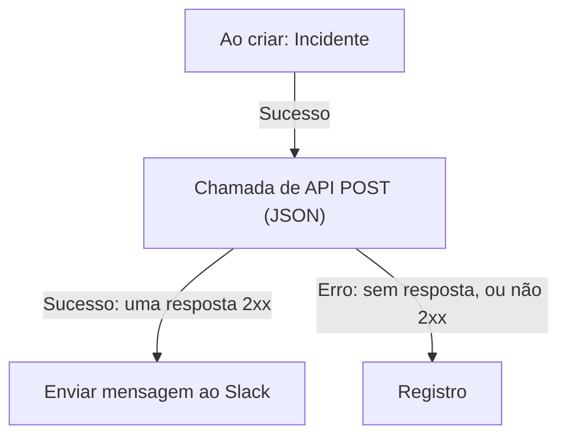

# Componentes de workflow

Os componentes são os blocos que você adiciona depois do gatilho. Cada um faz uma coisa só — envia uma mensagem, chama uma API, verifica uma condição, altera um registro do OneUptime — e depois toma uma das suas saídas em direção aos blocos ligados a ela. Esta página é o catálogo: do que cada bloco precisa, o que ele devolve e quando ele toma cada saída.

Raramente você vai precisar dela aberta enquanto monta. As configurações de cada bloco terminam com **How to use**: o que o bloco faz, os passos para configurá-lo, um exemplo montado a partir do seu próprio workflow e os erros mais comuns. Para adicionar e ligar blocos, veja [Criar um workflow](/docs/workflows/authoring).

:::cards
- [Enviar uma mensagem](#slack): Slack, Microsoft Teams, Discord, Telegram, IRC, Mattermost e e-mail.
- [Chamar uma API](#api): Envie uma requisição para qualquer API HTTP e leia a resposta.
- [Adicionar lógica](#conditions): Ramifique conforme um valor, transforme dados, espere ou registre.
- [Trabalhar com registros do OneUptime](#componentes-de-dados-do-oneuptime): Encontre, crie, atualize e exclua monitores, incidentes e mais.
:::

## Qual componente devo usar?

| Para…                                                         | Use                                                               |
| ------------------------------------------------------------- | ----------------------------------------------------------------- |
| Publicar em uma ferramenta de chat                            | [Slack](#slack), [Microsoft Teams](#microsoft-teams), [Discord](#discord), [Telegram](#telegram), [IRC](#irc) ou [Mattermost](#mattermost) |
| Enviar um e-mail pelo seu próprio servidor de e-mail          | [Email](#email)                                                   |
| Acionar uma pessoa, uma equipe ou quem estiver de plantão | [Paging](#paging) |
| Chamar qualquer outra API ou um serviço seu                   | [API](#api)                                                       |
| Resumir, classificar ou redigir texto                         | [Generate Text with AI](#generate-text-with-ai)                   |
| Seguir um caminho ou outro conforme um valor                  | [Conditions](#conditions)                                         |
| Seguir um de vários caminhos conforme um valor                | [Switch / Case](#switch-case)                                     |
| Seguir só quando algumas linhas de JavaScript disserem | [Check With JavaScript](#check-with-javascript) |
| Transformar dados entre dois blocos                           | [JSON](#json) ou [Custom Code](#custom-code)                      |
| Esperar antes do próximo bloco                                | [Sleep](#sleep)                                                   |
| Iniciar outro workflow                                        | [Execute Workflow](#execute-workflow)                             |
| Ler ou alterar incidentes, monitores e outros registros       | [Componentes de dados do OneUptime](#componentes-de-dados-do-oneuptime)   |
| Abrir, reconhecer e resolver incidentes ou alertas para os problemas de outra ferramenta | [Incidentes e alertas de outras ferramentas](#incidentes-e-alertas-de-outras-ferramentas) |
| Reconhecer ou fechar um problema do Zabbix | [Zabbix](#zabbix) |
| Pedir a uma pessoa que aprove uma correção em uma nuvem OpenStack | [Propor uma correção do OpenStack](#propose-an-openstack-fix) |

Um bloco dedicado é melhor que um genérico: o bloco do Slack conhece os limites do Slack, e um bloco de registro conhece os campos do registro, então você recebe erros e logs mais claros do que com um bloco **API** fazendo o mesmo trabalho.

## Como cada bloco funciona

Um bloco roda quando o bloco anterior toma a saída ligada a ele. Ele lê as configurações, faz o trabalho e depois toma uma das suas saídas. Só os blocos ligados a essa saída rodam em seguida.


```mermaid title="Um bloco toma uma das suas saídas"
flowchart TB
    trigger["Ao criar: Incidente"] -->|"Sucesso"| post["Chamada de API POST (JSON)"]
    post -->|"Sucesso: uma resposta 2xx"| slack["Enviar mensagem ao Slack"]
    post -->|"Erro: sem resposta, ou não 2xx"| log["Registro"]
```

- As **Configurações** são o que você preenche. As configurações marcadas como **(Opcional)** podem ficar vazias. As configurações menos usadas ficam recolhidas em **Mais campos**.
- Os **Saídas** são os pontos da borda de baixo. A maioria dos blocos tem **Sucesso** e **Erro**; [Conditions](#conditions) tem **Sim** e **Não**, e [Switch / Case](#switch-case) tem uma para cada um dos seus casos, além de **Padrão**.
- Os **Returns** são os valores que um bloco entrega aos blocos seguintes, como o **Corpo da Resposta** de uma API. Um bloco seguinte lê um deles com `{{local.components.<block ID>.returnValues.<value ID>}}`; o botão **{ }** de uma configuração o insere para você. Veja [Variáveis](/docs/workflows/variables#saídas-de-componentes-dados-de-blocos-anteriores).

Um bloco que toma **Erro** entrega a falha aos blocos ligados a **Erro**, e a execução continua ali. Sem nada ligado a **Erro**, a execução falha: o que mais ela estava fazendo continua, depois ela termina com o status **Erro**, e a entrada do bloco em **Etapas** da execução diz por quê. Já uma configuração obrigatória deixada vazia, ou uma configuração que nunca pode funcionar, para a execução com um erro.

## API

Faça uma requisição HTTP para qualquer URL. Há um bloco por método: **Chamada de API GET (JSON)**, **Chamada de API POST (JSON)**, **Chamada de API PUT (JSON)**, **Chamada de API PATCH (JSON)** e **Chamada de API DELETE (JSON)**.

| Configuração        | O que faz                                                                                                                            |
| ------------------- | ------------------------------------------------------------------------------------------------------------------------------------ |
| **URL**             | O endereço a chamar, `http` ou `https`.                                                                                              |
| **Corpo da Requisição**    | O JSON a enviar. Normalmente só as requisições `POST`, `PUT` e `PATCH` precisam de um.                                               |
| **Cabeçalhos da Requisição** | Os cabeçalhos a enviar, como uma chave de API. Em **Mais campos**. Os valores deles ficam ocultos no log da execução.                |
| **Permitir certificados autoassinados** | Em **Mais campos**, desativado por padrão. Ativado, o bloco aceita qualquer certificado que o servidor apresente, então um autoassinado funciona, mas ele não verifica nem o nome do host nem as datas de validade, e qualquer pessoa no caminho da rede poderia ler a requisição, cabeçalhos incluídos, e alterar a resposta. |
| **Certificado da CA** | Em **Mais campos**, enquanto **Permitir certificados autoassinados** está desativado. O certificado, em PEM, da CA que assinou o certificado do servidor, ou o do próprio servidor quando ele é autoassinado. O bloco então confia apenas nesse certificado, e continua verificando o nome do host e as datas de validade. |

| Saída       | Quando                                                                                         |
| ----------- | ---------------------------------------------------------------------------------------------- |
| **Sucesso** | O servidor respondeu com um status 2xx.                                                        |
| **Erro**   | A requisição falhou: o servidor não pôde ser alcançado ou respondeu com outro status.          |

Nos dois casos, o bloco devolve **Status da resposta**, **Cabeçalhos da resposta** e **Corpo da Resposta**, além de **Erro** com o motivo quando falhou. Leia um campo de uma resposta JSON acrescentando o nome dele à referência, como em `{{local.components.api-get-1.returnValues.response-body.id}}`.

Um bloco lê no máximo 10 MB de uma resposta. Uma resposta maior não é lida: o bloco segue por **Erro**, com o motivo.

Redirecionamentos não são seguidos, então aponte o bloco para o endereço que responde. As requisições saem do OneUptime: uma URL que resolve para um endereço de rede privada é recusada, a menos que um administrador self-hosted a permita, e a execução para com o motivo. Veja [Acesso de rede para fora](/docs/workflows/configuration#acesso-de-rede-para-fora).

Um servidor cujo certificado ele mesmo assinou, ou que sua própria CA assinou, é recusado até que o bloco confie nele: o bloco segue por **Erro**, nada é enviado, e **Erro** diz o que mudar. Cole o certificado que o assinou em **Certificado da CA**: o da CA, ou o do próprio servidor quando ele é autoassinado. O bloco então verifica o certificado do servidor com ele, nome do host e datas de validade incluídos, então um servidor que só finge ser o seu continua sendo recusado. Ative **Permitir certificados autoassinados** só quando não puder colar um. Cada um vale apenas para a requisição deste bloco, nunca para outro bloco, outra requisição do OneUptime ou a conexão com um proxy de saída. Um servidor com um certificado assim costuma estar na sua própria rede, que o bloco só alcança quando um administrador self-hosted permite endereços de rede privada, como descrito acima.

**Chamada de API GET por ID (JSON)** lê um item por um ID que veio de outro lugar, como a chave de issue que um webhook enviou. Coloque `{id}` na **URL** dele onde vai o ID, como em `https://your-domain.atlassian.net/rest/api/3/issue/{id}`, e o ID em **ID**. O bloco só coloca o ID quando ele é um ID simples, com no máximo 200 letras, dígitos, hífens e sublinhados, e mesmo assim o codifica com porcentagem: qualquer outra coisa, como `x/../users`, toma **Erro** antes de qualquer requisição sair, então um texto de fora não consegue apontar a requisição para outro lugar. De resto, funciona como **Chamada de API GET (JSON)** e devolve os mesmos valores.

## AI

### Generate Text with AI

Gere uma resposta em texto a partir de um prompt e de um contexto JSON opcional. O bloco usa o provedor de LLM padrão do projeto, ou o provedor global da instalação quando o projeto não tem um. Os provedores são configurados de forma centralizada em **Configurações do projeto → IA → Provedores LLM**; as chaves e os endpoints deles nunca são configurações do bloco.

| Configuração              | O que faz                                                                                                                                                         |
| ------------------------- | ----------------------------------------------------------------------------------------------------------------------------------------------------------------- |
| **Instruções do sistema**   | Orientações opcionais sobre o papel, o tom e as restrições do modelo.                                                                                            |
| **Prompt**                | A tarefa. É enviada exatamente como você digita, então Markdown funciona, e pode incluir variáveis e valores de blocos anteriores.                               |
| **Contexto**               | JSON opcional que você envia de propósito. É acrescentado depois de um marcador explícito de fim de mensagem e tratado como dados não confiáveis.                |
| **Temperatura**           | Em **Mais campos**. A variação, de `0` a `1`; o padrão é `0.2`, para uma automação previsível. Os modelos Claude atuais, Opus 4.7 e posteriores e todos os modelos Claude 5, escolhem a própria amostragem: o OneUptime deixa **Temperatura** fora das requisições deles, então ela não tem efeito nesses modelos. |
| **Máximo de tokens de saída** | Em **Mais campos**. De `1` a `4096`; o padrão é `1024`.                                                                                                          |

System Instructions, Prompt e o Context serializado são limitados, juntos, a 50.000 caracteres. Uma imagem incorporada neles em base64, como a captura de tela de um monitor sintético na descrição de um incidente, é substituída por uma nota curta como `[image omitted: PNG, 340 KB]` antes da medição, porque o modelo lê texto, não imagens. O log da execução diz o que ficou de fora. A requisição ao provedor dura no máximo 60 segundos e é tentada uma única vez. No máximo três requisições de IA de workflows podem rodar ao mesmo tempo por projeto.

Ele devolve **Resposta** (o texto gerado), **Provedor** e **Modelo** (o que respondeu), **Total de tokens** e **Tokens de conclusão** (o uso informado pelo provedor), **ID do log de LLM** (a entrada da chamada nos logs de IA) e **Erro**.

Ligue **Sucesso** aos blocos que usam a resposta, e **Erro** a uma alternativa: as falhas de validação, acesso, provedor, orçamento, cobrança e tempo esgotado tomam todas esse caminho. O bloco não envia ferramentas, então o modelo não consegue consultar o OneUptime, chamar APIs nem alterar dados por conta própria.

> [!WARNING]
> A saída do modelo é texto não confiável. Revise-a antes que chegue aos clientes e nunca deixe que um texto livre da IA decida sozinho uma ação destrutiva. Veja [Componentes de AI](/docs/workflows/configuration#componentes-de-ai) para saber o que é enviado ao provedor, o que é registrado e quanto custa.

## Slack

Publique uma mensagem em um canal do Slack por meio de um webhook de entrada.

| Configuração                   | O que faz                                                                                                                                                                                                    |
| ------------------------------ | ------------------------------------------------------------------------------------------------------------------------------------------------------------------------------------------------------------ |
| **URL do webhook de entrada do Slack** | O webhook do canal onde publicar. Precisa começar com `https://hooks.slack.com/services/`. O guia do Slack para [criar um](https://api.slack.com/messaging/webhooks) leva alguns minutos.                     |
| **Texto da mensagem**               | O texto a enviar. Ele é enviado exatamente como você digita, então use a formatação do próprio Slack: `*bold*`, `_italic_`, `~strikethrough~` e `<https://example.com|a link>`. Um texto maior que uma seção do Slack (3.000 caracteres) vai em várias; passando de dez seções, ele é cortado e termina com "… (truncated — see OneUptime for the full text)". |

**Sucesso** dispara quando o Slack aceitou a mensagem e **Erro** quando a recusou, com o motivo do Slack em **Erro**. Esses blocos publicam pelo webhook das configurações deles, não pela conexão do Slack do seu projeto.

## Microsoft Teams

Publique uma mensagem em um canal do Microsoft Teams. O bloco se chama **Enviar mensagem ao Teams**.

| Configuração                   | O que faz                                                                                                                                                                                                                                     |
| ------------------------------ | --------------------------------------------------------------------------------------------------------------------------------------------------------------------------------------------------------------------------------------------- |
| **URL do webhook de entrada do Teams** | O webhook do canal onde publicar, uma URL `https` em `office.com`, `office365.com`, `logic.azure.com` ou `environment.api.powerplatform.com`. O guia da Microsoft mostra como [criar um com os Workflows do Teams](https://support.microsoft.com/en-us/teams/apps-service/create-incoming-webhooks-with-workflows-for-microsoft-teams). |
| **Texto da mensagem**               | O texto a enviar. Uma mensagem maior do que um webhook de entrada aceita (cerca de 12.000 caracteres, medidos como são enviados) é cortada e termina com "… (truncated — see OneUptime for the full text)".                                      |

## Discord

Publique uma mensagem em um canal do Discord por meio de um webhook de entrada.

| Configuração                     | O que faz                                                                                                                                          |
| -------------------------------- | -------------------------------------------------------------------------------------------------------------------------------------------------- |
| **URL do webhook de entrada do Discord** | O webhook do canal, uma URL `https` em `discord.com` ou `discordapp.com`.                                                                          |
| **Texto da mensagem**                 | O texto a enviar. Uma mensagem com mais de 2.000 caracteres, o limite do Discord, é cortada e termina com "… (truncated — see OneUptime for the full text)". |

## Telegram

Envie uma mensagem para um chat do Telegram com um bot.

| Configuração           | O que faz                                                                                                                                          |
| ---------------------- | -------------------------------------------------------------------------------------------------------------------------------------------------- |
| **Token do bot do Telegram** | O token que o BotFather deu ao seu bot, como `123456789:ABCdef…`. Um token em qualquer outro formato para a execução, sem que o token seja gravado no log. |
| **ID do chat**            | O chat onde publicar: o ID dele, ou o `@username` de um canal. Adicione primeiro o bot ao grupo ou ao canal. Para mandar mensagem a uma pessoa, ela precisa ter iniciado um chat com o bot. |
| **Texto da mensagem**       | O texto a enviar. Uma mensagem com mais de 4.096 caracteres, o limite do Telegram, é cortada e termina com "… (truncated — see OneUptime for the full text)". |

Quando o Telegram recusa a mensagem, **Erro** dispara com o motivo do Telegram.

## IRC

Publique uma mensagem em um canal de IRC em qualquer rede IRC: Libera.Chat, OFTC ou um servidor seu. O IRC não tem webhooks, então o bloco se conecta ele mesmo ao servidor, entra no canal, envia a mensagem e sai.

| Configuração     | O que faz                                                                                                                                                                                                                                          |
| ---------------- | -------------------------------------------------------------------------------------------------------------------------------------------------------------------------------------------------------------------------------------------------- |
| **Servidor IRC**   | O nome do host do servidor, como `irc.libera.chat`. Só o nome: sem `ircs://` e sem porta.                                                                                                                                                          |
| **Canal**      | O canal onde publicar, como `#ops`. Precisa ser um canal: um apelido digitado aqui é recusado em vez de receber uma mensagem privada.                                                                                                              |
| **Texto da mensagem** | O texto a enviar. Cada linha vai como uma mensagem IRC própria, e uma linha longa é dividida para caber. Uma mensagem é enviada em no máximo 15 linhas IRC: uma mais longa é encurtada, e a última linha dela avisa. O IRC não tem Markdown, então o texto é enviado como foi digitado; os códigos de formatação do próprio IRC, como negrito e cores, funcionam. |

Em **Mais campos**:

| Configuração                             | O que faz                                                                                                                                                                                                          |
| ---------------------------------------- | ------------------------------------------------------------------------------------------------------------------------------------------------------------------------------------------------------------------ |
| **Apelido**                             | Quem envia a mensagem. O padrão é `OneUptime`. Se o apelido estiver em uso, o bloco o tenta com um sublinhado ou um número acrescentado, e depois com um deles no lugar dos últimos caracteres, para um servidor que não aceita apelido mais longo. |
| **Porta**                                 | A porta do servidor. O padrão é `6697`, ou `6667` com **Desativar TLS** ligado.                                                                                                                                      |
| **Desativar TLS**                          | O bloco se conecta por TLS e verifica o certificado do servidor. Ligue isto só para um servidor que não oferece TLS; qualquer senha passa então a ser enviada sem criptografia. Para confiar em um certificado da sua própria autoridade certificadora, uma instalação self-hosted define `NODE_EXTRA_CA_CERTS` em vez disso. |
| **Chave do canal**                          | A chave de um canal que tenha uma (modo `+k`).                                                                                                                                                                     |
| **Enviar sem entrar**                 | Publica sem entrar no canal, para que o canal não veja o bloco entrar e sair. Só funciona onde o canal aceita mensagens de fora (sem modo `+n`).                                                                    |
| **Senha do servidor**                      | Uma senha que o servidor ou o seu bouncer pede na conexão.                                                                                                                                                        |
| **Usuário SASL** e **Senha SASL**    | Entre na sua conta em redes que usam SASL, como a Libera.Chat, que o exige para conexões vindas de alguns endereços de nuvem e de VPN. Preencha os dois ou nenhum.                                                 |

**Sucesso** dispara quando o servidor aceitou todas as linhas. O bloco verifica isso pedindo ao servidor que responda a um ping depois da última linha: um servidor responde em ordem, então qualquer recusa da mensagem chega antes. Um bouncer como o ZNC responde ele mesmo ao ping, então o bloco escuta um segundo a mais pela resposta da rede por trás dele.

**Erro** dispara quando o servidor não pode ser alcançado, recusa a conexão, o apelido, uma senha ou o canal, ou recusa a mensagem. Ele repassa o motivo, nas palavras do próprio servidor quando ele as deu. Já um **Servidor IRC**, um **Canal** ou um **Texto da mensagem** faltando, ou uma configuração que nunca poderia funcionar, para a execução.

Cada execução do bloco é uma conexão própria, e as redes IRC limitam com que frequência um mesmo endereço pode se conectar: uma rajada de mensagens pode ser recusada com um motivo como "Reconnecting too fast", e toma **Erro** como qualquer outra recusa. Para um workflow que pode disparar muitas vezes por minuto, junte o que ele tem a dizer em uma mensagem só, ou envie por um servidor seu.

Guarde as senhas em [variáveis globais secretas](/docs/workflows/variables#variáveis-globais) e use a variável na configuração; elas ficam ocultas nos logs de execução de qualquer forma. Conexões a endereços de loopback (`localhost`, `127.0.0.1`), link-local e de metadados de nuvem são recusadas. No OneUptime Cloud, um servidor em um endereço de rede privada, ou um nome que resolve para um, também é recusado. Instalações self-hosted conseguem alcançar um servidor IRC na própria rede, a menos que `DATA_SOURCE_BLOCK_PRIVATE_ADDRESSES` esteja definido como `true`.

## Mattermost

Publique uma mensagem em um canal do Mattermost por meio de um webhook de entrada, no Mattermost Cloud ou em um servidor seu.

| Configuração                        | O que faz                                                                                                                                                                                                                                                                          |
| ----------------------------------- | ---------------------------------------------------------------------------------------------------------------------------------------------------------------------------------------------------------------------------------------------------------------------------------- |
| **URL do webhook de entrada do Mattermost** | O webhook pelo qual publicar, como o Mattermost o mostra em Integrations, Incoming Webhooks: o endereço do servidor, depois `/hooks/` e o ID do webhook. O guia do Mattermost mostra como [criar um](https://docs.mattermost.com/developers/integrate/webhooks/incoming).          |
| **Texto da mensagem**                    | O texto a enviar. Ele é enviado exatamente como você digita, e o Mattermost interpreta Markdown: `**bold**`, `_italic_`, links, tabelas e emojis como `:rotating_light:`. Uma publicação do Mattermost comporta até 16.383 caracteres: uma mensagem mais longa é cortada para caber e termina com "… (truncated — see OneUptime for the full text)". |

Em **Mais campos**:

| Configuração | O que faz                                                                                                                                                                                                     |
| ------------ | ------------------------------------------------------------------------------------------------------------------------------------------------------------------------------------------------------------- |
| **Canal**  | Publica em outro lugar que não o canal do próprio webhook: o nome do canal como aparece na URL dele, como `town-square`, ou `@` e um nome de usuário para uma mensagem direta. Um webhook fixado no próprio canal recusa qualquer outro. |
| **Nome de usuário** | O nome com o qual publicar. O Mattermost só o usa onde um administrador do sistema permite que as integrações substituam nomes de usuário.                                                                    |
| **URL do ícone** | A imagem com a qual publicar, um endereço `https`. O Mattermost só a usa onde um administrador do sistema permite que as integrações substituam os ícones da foto de perfil.                                  |

**Sucesso** dispara quando o Mattermost aceitou a mensagem. **Erro** dispara quando o servidor não pode ser alcançado ou o Mattermost recusa a mensagem, e repassa o motivo do Mattermost. Já um **URL do webhook de entrada do Mattermost** ou um **Texto da mensagem** faltando, uma URL que não é a de um webhook de entrada, ou uma configuração que nunca poderia funcionar, para a execução.

Guarde a URL do webhook em uma [variável global secreta](/docs/workflows/variables#variáveis-globais): qualquer pessoa que a tenha pode publicar no canal. Ela fica oculta nos logs de execução de qualquer forma. A mensagem sai do OneUptime e redirecionamentos não são seguidos. Um webhook em um endereço de loopback (`localhost`, `127.0.0.1`), link-local ou de metadados de nuvem é recusado, assim como um em um endereço de rede privada, a menos que um administrador self-hosted o permita com `ALLOW_PRIVATE_NETWORK_WEBHOOKS` ou `PRIVATE_NETWORK_WEBHOOK_ALLOWLIST`. Veja [Acesso à rede privada](/docs/self-hosted/private-network-access).

## Email

Envie um e-mail por um servidor SMTP que você informa no bloco. O bloco se chama **Enviar e-mail**.

| Configuração                            | O que faz                                                                                             |
| --------------------------------------- | ----------------------------------------------------------------------------------------------------- |
| **E-mail de origem**                          | O remetente, por exemplo `Alerts <alerts@company.com>`.                                               |
| **E-mail do destinatário**                            | O endereço do destinatário. Separe vários endereços com vírgulas ou ponto e vírgula.                  |
| **Assunto**                             | O assunto.                                                                                            |
| **Corpo do e-mail**                          | A mensagem, enviada como HTML.                                                                        |
| **Host SMTP** e **Porta SMTP**           | O servidor de e-mail ao qual se conectar.                                                             |
| **Usuário SMTP** e **Senha SMTP**   | Opcionais. Preencha os dois ou nenhum.                                                                |
| **Usar TLS implícito**                    | Ligue para TLS implícito, normalmente na porta 465. Deixe desligado para STARTTLS, normalmente na porta 587. |

**Sucesso** dispara quando o servidor SMTP aceitou a mensagem. **Erro** dispara quando o host SMTP é recusado, o servidor não pode ser alcançado ou rejeita a mensagem, e repassa a mensagem de erro. Já um **E-mail do destinatário**, um **E-mail de origem**, um **Host SMTP** ou uma **Porta SMTP** faltando para a execução.

O bloco se conecta direto ao servidor das configurações dele. Ele não usa as configurações de [SMTP](/docs/emails/smtp) do seu projeto nem o servidor de e-mail do próprio OneUptime, e os e-mails que ele envia não aparecem nos registros de notificação. Para conferir o que ele fez, veja as [Execuções](/docs/workflows/runs-and-logs) do workflow.

Conexões a endereços de loopback (`localhost`, `127.0.0.1`), link-local e de metadados de nuvem são recusadas. No OneUptime Cloud, um host SMTP em um endereço de rede privada, ou um nome que resolve para um, também é recusado. Instalações self-hosted conseguem alcançar um servidor de e-mail na própria rede, a menos que `DATA_SOURCE_BLOCK_PRIVATE_ADDRESSES` esteja definido como `true`. Um host recusado toma a saída **Erro**, e nada é enviado.

## Paging

Acione pessoas a partir de um workflow: cada uma recebe uma ligação, um SMS, uma notificação push ou um e-mail, conforme as próprias regras de plantão, até alguém confirmar. Há um bloco para cada jeito de dizer quem acionar. No painel **Adicionar componente**, pesquise `page`.

| Bloco                       | Quem ele aciona |
| --------------------------- | --------------- |
| **Acionar usuários**              | As pessoas que você indicar. |
| **Acionar uma equipe**             | Todos os membros de uma equipe. |
| **Acionar quem está de plantão** | Quem estiver de plantão em um agendamento de plantão quando o bloco rodar. |
| **Acionar uma política de plantão**  | Uma política de plantão, que aciona pelas regras de escalonamento dela e se repete como estiver configurada. |

Os três primeiros acionam ao mesmo tempo todos os que indicam, e mais ninguém depois. Para um escalonamento, use **Acionar uma política de plantão**.

Para acionar só quando algo for verdade, coloque [If / Else](#conditions) antes do bloco e conecte a ele a saída que deve acionar. Com mais de dois caminhos, [Switch / Case](#switch-case) segue um caminho para cada valor, e cada caminho pode acionar outra pessoa.

```mermaid title="Acionar quem está de plantão, mas só em incidentes críticos"
flowchart TB
    trigger["Ao criar: Incidente"] -->|"Sucesso"| check["Se / Senão"]
    check -->|"Sim"| page["Acionar quem está de plantão"]
```

Quando você cria um workflow, os modelos em **Plantão** têm este pronto, e um que aciona conforme a gravidade com **Escolha / Caso**. A caixa de diálogo **Criar um fluxo de trabalho** pergunta quem cada bloco de acionamento de um modelo aciona, então o workflow abre com isso já escolhido. Um bloco de acionamento que você adiciona no Construtor diz **Click to set up** até você escolher quem ele aciona.

| Configuração | O que faz |
| ------------ | --------- |
| **Usuários**, **Equipes**, **Agendamentos de plantão** ou **Políticas de plantão** | Quem acionar: cada bloco tem a que combina com o nome dele. Escolha pelo nome, ou pressione **{ }** no fim da linha para adicionar um valor de um bloco anterior. Um valor pode trazer um ID ou vários e, em **Usuários**, um endereço de e-mail. |
| **Assunto do acionamento** | Do que trata o acionamento: **Um novo alerta**, **Um incidente** ou **Um alerta**. Confirmar o acionamento também o confirma. |
| **Título** e **Mensagem** | Para um alerta novo. O OneUptime cria um alerta com eles, e ele fica entre os seus alertas como qualquer outro. |
| **ID do incidente** ou **ID do alerta** | Para um incidente ou um alerta que já existe, normalmente aquele com que o workflow começou: `{{local.components.incident-on-create-1.returnValues.model._id}}`. |
| **Acionar como** | Para um incidente ou um alerta que já existe, em **Mais campos**. Os **Destinatários** assumem o atendimento. Os **Observadores** são mantidos informados enquanto outras pessoas respondem: confirmar o aviso deles só indica que o viram, e o incidente ou o alerta não é confirmado. |
| **Gravidade** | Para um alerta novo, em **Mais campos**. Ela decide quais regras de plantão de cada pessoa a acionam. Deixada vazia, é a mais grave do projeto. |

Um bloco adicionado a um workflow que começa em um incidente ou em um alerta já vem configurado para acionar sobre esse registro, então só pergunta quem acionar.

**Sucesso** roda assim que pelo menos uma pessoa é acionada, ou uma política começou. **Erro** roda quando ninguém foi acionado, e o valor **Erro** do bloco diz por quê, por exemplo que não há ninguém de plantão no agendamento. **Resumo** diz em uma frase quem foi acionado e quem ficou de fora, pronta para publicar em um canal, e **Usuários acionados** lista as pessoas acionadas.

Quem está ausente não é acionado: é acionado no lugar quem a substituição de usuário dessa pessoa nomeia para cobri-la. Quem uma política de plantão ou outro acionamento já está acionando sobre isso não é acionado de novo, e continua em **Usuários acionados**: se esse acionamento terminar sem a resposta dessa pessoa, o acionamento do bloco a aciona por conta própria. Um acionamento indica no máximo 100 pessoas, equipes e agendamentos. Veja [Como cada pessoa é contatada](/docs/on-call/escalation-rules#como-cada-pessoa-é-contatada).

Um acionamento sem política de plantão por trás aparece junto às execuções das políticas como **Acionamento direto**: nos logs de plantão do incidente ou do alerta, no feed e no canal do Slack ou do Microsoft Teams dele, e nos logs de cada pessoa acionada. Ele fica aberto por 30 minutos, e depois enquanto ainda houver acionamentos saindo. Se até lá ninguém tiver confirmado, ele termina sem acionar mais ninguém.

> [!WARNING]
> **Executar fluxo de trabalho** aciona pessoas de verdade, esteja o workflow ligado ou não, e **Run just this step** também. Indique você mesmo enquanto testa.

## Custom Code

Rode algumas linhas de JavaScript quando os outros blocos não conseguem fazer o que você precisa. O bloco se chama **Executar JavaScript personalizado**.

| Configuração        | O que faz                                                                                                                            |
| ------------------- | ------------------------------------------------------------------------------------------------------------------------------------ |
| **Código JavaScript** | O seu código. O que ele devolver com `return` vira o **Valor** do bloco. Ele pode usar `await`.                                     |
| **Argumentos**       | Um objeto JSON de valores a entregar ao código, que os lê como `args`. Coloque aqui as variáveis e os valores de blocos anteriores; o próprio código não consegue lê-los. |

```json title="Arguments"
{ "title": "{{local.components.incident-on-create-1.returnValues.model.title}}" }
```

```javascript title="JavaScript Code"
const words = args.title.split(" ");

return {
  shortTitle: words.slice(0, 5).join(" "),
  wordCount: words.length,
};
```

Um bloco seguinte lê o título curto como `{{local.components.javascript-1.returnValues.returnValue.shortTitle}}`.

O código roda em uma sandbox com `args`, `console.log` (gravado no log da execução), `axios` para requisições HTTP, `crypto` e `sleep`. Ele não tem sistema de arquivos nem processo, e as requisições dele seguem as mesmas regras de endereço do bloco API. Ele tem 5 segundos por padrão; uma instalação self-hosted muda isso com `WORKFLOW_SCRIPT_TIMEOUT_IN_MS`.

**Sucesso** dispara com o **Valor** devolvido, e **Erro** quando o código lança um erro ou estoura o tempo, com a mensagem em **Erro**. Para scripts mais pesados, use um [Runbook](/docs/runbooks/index).

## Check With JavaScript

Rode algumas linhas de JavaScript e siga por **Sim** ou **Não** conforme o que elas devolvem: um bloco [Custom Code](#custom-code) e um [If / Else](#conditions) depois dele, em um bloco só. Use-o quando uma única comparação não basta para decidir, por exemplo para ler o que outra ferramenta enviou e pular o que o workflow deve deixar de lado.

| Configuração        | O que faz |
| ------------------- | --------- |
| **Código JavaScript** | Seu código. `return true` segue por **Sim**. Para passar valores também, devolva um objeto com `proceed: true`, os valores e um `reason`. |
| **Argumentos**       | Um objeto JSON de valores a passar para o código, que os lê como `args`, como em **Executar JavaScript personalizado**. |

```javascript title="JavaScript Code"
if (args.environment !== "production") {
  return { proceed: false, reason: "Not production, so nothing was sent." };
}

return { proceed: true, title: args.title.toUpperCase() };
```

Só `true`, ou um objeto cujo `proceed` seja `true`, segue por **Sim**: qualquer outra coisa segue por **Não**, até um número ou um texto. O bloco devolve **Valor**, o que o código devolveu, que um bloco seguinte lê como `{{local.components.javascript-check-1.returnValues.returnValue.title}}`, e **Motivo**, o `reason` do código ou o que ele devolveu, em uma frase, que a aba **Etapas** da execução mostra ao lado da saída tomada.

O código roda como o **Executar JavaScript personalizado** o roda: no mesmo sandbox, com os mesmos `args`, `console.log` e `axios`, e com o mesmo limite de tempo. Quando ele lança um erro ou estoura o tempo, o bloco toma **Erro**.

## JSON

Converta entre texto e JSON, ou combine dois objetos JSON.

| Bloco            | Recebe                                   | Devolve                                                                                                    |
| ---------------- | ---------------------------------------- | ---------------------------------------------------------------------------------------------------------- |
| **JSON para texto** | **JSON**, um objeto                      | **Texto**: o objeto como string. Útil quando o próximo bloco espera texto.                                  |
| **Texto para JSON** | **Texto**, que pode ter várias linhas     | **JSON**: o objeto interpretado, para você ler os campos dele. Use em JSON que chegou como texto.          |
| **Mesclar JSON**   | **JSON 1** e **JSON 2**                  | **JSON**: um objeto com as chaves dos dois. Quando os dois têm uma chave, vale a de **JSON 2**.            |

**Texto para JSON** toma **Erro** quando o texto não é JSON. Uma entrada faltando, ou uma entrada de **Mesclar JSON** que não é um objeto, para a execução.

## Conditions

Ramifique conforme uma comparação. No painel **Adicionar componente**, este bloco se chama **Se / Senão**, em **Populares**. Para escolher entre mais de dois caminhos, use [Switch / Case](#switch-case).

As configurações dele se leem como uma frase: **Se** *valor a verificar* *comparação* *valor de comparação*, continue em **Sim**, senão em **Não**. Abaixo das configurações, a condição é lida de volta em palavras, para você ver que ela diz o que você quer. No canvas, o bloco também mostra a condição dele, por exemplo *Se environment is equal to “production”*.

| Configuração       | O que faz                                                                                                                                |
| ------------------ | ---------------------------------------------------------------------------------------------------------------------------------------- |
| **Valor a verificar** | Normalmente um valor de um bloco anterior. Pressione **{ }** na caixa para escolher um, ou digite `{{`.                                  |
| **Comparação**     | Como comparar, em palavras. As comparações estão listadas abaixo.                                                                        |
| **Comparar com**   | Com o que comparar, digitado ou escolhido do mesmo jeito. **está vazio**, **não está vazio**, **é verdadeiro** e **é falso** não o usam.     |
| **Comparar como**     | Recolhido sob a comparação: **Texto**, **Número** ou **Verdadeiro / Falso**. Escolha **Texto** para ordenar datas escritas `2026-10-01`, ou **Número** para que `200` e `200.0` sejam iguais. |

As comparações:

- **é igual a** e **não é igual a**;
- para texto: **contém**, **não contém**, **começa com** e **termina com**;
- para números: **é maior que**, **é maior ou igual a**, **é menor que** e **é menor ou igual a**;
- **está vazio** e **não está vazio**, que verificam se o valor está presente;
- **é verdadeiro** e **é falso**.

As comparações de números comparam números e as de texto comparam texto, então você raramente precisa de **Comparar como**. Como os valores são comparados:

- Como texto, maiúsculas contam: `Error` não é `error`.
- Como números, um texto que não é número vale `0`. As configurações apontam um valor digitado assim.
- Como verdadeiro ou falso, só `true` conta como verdadeiro.
- **está vazio** é satisfeito pela ausência de valor, um texto em branco, uma lista ou um objeto vazio, ou um valor que o bloco anterior não tinha, como um campo que o webhook não enviou. `0` e `false` são valores, então não estão vazios.

**Sim** roda quando a condição é atendida e **Não** quando não é. Os blocos configurados antes de as configurações terem esses nomes rodam exatamente como antes. Uma opção antiga não é mais oferecida: comparar um valor como **Nulo** ou **Indefinido**, o que ignorava o que o valor continha. Um bloco que ainda a usa avisa quando você o abre; escolha **está vazio** para verificar um valor ausente.

## Switch / Case

Siga um de vários caminhos conforme um valor. No painel **Adicionar componente**, este bloco se chama **Escolha / Caso**, em **Populares**.

Ele compara um valor com cada um dos seus casos, um de cada vez, de cima para baixo, e continua pelo primeiro caso que corresponde, ou por **Padrão** quando nenhum corresponde. Só um caminho roda: um valor que corresponde a dois casos segue o primeiro deles.

| Configuração       | O que faz |
| ------------------ | --------- |
| **Valor a verificar** | O valor com que cada caso é comparado, normalmente de um bloco anterior. Pressione **{ }** na caixa para escolher um, ou digite `{{`. |
| **Casos**          | Uma comparação e um valor para cada caminho, verificados de cima para baixo. Pressione **Adicionar caso** para adicionar outro, e arraste um caso pela alça para movê-lo. Um bloco comporta no máximo 25 casos. |

Cada caso é uma saída no canvas, com o nome do seu valor: um caso que pergunta **é igual a** `production` é a saída *production*, e um que pergunta **é maior que** `500` é *is greater than 500*. **Padrão** é sempre a última saída. Conecte cada saída ao que deve rodar em seguida.

Um caso corresponde exatamente quando um [If / Else](#conditions) com a mesma comparação e o mesmo valor seguiria por **Sim**: as comparações são as mesmas, e os valores são comparados do mesmo jeito. **Comparar como** fica recolhido sob os casos, com uma escolha para cada caso.

Quando você remove um caso que tem uma conexão, as configurações dizem a quais blocos ele levava, e **Restaurar** traz o caso de volta. Salvar remove a conexão junto com o caso. As verificações do Construtor apontam um caso sem nada conectado e um caso que nunca é escolhido porque um caso acima dele pergunta o mesmo.

Uma execução que segue por uma saída sem nada conectado, **Padrão** incluída, termina ali sem erro. A aba **Etapas** da execução diz qual caso correspondeu e por quê, por exemplo *Case 2 matched: the value is equal to “staging”. Case 1 did not.*

## Sleep

Pause a execução antes do próximo bloco, para dar a outro sistema um tempo para se atualizar ou para fazer um acompanhamento mais tarde.

**Dias**, **Horas**, **Minutos** e **Segundos** se somam. A espera mais longa é de 30 dias: uma mais longa é reduzida a 30 dias, e o log da execução avisa.

Enquanto espera, a execução é colocada de lado com o status **Aguardando** e retomada quando o tempo acaba, então uma espera longa não segura nada. Uma execução cujo workflow foi desligado ou arquivado nesse meio-tempo é cancelada ao acordar. Uma execução de teste, iniciada enquanto o workflow estava desligado, não é cancelada por ele estar desligado.

## Log

Grave um valor no log da execução. Ele não muda mais nada, o que faz dele o jeito mais fácil de ver o que um valor continha.

**Valor** é o que gravar. Pode ter várias linhas e incluir valores de blocos anteriores, como `{{local.components.webhook-1.returnValues.request-body}}`. O bloco toma **Saída** quando termina.

## Execute Workflow

Inicie outro workflow do mesmo projeto. O seu workflow continua sem esperar o outro terminar.

| Configuração  | O que faz                                                                                                                                 |
| ------------- | ----------------------------------------------------------------------------------------------------------------------------------------- |
| **Fluxo de trabalho**  | O workflow a iniciar. Ele precisa estar habilitado e, para receber argumentos, ter um gatilho **Manual**.                                 |
| **Argumentos** | O JSON a repassar. O gatilho Manual do outro workflow entrega cada chave como um valor próprio: com `{"customerId": "42"}`, ele lê `{{local.components.manual-1.returnValues.customerId}}`. |

**Saída** dispara assim que o outro workflow entra na fila. **Erro** dispara quando isso não é possível: ele não foi encontrado, está desligado ou arquivado, ou iniciá-lo criaria um loop.

Use-o para compartilhar lógica comum: monte uma vez um workflow «publicar no canal do incidente» e inicie-o a partir de cada workflow que precisar. Uma cadeia de workflows que se iniciam uns aos outros não pode voltar a si mesma e tem no máximo 10 níveis. Veja [Configuração e segurança](/docs/workflows/configuration#limite-para-chamar-outros-workflows).

## Incidentes e alertas de outras ferramentas

Mantenha um incidente, ou um alerta, para cada problema que outra ferramenta informa, casado pelo ID que essa ferramenta dá a ele. **Incidente de outra ferramenta** e **Alerta de outra ferramenta** são a base dos modelos do Zabbix, do Huntress, do Jira e do Dynamics 365, e funcionam com qualquer ferramenta que consiga chamar o [gatilho Webhook](/docs/workflows/triggers#webhook) de um workflow. No painel **Adicionar componente**, eles ficam em **De outras ferramentas**.

Cada execução entrega ao bloco um evento: **O que aconteceu**, e **ID externo**, o ID do problema na ferramenta. O bloco procura o registro que guarda esse ID e faz o que **O que aconteceu** diz:

| What Happened | O que o bloco faz |
| ------------- | ----------------- |
| `open`, `problem`, `firing`, `triggered` ou `created` | Abre um incidente, ou cria um alerta, a partir de **Título**, **Descrição** e **Gravidade**, a menos que um registro já guarde o ID. |
| `acknowledge` ou `acknowledged` | Leva o registro ao seu primeiro estado reconhecido, com **Nota** como motivo no histórico dele. |
| `resolve`, `resolved`, `recovery`, `ok` ou `closed` | Leva o registro ao seu primeiro estado resolvido, com **Nota** como motivo no histórico dele. |
| `note`, `update` ou `comment` | Adiciona **Nota** ao registro como nota privada. |
| O nome de um dos seus estados | Leva o registro a esse estado. Escreva `state:` antes de um nome que seja uma dessas palavras, como `state: Open`. |

| Saída | Quando |
| ----- | ------ |
| **Aberto**, ou **Criado** no bloco de alertas | Abriu um registro novo. Ligue aqui um bloco de acionamento, para que só um problema novo acione alguém. |
| **Atualizado** | Mudou o estado do registro, ou adicionou a nota. |
| **Inalterado** | Não havia nada a fazer: nenhum registro guarda o ID, o registro já está nesse estado ou além dele, ou **O que aconteceu** está vazio. |
| **Erro** | Não conseguiu ler nem alterar o registro. Sem nada ligado aqui, a execução falha. |

Um registro só anda para a frente, e um resolvido não anda mais, então quando as duas ferramentas o mudam, nenhuma desfaz o que a outra fez. Ele guarda o ID em um campo personalizado, `externalId`, a menos que **Campo do ID externo** nomeie outro, e só esse campo é escrito, então os outros campos personalizados do registro mantêm o valor. Um ID que um registro guarda nunca é aberto de novo, mesmo depois que esse registro é resolvido: use um ID novo para cada problema, como é um ID de evento do Zabbix ou um número de relatório do Huntress. Para agir sobre um registro pelo ID dele, como os modelos do Jira fazem com o ID que os rótulos de uma issue carregam, coloque-o em **ID do incidente** ou **ID do alerta**.

**Gravidade** nomeia uma das suas gravidades pelo nome ou pelo ID, sem diferenciar maiúsculas, ou pela posição entre elas: `most severe`, `middle` ou `least severe`. É assim que os níveis próprios de uma ferramenta se distribuem pelas gravidades que você mesmo nomeou. Deixada vazia, ou sem nomear nenhuma delas, é a sua mais grave, e o registro da execução diz isso. Um incidente novo fica fora das suas páginas de status, e os assinantes delas não são avisados, porque o texto de outra ferramenta é escrito para os usuários dessa ferramenta: ative **Mostrar nas páginas de status** para mostrá-lo.

Em **Mais campos**, **Motivo** é o motivo no histórico do registro quando ele muda de estado, e **Nota** é então adicionada ao lado como nota privada, para uma ferramenta que diz algo ao reconhecer ou resolver. **Campos personalizados** dá a um registro novo mais campos personalizados, como um objeto JSON, **Rótulos** os IDs dos seus rótulos, separados por vírgulas, e **Recursos afetados** os recursos de que ele trata, como em **Criar: Incidente (um registro)**. **Nota em vez de resolver** adiciona a nota e deixa o registro para a sua equipe resolver. O bloco devolve **Resumo**, o que ele fez em uma frase, e o registro, então um bloco seguinte lê o ID dele como `{{local.components.incident-from-another-tool-1.returnValues.record._id}}`.

## Zabbix

Reconheça ou feche um problema no Zabbix, ou adicione uma mensagem a ele, pela API do Zabbix. O bloco se chama **Atualizar problema do Zabbix**, e os [modelos do Zabbix](/docs/integrations/zabbix) o usam para mandar de volta ao Zabbix o que acontece no OneUptime.

| Configuração | O que faz |
| ------------ | --------- |
| **URL do Zabbix** | O endereço em que você abre o Zabbix, como `https://zabbix.example.com`. As requisições vão para o `api_jsonrpc.php` dele. |
| **Token de API** | Um token de API de um usuário do Zabbix que possa reconhecer, comentar e fechar problemas. Guarde-o em uma variável secreta. |
| **ID do evento** | O ID de evento do problema, em geral o que um incidente ou um alerta guarda nos campos personalizados. |
| **O que fazer** | `acknowledge`, `close` ou `message`. Deixado vazio, o Zabbix não é atualizado. |
| **Mensagem** | O que o Zabbix guarda no problema, no máximo 2.048 caracteres: uma mensagem mais longa é cortada. |
| **Zabbix 6.0** | Em **Mais campos**. O Zabbix 6.0 lê o token do corpo da requisição, não do cabeçalho `Authorization` dela: ative isto para ele, e desative ao atualizar, porque o Zabbix 7.2 e posteriores recusam um token no corpo. |

Para reconhecer ou fechar, o bloco lê o problema primeiro. Um problema que o Zabbix já resolveu, ou já reconheceu quando é só isso que você pede, fica como está, e o bloco segue por **Inalterado**, como faz com um problema que o Zabbix não tem ou que o usuário do token não consegue ver. Um problema cujo gatilho não permite fechar problemas à mão é reconhecido em vez disso, e a mensagem dele diz que ele fica aberto até o Zabbix ver que se recuperou.

**Atualizado** dispara quando o Zabbix aceitou a atualização, e **Erro** quando não foi possível chegar ao Zabbix ou ele a recusou, com o motivo do Zabbix: o Zabbix responde a uma requisição recusada com um status de sucesso, então o bloco lê o que o Zabbix respondeu em vez do status. Ele devolve **Resumo**, o que fez em uma frase.

## OpenStack

### Propose an OpenStack fix

Pede a uma pessoa que aprove uma alteração na nuvem OpenStack de que um alerta ou incidente trata. Ele nunca faz a alteração. A correção espera no alerta ou incidente, e nos canais em que ele publica, como uma que a OneUptime IA propõe, seja qual for o modo de correção da nuvem. Um workflow não pode aprovar o que propõe.

Ele não precisa de nenhum modelo de IA e segue as mesmas regras de uma correção que a OneUptime IA propõe: a política de comandos, os alvos de escrita e os alvos protegidos do agente, e a leitura que o agente faz do que a alteração toca. Uma evacuação de um host que ainda está de pé, ou que o agente não consegue ler por inteiro, não é proposta.

| Configuração | O que faz |
| ------------ | --------- |
| **ID do alerta** | O alerta para o qual a correção se destina, em geral o ID que o seu gatilho retornou. Preencha este ou **ID do incidente**, e a nuvem vem daquilo a que o registro está vinculado. |
| **ID do incidente** | O incidente para o qual a correção se destina, em geral o ID que o seu gatilho retornou. Preencha este ou **ID do alerta**. |
| **Comando** | A alteração a propor, na única grafia que a OneUptime aceita. Veja [as alterações que uma correção pode fazer](/docs/telemetry/openstack#correções). Ele pode usar valores de blocos anteriores e é lido depois que eles são preenchidos. |
| **Por quê** | O que a pessoa que aprova lê primeiro. Deixado vazio, diz qual workflow pediu. |
| **ID da nuvem OpenStack** | Em **Mais campos**. Só para um registro vinculado a mais de uma nuvem, ou a nenhuma. |

Ele retorna **ID da sugestão** (a correção que espera aprovação), **Nível** (Safe ou Riskier, como a OneUptime lê o comando) e **Já aguardando** (verdadeiro quando a mesma alteração naquela nuvem já estava esperando, de modo que nenhuma segunda foi adicionada).

**Sucesso** dispara assim que uma pessoa foi consultada, sem esperar pela resposta dela. **Erro** dispara quando nada foi proposto, com o motivo em **Erro**: o comando é recusado, as correções ainda não são permitidas naquela nuvem, ou os workflows de um projeto propuseram 20 correções na última hora.

O modelo [Propose taking a failing OpenStack compute service out of scheduling](/docs/workflows/authoring) é um ponto de partida.

## Componentes de dados do OneUptime

Para cada tipo de registro do OneUptime (monitores, incidentes, alertas, páginas de status, políticas de plantão e muitos outros), o painel **Adicionar componente** tem estes componentes: em **Recursos do OneUptime**, clique no tipo de registro (**Navegar por todos os recursos** tem os que não aparecem), ou pesquise pelo nome do tipo. Cada título é gerado a partir do tipo de registro, então o conjunto de Monitor fica assim:

| Componente               | O que faz                                                                      |
| ------------------------ | ------------------------------------------------------------------------------ |
| **Encontrar: Monitor (um registro)**     | Lê um registro que corresponde à consulta.                                     |
| **Encontrar: Monitores (vários registros)**   | Lê uma lista de registros que correspondem à consulta.                         |
| **Criar: Monitor (um registro)**   | Adiciona um registro a partir de um objeto JSON.                               |
| **Criar: Monitores (vários registros)** | Adiciona vários registros a partir de um array JSON.                           |
| **Atualizar: Monitor (um registro)**   | Aplica os dados a gravar a um registro correspondente.                         |
| **Atualizar: Monitores (vários registros)** | Aplica os dados a gravar aos registros correspondentes, até **Limite**.         |
| **Excluir: Monitor (um registro)**   | Exclui um registro correspondente.                                             |
| **Excluir: Monitores (vários registros)** | Exclui os registros correspondentes, até **Limite**.                            |

O mesmo conjunto dá a você quatro gatilhos — **Ao criar: Monitor**, **Ao atualizar: Monitor**, **Ao criar ou atualizar: Monitor** e **Ao excluir: Monitor**. Veja [Gatilhos](/docs/workflows/triggers#gatilhos-de-eventos-do-oneuptime).

Um tipo só oferece os componentes que o modelo dele permite. Um tipo somente leitura tem os dois componentes Find e nada mais, então, se você não encontra **Excluir: Monitor (um registro)** no painel, esse tipo não permite isso.

É assim que um workflow lê e altera os dados do OneUptime. Por exemplo, um webhook da sua ferramenta de CI pode usar **Criar: Incidente (um registro)** para abrir um incidente com os detalhes da falha.

Esses componentes agem como Administrador do projeto no projeto do workflow: o que um Administrador do projeto não pode fazer, ou o que o seu plano não inclui, é recusado, e o log da execução diz por quê. Veja [O que os passos de um workflow podem fazer](/docs/workflows/configuration#o-que-os-passos-de-um-workflow-podem-fazer).

### Declarar um incidente a partir de um modelo

**Criar: Incidente (um registro)** pode declarar o incidente a partir de um dos seus [modelos de incidente](/docs/incidents/settings#modelos-de-incidentes): escolha-o em **Modelo de incidente**, a primeira configuração do passo. O modelo preenche todos os campos que **Objeto JSON** deixa de fora — o título, a descrição, a gravidade, o estado inicial, os monitores e outros recursos, as políticas de plantão, os rótulos, as páginas de status e os campos personalizados — e os proprietários dele viram os proprietários do incidente. Tudo o que você definir em **Objeto JSON** prevalece sobre o modelo, estado incluído, então, com um modelo escolhido, **Objeto JSON** só precisa do que deve ser diferente e pode ficar vazio.

O incidente registra o modelo a partir do qual foi declarado em `createdIncidentTemplateId`. Essa coluna é definida pelo OneUptime: um passo que a envia em **Objeto JSON** é recusado, e o log da execução indica **Modelo de incidente**. Um modelo de outro projeto, ou um que foi excluído, faz o passo tomar a saída **Erro**, e em um plano que não inclui modelos de incidente o passo é recusado com o plano necessário. Veja [Como um modelo é aplicado](/docs/incidents/settings#como-um-modelo-é-aplicado).

### Vincular os recursos de que se trata

**Criar: Incidente (um registro)** e **Criar: Alerta (um registro)** têm uma configuração **Recursos afetados**: os hosts, dispositivos de rede, clusters, bancos de dados ou serviços de que o registro trata, por nome, endereço ou ID, separados por vírgulas — digitados ou tirados de um passo anterior, como o host que um alerta vindo de outra ferramenta nomeia. Cada entrada é procurada em todos os tipos de recurso que o registro pode conter, como valor inteiro e sem diferenciar maiúsculas de minúsculas: pelo nome, um dispositivo de rede também pelo endereço em que é sondado ou pelo nome DNS, um host pelo nome que o agente dele informa ou por um dos seus endereços IP, e um recurso de nuvem pelo ID do provedor. Cada recurso que corresponde a uma entrada é vinculado, ao lado do que **Objeto JSON** e o modelo já vinculam, até 50 a partir das 25 primeiras entradas.

Uma entrada que não corresponde a nada não interrompe o passo: o registro é criado mesmo assim, e o log da execução diz o que cada entrada vinculou e quais não corresponderam a nada. Recursos arquivados não são vinculados. Monitores não são procurados: nomeie-os em **Objeto JSON** (`monitors` em um incidente, `monitorId` em um alerta), porque vincular um monitor a um incidente pausa o monitoramento dele.

### Quem é dono desde o início

**Criar: Incidente (um registro)** e **Criar: Alerta (um registro)** têm as configurações **Usuários proprietários** e **Equipes proprietárias**: as pessoas e equipes que são donas do registro desde a criação. Escolha-as, ou pegue-as de um passo anterior: o ID ou endereço de e-mail de um usuário, o ID de uma equipe, vários separados por vírgulas, ou uma lista. Os proprietários do registro ficam sabendo da criação cerca de um minuto depois, todos os que ele tiver até lá: os escolhidos aqui estão sempre entre eles, enquanto os proprietários que um passo posterior adiciona perdem o aviso quando esse passo roda mais de um minuto depois, e os Proprietários do projeto são avisados no lugar deles.

O passo pergunta se pode adicioná-los, como Administrador do projeto no projeto do workflow, antes de o registro ser salvo: proprietários que ele não pode adicionar fazem a criação ser recusada. Quem não é membro do projeto, ou uma equipe que não é do projeto, fica de fora, e o log da execução diz isso: o registro é criado mesmo assim. Os proprietários adicionados assim não são avisados de que foram adicionados: o aviso de que o registro foi criado é o que recebem.

## Trabalhar com registros

Cada campo de um componente de dados usa os nomes de **coluna** do próprio registro — os mesmos nomes que a API usa, não os rótulos do formulário do dashboard. A coluna de ID é `_id`. A grafia `id` é aceita como alias em qualquer lugar onde você possa digitar um nome de coluna, mas `_id` é o que um registro devolve, então é isso que você deve ler na saída:

```json
{ "_id": "00000000-0000-0000-0000-000000000000" }
```

**Consulta** decide sobre quais registros o componente age. As chaves são colunas, e os valores, o que deve corresponder:

```json
{ "monitorType": "Website", "isEnabled": true }
```

Uma consulta sempre fica limitada ao projeto em que o workflow roda. Você não consegue alcançar os registros de outro projeto, e não precisa acrescentar você mesmo o projeto à consulta.

**Objeto JSON** em Create One, **Array JSON** em Create Many e **Dados (objeto JSON)** nos componentes Update levam os campos a gravar, com as mesmas chaves:

```json
{ "name": "Checkout API", "monitorType": "Website" }
```

Uma chave que não é coluna é ignorada em vez de recusada — o log da execução nomeia as que foram descartadas, então confira lá quando um campo não for gravado. **Campos a repassar**, nos componentes Find e nos gatilhos, é escolhido em uma lista; o **Editar como JSON** dele mostra as mesmas chaves de coluna com valores `true`: `{"_id": true, "name": true}`. Os campos de um registro relacionado ficam sob a chave dele, como em `{"monitor": {"name": true}}`: `{"monitor": true}` repassa apenas o ID dele.

Os **Campos personalizados** são uma única coluna, `customFields`, que guarda o valor de cada campo personalizado sob o nome do campo. Os componentes Update só alteram os campos personalizados que você nomeia, e todos os outros mantêm o valor:

```json
{ "customFields": { "Notification Count": 1 } }
```

define **Notification Count** e deixa os outros campos personalizados do registro como estavam. Defina um campo personalizado como `null` para limpá-lo, ou o próprio `customFields` como `null` para limpar todos. Dois workflows que atualizam ao mesmo tempo campos personalizados diferentes do mesmo registro são gravados os dois. Isso vale só para os componentes Update: a API do OneUptime grava `customFields` inteiro, então uma requisição a ela precisa levar todos os campos personalizados que você quer manter.

Cada campo personalizado do projeto aparece como um campo próprio onde quer que um componente nomeie os campos de um registro: nos campos que um componente escreve, com o controle do seu tipo e as opções próprias de uma lista suspensa; nas condições de uma consulta; nos valores que uma etapa posterior pode usar; e nos campos que um gatilho observa, para que um workflow possa ser executado quando um único campo personalizado mudar. Um campo personalizado de arquivo é enviado a um registro, então é o único tipo que fica em JSON.

Você raramente digita essas chaves. Nas configurações do componente, **Add a field** (ou **Add a condition** em uma consulta) lista as colunas do modelo pelo nome, com o tipo de valor que cada uma aceita. Pesquise pelo nome, pela chave da coluna ou pelo que o campo faz, e pressione **Enter** para adicionar o melhor resultado. Em uma criação, os campos sem os quais o registro não pode ser criado vêm primeiro, depois os campos principais do modelo (os que ele preenche por você se você os omitir) e depois todo o resto.

Um campo que aponta para outro registro, como a gravidade de um incidente, lista os registros do projeto por nome: escolha um e o ID dele é escrito para você. Uma lista de registros, como as etiquetas de um incidente, funciona da mesma forma. Para usar um valor de uma etapa anterior em vez disso, clique em `{ }` ao lado da lista.

Os campos que o próprio OneUptime preenche não são oferecidos quando você grava um registro: o `_id` do registro, **Criado em**, **Atualizado em**, **Criado pelo usuário**, slugs, números de registro e status de notificação. Quem criou, arquivou ou resolveu um registro, e quando, nunca cabe a um workflow definir: um registro criado por um workflow não tem criador, um valor que um workflow envia para um desses campos junto com outros campos é ignorado, e um Update que não envia mais nada falha com uma mensagem que os nomeia. Uma atualização só oferece os campos que podem mudar depois que um registro existe. Uma consulta ainda oferece o ID, os carimbos de data e hora e **Criado pelo usuário**, porque são úteis para filtrar. **Deleted At** não é oferecido em lugar nenhum: os registros são excluídos de vez, então ele está sempre vazio.

**Pular** e **Limite** são dois campos numéricos em Find Many, Update Many e Delete Many, em **Mais campos** — `Skip: 0` com `Limit: 100` pega os cem primeiros resultados. **Limite** vale `10` por padrão, e em Update Many e Delete Many ele limita quantos registros são de fato gravados, não só quantos voltam. Então `Items Deleted: 10` significa que dez registros foram excluídos, não que dez corresponderam. Aumente **Limite** quando quiser alterar mais de dez.

Delete One e Delete Many por consulta nunca esvaziam um histórico. Nos eventos de status de um monitor, e nos históricos de estados de incidentes, alertas, eventos de manutenção e episódios, eles nunca removem o estado atual de um registro, e mantêm cada evento de status de um monitor que cobre parte dos últimos 90 dias, para que uma página de status nunca mostre um monitor em cinza. O log da execução diz quantos foram mantidos. Para excluir um evento específico, consulte-o pelo seu `_id`.

**Sucesso** e **Erro** dizem se a consulta rodou, não o que ela encontrou. Uma consulta que não corresponde a nada devolve `0` e ainda sai por **Sucesso** — isso não é uma falha. Para ramificar conforme algo tenha correspondido, leia a contagem devolvida em um bloco **Se / Senão**.

## Próximos passos

:::cards
- [Variáveis](/docs/workflows/variables): Passe valores entre blocos e mantenha os segredos fora deles.
- [Execuções](/docs/workflows/runs-and-logs): Veja o que cada bloco recebeu e devolveu em uma execução.
- [Configuração e segurança](/docs/workflows/configuration): Limites, permissões e o que os passos podem fazer.
:::
