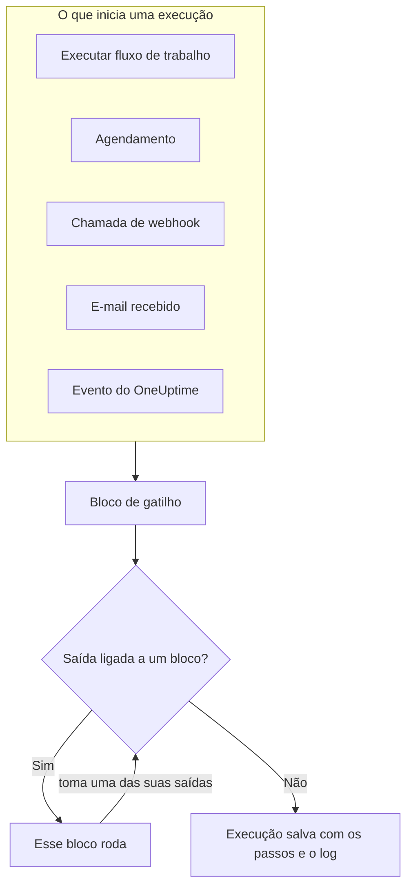
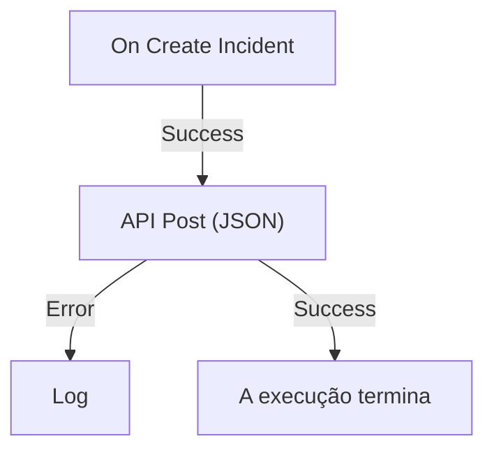

# Visão geral dos workflows

Os workflows automatizam o trabalho no OneUptime sem código. Você coloca blocos em um canvas, liga um ao outro, e o workflow roda sozinho sempre que o seu gatilho dispara: um incidente é criado, um agendamento chega ao horário, outra ferramenta chama uma URL ou chega um e-mail. Use-os para conectar o OneUptime ao resto do seu stack e para cuidar do acompanhamento de rotina enquanto você trabalha no problema em si.

:::cards
- [Criar um workflow](/docs/workflows/authoring): Crie um workflow e depois adicione, ligue e configure os blocos no canvas.
- [Gatilhos](/docs/workflows/triggers): Inicie um workflow manualmente, por agendamento, por webhook, por e-mail ou por um evento do OneUptime.
- [Componentes](/docs/workflows/components): Todos os blocos que você pode adicionar, de chamadas de API a registros do OneUptime.
- [Execuções](/docs/workflows/runs-and-logs): Veja o que cada execução fez, passo a passo.
:::

## Como um workflow funciona

Todo workflow tem três partes:

1. **Um gatilho** — o que inicia o workflow: uma execução manual, um agendamento, uma chamada de webhook, um e-mail recebido ou um evento no OneUptime, como um novo incidente. Todo workflow tem exatamente um.
2. **Componentes** — o que o workflow faz: enviar uma mensagem, chamar uma API, verificar uma condição, criar ou atualizar um registro do OneUptime.
3. **Ligações** — as linhas que você desenha de um bloco para o próximo. Elas decidem o que roda depois do quê.

Quando o gatilho dispara, o OneUptime inicia uma **execução**. Cada bloco termina tomando uma das suas saídas, como **Success** ou **Error**, **Yes** ou **No**, e só os blocos ligados a essa saída rodam em seguida. Quando nenhum bloco está ligado à saída que um bloco tomou, esse caminho termina. A execução é salva com o seu status, o caminho percorrido e o que cada bloco recebeu e devolveu.



Você monta tudo isso visualmente, em um canvas. A maioria dos workflows não precisa de código nenhum; quando algum precisa, um bloco **Run Custom JavaScript** roda algumas linhas de JavaScript.

## O que dá para fazer com workflows

- **Conectar o OneUptime às suas outras ferramentas** — publicar no Slack, Microsoft Teams, Discord, Telegram ou IRC, criar tickets no Jira ou enviar uma requisição para qualquer API do seu stack.
- **Reagir ao que acontece no OneUptime** — quando um incidente é criado, avisar o canal certo e abrir um ticket automaticamente.
- **Rodar tarefas agendadas** — a cada cinco minutos, toda noite, toda segunda de manhã.
- **Receber dados de fora** — deixar outros sistemas iniciarem um workflow chamando a URL dele ou mandando e-mail para o endereço dele.
- **Reutilizar automações comuns** — monte uma vez e inicie a partir de qualquer outro workflow com um bloco **Execute Workflow**.

## Termos principais

| Termo                  | O que significa                                                                                                    |
| ---------------------- | ------------------------------------------------------------------------------------------------------------------ |
| **Workflow**           | A automação inteira: um nome, um canvas de blocos e uma chave para ligá-la ou desligá-la.                          |
| **Gatilho**            | O primeiro bloco. Ele decide quando o workflow roda. Todo workflow tem exatamente um.                              |
| **Componente**         | Qualquer outro bloco: envia uma mensagem, faz uma requisição, verifica uma condição ou altera um registro.         |
| **Saída**              | Um ponto na parte de baixo de um bloco, como **Success** ou **Error**. As linhas que saem dele levam aos próximos blocos. |
| **Execução**           | Uma execução do workflow, salva com o status, os horários e o que cada bloco fez.                                  |
| **Variável global**    | Um valor, como uma chave de API, que você salva uma vez e usa em qualquer workflow do projeto.                     |

## Antes de começar

- **Um plano que inclua workflows.** No OneUptime Cloud, os workflows exigem o plano **Growth** ou superior, e cada plano permite um número de execuções a cada 30 dias — veja [Limites do plano](/docs/workflows/configuration#limites-do-plano). Instalações self-hosted sem cobrança não têm nenhum desses limites.
- **Permissão para montar.** Criar e alterar workflows exige **Workflow Admin**, **Project Admin** ou **Project Owner**, ou um papel personalizado com as permissões correspondentes. Um **Workflow Member** pode abrir workflows e executá-los manualmente, mas não alterá-los. Veja [Permissões](/docs/workflows/configuration#permissões).

## Onde encontrar os workflows no OneUptime

Abra **Produtos** na barra superior e escolha **Fluxos de trabalho**, em **Painéis e automação**. O menu dele tem:

- **Fluxos de trabalho** — a sua lista de workflows. Crie um novo ou abra um existente.
- **Variáveis globais** — valores compartilhados por todos os seus workflows.
- **Registros → Execuções** — o histórico de execuções de todos os workflows do projeto.
- **Configurações → Regras de Rótulos** e **Regras de proprietário** — rotule os novos workflows e atribua os proprietários deles automaticamente.
- **Avançado → Arquivado** — os workflows que você arquivou. Eles nunca rodam e ficam fora da lista; desarquive-os por aqui. Veja [Arquivar um workflow](/docs/workflows/configuration#arquivar-um-workflow).
- **Desenvolvedores** — como gerenciar os workflows com Terraform, a API ou um assistente de IA.

Abra um workflow específico e o menu dele tem:

- **Visão geral** — nome, descrição, rótulos e a chave **Habilitado**.
- **Construtor** — o canvas onde você projeta o workflow, com a chave **Habilitado** no topo.
- **Variáveis do fluxo** — valores que valem só para esse workflow.
- **Registros → Execuções** — cada execução desse workflow, com detalhes.
- **Proprietários** — as pessoas e equipes responsáveis pelo workflow.
- **Desenvolvedores** — como gerenciar esse workflow com Terraform, a API ou um assistente de IA.
- **Configurações** — duplicar, exportar e arquivar.

**Configurações** fica na seção **Avançado** do menu, junto com **Registros de auditoria** e **Excluir fluxo de trabalho**. **Avançado** e **Desenvolvedores** começam recolhidas, neste menu e em todos os outros, para que as páginas que você usa todo dia venham primeiro. Clique no nome de uma seção para mostrar as páginas dela. Ela se abre sozinha sempre que você está em uma delas.

## Monte o seu primeiro workflow

Todo workflow é montado do mesmo jeito:

:::steps
1. **Criar** — escolha um ponto de partida e depois dê um nome ao workflow. Veja [Criar um workflow](/docs/workflows/authoring).
2. **Escolher um gatilho** — manual, agendado, webhook, e-mail recebido ou um evento do OneUptime. Veja [Gatilhos](/docs/workflows/triggers).
3. **Adicionar componentes** — adicione ações ao canvas e ligue-as. Veja [Componentes](/docs/workflows/components).
4. **Ligar** — ative **Habilitado** no topo do **Construtor**. Um workflow desabilitado não roda de jeito nenhum, nem manualmente.
5. **Testar** — clique em **Executar fluxo de trabalho** no **Construtor** e acompanhe a execução enquanto ela acontece.
:::

O exemplo abaixo segue esses passos para um workflow de verdade.

## Exemplo: enviar novos incidentes para um webhook

Este workflow envia um resumo em JSON de cada novo incidente para uma URL sua — um sistema de tickets, um data warehouse, qualquer coisa que aceite um webhook — e escreve o motivo no log da execução quando a requisição falha.



> [!TIP]
> O modelo **Forward new incidents to another system** monta este mesmo workflow para você. Ele fica em **Incidentes** quando você cria um workflow.

:::steps
### Criar o workflow

Abra **Fluxos de trabalho** e clique em **Criar fluxo de trabalho**. Clique em **Começar do zero**, dê ao workflow o nome `Send new incidents to a webhook` e clique em **Criar fluxo de trabalho**.

O novo workflow abre no **Construtor**, desligado.

### Adicionar o gatilho

Clique no bloco tracejado **Choose what starts this workflow** e depois em **On Create Incident**, em **Popular**, no painel **Add Trigger**.

O gatilho ocupa o lugar do bloco tracejado. O ID que aparece nele, `incident-on-create-1`, é como os blocos seguintes se referem a ele.

### Escolher os campos do incidente

Clique no gatilho. Em **Select Fields**, marque os campos que a requisição deve levar, como o título e a descrição, e clique em **Salvar**.

O gatilho repassa o novo incidente com esses campos. Um campo que você não seleciona chega vazio.

### Adicionar o bloco de API

Clique em **Adicionar componente** e depois em **API Post (JSON)**, em **Popular**. Arraste do ponto **Success** do gatilho até o ponto superior do novo bloco.

### Preencher a requisição

Clique no bloco de API, que mostra **Click to set up**. Coloque o seu endpoint em **URL**. Em **Request Body**, escreva o JSON a enviar, usando **{ }** para inserir os campos do incidente onde precisar, e clique em **Salvar**.

```json title="Request Body"
{
  "id": "{{local.components.incident-on-create-1.returnValues.model._id}}",
  "title": "{{local.components.incident-on-create-1.returnValues.model.title}}",
  "description": "{{local.components.incident-on-create-1.returnValues.model.description}}"
}
```

Cada referência `{{…}}` é substituída pelo valor do incidente quando o workflow roda. Veja [Variáveis](/docs/workflows/variables) para a sintaxe.

### Capturar as falhas

Clique em **Adicionar componente** e depois em **Registro**. Ligue a ele o ponto **Error** do bloco de API e defina o **Value** do bloco Log como `Could not send the incident: {{local.components.api-post-1.returnValues.error}}`.

Uma requisição que falha — uma URL inacessível ou uma resposta que não é 2xx — agora segue esse caminho, e o log da execução diz por quê.

### Ligar

Ative **Habilitado** no topo do **Construtor**.

### Testar

Clique em **Executar fluxo de trabalho**, informe o **ID do incidente** de um incidente deste projeto, clique em **Run Workflow Manually** e confirme com **Run**.

Um painel **Execução do Fluxo de Trabalho** se abre e acompanha a execução. Abra o passo **API Post (JSON)** para ver o corpo que ele enviou e a resposta que recebeu.
:::

A partir de agora, cada novo incidente do projeto inicia uma execução. Você encontra todas nas [Execuções](/docs/workflows/runs-and-logs) do workflow.

> [!NOTE]
> A requisição sai do OneUptime. No OneUptime Cloud, a URL precisa ser acessível pela internet. Uma instalação self-hosted recusa endereços de rede privada, a menos que um administrador os permita — veja [Acesso de rede para fora](/docs/workflows/configuration#acesso-de-rede-para-fora).

## Como os workflows se encaixam no resto do OneUptime

- Os **monitores** detectam o problema. Os **incidentes** e os **alertas** o registram. Os **workflows** reagem a ele.
- Os **runbooks** são procedimentos de resposta que a sua equipe segue em um incidente, um alerta ou uma manutenção: passos manuais, aprovações e scripts, com pessoas envolvidas. Os workflows rodam sem supervisão. Use um [runbook](/docs/runbooks/index) quando uma pessoa precisa tomar decisões pelo caminho, e um workflow quando todos os passos são automáticos.
- As **conexões de workspace** ligam um projeto ao Slack e ao Microsoft Teams para canais de incidente e notificações. Os blocos de Slack e Microsoft Teams dos workflows não as usam: cada bloco publica por uma URL de webhook de entrada própria.

## Próximos passos

:::cards
- [Criar um workflow](/docs/workflows/authoring): Trabalhe com o canvas, os blocos e as configurações deles.
- [Variáveis](/docs/workflows/variables): Passe dados entre blocos e mantenha os segredos fora dos seus workflows.
- [Configuração e segurança](/docs/workflows/configuration): Permissões, limites e segurança antes de ir para produção.
:::
