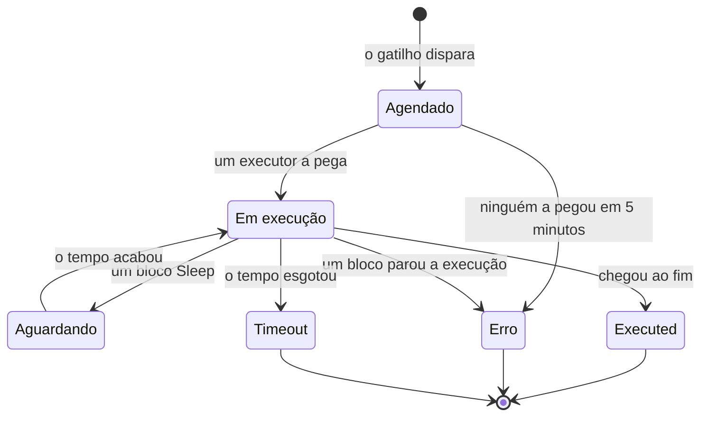

# Execuções de workflow

Toda vez que um workflow roda, o OneUptime guarda um registro do que aconteceu — quando rodou, se deu certo e o que cada bloco recebeu e devolveu. Esse registro se chama **execução**. As execuções servem para confirmar que um workflow funcionou, depurar um que não funcionou e rever a atividade passada.

:::cards
- [Status de uma execução](#status-de-uma-execução): O que significam Agendado, Aguardando, Executed e os outros status.
- [Ler uma execução](#ler-uma-execução): Siga o caminho que uma execução percorreu, bloco a bloco.
- [Solução de problemas](#solução-de-problemas): Um workflow que não rodou, um bloco que nunca rodou, um valor que chegou vazio.
:::

## Onde encontrá-las

| Página                                               | O que você vê                                                                                      |
| ---------------------------------------------------- | -------------------------------------------------------------------------------------------------- |
| **Fluxos de trabalho → Registros → Execuções**       | Todas as execuções de todos os workflows do projeto. Filtre por nome do workflow, status e data.   |
| **Fluxo de trabalho → Registros → Execuções**        | Só as execuções deste workflow. Esta tem um filtro **ID da execução** em vez de um filtro de workflow. |
| **Uma execução específica**                          | Aberta com o botão **Ver registros** em uma linha de execução — as linhas em si não são clicáveis. |

Iniciar uma execução pelo **Construtor** abre a mesma tela **Execução do Fluxo de Trabalho**, que já acompanha a execução, então você a vê acontecer em vez de procurá-la depois.

## Status de uma execução

| Status                              | O que significa                                                                                                                                                                                                                                                       |
| ----------------------------------- | --------------------------------------------------------------------------------------------------------------------------------------------------------------------------------------------------------------------------------------------------------------------- |
| **Agendado**                        | O gatilho disparou e a execução está na fila esperando um executor. Normalmente uma fração de segundo. Uma execução ainda agendada depois de 5 minutos falha: ninguém a pegou.                                                                                       |
| **Em execução**                     | O workflow está em andamento.                                                                                                                                                                                                                                         |
| **Aguardando**                      | A execução está parada em um bloco **Sleep** e vai continuar sozinha. Ela não ocupa nenhum worker enquanto espera.                                                                                                                                                   |
| **Executed**                        | A execução chegou ao fim sem falhar. Esse é o status de sucesso: o selo diz **Executed**, não «Sucesso».                                                                                                                                                              |
| **Erro**                            | Um bloco parou a execução. Também é usado quando uma execução na fila nunca é pega, quando a retomada de uma execução adormecida se perde, quando uma expressão de agendamento não pode ser resolvida e quando o workflow foi desligado ou arquivado enquanto a execução esperava em um bloco **Sleep**. |
| **Timeout**                         | A execução demorou mais do que o permitido: 2 minutos por padrão. Veja [Quanto tempo uma execução pode durar](/docs/workflows/configuration#quanto-tempo-uma-execução-pode-durar).                                                                                                 |
| **Execution Exceeded Current Plan** | O projeto esgotou as execuções de workflow dos últimos 30 dias, ou a assinatura está em atraso. A execução é registrada mas não roda. Só no OneUptime Cloud.                                                                                                       |

Um bloco que toma a saída **Error** — um bloco API que recebeu um 4xx, por exemplo — não faz a execução falhar. Os blocos ligados a **Error** rodam, e a execução ainda termina como **Executed**. O próprio passo é desenhado em vermelho, para você encontrá-lo.

## Ler uma execução

Clique em **Ver registros** em uma execução para abri-la. A tela **Execução do Fluxo de Trabalho** tem duas abas, **Etapas** e **Full Log**.

### A aba Etapas

O caminho que a execução percorreu, um cartão numerado por bloco, na ordem em que rodaram. Sem abrir nada, cada cartão mostra:

- O título e o ID do bloco, se ficou **Bem-sucedido** ou **Falhou**, e quanto tempo levou.
- Qual saída ele tomou, com o nome que ela tem no canvas, e aonde ela levou: o número e o nome do próximo passo, ou uma nota dizendo que nada está ligado a ela, então a execução ou esse ramo terminou ali. Um passo para o qual ela levou mas que nunca rodou diz **(did not run)**. A saída Error é desenhada em vermelho; Yes e No são apenas o caminho que a execução seguiu. Passe o mouse no nome da saída para ver o que ela significa.
- O erro do passo, se ele falhou, e qualquer aviso sobre ele — por exemplo, uma referência `{{…}}` que não resolveu em nada.

Abra um cartão para ver dois blocos de detalhes:

| Bloco        | O que mostra                                                                                                                                                                                                    |
| ------------ | --------------------------------------------------------------------------------------------------------------------------------------------------------------------------------------------------------------- |
| **Received** | As configurações que o bloco recebeu, pelo nome e na ordem da lista de configurações dele, depois de todas as variáveis serem preenchidas. Uma configuração que faz referência a outro passo ou a uma variável mostra a referência ao lado do valor em que ela se transformou, e **Did not resolve** quando ela não virou nada. |
| **Returned** | O que ele produziu, com o ID de cada valor (a última parte de uma referência `returnValues`). Listas e objetos aparecem com recuo.                                                                             |

Os passos com falha, os passos com aviso e o único passo de uma execução já começam abertos. O contador da aba **Etapas** fica vermelho quando algo falhou e âmbar quando um passo tem um aviso.

Algumas execuções são lidas de outro jeito:

- **Um teste de um só passo.** Uma execução iniciada com **Run just this step** diz **Only this step ran** no topo. Os passos anteriores não rodaram, então os valores que ele lê deles estão faltando (espere um aviso **Did not resolve** para esses), e os passos seguintes dizem **(not run in this test)**. Use **Executar fluxo de trabalho** para testar o caminho inteiro.
- **Uma execução que parou entre passos.** Se a execução parou por um motivo que nenhum passo explica — o tempo esgotou entre passos, ou ela falhou antes do primeiro passo —, o caminho termina com **The run stopped here** e o motivo.
- **Uma execução adormecida.** Uma execução que espera em um bloco **Sleep** termina com **Sleeping** e o horário em que ela continua sozinha; os passos depois do Sleep dizem **(not run yet)**.

O ID abaixo do título de cada passo é exatamente o que vai em uma referência `{{local.components.<id>.returnValues.…}}`, o que torna este o jeito mais rápido de acertar uma referência.

Os valores mostrados são o que o bloco recebeu, depois de as variáveis serem preenchidas e antes de o bloco fazer qualquer coisa com eles, com duas exceções: segredos e campos que o bloco marca como sensíveis são ocultados, e um valor com mais de 4.000 caracteres é encurtado com "… (truncated)". Uma execução guarda os últimos 100 passos; uma execução longa ou retomada muitas vezes mostra uma nota âmbar onde os mais antigos foram descartados. Execuções registradas antes de os nomes das saídas serem guardados mostram a saída pelo ID, sem aonde ela levou.

### A aba Full Log

O log bruto, linha a linha, que o executor escreveu, incluindo tudo o que os próprios blocos registraram, como o valor de um bloco **Log** ou o `console.log` de um script. Use-o quando a aba Etapas não explicar a falha.

## Copiar e baixar uma execução

No topo da tela **Execução do Fluxo de Trabalho**, ao lado do botão de fechar, **Copiar log** coloca todo o **Full Log** na sua área de transferência, pronto para colar em um chat ou em um ticket. **Baixar** salva a execução como arquivo:

| Download                             | O que você recebe                                                                                                                                                                                                                      |
| ------------------------------------ | -------------------------------------------------------------------------------------------------------------------------------------------------------------------------------------------------------------------------------------- |
| **Baixar log**                       | Um arquivo `.txt` com o log completo exatamente como o executor o escreveu, por mais longo que seja, sob um cabeçalho curto: o nome e o ID do workflow, o ID da execução, o status e quando ela foi agendada, começou e terminou.       |
| **Baixar execução como JSON**        | Um arquivo `.json` com os mesmos fatos como dados, os passos que a aba **Etapas** mostra (o que cada um recebeu e devolveu, e qual saída tomou) e o log como uma lista de linhas. Os passos têm o mesmo formato em que a API devolve o `stepTrace` de uma execução e, como na aba **Etapas**, são os últimos 100 da execução. O log está sempre completo. |

Os mesmos dois downloads ficam no menu **⋯** de cada execução nas duas listas de execuções, então você pode salvar uma execução sem abri-la. Uma execução que você iniciou pelo **Construtor** pode ser copiada ou baixada enquanto ainda está em andamento; você recebe o que ela registrou até ali.

Os arquivos recebem o nome do workflow, da execução e de quando ela começou, em UTC, então uma pasta com eles fica ordenada por workflow e depois por horário: `nightly-sync-run-<run id>-2026-09-30T10-00-01.txt`.

Um download não contém nada que você já não pudesse ler na execução. Segredos e campos que um bloco marca como sensíveis são ocultados quando a execução é registrada, então também ficam ocultos no arquivo, e qualquer pessoa que pode abrir uma execução pode baixá-la.

## Solução de problemas

:::details O meu workflow não rodou
1. Confira se o workflow está **Habilitado**: a chave fica no topo do **Construtor** dele, que avisa acima do canvas quando o workflow está desligado. Os novos workflows começam desabilitados, e um workflow desabilitado recusa todas as execuções — inclusive as manuais. Uma chamada de webhook para ele recebe HTTP 400 com uma mensagem dizendo como ligá-lo.
2. Para um gatilho de evento do OneUptime, confirme que o evento aconteceu de fato: abra o registro e veja o histórico dele. Um gatilho **On Update** com **Listen on** só dispara quando um desses campos mudou.
3. Para um gatilho de webhook, confirme que o outro sistema está enviando para a URL certa. A maioria das ferramentas registra quando envia um webhook — confira lá.
4. Para um gatilho agendado, confirme que a expressão cron corresponde ao horário que você espera. Os agendamentos rodam em UTC.

Se a execução aparece, com o status **Execution Exceeded Current Plan**, o projeto esgotou as execuções de workflow dos últimos 30 dias, ou a assinatura está em atraso. O log da execução informa a contagem e o limite do seu plano. Isso só vale para o OneUptime Cloud.
:::

:::details Um bloco seguinte nunca rodou
Um bloco que não roda costuma ser um problema de ligação. Abra o **Construtor** e verifique:

- A saída do bloco anterior está ligada à entrada deste bloco?
- O bloco anterior tomou uma saída diferente da esperada — **Error** em vez de **Success**, ou **No** em vez de **Yes**? A aba **Etapas** diz qual saída ele tomou e aonde ela levou, ou que nada está ligado a ela.
:::

:::details Um valor chegou vazio, ou como texto {{…}}
Abra a execução e olhe o passo. Uma referência que não resolveu aparece no próprio passo como aviso, e a configuração dela no bloco **Received** fica marcada como **Did not resolve**.

- Se você vê o texto literal `{{local.components.…}}`, a referência não resolveu. Normalmente é um erro de digitação no ID do componente ou no ID do valor de retorno — lembre-se de que é o **Identifier** do bloco, não o nome exibido nele. Confira também a grafia do próprio `local.components`: `{{local.componets.api-get-1.returnValues.response-body}}` é enviado como texto literal e a execução ainda informa **Executed**. Se a execução foi um teste com **Run just this step**, o bloco anterior nem rodou — rode o workflow inteiro.
- Se você vê **Empty text**, o bloco anterior rodou mas não produziu esse campo.

O mesmo aviso aparece na aba **Full Log**, em uma linha que começa com `Warning:`.
:::

:::details Funciona quando rodo manualmente, mas não pelo gatilho
Abra o **Construtor**, clique em **Executar fluxo de trabalho** e preencha os campos do gatilho com valores parecidos com o que o gatilho real envia. Depois compare os valores **Received** dessa execução com os da execução real, lado a lado. A diferença costuma estar no nome ou no tipo de um único campo.
:::

## Executar um workflow de novo

Não existe um botão «tentar esta execução de novo». Execuções antigas nunca são refeitas automaticamente, porque os efeitos colaterais delas — mensagens no Slack, chamadas de API, tickets — podem não ser seguros de repetir. Para refazer o trabalho, corrija o workflow e deixe o próximo gatilho real dispará-lo, ou abra o **Construtor** e clique em **Executar fluxo de trabalho** com os mesmos valores.

## Por quanto tempo as execuções são guardadas?

No OneUptime Cloud, as execuções são guardadas por **30 dias** e depois excluídas — por isso as duas listas de execuções dizem que cobrem os últimos 30 dias. Instalações self-hosted guardam as execuções até você excluí-las; se um workflow roda com muita frequência e enche o seu histórico, desligue-o ou exclua-o.

Execuções registradas antes de o rastreamento de passos existir não têm conteúdo em **Etapas** e mostram só o **Full Log**.

## Próximos passos

:::cards
- [Configuração e segurança](/docs/workflows/configuration): Limites de tempo, limites do plano e o que fica oculto nos logs.
- [Variáveis](/docs/workflows/variables): A sintaxe de referência que os seus blocos usam.
- [Componentes](/docs/workflows/components): O que cada bloco devolve e quando toma cada saída.
:::
