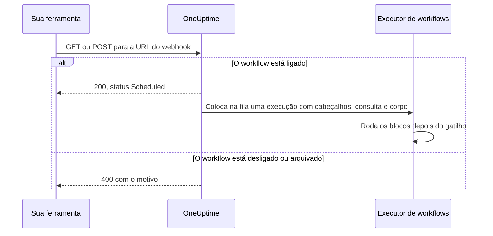
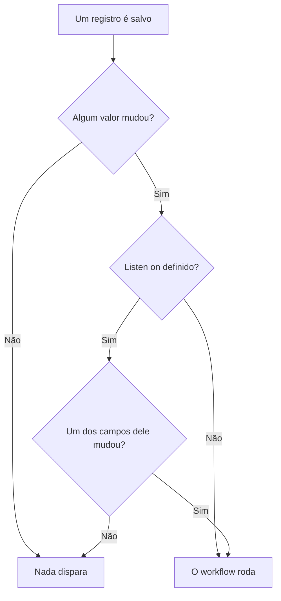

# Gatilhos de workflow

Um gatilho é o primeiro bloco de um workflow: ele decide quando o workflow roda. Todo workflow tem exatamente um gatilho. Você escolhe entre cinco tipos.

:::cards
- [Manual](#manual): Inicie o workflow pelo Construtor ou a partir de outro workflow.
- [Agendamento](#schedule): Rode-o em um agendamento recorrente, escrito como expressão cron.
- [Webhook](#webhook): Deixe outro sistema iniciá-lo chamando uma URL.
- [E-mail recebido](#incoming-email): Inicie-o com cada e-mail enviado ao endereço dele.
- [Gatilhos de eventos do OneUptime](#gatilhos-de-eventos-do-oneuptime): Reaja quando um registro é criado, atualizado ou excluído.
:::

Para adicionar o gatilho, clique no bloco tracejado **Choose what starts this workflow** no canvas de um workflow novo. Para trocá-lo, exclua o bloco do gatilho e o bloco tracejado volta. Veja [Criar um workflow](/docs/workflows/authoring#adicionar-blocos).

## Qual gatilho devo usar?

| Se você quer…                                  | Escolha                     |
| ---------------------------------------------- | --------------------------- |
| Clicar em um botão para rodar o workflow       | **Manual**                  |
| Rodar em um agendamento recorrente             | **Agendamento**             |
| Que outro sistema envie dados                  | **Webhook**                 |
| Iniciar a partir de um e-mail                  | **Incoming Email**          |
| Reagir a algo dentro do OneUptime              | **Evento do OneUptime**     |

Um workflow só pode ter um gatilho. Se você precisa de duas formas de iniciar a mesma automação, monte a lógica compartilhada em um workflow com um gatilho **Manual** e inicie-o a partir de dois workflows «invólucro» leves com um bloco **Execute Workflow**.

## Manual

Rode o workflow quando quiser: clique em **Executar fluxo de trabalho** na página **Construtor**, preencha o **JSON** do gatilho, clique em **Run Workflow Manually** e confirme com **Run**. Outro workflow também pode iniciá-lo, com um bloco **Execute Workflow**.

Bom para: automações de um clique para as quais você quer um botão, como «girar esta chave» ou «enviar um alerta de teste», e lógica que você compartilha entre workflows.

**Returns**: **JSON** — aquilo com que a execução foi iniciada.

- A partir de **Executar fluxo de trabalho**, é o JSON que você digitou, como texto. Para ler um campo dele, passe-o antes por um bloco **Text to JSON**.
- A partir de um bloco **Execute Workflow**, cada chave dos **Arguments** do bloco é um valor próprio. Com `{"customerId": "42"}`, um bloco seguinte lê `{{local.components.manual-1.returnValues.customerId}}`, onde `manual-1` é o ID do gatilho Manual.

## Schedule

Rode o workflow em um agendamento recorrente. Defina a frequência em **Schedule at**: escolha um dos **Common schedules**, escreva uma expressão de **Custom cron** ou escolha uma **Variável** que contenha uma. Abaixo do campo, o agendamento é descrito em palavras, com as **Next runs**.

Bom para: limpeza noturna, sincronização de hora em hora, relatórios semanais.

Os horários estão em UTC, então converta a partir do seu fuso horário ao escolher a hora. As cinco partes de uma expressão cron são o minuto, a hora, o dia do mês, o mês e o dia da semana:

| Expressão     | Roda                                   |
| ------------- | -------------------------------------- |
| `*/5 * * * *` | A cada 5 minutos.                      |
| `0 * * * *`   | De hora em hora, na hora cheia.        |
| `0 0 * * *`   | Todo dia à meia-noite UTC.             |
| `0 9 * * 1-5` | Todo dia útil às 9:00 UTC.             |
| `0 9 * * 1`   | Toda segunda-feira às 9:00 UTC.        |

Nada é agendado enquanto o workflow está desligado. Um agendamento **Variável** lê uma variável do workflow ou global, como `{{local.variables.schedule}}`. Se ela não resultar em uma expressão cron válida, o workflow não é agendado, e uma execução com falha na lista de execuções dele explica por quê.

Para testar o workflow sem esperar o agendamento, clique em **Executar fluxo de trabalho** no **Construtor**: ele inicia uma execução na hora.

## Webhook

O OneUptime dá ao workflow uma URL própria. Qualquer coisa que chame a URL inicia o workflow, repassando os cabeçalhos, os parâmetros de consulta e o corpo da requisição.

Bom para: receber no OneUptime dados de outra ferramenta — callbacks de CI/CD, alertas de outro monitoramento, cadastros no seu CRM.

Para obter a URL, clique no gatilho Webhook no canvas. A URL fica no topo das configurações dele, com um botão **Copiar URL**, os métodos que ela aceita e um comando `curl` para colar em um terminal e testar:

```bash
curl -X POST "https://oneuptime.example.com/workflow/trigger/<secret key>" \
  -H "Content-Type: application/json" \
  -d '{"message": "Hello"}'
```

A URL aceita `GET` e `POST`. Quem chama recebe uma confirmação rápida, `{"status": "Scheduled"}` — o workflow em si roda em segundo plano, então quem chama nunca vê o que ele faz. Uma chamada a um workflow desligado ou arquivado é recusada com HTTP 400 e o motivo.



**Returns**:

| Valor                    | O que contém                                                                                                          |
| ------------------------ | --------------------------------------------------------------------------------------------------------------------- |
| **Request Headers**      | Todos os cabeçalhos da requisição, pelo nome em minúsculas, como `content-type`.                                      |
| **Request Query Params** | Os parâmetros da query string da URL, pelo nome.                                                                      |
| **Request Body**         | O corpo que quem chamou enviou. Um corpo JSON, enviado com `Content-Type: application/json`, pode ser lido campo a campo. |

Leia um campo acrescentando o nome dele à referência, como em `{{local.components.webhook-1.returnValues.request-body.message}}`.

Depois que chega uma requisição, o seletor de valores de cada bloco após o gatilho sabe o que ela continha: lista os campos do corpo, os cabeçalhos e os parâmetros de consulta, cada um com o seu conteúdo, para você escolher `incident.title` em vez de digitar um caminho. Até lá, ele avisa que nenhuma requisição chegou e oferece **Copy test request**, um comando `curl` para a URL; os campos aparecem assim que a execução iniciada por essa requisição terminar. Veja [Usar valores de blocos anteriores](/docs/workflows/authoring#usar-valores-de-blocos-anteriores).

Para testar o workflow sem a outra ferramenta, clique em **Executar fluxo de trabalho** no **Construtor** e digite cabeçalhos, parâmetros de consulta e um corpo.

### Mantenha a URL em sigilo

A última parte da URL é a chave secreta do workflow, e qualquer pessoa com a URL pode iniciar o workflow. Por isso a chave fica oculta até você clicar em **Mostrar**, e **Copiar URL** copia a URL inteira sem mostrá-la.

Se a URL vazar, clique em **Redefinir URL** no mesmo lugar: o workflow recebe uma URL nova e a antiga para de funcionar na hora, então atualize tudo o que a chama. Só quem pode editar o workflow pode ver ou redefinir a URL dele — veja [Segurança do webhook](/docs/workflows/configuration#segurança-do-webhook).

> [!WARNING]
> Trate a URL como uma senha. Qualquer pessoa com ela pode iniciar o seu workflow, sem fazer login.

## Incoming Email

O OneUptime dá ao workflow um endereço de e-mail próprio. Cada e-mail enviado a esse endereço inicia o workflow, repassando o e-mail: quem enviou, para quem era, o assunto, o texto e o HTML, os cabeçalhos e os nomes dos anexos.

Bom para: agir sobre e-mails de sistemas que não conseguem chamar um webhook — alertas de ferramentas de monitoramento antigas, avisos de status de um fornecedor, o relatório que um job noturno manda por e-mail.

Para obter o endereço, clique no gatilho Incoming Email no canvas. O endereço fica no topo das configurações dele, com um botão **Copiar endereço**. Passe-o para o que deve iniciar o workflow: uma ferramenta que só sabe enviar e-mail, as configurações de notificação de um fornecedor ou uma regra de encaminhamento na sua própria caixa de correio.

Cada e-mail inicia a sua própria execução. O e-mail chega ao workflow quer o endereço esteja em Para ou em Cc, quer seja uma cópia oculta ou passe por uma regra de encaminhamento. Um e-mail que cita o endereço duas vezes inicia uma única execução.

**Returns**:

| Valor           | O que contém                                                                                            |
| --------------- | ------------------------------------------------------------------------------------------------------- |
| **From**        | O endereço do remetente.                                                                                |
| **To**          | Todos os destinatários do e-mail, em uma linha, como `ops@example.com, oncall@example.com`.             |
| **CC**          | Todos os destinatários em cópia, em uma linha.                                                          |
| **Subject**     | O assunto.                                                                                              |
| **Body**        | O texto simples do e-mail.                                                                              |
| **HTML Body**   | O HTML do e-mail, quando houver. Body e HTML Body são cortados em 1 MB cada.                            |
| **Headers**     | Todos os cabeçalhos do e-mail, pelo nome em minúsculas, como `message-id`.                              |
| **Attachments** | O nome, o tipo e o tamanho de cada arquivo anexado. Os arquivos em si não são guardados.                |
| **Received At** | Quando o OneUptime recebeu o e-mail.                                                                    |

Depois que chega um e-mail, o seletor de valores de cada bloco após o gatilho sabe o que ele continha: lista cada cabeçalho e cada anexo do e-mail, com o seu conteúdo, para você escolher `headers.message-id` em vez de digitar um caminho. Até lá, ele avisa que nenhum e-mail chegou ainda ao endereço. Veja [Usar valores de blocos anteriores](/docs/workflows/authoring#usar-valores-de-blocos-anteriores).

Para testar o workflow sem enviar um e-mail, clique em **Executar fluxo de trabalho** na página **Construtor** e preencha um remetente, um assunto e um corpo. Os valores que você deixar de fora chegam vazios.

O e-mail só inicia o workflow enquanto ele está ligado. E-mail para um workflow desligado é ignorado, assim como e-mail para um workflow cujo gatilho não é mais Incoming Email.

### Mantenha o endereço em sigilo

A parte do endereço antes do `@` contém a chave secreta do workflow, e qualquer pessoa com o endereço pode iniciar o workflow. Por isso a chave fica oculta até você clicar em **Mostrar**, e **Copiar endereço** copia o endereço inteiro sem mostrá-lo.

Se o endereço vazar, clique em **Redefinir endereço** no mesmo lugar: o workflow recebe um endereço novo, e e-mails para o antigo passam a ser ignorados, então passe o novo para tudo o que envia e-mail ao workflow. Só quem pode editar o workflow pode ver ou redefinir o endereço dele — veja [Segurança do e-mail recebido](/docs/workflows/configuration#segurança-do-e-mail-recebido).

> [!WARNING]
> Qualquer pessoa pode colocar qualquer remetente em um e-mail, então **From** não prova quem o enviou. Verifique algo que só o remetente real saiba antes que um passo faça algo importante.

> [!NOTE]
> Em uma instalação self-hosted, o OneUptime recebe e-mails por meio de um provedor de e-mail de entrada que o seu administrador configura — veja [E-mail de entrada do SendGrid](/docs/self-hosted/sendgrid-inbound-email). Até lá, o gatilho não tem endereço, e as configurações dele avisam.

## Gatilhos de eventos do OneUptime

Quase tudo no OneUptime — monitores, incidentes, alertas, eventos de manutenção agendada, páginas de status, políticas de plantão, equipes — pode disparar um workflow. Cada um oferece até três eventos:

- **On Create** — dispara quando um novo é adicionado.
- **On Update** — dispara quando um é alterado. Salvar um registro com os valores que ele já tem, como um formulário salvo sem alterações ou uma chave enviada na posição em que já estava, não é uma alteração e não o dispara.
- **On Delete** — dispara quando um é excluído.

É assim que você monta «quando X acontecer no OneUptime, faça Y» sem precisar ficar verificando em um loop.

**On Update** pode ser restrito a alguns campos com **Listen on**: aí ele só dispara quando uma atualização muda um deles, para qualquer valor — desligar uma chave ou limpar um campo conta.



**On Create** e **On Update** repassam o registro ao próximo bloco, com os campos que você escolhe no **Select Fields** do gatilho. Por exemplo, o gatilho **Incident → On Create** repassa o novo incidente, então o próximo bloco pode ler o título, a descrição, a gravidade ou qualquer outro campo que você selecionou, como `{{local.components.incident-on-create-1.returnValues.model.title}}`. Um campo que você não selecionou chega vazio.

**On Delete** repassa só o ID do registro excluído: o registro já não existe quando o workflow roda, então os outros campos dele não podem ser lidos.

Para testar um gatilho de evento sem esperar o evento, clique em **Executar fluxo de trabalho** no **Construtor** e informe o ID de um registro existente, como um **ID do incidente**. A execução lê esse registro com os campos que você selecionou.

### Os eventos mais usados

| Recurso                                   | O que as equipes fazem com ele                                                            |
| ----------------------------------------- | ----------------------------------------------------------------------------------------- |
| **Incidente**                             | Reagir quando um incidente é declarado, atualizado (reconhecido, resolvido) ou excluído.  |
| **Alerta**                                | Os mesmos três eventos, para alertas.                                                     |
| **Monitor**                               | Reagir quando um monitor é adicionado, editado ou removido.                               |
| **Agendado Manutenção Evento**            | Anunciar automaticamente uma janela de manutenção quando ela é agendada.                  |
| **Página de status Assinante**            | Dar as boas-vindas a quem assina uma página de status.                                    |
| **Política de plantão**                   | Sincronizar as mudanças da política com outro sistema de escalas.                         |

No painel **Add Trigger**, eles ficam em **OneUptime resources**: clique no recurso e depois no gatilho. **Browse all resources** tem todos, e a caixa de busca encontra um gatilho a partir de algumas palavras, como `incident created`.

## Próximos passos

:::cards
- [Componentes](/docs/workflows/components): As ações que você adiciona depois do gatilho.
- [Variáveis](/docs/workflows/variables): Leia nos blocos seguintes o que o gatilho repassou.
- [Execuções](/docs/workflows/runs-and-logs): Confirme que o gatilho disparou e veja o que ele trouxe.
:::
