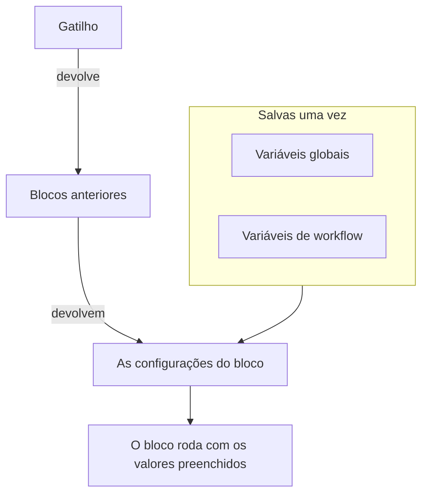
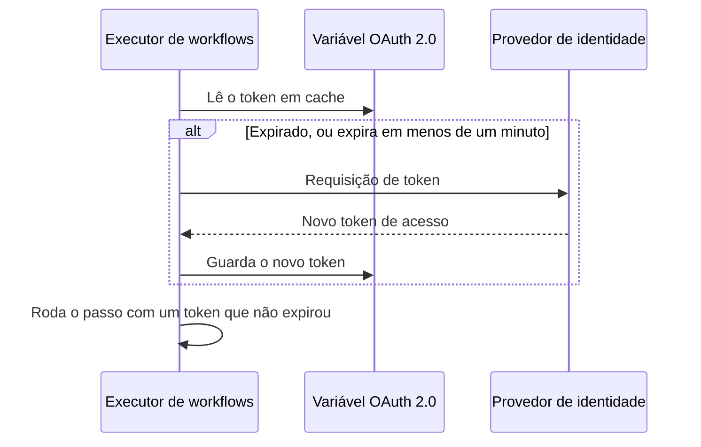

# Variáveis de workflow

As variáveis são o jeito como os dados se movem por um workflow: do gatilho para o primeiro bloco, de um bloco para o próximo, e dos valores que você salva uma vez para cada bloco que precisa deles. A configuração de um bloco lê um valor com uma referência entre chaves duplas, e o executor a preenche logo antes de o bloco rodar.

| Valor                          | De onde vem                                                          | Como um bloco o lê                                    |
| ------------------------------ | -------------------------------------------------------------------- | ----------------------------------------------------- |
| **Variável global**            | Salva em **Fluxos de trabalho → Variáveis globais**                  | `{{global.variables.NAME}}`                          |
| **Variável de workflow**       | Salva na página **Variáveis do fluxo** de um workflow                | `{{local.variables.NAME}}`                           |
| **O valor de um bloco anterior** | O que o gatilho ou um bloco anterior devolveu nesta execução       | `{{local.components.BLOCK_ID.returnValues.VALUE_ID}}` |



Você raramente digita uma referência. Clique em **{ }** no fim de uma configuração, ou digite `{{` nela, e escolha o valor em uma lista. Veja [Usar valores de blocos anteriores](/docs/workflows/authoring#usar-valores-de-blocos-anteriores).

## Variáveis globais

Valores de todo o projeto que você salva uma vez e reutiliza em todos os workflows: chaves de API, URLs, nomes de canais — qualquer coisa que você não queira copiar em dez workflows diferentes.

:::steps
### Abrir as variáveis globais

Vá em **Fluxos de trabalho → Variáveis globais** e clique em **Criar: Fluxo de trabalho Variável**.

### Dar um nome à variável

Na etapa **Variável**, preencha:

- **Nome** — como você vai se referir a ela. Pelo menos dois caracteres, sem espaços, e só letras, números, hífens e sublinhados. `UPPER_SNAKE_CASE` é um bom hábito porque se destaca nos seus blocos.
- **Descrição** — opcional, texto livre para lembrar para que ela serve.

Clique em **Próximo**.

### Dar um valor a ela

Na etapa **Valor**, preencha:

- **Conteúdo** — o valor em si. É um campo de texto longo, então valores de várias linhas funcionam.
- **Segredo** — quando ligado, o valor é apagado dos logs de execução e dos rastros dos passos.

Clique em **Criar: Fluxo de trabalho Variável**. Para mudar o nome ou a descrição antes disso, clique em **Variável** na lista de etapas ao lado do formulário (mostrada em telas largas); o que você digitou em qualquer das etapas é mantido.
:::

Use uma variável global em qualquer workflow com:

```text
{{global.variables.NAME}}
```

Por exemplo, se você salvou a sua chave do PagerDuty como `PAGERDUTY_KEY`, qualquer bloco pode usá-la como `{{global.variables.PAGERDUTY_KEY}}` — o editor guarda a referência, e o log do workflow apaga o valor secreto resolvido.

A lista mostra o nome e a descrição de cada variável. Clique em **Visualizar** em uma linha para abrir a página da variável. Ela mostra se a variável é estática ou OAuth 2.0, e é onde você faz todo o resto:

| Botão                                          | O que faz                                                                                                                                        |
| ---------------------------------------------- | ------------------------------------------------------------------------------------------------------------------------------------------------ |
| **Editar: Variável**                           | Altera o nome, a descrição e — para uma variável estática que ainda não é secreta — a marca de segredo. Uma vez secreta, uma variável continua secreta. |
| **Update Content**                             | Substitui um valor estático. O conteúdo salvo não pode ser lido de volta, então você digita o novo valor inteiro.                                |
| **Use in Workflows**                           | Mostra a referência exata para colar nos seus blocos, com um botão de copiar.                                                                    |
| **Excluir: Fluxo de trabalho Variável**        | Exclui a variável, depois de pedir confirmação. A confirmação nomeia a variável, para você conferir que é a certa.                               |

Para criar uma variável de **token de acesso OAuth 2.0** em vez disso, abra o menu **Mais** (**⋯**) ao lado de **Criar: Fluxo de trabalho Variável** e escolha **Create OAuth 2.0 Variable**. As variáveis OAuth 2.0 têm [uma seção própria](#variáveis-oauth-20-tokens-que-se-renovam-sozinhos) mais abaixo. O tipo de uma variável não pode ser alterado depois de salvo.

Você também pode atualizar uma variável pela API, o que é explicado [no fim desta página](#atualizando-uma-variável-a-partir-de-um-workflow). Variáveis globais e de workflow são um recurso do plano Growth.

## Variáveis locais de workflow

Variáveis restritas a um workflow, gerenciadas em **Variáveis do fluxo** no menu desse workflow. Elas funcionam como as variáveis globais: **Criar: Fluxo de trabalho Variável** cria uma variável estática, o menu **Mais** (**⋯**) cria uma variável OAuth 2.0 e **Visualizar** abre a página de uma variável. Faça referência a elas com:

```text
{{local.variables.NAME}}
```

Use uma para um valor de que só esse workflow precisa, como a URL de webhook do Slack de um modelo. Os modelos que pedem configurações as salvam como variáveis de workflow, para você poder alterá-las depois sem editar os blocos.

## Variáveis OAuth 2.0 (tokens que se renovam sozinhos)

Um bearer token colado em uma variável estática funciona até expirar, normalmente em menos de uma hora. Depois disso, cada execução que o usa falha com `401 Unauthorized` até alguém colar um novo. Uma variável de **token de acesso OAuth 2.0** guarda o que a troca de tokens OAuth precisa, em vez do token em si, e o OneUptime mantém o token atualizado.

Você a usa exatamente como qualquer outra variável:

```http
Authorization: Bearer {{global.variables.CRM_API_TOKEN}}
```

### Como o token continua válido



- Na primeira vez que um workflow usa a variável, o OneUptime pede um token de acesso ao endpoint de tokens do seu provedor de identidade e o guarda.
- Antes de cada passo que faz referência à variável, o executor verifica o token. Se ele expirou, ou expira no próximo minuto, um novo é obtido antes de o passo rodar. O componente sempre recebe um token que não expirou, por mais tempo que a variável tenha ficado sem uso e por mais que a execução dure.
- Só os passos que de fato fazem referência à variável provocam uma renovação. Uma execução que nunca usa uma variável nunca obtém o token dela, e não falha porque esse provedor está fora do ar.
- Quando muitas execuções precisam de um token novo no mesmo momento, uma delas o obtém e as outras usam esse.
- Se o provedor não diz quando um token expira (sem `expires_in`, e o token não é um JWT com uma claim `exp`), o OneUptime obtém um novo uma vez por execução e o compartilha entre os passos dessa execução.

### Tipos de concessão

| Tipo de concessão              | Use para                                                                                                                                                                                                                                            |
| ------------------------------ | --------------------------------------------------------------------------------------------------------------------------------------------------------------------------------------------------------------------------------------------------- |
| **Client Credentials**         | O OneUptime entra como o seu aplicativo. A escolha comum para APIs de servidor para servidor como o Microsoft Graph, as APIs do Auth0 ou do Okta, ou um serviço interno atrás do Keycloak.                                                         |
| **Token de atualização**       | Acesso delegado em nome de um usuário. Autorize o aplicativo uma vez (por exemplo no OAuth playground do seu provedor ou com o Postman) e cole o refresh token que você receber. O OneUptime o troca por tokens de acesso, e salva cada novo refresh token se o seu provedor os rotacionar. Um cliente público sem client secret também funciona. |

### Criar uma

**Create OAuth 2.0 Variable** pede uma coisa por etapa:

1. **Variável**: o nome pelo qual os workflows se referem a ela, e uma descrição.
2. **Provedor**: escolha o seu **Provedor de identidade** e o OneUptime preenche a **URL do token** dele:

   | Provedor de identidade | URL do token que ele preenche |
   |---|---|
   | Microsoft Entra ID | `https://login.microsoftonline.com/{tenant-id}/oauth2/v2.0/token` |
   | Google | `https://oauth2.googleapis.com/token` |
   | Okta | `https://{your-domain}/oauth2/default/v1/token` |
   | Auth0 | `https://{your-domain}/oauth/token` |

   Substitua a parte entre chaves pelo seu próprio valor, como o ID do diretório (tenant) ou o seu domínio do Okta. O formulário não avança enquanto a URL tiver uma. Para qualquer outro provedor, escolha **Outro provedor** e informe você mesmo o endpoint de tokens dele. Depois escolha o **Tipo de concessão**. Escolher o Google seleciona **Token de atualização**, porque os clientes OAuth do Google não podem usar Client Credentials. O provedor só preenche o formulário; ele não é salvo com a variável.
3. **Credenciais**: o **Client ID** e o **Client Secret** do aplicativo que você registrou no provedor e, para o tipo Refresh Token, o **Token de atualização**. Um cliente público no tipo Refresh Token pode deixar o client secret vazio.
4. **Avançado**, tudo opcional:
   - **Escopo**: separado por espaços. Deixe vazio para receber os escopos padrão do provedor. Para Client Credentials, o Microsoft Entra ID precisa de um escopo terminado em `/.default` (como `https://graph.microsoft.com/.default`) e o Okta precisa de um escopo personalizado.
   - **Parâmetros adicionais**: campos de formulário extras para a requisição de token, como `audience` para o Auth0 (necessário para Client Credentials) ou `resource` para o Azure AD v1. Qualquer pessoa que pode ler a variável pode lê-los, então não coloque segredos aqui.
   - **Autenticação do cliente**: se o client ID e o secret vão em um cabeçalho HTTP Basic (o padrão) ou no corpo da requisição. Se o seu provedor responder `invalid_client`, tente a outra opção.

Abaixo de alguns campos, o formulário acrescenta uma linha de ajuda para o provedor que você escolheu, por exemplo onde o Microsoft Entra ID mostra o seu tenant ID, e que o client secret dele é o **Value** do segredo, não o **Secret ID**.

Quando você salva uma nova variável OAuth 2.0, o OneUptime obtém o primeiro token dela na hora e diz o que o provedor respondeu. Um erro de digitação no secret ou na URL aparece nesse momento, não horas depois em uma execução com falha. Obter um token grava na variável, então isso exige permissão para editar variáveis de workflow; se você pode criar variáveis mas não editá-las, a primeira execução de workflow que usar a variável obtém o token dela.

A página da variável (clique em **Visualizar** na linha dela) tem um cartão **OAuth 2.0 Settings**. **Editar definições** percorre as mesmas etapas **Provedor** (URL do token), **Credenciais** (client ID) e **Avançado** (escopo, parâmetros adicionais, autenticação do cliente). **Próximo** avança e **Salvar alterações** fica na última etapa. Todas as etapas já vêm preenchidas, então a lista de etapas ao lado do formulário abre qualquer uma delas: altere uma configuração na etapa dela, depois abra a última etapa e salve. O tipo de concessão fica fixo depois de salvo.

### O cartão Token de acesso

O cartão **Token de acesso** na página de uma variável OAuth 2.0 mostra um destes status:

| Status                     | O que significa                                                                                                                      |
| -------------------------- | ------------------------------------------------------------------------------------------------------------------------------------ |
| **Valid**                  | O token em cache ainda não expirou.                                                                                                  |
| **Expirado**               | Normal em uma variável que nenhum workflow usou recentemente. A próxima execução que a usar obtém um token novo.                     |
| **Ainda não obtido**       | Nenhum token foi obtido desde que a variável foi criada ou as configurações dela mudaram.                                            |
| **No expiry reported**     | O provedor não disse quando o token expira, então cada execução obtém um novo.                                                       |
| **Refresh failed**         | A última tentativa de obter um token falhou. O motivo do provedor aparece por inteiro, com quando aconteceu. A próxima renovação bem-sucedida o limpa. |

**Atualizar agora**, abaixo do status, obtém um token novo na hora. Use-o para conferir configurações novas sem rodar um workflow. **Update Credentials**, no cartão **OAuth 2.0 Settings**, substitui o client secret ou o refresh token e depois obtém um token com eles. Alterar qualquer configuração (URL do token, client ID, escopo e assim por diante) descarta o token em cache, então a próxima execução obtém um com as configurações novas.

### Quando o provedor diz não

O passo que precisava do token falha antes de rodar, e o log da execução nomeia a variável e cita a resposta do provedor, por exemplo `Could not get an OAuth 2.0 access token for {{global.variables.CRM_API_TOKEN}}: The token endpoint refused the request (HTTP 400): invalid_grant - Token has been expired or revoked.` O mesmo motivo aparece no cartão **Token de acesso** da variável. `invalid_grant` em uma variável Refresh Token quase sempre significa que o próprio refresh token expirou ou foi revogado, e a solução é **Update Credentials**.

Se a renovação falha enquanto o token em cache ainda não expirou de fato (ele só estava dentro da margem de um minuto), o passo segue com o token em cache e o log avisa.

### Segurança

- As variáveis OAuth 2.0 são sempre secretas. O token de acesso é substituído por `[REDACTED]` nos logs de execução e nos rastros dos passos, inclusive um token que foi trocado no meio de uma execução.
- O client secret, o refresh token e o token de acesso são criptografados no banco de dados e nunca podem ser lidos de volta pela API ou pelo dashboard. **Atualizar agora** informa quando o novo token expira, nunca o token.
- A URL do token precisa ser `http` ou `https`. Requisições a endereços de loopback, link-local e de metadados de nuvem são recusadas. No OneUptime Cloud, endereços de rede privada também são recusados. Instalações self-hosted conseguem alcançar um provedor de identidade na própria rede. O OneUptime não segue redirecionamentos em requisições de token, então aponte a URL do token para o endereço em que o endpoint de fato responde. Uma requisição de token desiste depois de 20 segundos.

### Trocar um token estático existente por OAuth 2.0

O tipo de uma variável fica fixo depois de salvo. Exclua a variável estática e crie uma variável OAuth 2.0 com o **mesmo nome**. Os workflows se referem às variáveis pelo nome, então passam a usar a nova sem nenhuma alteração.

## Saídas de componentes (dados de blocos anteriores)

Todo gatilho e todo componente pode produzir dados durante uma execução. Insira uma referência com o botão **{ }** de qualquer configuração, ou digitando `{{` nela, em vez de digitá-la inteira — isso insere os IDs exatos que o executor espera e mostra o valor como um chip que nomeia o bloco e o valor.

Você também pode partir do bloco que produz o valor: as configurações dele listam cada saída em **Returns**, com a referência exata e um botão para copiá-la.

Faça referência à saída de um bloco anterior assim:

```text
{{local.components.COMPONENT_ID.returnValues.FIELD_ID}}
```

`COMPONENT_ID` é o **Identifier** do bloco — o ID curto mostrado no bloco, não o nome exibido nele. Os blocos novos recebem um como `api-get-1`, e você pode renomeá-lo na seção **ID** do bloco. Renomeá-lo quebra todas as referências que já apontam para ele, do mesmo jeito que renomear uma variável. `FIELD_ID` é o ID do valor, e um caminho depois dele lê um campo de um valor JSON.

| Depois de um bloco como…                                  | Leia                                                                                   |
| --------------------------------------------------------- | -------------------------------------------------------------------------------------- |
| Um bloco **API** cujo ID é `lookup-user`                  | O código de status: `{{local.components.lookup-user.returnValues.response-status}}`. O corpo: `{{local.components.lookup-user.returnValues.response-body}}`. |
| Um bloco **Run Custom JavaScript** cujo ID é `transform`  | O que ele devolveu: `{{local.components.transform.returnValues.returnValue}}`.        |
| Um gatilho **On Create Incident** cujo ID é `incident-on-create-1` | O título do incidente: `{{local.components.incident-on-create-1.returnValues.model.title}}`. Os gatilhos de registro devolvem um único valor, `model`, e você navega dentro dele. |

Os valores dos blocos só existem durante a execução atual. Cada nova execução começa do zero.

## Onde as variáveis funcionam

Quase todo campo de texto aceita variáveis:

- A URL de um bloco API.
- O texto da mensagem no Slack, Teams, Discord, Telegram, IRC, Email.
- O assunto e o corpo de um e-mail.
- Cabeçalhos e campos do corpo (dentro de valores de string).
- Os dois lados de um bloco **If / Else**.

Nos campos JSON — **Data (JSON Object)**, **Query** e **Select Fields** nos componentes de registro, o **Request Body** de um bloco API, os **Arguments** de **Run Custom JavaScript** — uma referência é preenchida conforme o lugar onde está:

- **Entre aspas, é texto.** `{"title": "Down: {{local.components.ci-webhook.returnValues.request-body.service}}"}` coloca o valor dentro da string. Aspas, barras invertidas e quebras de linha do valor são escapadas, então o JSON continua válido e o valor continua sendo uma única string.
- **Sozinha, é o próprio valor.** `{"customFields": {{local.components.transform.returnValues.returnValue}}}` insere o objeto inteiro, uma lista continua lista e um número continua número. Um texto que é JSON em si — `5`, `true` ou um objeto que um bloco devolveu como texto JSON — entra como esse valor. Qualquer outro texto entra como string.

Uma referência entre as aspas de uma chave também é texto. Se você precisa montar uma estrutura dinamicamente, monte-a com um bloco **Run Custom JavaScript** e depois passe a saída dele para o próximo bloco.

O bloco **Run Custom JavaScript** não recebe as variáveis automaticamente — nada é injetado na sandbox. Coloque `{{global.variables.NAME}}` (ou qualquer referência de componente) no campo JSON **Arguments** do bloco; esses valores são substituídos antes de o script rodar e chegam como `args`.

## Iterando sobre arrays

Dentro de um campo de texto, você pode repetir um trecho de texto para cada item de uma lista com `{{#each path}}…{{/each}}`. Dentro do bloco, `{{property}}` lê do item atual, `{{@index}}` é a posição dele começando em 0, e `{{this}}` é o próprio item em listas de valores simples. Os nomes dentro de um bloco `{{#each}}` têm os espaços removidos, então espaços sobrando não fazem mal ali — ao contrário de qualquer outro lugar.

Por exemplo, este **Message Text** lista todos os alertas que um webhook enviou:

```text title="Message Text"
{{#each local.components.ci-webhook.returnValues.request-body.alerts}}
- {{@index}}: {{name}} is {{status}}
{{/each}}
```

## Exemplos

### Montar um payload a partir de um webhook

Chega um webhook com um corpo como `{ "service": "checkout", "status": "failed" }`. Para transformar isso em um incidente do OneUptime:

1. Um gatilho **Webhook** com o ID `ci-webhook`.
2. Um bloco **If / Else**: **Value to check** é o campo `status` do Request Body do webhook (`{{local.components.ci-webhook.returnValues.request-body.status}}`), **Comparison** é **is equal to** e **Compare with** é `failed`.
3. A partir do ramo **Yes**, um bloco **Create One Incident** com:
   - Título: `CI build failed: {{local.components.ci-webhook.returnValues.request-body.service}}`
   - Descrição: `See {{local.components.ci-webhook.returnValues.request-body.url}} for the logs.`

### Usar um segredo em uma chamada de API

Um workflow que chama o PagerDuty:

1. Salve `PAGERDUTY_KEY` como variável global secreta.
2. No bloco **API**, defina o cabeçalho `Authorization` como `Token token={{global.variables.PAGERDUTY_KEY}}`.

A chave fica fora do workflow e dos logs.

### Encadear duas chamadas de API

A primeira chamada dá um ID de que a segunda precisa:

1. Componente **API** `lookup-order`: na **URL** dele, depois de `/orders?email=`, use **{ }** para inserir o JSON do gatilho manual com o caminho `email`.
2. Componente **API** `cancel-order`: `POST /orders/{{local.components.lookup-order.returnValues.response-body.id}}/cancel`.

Se `lookup-order` falhar, a saída **Error** dele dispara em vez de **Success**. Ligue-a a um bloco Email ou Slack para que as falhas não passem despercebidas.

## Atualizando uma variável a partir de um workflow

Um padrão comum é rotacionar uma credencial em um agendamento: obter um token novo de um terceiro e depois guardá-lo de volta na variável para que a próxima execução o use. Faça isso com um bloco **API** que chama a API do OneUptime.

Se a credencial for um token de acesso OAuth 2.0, você não precisa montar nada disso. Uma [variável OAuth 2.0](#variáveis-oauth-20-tokens-que-se-renovam-sozinhos) obtém e renova o token sozinha.

Envie `PUT /api/workflow-variable/<variable-id>` com um cabeçalho `ApiKey` e — esta é a parte em que as pessoas tropeçam — os campos que você quer alterar **dentro de um objeto `data`**:

```json title="Request Body"
{
  "data": {
    "content": "{{local.components.get-token.returnValues.response-body.access_token}}"
  }
}
```

Um corpo plano sem o invólucro `data` é recusado com um 400. Envie só os campos que você realmente quer alterar; `name` e `description` podem ficar fora do payload.

A chave de API precisa de **Edit Workflow Variables**. Nenhuma permissão de leitura é necessária — a atualização não lê a linha de volta.

Duas coisas para observar:

- **Não renomeie uma variável que você referencia.** `name` faz parte de `{{local.variables.NAME}}`. Alterá-lo deixa todas as referências existentes sem resolver, e uma referência não resolvida é repassada como texto literal — veja [Armadilhas](#armadilhas).
- **Uma variável pode ser gravada assim, mas nunca lida de volta.** `content` é somente escrita pela API para toda variável, secreta ou não. É isso que faz de uma variável um lugar seguro para guardar um token que rotaciona. Marcá-la como secreta também mantém o valor fora dos logs de execução e dos rastros dos passos.

## Armadilhas

- **Use { } (ou digite `{{`).** Isso insere os IDs exatos de componente, de valor de retorno e de variável que o executor espera, e só oferece valores que existem quando o bloco roda.
- **Os nomes de variáveis diferenciam maiúsculas e minúsculas.** `{{global.variables.MyKey}}` e `{{global.variables.mykey}}` são diferentes.
- **Uma referência que não resolve fica como está, não vira vazio.** Fazer referência a algo que não existe não é um erro, e também não dá uma string vazia: as chaves passam do jeito que estão, então `{{local.components.api-get-1.returnValues.body}}` com um ID de passo digitado errado vai parar literalmente na sua mensagem do Slack, na URL ou no corpo da requisição, e a execução ainda informa **Executed**. A aba **Etapas** da execução mostra no passo um aviso que nomeia qualquer referência que tenha escapado, e marca a configuração em que ela estava como **Did not resolve**; o log da execução traz a mesma linha de aviso.
- **O painel de problemas não consegue verificar nomes de variáveis.** Ele aponta as referências de componente que não consegue encontrar — um ID de passo desconhecido, um valor de retorno desconhecido, uma raiz malformada — antes de salvar. Ele não sabe dizer se uma variável existe. As configurações de um bloco sabem: uma referência a uma variável que não existe aparece ali como um chip âmbar. Fora isso, uma variável renomeada só é percebida pelo log da execução.
- **Espaços dentro das chaves não são removidos.** `{{ local.variables.NAME }}` é uma busca diferente de `{{local.variables.NAME}}` e nunca resolve. A única exceção é dentro de um bloco `{{#each}}`, onde os nomes têm os espaços removidos.

## Próximos passos

:::cards
- [Componentes](/docs/workflows/components): Do que cada bloco precisa e o que ele devolve.
- [Execuções](/docs/workflows/runs-and-logs): Veja em que valor cada referência se transformou em uma execução.
- [Configuração e segurança](/docs/workflows/configuration#segredos): Mantenha os segredos fora dos blocos, das exportações e dos logs.
:::
