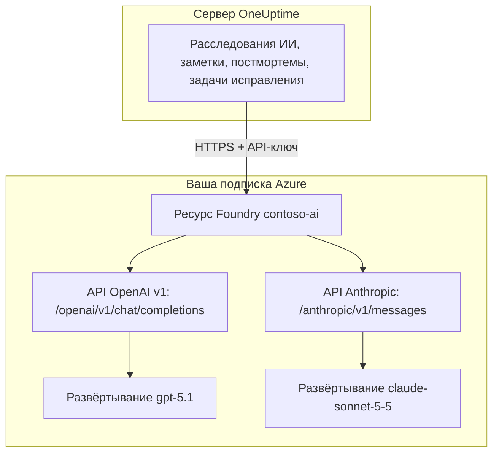

# Microsoft Foundry и Azure OpenAI

Запускайте функции ИИ в OneUptime на моделях, которые вы развёртываете в Microsoft Foundry (ранее Azure AI Foundry) или Azure OpenAI. OneUptime отправляет каждый запрос прямо в ваш ресурс в вашей подписке Azure, поэтому промпты и ответы обрабатывает выбранное вами развёртывание там, где вы его выбрали. Эта страница проведёт вас от пустой подписки до работающего провайдера: ресурс Azure, развёртывание модели, конечная точка и ключ, настройки OneUptime, сеть и что делать, если запрос не проходит.

:::cards
- [Настроить Azure](#настройка-microsoft-foundry): Создать ресурс, развернуть модель, скопировать конечную точку и ключ.
- [Подключить OneUptime](#подключение-oneuptime): Четыре поля в настройках проекта, затем кнопка Тест.
- [Собственный сервер](#настройка-экземпляра-на-собственном-сервере-через-переменные-окружения): Один провайдер для всех проектов из переменных окружения.
- [Устранение неполадок](#устранение-неполадок): 401, 403, отсутствующее развёртывание, api-version.
:::

## Как это работает

OneUptime обращается к вашему ресурсу Foundry по HTTPS с сервера OneUptime и никогда из браузеров пользователей. Каждый запрос содержит один из API-ключей ресурса и называет развёртывание, которое должно на него ответить.



Один тип провайдера, **Azure OpenAI / Microsoft Foundry**, охватывает все развёртывания ресурса. Базовый URL говорит OneUptime, какой API вызывать:

| Модель, которую вы развёртываете | API, который вызывает OneUptime | Базовый URL |
| --- | --- | --- |
| Модели OpenAI, например GPT-5.1 и GPT-4.1 | OpenAI v1 chat completions | `https://contoso-ai.openai.azure.com/openai/v1` |
| Foundry Models с chat completions, например DeepSeek и Grok | OpenAI v1 chat completions | `https://contoso-ai.services.ai.azure.com/openai/v1` |
| Claude | Anthropic Messages | `https://contoso-ai.services.ai.azure.com/anthropic` |

> [!IMPORTANT]
> Функции ИИ в OneUptime вызывают инструменты: во время работы они запрашивают ваши мониторы, инциденты и телеметрию. Разверните модель, которая поддерживает вызов инструментов (function calling). Кнопка **Тест** у провайдера проверит это за вас.

## Перед началом

Вам нужны подписка Azure, роль, которая позволяет создать ресурс и читать его, и роль в OneUptime, которой разрешено добавлять провайдеров LLM.

| Чтобы | Что нужно в Azure |
| --- | --- |
| Создать ресурс | **Owner** или **Contributor** на группе ресурсов либо **Foundry Account Owner** |
| Развернуть модель | **Owner** или **Contributor** на группе ресурсов либо **Foundry Owner** или **Foundry Account Owner** на ресурсе. Для Claude также нужно разрешение подписываться на предложения Azure Marketplace |
| Читать ключи ресурса | Роль с `Microsoft.CognitiveServices/accounts/listKeys/action`, например **Owner**, **Contributor** или **Cognitive Services Contributor** |

Самому OneUptime роль Azure не нужна. Ключ сам по себе даёт доступ ко всем развёртываниям ресурса без проверки ролей, поэтому обращайтесь с ним как с паролем.

В OneUptime добавить провайдера в проект может тот, у кого есть **Project Owner**, **Project Admin**, **Project Member**, **Settings Admin**, **Settings Member** или **Create LLM**. Экземпляр на собственном сервере может вместо этого зарегистрировать одного провайдера для всех проектов из переменных окружения, для чего нужен доступ к серверу.

## Настройка Microsoft Foundry

:::steps
### Создайте ресурс

В [портале Foundry](https://ai.azure.com) создайте ресурс Foundry или выберите существующий. Ресурс Azure OpenAI работает так же. Запишите имя ресурса: это первая часть его конечной точки, например `contoso-ai` в `https://contoso-ai.openai.azure.com`.

Выберите регион, в котором доступна нужная модель. Пока оставьте сетевой доступ к ресурсу открытым для всех сетей; в разделе [Требования к сети](#требования-к-сети) объясняется, когда и как его закрыть.

### Разверните модель

В портале Foundry выберите **Discover**, затем **Models**, и выберите модель, например `gpt-5.1` или `claude-sonnet-5-5`. Выберите **Deploy**, затем **Custom settings**:

- **Deployment name**: Foundry подставляет имя модели. OneUptime запрашивает развёртывание по этому имени, поэтому запишите его точно.
- **Deployment type**: определяет, где обрабатываются промпты. См. [Где обрабатываются ваши данные](#где-обрабатываются-ваши-данные).

Выберите **Deploy** и дождитесь, пока у развёртывания будет статус **Succeeded**.

### Скопируйте конечную точку и ключ

В [портале Azure](https://portal.azure.com) откройте ресурс, затем **Resource Management** > **Keys and Endpoint**. Скопируйте **Endpoint** и **KEY 1**. **KEY 2** оставьте для ротации: переключите OneUptime на него, а затем создайте **KEY 1** заново.

В портале Foundry тот же ключ есть на вкладке **Details** развёртывания, рядом с его **Target URI**.
:::

:::details Предпочитаете командную строку?
Те же шаги в Azure CLI. `--model-version` принимает версию, которую каталог моделей указывает для модели.

```bash
az cognitiveservices account create \
  --name contoso-ai --resource-group oneuptime-ai \
  --kind AIServices --sku S0 --location eastus2 \
  --custom-domain contoso-ai

az cognitiveservices account deployment create \
  --name contoso-ai --resource-group oneuptime-ai \
  --deployment-name gpt-5.1 \
  --model-name gpt-5.1 --model-version <version> --model-format OpenAI \
  --sku-name GlobalStandard --sku-capacity 50

# KEY 1
az cognitiveservices account keys list \
  --name contoso-ai --resource-group oneuptime-ai \
  --query key1 --output tsv
```

С `--custom-domain contoso-ai` конечная точка ресурса — `https://contoso-ai.openai.azure.com`.
:::

## Подключение OneUptime

:::steps
### Откройте провайдеров LLM

Перейдите в **Настройки проекта** > **ИИ** > **Провайдеры LLM** и нажмите **Создать: Поставщик LLM**.

### Назовите провайдера

В разделе **Основная информация** введите **Имя**, например `Azure gpt-5.1`, и при желании **Описание**. Нажмите **Далее**.

### Заполните настройки провайдера

| Поле | Что ввести |
| --- | --- |
| **Поставщик LLM** | **Azure OpenAI / Microsoft Foundry** |
| **API-ключ** | **KEY 1** или **KEY 2** ресурса |
| **Имя модели** | Имя развёртывания точно так, как его показывает Foundry, например `gpt-5.1` |
| **Базовый URL** | Конечная точка ресурса с `/openai/v1`, например `https://contoso-ai.openai.azure.com/openai/v1`. Для Claude: `https://contoso-ai.services.ai.azure.com/anthropic` |

**Установить по умолчанию** в разделе **Дополнительные поля** включено: функции ИИ используют провайдера проекта по умолчанию. Нажмите **Создать: Поставщик LLM**.

### Проверьте подключение

Нажмите **Тест** в строке провайдера. Работающий провайдер отвечает "Connection successful. The LLM provider responded to a test prompt and used tool calling." Если проверка не прошла, сообщение говорит, что ответил Azure и что нужно изменить; см. [Устранение неполадок](#устранение-неполадок).
:::

Готовый провайдер для примера:

```text
Имя: Azure gpt-5.1
Поставщик LLM: Azure OpenAI / Microsoft Foundry
API-ключ: <KEY 1 ресурса contoso-ai>
Имя модели: gpt-5.1
Базовый URL: https://contoso-ai.openai.azure.com/openai/v1
```

Теперь функции ИИ проекта используют это развёртывание. В OneUptime Cloud их запросы не оплачиваются из кредитов ИИ проекта: Azure выставляет за них счёт вашей подписке.

## Форматы базового URL

OneUptime принимает конечную точку в тех видах, в которых её показывают портал Azure и портал Foundry, и отправляет каждый запрос по адресу рядом. Выбирайте короткие: базовый URL вмещает не более 100 символов.

| Базовый URL | Запросы уходят на |
| --- | --- |
| `https://contoso-ai.openai.azure.com` | `https://contoso-ai.openai.azure.com/openai/v1/chat/completions` |
| `https://contoso-ai.openai.azure.com/openai/v1` | `https://contoso-ai.openai.azure.com/openai/v1/chat/completions` |
| `https://contoso-ai.services.ai.azure.com/openai/v1` | `https://contoso-ai.services.ai.azure.com/openai/v1/chat/completions` |
| `https://contoso-ai.openai.azure.com/openai/deployments/gpt-4o` | `https://contoso-ai.openai.azure.com/openai/deployments/gpt-4o/chat/completions?api-version=2024-10-21` |
| `https://contoso-ai.services.ai.azure.com/anthropic` | `https://contoso-ai.services.ai.azure.com/anthropic/v1/messages` |

- **API v1** (`/openai/v1`) — текущий API Microsoft. Ему не нужна `api-version`, он принимает имя развёртывания как модель и одинаково обслуживает модели OpenAI и другие Foundry Models. Используйте его для новых провайдеров.
- **URL развёртывания** (`/openai/deployments/<name>`) сам называет развёртывание, и Azure ориентируется на это имя, а не на **Имя модели**. OneUptime добавляет `api-version=2024-10-21`, если в базовом URL нет своей `api-version`. Провайдеры, сохранённые так, работают как раньше.
- **Target URI развёртывания**, вставленный целиком из портала Foundry, тоже работает, если укладывается в 100 символов.
- **Claude**: Foundry обслуживает Claude только через API Anthropic Messages по пути `/anthropic` ресурса. OneUptime вызывает его с тем же ключом. Тип провайдера **Anthropic** тоже достаёт до него с тем же базовым URL.

## Настройка экземпляра на собственном сервере через переменные окружения

На собственном сервере переменные `GLOBAL_LLM_PROVIDER_*` при запуске регистрируют одного глобального провайдера LLM, которого использует каждый проект без собственного провайдера, включая задачи исправления с ИИ. Собственный провайдер проекта всегда имеет приоритет.

```bash
GLOBAL_LLM_PROVIDER_TYPE=AzureOpenAI
GLOBAL_LLM_PROVIDER_NAME=Azure gpt-5.1
GLOBAL_LLM_PROVIDER_BASE_URL=https://contoso-ai.openai.azure.com/openai/v1
GLOBAL_LLM_PROVIDER_MODEL_NAME=gpt-5.1
GLOBAL_LLM_PROVIDER_API_KEY=<KEY 1 of contoso-ai>
```

:::tabs
@tab Docker Compose
Добавьте переменные в `config.env` и снова запустите OneUptime так же, как запускали:

```bash
(export $(grep -v '^#' config.env | xargs) && docker compose up --remove-orphans -d)
```
@tab Kubernetes
Храните ключ в Secret и передайте переменные через общий для чарта `extraEnv`:

```bash
kubectl create secret generic azure-foundry \
  --namespace oneuptime --from-literal=api-key='<KEY 1 of contoso-ai>'
```

```yaml title="values.yaml"
extraEnv:
  - name: GLOBAL_LLM_PROVIDER_TYPE
    value: AzureOpenAI
  - name: GLOBAL_LLM_PROVIDER_NAME
    value: Azure gpt-5.1
  - name: GLOBAL_LLM_PROVIDER_BASE_URL
    value: https://contoso-ai.openai.azure.com/openai/v1
  - name: GLOBAL_LLM_PROVIDER_MODEL_NAME
    value: gpt-5.1
  - name: GLOBAL_LLM_PROVIDER_API_KEY
    valueFrom:
      secretKeyRef:
        name: azure-foundry
        key: api-key
```

Затем выполните `helm upgrade` с этими значениями.
:::

Провайдер следует за переменными: если их изменить, он обновится при следующем запуске, а если убрать `GLOBAL_LLM_PROVIDER_TYPE`, он будет удалён. Если для этого типа не хватает ключа или базового URL, это видно в журнале запуска. Все переменные и типы провайдеров описаны в разделе [Провайдеры LLM](/docs/ai/llm-provider).

## Требования к сети

Сервер OneUptime открывает HTTPS-соединения на порт 443 к имени хоста ресурса, например `contoso-ai.openai.azure.com` или `contoso-ai.services.ai.azure.com`. Разрешите этот исходящий трафик в межсетевом экране или прокси.

- **OneUptime Cloud** обращается к ресурсу через интернет, поэтому ресурс должен принимать публичный трафик. Чтобы убрать ресурс из интернета, разверните OneUptime на собственном сервере.
- **Собственный сервер, частная конечная точка**: поместите ресурс за частную конечную точку в виртуальной сети, до которой доходит сервер OneUptime, и свяжите с ней частные зоны DNS `privatelink.openai.azure.com`, `privatelink.services.ai.azure.com` и `privatelink.cognitiveservices.azure.com`, чтобы обычное имя хоста ресурса разрешалось в его частный адрес. Базовый URL не меняется.
- **Частные адреса**: экземпляр на собственном сервере подключается к частным адресам, если не задано `DATA_SOURCE_BLOCK_PRIVATE_ADDRESSES=true`. Глобальный провайдер LLM подключается к ним в любом случае.
- **Сетевые правила ресурса**: в разделе **Networking** ресурса вариант **Selected networks and private endpoints** не пропускает ничего другого. Запрос, который отклонило правило, завершается ошибкой 403.

## Где обрабатываются ваши данные

Тип развёртывания, который вы выбираете при развёртывании модели, определяет, где Azure обрабатывает промпты OneUptime и ответы модели. Хранимые данные остаются в географии Azure ресурса.

| Тип развёртывания | Где обрабатываются промпты и ответы |
| --- | --- |
| Global Standard, Global Provisioned | В любом регионе Azure |
| Data Zone Standard, Data Zone Provisioned | Только внутри зоны данных: США, Европейский союз или Азиатско-Тихоокеанский регион |
| Standard, Regional Provisioned | Внутри географии Azure ресурса |

Развёртывания Claude бывают **Hosted on Azure** или **Hosted on Anthropic**. Выберите **Hosted on Azure**, чтобы промпты и ответы оставались в Azure. Подробности — в описании [типов развёртывания](https://learn.microsoft.com/en-us/azure/foundry/foundry-models/concepts/deployment-types) от Microsoft.

## Пример запроса и ответа

Чтобы проверить развёртывание вне OneUptime, отправьте ему через `curl` тот запрос, который отправляет OneUptime:

:::tabs
@tab OpenAI v1 API
```bash
curl https://contoso-ai.openai.azure.com/openai/v1/chat/completions \
  -H "Content-Type: application/json" \
  -H "api-key: $AZURE_API_KEY" \
  -d '{
    "model": "gpt-5.1",
    "messages": [
      { "role": "user", "content": "Reply with the word: OK" }
    ]
  }'
```

Ответ в сокращённом виде:

```json
{
  "id": "chatcmpl-7R1nGnsXO8n4oi9UPz2f3UHdgAYMn",
  "object": "chat.completion",
  "model": "gpt-5.1",
  "choices": [
    {
      "index": 0,
      "finish_reason": "stop",
      "message": { "role": "assistant", "content": "OK" }
    }
  ],
  "usage": { "prompt_tokens": 12, "completion_tokens": 2, "total_tokens": 14 }
}
```
@tab Anthropic API
```bash
curl https://contoso-ai.services.ai.azure.com/anthropic/v1/messages \
  -H "Content-Type: application/json" \
  -H "x-api-key: $AZURE_API_KEY" \
  -H "anthropic-version: 2023-06-01" \
  -d '{
    "model": "claude-sonnet-5-5",
    "max_tokens": 1024,
    "messages": [
      { "role": "user", "content": "Reply with the word: OK" }
    ]
  }'
```

Ответ в сокращённом виде:

```json
{
  "id": "msg_01XFDUDYJgAACzvnptvVoYEL",
  "type": "message",
  "role": "assistant",
  "model": "claude-sonnet-5-5",
  "content": [{ "type": "text", "text": "OK" }],
  "stop_reason": "end_turn",
  "usage": { "input_tokens": 14, "output_tokens": 4 }
}
```
:::

Собственные запросы OneUptime содержат больше: его инструкции, разговор, инструменты, которые модель может вызывать, и лимит токенов. Из ответа он читает текст, вызовы инструментов, причину остановки модели и расход токенов, который раздел **Настройки проекта** > **ИИ** > **Журналы ИИ** показывает для каждого запроса. **Дополнительные параметры** провайдера добавляются к каждому запросу.

## Microsoft Entra ID и ресурсы без ключей

OneUptime входит в ресурс с одним из его API-ключей. Вход через Microsoft Entra ID, в роли субъекта-службы или управляемого удостоверения, пока не поддерживается.

Если ваша организация отключает доступ по ключу для ресурсов ИИ (`disableLocalAuth`), запросы завершаются ошибкой `AuthenticationTypeDisabled`. Разрешите доступ по ключу для ресурса, который использует OneUptime, или поставьте перед ним Azure API Management:

1. Импортируйте развёртывание ресурса в API Management как API Azure OpenAI. Тогда API Management входит в ресурс со своим управляемым удостоверением.
2. Задайте для ключа подписки API имя заголовка `api-key`.
3. В OneUptime укажите в поле **Базовый URL** адрес API в API Management для развёртывания, например `https://contoso-apim.azure-api.net/aoai/openai/deployments/gpt-5.1`, с той `api-version`, которая нужна развёртыванию, как для любого URL развёртывания. В поле **API-ключ** укажите ключ подписки API Management.

Модели Claude, которые принимают только Microsoft Entra ID, например Claude Mythos, пока использовать нельзя.

## Устранение неполадок

OneUptime ставит в начало ошибки то, что нужно изменить, а затем ответ самого Azure. Кнопка **Тест** показывает ошибку полностью; **Журналы ИИ** хранят первые 490 символов.

:::details "Azure did not accept the API key" (401)
Ключ неверен, был создан заново или принадлежит другому ресурсу. Снова скопируйте **KEY 1** из **Keys and Endpoint** того ресурса, на который указывает базовый URL, и вставьте его в поле **API-ключ**.
:::

:::details "Key-based authentication is turned off for this resource" (403)
Azure ответил `AuthenticationTypeDisabled`: ресурс принимает только Microsoft Entra ID. См. [Microsoft Entra ID и ресурсы без ключей](#microsoft-entra-id-и-ресурсы-без-ключей).
:::

:::details "Azure refused the request" (403)
Сетевое правило ресурса не пропустило запрос. Сверьте настройки **Networking** ресурса с [требованиями к сети](#требования-к-сети).
:::

:::details "This resource has no deployment named ..." (404)
Azure ответил `DeploymentNotFound`. Укажите в поле **Имя модели** имя развёртывания точно так, как его показывает портал Foundry. Развёртывание, созданное в последние минуты, может быть ещё не готово. Если базовый URL — это URL развёртывания, проверьте имя после `/openai/deployments/`.
:::

:::details "Azure found nothing at this address" (404)
Базовый URL не ведёт к API Azure OpenAI. Используйте конечную точку ресурса с `/openai/v1`, например `https://contoso-ai.openai.azure.com/openai/v1`. Конечная точка вывода моделей из выведенного из эксплуатации Azure AI Inference SDK (`/models`) таким API не является: используйте `/openai/v1` на том же ресурсе.
:::

:::details "This model needs api-version ... or later" (400)
URL развёртывания запрашивает `api-version=2024-10-21`, если в нём не указана другая, а новые модели, например серия o и GPT-5, отклоняют такие старые версии. Переключите базовый URL на API v1, `https://contoso-ai.openai.azure.com/openai/v1`, с именем развёртывания в поле **Имя модели**. Или добавьте к базовому URL версию, которую называет Azure, например `?api-version=2024-12-01-preview`.
:::

:::details "Azure's v1 API takes no dated api-version" (400)
Базовый URL заканчивается на `/openai/v1` и при этом содержит `api-version` с датой. Уберите `api-version` из базового URL.
:::

:::details "Базовый URL: не более 100 символов."
Target URI вместе со своей `api-version` часто бывает длиннее. Используйте конечную точку ресурса с `/openai/v1` и укажите имя развёртывания в поле **Имя модели**.
:::

:::details "...could not be reached" или "...host name could not be resolved"
Серверу OneUptime не удалось подключиться к ресурсу. В OneUptime Cloud ресурс должен быть доступен из интернета. На собственном сервере проверьте, что сервер разрешает имя хоста ресурса, через частную зону DNS в случае частной конечной точки, и что исходящий HTTPS разрешён.
:::

:::details Слишком много запросов (429)
Квота токенов в минуту у развёртывания исчерпана. Функции ИИ ждут и повторяют попытку, до десяти попыток примерно за пять минут, прежде чем сообщить об ошибке; кнопка **Тест** сдаётся раньше. Увеличьте квоту развёртывания в портале Foundry или перенесите его на другой тип развёртывания.
:::

## Дальнейшие шаги

:::cards
- [Провайдеры LLM](/docs/ai/llm-provider): Все типы провайдеров и то, как проект выбирает один из них.
- [AI SRE](/docs/ai/ai-sre): Расследования, которые работают на этом провайдере.
- [Ask AI](/docs/ai/ask-ai): Вопросы о вашей системе с ответами прямо в панели.
:::
