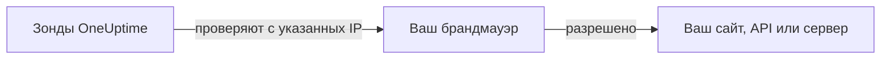

# IP-адреса

Зонды OneUptime Cloud проверяют ваши сайты, API и серверы с фиксированного набора IP-адресов. Если перед тем, что вы отслеживаете, стоит брандмауэр или список разрешённых адресов, разрешите эти адреса, чтобы проверки проходили.



## IP-адреса, которые нужно разрешить

Разрешите в брандмауэре трафик с этих адресов:

{{IP_WHITELIST}}

> [!NOTE]
> Эти адреса могут меняться. OneUptime заранее сообщает о таких изменениях. Чтобы оставаться в курсе, не следя за объявлениями, [получайте список](#программное-получение-списка) каждый раз, когда обновляете брандмауэр.

## Программное получение списка

Тот же список отдаётся в формате JSON, без ключа API, поэтому скрипт может поддерживать правила брандмауэра в актуальном состоянии:

```bash
curl -s https://oneuptime.com/ip-whitelist
```

```json
{
  "ipWhitelist": ["<list of IPs>"]
}
```

`ipWhitelist` — это массив, в котором каждый элемент содержит один адрес. Чтобы вывести по одному адресу в строке, например для скрипта брандмауэра:

```bash
curl -s https://oneuptime.com/ip-whitelist | jq -r '.ipWhitelist[]'
```

## Самостоятельно размещённый OneUptime

На вашем собственном экземпляре эта страница и конечная точка `/ip-whitelist` показывают адреса из параметра экземпляра `IP_WHITELIST` — списка через запятую. Укажите адреса, с которых ваши собственные зонды отправляют проверки.

:::tabs
@tab Kubernetes
Задайте значение `ipWhitelist` в Helm-чарте:

```yaml title="values.yaml"
ipWhitelist: "203.0.113.1,203.0.113.2"
```
@tab Docker Compose
`config.env` не передаёт этот параметр приложению. Добавьте его в окружение сервиса `app` в файле `docker-compose.override.yml` рядом с `docker-compose.yml`, а затем перезапустите OneUptime:

```yaml title="docker-compose.override.yml"
services:
  app:
    environment:
      IP_WHITELIST: "203.0.113.1,203.0.113.2"
```
:::

Если ничего не задано, эта страница показывает **No IP addresses configured.**, а конечная точка возвращает пустой массив `ipWhitelist`.

## Дальнейшие шаги

:::cards
- [Пользовательские probes](/docs/probe/custom-probe): Запустите зонд в своей сети вместо того, чтобы открывать брандмауэр.
- [Создание монитора](/docs/monitor/create-monitor): Начните проверять сайт, API или сервер.
:::
