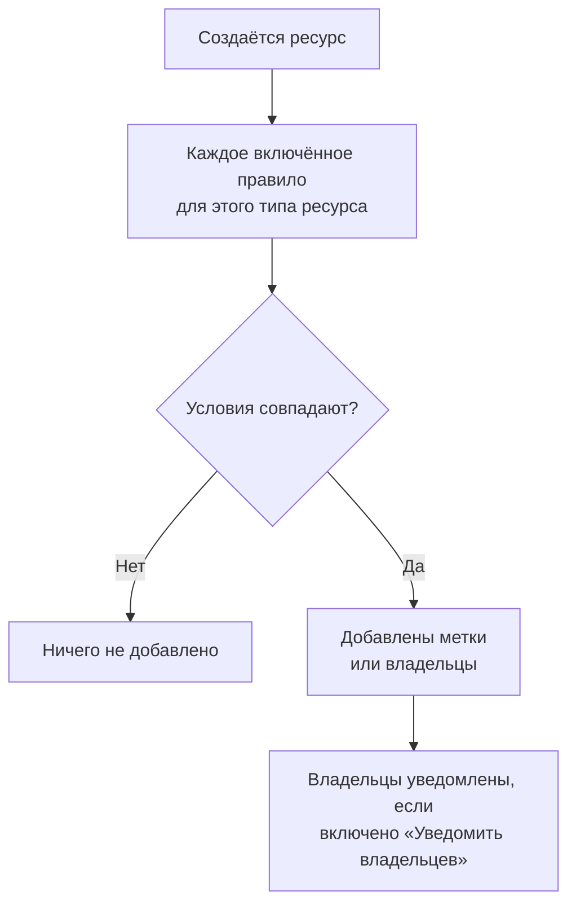

# Правила меток и владельцев

Правила меток и правила владельцев наводят порядок в ваших ресурсах за вас. **Правило меток** добавляет метки каждому новому ресурсу, который ему соответствует, а **правило владельцев** добавляет ему пользователей и команды в качестве владельцев: так новый инцидент базы данных получает метку _База данных_ и принадлежит команде баз данных, и никому не нужно об этом помнить.

:::cards
- [Создание правила](#создание-правила): Два шага: чему соответствует правило, а затем что оно добавляет.
- [Наследование меток и владельцев](#наследование-меток-и-владельцев): Передавать то, что несут мониторы, хосты и сервисы события.
- [Когда выполняются правила](#когда-выполняются-правила): Новые ресурсы, а для уже существующих — **Run Now**.
:::

## Как это работает

Правила выполняются при создании ресурса. Каждое включённое правило проверяет свои условия на новом ресурсе, и каждое совпавшее правило добавляет то, что оно добавляет.

По меткам и владельцам вы фильтруете и группируете ресурсы, они определяют, кого OneUptime уведомляет о ресурсах и до чего дотягиваются [разрешения, ограниченные метками или собственными ресурсами](/docs/permissions/index). Правила поддерживают их единообразными, и никому не нужно об этом помнить.

## Где найти правила

У каждого продукта с метками и владельцами есть оба вида правил в разделе **Настройки** (у инцидентов, оповещений и планового обслуживания — в разделе **Правила**): мониторы, инциденты и эпизоды инцидентов, оповещения и эпизоды оповещений, события планового обслуживания, страницы статуса, сервисы, хосты, кластеры Kubernetes, хосты Docker, кластеры Docker Swarm, хосты Podman, кластеры Proxmox, vCenter VMware, кластеры Ceph, системы хранения, базы данных, очереди, парки IoT, бессерверные функции, облачные ресурсы, RUM-приложения, дашборды, политики дежурств, расписания дежурств, политики входящих звонков, рабочие процессы, runbook-и, сетевые устройства и SLO.

Например, правила меток мониторов находятся в **Мониторы → Настройки → Правила меток**, а правила меток инцидентов — в **Инциденты → Правила → Правила меток**. Разделы **Настройки** и **Правила** в боковом меню сначала свёрнуты: нажмите на заголовок раздела, чтобы его открыть. На страницах инцидентов и оповещений есть вкладка **Incident Rules** (или **Alert Rules**) и вкладка **Episode Rules**.

## Создание правила

Все правила меток и владельцев создаются одинаково, в два шага.

:::steps
### Откройте список правил

Откройте страницу продукта **Правила меток** или **Правила владельца** и нажмите кнопку создания, которая называется по правилу, например **Создать: Monitor Label Rule**.

### Выберите, чему соответствует правило

На шаге **Совпадение** нажмите **Добавить условие** для каждого условия, которому должен отвечать ресурс. Если условий два или больше, выберите **Соответствие всем** или **Соответствие любому**. Правило без условий соответствует любому новому ресурсу.

### Выберите, что добавляет правило

На шаге **Метки** выберите **Метки для добавления**. В правиле владельцев шаг называется **Владельцы**: **Добавить владельца** открывает единый список людей и команд.

Поле **Имя** заполняется по вашему выбору (_Добавить Production_, _Добавить Platform как владельцев_) и следует за выбором, пока вы не введёте своё имя. Правило, которое только наследует, вместо этого называется по тому, от чего оно наследует (см. ниже).

### Проверьте свёрнутые поля

**Дополнительные поля** содержат необязательное **Описание** и, в правиле владельцев, **Уведомить владельцев**, которое включено по умолчанию: владельцы, которых добавляет правило, получают то же уведомление «вас добавили в качестве владельца», что и владелец, добавленный вручную. Выключите его, чтобы добавлять владельцев без уведомления.

### Сохраните правило

На последнем шаге снова нажмите кнопку с названием правила, например **Создать: Monitor Label Rule**. Правило сразу включено, и список показывает его с зелёной отметкой **Включено**.
:::

Новое правило должно что-то добавлять: хотя бы одну метку (или владельца) или, в правиле инцидентов, оповещений или планового обслуживания, что-то, что оно наследует (см. ниже). Чтобы приостановить правило, не удаляя его, выключите **Включено** в форме редактирования; тогда список покажет красную отметку **Отключено**.

### Как бы ни создавалось правило

То же касается правила, созданного через API, Terraform, рабочий процесс или [импорт правил меток](/docs/configuration/label-rule-import-export): OneUptime отклоняет новое правило, которое ничего не добавляет, с одним сообщением, где названы поля для заполнения. Эти сообщения на всех языках приходят на английском.

| Правило | Сообщение |
| --- | --- |
| Правило меток | This label rule adds nothing. Choose at least one label in Labels to Add. |
| Правило меток инцидентов, оповещений или планового обслуживания | This label rule adds nothing. Choose at least one label in Labels to Add, or turn on an Inherit Labels switch. |
| Правило владельцев | This owner rule adds nothing. Choose at least one user or team in Owner Users or Owner Teams. |
| Правило владельцев инцидентов, оповещений или планового обслуживания | This owner rule adds nothing. Choose at least one user or team in Owner Users or Owner Teams, or turn on an Inherit Owners switch. |

- **API**: задайте в `labelsToAdd` (или `ownerUsers` / `ownerTeams`) хотя бы одну запись проекта или установите один из переключателей правила `inheritLabelsFrom…` (`inheritOwnersFrom…`) в `true` — булево значение JSON.
- **Terraform**: ресурс правила меток или владельцев, которому нечего добавить, завершается ошибкой на `terraform apply` с сообщением выше. Задайте ему `labels_to_add` (или `owner_users` / `owner_teams`) либо включите один из его переключателей наследования.

Уже существующие правила не затрагиваются — см. [Редактирование правила](#редактирование-правила).

## Наследование меток и владельцев

Правила инцидентов, оповещений и планового обслуживания могут также передавать то, что несут ресурсы, затронутые событием. Под **Метки для добавления** (или **Владельцы**) свёрнутый раздел **Наследовать метки** (или **Наследовать владельцев**) содержит шесть переключателей:

- **Наследовать метки от мониторов** — каждая метка мониторов инцидента добавляется и к инциденту. У оповещения один монитор, поэтому в правиле оповещений переключатель называется **Наследовать метки от монитора** (а в правиле владельцев оповещений — **Наследовать владельцев от монитора**).
- **Наследовать метки от хостов**, **Наследовать метки от кластеров Kubernetes**, **Наследовать метки от хостов Docker**, **Inherit Labels From Podman Hosts** и **Наследовать метки от сервисов** делают то же самое для этих ресурсов.

У правил владельцев те же шесть переключателей для владельцев (**Наследовать владельцев от мониторов** и так далее). Пока ни один переключатель не включён, свёрнутый раздел объясняет, для чего он нужен; в правиле, которое наследует, он открывается сам. У правил эпизодов нет переключателей наследования.

Правило, которое наследует, может оставить **Метки для добавления** (или **Владельцы**) пустыми: оно добавляет то, что наследует. Такое правило называется по тому, от чего оно наследует:

| Включённые переключатели | Имя |
| --- | --- |
| **Наследовать метки от мониторов** | _Наследование меток: мониторы_ |
| **Наследовать метки от мониторов** и **Наследовать метки от хостов** | _Наследование меток: мониторы, хосты_ |
| **Наследовать метки от монитора**, в правиле оповещений | _Наследование меток: монитор_ |

Имя следует за переключателями, пока вы не выберете метку (тогда правило называется по своим меткам) или не введёте своё имя.

## Редактирование правила

У формы редактирования правила те же два шага, и к ним добавляется переключатель **Включено**. Она не требует того, что правило добавляет: правило, сохранённое до того, как OneUptime стал об этом спрашивать (через API, Terraform, импорт или старую форму), может вообще ничего не добавлять, а при редактировании можно убрать всё, что правило добавляет.

Такое правило по-прежнему можно переименовать, выключить или удалить, в том числе через API и Terraform. Список помечает правило, которое ничего не добавляет, отметкой **Ничего не добавляет** рядом со статусом; так же поступает и собственная страница правила. Отредактируйте его, чтобы выбрать, что оно добавляет, или удалите.

## Когда выполняются правила

Каждое включённое правило выполняется при создании ресурса — из дашборда или через API, — и каждое совпавшее правило добавляет то, что оно добавляет:

- Если совпадают несколько правил, все они добавляют свои метки и владельцев.
- Правило никогда ничего не удаляет: ни метки или владельцев, добавленных кем-то вручную, ни те, что оно добавило само.
- Отключённое правило ничего не делает.

Правило, написанное сегодня, действует для ресурсов, созданных после него. Чтобы применить его к уже существующим, используйте **Run Now** — см. [Применение правил к существующим ресурсам](/docs/configuration/run-rules-now). Правила меток также можно копировать между проектами — см. [Импорт и экспорт правил меток](/docs/configuration/label-rule-import-export).

## Дальнейшие шаги

:::cards
- [Применение правил к существующим ресурсам](/docs/configuration/run-rules-now): Применить правило к ресурсам, которые у вас уже есть.
- [Импорт и экспорт правил меток](/docs/configuration/label-rule-import-export): Скопировать правила меток между проектами в виде JSON.
- [Настройки и автоматизация инцидентов](/docs/incidents/settings): Другие правила, которые может выполнять инцидент.
- [Правила меток и владельцев для SLO](/docs/slo/label-and-owner-rules): Чему соответствуют правила SLO.
:::
