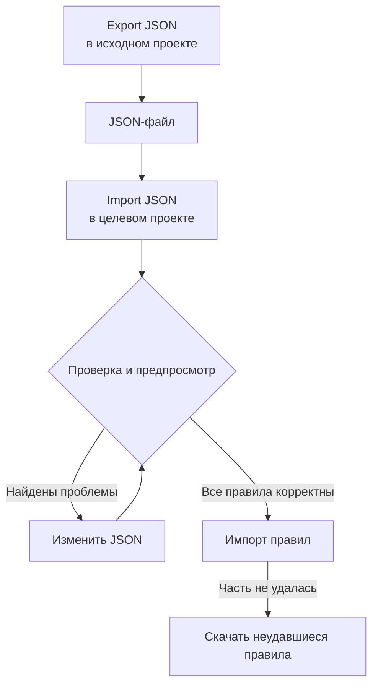

# Импорт и экспорт правил меток

Копируйте правила меток между проектами или создавайте сразу много правил в виде JSON-файла. На каждой странице **Правила меток** есть действия **Export JSON** и **Import JSON** в меню **Дополнительные параметры** (**⋯**), в том числе для инцидентов, оповещений, мониторов и сетевых устройств. Единственное исключение — VMware: у его правил меток для vCenter нет ни того, ни другого.



## Экспорт правил

Откройте **Дополнительные параметры** и выберите **Export JSON**, чтобы скачать все правила этого типа в текущем проекте. В экспорт попадают правила с других страниц таблицы, а фильтры таблицы не учитываются.

Файл сохраняет для каждого правила статус включения, условия, добавляемые метки и параметры наследования меток. Идентификаторы проекта, идентификаторы правил и поля аудита не включаются.

Связанные метки, мониторы и уровни серьёзности записываются по точному имени. Импорт их не создаёт: они уже должны существовать в целевом проекте.

## Импорт правил

:::steps
### Откройте Import JSON

Откройте страницу **Правила меток** целевого проекта и выберите **Дополнительные параметры → Import JSON**.

### Добавьте файл

Загрузите JSON-файл экспорта или вставьте его содержимое.

### Проверьте и посмотрите предпросмотр

Выберите **Validate and preview**. Каждое правило проверяется до того, как будет создано хотя бы одно, а ресурсы, на которые есть ссылки, должны существовать в целевом проекте с уникальными совпадающими именами.

### Просмотрите результат

Проверьте имена правил, статус, метки и условия. Большой пакет показывается постранично. Чтобы что-то исправить, выберите **Edit JSON** и снова запустите проверку.

### Импортируйте

Нажмите кнопку импорта, которая показывает число правил (например, **Import 2 rules**), и не закрывайте окно, пока не появятся результаты.
:::

Импорт добавляет новые правила и сохраняет существующие, поэтому повторный импорт того же файла создаёт ещё одну копию. Для каждого правила действуют обычные разрешения на создание и проверка на сервере.

Если часть правил не удалась, выберите **Download failed rules**, чтобы сохранить только эти строки, исправьте их и импортируйте этот файл снова. Если время ожидания запроса истекло, проверьте список правил, прежде чем повторять: сервер мог сохранить правило до того, как его ответ потерялся.

## Создание пакета в JSON

Экспортируйте существующее правило, чтобы получить пример для своего типа ресурса, а затем измените или добавьте записи в массиве `items`. Этот пример создаёт два правила меток для мониторов. Метки `Production` и `Infrastructure` уже должны существовать в целевом проекте.

```json title="monitor-label-rules.json"
{
  "fileType": "oneuptime-label-rules",
  "schemaVersion": 1,
  "resourceType": "MonitorLabelRule",
  "items": [
    {
      "name": "Production API monitors",
      "description": "Label production API monitors automatically",
      "isEnabled": true,
      "monitorNamePattern": "^api-prod-",
      "monitorLabels": [],
      "labelsToAdd": ["Production"]
    },
    {
      "name": "Database monitors",
      "isEnabled": false,
      "monitorNamePattern": "^database-",
      "labelsToAdd": ["Infrastructure"]
    }
  ]
}
```

| Поле | Что в нём |
| --- | --- |
| `fileType` | Всегда `oneuptime-label-rules`. |
| `schemaVersion` | Всегда `1`. |
| `resourceType` | Тип правил в файле, например `MonitorLabelRule`. |
| `items` | Правила, по одному объекту на каждое. В файле должно быть хотя бы одно. |

Используйте булевы значения JSON для `isEnabled`, текст для шаблонов и массивы имён для связанных ресурсов.

Весь пакет останавливается до шага импорта из-за неверных шаблонов, неизвестных полей, отсутствующих имён и неоднозначных ссылок. То же происходит с правилом, которое ничего не добавляет (пустой `labelsToAdd` и, в правиле инцидентов, оповещений или планового обслуживания, ни одного переключателя `inheritLabelsFrom…` со значением `true`), потому что OneUptime отказывается его создавать (см. [Правила меток и владельцев](/docs/configuration/label-and-owner-rules#как-бы-ни-создавалось-правило)). Экспорт может содержать такое правило, если оно было сохранено до появления этой проверки; добавьте ему метку или уберите его из файла перед импортом.

> [!NOTE]
> Размер файлов и вставленного JSON ограничен 10 МБ.

## Копирование между типами ресурсов

Оставьте в файле исходный `resourceType` и откройте **Import JSON** на целевой странице. Совместимые шаблоны основного имени или заголовка, шаблоны описания и обязательные метки сопоставляются с полями цели, а предпросмотр показывает эти сопоставления, чтобы вы могли их проверить. Ссылки на уровни серьёзности инцидентов и оповещений сопоставляются с именами уровней серьёзности в целевом проекте.

Условия или действия, которые цель не поддерживает, блокируют импорт. Например, правило инцидентов, ограниченное определёнными мониторами, нельзя скопировать в правила сетевых устройств, не изменив эти условия.

> [!WARNING]
> Правила меток сетевых устройств и SLO поддерживают подстановочные знаки помимо регулярных выражений. При переносе между этими правилами и правилами других типов отклоняются шаблоны с `*` или пробелами по краям, потому что там они совпадают иначе. Измените такие шаблоны для цели или оставьте правило в пределах того же типа ресурса. Правила меток сетевых устройств и SLO могут обмениваться любыми шаблонами между собой, потому что совпадают одинаково.

## Дальнейшие шаги

:::cards
- [Правила меток и владельцев](/docs/configuration/label-and-owner-rules): Чему соответствует правило меток и что оно добавляет.
- [Применение правил к существующим ресурсам](/docs/configuration/run-rules-now): Применить импортированные правила к ресурсам, которые у вас уже есть.
:::
