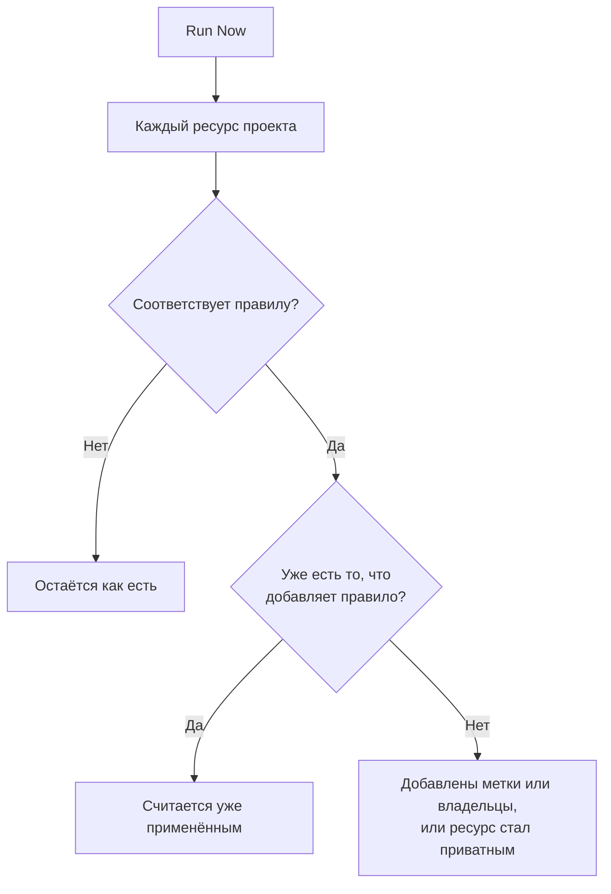

# Применение правил к существующим ресурсам

Правила меток, правила владельцев и правила конфиденциальности выполняются автоматически, когда ресурс **создаётся**. Поэтому правило, написанное сегодня, ничего не меняет в мониторах, инцидентах или хостах, которые у вас уже есть. **Run Now** закрывает этот пробел: применяет одно правило к каждому ресурсу, который уже существует в проекте.

## Какие правила можно запустить

- **Правила меток** и **Правила владельца** — для каждого ресурса, у которого они есть: мониторы, инциденты, эпизоды инцидентов, оповещения, эпизоды оповещений, события планового обслуживания, страницы статуса, сервисы, хосты, кластеры Kubernetes, хосты Docker, кластеры Docker Swarm, хосты Podman, кластеры Proxmox, vCenter VMware, кластеры Ceph, системы хранения, базы данных, очереди, парки IoT, бессерверные функции, облачные ресурсы, RUM-приложения, дашборды, политики дежурств, расписания дежурств, политики входящих звонков, рабочие процессы, runbook-и, сетевые устройства и SLO.
- **Правила конфиденциальности** — для инцидентов, оповещений, эпизодов инцидентов и эпизодов оповещений.
- **Monitor Rules** на странице статуса. Они и так заново синхронизируют страницу при каждом сохранении правила; запуск синхронизирует её сразу.
- **Monitor Rules** у SLO. Они и так заново синхронизируют SLO при каждом сохранении правила; запуск сразу синхронизирует мониторы SLO. См. [Мониторы и правила мониторов](/docs/slo/monitor-rules).

Правила, которые выполняют действие, а не описывают ресурс (**Правила дежурства**, **Правила runbook-ов**, **Правила автоисправления** и **Правила группировки**), нельзя запустить для существующих записей. Их запуск вызывал бы людей, выполнял бы runbook-и, запускал бы исправления или перестраивал бы эпизоды для уже завершившихся инцидентов.

## Перед началом работы

Чтобы запустить правило, нужно разрешение на редактирование правила **и** на редактирование ресурсов, которые оно меняет: например, правилу меток мониторов нужны и разрешение на редактирование правил меток мониторов, и разрешение на редактирование мониторов. Правилам владельцев нужно ещё разрешение на добавление владельцев. Правилам мониторов на странице статуса или у SLO достаточно разрешения на редактирование правила.

> [!IMPORTANT]
> Разрешения, ограниченного определёнными метками или вашими собственными ресурсами, недостаточно: запуск может изменить любой ресурс проекта. Списки блокировки команд действуют так же, как везде, и блокировка, ограниченная некоторыми метками, тоже учитывается: запуск изменил бы ресурсы с этими метками, поэтому блокировка с метками на редактирование ресурсов, которые меняет правило, отклоняет запуск.

Правила сети требуют того же, когда вы запускаете их для уже имеющихся устройств. Для **Run Now** правила назначения площадки или меток устройств нужны разрешение на редактирование правила и **Edit Network Device**. Для **Dry Run** и **Run Rule** правила автоматического импорта нужны разрешение на редактирование правила, **Create Network Device** и, если у правила есть шаблон монитора, **Create Monitor**. Каждое из них должно действовать на весь проект. См. [Автоматический импорт с правилами автоимпорта](/docs/monitor/network-device-monitor#importing-automatically-with-auto-import-rules).

## Запуск одного правила

:::steps
### Откройте список правил

Откройте страницу правил, например **Мониторы → Настройки → Правила меток**.

### Выберите Run Now

Откройте меню **⋯** в конце строки правила и выберите **Run Now** или выберите **Просмотр**, а затем **Run Now** на странице самого правила. Диалоговое окно сообщит, что сделает запуск.

### Решите, уведомлять ли новых владельцев

Для правила владельцев выберите, включать ли **Notify the owners this run adds**. По умолчанию параметр выключен и действует, только если в самом правиле включено **Уведомить владельцев**. Владелец получает одно уведомление за каждый ресурс, к которому его добавили.

### Запустите правило

Нажмите **Run Rule** и не закрывайте диалоговое окно. В большом проекте окно показывает, как далеко продвинулся запуск.

### Прочитайте отчёт

Когда запуск завершится, диалоговое окно сообщит, скольким ресурсам соответствовало правило, сколько оно изменило и у скольких уже было то, что добавляет правило.
:::

## Запуск нескольких правил

Выберите правила в таблице, откройте меню массовых действий и выберите **Run Now**. Выбранные правила выполняются одно за другим.

- Владельцы, добавленные массовым запуском, никогда не получают уведомлений. Чтобы уведомить их, запустите правило по отдельности.
- Правило, которое не может выполниться (например, потому что оно отключено), выводится вместе с причиной, а остальные правила всё равно выполняются.

## Что делает запуск

- **Он только добавляет.** Метки добавляются, владельцы добавляются, ресурсы становятся приватными. Ничего не удаляется и ничего не становится публичным, поэтому повторный запуск безопасен: второй запуск сообщит, что всё уже применено.
- **Оценивается каждый ресурс проекта**, включая решённые инциденты и оповещения.
- **Существующие владельцы пропускаются** и никогда не добавляются дважды.
- **Добавляются только собственные метки вашего проекта.** Метка, которую называет правило и которая больше не относится к меткам вашего проекта, пропускается, а остальные метки правила всё равно добавляются. То же происходит, когда правило выполняется для нового ресурса.
- **Правило применяется так же, как при создании**, включая метки и владельцев, унаследованных от мониторов, хостов и сервисов инцидента. Если у ресурса есть лента активности, в ней фиксируется, какое правило его изменило.
- **Отключённые правила не выполняются.** Сначала включите правило.
- **Правила мониторов страниц статуса** добавляют мониторы, которым соответствуют, и убирают мониторы, добавленные ими ранее и больше не подходящие. Мониторы, добавленные на страницу вручную, никогда не затрагиваются.
- **Один запуск охватывает до 100 000 ресурсов.** В более крупном проекте запуск останавливается и сообщает об этом; запустите правило снова, чтобы продолжить.

## Дальнейшие шаги

:::cards
- [Правила меток и владельцев](/docs/configuration/label-and-owner-rules): Написать правила, которые применяет запуск.
- [Импорт и экспорт правил меток](/docs/configuration/label-rule-import-export): Сначала перенести правила меток из другого проекта.
- [Настройки и автоматизация инцидентов](/docs/incidents/settings): Правила инцидентов, включая правила конфиденциальности.
:::
