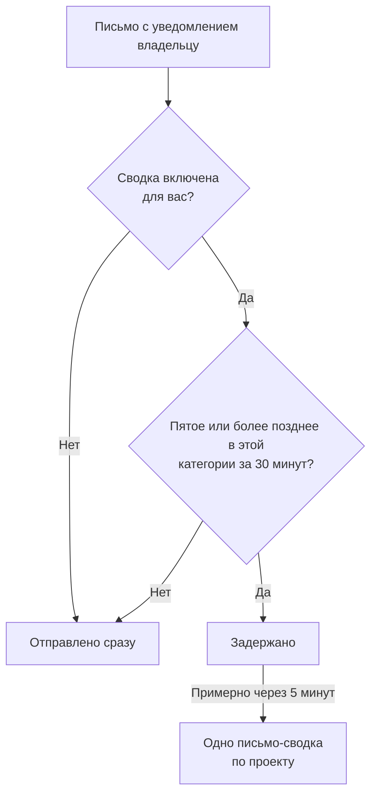

# Сводка уведомлений

Когда что-то ломается всерьёз, это редко случается один раз. Нестабильный канал к вышестоящему провайдеру роняет сорок мониторов, объявляются, подтверждаются и решаются сорок инцидентов, и каждый владелец получает письмо на каждом шаге: двести сообщений в одном ящике, и их уже никто не читает.

OneUptime автоматически собирает такие всплески в одно письмо. Это включено для всех, и настраивать ничего не нужно, но если вы предпочитаете получать каждое уведомление отдельным письмом, вы можете [отключить сводку для себя](#как-отключить-сводку-для-себя), отдельно в каждом проекте.

:::cards
- [Как это работает](#как-это-работает): Четыре письма уходят сразу, остальные приходят вместе.
- [Что никогда не попадает в сводку](#что-никогда-не-попадает-в-сводку): Вызовы дежурных, письма о безопасности, оплате и подписчикам.
- [Отключить сводку](#как-отключить-сводку-для-себя): Снова получать каждое уведомление отдельным письмом.
- [Меньше рутинных писем](#как-получать-ещё-меньше-писем): Отключить информационные письма одним действием.
:::

## Как это работает

Каждое письмо с уведомлением владельцу, которое вы получаете, засчитывается в небольшой лимит, который ведётся отдельно по проекту, получателю, адресу электронной почты и **категории** ресурса: инциденты, оповещения, мониторы, плановые работы, страницы статуса, зонды, SLO и так далее.



- **Первые четыре** письма одной категории в пределах любого тридцатиминутного окна отправляются сразу, как и всегда. Та же тема, тот же шаблон, те же ссылки.
- **Пятое и каждое следующее** письмо в этом окне задерживается.
- Примерно через пять минут всё, что было задержано для вас в этом проекте, по всем категориям, приходит **одним** письмом со списком произошедшего и ссылкой на каждый ресурс.

Сводка включает уведомления, на которые вы всё ещё подписаны в момент её отправки. Если вы отключите письма о событии, пока его уведомления стоят в очереди, эти уведомления не попадут в сводку. Если позже снова включить письма, пропущенные обновления повторно не придут.

Ниже порога функция ничего не делает. Проект, который отправляет три письма владельцам в день, по-прежнему отправляет эти три письма по отдельности.

## Как выглядит письмо-сводка

Строка темы сообщает масштаб _и характер_ шторма ещё до того, как вы откроете письмо:

```text
[Acme Production] 112 notifications: 63 Monitors, 41 Incidents, 6 Alerts +2 more
```

Внутри карточка итогов показывает общее число, период, который охватывает сводка, и разбивку по категориям. Ниже уведомления сгруппированы по разделам, по одному на категорию, начиная с самой срочной: инциденты, затем оповещения, затем мониторы и зонды, которые их обнаружили, так что первое под итогами и есть первое, на что стоит нажать.

В каждом разделе одна строка на ресурс, а не одна строка на событие:

- **Строки показывают, чем закончилось для ресурса.** Если инцидент был создан, затем подтверждён, затем решён, это одна строка в его последнем состоянии, поэтому сводка _актуальнее_, чем были бы три отдельных письма.
- **Числа сходятся.** В каждой строке указано время её последнего обновления, а строка, вобравшая несколько, говорит сколько, поэтому разделы и карточка итогов всегда дают одну и ту же сумму.
- **Показаны серьёзность и состояние.** Карточки оповещений и инцидентов показывают серьёзность и состояние из последнего уведомления, включая собственные названия. Старые уведомления в очереди без этих данных всё равно отображаются, только без недоступных меток.

Время указано в UTC, а если сводка охватывает больше одного дня, указана и дата.


## Что никогда не попадает в сводку

Сводка затрагивает только уведомления владельцам и участникам — семейство «изменилось что-то, за что вы отвечаете». Ничего другого она коснуться не может, потому что находится в единственном пути кода, по которому проходят эти уведомления, и только они.

Никогда не задерживаются и не засчитываются:

| Категория | Примеры |
| ----------------------------------------- | ---------------------------------------------------------------------------------------------------- |
| Вызовы дежурных | Каждый вызов по политике эскалации и каждый запрос на подтверждение |
| Расписание дежурств | «Вы сейчас дежурите», «вы дежурите следующим», «ваша смена скоро начнётся», «ваша смена переназначена» |
| Безопасность учётной записи | Сброс пароля, подтверждение адреса электронной почты, смена пароля, использование или перевыпуск резервного кода двухфакторной аутентификации |
| Административные уведомления о вашей учётной записи | Администратор изменил ваши способы уведомления или правила дежурства |
| Оплата и баланс | Счета, просроченная подписка, «мы не смогли никого вызвать, потому что карта отклонена» |
| Состояние экземпляра | Предупреждения о Postgres, Valkey и ClickHouse для администраторов экземпляра |
| Подписчики страниц статуса | Каждое письмо, которое ваша страница статуса отправляет вашим подписчикам |
| Нарушения SLA | Отправляются сразу, хотя и используют тип уведомления о созданном инциденте |

Затрагивается только электронная почта. SMS, телефонные звонки, push-уведомления, WhatsApp, Telegram, Slack, Microsoft Teams и вебхуки доставляются сразу, как и раньше, в том числе для уведомлений, письма о которых были задержаны.

## Ограничения

| Ограничение | Значение |
| --- | --- |
| Уведомлений в одном письме-сводке | Не больше **500**. Остальное остаётся в очереди и уходит со следующей сводкой, не позже чем через пять минут. |
| Строк в одном письме-сводке | Не больше **100**. Строки объединяются по ресурсам, то есть это 100 разных ресурсов; сверх этого письмо показывает полные итоги и даёт ссылку на проект. |
| Писем-сводок одному получателю из одного проекта | Не больше **12** в час. |
| Дополнительная задержка задержанного уведомления | Около шести минут в худшем случае. |

Почасовой предел обеспечивает база данных, а не таймер, поэтому он соблюдается даже во время шторма, который длится часами.

## Как отключить сводку для себя

Одним нужна группировка. Другие раскладывают каждое уведомление по папкам сразу после получения или отдают ящик программе, которая это делает, и письмо-сводка им мешает. Поэтому сводку можно отключить — для каждого человека и в каждом проекте отдельно.

:::steps
### Откройте настройки электронной почты

В проекте перейдите в **Настройки пользователя → Настройки электронной почты** — на ту же страницу, на которую ссылается подвал каждого письма-сводки.

### Отключите Email Rollup

В карточке **Email Rollup** выключите переключатель. Изменение сохраняется само, и затем карточка показывает "Off: every notification arrives as its own email, immediately."
:::

Когда сводка отключена, каждое письмо с уведомлением владельцу или участнику в этом проекте снова приходит вам отдельно и сразу: та же тема, тот же шаблон, те же ссылки, без порога и без пятиминутного ожидания. То, что уже стояло для вас в очереди в момент отключения, придёт последней сводкой через несколько минут; всё последующее приходит по одному.

Переключатель **только ваш и действует в одном проекте**. Его выключение не меняет того, что получают ваши коллеги, и не распространяется на другие проекты, так что шумный рабочий проект может и дальше группировать письма, а тихий внутренний — отправлять всё по отдельности, или наоборот. Он включён у всех, пока каждый сам его не выключит.

Что он **не** затрагивает:

- **Какие уведомления вы получаете.** Это настройка по типу события и каналу в разделе **Настройки пользователя → Настройки уведомлений**, на соседней странице. Сводка и этот переключатель меняют только то, в сколько писем упакованы эти уведомления.
- **Вызовы дежурных и письма о сменах**, **письма о безопасности учётной записи**, **письма об оплате**, предупреждения о состоянии экземпляра и письма подписчикам страниц статуса. Ничто из этого никогда не попадает в сводку, поэтому её отключение для них ничего не меняет — см. [Что никогда не попадает в сводку](#что-никогда-не-попадает-в-сводку).
- **Любой другой канал.** SMS, звонки, push, WhatsApp, Telegram, Slack, Microsoft Teams и вебхуки и так приходят сразу.

## Как получать ещё меньше писем

Сводка объединяет рутинные обновления; большинство из них можно и вовсе перестать получать.

:::steps
### Откройте настройки из письма-сводки

Откройте ссылку на настройки в подвале письма-сводки или перейдите в **Настройки пользователя → Настройки электронной почты**.

### Выберите Reduce routine emails

В карточке **Fewer routine emails** выберите **Reduce routine emails**. Когда изменение сохранено, карточка сообщает **Рутинные письма отключены.**
:::

Это отключает для вас в текущем проекте следующие информационные письма:

- Заметки к инцидентам, оповещениям, эпизодам и плановым работам.
- Сообщения о том, что вас добавили владельцем ресурса.
- Новые мониторы и страницы статуса.
- Инциденты или оповещения, добавленные в существующие эпизоды.
- Добавление в политику дежурств или удаление из неё.

Ваши текущие настройки для создания инцидентов и оповещений, смены состояний, напоминаний, назначения инцидентов, состояния мониторов и дежурных смен сохраняются, и никакое письмо, которое вы отключили, не включается. Вызовы дежурных, другие каналы доставки, письма об учётной записи, письма об оплате и письма подписчикам страниц статуса не затрагиваются.

Изменения сохраняются вместе. Просмотрите переключатели по событиям в разделе **Настройки пользователя → Настройки уведомлений**, чтобы снова включить нужное письмо. Эти настройки действуют и для уведомлений, ожидающих сводки; уже отправленное письмо отозвать нельзя. Сводка писем остаётся отдельной настройкой, которая управляет группировкой событий, которые вы оставили.

## Устранение неполадок

:::details Письмо с уведомлением пришло на несколько минут позже
Это было пятое или более позднее письмо своей категории за тридцать минут, поэтому его задержали и отправили в сводке примерно через пять минут. Найдите письмо-сводку из того же проекта: уведомление — одна из строк в нём. Вызовы дежурных и другие каналы не задерживались.
:::

:::details Я отключил сводку, но всё равно получил письмо-сводку
Уведомления, которые уже стояли для вас в очереди в момент отключения, приходят последней сводкой через несколько минут. Всё последующее приходит по одному письму.
:::

:::details В письме-сводке нет ожидаемого обновления
Каждая строка показывает ресурс в его последнем состоянии, поэтому инцидент, который был создан, подтверждён и решён, — это одна строка с числом вобранных ею обновлений. Уведомление также не попадает в сводку, если вы отключили письма об этом событии в разделе **Настройки пользователя → Настройки уведомлений**, пока оно стояло в очереди.
:::

## Что дальше

:::cards
- [Настройка SMTP](/docs/emails/smtp): Отправлять письма OneUptime через собственный почтовый сервер.
- [Правила эскалации](/docs/on-call/escalation-rules): Как вызовы дежурных доходят до людей — без сводок.
:::
