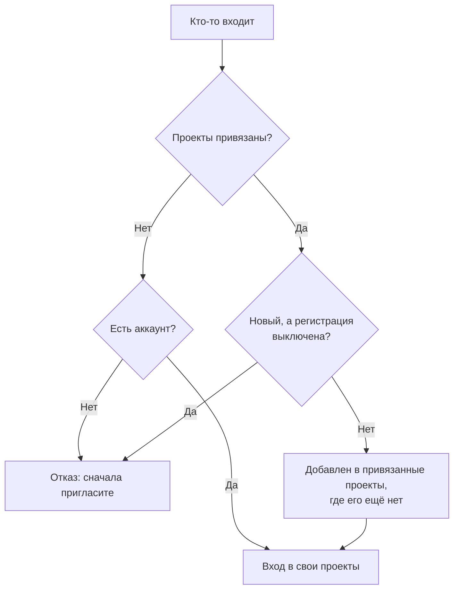

# Глобальный SSO

Глобальный SSO позволяет **администратору экземпляра** OneUptime (мастер-администратору) настроить поставщика удостоверений SAML 2.0 или OpenID Connect (OIDC) **один раз**, на уровне экземпляра, и подключить его к любому проекту на сервере. Вместо того чтобы каждый владелец проекта настраивал собственного поставщика удостоверений, мастер-администратор настраивает одного, который обслуживает весь экземпляр.

> [!NOTE]
> Глобальный SSO, включая переключатель "Require SSO for Login" для всего экземпляра, входит во все редакции OneUptime: он есть на любом самостоятельно размещённом экземпляре, в том числе в Community Edition, и лицензия для него не нужна. Это администрирование экземпляра, поэтому к OneUptime Cloud он не относится. Что входит в каждую редакцию, см. [Редакция Enterprise](/docs/self-hosted/enterprise).

:::cards
- [Настройка поставщика](#настройка-глобального-sso): Создайте его, передайте поставщику удостоверений URL из OneUptime и проверьте его.
- [Как входят пользователи](#как-входят-пользователи): Только существующие участники или новички, которых добавляют в привязанные вами проекты.
- [Обязательный SSO](#обязательный-sso): Требуйте SSO для одного проекта или для всего экземпляра.
- [Выключение поставщика](#выключение-или-удаление-поставщика): Что прекращается и какие изменения OneUptime отклоняет.
:::

## Глобальный SSO и SSO проекта

|                   | SSO проекта                                           | Глобальный SSO                                          |
| ----------------- | ----------------------------------------------------- | ------------------------------------------------------- |
| Кто настраивает   | Владелец или администратор проекта (Настройки проекта) | Мастер-администратор экземпляра (Admin Dashboard)      |
| Область действия  | Один проект                                           | Весь экземпляр, можно подключить к любому проекту       |
| Результат входа   | Доступ к этому одному проекту                         | Доступ ко всем проектам, доступным пользователю         |

Собственный поставщик отдельного проекта описан в разделе [SSO](/docs/identity/sso).

## Настройка глобального SSO

:::steps
### Откройте список поставщиков

:::tabs
@tab SAML
Войдите как мастер-администратор и откройте Admin Dashboard через **Настройки администратора** в меню пользователя. Затем перейдите в **Настройки** > **Аутентификация** > **Global SSO**.
@tab OpenID Connect
Войдите как мастер-администратор и откройте Admin Dashboard через **Настройки администратора** в меню пользователя. Затем перейдите в **Настройки** > **Аутентификация** > **Global OIDC**.
:::

### Создайте поставщика

:::tabs
@tab SAML
- Нажмите **Create Global SSO**.
- Введите **Имя**, **Sign On URL** и **Issuer** из вашего поставщика удостоверений и вставьте **Public Certificate**. Всё остальное уже заполнено в разделе **Дополнительные поля**: **Signature Method** (`RSA-SHA256`), **Digest Method** (`SHA256`) и описание (`Sign in with` и имя). Меняйте их, только если этого требует ваш IdP. После сохранения откроется страница поставщика.
@tab OpenID Connect
- Нажмите **Create Global OIDC**.
- Введите **Имя**, **Issuer URL**, а также **Client ID** и **Client Secret** приложения, которое вы зарегистрировали в своём IdP. Можно также вставить в **Issuer URL** URL обнаружения IdP. Всё остальное уже заполнено в разделе **Дополнительные поля**: **Discovery URL** (издатель, за которым следует `/.well-known/openid-configuration`), **Scopes** (`openid email profile`), имена утверждений `email` и `name` и описание (`Sign in with` и имя). Меняйте их, только если этого требует ваш IdP. После сохранения откроется страница поставщика.
:::

### Скопируйте URL из OneUptime в поставщика удостоверений

:::tabs
@tab SAML
На странице поставщика карточка **Identity Provider URLs** показывает **ACS URL (Assertion Consumer Service / Reply URL)** и **Issuer (Entity ID)**. Вставьте оба значения в своего поставщика удостоверений (Okta, Microsoft Entra ID, OneLogin, JumpCloud и другие).
@tab OpenID Connect
На странице поставщика карточка **Identity Provider URL** показывает **Redirect URI (Callback URL)**. Добавьте его в разрешённые URI перенаправления вашего поставщика удостоверений.
:::

### Включите поставщика

Новый поставщик создаётся выключенным. Нажмите **Edit Configuration** на странице поставщика и включите **Включено**.

Включение глобального поставщика только добавляет на страницу входа вариант "Sign in with SSO" — оно никогда не делает SSO обязательным и никого не блокирует, поэтому его можно спокойно включить, проверить и при необходимости снова выключить.

### Проверьте поставщика

Используйте ссылку в карточке **Test this SSO provider** (**Test this OIDC provider** для OpenID Connect), чтобы выполнить полный вход через вашего поставщика удостоверений. Привязывать проекты заранее не нужно: проверка выполняет вход в проекты, в которых вы уже состоите. Чтобы ссылка работала, поставщик должен быть включён.
:::

## Как входят пользователи

Поведение глобального поставщика зависит от того, привязаны ли к нему проекты:

- **Проекты не привязаны (все проекты / сначала приглашение):** Пользователи могут входить через поставщика и попадать во **все проекты, в которых они уже состоят**. Новые пользователи **не** создаются автоматически — пользователя сначала нужно пригласить в проект. Используйте этот вариант для SSO в масштабе всей компании, когда членство управляется в другом месте.

- **Проекты привязаны (автоматическая подготовка учётных записей):** Откройте поставщика и используйте таблицу **Attached Projects**, чтобы привязать один или несколько проектов, каждый с набором команд по умолчанию. Пользователи, которые входят, **автоматически добавляются** в эти проекты и при первом входе включаются в команды по умолчанию. Привязанный проект начинается с команды участников; выберите другие команды, если новые пользователи должны начинать с другим доступом. Добавляйте по одному проекту с командами за раз, чтобы сформировать список; чтобы изменить привязку, удалите её и добавьте заново.

Тот, кто уже состоит в привязанном проекте, сохраняет там свои команды.

Это поведение меняют два переключателя поставщика. Оба изначально выключены и свёрнуты в разделе **Дополнительные поля**:

| Переключатель | Что он делает, когда включён |
| --- | --- |
| **Disable Sign Up with SSO** | Людей нужно пригласить в проект, прежде чем они смогут входить через этого поставщика, даже когда проекты привязаны. При первом входе никто новый не создаётся. |
| **Restrict to Attached Projects** | Вход через этого поставщика удовлетворяет требованию SSO только в привязанных к нему проектах, поэтому люди, которые уже вошли, могут потерять доступ к другим проектам. Когда он выключен, вход удовлетворяет требованию во всех проектах, где состоит человек, а привязанные проекты определяют только то, куда добавляются новички. |

## Обязательный SSO

Настройка глобального поставщика никого не заставляет им пользоваться; вход с паролем по-прежнему работает. Чтобы требовать SSO, включите требование для проекта или для всего экземпляра:

- **Для проекта:** проект может требовать SSO и при желании требовать _конкретного_ поставщика (проекта или глобального). См. [Обязательный SSO для проекта](/docs/identity/sso#обязательный-sso-для-проекта).
- **Для всего экземпляра:** в **Admin** > **Настройки** > **Аутентификация** есть переключатель **Требовать SSO для входа**, который делает SSO обязательным для всех пользователей экземпляра. Перед включением он просит подтверждения и сохраняется, как только вы подтвердите. Мастер-администраторы остаются исключением, чтобы их нельзя было заблокировать.

Чтобы включить **Требовать SSO для входа**, нужен поставщик SSO, который выполняет вход, чтобы никто из-за этого не потерял доступ:

- Для всего экземпляра он нужен каждому проекту, который сам SSO не требует: один из собственных включённых поставщиков SAML или OIDC проекта или включённый глобальный поставщик, который выполняет вход в этот проект. Пока у проекта его нет, включение переключателя отклоняется, а сообщение называет проекты (или, если их много, первые несколько и их общее число). Сначала включите глобального поставщика или поставщика в этих проектах. Проекту, который требует конкретного поставщика, нужен именно он: пока он выключен, удалён или не выполняет вход в проект, сообщение называет этот проект отдельно — сначала включите этого поставщика или потребуйте там другого.
- Для проекта то же самое требуется от этого проекта и от поставщика, которого он требует, если требует.
- Сохранение, которое отправляет **Требовать SSO для входа** включённым, когда он уже включён, — вместе с другими настройками или из API, — проверяется так же, для экземпляра или для проекта, как и сохранение, которое указывает поставщика, которого проект уже требует.
- Для нового проекта, у которого ещё нет собственного поставщика: пока экземпляр требует SSO, для создания проекта нужен включённый глобальный поставщик, который выполняет вход во все проекты, иначе никто, включая создателя, не смог бы его открыть. Без него создание проекта отклоняется, а сообщение просит администратора сервера включить такого поставщика. Мастер-администраторы по-прежнему могут создавать проекты. Проекту, создаваемому с уже включённым **Требовать SSO для входа**, нужно то же самое, кто бы его ни создавал.

Выключение никогда не отклоняется.

## Выключение или удаление поставщика

Выключение глобального поставщика, его удаление или ограничение привязанными проектами завершает выполненные через него входы там, где он больше не выполняет вход. Там, где SSO обязателен, люди, вошедшие через него, должны снова войти через SSO при следующем запросе, открытые у них страницы сразу перестают получать обновления в реальном времени, а клиент MCP, который кто-то подключил после входа через этого поставщика, перестаёт работать в проекте.

Повторное включение поставщика не возвращает эти входы: люди снова входят через него. Поставщик, который уже был выключен на момент обновления, считается выключенным при обновлении.

Новый сертификат или секрет клиента, другие URL или новое имя сохраняют вход для всех.

### Каждый проект, требующий SSO, сохраняет путь внутрь

Проект, который требует SSO сам или потому, что этого требует весь экземпляр, всегда сохраняет поставщика, через которого в него можно войти. Поэтому следующие изменения отклоняются, пока они оставили бы такой проект совсем без поставщика или лишили бы его требуемого поставщика:

- выключение глобального поставщика, его удаление или ограничение привязанными проектами;
- для поставщика, ограниченного привязанными проектами: привязка первого проекта (до этого он выполняет вход во все проекты), выключение привязки, её перенос в другой проект или к другому поставщику или её удаление.

Сообщение называет проекты или первые несколько и их общее число. Сначала включите для них другого поставщика, собственного или глобального, или выключите там **Требовать SSO для входа**. Проект, который требует именно этого поставщика, называется отдельно: сначала потребуйте там другого поставщика или выключите **Требовать SSO для входа**.

Изменения, которые позволяют поставщику выполнять вход для большего числа людей, — включение его или привязки, снятие ограничения — никогда не отклоняются. Они сразу доходят до всех серверов приложений, так же как выключение **Требовать SSO для входа**: люди могут сразу входить через поставщика. Только когда в тот же самый момент сохраняется другое изменение того же поставщика, серверу приложений может понадобиться до минуты, чтобы это учесть.

Два изменения того, кто может входить, проверяются одно за другим. Если в тот же момент сохраняется другое и это занимает больше времени, чем обычно, — включение **Требовать SSO для входа** для всего экземпляра читает все проекты, — изменение отклоняется с сообщением "Another change to who can sign in with SSO is being saved. Try again in a moment.": сохраните его снова. Проект, создаваемый в этот момент, тоже ждёт изменения, а если ждёт слишком долго, отклоняется с сообщением "The server's SSO settings are being changed. Create the project again in a moment."

## Устранение неполадок

:::details "You must be invited to a project on this OneUptime instance before you can sign in with SSO"
У человека ещё нет аккаунта OneUptime, а поставщик его не создаёт: либо к нему не привязаны проекты, либо включён **Disable Sign Up with SSO**. Пригласите человека в проект или привяжите проект к поставщику.
:::

:::details "This SSO provider does not grant access to any project you are a member of"
Включён **Restrict to Attached Projects**, а человек не состоит ни в одном проекте, привязанном к поставщику. Привяжите один из его проектов или добавьте его в привязанный проект.
:::

:::details "You are not a member of any project on this OneUptime instance"
У человека есть аккаунт, но он не состоит ни в одном проекте, а поставщику некуда его добавить. Пригласите человека в проект или привяжите к поставщику проект с командами по умолчанию.
:::

:::details "Issuer URL does not match"
Для поставщика SAML издатель в ответе вашего поставщика удостоверений не совпадает с **Issuer**, сохранённым у поставщика. Скопируйте его заново из поставщика удостоверений; значения должны совпадать в точности.
:::

## Дальнейшие шаги

:::cards
- [SSO](/docs/identity/sso): Настройте собственного поставщика SAML или OIDC для проекта.
- [SCIM](/docs/identity/scim): Пусть поставщик удостоверений сам добавляет и удаляет людей.
- [Пользователи, команды и разрешения](/docs/permissions/index): Что разрешают новичкам команды, в которые они попадают.
:::
