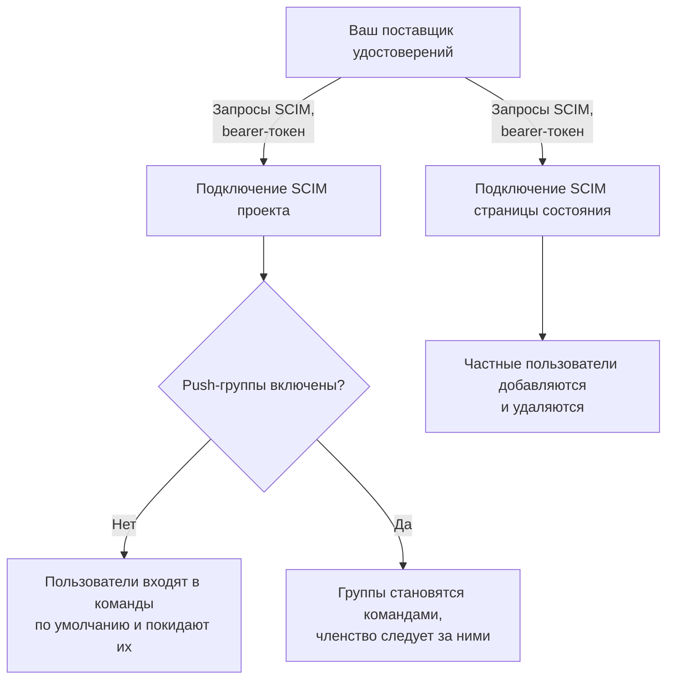
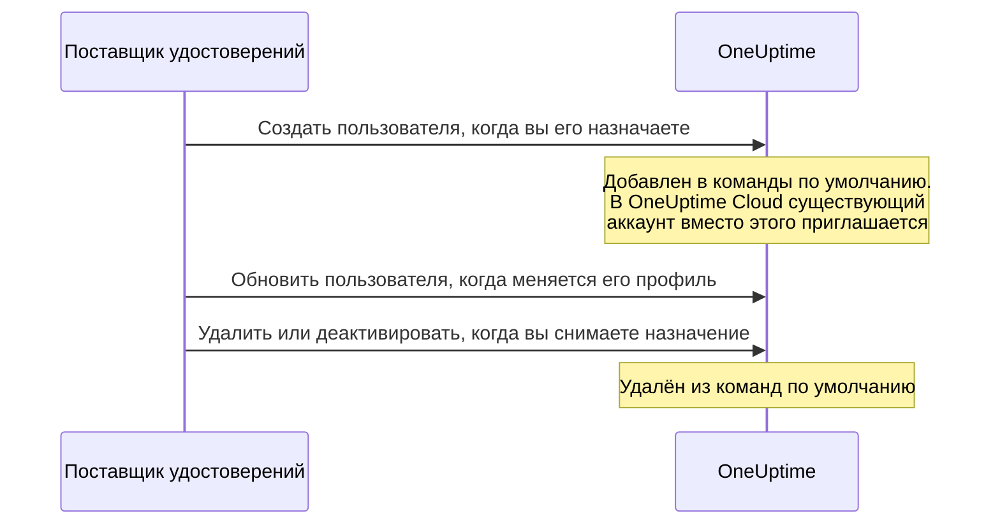

# SCIM

SCIM (System for Cross-domain Identity Management) автоматически предоставляет и отзывает доступ людей. Ваш поставщик удостоверений (IdP) — Microsoft Entra ID, Okta или любая другая система SCIM 2.0 — добавляет людей в ваши проекты OneUptime и частные страницы состояния, когда вы их назначаете, и удаляет, когда вы снимаете назначение.

> [!NOTE]
> **Редакция:** SCIM входит в OneUptime Enterprise Edition. В OneUptime Cloud он доступен начиная с плана **Scale**. Самостоятельно размещённым установкам нужны образ Enterprise Edition и лицензия. См. [Редакция Enterprise](/docs/self-hosted/enterprise). Без действующей лицензии (после 14-дневного пробного периода или через 30 дней после истечения лицензии) запросы SCIM отклоняются, пока лицензия не будет активирована.

:::cards
- [Настройка SCIM проекта](#настройка-scim-проекта): Создайте подключение и передайте своему IdP его URL и токен.
- [Настройка SCIM страницы состояния](#настройка-scim-страницы-состояния): Предоставляйте доступ частным пользователям страницы состояния.
- [Подключение поставщика удостоверений](#подключение-поставщика-удостоверений): Пошагово для Microsoft Entra ID и Okta.
- [Часто задаваемые вопросы](#часто-задаваемые-вопросы): Существующие пользователи, отзыв доступа, смена адресов электронной почты.
:::

## Как это работает

Ваш поставщик удостоверений обращается к конечной точке SCIM в OneUptime, проходя аутентификацию с bearer-токеном, каждый раз, когда вы назначаете кого-то, меняете что-то или снимаете назначение. Что меняет запрос, зависит от того, где находится подключение:



Интеграция SCIM даёт следующие преимущества:

- **Автоматическое предоставление доступа**: пользователи создаются в OneUptime, когда их назначают в вашем IdP.
- **Автоматический отзыв доступа**: пользователи удаляются из OneUptime, когда с них снимают назначение в вашем IdP.
- **Синхронизация атрибутов пользователей**: данные пользователей совпадают в вашем IdP и в OneUptime.
- **Централизованное управление доступом**: доступом к OneUptime управляют из вашей существующей системы управления удостоверениями.

SCIM и [SSO](/docs/identity/sso) независимы: SCIM определяет, кто состоит в проекте, а SSO — как люди входят. Большинство организаций используют оба.

## SCIM для проектов

SCIM проекта позволяет поставщикам удостоверений управлять участниками команд в проектах OneUptime.

### Настройка SCIM проекта

Добавлять или изменять подключение SCIM проекта, а также видеть или сбрасывать его bearer-токен может только владелец проекта: через SCIM ваш поставщик удостоверений может добавлять людей в любую команду проекта.
:::steps
1. **Откройте настройки проекта**

   - Откройте свой проект OneUptime
   - Перейдите в **Настройки проекта** > **Безопасность** > **SCIM**

2. **Настройте параметры SCIM**

   - Введите **Имя**. Поле **Команды по умолчанию** изначально содержит команду участников вашего проекта: новые пользователи добавляются в эти команды
   - В разделе **Дополнительные поля** **Автоматическое предоставление пользователей** (добавлять пользователей, когда их назначают в вашем IdP) и **Автоматический отзыв доступа пользователей** (удалять пользователей, когда с них снимают назначение в вашем IdP) включены, а **Включить push-группы** выключено. При необходимости измените их там
   - Сохраните. Сразу откроется диалог с **SCIM Base URL** и **Bearer Token** для настройки вашего IdP

3. **Настройте поставщика удостоверений**

   - Используйте **SCIM Base URL** из диалога. В OneUptime Cloud это `https://oneuptime.com/identity/scim/v2/<scim-id>`; самостоятельно размещённая установка показывает собственный хост
   - Настройте аутентификацию с bearer-токеном, используя **Bearer Token** из диалога
   - Сопоставьте атрибуты пользователей (адрес электронной почты обязателен). Подробности для Microsoft Entra ID и Okta см. в разделе [Подключение поставщика удостоверений](#подключение-поставщика-удостоверений)
:::

Чтобы снова увидеть URL, выберите **Просмотреть URL SCIM** в строке подключения. **Сбросить Bearer-токен** заменяет токен; обновите поставщика удостоверений, указав новый.

### Как предоставляется доступ пользователю проекта



Человек, у которого уже был аккаунт OneUptime, присоединяется, когда принимает приглашение в OneUptime Cloud (см. [часто задаваемые вопросы](#часто-задаваемые-вопросы)). Доступ, выданный через команды вне команд по умолчанию этого подключения, не затрагивается.

## SCIM для страниц состояния

SCIM страницы состояния позволяет поставщикам удостоверений предоставлять и отзывать доступ частным пользователям страниц состояния, которые могут открывать частные страницы состояния.

### Настройка SCIM страницы состояния

:::steps
1. **Откройте настройки страницы состояния**

   - Откройте **Страницы состояния** и выберите свою страницу состояния
   - Перейдите в **Безопасность** > **SCIM**

2. **Настройте параметры SCIM**

   - Введите **Имя**. В разделе **Дополнительные поля** **Автоматическое предоставление пользователей** (добавлять частных пользователей, когда их назначают в вашем IdP) и **Автоматический отзыв доступа пользователей** (удалять частных пользователей, когда с них снимают назначение в вашем IdP) включены. При необходимости измените их там
   - Сохраните. Сразу откроется диалог с **SCIM Base URL** и **Bearer Token** для настройки вашего IdP

3. **Настройте поставщика удостоверений**

   - Используйте **SCIM Base URL** из диалога. В OneUptime Cloud это `https://oneuptime.com/identity/status-page-scim/v2/<scim-id>`
   - Настройте аутентификацию с bearer-токеном, используя показанный токен
   - Сопоставьте атрибуты пользователей (адрес электронной почты обязателен)
:::

Чтобы снова увидеть URL, выберите **Показать URL-адреса конечной точки SCIM** в строке подключения.

SCIM страницы состояния поддерживает только пользователей. Группы и предоставление доступа группам не поддерживаются.

### Как предоставляется доступ частному пользователю

```mermaid title="Жизненный цикл частного пользователя в SCIM страницы состояния"
sequenceDiagram
    participant IdP as Поставщик удостоверений
    participant O as OneUptime
    IdP->>O: Создать пользователя, когда вы его назначаете
    Note over O: Частный пользователь может открывать<br/>частную страницу состояния
    IdP->>O: Удалить или задать active равным false
    Note over O: Частный пользователь и его<br/>сеансы удалены
```

> [!WARNING]
> Отзыв доступа безвозвратно удаляет частного пользователя страницы состояния и все его сеансы на этой странице состояния. Если позже пользователя снова назначат, он будет добавлен как новый частный пользователь. Когда **Автоматический отзыв доступа пользователей** выключен, обновления, задающие `active` равным `false`, игнорируются, а запросы DELETE отклоняются.

## Подключение поставщика удостоверений

Для каждого поставщика ниже сначала создаётся подключение SCIM проекта в OneUptime, а затем к нему подключается ваш поставщик удостоверений.

### Microsoft Entra ID (ранее Azure AD)

Microsoft Entra ID обеспечивает управление удостоверениями корпоративного уровня с предоставлением доступа через SCIM. Вам нужны:

- Клиент Microsoft Entra ID с лицензией Premium P1 или P2 (требуется для автоматического предоставления доступа).
- Проект OneUptime на плане **Scale** или выше в OneUptime Cloud.
- Права администратора и в Microsoft Entra ID, и в OneUptime.

:::steps
#### Создайте подключение SCIM для Entra ID

1. Войдите в панель управления OneUptime
2. Перейдите в **Настройки проекта** > **Безопасность** > **SCIM**
3. Нажмите **Создать: SCIM**
4. Введите понятное имя (например, "Microsoft Entra ID Provisioning")
5. Проверьте параметры:
   - **Команды по умолчанию**: изначально содержит команду участников вашего проекта; новые пользователи добавляются в эти команды
   - **Автоматическое предоставление пользователей** и **Автоматический отзыв доступа пользователей**: включены, в разделе **Дополнительные поля**
   - **Включить push-группы**: в разделе **Дополнительные поля**; включите, если хотите управлять составом команд через группы Entra ID
6. Сохраните конфигурацию
7. Скопируйте **SCIM Base URL** и **Bearer Token** из открывшегося диалога — они понадобятся в Entra ID

#### Создайте корпоративное приложение в Entra ID

1. Войдите в [Microsoft Entra admin center](https://entra.microsoft.com)
2. Перейдите в **Identity** > **Applications** > **Enterprise applications**
3. Нажмите **+ New application**, затем **+ Create your own application**
4. Введите имя (например, "OneUptime")
5. Выберите **Integrate any other application you don't find in the gallery (Non-gallery)** и нажмите **Create**

#### Подключите Entra ID к OneUptime

1. В корпоративном приложении OneUptime перейдите в **Provisioning** и нажмите **Get started**
2. Задайте **Provisioning Mode** равным **Automatic**
3. В разделе **Admin Credentials** задайте **Tenant URL** равным **SCIM Base URL** из OneUptime (например, `https://oneuptime.com/identity/scim/v2/<scim-id>`), а **Secret Token** — равным **Bearer Token**
4. Нажмите **Test Connection**, чтобы проверить конфигурацию, затем нажмите **Save**

#### Сопоставьте атрибуты пользователей в Entra ID

1. В разделе Provisioning нажмите **Mappings**, затем **Provision Azure Active Directory Users**
2. Настройте следующие сопоставления атрибутов, удалите ненужные и нажмите **Save**:

| Атрибут Azure AD                                              | Атрибут SCIM в OneUptime       | Обязательный  |
| ------------------------------------------------------------- | ------------------------------ | ------------- |
| `userPrincipalName`                                           | `userName`                     | Да            |
| `mail`                                                        | `emails[type eq "work"].value` | Рекомендуется |
| `displayName`                                                 | `displayName`                  | Рекомендуется |
| `givenName`                                                   | `name.givenName`               | Необязательно |
| `surname`                                                     | `name.familyName`              | Необязательно |
| `Switch([IsSoftDeleted], , "False", "True", "True", "False")` | `active`                       | Рекомендуется |

#### Сопоставьте группы в Entra ID (необязательно)

Если вы включили **Включить push-группы** в OneUptime:

1. Вернитесь в **Mappings** и нажмите **Provision Azure Active Directory Groups**
2. Задайте **Enabled** равным **Yes**
3. Настройте следующие сопоставления атрибутов и нажмите **Save**:

| Атрибут Azure AD | Атрибут SCIM в OneUptime |
| ---------------- | ------------------------ |
| `displayName`    | `displayName`            |
| `members`        | `members`                |

#### Назначьте пользователей и группы в Entra ID

1. В корпоративном приложении OneUptime перейдите в **Users and groups**
2. Нажмите **+ Add user/group**, выберите пользователей и группы, которым нужен доступ в OneUptime, и нажмите **Assign**

#### Запустите предоставление доступа в Entra ID

1. Перейдите в **Provisioning** > **Overview** и нажмите **Start provisioning**
2. Начнётся первый цикл предоставления доступа; первая синхронизация может занять до 40 минут
3. Проверьте **Provisioning logs** на наличие ошибок. Назначенные вами люди появятся в командах проекта в OneUptime
:::

### Okta

Okta обеспечивает гибкое управление удостоверениями с поддержкой SCIM. Вам нужны:

- Клиент Okta с возможностью предоставления доступа (функция Lifecycle Management).
- Проект OneUptime на плане **Scale** или выше в OneUptime Cloud.
- Права администратора и в Okta, и в OneUptime.

:::steps
#### Создайте подключение SCIM для Okta

1. Войдите в панель управления OneUptime
2. Перейдите в **Настройки проекта** > **Безопасность** > **SCIM**
3. Нажмите **Создать: SCIM**
4. Введите понятное имя (например, "Okta Provisioning")
5. Проверьте параметры:
   - **Команды по умолчанию**: изначально содержит команду участников вашего проекта; новые пользователи добавляются в эти команды
   - **Автоматическое предоставление пользователей** и **Автоматический отзыв доступа пользователей**: включены, в разделе **Дополнительные поля**
   - **Включить push-группы**: в разделе **Дополнительные поля**; включите, если хотите управлять составом команд через группы Okta
6. Сохраните конфигурацию
7. Скопируйте **SCIM Base URL** и **Bearer Token** из открывшегося диалога — они понадобятся в Okta

#### Создайте или откройте приложение Okta

В Okta Admin Console перейдите в **Applications** > **Applications**:

- Если вы уже используете Okta для SSO в OneUptime, откройте это приложение.
- Иначе нажмите **Create App Integration**, выберите **SAML 2.0**, назовите приложение "OneUptime" и завершите настройку SAML (см. [SSO](/docs/identity/sso)).

#### Включите предоставление доступа через SCIM в Okta

1. В приложении OneUptime перейдите на вкладку **General**
2. В разделе **App Settings** нажмите **Edit**, выберите **SCIM** в поле **Provisioning** и нажмите **Save**
3. Появится новая вкладка **Provisioning**

#### Подключите Okta к OneUptime

1. На вкладке **Provisioning** нажмите **Integration**, затем **Configure API Integration** и отметьте **Enable API integration**
2. Настройте следующее:
   - **SCIM connector base URL**: **SCIM Base URL** из OneUptime (например, `https://oneuptime.com/identity/scim/v2/<scim-id>`)
   - **Unique identifier field for users**: `userName`
   - **Supported provisioning actions**: Import New Users and Profile Updates, Push New Users, Push Profile Updates и, если вы используете предоставление доступа на основе групп, Push Groups
   - **Authentication Mode**: **HTTP Header**
   - **Authorization**: **Bearer Token** из OneUptime. OneUptime ожидает заголовок `Authorization: Bearer <token>`; если Okta уже показывает слово Bearer перед полем, введите только токен
3. Нажмите **Test API Credentials**, чтобы проверить подключение, затем нажмите **Save**

#### Выберите, что Okta предоставляет

1. На вкладке **Provisioning** нажмите **To App**, затем **Edit**
2. Включите **Create Users**, **Update User Attributes** и **Deactivate Users** и нажмите **Save**

#### Сопоставьте атрибуты пользователей в Okta

Прокрутите до **Attribute Mappings** и проверьте эти сопоставления. Удалите ненужные:

| Атрибут Okta       | Атрибут SCIM в OneUptime        | Направление         |
| ------------------ | ------------------------------- | ------------------- |
| `userName`         | `userName`                      | Из Okta в приложение |
| `user.email`       | `emails[primary eq true].value` | Из Okta в приложение |
| `user.firstName`   | `name.givenName`                | Из Okta в приложение |
| `user.lastName`    | `name.familyName`               | Из Okta в приложение |
| `user.displayName` | `displayName`                   | Из Okta в приложение |

#### Отправляйте группы из Okta (необязательно)

Если вы включили **Включить push-группы** в OneUptime:

1. Перейдите на вкладку **Push Groups** и нажмите **+ Push Groups**
2. Выберите **Find groups by name** или **Find groups by rule**
3. Найдите и выберите группы для отправки и нажмите **Save**

#### Назначьте людей в Okta

1. Перейдите на вкладку **Assignments**
2. Нажмите **Assign** > **Assign to People** или **Assign to Groups**, выберите, кому предоставить доступ, нажмите **Assign** для каждого, затем **Done**

#### Проверьте предоставление доступа в Okta

1. В Okta Admin Console перейдите в **Reports** > **System Log** и отфильтруйте по своему приложению OneUptime
2. Убедитесь, что события предоставления доступа прошли успешно и что люди появились в командах проекта в OneUptime
:::

### Другие поставщики удостоверений

Реализация SCIM в OneUptime следует спецификации SCIM v2.0 и работает с любым совместимым поставщиком удостоверений:

| Параметр | Значение |
| --- | --- |
| SCIM Base URL | **SCIM Base URL** из OneUptime: `https://oneuptime.com/identity/scim/v2/<scim-id>` для проекта или `https://oneuptime.com/identity/status-page-scim/v2/<scim-id>` для страницы состояния |
| Аутентификация | HTTP Bearer-токен |
| Уникальный идентификатор пользователя | `userName`, который должен быть действительным адресом электронной почты |
| Операции | GET, POST, PUT, PATCH и DELETE для Users в SCIM проекта и SCIM страницы состояния. Groups поддерживаются только в SCIM проекта. |

## Справочник API SCIM

Пути указаны относительно **SCIM Base URL** подключения.

| Конечная точка           | Методы                  | Описание                                                |
| ------------------------ | ----------------------- | ------------------------------------------------------- |
| `/ServiceProviderConfig` | GET                     | Возможности сервера SCIM                                |
| `/Schemas`               | GET                     | Доступные схемы ресурсов                                |
| `/ResourceTypes`         | GET                     | Доступные типы ресурсов                                 |
| `/Users`                 | GET, POST               | Список и создание пользователей                         |
| `/Users/{id}`            | GET, PUT, PATCH, DELETE | Управление отдельными пользователями                    |
| `/Groups`                | GET, POST               | Список и создание групп/команд (только SCIM проекта)    |
| `/Groups/{id}`           | GET, PUT, PATCH, DELETE | Управление отдельными группами (только SCIM проекта)    |
| `/Bulk`                  | POST                    | Несколько операций в одном запросе                      |

Что сообщает `/ServiceProviderConfig`:

| Возможность | Поддерживается |
| --- | --- |
| PATCH | Да |
| Bulk | Да, до 1000 операций и 1 МБ на запрос |
| Filter | Да, до 200 результатов |
| Сортировка | Да |
| Смена пароля | Нет |
| ETag | Нет |
| Аутентификация | HTTP Bearer-токен |

Группа, которую создаёт ваш поставщик удостоверений, становится командой с тем же именем в проекте; если команда с таким именем уже есть, вместо создания новой используется она.

:::details Схема пользователя SCIM
```json
{
  "schemas": ["urn:ietf:params:scim:schemas:core:2.0:User"],
  "userName": "user@example.com",
  "name": {
    "givenName": "John",
    "familyName": "Doe",
    "formatted": "John Doe"
  },
  "displayName": "John Doe",
  "emails": [
    {
      "value": "user@example.com",
      "type": "work",
      "primary": true
    }
  ],
  "active": true
}
```
:::

:::details Схема группы SCIM
```json
{
  "schemas": ["urn:ietf:params:scim:schemas:core:2.0:Group"],
  "displayName": "Engineering Team",
  "members": [
    {
      "value": "user-id-here",
      "display": "user@example.com"
    }
  ]
}
```
:::

## Планы и лицензии

В OneUptime Cloud для SCIM нужен план **Scale**. Самостоятельно размещённой установке нужны Enterprise Edition и лицензия, как сказано в примечании в начале страницы.

### Ниже плана Scale

В OneUptime Cloud предоставление доступа через SCIM работает полностью, только пока проект находится на плане **Scale** или выше. Ниже него — после окончания пробного периода Scale или перехода на более низкий план — подключения SCIM проекта и его страниц состояния только удаляют людей, чтобы все, кто уходит, по-прежнему теряли доступ:

- **По-прежнему работает:** деактивация пользователя (`active` равно `false` в подключении, настроенном на удаление деактивируемых им людей), удаление пользователя, удаление участников из группы (`Remove` в Entra ID для `members` с участниками в качестве значения, `remove` в Okta для `members[value eq "..."]` или замена участников частью тех, кто уже есть в группе), удаление группы и запрос `Bulk`, состоящий только из `DELETE`. Запросы на чтение тоже получают ответ — получение списков и фильтрация пользователей и групп, которые поставщики удостоверений выполняют перед удалением кого-либо, — но ниже плана чтение никогда никого не создаёт.
- **Отклоняется:** создание пользователя или группы, повторная активация пользователя (`active` равно `true` для того, кого подключение вернуло бы в одну из своих команд), добавление кого-то в группу, в которой его нет, а также изменение только адреса электронной почты или имени пользователя либо названия группы. Запрос, который кого-то добавляет, отклоняется целиком, даже если одновременно удаляет людей, потому что `PATCH` в SCIM выполняется по принципу «всё или ничего». Отказ — это `402` с ошибкой в формате SCIM, которую показывает ваш поставщик удостоверений: `SCIM provisioning needs the Scale plan. This project's plan does not include it, so its SCIM connections can only remove people: requests that add or change people or groups are refused. The connections are kept: upgrade the project to Scale in Project Settings > Billing and they work fully again.` Каждый отказ также записывается в журналы SCIM подключения.
- **Удаление, которое заодно меняет профиль** — деактивация, отправляющая новый адрес электронной почты или новое имя, или обновление группы, которое удаляет участников и переименовывает группу, — проходит, а адрес электронной почты, имя или название группы остаются прежними. Поставщики удостоверений повторно отправляют то, что видят отличающимся, поэтому однажды отклонённое изменение возвращается с их последующими запросами, а удаление никогда не ждёт плана. Деактивация в подключении, которое не удаляет деактивируемых им людей (автоматический отзыв доступа выключен или вместо этого отправляются группы), никого не удаляет, поэтому отправленные вместе с ней новый адрес электронной почты или новое имя отклоняются как отдельное изменение.
- **Запрос, который ничего не меняет, получает обычный ответ** — `PUT` пользователя в Okta без изменений, с `active` равным `true`, для того, кто уже состоит во всех командах подключения; добавление кого-то в группу, в которой он уже есть; адрес электронной почты, отправленный повторно в другом регистре; атрибуты, которые OneUptime не хранит, например должность или отдел. Частный пользователь страницы состояния либо есть на странице, либо его нет вовсе, поэтому `active` равно `true` никогда не меняет такого пользователя.

Ничего не удаляется. Перейдите на **Scale**, и подключения снова будут работать полностью, как есть, с тем же bearer-токеном и без повторной настройки в вашем поставщике удостоверений; смена плана вступает в силу в течение минуты. Поставщики удостоверений продолжают обращаться по своему расписанию: Okta показывает отказы среди своих ошибок предоставления доступа, а Entra ID показывает их в своих журналах предоставления доступа и может поместить постоянно завершающееся ошибкой задание в карантин, из-за чего синхронизации — включая удаления — замедляются примерно до одной в день. После перехода на план перезапустите там предоставление доступа, чтобы люди, добавленные за это время, получили доступ.

Ниже **Scale** раздел **Настройки проекта** > **Безопасность** > **SCIM** и страница **SCIM** страницы состояния показывают подключения под предложением перейти на план (**Оставшиеся подключения SCIM**) и сообщают, что они только удаляют людей. Чтобы избавиться от подключения, удалите его. Чтобы добавить подключение, изменить его или заменить его bearer-токен, нужен **Scale**. Список не показывает bearer-токены, а прочитать токен могут только владельцы проекта, на любом плане.

## Устранение неполадок

Начните с вкладки **Журналы** в разделе **Настройки проекта** > **Безопасность** > **SCIM** (или на странице **SCIM** страницы состояния). Она перечисляет запросы SCIM, которые отправил ваш поставщик удостоверений, с их статусом, а **Просмотреть подробности** показывает запрос и ответ OneUptime.

:::details Entra ID: Test Connection завершается ошибкой
Убедитесь, что **Tenant URL** в точности совпадает с **SCIM Base URL**, который показывает OneUptime, а **Secret Token** — с текущим **Bearer Token**. После **Сбросить Bearer-токен** старый токен перестаёт работать.
:::

:::details Okta: проверка учётных данных API не проходит или запросы получают 401 Unauthorized
Проверьте **SCIM connector base URL** и токен. OneUptime читает заголовок `Authorization: Bearer <token>`, поэтому убедитесь, что слово Bearer отправляется ровно один раз. Если токен потерян или утёк, выберите **Сбросить Bearer-токен** в OneUptime и обновите Okta.
:::

:::details Пользователям не предоставляется доступ
Убедитесь, что пользователи назначены приложению в вашем поставщике удостоверений, что предоставление доступа там включено и что сопоставления атрибутов верны. В Entra ID каждую ошибку показывают **Provisioning logs**, в Okta — **System Log**.
:::

:::details Дублирующиеся пользователи в Okta
Убедитесь, что `userName` уникален и соответствует адресу электронной почты пользователя.
:::

:::details Ошибки при отправке групп
Убедитесь, что группы существуют в вашем поставщике удостоверений и в них правильные участники, а в OneUptime включено **Включить push-группы**.
:::

:::details Изменения из Entra ID приходят с задержкой
Entra ID предоставляет доступ по собственному расписанию: первая синхронизация может занять до 40 минут, а последующие выполняются примерно каждые 40 минут. Задание, которое Entra ID поместил в карантин, синхронизируется реже; исправьте ошибки в **Provisioning logs** и перезапустите задание.
:::

## Часто задаваемые вопросы

:::details Что происходит, когда у пользователя отзывают доступ?
Отзыв доступа можно запросить запросом DELETE или задав `active` равным `false` в обновлении PUT/PATCH:

- **SCIM проекта**: при включённом **Автоматический отзыв доступа пользователей** пользователь удаляется из команд по умолчанию, настроенных в параметрах SCIM, а аккаунт OneUptime сохраняется. Доступ через другие команды не затрагивается. Когда push-группы включены, составом команд управляет предоставление доступа группам.
- **SCIM страницы состояния**: при включённом **Автоматический отзыв доступа пользователей** частный пользователь страницы состояния и все его сеансы на этой странице состояния безвозвратно удаляются. Отдельный аккаунт пользователя OneUptime в проекте при этом не удаляется.
:::

:::details Можно ли использовать SCIM без SSO?
Да, SCIM и SSO — независимые функции. Можно использовать SCIM для предоставления доступа пользователям и позволить им входить с паролем OneUptime или другим способом аутентификации.
:::

:::details Как поступать с пользователями, которые уже есть в OneUptime?
Когда SCIM пытается создать пользователя, который уже существует (сопоставление по адресу электронной почты), OneUptime не создаёт дубликат. Что происходит дальше, зависит от того, где работает OneUptime:

- **Самостоятельно размещённый**: существующий пользователь сразу добавляется в настроенные команды по умолчанию (или, при push-группах, в команды группы).
- **OneUptime Cloud**: Аккаунт OneUptime принадлежит человеку, а не какому-то одному проекту, поэтому SCIM не может по собственному решению сделать кого-либо участником вашего проекта. Вместо этого существующий пользователь **приглашается** в команды и получает обычное письмо с приглашением. Он присоединяется, когда принимает приглашения в разделе **Приглашения в проект** в OneUptime или когда подтверждает единый вход (SSO) вашего проекта из письма, которое OneUptime отправляет при его первом входе через SSO. До этого он отображается как ожидающий. То же самое происходит, когда группа добавляет существующего пользователя, который ещё не является участником вашего проекта.

Пользователи, которых создаёт сам SCIM, и участники вашего проекта добавляются сразу в обоих случаях. Подтверждение SSO вашего проекта делает человека участником, поэтому он тоже добавляется сразу; тот, кто с тех пор покинул ваш проект, приглашается снова.
:::

:::details Может ли SCIM изменить адрес электронной почты или имя пользователя?
Адрес электронной почты аккаунта OneUptime — это то, с чем человек входит во все проекты, в которых состоит, и куда отправляются ссылки для сброса пароля. Поэтому:

- **OneUptime Cloud**: SCIM никогда не изменяет адрес электронной почты. Запрос, который изменил бы его, отклоняется с ошибкой SCIM `400` типа `mutability`, и ничего из этого запроса не применяется; ваш поставщик удостоверений показывает причину. Попросите пользователя самостоятельно изменить адрес в своём профиле OneUptime. Запрос, который повторяет адрес, уже указанный в аккаунте, не является изменением и выполняется успешно.
- **Самостоятельно размещённый**: SCIM изменяет адрес электронной почты только у пользователя, который присоединился к этому проекту, не состоит ни в одном другом проекте и не является администратором OneUptime. Все остальные изменения отклоняются так же.

Для имён везде действует то же правило: SCIM обновляет имя только у пользователя, который присоединился к этому проекту, не состоит ни в одном другом проекте и не является администратором OneUptime. У всех остальных имя остаётся прежним, а остальная часть запроса всё равно выполняется успешно.
:::

:::details Чем команды по умолчанию отличаются от push-групп?
- **Команды по умолчанию**: все пользователи, получившие доступ через SCIM, добавляются в одни и те же заранее заданные команды
- **Push-группы**: составом команд управляет ваш поставщик удостоверений, поэтому разные пользователи могут состоять в разных командах в зависимости от своих групп в IdP
:::

:::details Как часто выполняется синхронизация?
Это зависит от вашего поставщика удостоверений:

- **Microsoft Entra ID**: первая синхронизация может занять до 40 минут; последующие выполняются каждые 40 минут
- **Okta**: почти в реальном времени для большинства операций, с периодическими полными синхронизациями
:::

## Дальнейшие шаги

:::cards
- [SSO](/docs/identity/sso): Пусть люди, получившие доступ через SCIM, входят через вашего поставщика удостоверений.
- [Пользователи, команды и разрешения](/docs/permissions/index): Что команды по умолчанию разрешают новым пользователям.
- [Глобальный SSO](/docs/identity/global-sso): Один поставщик удостоверений для всех проектов на самостоятельно размещённом экземпляре.
:::
