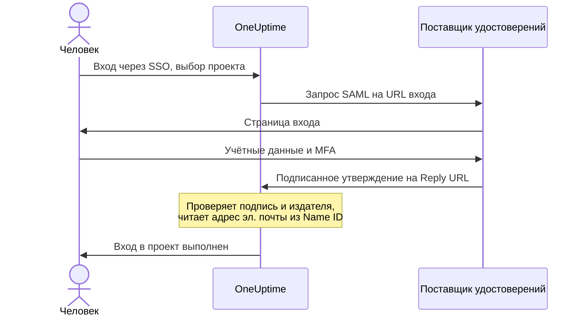

# SSO

Единый вход (SSO) позволяет участникам вашего проекта входить в OneUptime через поставщика удостоверений (IdP) вашей организации по SAML 2.0 или OpenID Connect. Вы управляете доступом, паролями и многофакторной аутентификацией в одном месте и можете требовать SSO от всех в проекте.

> [!NOTE]
> **Редакция:** SSO, включая "Require SSO for login", входит во все редакции OneUptime: самостоятельно размещённые установки получают его в Community Edition, лицензия не нужна. В OneUptime Cloud он доступен начиная с плана **Scale**. Что входит в каждую редакцию, см. [Редакция Enterprise](/docs/self-hosted/enterprise).

:::cards
- [Настройка поставщика SAML](#настройка-sso): Создайте его в OneUptime и передайте своему IdP два URL.
- [Руководства для поставщиков удостоверений](#руководства-для-поставщиков-удостоверений): Keycloak, Microsoft Entra ID и Okta, шаг за шагом.
- [OpenID Connect](#openid-connect-oidc): Вход через приложение OIDC.
- [Обязательный SSO](#обязательный-sso-для-проекта): Сделайте SSO единственным способом войти в проект.
:::

## Как работает вход через SAML

Поставщик SAML связывает один проект с одним приложением в вашем поставщике удостоверений. Тот, кто входит, выбирает проект на странице OneUptime **Вход через SSO**, входит у вашего IdP и возвращается уже авторизованным.



OneUptime читает из утверждения, которое присылает ваш IdP, всего несколько вещей:

| Из утверждения | Что с этим делает OneUptime |
| --- | --- |
| Подпись | Проверяет её по полю **Публичный сертификат** поставщика. Ответ должен быть подписан и не должен быть зашифрован. |
| Issuer | Должен в точности совпадать с полем **Издатель** поставщика. |
| Name ID | Адрес электронной почты человека. Это должен быть действительный адрес электронной почты. |
| `http://schemas.microsoft.com/identity/claims/displayname` | Имя человека, которое используется, когда OneUptime создаёт его аккаунт. Необязательно. |

Те, кто входит впервые, попадают в команды из поля **Команды** поставщика, а эти команды определяют, что они могут делать: см. [Роли и команды для пользователей SSO](#роли-и-команды-для-пользователей-sso).

> [!NOTE]
> В OneUptime Cloud, когда кто-то впервые входит в проект через одного из его поставщиков SAML или OIDC, OneUptime не выполняет вход, а отправляет ему ссылку по электронной почте. Человек открывает её, подтверждает, что единый вход проекта может выполнять за него вход, и продолжает вход. Ссылка действует 24 часа. Это происходит один раз для каждого проекта и повторяется, если человек покидает проект и возвращается. Самостоятельно размещённые установки выполняют вход сразу.

## Настройка SSO

Вам нужно разрешение на добавление поставщиков SSO — **Project Owner**, **Project Admin** или **Create Project SSO** — а в OneUptime Cloud ещё и план **Scale**. Настройка на стороне поставщика удостоверений описана в [руководствах для поставщиков удостоверений](#руководства-для-поставщиков-удостоверений).

:::steps
1. **Откройте настройки проекта**

   - Откройте свой проект OneUptime
   - Перейдите в **Настройки проекта** > **Безопасность** > **SSO**

2. **Создайте конфигурацию SSO**

   - Нажмите **Создать: SSO**
   - Введите **Имя** конфигурации SSO (например, "Keycloak SAML" или "Okta SAML")
   - Введите **URL входа** из вашего поставщика удостоверений
   - Введите **Издатель** (Entity ID) из вашего поставщика удостоверений
   - Вставьте **Публичный сертификат** из вашего поставщика удостоверений
   - На шаге **Вход** поле **Команды** изначально содержит команду участников вашего проекта: те, кто входит впервые, попадают в эти команды. Принимаются только команды, в которые вы сами могли бы кого-то пригласить: команда, дающая больше доступа, чем есть у вас, указывается под полем **Команды**
   - Всё остальное уже заполнено в разделе **Дополнительные поля**: **Метод подписи** (`RSA-SHA256`), **Метод дайджеста** (`SHA256`) и описание ("Sign in with" и имя). Меняйте их, только если этого требует ваш поставщик удостоверений

3. **Получите метаданные SSO из OneUptime**
   - После сохранения открывается диалог **SSO Configuration**. Его можно открыть снова кнопкой **Просмотреть конфигурацию SSO**
   - Скопируйте **Identifier (Entity ID)**, например `https://oneuptime.com/<project-id>/<provider-id>` — он нужен в конфигурации вашего IdP
   - Скопируйте **Reply URL (Assertion Consumer Service URL)**, например `https://oneuptime.com/identity/idp-login/<project-id>/<provider-id>` — он нужен в конфигурации вашего IdP
   - Новый поставщик создаётся выключенным. Когда эти два значения будут у вашего IdP, отредактируйте поставщика и включите **Включено**

4. **Проверьте поставщика**
   - Откройте ссылку в карточке **Test Single Sign On (SSO)** и выберите поставщика на открывшейся странице. Вас перенаправят на страницу входа вашего поставщика удостоверений, а затем обратно в OneUptime, уже с выполненным входом
   - Когда всё работает, можно [требовать SSO](#обязательный-sso-для-проекта) для проекта
:::

## Руководства для поставщиков удостоверений

Выберите своего поставщика удостоверений. Каждое руководство получает значения IdP, создаёт поставщика в OneUptime, а затем передаёт IdP **Identifier (Entity ID)** и **Reply URL** из OneUptime.

:::tabs
@tab Keycloak
Keycloak — популярное решение с открытым исходным кодом для управления удостоверениями и доступом. Вам нужен работающий экземпляр Keycloak с realm и права администратора и в Keycloak, и в OneUptime.

:::steps
1. **Соберите значения вашего realm**

   - **URL входа**: `https://<your-keycloak-domain>/auth/realms/<your-realm>/protocol/saml`
   - **Издатель**: `https://<your-keycloak-domain>/auth/realms/<your-realm>`
   - **Сертификат**: сертификат подписи realm. Откройте `https://<your-keycloak-domain>/auth/realms/<your-realm>/protocol/saml/descriptor` и скопируйте значение `X509Certificate` или откройте **Realm settings** > **Keys** и нажмите **Certificate** у ключа RS256

   Keycloak 17 и новее отдаёт эти URL без префикса `/auth`. Поместите сертификат между его собственными строками, вот так:

   ```text
   -----BEGIN CERTIFICATE-----
   MIICnzCCAYcCBgFyPZ8QFzANBgkqhkiG.......
   -----END CERTIFICATE-----
   ```

2. **Создайте поставщика в OneUptime**

   Перейдите в **Настройки проекта** > **Безопасность** > **SSO**, нажмите **Создать: SSO** и заполните:
   - **Имя**: понятное имя (например, `my-project-oneuptime`)
   - **URL входа** и **Издатель**: значения выше
   - **Публичный сертификат**: сертификат между его собственными строками `BEGIN CERTIFICATE` и `END CERTIFICATE`
   - **Метод подписи** и **Метод дайджеста**: уже заданы в разделе **Дополнительные поля** (`RSA-SHA256` и `SHA256`)

   Сохраните и скопируйте **Identifier (Entity ID)** и **Reply URL (Assertion Consumer Service URL)** из открывшегося диалога.

3. **Создайте клиент Keycloak**

   В Keycloak откройте **Clients** в своём realm и создайте клиент или отредактируйте существующий:
   - **Client Protocol** (тип клиента): `saml`
   - **Client ID**: **Identifier (Entity ID)** из OneUptime
   - **Root URL** и **Valid Redirect URIs**: ваш URL OneUptime
   - **Assertion Consumer Service POST Binding URL**: **Reply URL (Assertion Consumer Service URL)** из OneUptime

4. **Настройте параметры клиента**

   - Установите **Name ID Format** в `email` и включите **Force Name ID Format**, чтобы Keycloak всегда отправлял адрес электронной почты как Name ID
   - На вкладке клиента **Keys** выключите **Client signature required** (в **Signing keys config**): OneUptime не подписывает свои запросы

5. **Включите поставщика и проверьте его**

   В OneUptime отредактируйте поставщика и включите **Включено**, затем откройте ссылку в карточке **Test Single Sign On (SSO)** и выберите поставщика. Вас должно перенаправить на страницу входа Keycloak и обратно в OneUptime.
:::
@tab Microsoft Entra ID
Microsoft Entra ID (ранее Azure AD / Active Directory) — облачная служба удостоверений Microsoft. Вам нужен клиент (tenant), поддерживающий корпоративные приложения с SAML SSO, и права администратора и в Entra ID, и в OneUptime.

:::steps
1. **Создайте корпоративное приложение в Entra ID**

   - Войдите в [Microsoft Entra admin center](https://entra.microsoft.com)
   - Перейдите в **Identity** > **Applications** > **Enterprise applications**, нажмите **+ New application**, затем **+ Create your own application**
   - Введите имя (например, "OneUptime"), выберите **Integrate any other application you don't find in the gallery (Non-gallery)** и нажмите **Create**

2. **Скопируйте значения SAML из Entra ID**

   - В приложении перейдите в **Single sign-on** и выберите **SAML**
   - В разделе **SAML Certificates** скачайте **Certificate (Base64)**, откройте файл в текстовом редакторе и скопируйте его содержимое
   - В разделе **Set up OneUptime** скопируйте **Login URL** и **Microsoft Entra Identifier** (**Azure AD Identifier** в старых клиентах)

3. **Создайте поставщика в OneUptime**

   Перейдите в **Настройки проекта** > **Безопасность** > **SSO**, нажмите **Создать: SSO** и заполните:
   - **Имя**: понятное имя (например, `Azure AD SAML`)
   - **URL входа**: **Login URL**
   - **Издатель**: **Microsoft Entra Identifier**
   - **Публичный сертификат**: сертификат Base64 вместе со строками `BEGIN CERTIFICATE` и `END CERTIFICATE`
   - **Метод подписи** и **Метод дайджеста**: уже заданы в разделе **Дополнительные поля** (`RSA-SHA256` и `SHA256`)

   Сохраните и скопируйте **Identifier (Entity ID)** и **Reply URL (Assertion Consumer Service URL)** из открывшегося диалога.

4. **Передайте Entra ID URL из OneUptime**

   В разделе **Basic SAML Configuration** нажмите **Edit** и задайте:
   - **Identifier (Entity ID)**: **Identifier (Entity ID)** из OneUptime
   - **Reply URL (Assertion Consumer Service URL)**: **Reply URL** из OneUptime

   Нажмите **Save**.

5. **Отправляйте адрес электронной почты как Name ID**

   В разделе **Attributes & Claims** нажмите **Edit**:
   - Задайте **Unique User Identifier (Name ID)** равным адресу электронной почты пользователя: `user.mail` или `user.userprincipalname`, если это и есть адрес электронной почты
   - Задайте **Name identifier format** равным `Email address`
   - При желании добавьте утверждение с именем `http://schemas.microsoft.com/identity/claims/displayname` и исходным атрибутом `user.displayname`, чтобы новые аккаунты получали имя человека. Остальные утверждения OneUptime игнорирует

6. **Назначьте пользователей и группы**

   В разделе приложения **Users and groups** нажмите **+ Add user/group**, выберите пользователей и группы, которым нужен доступ через SSO, и нажмите **Assign**.

7. **Включите поставщика и проверьте его**

   В OneUptime отредактируйте поставщика и включите **Включено**, затем откройте ссылку в карточке **Test Single Sign On (SSO)** и выберите поставщика. Вас должно перенаправить на страницу входа Microsoft и обратно в OneUptime.
:::
@tab Okta
Okta — широко используемая платформа удостоверений с SAML SSO. Вам нужна организация Okta с правами администратора и права администратора в OneUptime.

:::steps
1. **Создайте приложение SAML в Okta**

   - В Okta Admin Console перейдите в **Applications** > **Applications** и нажмите **Create App Integration**
   - Выберите **SAML 2.0** и нажмите **Next**, введите "OneUptime" в поле **App name** и нажмите **Next**
   - Okta запрашивает URL OneUptime раньше, чем показывает свои. Пока введите адрес своего OneUptime (например, `https://oneuptime.com`) в поля **Single sign-on URL** и **Audience URI (SP Entity ID)**: оба значения вы замените на шаге 4
   - Задайте **Name ID format** равным `EmailAddress` и **Application username** равным `Email`
   - Нажмите **Next**, выберите **I'm an Okta customer adding an internal app** и нажмите **Finish**

2. **Скопируйте значения SAML из Okta**

   На вкладке приложения **Sign On** в разделе **SAML Signing Certificates** найдите активный сертификат:
   - Нажмите **Actions** > **View IdP metadata** и скопируйте **URL входа** (Identity Provider Single Sign-On URL) и **Издатель** (Identity Provider Issuer)
   - Нажмите **Actions** > **Download certificate**, откройте файл `.cert` в текстовом редакторе и скопируйте его содержимое

3. **Создайте поставщика в OneUptime**

   Перейдите в **Настройки проекта** > **Безопасность** > **SSO**, нажмите **Создать: SSO** и заполните:
   - **Имя**: понятное имя (например, `Okta SAML`)
   - **URL входа** и **Издатель**: значения из Okta
   - **Публичный сертификат**: сертификат вместе со строками `BEGIN CERTIFICATE` и `END CERTIFICATE`
   - **Метод подписи** и **Метод дайджеста**: уже заданы в разделе **Дополнительные поля** (`RSA-SHA256` и `SHA256`)

   Сохраните и скопируйте **Identifier (Entity ID)** и **Reply URL (Assertion Consumer Service URL)** из открывшегося диалога.

4. **Передайте Okta URL из OneUptime**

   На вкладке приложения **General** нажмите **Edit** в разделе **SAML Settings**, затем **Next** и задайте:
   - **Single sign-on URL**: **Reply URL (Assertion Consumer Service URL)** из OneUptime
   - **Audience URI (SP Entity ID)**: **Identifier (Entity ID)** из OneUptime

   При желании добавьте attribute statement с именем `http://schemas.microsoft.com/identity/claims/displayname` и значением `user.firstName + " " + user.lastName`, чтобы новые аккаунты получали имя человека. Нажмите **Next**, затем **Finish**.

5. **Назначьте людей**

   На вкладке **Assignments** нажмите **Assign** > **Assign to People** или **Assign to Groups**, выберите, кто получит доступ через SSO, нажмите **Assign** для каждого, затем **Done**.

6. **Включите поставщика и проверьте его**

   В OneUptime отредактируйте поставщика и включите **Включено**, затем откройте ссылку в карточке **Test Single Sign On (SSO)** и выберите поставщика. Вас должно перенаправить на страницу входа Okta и обратно в OneUptime.
:::
@tab Другие
SSO в OneUptime использует SAML 2.0 и работает с любым совместимым поставщиком удостоверений:

:::steps
1. Получите у своего поставщика удостоверений **URL входа** (его конечную точку SSO), **Издатель** (его Entity ID) и **Публичный сертификат** (его сертификат подписи X.509). Если ваш IdP показывает их только после создания приложения, создайте приложение, указав адрес своего OneUptime в качестве временных URL.
2. Создайте в OneUptime поставщика с этими значениями и скопируйте **Identifier (Entity ID)** и **Reply URL (Assertion Consumer Service URL)** из диалога **SSO Configuration** (или через **Просмотреть конфигурацию SSO**).
3. В приложении SAML вашего поставщика удостоверений задайте **Assertion Consumer Service URL / Reply URL** и **Entity ID / Audience URI** равными значениям из OneUptime, а **Name ID Format** — адресу электронной почты.
4. **Метод подписи** (`RSA-SHA256`) и **Метод дайджеста** (`SHA256`) уже заданы в разделе **Дополнительные поля**; меняйте их, только если ваш поставщик удостоверений подписывает иначе
5. Включите **Включено** у поставщика и проверьте его по ссылке в карточке **Test Single Sign On (SSO)**.
:::
:::

## OpenID Connect (OIDC)

Проект также может входить через поставщика OpenID Connect, например Google Workspace, Okta, Microsoft Entra ID, Auth0 или Keycloak. Вам нужно разрешение на добавление поставщиков OIDC (**Project Owner**, **Project Admin** или **Create Project OIDC**), а в OneUptime Cloud ещё и план **Scale**.

:::steps
1. Зарегистрируйте у своего поставщика удостоверений приложение (клиент OIDC), которому разрешён поток authorization code с PKCE, и скопируйте его **URL издателя**, **Client ID** и **Client Secret**.
2. В OneUptime перейдите в **Настройки проекта** > **Безопасность** > **OIDC** и нажмите **Создать: OIDC**.
3. Введите **Имя** (его видят люди на странице входа), **URL издателя**, **Client ID** и **Client Secret**. Вместо этого в **URL издателя** можно вставить URL обнаружения поставщика.
4. На шаге **Вход** поле **Команды** изначально содержит команду участников вашего проекта: те, кто входит впервые, попадают в эти команды. Всё остальное уже заполнено в разделе **Дополнительные поля**: **URL обнаружения** (издатель, за которым следует `/.well-known/openid-configuration`), **Области** (`openid email profile`), имена утверждений `email` и `name` и описание ("Sign in with" и имя). Меняйте их, только если этого требует ваш поставщик. Принимаются только команды, в которые вы сами могли бы кого-то пригласить: команда, дающая больше доступа, чем есть у вас, указывается под полем **Команды**.
5. Сохраните. Откроется диалог **OIDC Configuration** с **Redirect URI**: добавьте его в разрешённые URI перенаправления вашего приложения. Новый поставщик создаётся выключенным, поэтому затем отредактируйте его и включите **Включено**.
6. Прежде чем требовать SSO для проекта, войдите через поставщика по ссылке в карточке **Test OpenID Connect (OIDC)**.
:::

## Роли и команды для пользователей SSO

OneUptime не переносит роли или группы из вашего поставщика удостоверений. То, что человек может делать, определяется командами, в которых он состоит: поставщик добавляет новичков в команды из своего поля **Команды**, а команды и их разрешения вы настраиваете в OneUptime, как описано в разделе [Пользователи, команды и разрешения](/docs/permissions/index). Чтобы состав команд следовал за вашим поставщиком удостоверений, используйте [SCIM](/docs/identity/scim).

Команды поставщика определяют, что могут делать люди, входящие через него, поэтому поставщик сохраняется только с командами, в которые тот, кто его сохраняет, мог бы кого-то пригласить. Каждое сохранение проверяет их заново: поставщика, команды которого дают больше доступа, чем есть у вас, может изменить только тот, чей доступ их охватывает, например владелец проекта. Поставщики, сохранённые до появления этой проверки, продолжают выполнять вход в свои команды. Любой, кто может редактировать поставщика, по-прежнему может его выключить, чтобы его можно было сразу остановить.

## Обязательный SSO для проекта

Настроенный поставщик не мешает никому входить с паролем. Чтобы сделать SSO единственным способом войти в проект, используйте переключатель **Требовать SSO для входа** в разделе **Настройки проекта** > **Безопасность** > **SSO**, под вашими поставщиками:

:::steps
1. Сначала проверьте поставщика по ссылке в карточке **Test Single Sign On (SSO)**.
2. Включите **Требовать SSO для входа**. OneUptime спрашивает, прежде чем что-либо сохранить: с этого момента все в проекте, включая вас, должны входить через SSO, чтобы открыть его, а все, кто вошёл с паролем, теряют доступ к проекту, пока не войдут через SSO.
3. Нажмите **Требовать SSO**, чтобы подтвердить. Переключатель сохраняется сразу; отдельной кнопки сохранения нет.
:::

Чтобы включить **Требовать SSO для входа**, нужен поставщик, который выполняет вход в проект: один из собственных включённых поставщиков SAML или OIDC проекта или включённый глобальный поставщик, который выполняет вход в этот проект. Без него OneUptime отказывает и просит сначала включить поставщика для проекта и проверить его. Если вы выбираете поставщика, которого требует проект, это должен быть один из них, и то же самое проверяется, когда позже вы требуете другого поставщика.

Сохранение, которое отправляет **Требовать SSO для входа** включённым, когда он уже включён, или указывает поставщика, которого проект уже требует, проверяется так же — API, Terraform и другие инструменты часто отправляют все настройки при каждом сохранении. Поэтому, пока у проекта нет поставщика, выполняющего вход, или требуемый поставщик с тех пор выключен, такое сохранение отклоняется теми же словами, что бы ещё оно ни меняло: сначала включите поставщика, потребуйте другого или выключите **Требовать SSO для входа**.

Новый проект подчиняется тому же правилу. У него ещё нет собственного поставщика, поэтому для его создания с уже включённым **Требовать SSO для входа** — это может только мастер-администратор — нужен включённый глобальный поставщик, который выполняет вход во все проекты, а без него создание отклоняется теми же словами. Создайте проект, настройте и проверьте его поставщика, а затем включите переключатель.

Пока весь сервер требует SSO (**Admin** > **Настройки** > **Аутентификация** > **Требовать SSO для входа**), для создания любого проекта тоже нужен такой глобальный поставщик, иначе никто, включая создателя, не смог бы открыть проект. Без него создание проекта отклоняется, а сообщение просит администратора сервера включить такого поставщика. Мастер-администраторы по-прежнему могут создавать проекты.

Выключение **Требовать SSO для входа** сохраняется, как только вы переключаете его, и сразу снова впускает участников с паролем — если только кто-то не включит его снова в тот же самый момент; тогда серверу приложений может понадобиться до минуты, чтобы это учесть. Изменять его могут владельцы проекта, администраторы проекта и участники с разрешением **Edit Project**; остальные видят переключатель заблокированным вместе с разрешением, которое им понадобилось бы.

> [!NOTE]
> В OneUptime Cloud для того, чтобы требовать SSO, нужен план **Scale**, а выключить это требование можно на любом плане. Ниже Scale раздел **Настройки проекта** > **Безопасность** > **SSO** показывает предложение перейти на план; проект, который пробный период Scale оставил с обязательным SSO, также находит там **Требовать SSO для входа**, под этим предложением, чтобы его можно было выключить. Чтобы снова включить его, нужен **Scale**.

## Выключение или удаление поставщика

| Что вы меняете | Люди, вошедшие через этого поставщика |
| --- | --- |
| Выключаете или удаляете его | Снова входят через SSO при следующем запросе там, где SSO обязателен |
| Новый сертификат или секрет клиента, другие URL, новое имя или другие команды | Остаются в системе |
| Включаете его | Могут сразу входить через него |

Выключение или удаление поставщика SAML или OIDC завершает выполненные через него входы. В проекте, который требует SSO сам или потому, что этого требует весь сервер:

- Все, кто вошёл через него, должны снова войти через SSO при следующем запросе, а открытые у них страницы сразу перестают получать обновления в реальном времени.
- Клиент MCP, который кто-то подключил после входа через этого поставщика, перестаёт работать в проекте. Подключите его снова после входа через SSO.
- Повторное включение поставщика не возвращает эти входы: люди снова входят через него.

Любые другие изменения поставщика сохраняют вход для всех: новый сертификат или секрет клиента, другие URL, новое имя или другие команды. Входы были проверены, когда выполнялись, а следующий вход использует новые настройки.

Пока проект требует SSO, OneUptime сохраняет путь внутрь: нельзя выключить или удалить последнего поставщика, через которого можно войти в проект, — с учётом глобальных поставщиков, выполняющих вход в него, — или поставщика, которого требует проект. Сначала выключите **Требовать SSO для входа**.

Включение поставщика позволяет сразу входить через него.

Когда весь сервер требует SSO (**Admin** > **Настройки** > **Аутентификация** > **Требовать SSO для входа**), каждый проект так же сохраняет путь внутрь, даже тот, который сам SSO не требует: сначала включите для него другого поставщика.

Глобальные поставщики подчиняются тому же правилу: изменение глобального поставщика или привязанных к нему проектов, после которого проект, требующий SSO, остался бы без поставщика, отклоняется с указанием проекта. См. [Глобальный SSO](/docs/identity/global-sso#выключение-или-удаление-поставщика).

Там, где ни проект, ни сервер не требуют SSO, выключение поставщика останавливает новые входы через него. Те, кто уже вошёл, остаются в системе, как и те, кто вошёл с паролем.

## Поставщики ниже плана Scale

Поставщик SAML или OIDC, который остался у проекта, продолжает выполнять вход после окончания пробного периода Scale или перехода на более низкий план. Поэтому ниже Scale страницы **SSO** и **OIDC** показывают поставщиков проекта под предложением перейти на план (**Оставшиеся поставщики SAML**, **Оставшиеся поставщики OIDC**):

- **Выключить** сразу останавливает поставщика. OneUptime сначала спрашивает.
- **Удалить** удаляет его.

Чтобы добавить поставщика, изменить его или снова включить, нужен **Scale**. Кто что может делать — так же, как на Scale: чтобы выключить поставщика, нужно разрешение на его редактирование, чтобы удалить — разрешение на его удаление.

Пока проект всё ещё требует SSO, его страницы **SSO** и **OIDC** также показывают **Требовать SSO для входа**: выключите его, прежде чем выключать последнего поставщика. До тех пор последнего поставщика, через которого можно войти, нельзя выключить или удалить, чтобы никто не потерял доступ к проекту.

Страницы **SSO** и **OIDC** страницы состояния так же показывают её собственных поставщиков. Пока страница состояния всё ещё требует SSO, обе страницы также показывают **Требовать SSO для входа**: выключите его, прежде чем выключать поставщиков, иначе её частные пользователи вообще не смогут войти.

## Устранение неполадок

:::details "SSO Config not found"
Поставщик выключен, или ссылка ведёт на поставщика, которого больше нет. Новый поставщик создаётся выключенным: отредактируйте его и включите **Включено**.
:::

:::details "No teams added."
Человек ещё не состоит в проекте, а в поле **Команды** поставщика нет команд, в которые его можно добавить. Отредактируйте поставщика и выберите хотя бы одну команду, например команду участников вашего проекта.
:::

:::details "Issuer URL does not match"
Издатель в утверждении вашего IdP не совпадает с полем **Издатель** поставщика. Скопируйте его заново из IdP — URL realm в Keycloak, **Microsoft Entra Identifier** или Identity Provider Issuer в Okta, — чтобы они совпадали в точности.
:::

:::details Вход завершается ошибкой подписи или сертификата
Вставьте текущий сертификат подписи IdP в поле **Публичный сертификат** вместе со строками `BEGIN CERTIFICATE` и `END CERTIFICATE`. Для Entra ID скачайте сертификат **Base64**, а не необработанный; для Okta — активный сертификат подписи; для Keycloak — сертификат нужного realm.
:::

:::details "Encrypted SAML Responses are not supported"
OneUptime не расшифровывает утверждения. Выключите шифрование утверждений для приложения в вашем IdP, чтобы он отправлял незашифрованное подписанное утверждение.
:::

:::details "SAML response did not include a valid email address"
OneUptime читает адрес электронной почты из Name ID. Задайте Name ID равным адресу электронной почты пользователя: **Name ID Format** `email` с **Force Name ID Format** в Keycloak, **Unique User Identifier (Name ID)** в Entra ID или **Name ID format** `EmailAddress` и **Application username** `Email` в Okta. Адрес должен совпадать с аккаунтом человека в OneUptime.
:::

:::details Entra ID: AADSTS700016
**Identifier (Entity ID)** в Entra ID не совпадает со значением OneUptime. Скопируйте его заново из **Просмотреть конфигурацию SSO**; оба значения должны быть идентичны.
:::

:::details Okta: 404 или несовпадение audience
**Single sign-on URL** в Okta должен в точности совпадать с **Reply URL** из OneUptime, а **Audience URI** — с **Identifier (Entity ID)** из OneUptime. Убедитесь, что оба заменили временные значения.
:::

:::details Пользователь не назначен приложению
Entra ID и Okta выполняют вход только для людей, назначенных приложению. Назначьте пользователя или группу, в которой он состоит.
:::

:::details Keycloak: цикл перенаправлений
Убедитесь, что **Valid Redirect URIs** и **Assertion Consumer Service POST Binding URL** заданы, как описано выше, у клиента в нужном realm.
:::

## Дальнейшие шаги

:::cards
- [Глобальный SSO](/docs/identity/global-sso): Один поставщик удостоверений для всех проектов на самостоятельно размещённом экземпляре.
- [SCIM](/docs/identity/scim): Пусть поставщик удостоверений сам добавляет и удаляет людей.
- [Пользователи, команды и разрешения](/docs/permissions/index): Что разрешают новичкам команды, в которые они попадают.
:::
