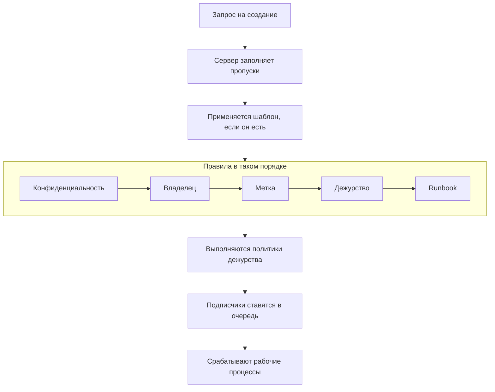

# Объявление инцидента

Объявление инцидента создаёт запись, с которой работает ваша команда: инцидент получает номер, уровень серьёзности и начальное состояние, его политики дежурства вызывают людей, и — если вы не решите иначе — подписчики страницы статуса узнают о нём. Эта страница по порядку разбирает пять способов объявить инцидент, поле за полем, и то, что происходит в момент его появления.

:::cards
- [Объявить вручную](#объявить-вручную): Форма из трёх шагов, поле за полем.
- [Объявить из шаблона](#объявить-из-шаблона): Инцидент одного и того же вида, каждый раз заполненный заранее.
- [Объявить по критериям монитора](#объявлять-автоматически-по-критериям-монитора): Пусть неудачная проверка откроет его за вас.
- [Объявить через API](#объявить-через-api): Из вашего кода, скрипта или другого инструмента.
:::

## Пять способов объявить инцидент

Инцидент попадает в OneUptime пятью способами, и все они заканчиваются в одном месте: строкой в таблице `Incident` с уровнем серьёзности, текущим состоянием и списком затронутых ресурсов. Разница лишь в том, кто заполняет поля — вы в три часа ночи, сохранённый шаблон, критерии монитора, ваш собственный код, вызывающий API, или кто-то вне вашей команды, заполняющий форму.

| Если вы хотите…                                              | Выберите                                                                    |
| ------------------------------------------------------------ | --------------------------------------------------------------------------- |
| Открыть инцидент вручную и заполнить всё самостоятельно      | Мастер **Объявить инцидент**                                                |
| Открыть повторяющийся вид инцидента с заранее заполненными полями | **Создать из шаблона**                                                 |
| Открывать инцидент автоматически, когда проверки монитора не проходят | Фильтр критериев монитора с **Когда фильтры совпадают, объявить инцидент.** |
| Открыть инцидент из своего кода, скрипта или другого инструмента | `POST /api/incident`                                                    |
| Дать людям вне команды сообщать о проблеме по ссылке         | [Форма](/docs/forms/index)                                                  |

Все пять способов пишут одну и ту же модель, поэтому инцидент, открытый пробой, выглядит точно так же, как инцидент, открытый дежурным вручную, — за исключением нескольких служебных столбцов, которые сервер заполняет у автоматических. Её пишут и интеграции: [Huntress](/docs/integrations/huntress) открывает по одному инциденту на каждый отчёт об инциденте, присланный его SOC.

> [!TIP]
> Инцидент можно объявить и из оповещений: **Объявить инцидент** в списке оповещений, в заголовке оповещения или на странице **Связанные инциденты** оповещения открывает тот же мастер, заполненный по оповещениям, и связывает их с новым инцидентом. Флажок на форме, установленный по умолчанию, также подтверждает оповещения, чтобы их эскалация прекратилась. См. [Связанные оповещения](/docs/incidents/linked-alerts).

## Объявить вручную

Форма **Объявить новый инцидент** запрашивает инцидент в три шага — **Сведения об инциденте**, **Затронутые ресурсы** и **Дежурство и роли** — и затем показывает сводку для проверки. Если ваш проект запрашивает при создании некоторые из пользовательских полей инцидента, сразу после **Затронутые ресурсы** появляется четвёртый шаг — **Подробности**.

:::steps
1. Откройте **Инциденты → Все инциденты** и нажмите **Объявить инцидент** в правом верхнем углу списка **Инциденты**. Форма откроется на шаге **Сведения об инциденте**.
2. Введите **Заголовок** и выберите **Серьёзность инцидента**. Остальная часть формы необязательна.
3. Пройдите остальные шаги кнопкой **Далее**, заполняя то, что уже знаете: мониторы и другие ресурсы, политики дежурства, роли.
4. Прочитайте сводку и нажмите **Объявить инцидент**. Вы попадёте на новый инцидент, и его **Инцидент Лента** начнёт записывать события.
:::

Обязательные поля есть только на первом шаге, а также любое пользовательское поле, которое администраторы отметили как **Обязательно при создании** и которое запрашивает шаг **Подробности**. На каждом шаге перед сводкой есть простая кнопка **Далее**, а **Объявить инцидент** находится на сводке — последнем шаге. Если вы спешите, заполните **Сведения об инциденте** и пройдите остальные шаги кнопкой **Далее**, ничего не заполняя: добавление ресурсов, политик дежурства и назначение ролей могут подождать до собственных страниц инцидента. Нажатие **Enter** в поле тоже переводит дальше; до сводки оно никогда не объявляет инцидент.

> [!TIP]
> Параметры, которые большинству инцидентов не нужны, ждут свёрнутыми под заголовком **Дополнительные поля** в конце своего шага; нажмите на него, чтобы их открыть. В свёрнутом виде заголовок называет то, что внутри, и показывает каждый заданный параметр с его значением — заданный, например, шаблоном или приватным оповещением, из которого вы объявляете, — и сам раскрывается, когда что-то внутри нужно исправить. Сводка упоминает такой параметр, только если он задан, — кроме **Уведомить подписчиков страницы статуса**, который она упоминает всегда, вместе с тем, кто получит уведомление.

**Со страницы самого ресурса.** **Объявить инцидент** на вкладке **Инциденты** монитора, хоста, сервиса, кластера или большинства других ресурсов открывает ту же форму с этим ресурсом, уже выбранным на шаге **Затронутые ресурсы**, так что достаточно заголовка и уровня серьёзности, а инцидент появляется на той вкладке, с которой вы начали.

:::details Какие страницы ресурсов это предлагают и что они выбирают
**Объявить инцидент** на вкладке **Инциденты** монитора, хоста, кластера Kubernetes, Proxmox, Ceph или Docker Swarm, хоста Docker или Podman, vCenter, массива хранения, парка IoT-устройств, базы данных или сервиса открывает тот же мастер с этим ресурсом, уже выбранным на шаге **Затронутые ресурсы** (монитор — в **Мониторы**, всё остальное — в **Другие затронутые ресурсы**), раньше всего, что добавляет шаблон. **Создать из шаблона** на этой вкладке тоже сохраняет ресурс. Навигационная цепочка ведёт обратно через вкладку ресурса, а после объявления вы попадаете на новый инцидент, как и из списка инцидентов.

Вкладка **Инциденты** элемента инвентаря выбирает хост, сервис или кластер Kubernetes, на который указывает элемент, а навигационная цепочка ведёт обратно через вкладку этого ресурса. **Создать оповещение** на вкладке **Оповещения** ресурса работает так же: из монитора оно заполняет поле **Монитор** оповещения, из всего остального — **Другие затронутые ресурсы**.

Ресурс ищется с вашими собственными разрешениями: если вы не можете его прочитать или он удалён, форма просто открывается без выбранного ресурса.
:::

### Шаг 1 — Сведения об инциденте

- **Заголовок** — обязательно. Краткое описание в одну строку, которое все увидят в списке, в Slack и (если инцидент видим) на вашей странице статуса. Подсказка: `Incident Title`.
- **Серьёзность инцидента** — обязательно. Один из уровней серьёзности, настроенных в вашем проекте; новые проекты получают **Critical Incident**, **Major Incident** и **Minor Incident** заранее.
- **Описание** — необязательно, пишется в Markdown. Именно это поле отображается на странице статуса, поэтому пишите его для клиентов, а не для команды. Изображение, которое вы в него вставите, видно всем, пока инцидент виден на страницах статуса, и только участникам проекта, пока он скрыт. Позже его можно отредактировать в разделе **Описание** бокового меню инцидента.

В **Дополнительные поля**:

- **Объявлен в** — начинается с момента, когда вы открыли страницу. От этой отметки времени отсчитывается каждая длительность инцидента, поэтому поставьте более раннее время, если записываете то, что началось раньше.
- **Начальное состояние** — необязательно и поначалу пусто. Если оставить его пустым, инцидент начнётся в состоянии с флагом `isCreatedState`, которое новые проекты создают как **Identified**, — или в начальном состоянии шаблона, если вы объявляете из шаблона. Выбирайте более позднее состояние, только если записываете инцидент, который уже прошёл эту точку — был подтверждён или устранён. Такой инцидент никого не вызывает — см. [Объявлен уже подтверждённым или устранённым](#объявлен-уже-подтверждённым-или-устранённым).
- **Метки** — необязательно. Метки объединяют связанные инциденты, чтобы по ним можно было фильтровать, а команда, разрешения которой ограничены метками, видит только инциденты с одной из своих меток.
- **Приватный инцидент** — флажок, по умолчанию выключен (`isPrivate`). Приватный инцидент видят только его пользователи-владельцы, участники его команд-владельцев, администраторы проекта и владельцы проекта, и он скрыт со всех страниц статуса независимо от других настроек, включая страницы статуса, которыми он ограничен. В списке инцидентов такие инциденты помечаются красным значком **Private**.

> [!NOTE]
> **Оповещения и эпизоды тоже начинаются в выбранном вами состоянии.** **Создать оповещение** и **Создать эпизод** в списках эпизодов инцидентов и оповещений имеют то же поле **Начальное состояние** в **Дополнительные поля**. Если оставить его пустым, оповещение или эпизод начинается в состоянии создания проекта. Выберите более позднее состояние, чтобы записать уже подтверждённое или устранённое: оно начнётся в этом состоянии, его хронология состояний начнётся с него, а эпизод, записанный как устранённый, сразу считается устранённым. Его владельцы не получают отдельного уведомления об этом первом состоянии, а подписчики страницы статуса эпизода инцидента узнают о нём один раз, при создании эпизода. Оповещение или эпизод, записанные так, никого не вызывают, как и инцидент: см. [Объявлен уже подтверждённым или устранённым](#объявлен-уже-подтверждённым-или-устранённым). Через API тот же выбор задаётся полем `currentAlertStateId` или `currentIncidentStateId` — см. [Справочник API OneUptime](/docs/api-reference/api-reference).

:::details Работа в редакторе Markdown
Описание — как и заметки, корневая причина, исправление и пользовательские поля с форматированным текстом — пишется в редакторе Markdown. Он открывается в визуальном режиме, где текст показан отформатированным; **Markdown** на панели инструментов переключает в режим Markdown, где показан исходный текст Markdown, а **Visual** переключает обратно. В списке **Увеличить отступ** и **Уменьшить отступ** на панели инструментов, или Tab и Shift+Tab, вкладывают пункт под пункт выше и возвращают его обратно; там, где вкладывать не подо что, и вне списка Tab, как обычно, переходит к следующему полю. В визуальном режиме **Блок кода**, **Таблица** и **Список задач** в середине или в конце строки разбивают строку в месте курсора и помещают новый блок на отдельные строки — также на границе жирного слова, ссылки или встроенного кода, не оставляя пустого форматирования, — а **Список задач** в пункте списка добавляет задачу в список этого пункта, а не как подзадачу. В режиме Markdown **Блок кода** и **Таблица** вставляются в месте курсора, поэтому сначала начните для них новую строку, **Список задач** превращает строку с курсором в задачу, а **Нумерованный список** нумерует каждый уровень вложенного списка с 1. Панель инструментов остаётся в одну строку: формы с редактором открываются в широком диалоге, поэтому на большинстве экранов помещаются все кнопки, а там, где не помещаются, — на телефоне или в узком окне, — кнопки, которые не поместились, находятся в **Дополнительное форматирование** (**⋯**) в конце панели в том же порядке, и каждая выбранная там кнопка вставляет своё содержимое туда, где был курсор. На самых узких экранах туда же переезжает и переключатель **Markdown**.

**Отмена.** В визуальном режиме Ctrl+Z (Cmd+Z на Mac) отменяет ваши изменения по одному, начиная с последнего, — и то, что вы набрали, и собственные правки редактора: увеличение или уменьшение отступа, блок, вставленный в строку, форматированную или блочную вставку, — а Ctrl+Shift+Z (Cmd+Shift+Z) или Ctrl+Y возвращают их в том же порядке. В режиме Markdown Ctrl+Z отменяет изменение отступа, изменение кнопки списка и форматированную вставку, но не то, что вставляют кнопки **Блок кода**, **Таблица** и **Горизонтальная линия**.

**Вставка в редактор.** При вставке из Word, Google Docs или страницы OneUptime — например, описания другого инцидента — сохраняются списки и их вложенность, ссылки и форматирование, а вставленные маркеры `•` становятся настоящим списком. Ссылки, состоящие только из значка, как якорь рядом с заголовком на GitHub, опускаются. В визуальном режиме код или цитата, вставленные в строку, становятся отдельным блоком и разбивают строку, а список, вставленный в пункт списка, присоединяется к списку этого пункта, а не вкладывается в него, — вставленный в пустой пункт, который оставляет Enter, он занимает место этого пункта, — тогда как блок кода, цитата или таблица, вставленные в пункт, остаются внутри него. В режиме Markdown то, что вставка превращает в блоки, — код, цитата, список, заголовок, несколько абзацев, — попадает на отдельные строки с пустой строкой с каждой стороны, если оказывается в середине строки, а список, вставленный в конец строки пункта списка или после одиночного `- `, присоединяется к этому списку на отступе пункта; Markdown, скопированный как обычный текст, вставляется в месте курсора как есть. Всё, что вы вставляете внутрь блока кода, остаётся ровно таким, как вы это скопировали. Вставка поверх выделения, охватывающего несколько пунктов, абзацев или ячеек таблицы, заменяет его, как и набор текста. В визуальном режиме вставка или кнопка **Код** поверх ячеек таблицы сохраняют все ячейки и столбцы, вставка не оставляет пустых маркеров, цитат или блоков кода, а если выделение заканчивается внутри блока кода, к тексту присоединяется только остаток этой строки кода.

**Копирование из заметки.** Блок кода, скопированный из заметки или описания, вставляется обратно как блок кода на своём языке, как и его строка, скопированная вместе с переводом строки, — так её копирует тройной щелчок в Chrome, Edge и Safari. Слово или часть строки, скопированные из блока кода, вставляются как встроенный код. В Chrome, Edge и Safari строки, скопированные из представления кода, нарисованного как таблица, — вкладки YAML ресурса Kubernetes, фреймов трассировки стека исключения, — вставляются как обычный текст с сохранёнными отступами.
:::

### Шаг 2 — Затронутые ресурсы

Мониторы идут первыми и отдельно, потому что страницы статуса видят инцидент через его мониторы, а статус, в который переходят мониторы, находится прямо под ними.

- **Мониторы** — поле поиска, которое добавляет мониторы, затронутые инцидентом; вкладка **Метки** сразу добавляет все мониторы с определённой меткой. Страница статуса показывает инцидент и уведомляет о нём своих подписчиков, когда на ней показан один из мониторов инцидента, поэтому именно они определяют, какие страницы статуса узнают об инциденте (`monitors` у инцидента).
- **Изменить статус монитора на** — необязательно и показывается, только когда выбран хотя бы один монитор. Выбирает статус монитора, который применяется к каждому монитору, привязанному к этому инциденту, так что объявить инцидент и отметить мониторы как деградировавшие можно одним действием, а не двумя. При объявлении из шаблона, который задаёт статус, поле начинается со статуса шаблона и показывается, как только вы выбираете монитор. Без выбранного монитора статус не сохраняется, даже статус шаблона; если удалить последний монитор, поле исчезает, пока вы не выберете другой, и тогда ваш выбор возвращается. Статус монитора общий для всех страниц статуса, на которых он показан, поэтому, если в **Дополнительные поля** выбраны страницы статуса, форма напоминает, что изменение будет видно и на страницах, которые вы не выбрали.
- **Другие затронутые ресурсы** — второе поле поиска для всего остального, что затрагивает инцидент: хостов, кластеров Kubernetes, хостов Docker и Podman, кластеров Proxmox, Ceph и Docker Swarm, vCenter, массивов хранения, парков IoT-устройств, баз данных и сервисов — всего, кроме мониторов, что предлагает собственная карточка инцидента **Затронутые ресурсы**. Внутри это отдельные связи инцидента (`hosts`, `kubernetesClusters`, `dockerHosts`, `podmanHosts`, `services` и другие), но форма сводит их в один выбор.

Монитор может указывать, что он наблюдает, — **Монитор → Обзор → Связанные ресурсы**, те же виды ресурсов, что и в **Другие затронутые ресурсы**. Выберите такой монитор, и то, с чем он связан, сразу добавится в **Другие затронутые ресурсы**, а строка под полем назовёт добавленное. Уберите лишнее до объявления: пока вы остаётесь на форме, для этого монитора ничего не добавляется повторно, а удаление монитора оставляет то, что он добавил. То же происходит, когда монитор приходит из шаблона или со страницы, с которой вы объявляете, а также в **Создать оповещение** и **Schedule Maintenance**.

Карточка инцидента **Затронутые ресурсы** при последующем редактировании спрашивает так же: **Мониторы**, затем **Изменить статус монитора на**, как только есть монитор, затем **Другие затронутые ресурсы**. Если сохранить инцидент без мониторов, он сохранит прежний статус.

В **Дополнительные поля**:

- **Ограничить этими страницами состояния** — необязательно. Если оставить пустым, инцидент показывается на каждой странице статуса, где показаны его мониторы, и уведомляет её подписчиков. Выберите страницы здесь, и будут использоваться только выбранные среди них; вкладка **Метки** сразу добавляет все страницы с определённой меткой. Форма предупреждает, когда на выбранной странице нет ни одного монитора инцидента, и когда инцидент приватный, что скрывает его со всех страниц статуса. См. [Отдельная страница статуса для каждой аудитории](/docs/status-pages/one-status-page-per-audience).
- **Уведомить подписчиков страницы статуса** — флажок, по умолчанию включён. Определяет, получат ли подписчики уведомление о создании инцидента (`shouldStatusPageSubscribersBeNotifiedOnIncidentCreated`). То, что он свёрнут в **Дополнительные поля**, ничего не меняет в его работе: он по-прежнему установлен изначально, и сводка всегда его упоминает. Под ним, а также в сводке перед отправкой, **Will notify** перечисляет страницы статуса, которые получат уведомление, с количеством подписчиков «до» по каждому каналу, и страницы, которые уведомление не получат, с причиной. Если не будет уведомлён никто (монитор не привязан, ни на одной странице статуса нет мониторов или у страниц ещё нет подписчиков), он ничего не показывает и предупреждает только тогда, когда причина — охват страниц статуса инцидента. В сводке **Предпросмотр** рядом с **Да** показывает письмо, которое получат подписчики каждой из этих страниц, а **Отправить тест мне** отправляет его на адрес вашей учётной записи; см. [Подписчики и объявления](/docs/status-pages/subscribers#инциденты). Выключите его для внутреннего шума, который вы всё же хотите записать. Тогда инцидент по умолчанию остаётся тихим: новые публичные заметки по нему и диалог смены состояния на странице обзора (**Подтвердить**, **Устранить** или выбор другого состояния) начинаются с выключенным собственным флажком **Уведомить подписчиков страницы статуса**. Ручная форма на странице **Хронология состояний** и массовое действие **Изменить состояние** в списке инцидентов по-прежнему начинаются с включённым флажком.

> [!IMPORTANT]
> **Привязывайте мониторы, даже если это кажется лишним.** Связь между инцидентом и страницей статуса идёт через мониторы инцидента: страница статуса показывает инцидент и уведомляет о нём своих подписчиков, когда один из её ресурсов — один из мониторов инцидента. **Ограничить этими страницами состояния** может только сузить этот список, но не расширить его, а страница статуса с включённым **Показывать только инциденты, ограниченные этой страницей** показывает только инциденты, ограниченные ею. Инцидент без привязанных мониторов не уведомляет ни одного подписчика страницы статуса. См. [Ресурсы и группы страницы статуса](/docs/status-pages/resources-and-groups).

Флага **Should be visible on status page?** (`isVisibleOnStatusPage`) в мастере нет; по умолчанию он истинен. Изменить его можно позже в **Настройки** бокового меню инцидента, где он называется **Видно на странице статуса**.

**Объявить скрытым и опубликовать позже.** Инцидент, скрытый со страниц статуса при создании, не уведомляет ни одного подписчика, а его статус уведомления гласит **Пропущено: скрыт со страниц состояния**. Когда вы позже включаете **Видно на странице статуса**, форма редактирования предлагает **Уведомить подписчиков о создании этого инцидента**, так что привычный порядок — объявить скрытым, выяснить, кого это затронуло, и затем опубликовать — всё равно их уведомляет. Флажок установлен, пока инцидент не устранён, и снят, когда он устранён, чтобы публикация старого инцидента для истории не объявляла его как новый. Он предлагается, только если инцидент был объявлен с включённым **Уведомить подписчиков страницы статуса** и не является приватным, — то есть не для инцидента, поступившего через [форму](/docs/forms/on-submit), который объявляется скрытым и с выключенным флажком. Через API отправьте `"miscDataProps": {"notifySubscribersOfIncidentCreatedOnPublish": true}` вместе с обновлением, которое устанавливает `isVisibleOnStatusPage` в `true`, или сами верните `subscriberNotificationStatusOnIncidentCreated` в `Pending`. Постмортему, опубликованному, пока инцидент был скрыт, флажок не нужен: включение **Видно на странице статуса** отправляет его один раз, как описано в [Подписчики и объявления](/docs/status-pages/subscribers#инциденты).

### Подробности — ваши пользовательские поля инцидента

Этот шаг появляется, только если хотя бы у одного пользовательского поля инцидента включено **Показывать при создании** в **Инциденты → Настройки → Пользовательские поля** — или, при объявлении из шаблона, если **Пользовательские поля при создании** шаблона запрашивают какое-то поле. Он запрашивает эти поля в их **Порядок** — порядке, в который их перетащили на той странице настроек, — с вводом, который требует их тип: выпадающий список, число, дата, переключатель «да/нет», длинный текст или форматированный текст в редакторе Markdown. Он также не показывается тому, кто не может читать пользовательские поля инцидентов проекта: в OneUptime Cloud для этого нужен тариф **Growth** или выше и роль, которой разрешено просматривать пользовательские поля инцидентов.

- Поле, отмеченное как **Обязательно при создании**, должно быть заполнено, прежде чем можно будет объявить инцидент. Обязательное поле «да/нет» — например, подтверждение — должно быть включено.
- 0 или выключенный переключатель — это ответ, и он сохраняется как ответ.
- Поле, значение которого копируется из пользовательского поля монитора, не запрашивается, когда у инцидента есть монитор, потому что значение копируется из монитора при создании инцидента.
- При объявлении из шаблона шаг начинается со значений шаблона, а значения шаблона для полей, которые шаг не запрашивает, сохраняются как есть. Значение, которое вы очистите на шаге, остаётся очищенным. Значение шаблона, которое больше не подходит полю, — например, вариант выпадающего списка, удалённый с тех пор, — пропускается, а инцидент не отклоняется.
- При объявлении из шаблона также учитываются его **Пользовательские поля при создании**. Поле, которое он отмечает как **Обязательно** или **Необязательно**, запрашивается, даже если проект не показывает его при создании; поле, отмеченное как **Скрыто**, не запрашивается — значение шаблона для него по-прежнему применяется, — а поле, оставленное на **По умолчанию**, следует собственным **Показывать при создании** и **Обязательно при создании**. См. [Пользовательские поля при создании](/docs/incidents/settings#пользовательские-поля-при-создании).

**Обязательно при создании** проверяется только панелью управления, как и **Пользовательские поля при создании** шаблона. Инциденты, созданные мониторами, API, Slack, Microsoft Teams или ИИ, могут оставить поле пустым, а после этого каждое поле остаётся необязательным на странице инцидента **Пользовательские поля**, так что исправление одного значения посреди сбоя никогда не требует всех остальных. Типы полей и их настройки см. в [Пользовательские поля](/docs/incidents/settings#пользовательские-поля).

### Шаг 3 — Дежурство и роли

- **Политика дежурства** — множественный выбор политик дежурства, которые нужно выполнить при создании этого инцидента. Соответствует `onCallDutyPolicies` у инцидента.
- **Назначить роли инцидента** — кто берёт каждую роль, определённую в вашем проекте, по одной карточке на роль. Роль с пометкой **Основная**, которую вы оставите пустой, достаётся вам: вы берёте её при объявлении инцидента, и сводка об этом говорит. Роль для одного человека сообщает об этом, когда он выбран; роль для нескольких людей сохраняет свой выбор.

Это единственное место, где политика дежурства привязывается к инциденту напрямую. У уровней серьёзности нет политики дежурства — серьёзность это метка, и на вызов она влияет только как *критерий совпадения* в правиле дежурства. Правила, настроенные в **Инциденты → Правила → Правила дежурства**, добавляют свои политики к тому, что вы выберете здесь; в итоге выполняется объединение обоих без дубликатов. Инцидент, объявленный в более позднем состоянии, не выполняет ни одну из них — см. [Объявлен уже подтверждённым или устранённым](#объявлен-уже-подтверждённым-или-устранённым).

Сами роли настраиваются в **Инциденты → Настройки → Роли инцидента**. В новом проекте есть одна — Руководитель инцидента; добавьте там Responder, Communications Lead или всё, что ещё нужно вашему процессу. Если никого не выбрать на роль Руководитель инцидента, при объявлении инцидента ею станете вы.

## Объявить из шаблона

Если вы раз за разом объявляете инцидент одного и того же вида — тот же шаблон заголовка, тот же уровень серьёзности, та же политика дежурства, — сохраните его один раз как шаблон и объявляйте из него:

:::steps
1. В списке **Инциденты** нажмите **Создать из шаблона** (контурная кнопка рядом с **Объявить инцидент**). Откроется диалог **Создать инцидент из шаблона** с выпадающим списком **Выберите шаблон инцидента**.
2. Выберите шаблон. Форма создания откроется заполненной.
3. Измените то, что отличается в этот раз, затем пройдите шаги и объявите инцидент как обычно.
:::

Если в вашем проекте ещё нет шаблонов, вместо этого откроется диалог **No Incident Templates** с кнопкой **Create Template**, которая ведёт в **Инциденты → Настройки → Шаблоны инцидентов**.

Шаблоны создаются собственным мастером из четырёх шагов — **Информация о шаблоне**, **Сведения об инциденте**, **Затронутые ресурсы**, **Дежурство** — плюс шаги **Пользовательские поля** и **Пользовательские поля при создании** после **Затронутые ресурсы**, когда в проекте есть пользовательские поля инцидентов. **Начальное состояние инцидента**, **Владельцы** и **Метки** шаблона находятся в **Дополнительные поля** в конце шага **Сведения об инциденте**. **Затронутые ресурсы** спрашивает так же, как форма объявления, — **Мониторы**, затем **Изменить статус монитора на**, затем **Другие затронутые ресурсы**, с **Ограничить этими страницами состояния** в **Дополнительные поля**, — за исключением того, что шаблон всегда запрашивает статус монитора: он применяется и к мониторам, выбранным при объявлении инцидента из шаблона. Вот эти поля:

| Поле                            | Назначение                                             |
| ------------------------------- | ------------------------------------------------------ |
| **Название шаблона**            | Как шаблон распознаётся в списке выбора.               |
| **Описание шаблона**            | Заметка для себя о том, когда его использовать.        |
| **Заголовок**                   | Заголовок, которым заполняется инцидент.               |
| **Описание**                    | Описание в Markdown, которым заполняется инцидент.     |
| **Серьёзность инцидента**       | Уровень серьёзности, которым заполняется инцидент.     |
| **Начальное состояние инцидента** | Состояние, в котором начинаются инциденты из этого шаблона. Пусто — обычное начальное состояние. Инцидент, начинающийся подтверждённым или устранённым, никого не вызывает. |
| **Мониторы**                    | Мониторы, которые нужно привязать.                     |
| **Изменить статус монитора на** | Статус, применяемый к мониторам инцидента, в том числе выбранным при объявлении. |
| **Другие затронутые ресурсы**   | Хосты, кластеры и сервисы, которые нужно привязать.    |
| **Ограничить этими страницами состояния** | Страницы статуса, которыми ограничивается инцидент. |
| **Политика дежурства**          | Политики, выполняемые при создании инцидента.          |
| **Владельцы**                   | Люди и команды, владеющие инцидентами из этого шаблона, выбранные из одного списка. |
| **Метки**                       | Метки, которые ставятся на инцидент.                   |
| **Пользовательские поля**       | Значения пользовательских полей инцидента.             |
| **Пользовательские поля при создании** | Какие пользовательские поля запрашивает шаг **Подробности** и какие обязательны. |

Несколько коротких правил:

- Шаблоны нельзя редактировать из списка шаблонов — вы создаёте шаблон, а затем открываете его, чтобы изменить.
- Шаблон заполняет только поле, которое вы оставили пустым. На странице создания шаблон применяется как предварительное заполнение, которое можно перезаписать; на сервере — для формы, объявляющей из шаблона, — поле заполняется из шаблона, только если запрос оставил его `undefined`. То, что указал вызывающий, всегда важнее.
- Шаг **Подробности** следует **Пользовательские поля при создании** шаблона, как [описано выше](#подробности-ваши-пользовательские-поля-инцидента).
- Значения пользовательских полей объединяются по одному полю. Значения шаблона заполняют пользовательские поля, с которыми инцидент объявлен без значения; значение, заданное на шаге **Подробности** или отправленное в `customFields` запроса, всегда важнее — включая `0`, `false` и `null`. Поле, копируемое из пользовательского поля монитора, по-прежнему получает значение монитора.
- Значения пользовательских полей существующего шаблона находятся на его карточке **Пользовательские поля** рядом с другими карточками.
- **Владельцы** шаблона добавляются, когда у инцидента появляются каналы Slack и Microsoft Teams, так что правило уведомлений, приглашающее владельцев инцидента в новый канал, приглашает и их. При объявлении из шаблона в панели управления они добавляются без уведомления «вас добавили»; [форма](/docs/forms/on-submit) с шаблоном уведомляет их и задерживает уведомление инцидента **Инцидент создан**, пока они не будут добавлены, чтобы оно ушло им, а не владельцам проекта.

## Объявлять автоматически по критериям монитора

Большинство инцидентов не должны требовать, чтобы их вводил человек. Критерии монитора могут объявить инцидент в тот момент, когда совпадает фильтр:

:::steps
1. Откройте монитор, выберите **Критерии** в его боковом меню и нажмите **Edit Monitoring Criteria**. (Новый монитор запрашивает те же критерии при создании.)
2. В фильтре критериев, который должен объявлять инцидент, включите **Когда фильтры совпадают, объявить инцидент.**. Появится раздел **Создать инцидент** с кнопкой **Добавить инцидент** — один фильтр критериев может объявлять несколько инцидентов.
3. Заполните поля инцидента (ниже) и сохраните. При следующем совпадении фильтра инцидент будет объявлен и вызовет свои политики дежурства.
:::

У каждой записи инцидента есть:

- **Заголовок инцидента** — поддерживает шаблоны; подсказка предлагает что-то вроде `{{monitorName}} is down`.
- **Серьёзность** — обязательно.
- **Описание инцидента** — тоже с шаблонами.
- **Дежурство → Политики дежурств** — политики, выполняемые при создании этого инцидента.
- **Роли инцидента** — кто берёт каждую роль в инциденте, выбирается на тех же карточках, что и **Назначить роли инцидента** в форме объявления, по одной на роль. Показывается, когда в проекте есть роли инцидента.
- **Владение и метки → Владельцы** (люди и команды, выбранные из одного списка), **Метки**.
- **Дополнительные поля → Автоустранение инцидента** (устраняет инцидент автоматически, когда критерии перестают совпадать), **Показывать инцидент на странице статуса**, **Приватный инцидент** и **Заметки об исправлении**.

Полный список заполнителей `{{variable}}`, которые можно использовать в заголовке, описании и заметках об исправлении, см. в [Шаблоны инцидентов и оповещений](/docs/monitor/incident-alert-templating).

Сервер помечает инциденты, созданные таким способом: устанавливается `isCreatedAutomatically`, `createdCriteriaId` записывает, какой фильтр критериев сработал, а `createdByProbe` — какая проба это заметила. Во всём остальном они ведут себя точно так же, как инцидент, объявленный вручную.

Инцидент, объявленный монитором, связывается с тем, что наблюдает монитор: со всем, что указано в его конфигурации (хост монитора хоста, кластер монитора Kubernetes, сервисы монитора журналов), и со всем в его **Связанные ресурсы**. Конфигурация монитора веб-сайта или API не указывает никакой инфраструктуры, поэтому свяжите его с кластером, хостами или базой данных, которые стоят за сайтом: тогда его инциденты окажутся на страницах этих ресурсов, OneUptime AI сможет расследовать их там, а исправление ИИ кластера или ресурса сможет на них действовать (см. [AI SRE](/docs/ai/ai-sre#which-incidents-a-clusters-fixes-act-on)). Оповещения, создаваемые монитором, связываются так же.

## Объявить через API

Модель инцидента предоставляет стандартную конечную точку CRUD, поэтому `POST /api/incident` создаёт инцидент. Аутентифицируйтесь ключом API, созданным в **Настройки проекта → Расширенный → Ключи API**, который передаётся в заголовке `apikey`, — ключ определяет проект, поэтому ID проекта отдельно передавать не нужно.

```bash
curl -X POST https://oneuptime.com/api/incident \
  -H "apikey: $ONEUPTIME_API_KEY" \
  -H "Content-Type: application/json" \
  -d '{
    "data": {
      "title": "Checkout latency above SLO",
      "description": "Investigating elevated p99 latency on the checkout service.",
      "incidentSeverityId": "<incident-severity-id>"
    }
  }'
```

Полезные поля тела запроса:

| Поле                     | Обязательно | Примечания                                                                                                                                                                                                                                  |
| ------------------------ | ----------- | ------------------------------------------------------------------------------------------------------------------------------------------------------------------------------------------------------------------------------------------- |
| `title`                  | Да          | Заголовок инцидента.                                                                                                                                                                                                                        |
| `incidentSeverityId`     | Да          | Один из уровней серьёзности вашего проекта. Сервер проверяет, что он принадлежит тому же проекту, что и ключ API, и отклоняет запрос, если это не так.                                                                                     |
| `declaredAt`             | Нет         | Здесь необязательно, хотя форма его требует. Если опустить, сервер использует текущее время.                                                                                                                                               |
| `currentIncidentStateId` | Нет         | Начальное состояние; если опущено — состояние создания. Проверяется по проекту ключа API, как и серьёзность. Та же проверка применяется к статусу монитора за **Изменить статус монитора на**.                                            |
| `statusPages`            | Нет         | ID страниц статуса, которыми ограничивается инцидент, все из одного проекта. Опустите, чтобы охватить каждую страницу статуса, где показаны мониторы инцидента. `isScopedToStatusPages` вычисляется из этого поля, а отправленное для него значение игнорируется. См. [Отдельная страница статуса для каждой аудитории](/docs/status-pages/one-status-page-per-audience). |
| `customFields`           | Нет         | Значения пользовательских полей инцидента с именем каждого поля в качестве ключа. Каждое отправленное значение должно подходить своему полю — число для поля **Число**, один из вариантов для **Выпадающий список (один вариант)**, — иначе запрос отклоняется с ошибкой `400`, называющей поле. **Обязательно при создании** здесь не проверяется. См. [Значения пользовательских полей через API](/docs/incidents/settings#значения-пользовательских-полей-через-api). |

Ключ API не может объявлять из шаблона: запрос, отправляющий `createdIncidentTemplateId`, отклоняется. OneUptime сам заполняет этот столбец — для инцидентов, поступивших через [форму](/docs/forms/on-submit), и для шага рабочего процесса **Create One Incident**, который объявляет инцидент из шаблона, выбранного в его настройке **Incident Template** (см. [Компоненты рабочего процесса](/docs/workflows/components)). Чтобы объявить из шаблона через API, прочитайте шаблон из `/api/incident-templates` и отправьте его значения в запросе.

Связанные конечные точки — `/api/incident-state`, `/api/incident-severity` и `/api/incident-state-timeline`. В сгенерированном [справочнике API](/reference) есть точные формы запросов и ответов для каждой из них, включая то, как выражаются поля-связи, например мониторы.

## Сообщить через форму

Пятый путь — для людей вне вашей команды. Форма — это страница, которой вы делитесь по ссылке: любой, у кого она есть, может сообщить о проблеме без учётной записи OneUptime, и каждая отправка объявляет инцидент. Вы определяете, что спрашивает форма, — заголовок, описание, уровень серьёзности, мониторы, пользовательские поля, собственные вопросы — и как ответы становятся инцидентом: уровень серьёзности по умолчанию, шаблон инцидента, из которого объявлять, а также мониторы, метки, политики дежурства и владельцы, которые добавляются всегда.

Инциденты, поступившие таким способом, объявляются скрытыми со страниц статуса и с выключенным **Уведомить подписчиков страницы статуса**, чтобы дежурный разобрался с ними до того, как что-то станет публичным, а приватная заметка фиксирует, кто о них сообщил. Формы — это отдельный продукт в разделе **Формы** меню **Продукты**, который может также планировать события обслуживания; см. [Формы](/docs/forms/index).

## Номера и префиксы инцидентов

Каждый инцидент получает последовательный номер из счётчика проекта, который сервер присваивает при создании. Его хранят два столбца: `incidentNumber` (просто целое число) и `incidentNumberWithPrefix` (то, что вы на самом деле видите). Без настроенного префикса отображаемое значение — `#42`.

:::steps
1. Перейдите в **Инциденты → Настройки → Префикс номера** и нажмите **Обновить**.
2. Введите префикс в **Префикс номера инцидента**. Поле показывает номер по мере ввода: `INC-` превращает его в `INC-42`. Оставьте поле пустым, чтобы сохранить `#` по умолчанию.
3. Нажмите **Сохранить изменения**. Инциденты, объявленные с этого момента, получат новый префикс; существующие инциденты сохранят свои номера.
:::

В том же диалоге есть **Префикс номера эпизода инцидента** для нумерации эпизодов. Правила, которым следует префикс, перечислены в [Префиксы номеров](/docs/incidents/settings#префиксы-номеров).

Номер показывается в первом столбце списка инцидентов, ведёт на инцидент и отображается как **Номер инцидента** на странице **Обзор** инцидента.

## Что происходит в момент объявления инцидента

Вызов создания делает больше, чем просто записывает строку:



По порядку:

1. **Сервер заполняет пропуски.** `declaredAt` по умолчанию равно текущему времени, текущее состояние по умолчанию — состояние проекта с `isCreatedState`, а номер инцидента и номер с префиксом присваиваются из счётчика проекта.
2. **Применяется шаблон**, когда форма или шаг рабочего процесса **Create One Incident** объявляет инцидент из шаблона (`createdIncidentTemplateId`), — заполняются только поля, которые вызывающий оставил undefined; состояние, указанное вызывающим, важнее состояния шаблона. Панель управления вместо этого применяет шаблон в форме, до отправки запроса.
3. **Срабатывают правила конфиденциальности** и помечают инцидент как приватный, если так требует совпавшее правило. Это первый механизм правил, поэтому всё последующее видит правильную настройку конфиденциальности.
4. **Срабатывают правила владельца** и добавляют пользователей и команды, которых называют совпавшие правила, в качестве владельцев.
5. **Срабатывают правила меток** и добавляют подходящие инциденту метки.
6. **Срабатывают правила дежурства.** Каждое включённое правило в **Инциденты → Правила → Правила дежурства**, критерии которого совпадают, добавляет свои политики к инциденту. Порядка приоритета и короткого замыкания нет — срабатывают все совпавшие правила, а политики избавляются от дубликатов.
7. **Срабатывают правила runbook-ов**, привязывая и запуская подходящие runbook-и. См. [Runbook-и](/docs/runbooks/index).
8. **Выполняются политики дежурства.** Каждая политика инцидента — выбранная в мастере, унаследованная из шаблона или добавленная правилом — выполняется параллельно с типом события `IncidentCreated`. Сбой одной политики не останавливает остальные. Архивированная политика никого не вызывает: её журнал выполнения в инциденте сообщает, что она не выполнялась, потому что политика архивирована. Инцидент, объявленный уже подтверждённым или устранённым, не выполняет ни одну из них; см. [Объявлен уже подтверждённым или устранённым](#объявлен-уже-подтверждённым-или-устранённым) ниже.
9. **Подписчики ставятся в очередь**, если **Уведомить подписчиков страницы статуса** остался включённым и инцидент виден на странице статуса. Доставкой занимается фоновое задание, а не ваш запрос, и она идёт на страницы статуса, которых достигает инцидент: на те, где показаны его мониторы, суженные **Ограничить этими страницами состояния**, и без страниц, показывающих только ограниченные ими инциденты, если инцидент не ограничен. Архивированная страница статуса ничего не отправляет. Ход доставки показывается как **Статус уведомления подписчика** на странице **Обзор** инцидента: что было отправлено и что не удалось на каждой странице статуса, а также **Повторить** или **Отправить повторно**, когда всё завершилось. См. [Подписчики и объявления](/docs/status-pages/subscribers).
10. **Срабатывают рабочие процессы.** Триггер **On Create Incident** запускает каждый рабочий процесс, построенный на нём. См. [Обзор рабочих процессов](/docs/workflows/index).

С этого момента инцидент активен: он учитывается в значке **Активные инциденты** бокового меню раздела «Инциденты» (любое состояние выше вашего состояния устранения считается активным), появляется на страницах статуса, где показан один из его мониторов (только на выбранных, если вы его ограничили), а его **Хронология состояний** начинает записывать.

### Объявлен уже подтверждённым или устранённым

Выбор более позднего **Начальное состояние** — в форме, через **Начальное состояние инцидента** шаблона или через `currentIncidentStateId` из API, Terraform или рабочего процесса — записывает инцидент, которым кто-то уже занимается или который уже завершён. Он не считается новой чрезвычайной ситуацией:

```mermaid title="Что запускает новый инцидент в зависимости от начального состояния"
flowchart TB
    start{"Начальное состояние"} -->|"Состояние создания, по умолчанию"| live["Считается новым: вызывает дежурных"]
    start -->|"Подтверждено или позже"| acked["Записан: никого не вызывает"]
    start -->|"Устранено или позже"| over["Записан как завершённый"]
    over --> quiet["Без группировки, runbook-ов, ИИ, канала и SLA"]
```

- **В состоянии подтверждения или после него** — **Подтверждён** или любое состояние, стоящее ниже него в **Инциденты → Настройки → Состояние инцидента**, — ни одна политика дежурства не выполняется, поэтому никого не вызывают. Инцидент по-прежнему перечисляет свои политики — выбранные вами и добавленные правилами дежурства, — а его лента одной строкой объясняет почему: _No one was paged. This incident was created already acknowledged, so its on-call policy **Primary** was not run._ Его SLA, если правило его назначает, начинается уже отвеченным. Всё остальное ниже выполняется, как для любого нового инцидента.
- **В состоянии устранения или после него** — **Устранён** или любое состояние ниже него — инцидент завершён, поэтому вдобавок ничто, что реагирует на текущий инцидент, не выполняется:
  - он не группируется в эпизод, который мог бы снова кого-то вызвать;
  - на него не действует ни одно правило runbook-ов и ни одно правило автоисправления;
  - OneUptime AI его не расследует — его карточка **AI Investigation** сообщает, что он был создан уже устранённым, а **Ask OneUptime AI** под ней по-прежнему отвечает на вопросы о нём;
  - для него не создаётся канал Slack или Microsoft Teams;
  - его мониторы сохраняют свой статус и продолжают наблюдаться, что бы ни говорило **Изменить статус монитора на**;
  - для него не запускается SLA.
- **Что всё равно происходит:** срабатывают правила конфиденциальности, владельца, меток и дежурства, добавляются его владельцы и получают уведомление о создании, запись **Инцидент создан** пишется в его ленту и публикуется в каналах Slack и Microsoft Teams, указанных вашими правилами, а подписчики страницы статуса получают уведомление, когда включено **Уведомить подписчиков страницы статуса** и инцидент показан на их странице статуса. Уже завершённый инцидент для них всё равно новость.

Оповещения, эпизоды оповещений и эпизоды инцидентов следуют тому же правилу: созданные уже подтверждёнными никого не вызывают, а созданные устранёнными к тому же не группируются, не исправляются и не расследуются ИИ и не получают собственного канала. Инцидент или оповещение в состоянии создания — по умолчанию и каждое, которое открывает монитор, — запускает всё, как и прежде.

## Устранение неполадок

:::details Объявление не удаётся и требует состояние создания инцидента
Если в вашем проекте нет состояния с флагом `isCreatedState`, вызов создания не удаётся и предлагает добавить состояние создания инцидента в настройках. Обычно так бывает только в проекте, состояния которого сильно редактировали, — см. [Состояния и уровни серьёзности инцидентов](/docs/incidents/states-and-severities).
:::

:::details Инцидент объявлен, но ни один подписчик страницы статуса о нём не узнал
Проверьте по порядку: **Уведомить подписчиков страницы статуса** был включён; у инцидента есть хотя бы один привязанный монитор, и этот монитор показан на странице статуса; инцидент виден на страницах статуса и не приватный; и страница не исключена **Ограничить этими страницами состояния**. **Статус уведомления подписчика** на странице **Обзор** инцидента сообщает, что из этого его остановило.
:::

:::details Шаг «Подробности» с нашими пользовательскими полями не появляется
Шаг показывается, только когда у поля включено **Показывать при создании** или **Пользовательские поля при создании** шаблона запрашивают поле, и только тому, кто может читать пользовательские поля инцидентов проекта, — в OneUptime Cloud для этого нужен тариф **Growth** или выше.
:::

## Что прочитать дальше

:::cards
- [Состояния и уровни серьёзности инцидентов](/docs/incidents/states-and-severities): Что делают флаги состояний и как добавить свои.
- [Заметки, владельцы и лента инцидента](/docs/incidents/notes-owners-and-feed): Публичные и приватные заметки, владельцы и лента действий.
- [Настройки и автоматизация инцидентов](/docs/incidents/settings): Шаблоны, пользовательские поля, роли, правила и триггеры рабочих процессов.
- [Подписчики и объявления](/docs/status-pages/subscribers): Кто узнаёт об инциденте, который вы только что объявили.
:::
