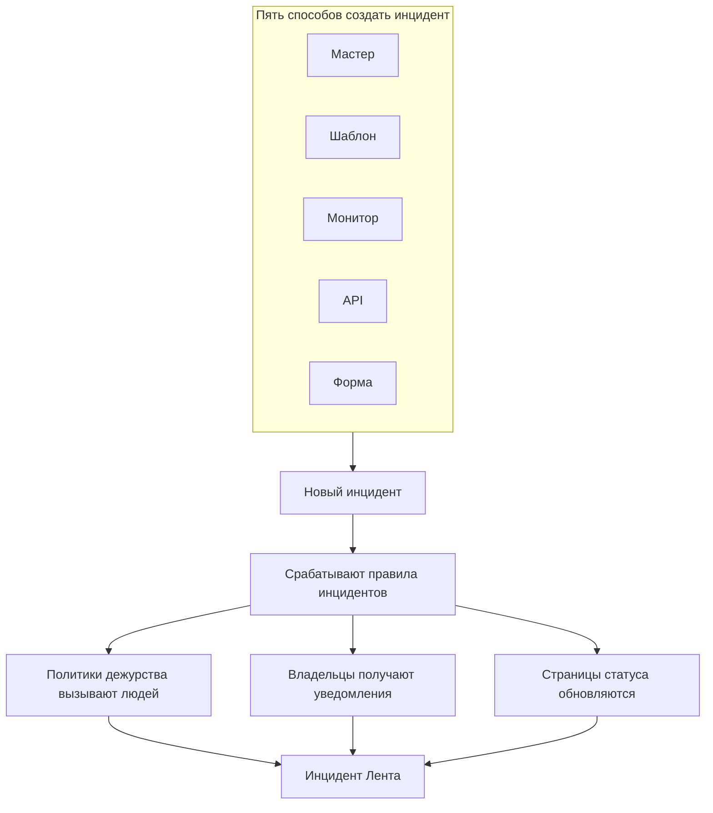
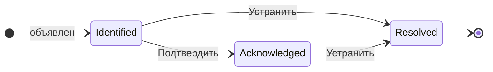

# Обзор инцидентов

Инцидент — это запись, с которой работает ваша команда, когда что-то ломается: что затронуто, насколько всё плохо, на каком этапе реагирование, кто за это отвечает и всё, что было записано по ходу дела. Объявление инцидента вызывает нужную смену дежурных, уведомляет его владельцев и — если вы этого хотите — выводит сбой на вашу страницу статуса, чтобы клиенты знали, что вы уже занимаетесь проблемой.

:::cards
- [Объявление инцидента](/docs/incidents/declaring-incidents): Вручную, из шаблона, из монитора, через API или через форму.
- [Состояния и уровни серьёзности инцидентов](/docs/incidents/states-and-severities): Жизненный цикл и то, что делают подтверждение и устранение.
- [Заметки, владельцы и лента инцидента](/docs/incidents/notes-owners-and-feed): Обновления для клиентов и для команды и кто о них узнаёт.
- [Связанные оповещения](/docs/incidents/linked-alerts): Привяжите оповещения, вызванные сбоем, к инциденту, который их объясняет.
- [Настройки и автоматизация инцидентов](/docs/incidents/settings): Шаблоны, пользовательские поля, роли, измерения и правила.
:::

## Коротко

- **Отдельный продукт** — откройте **Инциденты** в меню **Продукты** на верхней панели; список находится по адресу `/dashboard/{projectId}/incidents`.
- **Три созданных заранее состояния** — **Identified**, **Подтверждён** и **Устранён** создаются для каждого нового проекта. Вы можете добавить свои; три исходных состояния можно переименовать и перекрасить, но нельзя удалить.
- **Три созданных заранее уровня серьёзности** — **Critical Incident**, **Major Incident** и **Minor Incident**. Уровень серьёзности — это метка с цветом и порядком; собственного поведения у него нет.
- **Пять способов создать инцидент** — мастер **Объявить инцидент**, **Создать из шаблона**, правило критериев монитора, `POST /api/incident` или [форма](/docs/forms/index), которую может заполнить любой, у кого есть ссылка.
- **Нумерация в пределах проекта** — каждый инцидент получает номер из счётчика проекта и показывается с префиксом проекта: `INC-42` в новом проекте или `#42` без префикса.
- **Два вида заметок** — приватные заметки (внутренние заметки) для команды и публичные заметки для подписчиков страницы статуса.
- **Оповещения связываются с инцидентами** — свяжите оповещения, которые относятся к инциденту, или объявите инцидент прямо из оповещений — из списка оповещений или со страницы самого оповещения — и сразу подтвердите их. См. [Связанные оповещения](/docs/incidents/linked-alerts).
- **Настройки находятся в разделе «Инциденты», а не в настройках проекта** — состояния, уровни серьёзности, шаблоны, пользовательские поля и механизмы правил находятся в **Инциденты → Настройки** и **Инциденты → Правила**.

## Как это работает

Вы можете объявить инцидент вручную в три часа ночи или позволить монитору объявить его в тот момент, когда совпадут его критерии. В любом случае инцидент — это один и тот же объект с тем же жизненным циклом и тем же следом записей в конце.

### 1. Инцидент объявляют

К одному и тому же объекту ведут пять путей:

- **Вручную** — в списке инцидентов нажмите **Объявить инцидент**. Откроется мастер **Объявить новый инцидент** из трёх шагов: **Сведения об инциденте**, **Затронутые ресурсы**, **Дежурство и роли**. Первый шаг запрашивает заголовок, уровень серьёзности и описание, а то, что большинству инцидентов не нужно, свёрнуто в **Дополнительные поля**. Только первый шаг требует ответа: **Далее** проводит по остальным, а **Объявить инцидент** находится на итоговой сводке в конце.
  - **Из оповещений** — **Объявить инцидент** на выборке оповещений или в заголовке одного оповещения открывает тот же мастер, заполненный по оповещениям, связывает их с новым инцидентом и, если вы не снимете флажок, подтверждает их, чтобы их эскалация прекратилась — см. [Связанные оповещения](/docs/incidents/linked-alerts).
- **Из шаблона** — нажмите **Создать из шаблона** и выберите сохранённый **Инцидент Шаблон**. Шаблоны заранее заполняют заголовок, описание, уровень серьёзности, начальное состояние, ресурсы, политики дежурства, владельцев и метки.
- **Из монитора** — правило критериев монитора с включённым переключателем «объявить инцидент» создаёт инцидент автоматически в тот момент, когда совпадают его фильтры. Заголовки и описания там поддерживают шаблоны `{{variable}}`.
- **Через API** — `POST /api/incident` с ключом API. Сервер сам заполнит `declaredAt`, состояние создания и номер инцидента.
- **Через форму** — кто-то вне вашей команды заполняет форму, которой вы поделились по ссылке, без учётной записи OneUptime. Инцидент объявляется скрытым со страниц статуса и создаётся по шаблону инцидента формы, если он у неё есть. См. [Формы](/docs/forms/index).

Инциденты открывают и интеграции: [Huntress](/docs/integrations/huntress) превращает каждый отчёт об инциденте, присланный его SOC, в один инцидент, который вызывает выбранные вами политики дежурства. Пошаговый разбор всех полей см. в [Объявление инцидента](/docs/incidents/declaring-incidents).

### 2. Об этом узнают нужные люди

При создании OneUptime запускает настроенную вами автоматизацию: правила конфиденциальности, правила владельца, правила меток, правила дежурства и правила runbook-ов. Все политики дежурства, привязанные к инциденту — вручную, из шаблона или добавленные совпавшим правилом дежурства, — выполняются параллельно.

Владельцы получают уведомления по каналам, которые каждый из них включил в **Настройки пользователя → Настройки уведомлений**: электронная почта, SMS, голосовой звонок, push, WhatsApp, Telegram, Slack, Microsoft Teams или webhook. Если у инцидента вообще нет владельцев, уведомление уходит владельцам проекта, а не теряется.

Если инцидент виден на странице статуса и уведомления подписчикам включены, подписчики тоже получают сообщение: подписчики каждой страницы статуса, на которой показан один из его мониторов, или только тех страниц, которыми вы его ограничили. О том, как дать каждой аудитории собственную страницу статуса, см. [Отдельная страница статуса для каждой аудитории](/docs/status-pages/one-status-page-per-audience).

> [!NOTE]
> Уведомления рассылает задание по расписанию, которое запускается каждую минуту, поэтому рассчитывайте на задержку примерно до минуты, а не на мгновенную отправку.

### 3. Команда работает над инцидентом

Реагирующие подтверждают инцидент, добавляют затронутые ресурсы, связывают относящиеся к нему оповещения, запускают runbook-и, назначают роли инцидента и записывают то, что узнают, — приватные заметки для команды, публичные заметки для клиентов, а также страницы **Корневая причина** и **Исправление**, когда картина проясняется. Всё, что они делают, попадает в **Инцидент Лента** на странице **Обзор**.

### 4. Инцидент устраняют

Нажатие **Устранить** переводит инцидент в состояние устранения, отмечает это в хронологии состояний, останавливает счётчик длительности, освобождает удерживаемые им мониторы и убирает инцидент из активного раздела каждой страницы статуса, где он был показан. Больше ничего менять не нужно — страница статуса показывает только инциденты в состоянии выше состояния устранения. См. [Что делает устранение](/docs/incidents/states-and-severities#что-делает-устранение).

После этого вы можете написать постмортем и при желании опубликовать его на странице статуса.

## Ключевые термины

Несколько слов встречаются на каждой странице этого раздела. Сначала разберитесь с ними.

| Термин                 | Что он означает                                                                                                                                     |
| ---------------------- | --------------------------------------------------------------------------------------------------------------------------------------------------- |
| **Инцидент**           | Сама запись — заголовок, описание, уровень серьёзности, текущее состояние, затронутые ресурсы и всё, что было записано в ней во время реагирования.  |
| **Состояние инцидента** | Где инцидент находится в своём жизненном цикле. Строка проекта с именем, цветом и `order`, а также флагами, которые придают ей смысл.              |
| **Серьёзность инцидента** | Насколько всё плохо. Строка проекта с именем, цветом и `order`. Чистая классификация — ничто в продукте не выделяет какой-то уровень особо.      |
| **Номер инцидента**    | Счётчик проекта, который показывается как `#42` или, с настроенным вами префиксом, как `INC-42`.                                                    |
| **Затронутые ресурсы** | Мониторы, хосты, кластеры Kubernetes, хосты Docker, сервисы и другая инфраструктура, которую вы привязываете к инциденту.                           |
| **Публичная заметка**  | Обновление для читателей и подписчиков страницы статуса. Оно отображается в хронологии страницы статуса.                                            |
| **Приватная заметка**  | Внутренняя заметка (модель `IncidentInternalNote`) для команды реагирования. Она никогда не попадает на страницу статуса.                          |
| **Владелец**           | Пользователь или команда, отвечающие за инцидент. Владельцы получают уведомления при создании инцидента, при публикации заметок и при смене состояния. |
| **Инцидент Лента**     | Хронология действий на странице **Обзор** инцидента, в которую можно только добавлять: смены состояния, заметки, смены владельцев, срабатывания правил и уведомления. |
| **Хронология состояний** | Запись о том, в каком состоянии был инцидент, когда и как долго, — со статусом уведомления подписчиков для каждого перехода.                      |
| **Связанное оповещение** | Оповещение, связанное с инцидентом как часть реагирования. Оповещение может быть связано с несколькими инцидентами и сохраняет собственное состояние. |

## Три состояния, которые OneUptime создаёт для каждого проекта

При создании проекта OneUptime создаёт ровно три состояния инцидента в таком порядке:

| Состояние        | Порядок | Цвет                    | Что оно означает                                                          |
| ---------------- | ------- | ----------------------- | ------------------------------------------------------------------------- |
| **Identified**   | 1       | Красный (`#fd625e`)     | Состояние, в которое попадает только что созданный инцидент. Это состояние создания. |
| **Подтверждён**  | 2       | Жёлтый (`#ffbf53`)      | Кто-то взял инцидент в работу.                                            |
| **Устранён**     | 3       | Зелёный (`#2ab57d`)     | Инцидент завершён. Именно устранение убирает его со страницы статуса.     |

Имена — это просто метки; поведение на самом деле определяют три логических поля в строке состояния: `isCreatedState`, `isAcknowledgedState` и `isResolvedState`. Ожидается, что в проекте каждый флаг есть только у одного состояния.

Это различие важнее, чем кажется:

- `isCreatedState` определяет, где начинается новый инцидент. Если при создании состояние явно не выбрано, OneUptime находит состояние создания проекта и использует его.
- `isAcknowledgedState` и `isResolvedState` отмечают состояния подтверждения и устранения. От того, где стоит состояние инцидента относительно них, зависят кнопки **Подтвердить** и **Устранить** в заголовке инцидента, две плитки статистики на странице **Обзор** инцидента и счётчик **Активные инциденты** в боковом меню: инцидент в состоянии подтверждения или в любом последующем состоянии считается подтверждённым, а инцидент в состоянии устранения или в любом последующем — устранённым.
- **Активные инциденты** определяются только так: «текущее состояние стоит выше состояния устранения». Поэтому собственное состояние, добавленное выше состояния устранения, считается активным, а состояние, поставленное после него, считается устранённым, как и само состояние устранения.

> [!NOTE]
> Первое созданное заранее состояние называется **Identified**, хотя в некоторых описаниях в продукте его по-прежнему называют состоянием создания («created»). Если вы ищете «Created» в списке состояний проекта, это строка с именем **Identified**.

Свои состояния можно добавить в **Инциденты → Настройки → Состояние инцидента**. Новое состояние добавляется сразу над состоянием устранения, а порядок строк меняется перетаскиванием; столбец **Считается** показывает, чем считается инцидент в каждом состоянии — не подтверждённым, подтверждённым или устранённым. Три состояния с флагами помечены как **Встроенный**: они сохраняют свой порядок и не удаляются, но их можно переименовать, перекрасить и переместить, поэтому интерфейс читает имена состояний динамически.

Порядок соблюдается строго и не является косметическим: инцидент не может перейти в состояние, которое стоит в порядке раньше текущего. Все подробности — в [Состояния и уровни серьёзности инцидентов](/docs/incidents/states-and-severities).

## Три уровня серьёзности, которые OneUptime создаёт для каждого проекта

Каждый новый проект также получает три уровня серьёзности:

| Серьёзность           | Порядок | Цвет                     | Что он означает                                             |
| --------------------- | ------- | ------------------------ | ----------------------------------------------------------- |
| **Critical Incident** | 1       | Бордовый (`#b70400`)     | Очень сильное влияние на клиентов, требуется немедленная реакция. |
| **Major Incident**    | 2       | Красный (`#fd625e`)      | Существенное влияние, обычно требуется немедленная реакция. |
| **Minor Incident**    | 3       | Жёлтый (`#ffbf53`)       | Слабое влияние, обычно решается в рабочее время.            |

У уровней серьёзности есть `name`, `description`, `color` и `order` — и больше ничего. Флагов нет, и ни один участок кода не обрабатывает «Critical Incident» иначе, чем любую другую строку. Серьёзность — это то, как люди расставляют приоритеты, и её можно использовать как критерий совпадения в правилах дежурства, но сам выбор уровня серьёзности никого не вызывает.

Изменять и добавлять уровни серьёзности можно в **Инциденты → Настройки → Серьёзность инцидента**. Полные исходные описания приведены в [Состояния и уровни серьёзности инцидентов](/docs/incidents/states-and-severities).

## Где инциденты находятся в панели управления

Откройте **Инциденты** в меню **Продукты** на верхней панели. Боковое меню разделено на разделы:

| Раздел        | Что вы там делаете                                                                                                                                                         |
| ------------- | -------------------------------------------------------------------------------------------------------------------------------------------------------------------------- |
| **Обзор**     | **Все инциденты** и **Активные инциденты** — у последнего есть красный значок с количеством инцидентов в состоянии выше состояния устранения.                               |
| **Эпизоды**   | Эпизоды инцидентов — отдельная функция группировки со своими страницами.                                                                                                  |
| **ИИ**        | **Аналитика**, **Журналы**, **Настройки**: чему OneUptime AI научился на ваших инцидентах и всё, что он для них сделал, а также что он может делать сам — с правилами о том, какие инциденты он расследует и исправляет. См. [AI SRE](/docs/ai/ai-sre). |
| **Рабочее пространство** | Чат-пространства, подключённые к проекту: **Slack**, **Microsoft Teams** или оба, каждое со своими правилами уведомлений для инцидентов. Если ни одно не подключено, здесь находится **Подключить Slack или Teams** — страница, которая показывает оба и как их подключить. |
| **Интеграции** | Инструменты, которые сами открывают инциденты: **Huntress**, отчёты которого становятся инцидентами, вызывающими дежурных. См. [Huntress](/docs/integrations/huntress). |
| **Правила**   | Механизмы правил: **Правила группировки**, **Правила дежурства**, **Правила владельца**, **Правила runbook-ов**, **Правила конфиденциальности**, **Правила меток**, **Правила SLA**, **Reminder Rules**. |
| **Настройки** | **Состояние инцидента**, **Серьёзность инцидента**, **Шаблоны инцидентов**, **Шаблоны заметок**, **Шаблоны постмортема**, **Пользовательские поля**, **Роли инцидента**, **Измерения**, **Связанные оповещения**, **Префикс номера**. |

Разделы **Обзор** и **Эпизоды** открыты; **ИИ**, **Рабочее пространство**, **Интеграции**, **Правила**, **Настройки** и **Для разработчиков** по умолчанию свёрнуты, поэтому меню открывается на списках, которыми вы пользуетесь каждый день. Нажмите на заголовок раздела, чтобы развернуть его и найти страницы, на которые ссылается остальная документация; раздел также разворачивается сам, когда вы находитесь на одной из его страниц. Конфигурация инцидентов находится не в настройках проекта, а целиком здесь.

Сам список инцидентов показывает **Номер инцидента**, **Заголовок**, **Состояние**, **Серьёзность**, **Затронутые ресурсы**, **Объявлен**, **Длительность**, **Метки** и **Владельцы**, а массовое действие **Изменить состояние** позволяет закрыть несколько инцидентов сразу.

## Что показывает каждая страница инцидента

Откройте инцидент, и его собственное боковое меню сгруппирует страницы так:

| Раздел бокового меню | Страницы                                                                                  |
| -------------------- | ----------------------------------------------------------------------------------------- |
| **Обзор**            | **Обзор**, **Хронология состояний**, **SLA**                                              |
| **Расследование**    | **Описание**, **Корневая причина**, **Исправление**, **Сборники инструкций**, **Постмортем**, **Связанные оповещения** |
| **Команда**          | **Роли**, **Выполнения дежурств**, **Владельцы**                                          |
| **Уведомления**      | **Журналы уведомлений**, **Журналы ИИ** — свёрнуты, пока вы не нажмёте **Уведомления**    |
| **Заметки**          | **Приватные заметки**, **Публичные заметки**                                              |
| **Для разработчиков** | **Terraform**, **API**, **ИИ-ассистенты** — свёрнуты, пока вы не нажмёте **Для разработчиков** |
| **Расширенный**      | **Пользовательские поля**, **Настройки**, **Журналы аудита**, **Удалить инцидент** — свёрнуты, пока вы не нажмёте **Расширенный** |

Что содержит каждая страница:

- **Обзор** — реагирование с первого взгляда. Под заголовком плитки статистики показывают время до подтверждения, время до устранения и общую **Длительность**. Карточка **AI Investigation** открывает страницу — что нашёл OneUptime AI или почему он не начал работу, — а под ней находится **Инцидент Лента**. Рядом расположены карточка **Video Call**, карточка **Сведения об инциденте** (заголовок, серьёзность, метки, номер инцидента, время объявления, кем объявлен, политики дежурства и ID инцидента в маленькой строке **ID** внизу, в одном клике от буфера обмена), **Роли инцидента**, карточка **Затронутые ресурсы** и пользовательские поля инцидента. Если в проекте есть [измерения](/docs/incidents/settings#измерения), карточка **Измерения** под **Сведения об инциденте** показывает, что каждое из них сообщает для этого инцидента: **12 мин.**, **Идёт уже 5 мин.**, **Не достигнуто**.
- **Хронология состояний** — каждое состояние, в котором побывал инцидент, с **Начинается**, **Заканчивается**, **Длительность** и статусом уведомления подписчиков для каждого перехода. **Просмотреть причину** и **Просмотреть логи** объясняют, почему произошло каждое изменение.
- **SLA** — отслеживание SLA для этого инцидента.
- **Описание**, **Корневая причина**, **Исправление** — три страницы в Markdown. Описание показывается на вашей странице статуса.
- **Сборники инструкций** — запуски runbook-ов, привязанные к этому инциденту.
- **Постмортем** — отчёт и вложения, которые можно при желании опубликовать на странице статуса. **Редактировать заметку ретроспективы** запрашивает заметку и вложения, а затем **Опубликовать на странице статуса**; только пока это включено, она запрашивает **Уведомить подписчиков** и **Разбор инцидента опубликован в**, которое при включении публикации получает текущее время. **Generate with AI** составляет черновик заметки за вас, а **Применить шаблон** — появляется, когда в проекте есть шаблон постмортема, — начинает её с шаблона. Подписчики получают уведомление один раз, когда постмортем публикуется: в первый раз, когда страница статуса его показывает, для чего нужны включённый **Опубликовать на странице статуса** и написанная заметка. Повторное сохранение или правка во время публикации обновляет страницу статуса и никого не уведомляет; повторная публикация после снятия со страницы статуса снова уведомляет подписчиков. Постмортем, опубликованный, пока инцидент скрыт, отправляется, когда инцидент становится видимым. См. [Постмортем](/docs/status-pages/subscribers#инциденты).
- **Связанные оповещения** — оповещения, связанные с этим инцидентом, с текущим состоянием каждого оповещения, а также кто и когда его связал. У оповещений есть соответствующая страница **Связанные инциденты**. См. [Связанные оповещения](/docs/incidents/linked-alerts).
- **Роли**, **Выполнения дежурств**, **Владельцы** — кто работает над инцидентом, какие политики сработали и кто получает уведомления.
- **Журналы уведомлений**, **Журналы ИИ**, **Журналы аудита** — что было отправлено и что изменилось.
- **Приватные заметки** и **Публичные заметки** — что сообщили вашей команде и вашим клиентам. См. [Заметки, владельцы и лента инцидента](/docs/incidents/notes-owners-and-feed).
- **Пользовательские поля**, **Настройки**, **Удалить инцидент** — страница **Настройки** содержит **Видно на странице статуса** и **Приватный инцидент**, карточку **Охват страниц состояния**, которая ограничивает инцидент некоторыми страницами статуса, и карточку **Reminders**, переключатель **Отправлять напоминания** которой сохраняется сразу после переключения и показывает, когда уйдёт следующее напоминание.

## Как инциденты сочетаются с остальным OneUptime

- **Мониторы замечают проблему; инциденты её фиксируют.** Правило критериев монитора может объявить инцидент автоматически, заранее заполнив заголовок, серьёзность, политики дежурства, владельцев, метки и заметки об исправлении. Доступные там переменные см. в [Шаблоны инцидентов и оповещений](/docs/monitor/incident-alert-templating).
- **Оповещения — это сигналы; инциденты — это реагирование.** Свяжите с инцидентом оповещения, которые он объясняет, с любой стороны, и два переключателя проекта, включённые в новых проектах, подтверждают и устраняют эти оповещения вместе с инцидентом. См. [Связанные оповещения](/docs/incidents/linked-alerts).
- **Вызовом занимаются политики дежурства.** Привяжите политики на шаге **Дежурство и роли** мастера объявления, в шаблоне или через **Инциденты → Правила → Правила дежурства**. Срабатывает каждое совпавшее правило — выполняется объединение всех совпадений плюс всё, что привязано напрямую, без дубликатов.
- **Runbook-и говорят людям, что делать.** Правила runbook-ов автоматически привязывают процедуру, когда создаётся подходящий инцидент, а реагирующие могут запустить её вручную из инцидента. См. [Обзор Runbook-ов](/docs/runbooks/index).
- **Страницы статуса сообщают клиентам.** Инцидент появляется в активном списке страницы статуса, когда на странице показан один из его мониторов, на странице включены инциденты, инцидент помечен как видимый на странице статуса, а его текущее состояние стоит выше состояния устранения. Инцидент, ограниченный некоторыми страницами статуса, показывается только на них. Приватные инциденты всегда скрыты со всех страниц статуса. См. [Обзор страниц статуса](/docs/status-pages/index) и [Отдельная страница статуса для каждой аудитории](/docs/status-pages/one-status-page-per-audience).
- **Рабочие процессы автоматизируют работу вокруг инцидента.** Триггеры **On Create Incident**, **On Update Incident** и **On Delete Incident** позволяют строить автоматизацию без кода поверх жизненного цикла инцидента. См. [Обзор рабочих процессов](/docs/workflows/index).

## Дальнейшие шаги

:::cards
- [Объявление инцидента](/docs/incidents/declaring-incidents): Пройдите мастер поле за полем или объявите инцидент из шаблона, монитора или API.
- [Состояния и уровни серьёзности инцидентов](/docs/incidents/states-and-severities): Добавьте свои состояния и узнайте, что именно делает каждое из них.
- [Обзор страниц статуса](/docs/status-pages/index): Как инциденты доходят до клиентов.
- [Подписчики и объявления](/docs/status-pages/subscribers): Кто получает уведомления, когда инцидент меняется.
:::
