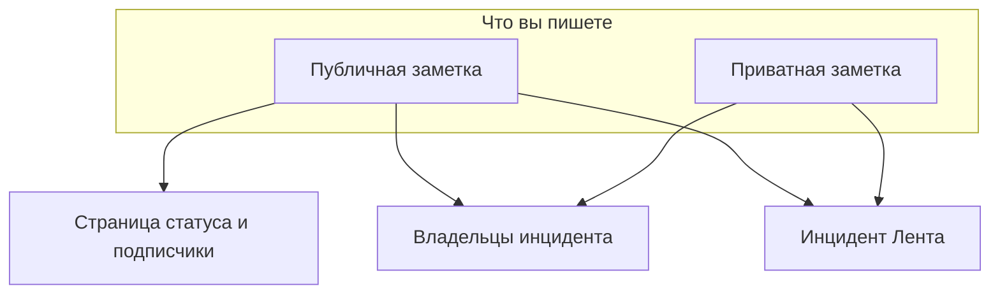

# Заметки, владельцы и лента инцидента

Пока вы работаете над инцидентом, он собирает письменную историю: обновления для клиентов, рабочие заметки для команды и ленту действий со всем, что произошло. Эта страница рассказывает, как писать публичные и приватные заметки, кому доходит каждая из них, что такое лента инцидента и кто такие владельцы, получающие уведомления о каждом изменении.

:::cards
- [Опубликуйте публичную заметку](#опубликуйте-публичную-заметку): Расскажите клиентам, что вам известно, на странице статуса и в уведомлении.
- [Когда подписчики получают уведомления](#когда-публичная-заметка-действительно-доходит-до-подписчиков): Проверки, которые проходит публичная заметка, и её значок.
- [Лента инцидента](#лента-инцидента): Хронология всего, что произошло.
- [Владельцы](#владельцы): Кто отвечает и что им сообщают.
:::

## Как это работает

Часть того, что вы пишете, предназначена клиентам — обновление, которое уходит на страницу статуса в 02:14 и сообщает, что вы нашли неудачный деплой. Остальное — для команды: стек вызовов, который кто-то вставил, график, который наконец всё объяснил, решение переключиться на резерв. OneUptime разделяет эти две аудитории и записывает обе в инциденте.



**Публичные заметки** публикуются на вашей странице статуса и могут уведомлять подписчиков. **Приватные заметки** (модель `IncidentInternalNote`) остаются внутри панели управления. Под обеими находятся **Инцидент Лента** — хронология, в которую можно только добавлять и которая записывает всё, что произошло с инцидентом, — и список **Владельцы**, который определяет, кто получает сообщения.

Всё это доступно из бокового меню инцидента: **Заметки → Публичные заметки**, **Заметки → Приватные заметки** и **Команда → Владельцы**. Лента находится на странице **Обзор** инцидента.

## Публичные и приватные заметки

Два вида заметок выглядят в панели управления похоже, а ведут себя совершенно по-разному.

|                          | Публичная заметка                                                   | Приватная заметка                                               |
| ------------------------ | ------------------------------------------------------------------- | --------------------------------------------------------------- |
| Модель                   | `IncidentPublicNote`                                                | `IncidentInternalNote`                                          |
| Показывается на страницах статуса | Да, как часть хронологии инцидента                         | Никогда — ничто в приложении страницы статуса их не читает      |
| Время публикации         | `postedAt`, которое можно задать самому                             | Нет: отметка и сортировка по `createdAt`                        |
| Уведомляет подписчиков   | Когда включено **Notify status page subscribers**                   | Никогда: у неё вообще нет полей для подписчиков                 |
| Вложения доступны        | Посетителям страницы статуса, через маршрут страницы статуса        | Только через аутентифицированный API панели управления          |
| Уведомляет владельцев    | Да                                                                  | Да                                                              |

**Что на самом деле означает «приватная».** Это значит «не публикуется на странице статуса», а не «доступна узкому кругу людей». Встроенные роли, которые могут читать инцидент, читают оба вида заметок, поэтому любой, кто может читать инцидент, обычно может читать и его приватные заметки; в пользовательской роли это отдельные разрешения — **Read Incident Status Page Note** и **Read Incident Internal Note**. Если нужно ограничить, кто вообще может видеть инцидент, используйте флаг **Приватный инцидент** (`isPrivate`) у самого инцидента: он скрывает инцидент со всех страниц статуса и ограничивает доступ пользователями-владельцами инцидента, участниками его команд-владельцев, а также администраторами и владельцами проекта.

**Владельцы видят обе.** Задание, уведомляющее владельцев, выбирает публичные и приватные заметки вместе. Приватная заметка приватна для ваших подписчиков, а не для тех, кто реагирует на инцидент.

| Если вы хотите…                                        | Выберите         |
| ------------------------------------------------------ | ---------------- |
| Сказать клиентам, что вам известно и когда будет больше | **Публичная заметка** |
| Задним числом добавить обновление, которое вы уже отправили в другом месте | **Публичная заметка** |
| Записать гипотезу, выполненную команду или тупиковую версию | **Приватная заметка** |
| Приложить дамп памяти или скриншот внутреннего дашборда | **Приватная заметка** |

## Опубликуйте публичную заметку

:::steps
### Откройте публичные заметки

Откройте инцидент и выберите **Заметки → Публичные заметки** в его боковом меню. Редактор над заметками ещё до публикации сообщает, кто будет читать заметку: **Public · Visible on your status page**.

### Напишите обновление

Напишите заметку в Markdown или начните с одного из ваших **Шаблоны** или с **Draft with AI**. Добавьте файлы через **Attach**, если подписчики должны их видеть.

### Решите, кого уведомить

Оставьте **Notify status page subscribers** отмеченным, чтобы уведомить подписчиков, или снимите отметку, чтобы опубликовать тихо. **Will notify** под ним показывает, до каких страниц статуса дойдёт заметка, а **Предпросмотр** показывает письмо, которое они получат.

### Опубликуйте её

Нажмите **Post update** или нажмите Ctrl+Enter (⌘+Enter на Mac). Заметка появится вверху списка со значком, отслеживающим её уведомление.
:::

Тот же редактор открывается в диалоге из **Add Public Note** в меню **Действия** ленты инцидента (см. [Лента инцидента](#лента-инцидента)), поэтому заметка пишется одинаково в обоих местах.

| Элемент                            | Назначение                                                                                                                                    |
| ---------------------------------- | --------------------------------------------------------------------------------------------------------------------------------------------- |
| Заметка                            | Текст в Markdown. Обязательно.                                                                                                                |
| **Шаблоны**                        | Вставляет один из ваших шаблонов заметок в заметку после уже набранного текста. См. [Шаблоны заметок](#шаблоны-заметок).                       |
| **Draft with AI**                  | Составляет черновик заметки по инциденту для вашей правки. См. [Создание заметки с помощью ИИ](#создание-заметки-с-помощью-ии).                   |
| **Attach**                         | Файлы, которыми вы делитесь с подписчиками на странице статуса. Необязательно.                                                                |
| **Posted now**                     | Когда, по словам заметки, она опубликована: момент публикации, если вы не выберете здесь более раннее время, в вашем текущем часовом поясе.   |
| **Notify status page subscribers** | Флажок. По умолчанию включён, если только инцидент не был объявлен без уведомления подписчиков — тогда он изначально выключен. Выключите его, чтобы опубликовать тихо. |

**Тихие инциденты остаются тихими.** Если инцидент был объявлен с выключенным **Уведомить подписчиков страницы статуса** (или как приватный инцидент), его подписчики о нём не узнали, поэтому публичная заметка не должна стать первым, что они услышат. В таком инциденте флажок изначально выключен, а строка под ним объясняет почему. Вы всё равно можете его отметить, чтобы уведомить подписчиков об этой заметке. Заметки, опубликованные без явного выбора, следуют тому же правилу: заметки из Slack и Microsoft Teams, рабочие процессы и запросы API, в которых нет `shouldStatusPageSubscribersBeNotifiedOnNoteCreated`. Явное `true` или `false` всегда сохраняется. Публичные заметки в [событиях планового обслуживания](/docs/status-pages/subscribers#плановые-работы) и [эпизодах инцидентов](/docs/status-pages/subscribers) следуют похожему правилу, основанному на том, уведомило ли само событие или эпизод подписчиков при создании; превращение эпизода в приватный на это не влияет.

**Посмотрите, до кого дойдёт заметка.** Пока **Notify status page subscribers** отмечено, строка **Will notify** под ним перечисляет страницы статуса, на которые уйдёт заметка, с количеством подписчиков «до» по каждому каналу, а также страницы, где показаны мониторы инцидента, но которые не получат уведомление, с причиной. Если не будет уведомлён никто, она ничего не показывает, если только инцидент не скрыт со страниц статуса или причиной не является охват страниц статуса инцидента. Она учитывает охват страниц статуса инцидента, поэтому заметка в инциденте, ограниченном двумя страницами площадок, сообщает, что дойдёт до этих двух. См. [Отдельная страница статуса для каждой аудитории](/docs/status-pages/one-status-page-per-audience).

**Посмотрите, что они получат.** Рядом с тем же флажком **Предпросмотр** показывает письмо, которое получат подписчики каждой из этих страниц статуса за заметку, которую вы пишете, а также какой шаблон оно использует и почему. Он остаётся серым, пока в заметке нет текста. **Отправить тест мне** отправляет это письмо на адрес вашей учётной записи и больше никому. См. [Подписчики и объявления](/docs/status-pages/subscribers#инциденты).

> [!TIP]
> **Время публикации — это настоящая отметка времени заметки.** Страницы статуса сортируют и показывают публичные заметки по `postedAt`, а не по времени, когда вы их набрали, — поэтому, если вы догоняете страницу статуса обновлением, отправленным 40 минут назад, выберите **Posted now** и укажите, когда это произошло на самом деле. Если заметка приходит через API (`/api/incident-public-note`) без времени, OneUptime ставит текущее время.

Каждая заметка показывает, кто её написал, время её публикации, отрисованный Markdown с вложениями и, в своём заголовке, состояние её уведомления подписчиков. **Search notes…** находит заметки по их содержанию, а ленту можно читать от новых к старым или от старых к новым.

## Опубликуйте приватную заметку

**Заметки → Приватные заметки** намеренно проще. Это тот же редактор, который сообщает **Private · Only your team can see this**, с заметкой, **Шаблоны**, **Draft with AI** и **Attach** для файлов, предназначенных команде реагирования. **Добавить личную заметку** в меню **Действия** ленты инцидента открывает его в диалоге. Через API приватные заметки — это `/api/incident-internal-note`.

Нет времени публикации, нет флажка для подписчиков — заметка получает отметку времени при создании.

Оба вида заметок пишутся в редакторе Markdown, который вкладывает пункты списков через **Увеличить отступ** и **Уменьшить отступ** — или Tab и Shift+Tab — и сохраняет списки, ссылки и форматирование того, что вы вставляете из Word, Google Docs или другой страницы OneUptime. Ctrl+Z отменяет изменение отступа, а в визуальном режиме — и блоки и вставки, добавленные редактором, по порядку вместе с вашим набором. Блок кода, скопированный из заметки, вставляется обратно как блок кода, а слово, скопированное из него, — как встроенный код. См. [Объявление инцидента](/docs/incidents/declaring-incidents#шаг-1-сведения-об-инциденте).

## Вложения в заметках

Оба вида заметок принимают вложенные файлы через кнопку редактора **Attach**, и оба показывают под текстом заметки список вложений со ссылкой **Download attachment** для каждого файла.

Различаются они тем, кто может получить файл:

- **Вложения публичных заметок** могут скачать посетители страницы статуса через маршрут страницы статуса вместе с самой заметкой.
- **Вложения приватных заметок** доступны только через аутентифицированный API панели управления. Маршрута страницы статуса для них нет.

Поэтому для вложений действует тот же выбор между публичным и приватным, что и для текста заметки. Изображение для хронологии, которую видят клиенты, — в публичную заметку; дамп конфигурации — в приватную.

Изображения следуют тому же выбору. Изображение, которое вы вставляете или перетаскиваете в заметку или добавляете через **Загрузить изображение**, хранится в проекте инцидента и показывается внутри заметки, а кто может его видеть, зависит от заметки:

- **В приватной заметке** — или в публичной до её публикации — изображение видят только участники проекта, вошедшие так, как требует проект. Любой другой, кто откроет его адрес, ничего не увидит, как будто изображения там нет.
- **В публичной заметке** изображение видит каждый, кто может видеть заметку: на странице статуса и в письмах её подписчикам. Публичная заметка показывается вместе со своим инцидентом и никогда без него: пока инцидент скрыт со страниц статуса или приватный, изображения его заметок тоже видят только участники проекта.

Каждая загрузка начинается приватной — и из панели управления, и из API. Изображение доступно всем только до тех пор, пока его содержит что-то, что показывают ваши страницы статуса: публичная заметка, пока её инцидент, эпизод или событие планового обслуживания показаны на страницах статуса, объявление с момента начала показа, описание инцидента, пока инцидент **Видно на странице статуса** и не приватный, его постмортем, когда он тоже там опубликован, описание эпизода или события планового обслуживания, пока оно показано на страницах статуса (но никогда, пока эпизод приватный), и собственные описания обзора, групп и ресурсов страницы статуса. Когда это прекращается — инцидент скрывают или делают приватным, изображение удаляют из текста, удаляют заметку или инцидент, — изображение снова становится приватным, если только его не содержит что-то ещё, что показывают ваши страницы статуса. Описание и благодарственное сообщение формы так же показывают свои изображения всем, пока форма принимает отправки.

При чтении заметки через API, Terraform или рабочий процесс перечисляются только вложения, которые читатель может открыть: файлы проекта заметки и публичные файлы. Вложение, которое заметка указывает из другого проекта, исключается из списка, как будто его в заметке нет.

## Создание заметки с помощью ИИ

В редакторе есть кнопка **Draft with AI** — на обеих страницах заметок и в диалогах ленты **Add Public Note** и **Добавить личную заметку**. Она отправляет инцидент поставщику ИИ вашего проекта и вставляет сгенерированный Markdown в заметку, где вы правите его перед публикацией, — ничего не публикуется автоматически.

| Диалог                             | Что он пишет                                                         | Шаблоны                                                           |
| ---------------------------------- | -------------------------------------------------------------------- | ----------------------------------------------------------------- |
| **Generate Public Note with AI**   | Заметку для клиентов на основе анализа данных инцидента.             | **Status Update**, **Resolution Notice**, **Maintenance Update**  |
| **Generate Private Note with AI**  | Внутреннюю техническую заметку.                                      | **Investigation Update**, **Technical Analysis**, **Shift Handoff** |

За кнопкой панель управления отправляет запрос на `/incident/generate-note-from-ai/{incidentId}` с выбранным шаблоном и типом заметки `public` или `internal`.

Отправляется текст инцидента. Изображение или файл, встроенные в него, — например, скриншот, вставленный в описание, — заменяются короткой пометкой вроде `[image omitted: PNG, 340 KB]`, а каждое текстовое поле обрезается до 16 000 символов, чтобы одна большая вставка никогда не вытесняла остальное. Сам инцидент сохраняет свои изображения.

## Шаблоны заметок

Если ваша команда при каждом сбое пишет одни и те же три обновления, сохраните их один раз. Меню редактора **Шаблоны** перечисляет их на обеих страницах заметок и в диалогах заметок ленты, а выбор шаблона вставляет его в заметку.

Шаблоны общие для публичных и приватных заметок: один список шаблонов обслуживает оба вида, и один и тот же шаблон можно вставить в заметку любого вида.

Заполнители в шаблоне — `{{incident.title}}`, `{{incident.state}}`, `{{incident.customFields.impact}}` и остальные, перечисленные в [Шаблоны заметок](/docs/incidents/settings#шаблоны-заметок), — заполняются текущими значениями инцидента, когда вы его выбираете, как на страницах заметок, так и в диалогах **Подтвердить** и **Устранить**. То, что вы уже набрали, никогда не меняется, а заполнитель без значения остаётся как есть.

> [!IMPORTANT]
> Прочитайте заполненную заметку, прежде чем публиковать публичную: `{{incident.affectedStatusPages}}` называет каждую страницу статуса, которой достигает инцидент, и её читают подписчики всех этих страниц.

Управлять ими можно в **Инциденты → Настройки → Шаблоны заметок** — карточка называется **Шаблоны публичных или приватных заметок для инцидентов**, а её форма умещается на одной странице: **Название шаблона** и **Описание шаблона**, оба обязательны, затем текст. Пока шаблонов нет, меню **Шаблоны** сообщает об этом и ведёт туда.

## Публикация заметок из Slack или Microsoft Teams

Если вы подключили рабочее пространство, реагирующим не нужно покидать канал. И Slack, и Microsoft Teams предоставляют действие добавления заметки, которое открывает диалог с выпадающим списком **Note Type** — **Public Note** (публикуется на странице статуса) или **Private Note** (видна только участникам команды) — и текстовым полем **Note** и записывает результат прямо в инцидент.

Три детали, которые стоит знать:

- **Защита от дубликатов** — каждая заметка записывает сообщение Slack, из которого она пришла (`postedFromSlackMessageId` в формате `channel_id:message_ts`), поэтому, если несколько человек отреагируют на одно и то же сообщение, получится одна заметка, а не пять.
- **Заметки отражаются обратно** — публикация заметки любого вида также отправляет сообщение в подключённый канал инцидента, потому что запись ленты для заметки создаётся с включённым уведомлением рабочего пространства.
- **Публикуется от имени того, кто попросил** — заметка из диалога или из реакции публикуется с разрешениями этого человека в OneUptime, поэтому ему нужно разрешение публиковать такой вид заметок в инциденте. Если в публикации отказано, ему сообщают почему — личным сообщением в Slack и в беседе в Microsoft Teams (в ветке сообщения, если это реакция), — и ничего не публикуется.

## Когда публичная заметка действительно доходит до подписчиков

Создание публичной заметки с включённым **Уведомить подписчиков страницы статуса** само по себе не гарантирует отправку письма. Заметка должна пройти цепочку проверок, и каждый отказ записывает конкретную причину, а не завершается ошибкой:

```mermaid title="Проверки, которые проходит публичная заметка, прежде чем о ней узнают подписчики"
flowchart TB
    note["Публичная заметка опубликована"] --> box{"Флажок уведомления включён?"}
    box -->|Нет| skipped["Подписчики не уведомлены"]
    box -->|Да| incident{"Инцидент на страницах статуса?"}
    incident -->|Нет| skipped
    incident -->|Да| pages{"Страница в охвате?"}
    pages -->|Нет| skipped
    pages -->|Да| prefs{"Подписчик подписан?"}
    prefs -->|Да| sent["Сообщение отправлено"]
```

1. **Уведомить подписчиков страницы статуса** должно быть включено. Если нет, заметка помечается как пропущенная в момент создания. Оно изначально выключено в инцидентах, объявленных без уведомления подписчиков.
2. Заметка должна принадлежать ещё существующему инциденту.
3. К инциденту должен быть привязан хотя бы один монитор — без мониторов нет ресурса страницы статуса, к которому можно направить заметку.
4. Флаг инцидента **Видно на странице статуса** (`isVisibleOnStatusPage`) должен быть истинным, а сам инцидент не должен быть приватным (`isPrivate`). Приватный инцидент скрыт со всех страниц статуса, что бы ни говорил флаг, — см. [Как не допустить инцидент на страницу статуса](/docs/incidents/states-and-severities#как-не-допустить-инцидент-на-страницу-статуса).
5. На каждой странице статуса, которой достигает инцидент, должно быть включено **Показывать инциденты** (`showIncidentsOnStatusPage`). Достигаемые страницы — это те, где показаны его мониторы, суженные до страниц, которыми ограничен инцидент, если такие есть. Инцидент, не ограниченный ни одной страницей, пропускает страницы, показывающие только ограниченные ими инциденты. См. [Отдельная страница статуса для каждой аудитории](/docs/status-pages/one-status-page-per-audience).
6. Каждый подписчик должен пройти собственные настройки — не быть отписанным и быть подписанным на этот ресурс и на тип события `Incident` там, где страница позволяет подписчикам выбирать.

> [!NOTE]
> **Уведомления не мгновенные.** Задание, которое их отправляет, запускается раз в минуту, поэтому между сохранением заметки и отправкой письма может пройти около минуты. Именно это означает **Notifying subscribers soon** у заметки и **Sending Soon** у собственных уведомлений инцидента.

Заголовок публичной заметки отслеживает весь путь значком. Нажмите на него, чтобы увидеть статусное сообщение уведомления, которое говорит, что произошло:

| Значок                         | Что он означает                                                                                                                                   |
| ------------------------------ | ------------------------------------------------------------------------------------------------------------------------------------------------- |
| **Subscribers not notified**   | Ничего не отправлено: заметка опубликована со снятым **Уведомить подписчиков страницы статуса** или закрылся один из барьеров выше. Причина записана. |
| **Notifying subscribers soon** | В очереди, ждёт следующего запуска задания отправки.                                                                                              |
| **Notifying subscribers**      | Задание обрабатывает список подписчиков.                                                                                                          |
| **Subscribers notified**       | Сообщение каждому подписчику отправлено. Статусное сообщение перечисляет по каждой странице статуса, сколько ушло по каждому каналу.               |
| **Notification failed**        | Не всем подписчикам удалось отправить сообщение, или задание остановилось с ошибкой. Статусное сообщение говорит, что именно.                      |

**«Отправлено» значит отправлено.** Задание дожидается каждого сообщения: письмо или SMS считается отправленным, когда его принял почтовый сервер или SMS-провайдер, а сообщение в Slack, Microsoft Teams или webhook — когда другая сторона ответила. Сообщение, которое отклонено, завершилось ошибкой или не получило ответа за 4 минуты, считается неудавшимся, и одна неудача переводит значок в **Notification failed**; остальным подписчикам сообщение всё равно отправляется. Статусное сообщение тогда выглядит примерно так: `Not every subscriber was sent this notification: 2 of 61 messages failed. Site 03: 41 email sent. Site 07: 16 email, 2 SMS sent; 2 email failed.` «Отправлено» — это то, что видит OneUptime: почтовый сервер всё ещё может позже вернуть письмо.

:::details Большие страницы и долгие отправки
Подписчики страницы статуса читаются по 10 000 за раз, пока не будут охвачены все, и одновременно в пути находятся 20 сообщений. Одно уведомление перестаёт начинать новые сообщения через 20 минут: то, что оно к тому времени не охватило, перечисляется, и оно помечается как **Notification failed**. Отправка, прерванная на полпути — её сервер перезапустился или перестал отвечать, — тоже помечается как **Notification failed** с сообщением, начинающимся с `Interrupted:`, после того как она пробыла в состоянии **Notifying subscribers** 40 минут, чтобы никогда не зависнуть навсегда. См. [Подписчики и объявления](/docs/status-pages/subscribers).
:::

### Повторная отправка уведомления заметки

Нажмите на значок уведомления заметки, чтобы увидеть, что произошло. Заметка, уведомление которой не удалось, предлагает **Повторить уведомление**, а та, чьё уведомление ушло, — **Отправить уведомление повторно**. Оба сначала спрашивают: подтверждение перечисляет страницы статуса, до которых заметка дойдёт сейчас, с количеством «до» по каждому каналу, или сообщает, что она не дойдёт ни до кого, и объясняет, что произойдёт. Оба возвращают заметку в состояние ожидания, чтобы её подхватил следующий запуск, и отправляют её на каждую страницу статуса, которой инцидент достигает сейчас, включая подписчиков, которые её уже получили. Если после публикации заметки вы изменили страницы, которыми ограничен инцидент, она уйдёт на страницы, которыми он ограничен сейчас. Заметка, опубликованная со снятым **Уведомить подписчиков страницы статуса**, не предлагает ни того ни другого, потому что её никогда не собирались отправлять, и ни то ни другое не предлагается, пока уведомление ещё в очереди или отправляется. Публичные заметки событий планового обслуживания и эпизодов инцидентов сохраняют только **Повторить уведомление** после неудачи.

Повторная отправка уведомления заметки сообщает каждому подписчику содержание заметки, как и её публикация, поэтому для неё нужны разрешение публиковать публичные заметки, уведомляющие подписчиков, и разрешение редактировать публичные заметки. Через API это то же обновление, которое делает панель управления, возвращающее `subscriberNotificationStatusOnNoteCreated` в `Pending`; оно отклоняется для вызывающего без этих разрешений, для заметки, опубликованной без уведомления подписчиков, и пока уведомление заметки отправляется.

:::details Как возобновляется уведомление инцидента «создан»
Только уведомление инцидента «создан» продолжает с места остановки: оно хранит список страниц статуса, на которые отправлено полностью, и **Повторить** на странице **Обзор** инцидента их пропускает. Учёт ведётся по страницам статуса, а не по подписчикам, поэтому страница, на которой оно остановилось на полпути, получает его снова целиком, включая подписчиков этой страницы, которые его уже получили. Подтверждение **Повторить** предлагает **Отправить его ещё раз на все страницы состояния, включая уже охваченные**, что превращает его в **Отправить повторно на все страницы**, а **Отправить повторно** после успеха снова отправляет его на каждую страницу. См. [Отдельная страница статуса для каждой аудитории](/docs/status-pages/one-status-page-per-audience#adding-status-pages).
:::

### Редактирование публичной заметки

**Редактирование публичной заметки проходит тихо, если вы не попросите иначе.** В форме редактирования заметки есть флажок **Уведомить подписчиков об этом обновлении**, который каждый раз снят. Отметьте его для изменения, о котором подписчики должны знать, и они получат отредактированную заметку, помеченную как обновление; тогда заметка показывает второй значок — для обновления — рядом с исходным, с собственным **Повторить уведомление** после неудачи:

| Значок обновления                   | Что он означает                                     |
| ----------------------------------- | --------------------------------------------------- |
| **Обновление в очереди**            | Ждёт следующего запуска задания отправки.           |
| **Отправка обновления**             | Задание обрабатывает список подписчиков.            |
| **Обновление отправлено**           | Каждому подписчику отправлена отредактированная заметка. |
| **Не удалось отправить обновление** | Не всем подписчикам удалось её отправить.           |
| **Обновление не отправлено**        | Его остановил один из барьеров выше.                |

Отправленное обновление повторно не предлагается: отредактируйте заметку с отмеченным флажком, чтобы отправить последний текст, или отправьте повторно саму заметку. Если исходное уведомление ещё не отправлено, отдельное обновление не уходит — исходное уведомление несёт правку. Если оно отправляется прямо сейчас, обновление дожидается его завершения и затем уходит. Для флажка и **Повторить уведомление** обновления нужны те же разрешения, что и для повторной отправки уведомления заметки; без них вы всё равно можете отредактировать заметку, никого не уведомляя. См. [Подписчики и объявления](/docs/status-pages/subscribers).

Само сообщение, которое получают подписчики, строится по шаблону для каждой страницы статуса и каждого канала — у электронной почты, SMS, Slack и Microsoft Teams свой шаблон для события **Subscriber Incident Note Created** с переменными для имени и URL страницы статуса, ссылки на подробности, затронутых ресурсов, серьёзности и заголовка инцидента, текста заметки, меток инцидента, затронутых страниц статуса и пользовательских полей, а также ссылки для отписки для каждого подписчика. Стандартные сообщения по электронной почте, в Slack и в Microsoft Teams также перечисляют пользовательские поля инцидента, отмеченные **Включать в уведомления подписчикам**, с их текущими значениями. Как настраиваются эти шаблоны и каналы, см. в [Подписчики и объявления](/docs/status-pages/subscribers).

## Лента инцидента

Карточка **Инцидент Лента** находится внизу левой колонки на странице **Обзор** инцидента. Это история инцидента по порядку: каждая запись — значок, аватар и имя того, кто её вызвал, относительная отметка времени с точным местным временем при наведении и текст в Markdown. По умолчанию новые записи находятся сверху.

У некоторых записей есть дополнительные подробности — например, уведомление владельцев перечисляет всех, кому ушло письмо, а уведомление подписчиков перечисляет каждую страницу статуса, на которую оно ушло, с количеством отправленных и неудавшихся сообщений по каждому каналу и темой, с которой ушло письмо, а затем, если что-то было отправлено, значения пользовательских полей, которые оно включило в сообщение, в разделе **Custom fields sent**. У таких записей есть кнопка **More Information**, которая открывает панель **More Information**.

В заголовке карточки также есть меню **Действия**, чтобы действовать, не покидая хронологию:

- **Execute Runbook** — запустить [runbook](/docs/runbooks/index) для этого инцидента.
- **Выполнить политику дежурства** — вызвать политику по требованию. Архивированная политика никого не вызывает: её журнал выполнения в инциденте сообщает, что она не выполнялась, потому что политика архивирована.
- **Add Public Note** — редактор страницы **Публичные заметки** в диалоге: напишите заметку, затем **Post update**. Шаблоны, **Draft with AI**, вложения, **Notify status page subscribers** с тем, кому она дойдёт, и **Предпросмотр** — всё на месте. Заметка публикуется сейчас; чтобы указать более раннее время, выберите **Posted now**.
- **Добавить личную заметку** — редактор страницы **Приватные заметки** в диалоге: напишите заметку, затем **Add note**.

Оба действия с заметками заблокированы, с указанием недостающего разрешения, для того, кому нельзя писать заметки. После публикации заметки диалог закрывается, а лента её показывает.

Всё остальное находится за кнопкой **⋯** рядом — той же кнопкой **Дополнительные параметры**, что есть в заголовке карточки таблицы, — чтобы заголовок показывал как можно меньше кнопок:

- **Сначала новые** / **Сначала старые** — порядок чтения ленты. Галочка отмечает используемый порядок, а браузер запоминает выбор для ленты каждого инцидента.
- **Фильтр по типу события** — диалог с типами событий ленты, каждый со значком своих записей, и полем поиска, когда список длинный. Отметьте нужные и выберите **Применить фильтры**; если ничего не отмечено, показываются все типы событий. Пока лента отфильтрована, блок над ней сообщает, сколько типов событий она показывает, с меткой для каждого, **Изменить фильтры** и **Очистить фильтры**. Фильтр не сохраняется: уйдите с инцидента, и его лента снова покажет всё.
- **Обновить** — заново загружает ленту.

> [!NOTE]
> **Лента пополняется только добавлением, и это не журнал аудита.** API позволяет создавать и читать записи ленты, но не изменять и не удалять их, поэтому никто не может незаметно переписать историю инцидента. Она и не вечна: в установках с выставлением счетов строки ленты старше трёх лет удаляются. Для надёжной записи о том, кто что изменил, используйте **Расширенный → Журналы аудита** в боковом меню инцидента.

## Что записывает лента

Записи ленты пишут сам сервис инцидентов, оба сервиса заметок, хронология состояний, изменения владельцев и участников, связывание и отвязывание оповещений, механизмы правил, выполнение дежурства, исполнители расследования ИИ и постмортема, а также cron-задания уведомлений. Типы событий охватывают:

- **Сам инцидент** — `IncidentCreated`, `IncidentUpdated`, `IncidentStateChanged`. Запись `IncidentUpdated` фиксирует, что изменила правка: заголовок, описание, корневую причину, заметки об исправлении, метки, уровень серьёзности, мониторы и установленный для них статус, а также страницы статуса, добавленные в охват инцидента или удалённые из него. В ней есть строка для каждого изменившегося значения и нет строки для значения, сохранённого без изменений, поэтому сохранение карточки без изменений или запись инцидента обратно как есть клиентом API или рабочим процессом вообще не добавляет записи. Текст, который читается одинаково, считается одинаковым (не считая переводов строк и пробелов вокруг), а метки — это один и тот же набор в любом порядке; очищенное значение читается как удалённое, а снятие всех меток — как «All labels removed.». Записи **Alert updated** оповещения работают так же.
- **Заметки и разборы** — `PublicNote`, `PrivateNote`, `RootCause`, `RemediationNotes`, `PostmortemNote`. Запись `PostmortemNote` пишется, когда меняется заметка постмортема, а не при каждом сохранении постмортема.
- **Люди** — `OwnerUserAdded`, `OwnerTeamAdded`, `OwnerUserRemoved`, `OwnerTeamRemoved`, `IncidentMemberAdded`, `IncidentMemberRemoved`.
- **Связанные оповещения** — `AlertLinked` и `AlertUnlinked`, показываемые как **Оповещение связано** и **Оповещение отвязано**.
- **Уведомления** — `OwnerNotificationSent`, `SubscriberNotificationSent`, `OnCallPolicy`, `OnCallNotification`.
- **Automation** — `LabelRuleExecuted`, `OwnerRuleExecuted`, `PrivacyRuleExecuted`, `OnCallRuleExecuted`, `AutoRemediation`.
- **Видеозвонки** — `VideoCallStarted` и `VideoCallFailed`: звонок, начатый для инцидента, со ссылкой для подключения, или причина, по которой провайдер не смог его начать. См. [Видеозвонки](/docs/workspace-connections/video-calls).

У каждого типа свой значок, поэтому в длинной ленте можно быстро найти смены состояния среди разговоров. Сгенерированный ИИ анализ корневой причины помечается отдельно и отображается в ограниченном режиме Markdown. Запись **Инцидент создан**, запись о новом заголовке и записи о входе в эпизод или выходе из него показывают заголовок ровно так, как его набрали: они экранируют в нём `\`, `[`, `]`, `*`, `_`, `~`, обратные кавычки и \<, поэтому заголовок не может превратиться в изображение, сырой HTML, упоминание Slack вроде \<!here\>, ссылку, текст которой скрывает, куда она ведёт, или в жирный, курсивный текст или код. Адрес в заголовке по-прежнему показывается как ссылка на этот же адрес.

Связывание оповещения записывается и в оповещении. У оповещений есть своя лента, где то же изменение показывается как **Связано с инцидентом** (`LinkedToIncident`) или **Отвязано от инцидента** (`UnlinkedFromIncident`) с названием инцидента. В Slack и Microsoft Teams публикуются только записи инцидента **Оповещение связано** и **Оповещение отвязано**, поэтому каждое связывание объявляется один раз. Инцидент, объявленный из оповещений, получает одну запись **Оповещение связано** со списком всех оповещений вместо записи на каждое, а заголовок приватного оповещения или инцидента не попадает в запись другой стороны. См. [Связанные оповещения](/docs/incidents/linked-alerts).

Ленты учитывают конфиденциальность инцидентов: для приватных инцидентов чтение ленты фильтруется так же, как сам инцидент.

## Владельцы

Владельцы — это люди и команды, отвечающие за инцидент. Они получают уведомления обо всём, что с ним происходит, — и именно благодаря им инцидент не остаётся незамеченным, пока все думают, что им занимается кто-то другой.

Откройте **Команда → Владельцы** в боковом меню инцидента. Карточка **Владельцы** показывает значок с количеством и описывает владельцев как людей и команды, отвечающих за этот инцидент и получающих уведомления об изменениях, с текущим подсчётом вроде «2 people · 1 team». Владельцы отображаются как перекрывающиеся аватары; при наведении на аватар показывается адрес электронной почты человека или запись помечается как **Команда**.

- Нажмите **Добавить владельца**, чтобы открыть выбор с полем поиска людей или команд.
- Нажмите элемент удаления на аватаре, чтобы открыть подтверждение **Удалить владельца**, затем **Удалить**.
- Пока владельцев нет, карточка так и говорит и предлагает добавить коллегу или команду, чтобы они получали уведомления об изменениях.

Пользователи-владельцы и команды-владельцы — это отдельные записи: добавление команды делает каждого её участника владельцем с точки зрения уведомлений, не перечисляя их по отдельности. Через API это `/api/incident-owner-user` и `/api/incident-owner-team`.

Владельцами могут быть только собственные команды и участники вашего проекта. Выбор предлагает только их, и к владельцам, добавленным через API, Terraform или рабочий процесс, применяется то же правило: команда из другого проекта или человек, не являющийся участником проекта, отклоняются.

## Как назначаются владельцы

В список владельцев можно попасть четырьмя путями:

- **Из шаблона инцидента** — у шаблонов есть поле **Владельцы**: люди и команды, владеющие инцидентом и получающие уведомления при его создании или обновлении, выбранные из того же списка, что и **Добавить владельца**. Создание инцидента из шаблона заранее заполняет их, а добавляются они, когда у инцидента появляются каналы Slack и Microsoft Teams, так что правило уведомлений, приглашающее владельцев инцидента в новый канал, приглашает и их. Панель управления, а также шаг рабочего процесса **Create One Incident** с выбранным **Incident Template**, добавляют их без уведомления «вас добавили»; [форма](/docs/forms/on-submit) с шаблоном уведомляет их и задерживает уведомление инцидента **Инцидент создан**, пока они не будут добавлены. См. [Объявление инцидента](/docs/incidents/declaring-incidents).
- **Из Правила владельцев инцидентов** — совпавшие правила автоматически добавляют владельцев при создании.
- **При создании через API** — пользователи и команды-владельцы, переданные в вызове создания, добавляются так же, когда появляются каналы, и без уведомления «вас добавили».
- **Вручную** — элемент **Добавить владельца** на странице **Владельцы** в любой момент инцидента.

Повторно добавлять того же человека безопасно: уже назначенные владельцы не дублируются.

## Правила владельцев инцидентов

**Правила владельцев инцидентов** автоматически назначают пользователей и команды владельцами при создании подходящих инцидентов — это слой маршрутизации, благодаря которому инцидент с базой данных попадает к команде баз данных без чьих-либо раздумий. Они находятся в **Инциденты → Правила → Правила владельца**, а остальная автоматизация инцидентов описана в [Настройки и автоматизация инцидентов](/docs/incidents/settings).

У формы правила два шага — **Совпадение**, условия, которым должен соответствовать инцидент, и затем **Владельцы**, то, что добавляет правило:

- **Владельцы** — **Добавить владельца** открывает один список людей и команд; нажимайте на каждого, чтобы добавить, и убирайте выбор крестиком **×** на его метке. Когда правило совпадает, каждый выбранный человек и каждая выбранная команда добавляются владельцами, а уже назначенные владельцы не дублируются.
- **Наследовать владельцев**, свёрнуто в **Владельцы** — назначайте владельцев от связанных сущностей вместо того, чтобы перечислять их. **Наследовать владельцев от мониторов** делает каждого владельца мониторов инцидента владельцем инцидента, а **Наследовать владельцев от хостов**, **Наследовать владельцев от кластеров Kubernetes**, **Наследовать владельцев от хостов Docker**, **Inherit Owners From Podman Hosts** и **Наследовать владельцев от сервисов** делают то же для этих ресурсов.

Новое правило должно кого-то добавлять: выберите хотя бы одного владельца или включите переключатель в **Наследовать владельцев**. API и Terraform тоже отклоняют новое правило, которое никого не добавляет. Его **Имя** заполняется по выбранным владельцам — или, у правила, которое только наследует, по его переключателям (_Inherit owners from monitors_), — пока вы не введёте своё. При редактировании правила владельцы никогда не требуются, поэтому старое правило, которое ничего не добавляет, всё ещё можно переименовать или выключить; список помечает его как **Ничего не добавляет**. См. [Правила меток и владельцев](/docs/configuration/label-and-owner-rules).

**Уведомить владельцев** в **Дополнительные поля** определяет, узнают ли люди об этом. Оставьте включённым для настоящей маршрутизации; выключите, чтобы добавлять владельцев тихо, — это удобно, когда правило служит учёту, а не вызову.

Каждое срабатывание правила записывается в ленту инцидента, поэтому всегда видно, был ли человек добавлен правилом или вручную.

## О чём уведомляют владельцев

Владельцев уведомляют пять заданий, каждое запускается раз в минуту:

| Уведомление                | Когда                                                        | Тема письма                                                    |
| -------------------------- | ------------------------------------------------------------ | -------------------------------------------------------------- |
| **Инцидент создан**        | Инцидент объявлен.                                           | `[New Incident {number}] - {title}`                            |
| **Опубликована заметка**   | Опубликована публичная *или* приватная заметка.              | `[Update Incident {number}] - {title}`                         |
| **Изменилось состояние**   | Инцидент переходит в другое состояние.                       | `[{State} Incident {number}] - {title}`                        |
| **Вас добавили**           | Вас добавили владельцем.                                     | `You have been added as the owner of Incident {number} - {title}` |
| **Всё ещё не устранён**    | Напоминание по времени следующего напоминания инцидента.     | `[Reminder] Incident {number} is still {state} - {title}`      |

Каждое уведомление уходит по каналам, которые человек включил в **Настройки пользователя → Настройки уведомлений**, — электронная почта, SMS, голосовой звонок, push, WhatsApp, Telegram, Slack, Microsoft Teams или webhook, — и именно они определяют, что будет отправлено на самом деле. Каждый получатель может отключить каждое из них по отдельности — пользовательские настройки сформулированы как отправка вам уведомлений о создании инцидента, публикации заметки, смене состояния, добавлении владельца, назначении участника и напоминания о том, что инцидент всё ещё открыт. Тот, кто хочет получать только звонок при смене состояния, может получить ровно это. Что означает смена состояния, см. в [Состояния и уровни серьёзности инцидентов](/docs/incidents/states-and-severities).

**Инциденты без владельцев не молчат.** Если у инцидента вообще нет владельцев, задания уведомлений переходят к владельцам проекта, поэтому ничего не теряется. Уведомление **Инцидент создан** инцидента, поступившего через форму, у шаблона которой есть владельцы, вместо этого ждёт этих владельцев. Каждый уведомлённый человек также добавляется в соответствующую запись ленты, поэтому позже можно точно увидеть, кому и по какому адресу сообщили.

## Дальнейшие шаги

:::cards
- [Настройки и автоматизация инцидентов](/docs/incidents/settings): Правила владельцев, шаблоны заметок и остальная автоматизация.
- [Подписчики и объявления](/docs/status-pages/subscribers): Где оказываются публичные заметки и кто их получает.
- [Отдельная страница статуса для каждой аудитории](/docs/status-pages/one-status-page-per-audience): До каких страниц статуса доходят заметки инцидента.
- [Состояния и уровни серьёзности инцидентов](/docs/incidents/states-and-severities): Машина состояний, которая наполняет половину ленты.
:::
