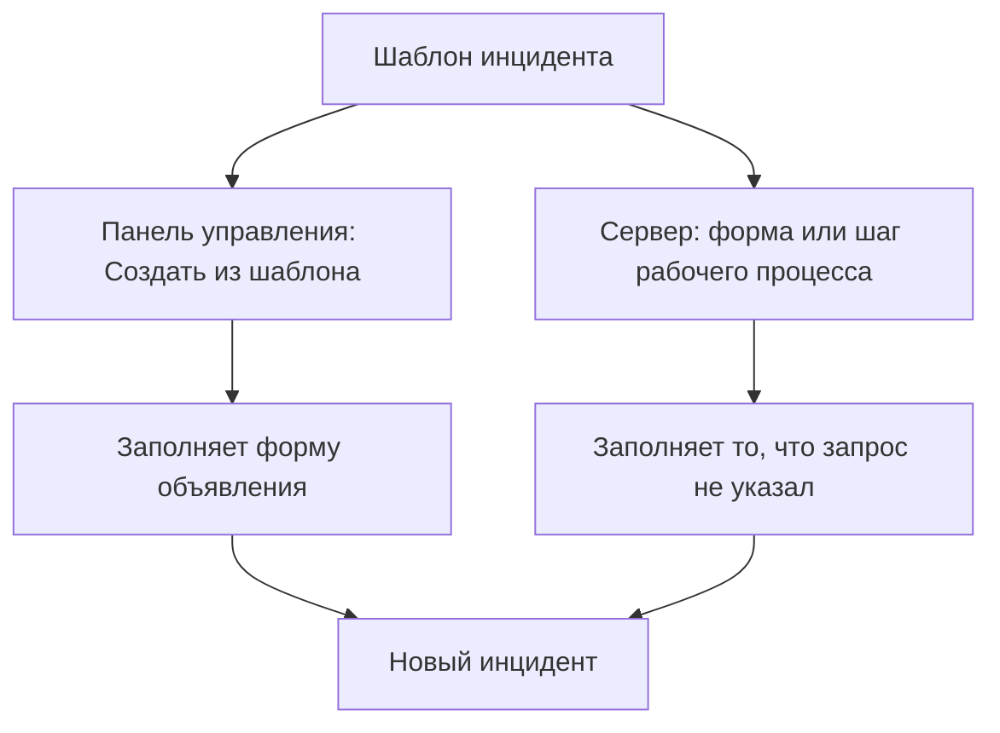
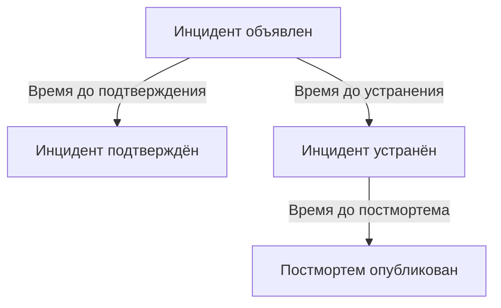

# Настройки и автоматизация инцидентов

Конфигурация инцидентов находится внутри **Инциденты**, а не в **Настройки проекта**: состояния и уровни серьёзности, шаблоны, пользовательские поля, роли, измерения и префиксы номеров, а также правила, которые действуют на каждый новый инцидент. Эта страница — справочник по каждой из этих страниц и по тому, что запускается само в момент объявления инцидента.

:::cards
- [Шаблоны инцидентов](#шаблоны-инцидентов): Объявляйте однотипные инциденты, каждый раз заполненные заранее.
- [Пользовательские поля](#пользовательские-поля): Ваши собственные поля в каждом инциденте, которые запрашиваются при его объявлении.
- [Измерения](#измерения): Время до подтверждения, устранения или смягчения, вычисленное для каждого инцидента.
- [Правила](#правила-которые-срабатывают-при-создании-инцидента): Владельцы, метки, вызовы дежурных и эпизоды, назначаемые автоматически.
:::

## Где находятся настройки инцидентов

Откройте **Инциденты** из меню **Продукты** на верхней панели, затем разверните **Настройки** внизу его бокового меню. **Правила** и **Настройки** изначально свёрнуты, поэтому разверните их, прежде чем появятся страницы ниже. Всё здесь относится к проекту: шаблоны, роли, пользовательские поля и правила принадлежат одному проекту и применяются к каждому инциденту, объявленному в нём, по маршрутам, начинающимся с `/dashboard/{projectId}/incidents/settings/`.

| Страница                      | Что там делают                                                                                |
| ----------------------------- | --------------------------------------------------------------------------------------------- |
| **Состояние инцидента**       | Добавляют, переименовывают, перекрашивают и упорядочивают состояния, через которые проходит инцидент. |
| **Серьёзность инцидента**     | Добавляют, переименовывают, перекрашивают и упорядочивают уровни серьёзности.                 |
| **Шаблоны инцидентов**        | Заранее заполняют целый инцидент — заголовок, описание, ресурсы, политики дежурства, владельцев, метки. |
| **Шаблоны заметок**           | Многоразовый текст для публичных и приватных заметок.                                         |
| **Шаблоны постмортема**       | Многоразовые структуры постмортемов.                                                          |
| **Пользовательские поля**     | Определяют дополнительные поля, которые появляются в каждом инциденте.                        |
| **Роли инцидента**            | Определяют роли, на которые назначаются реагирующие, например Руководитель инцидента.         |
| **Измерения**                 | Засекают, сколько времени занимают события, например время до подтверждения или до устранения, в каждом инциденте. |
| **Связанные оповещения**      | Выбирают, подтверждаются и устраняются ли связанные с инцидентом оповещения вместе с ним. В новых проектах включено и то и другое. |
| **Префикс номера**            | Текст перед номерами инцидентов и эпизодов, например `INC-` в `INC-42`.                       |

То, что OneUptime AI делает самостоятельно, настраивается не здесь: у него собственный раздел, **Инциденты → ИИ**, по маршрутам, начинающимся с `/dashboard/{projectId}/incidents/ai/`. Его страница **Настройки** включает и выключает расследование новых инцидентов, их автоматическое исправление (выключено, пока вы его не включите) вместе с pull request-ами исправлений и недостающей телеметрии, которые входят в исправление и сгруппированы под ним, и подготовку черновиков постмортемов; каждый переключатель сохраняется, как только вы его переключите. Правила расследования и правила автоисправления, которые сужают круг расследуемых и исправляемых инцидентов, а также необязательные ограничения, в которых работает ИИ, свёрнуты в **Дополнительные настройки**, и ничто из этого не действует, пока вы это не зададите. Рядом находятся **Аналитика** и **Журналы**: что ИИ узнал из ваших инцидентов и всё, что он сделал. См. [AI SRE](/docs/ai/ai-sre).

**Состояние инцидента** и **Серьёзность инцидента** подробно описаны в [Состояния и уровни серьёзности инцидентов](/docs/incidents/states-and-severities) — остальная часть этой страницы начинается с **Шаблоны инцидентов**. Формы, через которые люди вне вашей команды сообщают об инцидентах, — это отдельный продукт: см. [Формы](/docs/forms/index). Инструменты, которые открывают инциденты сами, например [Huntress](/docs/integrations/huntress), настраиваются в **Инциденты → Интеграции**.

Разверните **Правила**, и вы получите ещё восемь страниц: **Правила группировки**, **Правила дежурства**, **Правила владельца**, **Правила runbook-ов**, **Правила конфиденциальности**, **Правила меток**, **Правила SLA** и **Reminder Rules**. Они описаны ниже.

## Шаблоны инцидентов

Шаблон инцидента — это сохранённый каркас инцидента. Вместо того чтобы каждый раз, когда платёжный кластер даёт сбой, заново набирать тот же заголовок, тот же список мониторов и ту же политику дежурства, вы сохраняете его один раз и объявляете инциденты из него.

:::steps
1. Перейдите в **Инциденты → Настройки → Шаблоны инцидентов** (`/dashboard/{projectId}/incidents/settings/templates`). Карточка называется **Шаблоны инцидентов**.
2. Нажмите **Создать: Инцидент Шаблон**. Назовите шаблон на шаге **Информация о шаблоне**, затем заполните инцидент, который он объявляет, на шаге **Сведения об инциденте**: **Заголовок**, **Серьёзность инцидента** и **Описание**.
3. Пройдите необязательные шаги кнопкой **Далее** — затрагиваемые ресурсы, пользовательские поля и политики дежурства, — заполняя то, что общее у всех инцидентов этого вида.
4. Нажмите **Создать: Инцидент Шаблон** на последнем шаге. С этого момента шаблон предлагается кнопкой **Создать из шаблона** в списке инцидентов.
:::

Создание шаблона проводит вас через мастер из четырёх шагов и ещё двух, если в проекте есть пользовательские поля инцидентов. Только первые два спрашивают то, на что нужно ответить: **Далее** проходит необязательные шаги после них, а **Создать: Инцидент Шаблон** находится на последнем шаге.

- **Информация о шаблоне** — **Название шаблона** и **Описание шаблона**. Они называют сам шаблон и никогда не появляются в инциденте.
- **Сведения об инциденте** — **Заголовок**, **Описание** (Markdown) и **Серьёзность инцидента**. В **Дополнительные поля**, свёрнутый заголовок которого называет три поля и показывает каждое заданное:
  - **Начальное состояние инцидента** — состояние, в котором начинаются инциденты, объявленные из шаблона. Изначально оно пустое, как в форме объявления, а его варианты перечислены в порядке состояний. Если оставить его пустым, как говорит подсказка, инциденты начинаются в обычном начальном состоянии: в состоянии создания проекта, в котором начинается каждый новый инцидент. Шаблон, сохранённый с состоянием, его сохраняет.
  - **Владельцы** — люди и команды, владеющие инцидентами, объявленными из шаблона. **Добавить владельца** открывает один список и тех и других — тот же, что на странице инцидента **Владельцы**; каждый выбор показывается меткой, которую можно убрать. У существующего шаблона они показаны на карточке **Владельцы**.
  - **Метки** — метки, с которыми начинаются инциденты, объявленные из шаблона.
- **Затронутые ресурсы** — как в форме объявления: **Мониторы**, затем **Изменить статус монитора на**, затем **Другие затронутые ресурсы** для хостов, кластеров и сервисов, а **Ограничить этими страницами состояния** — в **Дополнительные поля**. Шаблон всегда спрашивает **Изменить статус монитора на**, выбраны мониторы или нет: этот статус применяется и к мониторам, выбранным при объявлении инцидента из шаблона, где форма объявления показывает его, как только выбран первый монитор. Карточка **Затронутые ресурсы** существующего шаблона спрашивает так же и показывает статус, который выбирает шаблон, или **Мониторы сохраняют свой статус.**, если он его не выбирает. **Ограничить этими страницами состояния** ограничивает инциденты, объявленные из шаблона, частью страниц статуса, на которых показаны их мониторы, — шаблон `Region East outage` может включать страницы восточных площадок. У существующего шаблона это показано на карточке **Охват страниц состояния** с кнопкой **Изменить охват страниц состояния**. См. [Отдельная страница статуса для каждой аудитории](/docs/status-pages/one-status-page-per-audience).
- **Пользовательские поля** — только когда в проекте есть пользовательские поля инцидентов: значения, с которыми начинаются инциденты, объявленные из этого шаблона. Здесь предлагается каждое поле, а не только те, что спрашивает шаг **Подробности**, и ни одно не обязательно. У существующего шаблона есть карточка **Пользовательские поля**, чтобы их изменить.
- **Пользовательские поля при создании** — тоже только когда в проекте есть пользовательские поля инцидентов: какие из них шаг **Подробности** спрашивает при объявлении инцидента из этого шаблона и какие нужно заполнить обязательно. У существующего шаблона есть карточка **Пользовательские поля при создании**, чтобы их изменить. См. [Пользовательские поля при создании](#пользовательские-поля-при-создании).
- **Дежурство** — **Политика дежурства**, политики, которые выполняются при объявлении инцидента, созданного из этого шаблона.

Несколько коротких правил:

- Список шаблонов показывает только **Имя** и **Описание**. Строки нельзя редактировать или удалять из списка — откройте шаблон (`/dashboard/{projectId}/incidents/settings/templates/{modelId}`), чтобы его изменить.
- Каждый, кто может редактировать шаблон, может менять его сведения и затронутые ресурсы, включая **Начальное состояние инцидента** и **Изменить статус монитора на**: Project Owners, Project Admins и Project Members, Incident Admins и Incident Members, а также роль с **Edit Incident Template**.
- Шаблоны поддерживают импорт и экспорт в JSON, поэтому их можно переносить между проектами.
- Когда шаблонов нет, список сообщает **Шаблоны инцидентов не найдены**, а прямо под этим — **Создать: Инцидент Шаблон**.
- Когда шаблонов нет, **Создать из шаблона** в списке инцидентов тоже открывает диалог **No Incident Templates**, который говорит, где создаются шаблоны, а его кнопка **Create Template** открывает **Инциденты → Настройки → Шаблоны инцидентов**.

### Как применяется шаблон

Есть два пути, и объединяют они одинаково.



- **В панели управления** — кнопка **Создать из шаблона** в списке инцидентов открывает выбор **Выберите шаблон инцидента**, а страница объявления читает шаблон из параметра строки запроса `incidentTemplateId` и заполняет форму шаблоном вместе с его командами-владельцами и пользователями-владельцами. Её шаг **Подробности** следует [пользовательским полям при создании](#пользовательские-поля-при-создании) шаблона. Владельцы становятся владельцами инцидента без уведомления, как только появляются каналы инцидента в Slack и Microsoft Teams, поэтому правило уведомлений, приглашающее владельцев инцидента в новый канал, приглашает и их.
- **На сервере** — [форма](/docs/forms/on-submit#the-incident-template), у которой задан **Инцидент Шаблон**, и шаг рабочего процесса **Create One Incident** с выбранным **Incident Template** объявляют инцидент из шаблона на сервере. Шаг читает шаблон как Project Admin проекта рабочего процесса, поэтому шаблон из другого проекта или удалённый шаблон отклоняется, а на тарифе без шаблонов инцидентов шаг отклоняется с указанием нужного тарифа. Владельцы шаблона становятся владельцами инцидента, как и в панели управления. См. [Компоненты рабочего процесса](/docs/workflows/components).

Инцидент, объявленный на сервере, записывает шаблон в `createdIncidentTemplateId`. Этот столбец заполняет только OneUptime — для формы или шага рабочего процесса, которые указывают шаблон: ключ API или вошедший пользователь этого сделать не могут, и запрос, отправляющий `createdIncidentTemplateId`, отклоняется. Чтобы объявить инцидент из шаблона через API, прочитайте его из `/api/incident-templates` и отправьте его значения в запросе.

> [!IMPORTANT]
> Главное — правило объединения: **шаблон заполняет только поле, которое вы оставили неопределённым**. Заголовок, описание, серьёзность инцидента, начальное состояние инцидента, статус монитора за **Изменить статус монитора на**, мониторы, хосты, кластеры Kubernetes, хосты Docker, хосты Podman, сервисы, политики дежурства, метки и страницы статуса копируются из шаблона, только если вызывающий или форма ничего не передали. Всё, что вы задали явно, всегда побеждает, в том числе состояние: инцидент, в котором указано состояние, начинается в нём и всё остальное по-прежнему берёт из шаблона, как в панели управления. Значения пользовательских полей объединяются по одному полю: шаблон заполняет поля, без которых был объявлен инцидент, а заданное вами значение — включая `0`, `false` и `null` — побеждает значение шаблона.

### Пользовательские поля при создании

Что спрашивает шаг **Подробности** при объявлении инцидента, решают настройки проекта: **Показывать при создании** запрашивает поле, а **Обязательно при создании** делает его обязательным. Шаблон может изменить и то и другое для инцидентов, объявленных из него. Его карточка **Пользовательские поля при создании** — и одноимённый шаг мастера — перечисляет все пользовательские поля инцидентов в их **Порядок**, с одной настройкой для каждого:

| Настройка          | Когда инцидент объявляется из этого шаблона                                                                                         |
| ------------------ | ----------------------------------------------------------------------------------------------------------------------------------- |
| **По умолчанию**   | Поле следует собственным **Показывать при создании** и **Обязательно при создании**. Вариант говорит, чему именно, например **По умолчанию (обязательно)**. |
| **Обязательно**    | Шаг **Подробности** спрашивает поле, и его нужно заполнить. Поле «да/нет» должно быть включено.                                     |
| **Необязательно**  | Шаг спрашивает поле, и его можно оставить пустым — даже если проект требует его.                                                    |
| **Скрыто**         | Шаг не спрашивает поле, даже если проект его показывает или требует. Собственное значение шаблона для него всё равно применяется.    |

На карточке поле, которому шаблон задаёт **Обязательно**, **Необязательно** или **Скрыто**, также показывает под своим типом, что с ним делает проект: **По умолчанию в проекте: обязательно**, **По умолчанию в проекте: необязательно** или **По умолчанию в проекте: не показывается**. Это видит каждый, кто может видеть шаблон.

Используйте это, когда инцидентам одного шаблона нужен ответ, который не нужен другим, — скажем, уровень клиента в шаблоне `Customer data exposure`, — или чтобы убрать вопрос, который проект задаёт везде, из шаблона, где он неуместен.

- **Хранятся по переменной шаблона.** Каждая настройка хранится под **Переменная шаблона** поля, которая никогда не меняется, поэтому переименование поля сохраняет его настройку. Поле, которое удалили и создали заново с тем же именем, получает свою настройку обратно — в отличие от вопросов формы, которые указывают поле по его ID, поэтому поле, удалённое и созданное заново, не спрашивается, пока его не добавят снова.
- **Редактировать и Сохранить читают их заново.** **Редактировать** на карточке заново читает поля и настройки шаблона, показывая тем временем индикатор загрузки в диалоге, а **Сохранить** читает их ещё раз и записывает только поля, которые вы в нём изменили. Поэтому изменение, которое другой администратор тем временем внёс в другие поля, сохраняется — включая настройку, которую он задал полю, созданному, пока ваш диалог был открыт, — а ваше изменение поля, удалённого тем временем, не записывается. Затем карточка перечисляет поля такими, какие они есть. Если их не удаётся прочитать, когда вы нажимаете **Редактировать**, диалог объясняет почему и предлагает **Повторить попытку** вместо **Сохранить**; когда вы нажимаете **Сохранить**, он объясняет почему, ничего не сохраняет и оставляет ваш выбор.
- **Их применяет только панель управления.** Как и **Обязательно при создании**, эти настройки определяют форму **Объявить инцидент** и ничего больше. Инциденты, объявленные через API, рабочим процессом, монитором, из Slack, Microsoft Teams или ИИ, им не подчиняются, а [формы](/docs/forms/building) задают собственные вопросы. См. [Обязательно при создании проверяет только панель управления](#обязательно-при-создании-проверяет-только-панель-управления).
- **Поле, скопированное из пользовательского поля монитора,** по-прежнему не спрашивается, когда у инцидента есть монитор, что бы ни говорил шаблон.
- **Изменить их может каждый, кто может редактировать шаблоны инцидентов**, — включая Project Members и Incident Members, — даже для поля, которое Project Admin сделал **Обязательно при создании** для всего проекта. Для самих настроек всего проекта нужен Project Owner, Project Admin или разрешение **Edit Incident Custom Field**.
- **Они переносятся вместе с шаблоном.** Экспорт шаблона в JSON включает их, а в проекте, куда вы его импортируете, они применяются к полям с той же **Переменная шаблона**.

Через API это `customFieldSettings` шаблона: объект, ключами которого служит **Переменная шаблона** каждого поля, со значением `Required`, `Optional`, `Hidden` или `Default` для каждого поля.

```json title="customFieldSettings"
{
  "customFieldSettings": {
    "impact": "Required",
    "affected_location": "Optional",
    "additional_information": "Hidden"
  }
}
```

Поле, которого нет в списке, следует собственным настройкам, как с `Default`. Запрос отклоняется с ошибкой `400`, если ключ не является допустимой **Переменная шаблона** — строчные буквы, цифры и подчёркивания — или значение не входит в эти четыре. Ключ, который не совпадает ни с одним полем, сохраняется и игнорируется.

## Шаблоны заметок

Шаблоны заметок дают реагирующим готовый текст для обновлений по инциденту, чтобы обновление страницы статуса в 3 часа ночи не писал с нуля полусонный человек.

:::steps
1. Перейдите в **Инциденты → Настройки → Шаблоны заметок** (`/dashboard/{projectId}/incidents/settings/note-templates`). Карточка называется **Шаблоны публичных или приватных заметок для инцидентов** — одна библиотека обслуживает оба вида заметок.
2. Нажмите **Создать: Инцидент Заметка Шаблон** и заполните единственную страницу формы: **Название шаблона** и **Описание шаблона**, оба обязательны, затем саму **Заметка** в Markdown, тоже обязательную: текст, с которого начинается заметка, когда выбран шаблон.
3. Сохраните его. Шаблон предлагается меню **Шаблоны** на обеих страницах заметок и полем **Выберите шаблон заметки** в диалогах **Подтвердить инцидент** и **Устранить инцидент**.
:::

Как и у шаблонов инцидентов, строки создаются и просматриваются, а не редактируются прямо в списке; откройте шаблон, чтобы его изменить.

**Переменные.** Шаблон заметки может содержать переменные, которые заполняются значениями инцидента, когда шаблон выбран, поэтому автор видит — и ещё может изменить — готовый текст до публикации:

| Переменная                          | Чем заполняется                                                    |
| ----------------------------------- | ------------------------------------------------------------------ |
| `{{incident.title}}`                | Заголовок инцидента.                                               |
| `{{incident.number}}`               | Его номер, например `INC-42` или `#42`.                            |
| `{{incident.severity}}`             | Его уровень серьёзности.                                           |
| `{{incident.state}}`                | Его текущее состояние.                                             |
| `{{incident.startedAt}}`            | Когда он был объявлен, в часовом поясе автора, с названием пояса.  |
| `{{incident.labels}}`               | Его метки через запятую.                                           |
| `{{incident.affectedStatusPages}}`  | Страницы статуса, на которых он показан и которые он уведомляет и которые видит автор. |
| `{{incident.customFields.<key>}}`   | Значение пользовательского поля по его **Переменная шаблона**, которую редактор **Заметка** перечисляет в **Переменные шаблона** под именем поля. |

Раньше пользовательские поля записывались как `{{customFields.<key>}}`; шаблоны, которые всё ещё используют эту запись, заполняются так же. Переменная без значения или не из списка остаётся ровно в том виде, в каком написана, чтобы её заполнил автор. Значения подставляются как текст: заголовок инцидента не может превратиться в опубликованной заметке в изображение, HTML или ссылку, текст которой скрывает, куда она ведёт, хотя адрес в нём по-прежнему показывается как ссылка на этот адрес. Пользовательское поле **Форматированный текст (Markdown)** подставляется как есть, в виде Markdown.

> [!IMPORTANT]
> Переменные пользовательских полей, меток и страниц статуса подставляют собственные записи вашей команды — каждое пользовательское поле, отмечено оно **Включать в уведомления подписчикам** или нет, — а одна и та же библиотека обслуживает и публичные заметки, которые показываются на страницах статуса инцидента и рассылаются их подписчикам. Прочитайте заполненный текст, прежде чем публиковать публичную заметку.

**Как вставить переменную.** Набирать имя переменной никогда не нужно. Редактор **Заметка** предлагает переменные тремя способами, и каждый вставляет переменную там, где стоит курсор:

- **Переменные шаблона**, свёрнутый блок под редактором: откройте его, чтобы увидеть каждую переменную с тем, чем она заполняется, — пользовательские поля инцидентов проекта по имени, — и нажмите на нужную.
- **Вставить переменную** в конце панели инструментов редактора: тот же список с полем поиска.
- Ввод `{{` в заметке открывает список под курсором. Продолжайте вводить, чтобы сузить его, выберите стрелками и нажмите Enter или Tab, чтобы вставить переменную; Escape закрывает список.

Тот же список, кнопка и `{{` есть и в других шаблонах с переменными: в заметках-напоминаниях правила SLA, в шаблонах заголовка и описания эпизода правила группировки инцидентов или оповещений, в описании и заметках об исправлении инцидента и оповещения в правиле монитора, в шаблонах правила скорости расхода бюджета SLO и в собственных шаблонах уведомлений подписчикам страницы статуса.

Шаблоны заметок появляются там, где они действительно нужны: диалоги подтверждения **Подтвердить инцидент** и **Устранить инцидент** оба предлагают **Выберите шаблон заметки** над полем **Публичная заметка**, свёрнутым под **Добавить публичную заметку**. Чем различаются публичные и приватные заметки, см. в [Заметки, владельцы и лента инцидента](/docs/incidents/notes-owners-and-feed).

## Шаблоны постмортема

Шаблон постмортема — это каркас отчёта, который вы пишете после инцидента, — ваши заголовки, подсказки, постоянные вопросы, — чтобы каждый разбор в проекте имел одну и ту же форму.

:::steps
1. Перейдите в **Инциденты → Настройки → Шаблоны постмортема** (`/dashboard/{projectId}/incidents/settings/postmortem-templates`). Карточка называется **Шаблоны постмортема**.
2. Нажмите **Создать: Инцидент Postmortem Шаблон** и заполните единственную страницу формы: **Название шаблона** и **Описание шаблона**, оба обязательны, затем **Шаблон разбора инцидента**, сам текст в Markdown, тоже обязательный.
3. Сохраните его. Теперь страница **Постмортем** каждого инцидента предлагает **Применить шаблон**.
:::

Шаблон применяется из инцидента, а не из настроек. Откройте инцидент, выберите **Постмортем** в его боковом меню (`/dashboard/{projectId}/incidents/{incidentId}/postmortem`) и используйте **Применить шаблон**. Откроется диалог **Применить шаблон ретроспективы** с раскрывающимся списком **Выберите шаблон**; выбор шаблона загружает его текст в редактор **Заметка разбора инцидента**, где вы правите его перед сохранением. У эпизодов инцидентов есть такая же страница **Постмортем**, и они пользуются той же библиотекой шаблонов. **Применить шаблон** показывается, только когда в проекте есть шаблон постмортема; если он один, он уже выбран. Редактор открывается на постмортеме инцидента в его текущем виде, с шаблоном в качестве заметки, поэтому то, опубликован ли он на странице статуса, когда он был опубликован и его вложения остаются прежними.

## Пользовательские поля

Пользовательские поля позволяют хранить в каждом инциденте собственные метаданные — имя внутреннего сервиса, ссылку на заявку на изменение, уровень клиента — и задавать одни и те же вопросы при каждом объявлении инцидента, например о его влиянии и о том, когда его ожидают устранить.

:::steps
1. Перейдите в **Инциденты → Настройки → Пользовательские поля** (`/dashboard/{projectId}/incidents/settings/custom-fields`). Страница называется **Пользовательские поля инцидента** и перечисляет поля в их **Порядок**, каждое только по **Имя поля** и **Тип поля**.
2. Нажмите **Создать: Инцидент Пользовательский Поле** и заполните **Имя поля**, **Описание поля** и **Тип поля** — а для типа раскрывающегося списка ещё и его варианты, прямо под типом.
3. Чтобы поле запрашивалось при каждом объявлении инцидента, откройте **Дополнительные поля** и включите **Показывать при создании**, а также **Обязательно при создании**, если на него нужно обязательно ответить.
4. Сохраните его, затем перетащите строку за маркер туда, где должно стоять поле. **Редактировать** в строке поля открывает остальные его настройки.
:::

Создание поля спрашивает его **Имя поля**, **Описание поля** и **Тип поля** на одной странице — а для типа раскрывающегося списка и его варианты, прямо под типом. Значения нового поля вводятся вручную. Всё остальное находится в **Дополнительные поля**, которые изначально свёрнуты и при создании, и при редактировании поля; в свёрнутом виде заголовок называет то, что внутри, и показывает заданное. Чтобы вместо этого создать поле, копирующее значение из пользовательского поля монитора, откройте меню **Ещё** (**⋯**) рядом с **Создать: Инцидент Пользовательский Поле** и выберите **Создать связанное пользовательское поле** — см. [Поля, скопированные из монитора](#поля-скопированные-из-монитора).

У каждого определения есть:

- **Имя поля** — обязательно, не короче двух символов. Подсказка предлагает имя в стиле slug, например `internal-service`.
- **Описание поля** — необязательно.
- **Тип поля** — обязательно. Определяет, как вводятся данные; типы перечислены ниже. Для типов раскрывающегося списка нужно также перечислить варианты.
- **Параметры раскрывающегося списка** — значения, которые появляются в раскрывающемся списке, каждое с необязательным цветом: маленькая кнопка рядом с вариантом показывает его цвет и открывает те же именованные цвета, что и любое другое поле цвета, с **Без цвета** первым и **Свой цвет** для точного кода. Перетащите вариант за маркер в начале его строки, чтобы изменить его место в списке. Варианты можно добавлять, переименовывать и убирать и после того, как у инцидентов появились значения; см. [Изменение вариантов раскрывающегося списка](#изменение-вариантов-раскрывающегося-списка).
- **Порядок** — где поле стоит среди пользовательских полей инцидента: на странице инцидента **Пользовательские поля**, в шаге **Подробности** и в сообщениях подписчикам. Число вводить не нужно: перетащите поле за маркер в начале его строки, чтобы переместить его выше или ниже, а новое поле добавляется в конец. Перетаскивание отключено, пока фильтр или поиск сужает список.
- **Показывать при создании** — в **Дополнительные поля**. Запрашивает поле на шаге **Подробности**, когда инцидент объявляется из панели управления (см. [Объявление инцидента](/docs/incidents/declaring-incidents)). Шаблон инцидента может задать любому полю начальное значение, показывается оно при создании или нет, и может запросить поле или опустить его для инцидентов, объявленных из него, — см. [Пользовательские поля при создании](#пользовательские-поля-при-создании). [Формы](/docs/forms/building#custom-fields) этому не следуют: форма спрашивает только добавленные в неё поля.
- **Обязательно при создании** — в **Дополнительные поля**, предлагается, когда включено **Показывать при создании**. Шаг **Подробности** не даёт объявить инцидент, пока поле не заполнено, а поле **Логический** должно быть включено. Это проверяется только в панели управления; см. [Обязательно при создании проверяет только панель управления](#обязательно-при-создании-проверяет-только-панель-управления).
- **Включать в уведомления подписчикам** — в **Дополнительные поля**. Отправляет поле и его значение подписчикам страницы статуса вместе с сообщениями об инциденте: стандартными письмами, сообщениями Slack и Microsoft Teams и вебхуками, но не SMS. Подписчики обычно находятся вне вашей команды, поэтому включайте это только для полей, которыми безопасно делиться. См. [Подписчики и объявления](/docs/status-pages/subscribers#инциденты).
- **Переменная шаблона** — ключ, по которому шаблон обращается к полю, `{{incident.customFields.<key>}}`, в шаблонах заметок и собственных шаблонах уведомлений подписчикам. Он создаётся из имени поля при создании поля — строчные буквы, цифры и подчёркивания, поэтому `Expected Resolution` становится `expected_resolution`, с добавлением `_2`, `_3` и так далее, если такой ключ уже есть у другого поля, — и не меняется при переименовании поля. Никто не задаёт его вручную: API игнорирует отправленное для него значение. Шаблоны, написанные со старой записью `{{customFields.<key>}}`, продолжают работать. Искать его никогда не нужно: редакторы, которые его подставляют, — **Заметка** шаблона заметки и собственные шаблоны уведомлений подписчикам страницы статуса для событий инцидентов — перечисляют переменную каждого поля в **Переменные шаблона** под именем поля. Форма **Редактировать** поля тоже показывает её, только для чтения, внизу **Дополнительные поля**, с кнопкой копирования.

**Порядок**, **Показывать при создании**, **Обязательно при создании**, **Включать в уведомления подписчикам** и **Переменная шаблона** есть только у пользовательских полей инцидентов. У пользовательских полей мониторов, оповещений, событий планового обслуживания и других ресурсов их нет.

Определения хранятся в собственной модели; значения хранятся в самом инциденте, в столбце `customFields`. В отдельном инциденте их заполняют на странице **Пользовательские поля** бокового меню инцидента (`/dashboard/{projectId}/incidents/{incidentId}/custom-fields`), где поля перечислены в их **Порядок**. Шаблоны инцидентов хранят значения тех же полей в собственном `customFields`.

**Один пробел, о котором стоит знать.** Определения пользовательских полей инцидентов — единственная часть семейства инцидентов без триггеров рабочих процессов, — см. раздел о рабочих процессах ниже.

### Типы полей

| Тип поля                                        | Как вводится                                          | Подходит для                                       |
| ----------------------------------------------- | ----------------------------------------------------- | -------------------------------------------------- |
| **Текст**                                       | Одна строка текста                                    | Ссылка на заявку на изменение, имя внутреннего сервиса |
| **Число**                                       | Число                                                 | Оценка длительности в минутах, число затронутых пользователей |
| **Логический**                                  | Переключатель «да/нет»                                | Подтверждение, «затрагивает клиентов»              |
| **Выпадающий список (один вариант)**            | Один вариант из списка                                | Влияние, регион                                    |
| **Выпадающий список (несколько вариантов)**     | Несколько вариантов из списка                         | Затронутые системы                                 |
| **Дата**                                        | Дата                                                  | Дата продления договора                            |
| **Дата и время**                                | Дата и время суток                                    | Ожидаемое устранение                               |
| **Длинный текст**                               | Несколько строк простого текста                       | Затронутые пользователи или системы, дополнительная информация |
| **Форматированный текст (Markdown)**            | Форматированный текст в редакторе Markdown с его визуальным режимом | Обходное решение со ссылками и списками |

**Длинный текст** и **Форматированный текст (Markdown)** доступны для пользовательских полей любого ресурса, а не только инцидентов. Значение форматированного текста хранится в том Markdown, в котором оно было написано. Типа с переключателями или группой флажков нет: используйте **Выпадающий список (один вариант)**, **Выпадающий список (несколько вариантов)** или **Логический**.

### Обязательно при создании проверяет только панель управления

**Обязательно при создании** удерживает форму **Объявить инцидент** и ничего больше. Инциденты, которые открывает монитор, API, Slack, Microsoft Teams или ИИ, не могут заполнить форму, поэтому создаются с пустым полем. Когда инцидент уже существует, каждое поле на его странице **Пользовательские поля** остаётся необязательным, поэтому от реагирующего, который исправляет одно значение посреди сбоя, никогда не требуют заполнить все остальные. Считайте это подсказкой для тех, кто объявляет инциденты, а не обещанием, что у каждого инцидента будет значение.

[Пользовательские поля при создании](#пользовательские-поля-при-создании) шаблона работают так же: они определяют форму **Объявить инцидент** и ничего больше. Исключение — [формы](/docs/forms/building#required-questions), потому что сервер проверяет вопросы формы **Обязательно** при её отправке.

### Поля, скопированные из монитора

Пользовательское поле может брать значение из пользовательского поля мониторов инцидента вместо того, чтобы его вводили вручную, — скажем, регион или уровень клиента, которые ваши мониторы уже хранят. Чтобы создать такое поле, откройте меню **Ещё** (**⋯**) рядом с **Создать: Инцидент Пользовательский Поле** и выберите **Создать связанное пользовательское поле**. Оно спрашивает три вещи:

- **Поле монитора** — пользовательское поле монитора, которое нужно копировать. Предлагается каждое, с типом под именем. Новое поле получает этот тип и варианты раскрывающегося списка, поэтому они всегда совпадают.
- **Имя поля** — изначально совпадает с именем поля монитора, пока вы не введёте другое.
- **Описание поля** — необязательно.

Значение заполняется, когда инцидент создаётся с монитором, и обновляется, когда меняется значение монитора. Когда у мониторов инцидента разные значения, поле с одним значением остаётся как есть, а поле с несколькими вариантами получает их все. Копирование никогда не стирает значение: инцидент без монитора сохраняет то, что в нём введено, а очистка значения монитора не трогает копии. Шаг **Подробности** не спрашивает скопированное поле, когда у инцидента есть монитор.

Чтобы значение существующего поля копировалось из монитора, чтобы изменить, какое поле монитора оно копирует, или чтобы вернуться к ручному вводу, откройте **Редактировать** в строке поля и используйте **Брать значение из** в **Дополнительные поля**. Пользовательские поля оповещений и планового обслуживания могут так же копировать значения из своих мониторов.

### Значения пользовательских полей через API

В `POST /api/incident` и при обновлениях инцидента `customFields` — это объект, ключами которого служит **Имя поля** каждого поля:

```json title="customFields"
{
  "customFields": {
    "Impact": "Major",
    "Estimated Duration": 90,
    "Acknowledgement": true,
    "Expected Resolution": "2026-10-01T14:30:00.000Z"
  }
}
```

Когда пользователь или ключ API создаёт или обновляет инцидент, каждое значение, которое запрос задаёт или меняет, должно подходить своему полю, иначе запрос отклоняется с ошибкой `400`, которая называет поле и отправленное значение:

| Тип поля                                                               | Что принимает                                                  |
| ---------------------------------------------------------------------- | -------------------------------------------------------------- |
| **Текст**, **Длинный текст**, **Форматированный текст (Markdown)**     | Текст. Число, `true` или `false` сохраняются в том виде, в каком отправлены. |
| **Число**                                                              | Число или текст, который является числом, например `"42"`.     |
| **Логический**                                                         | `true` или `false` либо текст `"true"` или `"false"`.          |
| **Дата**, **Дата и время**                                             | Дату, желательно в виде текста ISO 8601.                       |
| **Выпадающий список (один вариант)**                                   | Один из его вариантов.                                         |
| **Выпадающий список (несколько вариантов)**                            | Список его вариантов или один вариант сам по себе.             |

Для **Выпадающий список (несколько вариантов)** отказ называет первые 10 записей, которых нет среди его вариантов, а затем — сколько их ещё.

Что не проверяется, чтобы существующие интеграции продолжали работать:

- **Значения, которые запрос оставляет как есть.** Карточка **Пользовательские поля** отправляет обратно все значения, когда вы сохраняете одно из них, поэтому значение, сохранённое до появления этих проверок, или вариант списка, удалённый с тех пор, никогда не мешают сохранить остальные. Поле с несколькими вариантами сохраняет записи, которые у него уже были.
- **Ключи, которые не являются именем пользовательского поля инцидента**, например `jiraIssueKey`, который записывает [интеграция с Jira](/docs/integrations/jira).
- **Пустые значения.** `null` или пустая строка очищают поле.
- **Значения, скопированные из пользовательского поля монитора**, и записи, которые делает сам OneUptime.
- **Обязательно при создании.** API никогда не требует поле.

Инцидент, который форма или шаг рабочего процесса **Create One Incident** объявляет из шаблона (`createdIncidentTemplateId`), начинается со значений пользовательских полей шаблона, объединённых по одному полю под теми, что он отправляет (см. [Как применяется шаблон](#как-применяется-шаблон)). Ключ API не может объявлять из шаблона: запрос, отправляющий `createdIncidentTemplateId`, отклоняется.

### Переименование поля

Значения хранятся под именем поля, поэтому при переименовании поля их нужно перенести. Когда вы сохраняете новое **Имя поля**, OneUptime переносит значение поля под новое имя в каждом инциденте и каждом шаблоне инцидента проекта и обновляет сохранённые представления списка инцидентов, которые показывают поле или фильтруют по нему. Перенос не запускает рабочий процесс **On Update Incident** и не меняет время последнего обновления ни одного инцидента. **Переменная шаблона** поля остаётся прежней, поэтому шаблоны заметок, собственные шаблоны уведомлений подписчикам и интеграции с вебхуками, которые её используют, продолжают работать.

Отклоняются два переименования: в имя, которое уже есть у другого пользовательского поля инцидента (сравнение без учёта регистра), и запрос API, который переименовал бы несколько полей сразу. Рабочие процессы и клиенты API, которые читают или записывают значение по старому имени поля, нужно перевести на новое.

После переименования поле содержит только собственные значения. Удаление поля оставляет его значения в инцидентах, где они были, поэтому у инцидентов могут оставаться значения под новым именем от удалённого поля; переименование очищает их, чтобы не показывать их как ответы этого поля и не отправлять подписчикам. Все инциденты и шаблоны переносятся вместе: если перенос не удался, ни один из них не меняется, поле сохраняет старое имя, а сохранение сообщает об ошибке, поэтому можно просто повторить попытку. Поле, **созданное** с именем удалённого поля, — другое дело: оно показывает значения, оставленные тем полем, и отправляет их подписчикам, как только включено **Включать в уведомления подписчикам**.

Удаление поля оставляет вопросы, которые его запрашивают, в каждой [форме](/docs/forms/building#custom-fields) проекта, но их больше не задают: конструктор форм помечает каждый, чтобы вы его удалили. Поле, созданное заново с тем же именем, — это новое поле, и форма не спрашивает его, пока кто-нибудь его туда не добавит. Шаблоны инцидентов сохраняют для него свою настройку **Пользовательские поля при создании**.

### Изменение вариантов раскрывающегося списка

Варианты поля **Выпадающий список (один вариант)** или **Выпадающий список (несколько вариантов)** можно изменить в любой момент: откройте **Редактировать** в строке поля. Инцидент хранит текст выбранного для него варианта, поэтому то, что изменение делает с инцидентами, у которых есть вариант, зависит от изменения:

| Что вы делаете с вариантом                  | Что происходит с инцидентами, у которых он есть                                                                    |
| ------------------------------------------- | ------------------------------------------------------------------------------------------------------------------ |
| **Добавляете** вариант                      | Ничего. Он предлагается с этого момента.                                                                           |
| **Переименовываете** его (меняете текст)    | Они показывают новое имя. Под вариантом форма сообщает, у скольких инцидентов это произойдёт.                     |
| **Убираете** его (корзина рядом)            | Они его сохраняют, и он показывается как _больше не вариант_, если только вы не выберете для них другой вариант в **Больше не варианты**. |
| **Перетаскиваете** его за маркер            | Ничего. Меняется только порядок, в котором перечислены варианты.                                                   |

Когда форма открывается, она подсчитывает, у скольких инцидентов есть каждое значение. **Больше не варианты** перечисляет каждый убранный вами вариант, который ещё есть у какого-то инцидента, и каждое значение инцидентов, которое никогда не было вариантом (скажем, записанное через API), с числом инцидентов, у которых оно есть. Для каждого оставьте его как есть или выберите вариант, который вместо него должен быть у этих инцидентов. **Отменить** возвращает вариант, убранный по ошибке.

При сохранении переименованный вариант и значение, для которого вы выбрали вариант, переносятся: в каждом инциденте и шаблоне инцидента проекта, в сохранённых представлениях списка инцидентов, которые по нему фильтруют, и в ответах, которые дают для поля [шаблоны форм](/docs/forms/building). Как и при переименовании поля, перенос не запускает рабочий процесс **On Update Incident** и не меняет время последнего обновления ни одного инцидента; если он не удался, ничего не переносится, а поле сохраняет старые варианты. Рабочим процессам, клиентам API и конфигурациям Terraform, которые записывают вариант по старому тексту, нужен новый текст.

Инцидент, значение которого его поле больше не предлагает, показывает это значение с пометкой _больше не вариант_ на своей странице **Пользовательские поля** и в списке инцидентов. Редактирование других его полей значение сохраняет; чтобы его изменить, выберите другой вариант.

Пользовательские поля всех остальных ресурсов работают так же: мониторов, оповещений, событий планового обслуживания, страниц статуса, политик дежурства, команд, участников команд и элементов инвентаря. Переименование или добавление варианта поля монитора делает то же самое с полями инцидентов, оповещений и планового обслуживания, которые его копируют (см. [Поля, скопированные из монитора](#поля-скопированные-из-монитора)), поэтому они продолжают предлагать каждое копируемое значение.

Через API отправьте новый список как `dropdownOptions`, а переименования — в `miscDataProps`:

```json
{
  "data": { "dropdownOptions": "Facility Alpha\nFacility B" },
  "miscDataProps": {
    "renamedDropdownOptions": [{ "from": "Facility A", "to": "Facility Alpha" }]
  }
}
```

Каждое `to` должно быть одним из вариантов поля после сохранения, и каждое `from` можно переименовать только один раз. Без `renamedDropdownOptions` список меняется, а каждое сохранённое значение остаётся как есть — то же самое делает изменение `dropdown_options` в Terraform.

### Terraform

Эти настройки находятся в ресурсе `oneuptime_incident_custom_field` как `sort_order`, `show_on_create`, `is_required_on_create` и `include_in_subscriber_notifications`. `variable_key` доступен только для чтения: это ключ, который OneUptime создал при создании поля.

Если не указать `sort_order`, новое поле попадает в конец списка. Укажите число, которое уже есть у другого поля, и оно займёт это место, а поля на пути сдвинутся на одну позицию. Число, которого нет ни у одного другого поля, сохраняется в том виде, в каком вы его записали.

## Измерения

Измерение — это время между двумя моментами инцидента. **Время до подтверждения** — это время от объявления инцидента до того, как кто-то его подтвердит; **время до устранения** отсчитывается от объявления до устранения. Вы настраиваете измерение один раз, а OneUptime вычисляет его для каждого инцидента, включая прошлые, и строит по нему график, чтобы было видно, становится ли ваша команда быстрее.

Перейдите в **Инциденты → Настройки → Измерения** (`/dashboard/{projectId}/incidents/settings/measurements`) и выберите **Создать: Incident Measurement**. У каждого определения есть **имя**, **начальная точка** и **конечная точка**. Его постоянный **ключ** создаётся из имени по мере ввода — «Time to Detect» получает `time-to-detect`, — поэтому заполнять ничего не нужно. Чтобы выбрать собственный ключ, нажмите **Редактировать** рядом с ним до создания измерения.



У оповещений и событий планового обслуживания есть та же функция — в **Оповещения → Настройки → Измерения** и **Плановое обслуживание → Настройки → Измерения**. Всё ниже относится ко всем трём, каждое со своими моментами.

### Готовые измерения

Форма открывается на **Что вы хотите измерить?**. Выберите одно из этих измерений, и его имя, описание и оба момента будут заполнены: **Далее** показывает моменты, а измерение создаётся с этого последнего шага.

| Где                       | Измерение                              | Начинается, когда                                 | Заканчивается, когда                   |
| ------------------------- | -------------------------------------- | ------------------------------------------------- | -------------------------------------- |
| Инциденты                 | **Время до подтверждения**             | Инцидент объявлен                                 | Инцидент подтверждён                   |
| Инциденты                 | **Время до устранения**                | Инцидент объявлен                                 | Инцидент устранён                      |
| Инциденты                 | **Время до постмортема**               | Инцидент устранён                                 | Постмортем опубликован                 |
| Оповещения                | **Время до подтверждения**             | Оповещение создано                                | Оповещение подтверждено                |
| Оповещения                | **Время до устранения**                | Оповещение создано                                | Оповещение устранено                   |
| Плановое обслуживание     | **Задержка начала**                    | Обслуживание должно начаться по плану             | Обслуживание начинается                |
| Плановое обслуживание     | **Превышение срока**                   | Обслуживание должно закончиться по плану          | Обслуживание заканчивается             |
| Плановое обслуживание     | **Длительность обслуживания**          | Обслуживание начинается                           | Обслуживание заканчивается             |

Выберите **Другое**, чтобы выбрать оба момента самостоятельно. Введённое вами имя сохраняется, когда вы выбираете одно из этих измерений.

### Выбор двух моментов

На втором шаге, **Начало и конец**, есть **Начинается, когда** и **Заканчивается, когда**. Каждое перечисляет простыми словами моменты, в которые измерение может начаться или закончиться. Новое измерение начинается при объявлении инцидента, поэтому чаще всего вы выбираете только, где оно заканчивается.

| Момент                                            | Когда он наступает                                                           | Как хранится в API                                    |
| ------------------------------------------------- | ---------------------------------------------------------------------------- | ----------------------------------------------------- |
| **Инцидент объявлен**                             | Когда инцидент начался в OneUptime: когда он был создан, если только кто-то не указал более раннее время. | `Declared At` (`Timeline Start` — тот же момент)      |
| **Инцидент подтверждён**                          | Когда он достигает вашего подтверждённого состояния или любого состояния после него (устранение сразу с начала тоже считается). | `State Role Entered`, роль `Acknowledged`             |
| **Инцидент устранён**                             | Когда он достигает вашего устранённого состояния.                            | `State Role Entered`, роль `Resolved`                 |
| **Постмортем опубликован**                        | Когда опубликован постмортем инцидента.                                      | `Postmortem Posted At`                                |
| **Инцидент переходит в выбранное вами состояние** | Любое из ваших состояний инцидентов. Затем форма спрашивает, какое именно.   | `State Entered`, с состоянием                         |
| **Начинается влияние**                            | Когда клиенты впервые пострадали — см. ниже.                                 | `Impact Started At`                                   |
| **Инцидент переходит в своё первое состояние**    | Когда он достигает состояния, в котором начинаются новые инциденты, например Identified. | `State Role Entered`, роль `Created`                  |
| **Инцидент создан в OneUptime**                   | Обычно тот же момент, что и объявление.                                      | `Created At`                                          |

Оповещения начинаются с **Оповещение создано** и не имеют постмортема; плановое обслуживание добавляет **Обслуживание должно начаться по плану** и **Обслуживание должно закончиться по плану**, запланированное окно, рядом с **Обслуживание начинается**, **Обслуживание заканчивается** и **Обслуживание завершено**.

Достижение состояния **подтверждён** или **устранён** следует тому состоянию, которое играет эту роль, поэтому продолжает работать, если вы переименуете или замените состояние. **Выбранное вами состояние** привязано именно к этому состоянию.

### Дополнительные поля

Несколько параметров, которые большинству измерений никогда не нужно менять, свёрнуты в **Дополнительные поля** в конце шага **Начало и конец** и установлены в значения по умолчанию, которые использует и API. В свёрнутом виде заголовок называет их и показывает изменённые.

- **Если начало наступает несколько раз** и **Если конец наступает несколько раз** появляются для момента, который достигает состояния. Повторно открытый инцидент может снова достичь того же состояния. **Использовать первый раз** — значение по умолчанию, оно совпадает со встроенными замерами времени инцидентов; **Использовать последний раз** следует за повторно открытым инцидентом до его последнего прохода.
- **Показывать длительность в** — единица, которую используют графики измерения. По умолчанию — **Автоматически**: записываются секунды, которые графики показывают как секунды, минуты, часы или дни по мере роста чисел. **Минуты**, **Часы** или **Дни** держат график в одной единице. Каждая точка записывается в выбранной единице, а её изменение переписывает точки измерения в новой.
- **Сводка на графике** — то, как **Открыть график** обобщает множество инцидентов: по умолчанию **Среднее** или **Медиана**, 90-й, 95-й или 99-й процентиль, **Самая долгая** или **Самая короткая**.
- **Показывать на страницах инцидентов** помещает измерение в карточку **Измерения** на странице каждого инцидента (см. ниже). Включено по умолчанию; выключите для измерения, которое нужно только на графике. У оповещений и планового обслуживания это называется **Показывать на страницах оповещений** и **Показывать на страницах событий обслуживания**.

При редактировании измерения появляется переключатель **Включено**: выключите его, чтобы перестать измерять инциденты. Уже записанные числа сохраняются.

### Что сообщает измерение

| Статус             | Значение                                                                                  |
| ------------------ | ----------------------------------------------------------------------------------------- |
| **Recorded**       | Оба момента наступили. Длительность записана в инциденте и показана на графике.           |
| **Ожидание**       | Момент ещё не наступил, но ещё может — инцидент всё ещё открыт.                           |
| **Not Applicable** | Момент никогда не наступит — состояние было пропущено или время так и не записали.        |
| **Invalid**        | Оба момента наступили, но конец раньше начала. Записанные вами времена противоречат друг другу. |

Точками графика становятся только значения **Recorded**. Пропущенный момент ничего не записывает вместо нуля, поэтому не может сместить среднее к себе.

**Invalid** — статус, за которым стоит следить. Так измерение сообщает, что хронология, по которой оно вычислено, неверна, — например, конец на 17 минут раньше начала. Это намеренно заметнее, чем правдоподобное число, которое никто не ставит под сомнение.

### На странице каждого инцидента

Страница каждого инцидента показывает его собственные измерения в карточке **Измерения**, прямо под **Сведения об инциденте**, в порядке списка на этой странице настроек. Каждое говорит, что оно измеряет, — **Объявлен → Подтверждён**, — и что оно показывает для этого инцидента:

| Что показывает                          | Когда                                                                                                                            |
| --------------------------------------- | -------------------------------------------------------------------------------------------------------------------------------- |
| Длительность, например **4 мин.**       | Оба момента наступили (**Recorded**). Она указана в единице измерения: **Автоматически** выглядит как остальные замеры времени на странице, **1 ч. 5 мин.**, а **Часы** — как **1,5 ч.**. |
| **Идёт уже 12 мин.**                    | Отсчёт начался, а конец ещё не наступил. Пока страница открыта, значение растёт.                                                 |
| **Ещё не началось**                     | Начало ещё не наступило или это время ещё впереди, как запланированное начало события обслуживания.                              |
| **Не достигнуто**                       | Инцидент устранён, а момент, которого ждало измерение, так и не наступил, — инцидент устранили, не подтвердив.                   |
| **Не измерено**                         | Момент никогда не наступит (**Not Applicable**), с причиной, например пропущенное состояние.                                     |
| **Заканчивается раньше, чем начинается** | Записанные времена противоречат друг другу (**Invalid**), с указанием, насколько они расходятся.                                |
| **Ещё не вычислено**                    | OneUptime ещё не вычислил его для этого инцидента, как сразу после создания измерения.                                          |

Измерение, у которого вы меняете начало или конец, продолжает показывать в каждом инциденте старое значение, пока OneUptime не вычислит его заново, как и его график. Сразу после смены состояния из заголовка инцидента карточка показывает новые значения, как только OneUptime их вычислит, обычно сразу.

У оповещений и событий планового обслуживания на их страницах есть такая же карточка. Для события обслуживания **Не достигнуто** появляется после окончания события. Карточка не показывается, если ни у одного включённого измерения не включено **Показывать на страницах инцидентов**, и тем, кому нельзя читать измерения.

### Начало воздействия и почему оно пустое

**Начало воздействия** — поле инцидента и оповещения. По умолчанию оно пустое, и OneUptime никогда его не заполняет. Его записывает форма инцидента, которая спрашивает, когда началось воздействие (см. [Формы](/docs/forms/index)), или API. Пока оно не записано, у измерения, которое начинается или заканчивается на **Начинается влияние**, нет числа для этого инцидента.

В этом и смысл. `Declared At` фиксирует момент, когда OneUptime узнал о проблеме, а для инцидента от монитора это время обработки критериев, а не начала воздействия. Если бы «Time to Detect» по умолчанию начиналось с той же отметки времени, что и заканчивается, каждый инцидент показывал бы ноль, а график говорил бы «мы обнаруживаем мгновенно». Пустое поле и измерение **Not Applicable** говорят правду: никто не записал, когда это началось.

### Исправление неверной отметки времени

Каждое измерение вычисляется заново с нуля всякий раз, когда меняются данные под ним, — когда запись хронологии состояний создаётся, редактируется или удаляется или когда в инциденте исправляют `Impact Started At`, `Declared At` или `Postmortem Posted At`. Ничего не исправляется по частям, поэтому устаревших значений, которые нужно чинить, нет.

Поле **Начинается** в записи хронологии состояний можно редактировать. Если инцидент подтвердили в 09:12, а запись говорит 09:29, исправьте запись, и каждое измерение, выведенное из неё, сдвинется вместе с ней.

### Графики, API и Terraform

Выберите **Открыть график** у измерения, чтобы открыть его график в обозревателе метрик за последний месяц, обобщённый его способом. Каждое включённое измерение записывает метрику с именем `oneuptime.incident.measurement.<key>`, которую можно также добавить на любой дашборд. Оповещения используют `oneuptime.alert.measurement.<key>`, а плановое обслуживание — `oneuptime.scheduled-maintenance.measurement.<key>`. Столбец списка **Ключ**, скрытый по умолчанию, показывает ключ каждого измерения.

Определения — обычные ресурсы API, поэтому провайдер Terraform управляет ими как `oneuptime_incident_measurement`, `oneuptime_alert_measurement` и `oneuptime_scheduled_maintenance_measurement`. Вычисленные значения доступны только для чтения и представлены как источники данных. Если их не указать, параметры из **Дополнительные поля** принимают те же значения по умолчанию, что и в панели управления: `unit` — `seconds` (или `minutes`, `hours`, `days`), `aggregation_type` — `Avg` (или `P50`, `P90`, `P95`, `P99`, `Max`, `Min`), а `start_state_occurrence` и `end_state_occurrence` — `First` (или `Last`). `show_on_incident_view` (`show_on_alert_view`, `show_on_scheduled_maintenance_view`) — `true`.

**Ключ** постоянен, потому что входит в имя метрики, — его изменение оставило бы ряд без владельца. Переименовывайте измерение свободно; ключ останется.

Через API и в Terraform ключ тоже можно не указывать: он создаётся из имени с добавлением `-2`, `-3` и так далее, если такой ключ уже есть у другого измерения проекта. Отправленный вами ключ сохраняется в том виде, в каком вы его записали. Он должен состоять из строчных букв, цифр и дефисов, начинаться с буквы или цифры, быть не длиннее 50 символов, и ни у одного другого измерения проекта не должно быть такого же.

### Переход с другой платформы инцидентов

Если вы переходите с инструмента с декларативными определениями измерений, они переносятся напрямую:

| Их измерение            | Как настроить его здесь                                                                             |
| ----------------------- | --------------------------------------------------------------------------------------------------- |
| Time to Detect          | **Другое**: **Начинается влияние** → **Инцидент объявлен**                                          |
| Time to Acknowledge     | Готовое **Время до подтверждения**                                                                  |
| Time to Mitigate        | **Другое**: **Инцидент объявлен** → **Инцидент переходит в выбранное вами состояние**, состояние **Mitigated**, которое вы добавите между Подтверждён и Устранён |
| Time to Resolve         | Готовое **Время до устранения**                                                                     |

Для Time to Mitigate нужно состояние, которого нет по умолчанию. Добавьте его в **Инциденты → Настройки → Состояние инцидента** — новое состояние добавляется прямо над устранённым состоянием, и его можно перетащить в любое место между остальными.

> [!NOTE]
> **Одна вещь об истории.** Измерение, созданное сегодня, вычисляется в фоне и для прошлых инцидентов: значение в каждом инциденте и его точка на графике. Изменение того, где измерение начинается или заканчивается, или его единицы вычисляет его заново для каждого инцидента. Чтобы сохранить старые числа, создайте вместо этого новое измерение.

## Роли инцидента

Роли инцидента — это именованные обязанности, на которые вы назначаете людей во время реагирования. Определите их в **Инциденты → Настройки → Роли инцидента** (`/dashboard/{projectId}/incidents/settings/roles`). Таблица перечисляет имя и описание каждой роли.

Новый проект начинается с одной роли, **Руководитель инцидента**, — человека, который руководит реагированием. OneUptime назначает её за вас: когда вы объявляете инцидент из панели управления, никого не выбрав на эту роль, её Руководителем инцидента становитесь вы, а инцидент, у которого его всё ещё нет, получает первого, кто меняет его состояние, если только у этого человека уже нет в нём другой роли. Руководителя инцидента можно переименовать, но нельзя удалить, и эту роль всегда занимает один человек. Его **Удалить** заблокировано и объясняет почему.

Добавьте другие роли, которые использует ваша команда, например Responder, Communications Lead или Scribe, с помощью **Создать: Инцидент Роль**. Форма занимает одну страницу: имя и описание, затем свёрнутые **Дополнительные поля** с **Разрешить нескольких пользователей**, значком роли и её цветом. Цвет новой роли уже выбран — тот, который ещё не используют роли в списке, — а значок необязателен, поэтому **Дополнительные поля** открывают только для того, чтобы их изменить. Роль занимает один человек в инциденте, если только вы не включите **Разрешить нескольких пользователей**. Проекты, созданные более ранними версиями OneUptime, начинались также с Responder, Communications Lead и Observer. Они остаются, пока вы их не удалите.

Роли — это только определения. Людей на них назначают в каждом инциденте — мастер объявления спрашивает об этом на шаге **Дежурство и роли** в поле **Назначить роли инцидента**, а у каждого инцидента есть страница **Роли** в боковом меню. Критерии монитора и правило группировки инцидентов могут заранее выбрать на них людей. Каждая из этих форм спрашивает одинаковыми карточками, по одной на роль: роль с пометкой **Основная** — это Руководитель инцидента или другая основная роль, а роль для одного человека убирает выбор, как только он у неё есть. На карточке инцидента **Роли** роль для нескольких человек предлагает **Add More**.

## Префиксы номеров

Каждый инцидент получает номер из счётчика проекта. Без префикса он выглядит как `#42`; с префиксом — как `INC-42`. Если ваша команда произносит «INC-42» вслух, пусть и продукт говорит так же. Новые проекты начинают с `INC-` для инцидентов и `IE-` для эпизодов инцидентов.

Перейдите в **Инциденты → Настройки → Префикс номера** (`/dashboard/{projectId}/incidents/settings/number-prefix`). На карточке **Префикс номера** есть строка для **Инциденты** и строка для **Инцидент Эпизоды**. Каждая показывает свой префикс и пример получаемого номера: `INC-`, затем **Пример:** `INC-42`. Проект без префикса показывает **Без префикса** и `#42`.

:::steps
1. Нажмите **Обновить**. Откроется диалог **Изменить префикс номера** с двумя полями: **Префикс номера инцидента** (подсказка `INC-`) и **Префикс номера эпизода инцидента** (подсказка `IE-`).
2. Введите префикс. Под каждым полем **Предпросмотр:** показывает номер по мере ввода, поэтому вы видите `OPS-42` ещё до сохранения `OPS-`. Оставьте поле пустым, чтобы вернуться к `#`.
3. Нажмите **Сохранить изменения**. Инциденты и эпизоды, созданные с этого момента, получают новый префикс.
:::

Префикс:

- содержит до 20 символов;
- использует буквы (любого алфавита), цифры и `-` `_` `.` `/` `:` `#` — без пробелов и без всего, что Markdown, Slack или HTML прочитали бы как форматирование;
- не заканчивается цифрой, которая слилась бы с номером: `SEV1` превратил бы инцидент 42 в `SEV142`.

Диалог сообщает, что не так, ещё до сохранения, а API отклоняет те же префиксы. Пробелы вокруг префикса обрезаются.

**Что меняет новый префикс.** Новый префикс получают только инциденты и эпизоды, созданные после сохранения. Каждый существующий сохраняет полученный номер: значение с префиксом хранится в инциденте как `incidentNumberWithPrefix`, и именно его используют список инцидентов, заголовок инцидента, уведомления и имена каналов инцидента в Slack и Microsoft Teams. Счётчик продолжается: если последним был инцидент `INC-41` и вы переключились на `OPS-`, следующим будет `OPS-42`.

Менять префиксы могут Project Owners, Project Admins и любой, у кого есть **Edit Project**. Остальные видят их с заблокированной кнопкой **Обновить**.

У оповещений и событий планового обслуживания есть такая же страница: **Оповещения → Настройки → Префикс номера** для номеров оповещений и эпизодов оповещений (`ALT-` и `AE-` в новых проектах) и **Плановое обслуживание → Настройки → Префикс номера** для номеров событий (`SM-`). Во всех трёх старый адрес **Дополнительные настройки** (`…/settings/more`) по-прежнему работает и открывает **Префикс номера**.

## Переключатели связанных оповещений

Связывание оповещений с инцидентом само по себе никогда не меняет их состояние. Два переключателя проекта на карточке **Связанные оповещения** в **Инциденты → Настройки → Связанные оповещения** (`/dashboard/{projectId}/incidents/settings/linked-alerts`) позволяют инциденту перемещать связанные оповещения вместе с собой:

- **Подтверждать связанные оповещения при подтверждении инцидента** — подтверждение инцидента подтверждает каждое связанное оповещение, которое ещё не подтверждено, что останавливает эскалации дежурства для этих оповещений.
- **Устранять связанные оповещения при устранении инцидента** — устранение инцидента устраняет каждое связанное оповещение, которое ещё не устранено, кроме оповещения, которое всё ещё связано с другим, не устранённым инцидентом.

Оба включены в новых проектах; проект, созданный до того, как они стали включены по умолчанию, сохраняет прежнюю настройку. Каждый — это переключатель, который сохраняется, как только вы его переключите. Изменять их могут только Project Owners и Project Admins; для всех остальных переключатели заблокированы и сообщают, какое разрешение им нужно. Состояния сравниваются по их порядку, поэтому собственные состояния учитываются; оповещения никогда не движутся назад, повторное открытие инцидента не открывает заново его оповещения, а оповещение, связанное с уже подтверждённым или устранённым инцидентом, приводится в соответствие при связывании. Включение переключателя передаёт состояния связанных оповещений инциденту: тот, кто может менять состояние инцидента или связать оповещение с уже подтверждённым или устранённым инцидентом, перемещает и оповещения, и для этого ему не нужно разрешение редактировать оповещения. Полные правила — в [Связанные оповещения](/docs/incidents/linked-alerts), в том числе почему устранение оповещения, монитор которого всё ещё не проходит проверку, заставляет монитор открыть новое.

## Правила, которые срабатывают при создании инцидента

**Инциденты → Правила** содержит восемь механизмов правил, а **Инциденты → ИИ → Настройки** — ещё два, в **Дополнительные настройки**: **Правила автоисправления** и **Правила расследования**. Все они делают одну работу — смотрят на инцидент в момент его создания и действуют, если он подходит, — но различаются тем, что делают, и тем, как разрешается совпадение нескольких правил.

```mermaid title="Правила, через которые проходит новый инцидент, по порядку"
flowchart TB
    created["Инцидент создан"] --> privacy["Правила конфиденциальности: приватный или нет"]
    privacy --> owner["Правила владельцев: добавить владельцев"]
    owner --> label["Правила меток: добавить метки"]
    label --> oncall["Правила дежурства: добавить политики"]
    oncall --> runbook["Правила runbook-ов: запустить runbook-и"]
    runbook --> execute["Политики дежурства выполняются"]
```

Правила группировки, SLA, напоминаний, расследования и автоисправления тоже действуют на новый инцидент, каждое само по себе: см. описание каждого правила ниже.

- **Правила группировки** — объединяют связанные инциденты в эпизоды. Правила проверяются сверху вниз по списку; перетащите правило, чтобы изменить его место. Подробно описаны ниже.
- **Правила дежурства** — выполняют политики дежурства для подходящих инцидентов. Подробно описаны ниже.
- **Правила владельца** — автоматически назначают владельцев.
- **Правила runbook-ов** — запускают [runbook](/docs/runbooks/index), когда инцидент подходит.
- **Правила автоисправления**, в **ИИ** → **Настройки** — какие новые инциденты исправляются, пока включено **Автоматически исправлять новые инциденты**, и как: силами OneUptime AI или runbook-ами правила, спрашивая перед исправлением или нет. Без правил исправляется каждый новый инцидент. Если для инцидента в очереди стоит расследование ИИ, они запускаются после его завершения, уже с его анализом.
- **Правила расследования**, в **ИИ** → **Настройки** — какие новые инциденты расследует OneUptime AI. Без правил расследуется каждый. См. [AI SRE](/docs/ai/ai-sre).
- **Правила конфиденциальности** — решают, будет ли подходящий инцидент приватным.
- **Правила меток** — автоматически добавляют метки.
- **Правила SLA** — отслеживают время реакции и устранения. Правила проверяются сверху вниз по списку; перетащите правило, чтобы изменить его место.
- **Reminder Rules** — периодически напоминают владельцам инцидента, пока инцидент ещё открыт. Правила проверяются сверху вниз по списку, и побеждает первое подходящее; перетащите правило, чтобы изменить его место. Правило инцидента подбирается заново, а ожидание следующего напоминания начинается сначала, когда меняются его уровень серьёзности или метки или переключается его **Отправлять напоминания**. Сохранение уже имеющихся у него уровня серьёзности и меток — их отправляет каждое сохранение карточки **Сведения об инциденте** — оставляет его следующее напоминание на месте. Оповещения работают так же.

> [!IMPORTANT]
> **Семантика порядка неодинакова.** Правила группировки, правила SLA и Reminder Rules проверяются по порядку, а их списки упорядочиваются перетаскиванием: новое правило добавляется в конец. Правила дежурства — нет: срабатывает каждое подходящее правило. Не думайте, что одна модель применяется ко всем десяти.

Страницы **Правила дежурства**, **Правила владельца**, **Правила меток** и **Правила конфиденциальности** разделены на вкладки — **Incident Rules** и **Episode Rules**, каждая со своей таблицей. Настраивайте вкладку **Incident Rules**, если только вам не нужны именно эпизоды. **Правила группировки**, **Правила runbook-ов**, **Правила автоисправления**, **Правила расследования**, **Правила SLA** и **Reminder Rules** — одиночные таблицы.

Правила владельцев, меток и конфиденциальности действуют только на инциденты и эпизоды, созданные после появления правила. Чтобы применить одно из них к уже существующим инцидентам, используйте **Run Now** в строке правила, на его собственной странице или в массовых действиях таблицы — см. [Применение правил к существующим ресурсам](/docs/configuration/run-rules-now). Правила дежурства, runbook-ов, автоисправления, расследования, группировки, SLA и напоминаний нельзя запустить для существующих инцидентов.

**Новое правило начинается включённым.** Создание правила не спрашивает, включить ли его: оно начинается включённым, так же как созданное через API или Terraform, а каждый другой переключатель формы начинается так, как его сохранил бы API, — например, **Уведомить владельцев** в правиле владельцев включено. Чтобы приостановить правило, не удаляя его, выключите **Включено** в его форме редактирования; список показывает для каждого правила зелёную метку **Включено** или красную **Отключено**. Исключение — правила группировки: их форма создания показывает переключатель **Включено**, уже включённый.

**Правило указывает только записи вашего проекта.** Мониторы, метки, уровни серьёзности, политики дежурства, роли и команды, которые выбирает правило, принадлежат вашему проекту, а люди — его участники: выбор в форме ничего другого не предлагает. К правилам, сохранённым через API, Terraform или рабочий процесс, применяется то же: правило, которое указывает запись из другого проекта, несуществующую запись или человека, не являющегося участником проекта, отклоняется, а ошибка называет поле и ID. При редактировании правила проверяется только то, что добавляет правка, поэтому правило, указывающее человека, который с тех пор покинул проект, всё ещё можно сохранить. Когда правило срабатывает, оно добавляет владельцами только собственные команды вашего проекта и вызывает только собственные политики дежурства вашего проекта.

## Правила меток и владельцев инцидентов

**Инциденты → Правила → Правила меток** добавляет метки новым подходящим инцидентам, а **Правила владельца** добавляет им пользователей и команды владельцами. В **Оповещения → Правила** и **Плановое обслуживание → Правила** есть те же две страницы, и работают они так же. Создание правила занимает два шага: **Совпадение** — условия, которым должен соответствовать инцидент, затем **Метки** (или **Владельцы**) — то, что добавляет правило. Его **Имя** заполняется по вашему выбору, пока вы не введёте собственное, а необязательное **Описание** (и **Уведомить владельцев** правила владельцев) ждёт в **Дополнительные поля**.

**Правило может наследовать.** В **Метки для добавления** (или **Владельцы**) свёрнутый раздел **Наследовать метки** (или **Наследовать владельцев**) содержит шесть переключателей, которые также передают метки (или владельцев) мониторов, хостов, кластеров Kubernetes, хостов Docker, хостов Podman и сервисов инцидента. Наследующее правило может оставить **Метки для добавления** пустым и тогда называется по тому, от чего наследует (_Inherit labels from monitors, hosts_); новое правило, которое ничего не указывает и ничего не наследует, сохранить нельзя — ни из формы, ни через API или Terraform. У правил эпизодов, на вкладке **Episode Rules**, переключателей наследования нет.

**Старые правила, которые ничего не добавляют**, — сохранённые до того, как OneUptime стал спрашивать, что они добавляют, — по-прежнему можно переименовать, выключить или удалить, а список помечает каждое как **Ничего не добавляет**. Форма пошагово описана в [Правила меток и владельцев](/docs/configuration/label-and-owner-rules).

## Правила группировки инцидентов

**Инциденты → Правила → Правила группировки** (`/dashboard/{projectId}/incidents/settings/grouping-rules`) объединяет связанные инциденты в один эпизод. Когда падает база данных и 20 мониторов открывают инциденты в течение пяти минут, правило может собрать все 20 в один эпизод, который ваша команда подтверждает и устраняет вместе. **Оповещения → Правила → Правила группировки** делает то же для оповещений.

**Начните с шаблона.** Проект без правил группировки видит вместо пустого списка четыре готовых правила; когда правила есть, **Создать из шаблона** на карточке открывает те же четыре. **Добавить правило** сохраняет правило одним нажатием — включённым, в конце списка и применяемым к каждому новому инциденту. Потом его можно редактировать, как любое другое правило.

| Шаблон                                               | Что группирует                                             | Окно времени |
| ---------------------------------------------------- | ---------------------------------------------------------- | ------------ |
| **Группировать инциденты одного монитора**           | Один эпизод на монитор                                     | 30 минут     |
| **Группировать одновременные инциденты**             | Один общий эпизод, какой бы ни был монитор                 | 10 минут     |
| **Группировать инциденты по серьёзности**            | Один эпизод на уровень серьёзности                         | 30 минут     |
| **Группировать повторы одного инцидента**            | Один эпизод на заголовок инцидента без учёта цифр и регистра | 1 час      |

**Или ответьте на два вопроса.** **Создать своё правило** или кнопка создания на карточке открывает форму, которая сразу начинается как рабочее правило:

- **Группировка** — **Группировать инциденты по**: **Монитор**, **Всё вместе**, **Серьёзность**, **Заголовок** или **Другое**. Другое добавляет шаг **Группировать по** с пятью переключателями, стоящими за ответами (монитор, серьёзность, заголовок инцидента, метки инцидента и метки монитора; метки группируют по их точному набору). **Группировать только инциденты, поступающие близко по времени** включено по умолчанию: инцидент присоединяется к эпизоду, только если поступает в пределах окна времени от предыдущего инцидента эпизода. Если выключить, подходящие инциденты продолжают присоединяться к открытому эпизоду, пока он не будет устранён. **Имя** следует ответу, пока вы не введёте своё, а **Включено** включено.
- **Какие инциденты** — условия, которые сужают правило. Оставьте пустым, чтобы группировать каждый новый инцидент.

Всё остальное, что умеет правило, свёрнуто в **Дополнительные поля** в конце шага **Группировка** в три группы: **Дежурство и владение** (политики дежурства, выполняемые, когда правило открывает эпизод, **Владельцы эпизода** и назначения ролей эпизода), **Жизненный цикл эпизода** (повторно открывать недавно устранённые эпизоды, ждать перед устранением эпизода и устранять затихшие эпизоды — каждое переключатель со своими минутами) и **Подробности** (описание правила, шаблоны заголовка и описания эпизода, показ эпизодов на страницах статуса и метки эпизода). В свёрнутом виде заголовок называет, что внутри, а каждая используемая правилом настройка — это метка, которая говорит, чему она равна, — «On-Call Duty Policies: 2», «Reopen recently resolved episodes: 30 minutes», — поэтому при редактировании правила никогда не скрыто, что оно делает. Раскрытие не добавляет шага: **Создать правило группировки инцидентов** находится на **Какие инциденты**, последнем шаге. В форме для оповещений нет настроек страниц статуса и ролей эпизода.

Столбец списка **Группировка** говорит, что делает каждое правило, — «One episode per monitor», «New incidents join while they arrive within 30 minutes of the last one», — с примечанием для каждой включённой настройки жизненного цикла, для выполняемых им политик дежурства и для показа эпизодов на страницах статуса. **Критерии совпадения** показывает, к каким инцидентам оно применяется, а **Статус** — включено ли оно.

**Владельцы эпизода** — это один выбор людей и команд, который открывается кнопкой **Добавить владельца**. Каждый выбранный становится владельцем каждого эпизода, который открывает правило: он указан на странице эпизода **Владельцы** и получает уведомления, как любой другой владелец. Выбрать можно только команды и участников вашего проекта, а API отклоняет правило, которое указывает команду из другого проекта или человека, не являющегося участником. Тот, кто позже покинет проект, пропускается, а тот, чьё приглашение ещё ожидает, становится владельцем эпизодов, открытых после того, как он присоединится. Владельцы применяются к эпизодам, которые правило открывает после сохранения; эпизоды, открытые им раньше, сохраняют своих владельцев.

:::details Правила, сохранённые с ответственным по умолчанию
У правил, сохранённых до того, как форма стала спрашивать владельцев, ещё могут быть команда и пользователь по умолчанию, которые форма раньше спрашивала как Default Assign To Team и Default Assign To User. Ничто в OneUptime не показывало этого ответственного по умолчанию, поэтому он никого не делал ответственным. При редактировании такого правила об этом говорит свёрнутый заголовок **Дополнительные поля** — метка **Ответственный по умолчанию** и фраза под ней с просьбой это решить, — а раскрытие показывает под **Владельцы эпизода** строку **Ответственный по умолчанию**, которая их называет: **Добавить владельцами** делает их владельцами эпизодов, которые правило открывает с этого момента, а **Удалить** убирает старую настройку. И то и другое вступает в силу при сохранении. Пока никто этого не сделал, правило её сохраняет: API по-прежнему возвращает её как `defaultAssignToUser` и `defaultAssignToTeam`, и каждый новый эпизод по-прежнему несёт её как `assignedToUser` и `assignedToTeam`, пока она указывает участника и одну из команд вашего проекта, но она никого не делает владельцем и никому не отправляет уведомлений.
:::

## Правила дежурства по инцидентам

**Инциденты → Правила → Правила дежурства** (`/dashboard/{projectId}/incidents/settings/on-call-rules`) — место, где вызовы дежурных становятся автоматическими. Карточка **Правила дежурства по инцидентам** описывает правила, которые автоматически выполняют политики дежурства при создании подходящих инцидентов. На странице две вкладки: **Incident Rules** и **Episode Rules**.

Форма создания состоит из трёх шагов:

:::steps
1. **Основная информация** — **Имя** (подсказка предлагает что-то вроде вызова команды баз данных при любом инциденте с БД) и **Описание**. Правило начинается включённым; его форма редактирования добавляет переключатель **Включено**, а список показывает для каждого правила зелёную метку **Включено** или красную **Отключено**.
2. **Критерии совпадения** — **Условия** правила. Каждое условие выбирает критерий — **Мониторы**, **Инцидент Серьёзности**, **Метки инцидента**, **Метки монитора**, **Заголовок инцидента**, **Описание инцидента**, **Имя монитора** или **Описание монитора**, — оператор и значение и читается как предложение: «Если **Заголовок инцидента** содержит `database`», «И **Метки монитора** содержат любое из _Production_».
3. **Политики дежурств** — политики, которые выполняет это правило.
:::

### Как разрешается совпадение

Правила, по которым работает сама страница, стоит усвоить:

- При двух и более условиях вы выбираете **Соответствие всем** (каждое условие должно быть истинным) или **Соответствие любому** (достаточно одного). Правило без условий подходит для каждого инцидента.
- Списочный критерий — **Мониторы**, **Инцидент Серьёзности**, **Метки инцидента**, **Метки монитора** — использует **Содержит любое из**, **Содержит все из** или **Не содержит ни одного из** выбранных значений.
- Текстовый критерий — заголовок и описание инцидента, имена и описания его мониторов — использует **Содержит**, **Не содержит**, **Равно**, **Не равно**, **Начинается с** или **Заканчивается на** без учёта регистра либо **Соответствует шаблону** / **Не соответствует шаблону** для регулярного выражения без учёта регистра или подстановочного знака `*`. Новое текстовое условие начинается с **Содержит**.
- **Срабатывают все подходящие правила.** Нет ни приоритета, ни прерывания.
- Набор политик, которые действительно выполняются, — это объединение политик всех подходящих правил и всех политик, прикреплённых к инциденту вручную или шаблоном, без дубликатов, поэтому каждая политика выполняется не более одного раза.

> [!NOTE]
> Уровень серьёзности является критерием совпадения здесь и больше нигде. У уровня серьёзности инцидента нет поля дежурства — выбор «Critical Incident» сам по себе никого не вызывает. Если нужно, чтобы уровень серьёзности управлял вызовами, напишите правило дежурства, которое совпадает по нему.

## Прямое прикрепление политик дежурства

Правила — не единственный путь. У каждого инцидента есть собственный список политик дежурства, который представлен полем **Политика дежурства** на шаге **Дежурство и роли** мастера объявления и на шаге **Дежурство** шаблона инцидента. Описание поля говорит прямо: это политики дежурства, которые выполняются при создании этого инцидента.

При создании инцидента OneUptime выполняет правила меток, затем правила дежурства (которые добавляют свои подходящие политики в список инцидента), затем правила runbook-ов — и если итоговый список не пуст, выполняется каждая политика в нём. Выполнения идут параллельно и завершаются независимо, поэтому сбой одной политики не останавливает остальные. Каждое выполнение помечается инцидентом, который его запустил, и типом события уведомления о создании инцидента.

Чтобы увидеть, что произошло, откройте инцидент и выберите **Выполнения дежурств** в его боковом меню (`/dashboard/{projectId}/incidents/{incidentId}/on-call-policy-execution-logs`).

## Управление инцидентами из рабочих процессов

Триггеры рабочих процессов для инцидентов не пишутся вручную — OneUptime генерирует их из моделей данных, поэтому каждая модель семейства инцидентов получает компоненты **On Create X**, **On Update X** и **On Delete X**, названные по имени модели в единственном числе. Главные три — **On Create Incident**, **On Update Incident** и **On Delete Incident**. Они находятся в панели **Add Trigger** на `/dashboard/{projectId}/workflows`, в **OneUptime resources** → **Incident**; первые два есть также в **Popular**.

Та же генерация даёт триггеры и для самой конфигурации: **On Create Incident State**, **On Update Incident Severity**, **On Create Incident Template**, **On Create Incident Note Template**, **On Create Incident State Timeline**, **On Create Incident Public Note**, **On Create Incident Internal Note**, **On Create Incident On-Call Rule**, **On Create Incident Role**, **On Create Incident Member** и другие. Каждая модель получает и соответствующие компоненты действий — **Find One Incident**, **Create One Incident**, **Update One Incident**, **Delete One Incident** и их аналоги для многих строк, — поэтому триггер и действие с похожими именами стоят рядом в одной категории. **On Create Incident** запускает рабочий процесс; **Create One Incident** открывает инцидент.

Несколько деталей, важных при их подключении:

- **On Update X** принимает необязательный аргумент **Listen on**, который сужает триггер до обновлений, меняющих определённые поля, на что бы они ни менялись: выключенный переключатель или очищенное поле тоже считаются. Поле, сохранённое с уже имеющимся значением, не является изменением, поэтому форма редактирования, которая отправляет его при каждом сохранении, не будит рабочий процесс. Оставьте пустым, чтобы срабатывать на любое изменение. Если обновление приходит без записи о том, какие поля изменились, фильтр пропускается и рабочий процесс всё равно запускается.
- **On Create X** и **On Update X** оба принимают обязательный аргумент **Select Fields**; **On Delete X** аргументов не принимает.
- У всех трёх один выходной порт **Success**, и каждый принимает аргумент ID, чтобы рабочий процесс можно было вручную запустить для одной записи.
- Имена берутся из имени модели в единственном числе, а не из имени её таблицы, — поэтому вы видите **On Create Incident Team Owner** и **On Create Incident User Owner**, а не имена в стиле таблиц.
- Для определений пользовательских полей инцидентов триггеров нет. Эта модель — единственный член семейства инцидентов с отключёнными рабочими процессами.

О построении остальной части рабочего процесса см. [Создание рабочего процесса](/docs/workflows/authoring) и [Переменные рабочего процесса](/docs/workflows/variables).

## Что читать дальше

:::cards
- [Объявление инцидента](/docs/incidents/declaring-incidents): Где при объявлении появляются шаблоны, пользовательские поля и роли.
- [Состояния и уровни серьёзности инцидентов](/docs/incidents/states-and-severities): Страницы настроек состояний и уровней серьёзности и что делают флаги.
- [Связанные оповещения](/docs/incidents/linked-alerts): Что переключатели связанных оповещений делают с оповещениями инцидента.
- [Обзор рабочих процессов](/docs/workflows/index): Автоматизация поверх триггеров инцидентов.
:::
