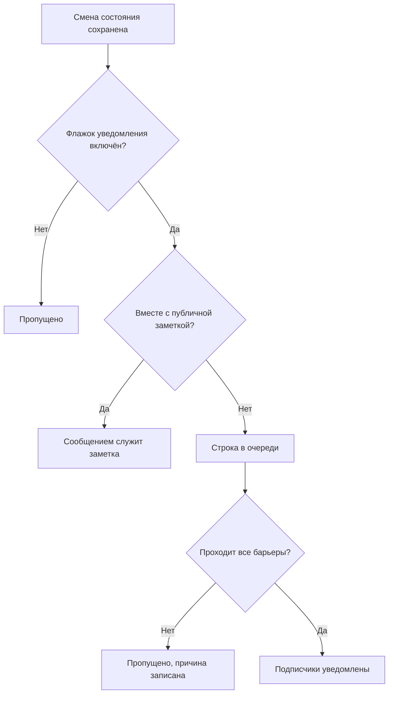

# Состояния и уровни серьёзности инцидентов

У каждого инцидента две классификации: **состояние**, которое говорит, на каком этапе реагирования он находится, и **уровень серьёзности**, который говорит, насколько он болезнен. Эта страница объясняет, что делает каждое состояние, как добавить свои и как упорядочены уровни серьёзности, — для всех, кто настраивает инциденты или хочет понять, почему инцидент вызвал или не вызвал дежурных, был или не был устранён, появился или не появился на странице статуса.

:::cards
- [Добавьте свои состояния](#добавьте-свои-состояния): Опишите своё реагирование и посмотрите, чем считается каждое состояние.
- [Что делает подтверждение](#что-делает-подтверждение): Вызовы прекращаются, а SLA отмечается как отвеченный.
- [Что делает устранение](#что-делает-устранение): Мониторы освобождаются, а SLA закрывается.
- [Уведомление подписчиков](#уведомление-подписчиков-страницы-статуса-о-смене-состояния): Барьеры, которые проходит смена состояния, прежде чем о ней узнает страница статуса.
:::

## Как это работает

В панели управления состояния и уровни серьёзности похожи — и те и другие отображаются цветными значками в списке инцидентов и цветной точкой перед именем везде, где вы их выбираете, и те и другие — списки проекта, которые можно переименовать и перекрасить. Но работу они выполняют совершенно разную.

Состояния управляют поведением. Три логических флага в строках состояний вместе с порядком состояний определяют, какие инциденты считаются активными, какие кнопки появляются в заголовке инцидента, когда останавливаются часы SLA и когда инцидент исчезает с вашей страницы статуса. Уровни серьёзности сами по себе ничем не управляют — это метки, описывающие влияние, на которые могут опираться другие правила.

```mermaid title="Инциденты движутся по списку только вниз; место состояния определяет, чем оно считается"
flowchart TB
    subgraph open["Считается неподтверждённым"]
        identified["Identified"]
    end
    subgraph working["Считается подтверждённым"]
        acknowledged["Подтверждён"]
        mitigated["Mitigated (своё)"]
    end
    subgraph done["Считается устранённым"]
        resolved["Устранён"]
        closed["Closed (своё)"]
    end
    identified --> acknowledged
    acknowledged --> mitigated
    mitigated --> resolved
    resolved --> closed
    identified -. "перескочить" .-> resolved
```

У модели `IncidentState` есть `name`, `description`, `color` и `order`, а также три логических поля: `isCreatedState`, `isAcknowledgedState` и `isResolvedState`. Всё, что продукт делает с состояниями, опирается на эти логические поля и на `order` — и никогда на имя состояния. Поэтому вы можете переименовать **Устранён** в «Closed», и ничего не сломается: флаг остаётся со строкой.

У модели `IncidentSeverity` есть `name`, `description`, `color` и `order` — и больше ничего. Флагов нет. Ничто в OneUptime само по себе не обрабатывает **Critical Incident** иначе, чем **Minor Incident**, — серьёзность важна только там, где вы на неё что-то нацеливаете, например в критерии совпадения **Инцидент Серьёзности** правила дежурства.

Несколько коротких правил:

- **Выбирайте уровень серьёзности, чтобы сообщить о влиянии** — он показывается в списке инцидентов и на странице **Обзор** инцидента и является обязательным полем при объявлении инцидента.
- **Выбирайте состояния, чтобы описать свой процесс** — этапы реагирования, которые вы действительно проходите, в том порядке, в котором вы их проходите.
- **Не кодируйте срочность в состояниях** — состояние с именем «Critical» никого не вызовет. Это делает уровень серьёзности вместе с правилом дежурства.

> [!TIP]
> Оба списка создаются вместе с проектом, и оба редактируются в **Инциденты → Настройки**. Этот раздел бокового меню «Инциденты» по умолчанию свёрнут, поэтому разверните **Настройки**, прежде чем их искать.

## Созданные заранее состояния

Вместе с проектом создаются три состояния в таком порядке. Создание идемпотентно — состояние добавляется, только если состояния с таким именем ещё нет.

| Состояние        | `order` | Флаг                  | Цвет      | Что оно означает                                   |
| ---------------- | ------- | --------------------- | --------- | -------------------------------------------------- |
| **Identified**   | `1`     | `isCreatedState`      | `#fd625e` | Состояние, в которое попадают новые инциденты.     |
| **Подтверждён**  | `2`     | `isAcknowledgedState` | `#ffbf53` | Кто-то взял инцидент в работу.                     |
| **Устранён**     | `3`     | `isResolvedState`     | `#2ab57d` | Инцидент завершён и больше не считается активным.  |

> [!NOTE]
> Первое состояние называется **Identified**, хотя в некоторых описаниях в продукте его по-прежнему называют состоянием «created». Когда в документе или подсказке говорится «состояние создания», имеется в виду состояние с `isCreatedState` — в новом проекте это **Identified**.

## Что на самом деле делает каждый флаг состояния

| Флаг                  | Назначение                                                                                                                                                                                           |
| --------------------- | ---------------------------------------------------------------------------------------------------------------------------------------------------------------------------------------------------- |
| `isCreatedState`      | Состояние, которое получает инцидент, если никто его не выбрал. Если ни у одного состояния проекта нет этого флага, создание инцидента завершается ошибкой с просьбой добавить состояние создания инцидента в настройках. |
| `isAcknowledgedState` | Отмечает состояние подтверждения проекта: то, в которое **Подтвердить** переводит инцидент и в честь которого названа плитка статистики подтверждения. Инцидент в нём, в любом последующем состоянии или устранённый считается подтверждённым — **Подтвердить** для него больше не предлагается, дежурных по нему больше не вызывают, а его SLA отмечается как отвеченный. |
| `isResolvedState`     | Отмечает состояние устранения проекта: то, в которое **Устранить** переводит инцидент и которое показывает плитка статистики устранения. Инцидент в нём или в любом последующем состоянии считается устранённым — он исчезает из **Активные инциденты** и из активного раздела страницы статуса, а его SLA отмечается как устранённый. |

Ожидается, что каждый флаг есть только у одного состояния проекта — поиск берёт первое по порядку. Три состояния с флагами помечены на странице настроек как **Встроенный**; наведите на эту пометку указатель (или перейдите к ней клавишей Tab), чтобы прочитать, что OneUptime делает с состоянием. Их можно переименовать, перекрасить и перетащить, но:

- **Они сохраняют свой порядок.** Состояние создания идёт перед состоянием подтверждения, а подтверждения — перед устранением. Перетаскивание, которое нарушило бы это, — например, **Устранён** выше **Подтверждён**, — отклоняется, строки возвращаются на место, и страница объясняет почему.
- **Их нельзя удалить.** Их **Удалить** остаётся в меню строки, но заблокировано, с указанием причины. Массовое удаление пропускает их и перечисляет как неудалённые. API тоже отказывается удалять последнее состояние создания, подтверждения или устранения проекта.

Поскольку интерфейс читает имена состояний динамически, переименование состояния меняет то, что вы видите везде: плитки статистики (**Acknowledged in** и **Resolved in** с исходными именами), подтверждение **Отметить инцидент как «…»** для своего состояния и значок в списке инцидентов следуют имени, которое вы дали строке.

## Добавьте свои состояния

Добавленное вами состояние — это этап реагирования, которого нет среди трёх исходных: «Investigating», «Mitigated», «Monitoring», «Closed».

:::steps
### Откройте список состояний

Перейдите в **Инциденты → Настройки → Состояние инцидента**. Карточка **Инцидент Состояния** перечисляет ваши состояния по порядку, по одной строке на каждое: ручка для перетаскивания, цвет и имя, чем **Считается** инцидент в нём, и описание. Фраза под заголовком говорит прямо: по этому списку инциденты движутся только вниз.

### Создайте состояние

Нажмите **Создать: Состояние инцидента** в заголовке карточки и заполните форму (поля ниже). Новое состояние добавляется **сразу над состоянием устранения** — там, где должно быть большинство состояний, и никогда ниже него, где оно незаметно считалось бы устранённым.

### Перетащите его на место

Перетащите строку за ручку, чтобы переместить её. Новый порядок сохраняется, когда вы её отпускаете; вводить номер порядка не нужно. С клавиатуры установите фокус на ручку, нажмите пробел, перемещайте стрелками и снова нажмите пробел. Столбец **Считается** обновляется, когда вы отпускаете строку.
:::

**Редактировать** открывает ту же форму, что и создание. ID состояния находится в **Показать ID** в меню строки.

| Поле            | Обязательно | Что оно делает                                                                                                                                                                                                                                                    |
| --------------- | ----------- | ----------------------------------------------------------------------------------------------------------------------------------------------------------------------------------------------------------------------------------------------------------------- |
| **Имя**         | Да          | Не менее двух символов. Подсказка предлагает что-то вроде «Investigating».                                                                                                                                                                                        |
| **Описание**    | Нет         | Свободный текст, объясняющий, когда инцидент находится в этом состоянии.                                                                                                                                                                                          |
| **Цвет**        | Да          | Уже выбран при открытии формы: цвет, который ещё не использует ни одно состояние в списке, чтобы новое состояние никогда не оказалось того же красного цвета, что и состояние над ним. Выберите другой из ряда именованных цветов (Красный, Оранжевый, Лаймовый, Зелёный, Сине-зелёный, Синий, Индиго, Фиолетовый, Пурпурный, Розовый) или используйте **Свой цвет** для точного фирменного цвета, например `#fd625e`. |

Цвет окрашивает значок состояния и точку перед его именем в каждом выборе состояния: в формах объявления и шаблона, в массовом действии **Изменить состояние**, в меню состояний заголовка и в условиях правил и фильтров. Каждый из этих выборов перечисляет состояния в том порядке, который задаёт эта страница.

Три флага нельзя установить из этой формы — они принадлежат исходным строкам. Поэтому добавленное вами состояние не имеет флага, и у этого есть три последствия, которые стоит учесть:

- **Его место определяет, чем оно считается.** Это показывает столбец **Считается**, и он меняется при перетаскивании: выше состояния подтверждения инцидент в нём **Не подтверждён**; начиная с состояния подтверждения и ниже он считается **Подтверждён**, поэтому политики дежурства прекращают эскалацию; начиная с состояния устранения и ниже он считается **Устранён**, поэтому страницы статуса перестают показывать его как активный.
- **Выше состояния устранения оно сохраняет инцидент активным.** **Активные инциденты** содержат инциденты, текущее состояние которых стоит выше состояния устранения, поэтому добавленное туда состояние оставляет инцидент в активном списке и в счётчике на боковой панели. Состояние, перетащенное ниже состояния устранения, везде считается устранённым — в активных списках, на страницах статуса, в напоминаниях и в SLA, — а перевод инцидента в него из **Устранён** не является повторным устранением.
- **Инцидент переводится в него из меню заголовка.** Кнопки заголовка — только **Подтвердить** и **Устранить**; своё состояние находится в **Change state to** в меню **⋯** рядом с ними, которое перечисляет каждое состояние после текущего. Его подтверждение называется **Отметить инцидент как «`<state name>`»**, а кнопка отправки — **Отметить как «`<state name>`»**.

> [!TIP]
> Распространённый вариант — этап смягчения последствий между состояниями подтверждения и устранения: создайте «Mitigated», и оно встанет сразу над **Устранён**, после **Подтверждён**, и будет считаться подтверждённым. Для этапа сортировки до того, как кто-то подтвердил инцидент, перетащите его выше **Подтверждён**.

## Порядок — это настоящее ограничение, а не настройка отображения

Порядок соблюдается при записи смены состояния, а не только при отрисовке списка:

- **Переходы назад отклоняются.** Перевод инцидента в состояние, которое стоит в порядке раньше текущего, завершается ошибкой, называющей оба состояния.
- **Повторный выбор текущего состояния отклоняется.** Перевод инцидента в состояние, в котором он уже находится, завершается сообщением «Incident state cannot be same as previous state.»
- **Строка задним числом не может повторять соседнюю.** Вставка строки хронологии, состояние которой совпадает со следующей строкой, тоже отклоняется.
- **Кнопки заголовка следуют месту отмеченных флагами состояний в порядке.** **Подтвердить** и **Устранить** предлагаются в зависимости от того, где текущее состояние стоит в упорядоченном списке. Своё состояние, поставленное *после* состояния устранения, никогда не показывает кнопку **Устранить**, потому что инцидент в нём уже считается устранённым.

Поэтому, добавляя состояние, ставьте его туда, где инцидент действительно будет через него проходить. Неверный порядок не просто выглядит странно — он делает переходы невозможными. Перенос состояния ниже меняет то, чем считаются уже находящиеся в нём инциденты, в тот момент, когда вы его отпускаете.

Через API и Terraform порядок — это столбец `order`: меньшие числа идут первыми. Состояние, созданное без него, встаёт сразу над состоянием устранения; созданное или обновлённое с числом занимает это место, а состояния на пути сдвигаются на одну позицию вниз. Числа, которых больше ни у кого нет, сохраняются как написаны, поэтому состояние, управляемое Terraform, читает обратно то число, которое ему дали.

## Созданные заранее уровни серьёзности

Вместе с проектом создаются три уровня серьёзности в таком порядке, от самого серьёзного:

| Серьёзность           | `order` | Цвет      | Исходное описание                                                                                                                                                                         |
| --------------------- | ------- | --------- | ----------------------------------------------------------------------------------------------------------------------------------------------------------------------------------------- |
| **Critical Incident** | `1`     | `#b70400` | Issues causing very high impact to customers. Immediate response is required. Examples include a full outage, or a data breach.                                                          |
| **Major Incident**    | `2`     | `#fd625e` | Issues causing significant impact. Immediate response is usually required. We might have some workarounds that mitigate the impact on customers. Examples include an important sub-system failing. |
| **Minor Incident**    | `3`     | `#ffbf53` | Issues with low impact, which can usually be handled within working hours. Most customers are unlikely to notice any problems. Examples include a slight drop in application performance. |

Уровень серьёзности обязателен при объявлении инцидента и обязателен в каждой спецификации инцидента в критериях монитора, поэтому каждый инцидент — ручной или автоматический — приходит с ним. Процесс объявления см. в [Объявление инцидента](/docs/incidents/declaring-incidents), а путь через монитор — в [Шаблоны инцидентов и оповещений](/docs/monitor/incident-alert-templating).

## Редактирование уровней серьёзности

Перейдите в **Инциденты → Настройки → Серьёзность инцидента**. Устроено так же, как страница состояний: по одной строке на уровень серьёзности, самый серьёзный первым, перетаскивание строки меняет её ранг, **Создать: Серьёзность инцидента** добавляет новый в конец (наименее серьёзный), а в форме — **Имя**, **Описание** и **Цвет**, причём цвет уже выбран, как в форме состояния.

Ранг важен везде, где OneUptime сравнивает уровни серьёзности: эпизод берёт уровень серьёзности своего самого серьёзного инцидента, а Critical и Warning в рекомендации монитора соответствуют вашему первому и второму уровню серьёзности.

Два отличия от состояний:

- **Защиты от удаления нет.** Любой уровень серьёзности можно удалить, включая три исходных.
- **Нет флагов для наследования и нет «Считается».** Новый уровень серьёзности ведёт себя точно так же, как исходные, — это метка с цветом и рангом.

Где серьёзность делает больше, чем описывает: в **Инциденты → Правила → Правила дежурства** поле **Инцидент Серьёзности** правила — это критерий совпадения. Указать там **Critical Incident** — так выражается «вызывать команду баз данных при всём критическом»: политика дежурства находится в правиле, а не в уровне серьёзности.

**Изменение уровня серьёзности инцидента** — через **Редактировать** на карточке **Сведения об инциденте** инцидента, через API или Terraform (`incidentSeverityId`), рабочим процессом или инструментами ИИ — делает одни и те же четыре вещи, как бы оно ни было отправлено: лента инцидента получает запись **Incident updated** с новым уровнем серьёзности, сроки SLA инцидента пересчитываются, его правило напоминаний сопоставляется заново, а метрики инцидентов учитывают одно изменение уровня серьёзности. Сохранение уровня серьёзности, который у инцидента уже есть, не делает ничего из этого, поэтому правка только заголовка инцидента оставляет его сроки SLA, напоминания и счётчик изменений серьёзности без изменений. Уровень серьёзности оповещения работает так же для его записи в ленте и напоминаний.

## Перевод инцидента по состояниям

Инцидент меняет состояние четырьмя способами:

| Способ              | Где                                                                                         | Что он запрашивает                                                                                                                                                                                           |
| ------------------- | ------------------------------------------------------------------------------------------- | ------------------------------------------------------------------------------------------------------------------------------------------------------------------------------------------------------------ |
| **Кнопки заголовка** | Заголовок инцидента: **Подтвердить** и **Устранить**, а также **Change state to** в его меню **⋯** | Короткое подтверждение — **Подтвердить инцидент** или **Устранить инцидент** — с **Уведомить подписчиков страницы статуса** и, свёрнутыми в **Добавить публичную заметку**, необязательной **Публичная заметка** и её выбором **Выберите шаблон заметки** (когда в проекте есть шаблоны заметок). |
| **Хронология состояний** | **Хронология состояний** в боковом меню инцидента                                       | Строка, добавляемая вручную, с **Статус инцидента**, **Начинается** и **Уведомить подписчиков страницы статуса**.                                                                                            |
| **Массовое изменение** | **Изменить состояние** для выборки в списке инцидентов                                    | Одна страница с состоянием, **Уведомить подписчиков страницы статуса** и тем же свёрнутым **Добавить публичную заметку**.                                                                                    |
| **Автоматически**   | Критерий монитора или ваш собственный код                                                   | Критерий с включённым **Автоустранение инцидента** устраняет свой инцидент, когда критерий перестаёт выполняться. API меняет состояние, создавая строку в `/api/incident-state-timeline`.                     |

Если текущее состояние стоит до состояния подтверждения, заголовок предлагает **Подтвердить** и **Устранить**; если между ними — только **Устранить**. Подтверждение также останавливает любую эскалацию дежурства для инцидента.

Каждый из этих способов записывает строку хронологии. Смена состояния делает и несколько вещей, о которых не нужно просить: публикует запись в ленте инцидента, назначает Руководитель инцидента, если у инцидента его ещё нет, и обновляет часы SLA. Повторное открытие устранённого инцидента начинает новую запись SLA с момента повторного открытия.

## Что делает подтверждение

Инцидент считается подтверждённым с момента, когда он переходит в ваше состояние подтверждения, в любое последующее состояние — состояние **Mitigated** или **Investigating**, которое вы поставили ниже **Подтверждён**, — или в состояние устранения, каким бы из четырёх способов выше он ни был переведён. Столбец **Считается** на странице настроек состояний показывает, какие это состояния. Когда инцидент подтверждён:

- **Подтвердить больше не предлагается.** Ни в заголовке инцидента, ни в мобильном приложении (кнопка и свайп), ни в Slack или Microsoft Teams, ни через `acknowledge_incident` сервера OneUptime MCP. Попытка всё же подтвердить — со страницы вызова, из Slack или Teams — отклоняется сообщением «Incident is already acknowledged.» (или «Incident is already resolved.»), а не возвращает инцидент вверх по списку.
- **Дежурных по нему больше не вызывают.** Дежурный, который подтверждает свой вызов после того, как коллега подтвердил инцидент или перевёл его дальше, получает подтверждение своего вызова, а инцидент остаётся там, где был.
- **SLA отмечается как отвеченный** при первом таком переходе; дальнейшие переходы по последующим состояниям сохраняют это время.
- **Время до подтверждения отсчитывается до этого первого перехода** — плитка статистики на странице **Обзор** инцидента, метрика **Time to Acknowledge**, измерение, заканчивающееся на **Инцидент подтверждён**, и MTTA в сводках Slack и Microsoft Teams. Инцидент, перешедший прямо из **Identified** в **Investigating**, был подтверждён тогда же; устранённый сразу был подтверждён в момент устранения.
- **Фильтр «Подтверждён»** — например, на виджете списка инцидентов дашборда — показывает инциденты в вашем состоянии подтверждения и в любом последующем состоянии, вплоть до устранения.

Оповещения и эпизоды следуют тому же правилу с вашими состояниями оповещений.

## Что делает устранение

Инцидент устранён, когда он переходит из состояния выше вашего состояния устранения в состояние устранения или в любое последующее состояние — каким бы из четырёх способов выше он ни был переведён. Каждое устранение:

- **Освобождает мониторы, которые удерживает инцидент.** Инцидент, объявленный открытым, удерживает свои мониторы: он перевёл их в свой статус из **Изменить статус монитора на**, если он его указывает, и, если объявлен вручную, приостановил их мониторинг. Правка, пока он открыт, — добавление мониторов или изменение этого статуса — тоже заставляет его их удерживать. Устранение возобновляет их мониторинг и возвращает их в рабочее состояние, если на них нет другого открытого инцидента, и с этого момента инцидент ничего не удерживает. Поэтому инцидент, объявленный уже устранённым, ничего не освобождает, как и повторное устранение после повторного открытия: статус, который его мониторы получили в промежутке — от своих проб, от обслуживания или установленный вручную, — остаётся.
- **Отмечает SLA как устранённый** и, если включены черновики постмортемов OneUptime AI, составляет черновик постмортема.

Переход из **Устранён** в последующее состояние — например, **Closed** — не является повторным устранением: ничего из этого не выполняется заново, и новый SLA не начинается. Инцидент, объявленный до того, как OneUptime начал это записывать, освобождает свои мониторы при следующем устранении, как и раньше.

## Хронология состояний

Страница **Хронология состояний** в боковом меню инцидента — это журнал аудита каждого состояния, в котором побывал инцидент. Карточка на этой странице называется **Хронология статуса** и отсортирована от новых к старым.

| Столбец                            | Что он показывает                                                                                                                                                                                                                                              |
| ---------------------------------- | -------------------------------------------------------------------------------------------------------------------------------------------------------------------------------------------------------------------------------------------------------------- |
| **Статус инцидента**               | Цветной значок с именем и цветом состояния.                                                                                                                                                                                                                    |
| **Начинается**                     | Когда инцидент вошёл в это состояние.                                                                                                                                                                                                                          |
| **Заканчивается**                  | Когда он его покинул. Для текущего состояния показывается `Currently Active`.                                                                                                                                                                                  |
| **Длительность**                   | Время в состоянии, для текущего — до настоящего момента.                                                                                                                                                                                                       |
| **Статус уведомления подписчика**  | Было ли уведомление страницы статуса об этом изменении отправлено, пропущено или ещё ожидает, со ссылкой **подробнее** и — если отправка не удалась — действием **Повторить**. **Повторить** снова отправляет смену состояния на каждую страницу статуса, которой инцидент достигает сейчас, включая подписчиков, которые её уже получили. |

У каждой строки два действия:

- **Просмотреть причину** — открывает диалог **Корневая причина** с Markdown, записанным вместе с этой сменой состояния.
- **Просмотреть логи** — открывает диалог, объясняющий, почему изменился статус, с просмотрщиком **Журнал состояний инцидента**.

В панели управления строки хронологии можно добавлять и удалять, но не редактировать; у инцидента всегда остаётся хотя бы одна строка. Через API можно исправить `startsAt` строки, и каждое измерение, вычисленное по хронологии, последует за ним.

> [!WARNING]
> Удаление не той строки переписывает историю инцидента, поэтому используйте его как инструмент исправления, а не как привычку наводить порядок.

## Список «Активные инциденты»

**Инциденты → Активные инциденты** — это список, за которым вы следите во время смены. Его определение — ровно одно условие: текущее состояние инцидента стоит выше вашего состояния устранения — первого по порядку состояния с флагом `isResolvedState`. Больше ничего не учитывается — ни серьёзность, ни возраст, ни то, подтвердил ли его кто-нибудь.

Пункт бокового меню несёт красный значок со счётчиком, использующим тот же запрос, поэтому значок и список всегда совпадают. Если смотреть не на что, страница так и говорит.

Практическое следствие: своё состояние, добавленное выше состояния устранения, оставляет инциденты в этом списке — «Mitigated» не означает «готово», — а состояние, поставленное после него, убирает их оттуда, как и состояние устранения. Оповещения и эпизоды следуют тому же правилу со своими состояниями, и его читают счётчики бокового меню, напоминания, страницы статуса и мобильное приложение.

## Уведомление подписчиков страницы статуса о смене состояния

Смена состояния может уведомить подписчиков вашей страницы статуса, но проходит через несколько барьеров. Понимание этих барьеров избавляет от долгих поисков ответа на вопрос «почему никто не получил уведомление».



Уведомление запрашивается для каждой строки хронологии флажком **Уведомить подписчиков страницы статуса** (`shouldStatusPageSubscribersBeNotified`) в диалоге смены состояния и в ручной форме хронологии. В диалоге смены состояния он изначально выключен, если инцидент был объявлен без уведомления подписчиков. Тот же флажок определяет, уведомит ли кого-нибудь публичная заметка из диалога. Когда он выключен, строка сохраняется со статусом «пропущено» и пояснением. Когда включён, строка ставится в очередь, и её подхватывает фоновое задание — оно запускается каждую минуту, поэтому доставка быстрая, но не мгновенная.

**Затем строка в очереди пропускается, если выполняется любое из этих условий:**

- **Новое состояние — состояние создания.** Подписчики уже получили уведомление при объявлении инцидента, поэтому первая строка хронологии намеренно не отправляет второе сообщение.
- **К инциденту не привязаны мониторы.** Без ресурсов нет страницы статуса, к которой можно отнести инцидент.
- **Инцидент не виден на странице статуса** (`isVisibleOnStatusPage` выключено).
- **На странице статуса выключены инциденты** (`showIncidentsOnStatusPage` выключено). Это проверяется для каждой страницы статуса отдельно — другие страницы, показывающие тот же монитор, всё равно получают уведомление.
- **Страница статуса вне охвата инцидента.** Инцидент, ограниченный некоторыми страницами статуса через **Ограничить этими страницами состояния**, уведомляет только эти страницы из числа тех, где показаны его мониторы, а страница с включённым **Показывать только инциденты, ограниченные этой страницей** никогда не получает уведомлений об инциденте, не ограниченном ею. Это тоже проверяется для каждой страницы статуса отдельно. См. [Отдельная страница статуса для каждой аудитории](/docs/status-pages/one-status-page-per-audience).

**Ещё одно обстоятельство, меняющее результат.** Если вы пишете **Публичная заметка** в диалоге смены состояния (в **Добавить публичную заметку**) или в массовом действии **Изменить состояние**, пока включено **Уведомить подписчиков страницы статуса**, строка хронологии помечается как уже уведомлённая, а не ставится в очередь, и её статусное сообщение говорит, что уведомление несла заметка. До подписчиков доходит сама заметка, поэтому они получают одно сообщение вместо двух. Заметка, состоящая только из пробелов, не публикуется, и строка ставится в очередь как обычно. Смены состояния планового обслуживания работают так же. Тип события, стоящий за обычным сообщением о смене состояния, — `Subscriber Incident State Changed`.

**Заметка сообщает, каков инцидент сейчас.** Поскольку заметка — единственное сообщение, она называет новое состояние в каждом канале, как сделало бы сообщение о смене состояния: тема письма гласит `[Resolved Incident] <title>`, а в подробностях есть строка **Status** цвета состояния, SMS сообщает `Incident <title> on <status page> is Resolved.`, сообщения Slack и Microsoft Teams содержат строку `**Status:** Resolved`, а полезная нагрузка webhook `IncidentNoteCreated` содержит `incidentState` в `data`. Заметка, опубликованная отдельно, сохраняет своё обычное сообщение, как и уведомление об обновлении при правке.

**Для публикации заметки нужно отдельное разрешение.** Смена состояния и публикация публичной заметки — это разные разрешения (**Create Incident State Timeline** и **Create Incident Status Page Note** в пользовательской роли; у встроенных ролей инцидентов и проекта есть оба). Для смены состояния не нужно разрешение на редактирование инцидента: см. [Изменение состояния](/docs/permissions/index#изменение-состояния). Тому, кто может менять состояние инцидента, но не может публиковать публичные заметки, не предлагается **Добавить публичную заметку** ни в диалоге, ни в массовом действии **Изменить состояние**. Смена состояния, которую такой пользователь отправляет с заметкой через API, отклоняется целиком с сообщением о том, что состояние не изменено и почему, поэтому изменение никогда не записывается как сообщённое заметкой, которая так и не была опубликована. Без заметки изменение проходит. Оповещения, эпизоды оповещений и эпизоды инцидентов вместо этого предлагают со сменой состояния приватную заметку (**Добавить приватную заметку**), и она работает так же: для её публикации нужно собственное разрешение заметки (**Create Alert Internal Note**, **Create Alert Episode Internal Note** или **Create Incident Episode Internal Note** в пользовательской роли; у встроенных ролей оповещений, инцидентов и проекта они есть), а смена состояния, отправленная с приватной заметкой тем, у кого его нет, отклоняется целиком, и состояние не меняется.

**«Отправлено» означает, что сообщение отправлено каждому подписчику.** Задание дожидается каждого сообщения и считает его отправленным или неудавшимся — по каждой странице статуса и каналу, — а статусное сообщение строки перечисляет эти количества. Одно неудавшееся сообщение или отправка, у которой закончилось время или которая была прервана, делает строку **Не удалось**. См. [Подписчики и объявления](/docs/status-pages/subscribers).

О том, кто получает эти уведомления и как выбираются шаблоны, см. [Подписчики и объявления](/docs/status-pages/subscribers).

## Как не допустить инцидент на страницу статуса

Четыре отдельных условия определяют, окажется ли инцидент вообще на публичной странице, и все четыре должны быть выполнены:

- **Показывать инциденты** (`showIncidentsOnStatusPage`) на самой странице статуса.
- **Видно на странице статуса** (`isVisibleOnStatusPage`) у инцидента — переключатель на странице **Настройки** инцидента. По умолчанию он включён и отсутствует в мастере объявления; критерий монитора может задать его через **Показывать инцидент на странице статуса**. Инцидент, объявленный скрытым, не уведомляет ни одного подписчика при создании; когда вы позже включаете этот переключатель, форма редактирования предлагает **Уведомить подписчиков о создании этого инцидента**. См. [Объявление инцидента](/docs/incidents/declaring-incidents).
- **Страница входит в охват инцидента.** На странице показан один из мониторов инцидента, и, если инцидент ограничен некоторыми страницами статуса, она одна из них. Страница с включённым **Показывать только инциденты, ограниченные этой страницей** показывает только ограниченные ею инциденты. См. [Отдельная страница статуса для каждой аудитории](/docs/status-pages/one-status-page-per-audience).
- **Текущее состояние стоит выше состояния устранения.** Именно это убирает инцидент из активного раздела: запрос страницы статуса выбирает инциденты, текущее состояние которых стоит выше вашего состояния устранения, поэтому состояние устранения и любое последующее состояние снимают инцидент со страницы. Ничего не нужно архивировать или закрывать — вы устраняете инцидент, и он уходит в историю.

**Приватные инциденты не появляются никогда.** Включение **Приватный инцидент** скрывает инцидент со всех страниц статуса независимо от переключателей выше и ограничивает доступ к нему его владельцами, а также администраторами и владельцами проекта. Ничего о нём не доходит и до подписчиков страницы статуса: ни его создание, ни смены состояния, ни публичные заметки, ни постмортем. Изображения в его описании, постмортеме, пользовательских полях и публичных заметках не видны всем, пока он приватный.

Два переключателя согласуются друг с другом, поэтому страница **Настройки** инцидента всегда показывает то, что делают страницы статуса:

- Если сделать инцидент приватным, **Видно на странице статуса** выключается вместе с этим.
- Включение **Видно на странице статуса**, пока инцидент остаётся приватным, оставляет его выключенным. Чтобы опубликовать приватный инцидент, выключите **Приватный инцидент** и включите **Видно на странице статуса** — за одно сохранение или одно за другим.

Это действует при любом способе записи инцидента: панель управления, API, Terraform, рабочий процесс, монитор, шаблон инцидента или правило конфиденциальности. Значение, отправленное текстом, например `"true"`, считается так же, как `true`. Одна запись во множество инцидентов, включающая **Видно на странице статуса**, — например, **Update Many** рабочего процесса, — показывает неприватные и оставляет скрытым каждый приватный. Каждый инцидент оценивается в том виде, в каком он находится, когда до него доходит запись, поэтому одновременное изменение его конфиденциальности никогда не перекрывается: инцидент никогда не сохраняется одновременно приватным и видимым. Инцидент, созданный приватным, создаётся скрытым и не уведомляет ни одного подписчика о своём создании.

**Эпизоды следуют тому же правилу.** Приватный эпизод инцидента скрыт со всех страниц статуса, что бы ни говорил его переключатель **Видно на странице статуса**, и его подписчики ничего о нём не узнают. На странице **Настройки** эпизода переключатель так и говорит и остаётся выключенным, пока эпизод приватный. Приватный инцидент никогда не выводит свой эпизод на страницу статуса: эпизод попадает на страницу только через неприватные инциденты.

:::details Обновление с версии без этих правил
У инцидентов и эпизодов, сохранённых приватными с ещё включённым **Видно на странице статуса** до появления этих правил, этот переключатель при обновлении выключается. Никому ничего не отправляется. Изображения, которые такой инцидент или эпизод сделал видимыми для всех, снова становятся приватными, если только что-то, что показывают ваши страницы статуса, всё ещё их не содержит. То же касается изображений в публичных заметках инцидентов, эпизодов и событий планового обслуживания, которые ваши страницы статуса не показывают и которые раньше оставались видимыми для всех.
:::

Сколько истории устранённых инцидентов хранит страница — это настройка страницы статуса, а не инцидента. О том, как мониторы на странице определяют, какие инциденты вообще появляются, см. [Ресурсы и группы страницы статуса](/docs/status-pages/resources-and-groups).

## Дальнейшие шаги

:::cards
- [Объявление инцидента](/docs/incidents/declaring-incidents): Выберите начальное состояние и уровень серьёзности при объявлении.
- [Заметки, владельцы и лента инцидента](/docs/incidents/notes-owners-and-feed): Опубликуйте публичную заметку, которая уходит вместе со сменой состояния.
- [Настройки и автоматизация инцидентов](/docs/incidents/settings): Измеряйте время между состояниями и сопоставляйте уровни серьёзности в правилах.
- [Подписчики и объявления](/docs/status-pages/subscribers): Кто получает сообщения, которые отправляет смена состояния.
:::
