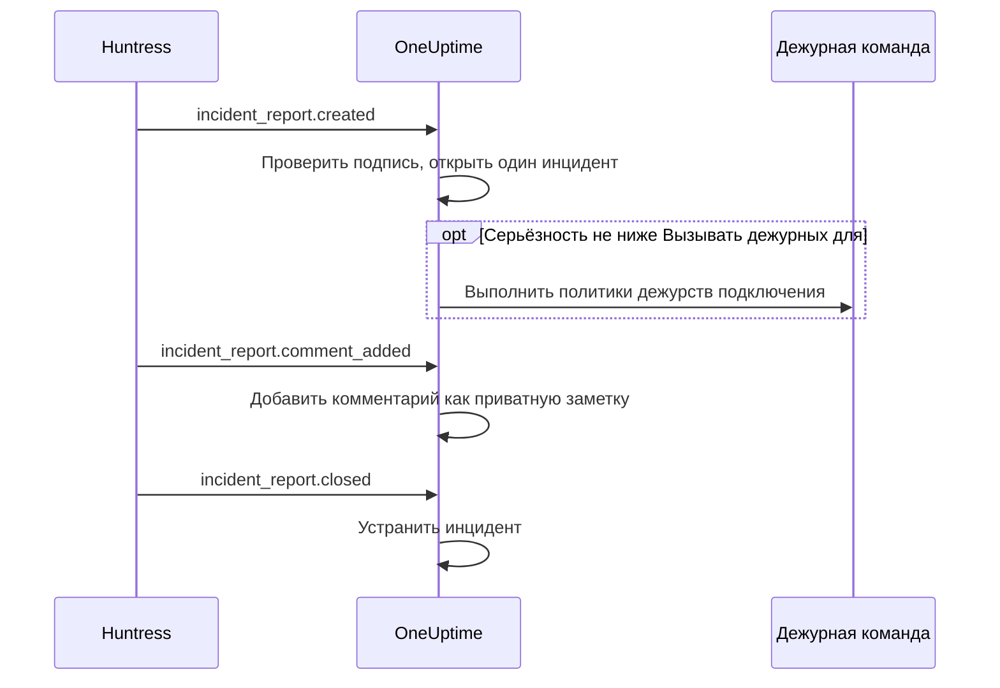

# Интеграция с Huntress

Вызывайте дежурную команду по отчётам об инцидентах Huntress. Когда SOC Huntress присылает отчёт об инциденте на конечном устройстве или в учётной записи, OneUptime открывает для него один инцидент с выбранной вами серьёзностью, вызывает выбранные политики дежурств и устраняет инцидент, когда отчёт закрывают в Huntress.

Эта интеграция **входящая**: Huntress отправляет каждое событие отчёта об инциденте на URL webhook, который выдаёт OneUptime, и подписывает его секретом подписи конечной точки. OneUptime никогда не обращается к Huntress, поэтому ключ API Huntress не нужен.

:::cards
- [Как это работает](#как-это-работает): Что OneUptime делает с каждым событием отчёта.
- [Настройка](#настройте-интеграцию): Подключить в OneUptime, добавить конечную точку в Huntress, сохранить её секрет подписи, отправить тест.
- [Параметры](#параметры): Вызов дежурных, серьёзность, организации, метки и устранение.
- [Устранение неполадок](#устранение-неполадок): Что означают ошибки подключения и что изменить.
:::

## Как это работает

Huntress отправляет событие отчёта об инциденте, когда отчёт отправлен, когда его кто-то комментирует и когда его закрывают. Каждое событие содержит отчёт целиком.

1. **Проверить.** Запрос должен быть подписан секретом подписи конечной точки не раньше чем за пять минут до его прихода. Всё остальное отклоняется, а страница подключения объясняет почему.
2. **Открыть один инцидент.** Первое событие отчёта открывает инцидент с названием по отчёту, например `Huntress: Incident on DESKTOP-01 (Acme Corp)`. Его описание содержит сводку отчёта, его серьёзность в Huntress, организацию, затронутый хост или учётную запись, найденные Huntress индикаторы и ссылку на отчёт в Huntress. Последующие события того же отчёта и повторные доставки Huntress находят этот инцидент: отчёт никогда не открывает два.
3. **Вызвать дежурных.** Инцидент открывается с той серьёзностью инцидента, которую подключение сопоставляет серьёзности отчёта в Huntress. Если эта серьёзность не ниже **Вызывать дежурных для**, выполняются **Политики дежурств** подключения.
4. **Следить за отчётом.** Комментарий, добавленный в Huntress, становится приватной заметкой в инциденте. Когда отчёт закрывают или отклоняют, инцидент устраняется.

Открытые так инциденты никогда не показываются на странице статуса. Ваши правила для инцидентов (дежурства, владельцев, меток и приватности) применяются к ним, как к любому другому инциденту.

## Перед началом

- В OneUptime роль **Project Owner** или **Project Admin**. Участники, наблюдатели и роли инцидентов видят подключение и полученные отчёты, но не могут его менять.
- В Huntress роль **Account Admin**: только администраторы учётной записи могут добавлять webhooks.
- Политика дежурств, которую нужно вызывать. Без неё отчёты открывают инциденты и никого не вызывают, если к ним не подходит правило дежурства для инцидентов.
- Для самостоятельно размещённой установки — OneUptime, доступный Huntress из интернета по HTTPS: Huntress отправляет webhooks только на URL `https://`.

## Настройте интеграцию

:::steps
### Подключите Huntress в OneUptime

Откройте **Инциденты → Интеграции → Huntress** (`/dashboard/{projectId}/incidents/integrations/huntress`). Раздел **Интеграции** в боковом меню инцидентов по умолчанию свёрнут, поэтому сначала разверните его. Нажмите **Подключить Huntress**.

Выберите **Политики дежурств**, которые нужно вызывать. Затем **Вызывать дежурных для** спросит, какие отчёты их вызывают, и начнёт с **Высокие и критические отчёты**. Всё остальное ждёт в **Дополнительные поля** со значением по умолчанию (см. [Параметры](#параметры)). Нажмите **Подключить Huntress**. Откроется страница подключения с карточкой **Подключить Huntress**, которая проведёт вас через следующие три шага.

### Добавьте конечную точку webhook в Huntress

На странице подключения нажмите **Скопировать URL webhook**. URL выглядит как `https://oneuptime.com/api/huntress/webhook/<connection-id>`; в самостоятельно размещённой установке он начинается с вашего хоста.

В Huntress откройте меню в правом верхнем углу и выберите **Integrations**. Нажмите **Add an Integration**, выберите **Webhooks** и нажмите **Add Endpoint**. Вставьте URL, включите **Incident Reports** и сохраните. Оставьте **Escalations**, **Platform Actions** и **Account Notices** выключенными: OneUptime принимает эти события и ничего с ними не делает.

### Сохраните секрет подписи конечной точки

В Huntress откройте меню конечной точки (⋯) и выберите **View Signing Secret**. Скопируйте его целиком: он начинается с `whsec_`. На странице подключения нажмите **Сохранить секрет подписи**, вставьте его и нажмите **Сохранить секрет подписи**. Секрет шифруется и больше никогда не показывается.

Пока секрет не сохранён, OneUptime отклоняет все запросы на этот URL. Huntress позже отправляет отклонённое событие повторно, так что событие, отклонённое сейчас, всё равно дойдёт.

### Отправьте тест

В Huntress откройте меню конечной точки (⋯) и выберите **Send Test**. Через несколько секунд карточка на странице подключения сменится на **Подключение** с состоянием **Получает отчёты**.

> [!NOTE]
> Что бы ни содержал тест, подключение покажет, что он пришёл. Тест с отчётом об инциденте открывает инцидент, как любой другой отчёт, и вызывает дежурных, если он достаточно серьёзный.
:::

## Параметры

**Подключить Huntress** спрашивает только, кого вызывать и по каким отчётам. Всё остальное ждёт в **Дополнительные поля** со значением по умолчанию, которое подходит большинству команд. Чтобы позже изменить параметр, нажмите **Изменить настройки** в карточке **Настройки** подключения.

| Параметр | Что он делает | По умолчанию |
| --- | --- | --- |
| **Политики дежурств** | Политики, которые выполняются, когда отчёт достаточно серьёзный. Оставьте пустым, чтобы открывать инциденты, никого не вызывая. | Нет |
| **Вызывать дежурных для** | Какие отчёты вызывают политики: **Только критические отчёты**, **Высокие и критические отчёты** или **Каждый отчёт**. Каждый отчёт в любом случае открывает инцидент. | **Высокие и критические отчёты** |
| **Имя** | Как подключение называется в OneUptime. | `Huntress` |
| **Серьёзность для критических отчётов**, **Серьёзность для высоких отчётов**, **Серьёзность для низких отчётов** | Серьёзность инцидента, с которой открывается каждая серьёзность Huntress. | Три ваших наивысших уровня серьёзности инцидентов по порядку |
| **Только эти организации** | Организации Huntress, отчёты которых открывают инциденты: одно название или ID организации на строку. Регистр в названиях не учитывается. | Пусто: все организации |
| **Метки** | Метки, которые добавляются к каждому инциденту, помимо метки с названием организации отчёта. | Нет |
| **Устранять, когда Huntress закрывает отчёт** | Устранять инцидент, когда его отчёт закрыт или отклонён в Huntress. Если выключено, вместо этого об этом сообщает приватная заметка в инциденте. | Включено |

### Серьёзность

Huntress присваивает каждому отчёту об инциденте одну из трёх серьёзностей. Если вы не выберете для неё серьёзность инцидента, отчёт открывается по порядку ваших уровней серьёзности инцидентов, как их перечисляет **Инциденты → Настройки → Серьёзность инцидента**:

| Серьёзность в Huntress | Что под ней понимает Huntress | Серьёзность инцидента |
| --- | --- | --- |
| Critical | Злоумышленники за клавиатурой, опасное вредоносное ПО или активная компрометация, которую нужно сдержать немедленно. | Наивысшая |
| High | Подтверждённое вредоносное ПО, требующее срочного устранения, или компрометация учётной записи, требующая действий. | Вторая |
| Low | Потенциально нежелательные программы, остатки вредоносного ПО и более старые находки по учётным записям. | Третья |

Проект с меньшим числом уровней использует для остальных самый низкий. Отчёт без серьёзности обрабатывается как высокий. Если выбранный вами уровень удалён, снова решает порядок.

### Организации

Каждый инцидент получает метку с названием организации Huntress из отчёта, например _Acme Corp_. Одно подключение получает отчёты всех организаций вашей учётной записи Huntress, а **Только эти организации** сужает этот круг.

> [!TIP]
> Чтобы вызывать собственную команду каждого клиента, оставьте **Политики дежурств** подключения пустыми и добавьте по правилу дежурства для инцидентов на каждую организацию, например «Если **Метки инцидента** содержит любое из _Acme Corp_», которое выполняет политику этого клиента. См. [Правила дежурства по инцидентам](/docs/incidents/settings#правила-дежурства-по-инцидентам).

## Отчёты на странице подключения

Список **Отчёты об инцидентах** подключения показывает каждый отчёт, присланный Huntress, начиная с самого нового: затронутый хост или учётную запись, серьёзность и статус в Huntress и **Результат**.

| Результат | Что произошло |
| --- | --- |
| **Инцидент открыт** | Отчёт открыл инцидент. **Открыть инцидент** открывает его; **Дежурные вызваны** означает, что подключение вызвало свои политики. |
| **Инцидент устранён** | Huntress закрыл отчёт, и его инцидент устранён. |
| **Пропущено: организация не отслеживается** | Организации отчёта нет в **Только эти организации**. |
| **Пропущено: уже закрыт в Huntress** | Отчёт уже был закрыт, когда OneUptime впервые о нём узнал. |

Пропущенный отчёт остаётся пропущенным, даже если позже изменить параметры. Когда **Устранять, когда Huntress закрывает отчёт** выключено, закрытый отчёт сохраняет результат **Инцидент открыт**.

## Безопасность

- **Только подписанные запросы.** OneUptime сверяет заголовки `svix-id`, `svix-timestamp` и `svix-signature`, которые отправляет Huntress, с телом запроса ровно в том виде, в каком оно пришло. Запрос, не подписанный сохранённым секретом или подписанный более чем на пять минут раньше или позже, отклоняется.
- **Секрет остаётся секретом.** Он хранится в зашифрованном виде, API его никогда не возвращает, и он больше никогда не показывается. **Заменить секрет подписи** на странице подключения сохраняет другой, например секрет новой конечной точки.
- **URL — это адрес, а не пароль.** Он указывает на подключение; обрабатывается только запрос, подписанный секретом конечной точки.
- **Одна конечная точка на подключение.** У каждого подключения свой URL и свой секрет. Чтобы получать отчёты второй учётной записи Huntress, подключитесь ещё раз.

## Использовать почту вместо этого

Huntress также рассылает отчёты об инцидентах по почте, и [мониторинг входящих писем](/docs/monitor/incoming-email-monitor) может открывать инциденты по этим письмам, например когда тема содержит `Critical Incident Report`. Но он рассматривает письма как статус одного монитора: пока его инцидент открыт, следующий отчёт нового не откроет, а инцидент устраняется по критериям монитора, а не когда Huntress закрывает отчёт. Подключение Huntress открывает по инциденту на отчёт и устраняет каждый вместе с его отчётом, поэтому лучше выбрать его. Как только подключение начнёт получать отчёты, перестаньте отправлять письма на монитор, иначе каждый отчёт будет вызывать дежурных дважды.

## Устранение неполадок

Когда OneUptime отклоняет запрос, страница подключения показывает причину под **Последний запрос отклонён**. В Huntress пункт **View Delivery Attempts** в меню конечной точки (⋯) показывает каждую доставку с ответом OneUptime.

:::details "A request arrived but was refused, because no signing secret is saved for this connection yet"
Сохраните секрет подписи конечной точки: см. [Настройте интеграцию](#настройте-интеграцию). Huntress отправит отклонённый запрос повторно.
:::

:::details "The request's signature does not match the signing secret"
Сохранённый секрет принадлежит не этой конечной точке. У каждой конечной точки свой секрет: в Huntress откройте меню конечной точки (⋯), выберите **View Signing Secret**, скопируйте его целиком и сохраните через **Заменить секрет подписи**.
:::

:::details "The request was signed more than five minutes from now"
Часы Huntress и вашего сервера OneUptime расходятся более чем на пять минут, или это повтор старого запроса. В самостоятельно размещённой установке проверьте, что часы сервера идут верно.
:::

:::details "No Huntress connection has this address."
Подключение удалено, или URL конечной точки в Huntress не совпадает с URL подключения. Нажмите **Скопировать URL webhook** на странице подключения и снова вставьте URL в конечную точку в Huntress.
:::

:::details "This project has no incident severities, so a Huntress report cannot open an incident"
Добавьте уровень в **Инциденты → Настройки → Серьёзность инцидента**. Huntress отправит отчёт повторно.
:::

:::details Никого не вызвали
Отчёт ниже **Вызывать дежурных для** открывает инцидент без вызова. В списке **Отчёты об инцидентах** отметка **Дежурные вызваны** под результатом отчёта означает, что подключение вызвало дежурных. Страница **Выполнения дежурств** инцидента показывает, что сделала каждая политика.
:::

## Что дальше

:::cards
- [Правила дежурства по инцидентам](/docs/incidents/settings#правила-дежурства-по-инцидентам): Вызывать собственную команду каждой организации по её метке.
- [Состояния и уровни серьёзности инцидентов](/docs/incidents/states-and-severities): Упорядочить уровни серьёзности, с которыми открываются отчёты Huntress.
- [Правила эскалации](/docs/on-call/escalation-rules): Решить, кого вызывать и когда вызов переходит дальше.
- [Обзор интеграций](/docs/integrations/index): Другие инструменты, которые можно подключить.
:::
