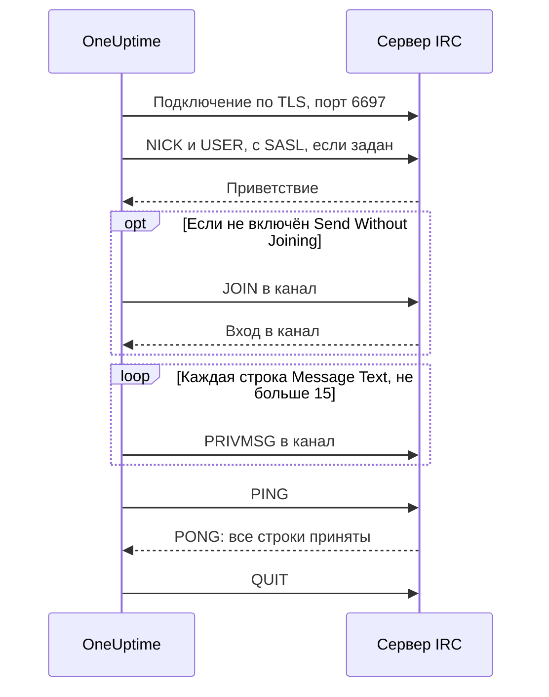

# Интеграция с IRC

Публикуйте обновления инцидентов в канале любой сети IRC: Libera.Chat, OFTC или на собственном сервере.

У IRC нет вебхуков, поэтому шаг рабочего процесса **Send Message to IRC** в OneUptime сам подключается к серверу, как любой IRC-клиент. Ничего не нужно устанавливать и не нужно регистрировать приложение. Эта интеграция **исходящая**: OneUptime пишет в канал и не читает, что в нём говорят.

:::cards
- [Как это работает](#как-это-работает): Что один запуск шага говорит серверу.
- [Настройка](#настройка-интеграции): Сервер и канал, пароли, затем рабочий процесс: из шаблона или с нуля.
- [Советы](#советы): Публикация без входа в канал, SASL, длинные сообщения и всплески.
- [Устранение неполадок](#устранение-неполадок): Что означают ошибки шага и что изменить.
:::

## Как это работает

Каждый запуск шага ведёт короткий разговор с сервером IRC, как это сделал бы IRC-клиент, а затем отключается.

1. **Подключение.** Шаг подключается по TLS к порту `6697` и проверяет сертификат сервера.
2. **Регистрация.** Он регистрируется как `OneUptime`, если вы не задали другой **Nickname**, и входит через SASL, когда заполнены **SASL Username** и **SASL Password**.
3. **Вход в канал.** Он входит в канал, если не включён **Send Without Joining**, с **Channel Key**, если у канала есть ключ.
4. **Отправка.** Каждая строка **Message Text** уходит отдельным сообщением IRC, командой `PRIVMSG`.
5. **Подтверждение.** IRC никогда не сообщает «доставлено», поэтому шаг отправляет `PING` и ждёт `PONG` от сервера. Сервер отвечает по порядку, так что к этому моменту любой отказ в приёме сообщения уже пришёл.
6. **Выход.** Он отключается от сервера.

Шаг переходит к выходу **Успешно**, как только сервер принял все строки. Он переходит к выходу **Ошибка**, с причиной словами самого сервера, если тот её назвал, когда сервер недоступен или отклоняет подключение, ник, пароль, канал или сообщение.

## Перед началом

- В OneUptime Cloud тариф **Growth** или выше: рабочие процессы и их переменные входят в него. У самостоятельно размещённых установок без биллинга нет ограничений тарифа.
- Роль, которая создаёт рабочие процессы: **Project Owner**, **Project Admin** или **Workflow Admin**.
- Учётная запись в сети IRC, если сеть требует входа. Libera.Chat требует его для подключений с некоторых облачных и VPN-адресов.

## Настройка интеграции

:::steps
### Выберите сервер и канал

Решите, куда пойдут сообщения: имя хоста сервера, например `irc.libera.chat`, и канал, например `#your-channel`.

- **IRC Server** принимает имя хоста и ничего больше: без `ircs://` и без порта. Шаг подключается по TLS к порту `6697`. Если ваш сервер принимает TLS на другом порту, укажите его в **Port**, в разделе **Дополнительные поля**.
- **Channel** должен быть каналом. Ник, введённый здесь, отклоняется, поэтому шаг никогда не отправит кому-то личное сообщение по ошибке.

Сервер должен быть таким, к которому OneUptime разрешено подключаться. Адреса loopback (`localhost`, `127.0.0.1`), link-local и облачных метаданных отклоняются всегда. В OneUptime Cloud отклоняется и сервер с адресом частной сети. Самостоятельно размещённая установка может подключаться к серверу IRC в своей сети, если `DATA_SOURCE_BLOCK_PRIVATE_ADDRESSES` не равен `true`.

### Сохраните пароли в секретных переменных

Пропустите этот шаг, если вашему серверу, сети и каналу не нужен пароль. Иначе сохраните каждый пароль в секретной [глобальной переменной](/docs/workflows/variables#глобальные-переменные). Тогда рабочий процесс хранит имя переменной вместо пароля, а менять пароль нужно только в одном месте.

| Настройка           | Заполните, когда                                                                              | Переменная, например  |
| ------------------- | --------------------------------------------------------------------------------------------- | --------------------- |
| **Server Password** | Сервер или ваш баунсер запрашивает пароль при подключении.                                    | `IRC_SERVER_PASSWORD` |
| **SASL Password**   | Сеть требует войти в вашу учётную запись. В **SASL Username** указывается имя учётной записи. | `IRC_SASL_PASSWORD`   |
| **Channel Key**     | У канала есть ключ (режим `+k`).                                                              | `IRC_CHANNEL_KEY`     |

Чтобы сохранить пароль, откройте **Рабочие процессы → Глобальные переменные** и нажмите **Создать: Рабочий процесс Переменная**. Введите имя в поле **Имя** и нажмите **Далее**. Вставьте пароль в **Содержимое**, включите **Секрет** и нажмите **Создать: Рабочий процесс Переменная**. В журналах запусков вместо значения секретной переменной показывается `[REDACTED]`.

### Создайте рабочий процесс

Начните с шаблона, который построит весь рабочий процесс за вас, или с нуля.

:::tabs
@tab Из шаблона
1. Откройте **Рабочие процессы** и нажмите **Создать рабочий процесс**.
2. Введите `IRC` в **Поиск шаблонов…**, нажмите **Tell IRC when an incident opens**, а затем **Использовать шаблон**.
3. Оставьте имя **Notify IRC on new incident** или измените его и нажмите **Далее**.
4. Укажите **IRC Server** и **IRC Channel** и нажмите **Создать рабочий процесс**.

Рабочий процесс откроется на странице **Конструктор** с тремя шагами: **On Create Incident**; **Send Message to IRC**, который публикует номер, заголовок, серьёзность и состояние инцидента в двух строках; и шаг **Журнал** на его выходе **Ошибка**, который записывает, почему сообщение не доставлено. Сервер и канал сохраняются как переменные рабочего процесса `ircServer` и `ircChannel`. Если на предыдущем шаге вы сохранили пароли, нажмите **Send Message to IRC**, откройте **Дополнительные поля** и выберите каждую переменную кнопкой **{ }** её настройки.
@tab С нуля
1. Откройте **Рабочие процессы**, нажмите **Создать рабочий процесс**, выберите **Начать с нуля**, задайте имя рабочего процесса и нажмите **Создать рабочий процесс**.
2. На странице **Конструктор** нажмите **Choose what starts this workflow** и выберите **On Create Incident** в разделе **Popular**. Нажмите на триггер и в **Select Fields** выберите поля инцидента, которые показывает ваше сообщение, например его заголовок.
3. Нажмите **Добавить компонент**, найдите `irc` и нажмите **Send Message to IRC**. Соедините выход **Успешно** триггера с этим шагом.
4. Нажмите на новый шаг и заполните **IRC Server**, **Channel** и **Message Text**. Кнопка **{ }** в **Message Text** вставляет поля инцидента, например его заголовок.
5. Если на предыдущем шаге вы сохранили пароли, откройте **Дополнительные поля**. В **Server Password**, **SASL Password** или **Channel Key** нажмите **{ }** и выберите переменную в разделе **Global variables**. Укажите имя вашей учётной записи в **SASL Username**.
:::

### Включите и проверьте

Включите переключатель **Включено** вверху страницы **Конструктор**. С этого момента каждый новый инцидент публикуется в канале.

Чтобы проверить, не открывая инцидент, нажмите **Запустить рабочий процесс** и укажите ID уже существующего инцидента в **ID инцидента**. Страница инцидента показывает его ID. Нажмите **Run Workflow Manually** и подтвердите кнопкой **Run**. Панель **Запуск рабочего процесса** следит за запуском: журнал шага IRC сообщает, сколько строк он отправил, например `Sent 2 lines to #your-channel.`, и сообщение появляется в канале. Если вместо этого шаг переходит к выходу **Ошибка**, его журнал объясняет почему: см. [Устранение неполадок](#устранение-неполадок).
:::

## Советы

- **Публикация без входа в канал.** Большинство каналов принимают сообщения только от своих участников (режим `+n`), поэтому шаг входит в канал перед публикацией и сразу после неё выходит. Канал с режимом `-n` принимает сообщения извне: включите **Send Without Joining** в разделе **Дополнительные поля**, и канал не увидит, как шаг приходит и уходит.
- **Вход через SASL.** В сетях, которые используют SASL, например Libera.Chat, заполните **SASL Username** и **SASL Password**, чтобы войти в свою учётную запись. Libera.Chat требует этого для подключений с некоторых облачных и VPN-адресов. См. [руководство Libera.Chat по SASL](https://libera.chat/guides/sasl).
- **Помните о пределе в 15 строк.** Каждая строка **Message Text** — отдельное сообщение IRC, длинная строка разбивается, чтобы поместиться, а пустые строки пропускаются. Сообщение отправляется не больше чем 15 строками IRC: более длинное обрезается, и его последняя строка говорит об этом. Первые четыре строки уходят сразу, а остальные по одной в секунду, в темпе IRC-клиентов, поэтому 15 строк занимают около 11 секунд.
- **Собирайте всплески в одно сообщение.** Каждый запуск — отдельное подключение, а сети IRC ограничивают, как часто один адрес может подключаться. Всплеск запусков может быть отклонён с причиной вроде `Reconnecting too fast` и переходит к выходу **Ошибка**, как любой другой отказ. Для рабочего процесса, который может срабатывать много раз в минуту, соберите всё, что он должен сказать, в одно сообщение или отправляйте его через собственный сервер.
- **Форматируйте кодами IRC.** В IRC нет Markdown, поэтому текст отправляется как написан. Коды форматирования IRC, например жирный шрифт и цвета, работают.
- **Сервер без TLS.** Включайте **Disable TLS** только для сервера, который не поддерживает TLS: тогда шаг подключается к порту `6667`, а любой пароль передаётся без шифрования. Чтобы доверять сертификату сервера от собственного центра сертификации, самостоятельно размещённая установка задаёт `NODE_EXTRA_CA_CERTS`.
- **Другой ник.** Сообщения приходят от `OneUptime`, если вы не задали **Nickname**. Если ник занят, шаг добавляет подчёркивание или число.

## Устранение неполадок

Когда шаг переходит к выходу **Ошибка**, журнал запуска объясняет почему, фразой, которая начинается как одна из этих.

:::details "The IRC server refused the connection"
Сервер или ваш баунсер отклонил подключение, и сообщение заканчивается его причиной. Если серверу нужен пароль, сообщение так и говорит: заполните **Server Password** или проверьте его.
:::

:::details "SASL sign-in failed"
Сеть отклонила учётную запись или пароль. Проверьте **SASL Username** и **SASL Password**.
:::

:::details "Could not join #your-channel"
Канал не впустил шаг по причине, которую называет сообщение. Каналу с ключом нужен этот ключ в **Channel Key**.
:::

:::details "Could not send to #your-channel"
Сервер отклонил сообщение по причине, которую называет текст ошибки. Если включён **Send Without Joining**, канал, возможно, принимает сообщения только от своих участников: выключите эту настройку.
:::

:::details "The TLS certificate of the IRC server … is not trusted"
Сертификат сервера не входит в те, которым доверяет OneUptime. Самостоятельно размещённая установка может доверять собственному центру сертификации через `NODE_EXTRA_CA_CERTS`. Включайте **Disable TLS** только для сервера, который не поддерживает TLS.
:::

## Что дальше

:::cards
- [Компоненты → IRC](/docs/workflows/components#irc): Каждая настройка шага и что означают его выходы.
- [Переменные](/docs/workflows/variables#глобальные-переменные): Секретные глобальные переменные и как шаги их используют.
- [Запуски](/docs/workflows/runs-and-logs): Посмотрите, что сделал каждый запуск рабочего процесса.
- [Обзор интеграций](/docs/integrations/index): Исходящий шаблон и другие инструменты, которые можно подключить.
:::
