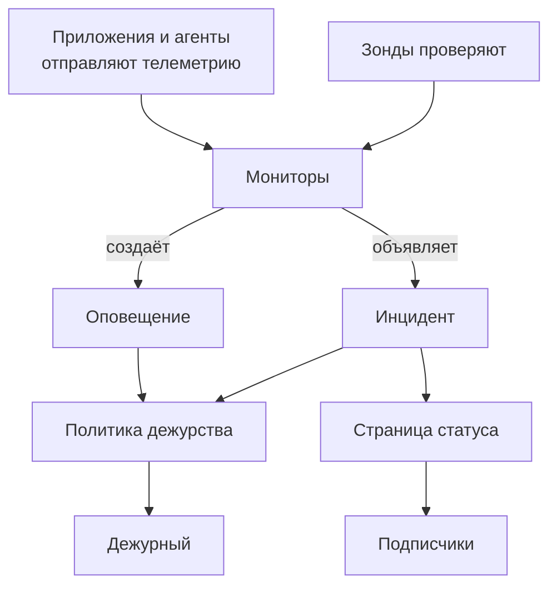

# Основные понятия

У OneUptime много продуктов, но все они держатся на нескольких идеях: проекты, мониторы, инциденты и оповещения, дежурства, страницы статуса и телеметрия. Эта страница объясняет каждую идею в нескольких предложениях, показывает, как они связаны, и ведёт к страницам, где о них рассказано подробно. Прочитайте её один раз, и все остальные страницы документации будут читаться легче.

:::cards
- [Проекты и люди](#проекты-и-люди): Где всё хранится и кому что можно.
- [Мониторы и зонды](#мониторы-и-зонды): Как OneUptime замечает, что что-то не так.
- [Инциденты и оповещения](#инциденты-и-оповещения): Запись, с которой работает ваша команда.
- [Дежурства](#дежурства): Кого вызывают, как и кто следующий.
:::

## Как связаны части

Проблема движется через OneUptime в одном направлении. Зонды и ваша собственная телеметрия питают мониторы. Критерии монитора решают, когда что-то не так и что открыть: инцидент, оповещение или и то и другое. Политики дежурства вызывают людей, а страницы статуса сообщают клиентам об инцидентах.

## Проекты и люди

**Проект** содержит всё: мониторы, инциденты, политики дежурства, страницы статуса, телеметрию и настройки. Большинству компаний нужен один проект, некоторые заводят по проекту на каждое окружение или подразделение. Ничто из созданного в одном проекте не видно в другом.

Ваша **учётная запись** отделена от проектов. Одна учётная запись, с одной почтой и одним паролем, может состоять в любом числе проектов; переключайтесь между ними через выбор проекта в левом верхнем углу. См. [Ваша учётная запись](/docs/introduction/your-account).

Люди состоят в проекте через **команды**, и разрешения команды определяют, что могут делать её участники. Каждый новый проект начинается с трёх команд: Owners, куда входите вы, Admin и Members. В OneUptime Cloud у каждого проекта свой тариф.

:::cards
- [Пользователи, команды и разрешения](/docs/permissions/index): Приглашать людей и решать, что им можно делать.
:::

## Мониторы и зонды

**Монитор** проверяет одну вещь, которую вы эксплуатируете, и решает, работает ли она. Большинство мониторов проверяют **зонды**: машины, которые выполняют проверку по расписанию, например запрашивают страницу, вызывают API, пингуют хост или выполняют запрос к базе данных. OneUptime Cloud запускает зонды в нескольких регионах, самостоятельная установка запускает свои, а вы можете добавить собственные зонды внутри своей сети. Другие мониторы вместо этого читают то, что вы отправляете: телеметрию ваших приложений или данные, которые агент передаёт с ваших серверов, кластеров Kubernetes и остальной инфраструктуры.

**Критерии** монитора решают, что значит каждый результат. Они проверяются по порядку, и первый подошедший может изменить состояние монитора, объявить инцидент, создать оповещение или всё сразу. В каждом новом проекте есть три состояния монитора: **Работает**, **Деградация** и **Не в сети**.

:::cards
- [Создание монитора](/docs/monitor/create-monitor): Выбрать тип, указать, что проверять и как часто.
- [Пользовательские probes](/docs/probe/custom-probe): Проверять то, до чего может дотянуться только ваша сеть.
:::

## Инциденты и оповещения

Оба фиксируют проблему, и оба могут вызвать дежурного. Различаются они тем, кого затрагивает проблема.

| | Инцидент | Оповещение |
| --- | --- | --- |
| **Что это** | Проблема, которая затрагивает ваших пользователей, например сбой или замедление | Проблема, которую команде стоит изучить, пока пользователи не пострадали |
| **На страницах статуса** | Может появиться и уведомляет подписчиков | Никогда |
| **Начальные состояния** | **Identified**, **Подтверждён**, **Устранён** | **Identified**, **Подтверждён**, **Устранён** |
| **Начальные уровни серьёзности** | Critical Incident, Major Incident, Minor Incident | **High**, **Low** |

Подтверждение говорит, что кто-то занимается проблемой, и не даёт политикам дежурства вызывать следующий уровень. Устранение закрывает её. Вы можете добавить свои состояния и уровни серьёзности и связать оповещения с инцидентом, частью которого они оказались.

**Эпизод** объединяет связанные инциденты или связанные оповещения, чтобы команда работала с ними как с одним целым. Правила группировки решают, что относится друг к другу.

:::cards
- [Обзор инцидентов](/docs/incidents/index): Как инциденты объявляют, разбирают и устраняют.
- [Связанные оповещения](/docs/incidents/linked-alerts): Связать оповещения, вызванные сбоем, с его инцидентом.
:::

## Дежурства

**Политика дежурства** решает, кого вызывать по инциденту или оповещению и кто следующий, если никто не ответил. Её **правила эскалации** — это уровни: каждый вызывает своих людей и ждёт, пока кто-то подтвердит, прежде чем вызвать следующий уровень. Уровень может вызывать людей, команды или **расписание дежурств** — ротацию, которая в любой момент знает, кто дежурит.

Как связываться с каждым человеком, решает он сам. В разделе **Настройки пользователя** каждый хранит способы, которыми OneUptime может с ним связаться, например почту, SMS, звонки, push-уведомления, Slack или Microsoft Teams, и какие из них использовать при вызове.

:::cards
- [Правила эскалации](/docs/on-call/escalation-rules): Вызывать людей уровень за уровнем, пока кто-то не ответит.
- [Расписания дежурств](/docs/on-call/schedules): Ротации, слои и передача смен.
:::

## Страницы статуса и обслуживание

**Страница статуса** показывает клиентам, работают ли ваши сервисы. Вы выбираете, какие мониторы она показывает, под понятными клиентам названиями. Пока на одном из этих мониторов активен инцидент, страница его показывает, а её **подписчики** получают уведомление по почте, SMS, в Slack, Microsoft Teams или через вебхук. Страница статуса может быть публичной или закрытой для всех, кроме тех, кого вы впустите.

**Плановое обслуживание** заранее объявляет о запланированных работах. Событие проходит состояния **Запланировано**, **Продолжается**, **Закончено** и **Завершено**, а страницы статуса, на которых вы его показываете, сообщают о нём посетителям и подписчикам.

:::cards
- [Обзор страниц статуса](/docs/status-pages/index): Создать страницу статуса и решить, что она показывает.
- [Подписчики и объявления](/docs/status-pages/subscribers): Кого и когда уведомляют.
:::

## Телеметрия

**Телеметрия** — то, что ваши системы отправляют в OneUptime: логи, метрики, трассировки, исключения и профили. Приложения отправляют её через OpenTelemetry, а агенты OneUptime — с хостов, кластеров Kubernetes, хостов Docker и остальной инфраструктуры. Каждый отправитель использует **ключ приёма**, который создаётся в разделе **Настройки проекта → Телеметрия и APM → Ключи приема**. Вы ищете по телеметрии, выводите её на дашборды и следите за ней мониторами телеметрии, которые открывают инциденты и оповещения, как любой другой монитор.

:::cards
- [OpenTelemetry](/docs/telemetry/open-telemetry): Отправлять логи, метрики и трассировки из ваших приложений.
- [Мониторинг журналов](/docs/monitor/logs-monitor): Узнавать, когда в логах появляется шаблон.
:::

## Автоматизация и ИИ

- **Рабочие процессы** выполняют действия, когда что-то происходит, например отправляют сообщение в Slack, когда объявлен инцидент.
- **Сборники инструкций** превращают процедуру реагирования в шаги, которые команда выполняет вручную или автоматически.
- **OneUptime AI** расследует новые инциденты и оповещения и публикует находки в их хронологии, а **Ask AI** отвечает на вопросы о вашем проекте. Новый проект начинается с включённым ИИ; переключатель **Включить ИИ** в разделе **Настройки проекта → ИИ → AI Features** выключает всё сразу.

:::cards
- [Обзор рабочих процессов](/docs/workflows/index): Автоматизировать действия с помощью триггеров и компонентов.
- [AI SRE](/docs/ai/ai-sre): Как OneUptime AI расследует инциденты и оповещения.
:::

## Метки и владельцы

**Метки** — это теги, которые вы ставите на мониторы, инциденты, страницы статуса и большинство других ресурсов, чтобы фильтровать и группировать их. Разрешения команды можно ограничить ресурсами с определёнными метками. **Владельцы** — люди и команды, отвечающие за один ресурс: их уведомляют, когда с ним что-то происходит. Правила меток и правила владельцев сами добавляют метки и владельцев новым ресурсам.

:::cards
- [Правила меток и владельцев](/docs/configuration/label-and-owner-rules): Автоматически назначать новым ресурсам метки и владельцев.
:::

## Дальнейшие шаги

:::cards
- [Быстрый старт](/docs/introduction/quickstart): Применить эти идеи на практике за пятнадцать минут.
- [Главная страница и сочетания клавиш](/docs/introduction/home): Найти каждый продукт в панели.
- [Создание монитора](/docs/monitor/create-monitor): Ваш первый монитор, поле за полем.
- [Обзор инцидентов](/docs/incidents/index): Что происходит после того, как монитор объявил инцидент.
:::
