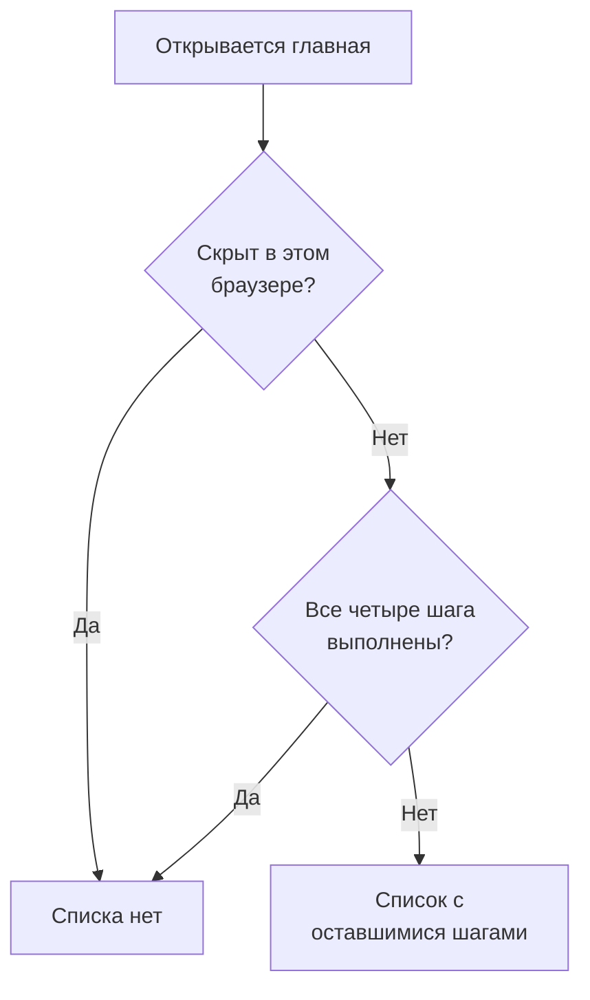

# Главная страница и сочетания клавиш

Главная — первая страница, которую вы видите в проекте. Она с одного взгляда показывает, требует ли что-то вашего внимания прямо сейчас, и проводит новый проект через первую настройку. Здесь описано, что показывает главная страница, как найти любой продукт, страницу или действие в панели и какие сочетания клавиш избавляют от лишних переходов по меню.

:::cards
- [Что показывает главная страница](#что-показывает-главная-страница): Приветственный список, пять плиток и активные инциденты.
- [Как ориентироваться](#как-ориентироваться): Меню «Продукты» и панели вверху каждой страницы.
- [Поиск](#поиск-страницы-настройки-или-действия): Найти любую страницу, настройку или действие, набрав название.
- [Сочетания клавиш](#сочетания-клавиш): Перейти на главную, к мониторам или инцидентам двумя клавишами.
:::

## Что показывает главная страница

Откройте **Главная** на панели вверху или нажмите `g`, а затем `h` из любого места. Сверху вниз главная страница показывает:

1. **Добро пожаловать в OneUptime 👋** — список для нового проекта, пока он не выполнен.
2. Пять плиток, которые считают то, что требует внимания.
3. **Активные инциденты** — все инциденты, которые ещё не устранены.

### Приветственный список

Список проводит вас через четыре вещи, которые нужны проекту, чтобы стать полезным. Каждый шаг открывает страницу, где он выполняется, и отмечается сам, когда в проекте появляется то, о чём он просит.

| Шаг | Выполнен, когда | Открывает |
| --- | --- | --- |
| **Создайте первый монитор** | В проекте есть монитор. | Форму **Создать монитор** или список **Мониторы** для того, кто не может создавать мониторы. |
| **Опубликуйте страницу статуса** | В проекте есть страница статуса. | **Страницы состояния** |
| **Пригласите команду** | Кроме вас, в проекте есть кто-то ещё или кто-то приглашён. | **Пользователи** |
| **Настройте политику дежурств** | В проекте есть политика дежурства. | **Дежурство** |

Под шагами блок **Как работает OneUptime** показывает четыре основных продукта в том порядке, в каком через них проходит проблема: **Мониторы**, **Инциденты и оповещения**, **Дежурство** и **Страницы состояния**. Нажмите на любой, чтобы открыть его.

Список исчезает, когда все четыре шага выполнены. Чтобы скрыть его раньше, нажмите **Скрыть**. Это запоминается в этом браузере для этого проекта; всё, что открывают шаги, по-прежнему доступно в меню **Продукты**.

### Плитки

Каждая плитка что-то считает, говорит, нужно ли ваше внимание, и открывает список, стоящий за числом.

| Плитка | Что считает | Когда число равно нулю |
| --- | --- | --- |
| **Активные инциденты** | Неустранённые инциденты | **Всё в порядке** |
| **Активные оповещения** | Неустранённые оповещения | **Всё в порядке** |
| **Неработающие мониторы** | Мониторы, состояние которых не относится к рабочим. Архивные мониторы не учитываются. | **Все работают** |
| **Текущее обслуживание** | Идущие сейчас события планового обслуживания | **Сейчас нет** |
| **SLO под угрозой** | Включённые SLO, которые под угрозой или израсходовали бюджет ошибок | **Бюджеты в норме** |

Если число больше нуля, плитка показывает **Требует внимания**, а плитки обслуживания и SLO — **Идёт сейчас** и **Бюджет расходуется**. Проект без мониторов видит на плитке мониторов **Мониторов пока нет**, а проект без SLO — **SLO пока нет**: пустой проект — не то же самое, что здоровый. Тогда эти две плитки открывают списки **Мониторы** и **SLOs**, где вы создаёте первый.

### Боковое меню главной страницы

В боковом меню рядом с главной страницей те же списки, у каждого есть счётчик:

| Раздел | Страницы |
| --- | --- |
| **Инциденты** | **Активные инциденты** и **Активные эпизоды** |
| **Оповещения** | **Активные оповещения** и **Активные эпизоды** |
| **Мониторы** | **Не работает** |
| **Запланированные события** | **Продолжается** |

Эпизод объединяет связанные инциденты или оповещения, чтобы вы работали с ними как с одним целым. См. [Основные понятия](/docs/introduction/core-concepts#инциденты-и-оповещения).

## Как ориентироваться

Всё в OneUptime находится в меню **Продукты** на верхней панели. Меню показывает свои группы как строки одного списка и всегда открывается с первой из них, основными, в развёрнутом виде: Мониторы, Инциденты, Оповещения, Дежурство, Страницы статуса, Плановое обслуживание и SLOs. Каждая из остальных групп (Наблюдаемость, AI, Код, Ресурсы, Инфраструктура, Дашборды и автоматизация и Настройки) свёрнута в строку того же списка. Каждая строка называет продукты группы и говорит, сколько их. Нажмите на строку, чтобы развернуть или свернуть её, или перейдите к ней стрелками и нажмите **Enter**.

- **Поиск находит всё.** Начните печатать в поле поиска меню, чтобы найти любой продукт по названию, по тому, что он делает, или по знакомому слову вроде `k8s` или `RUM`. Поиск заглядывает и в свёрнутые группы.
- **Вы начинаете там, где находитесь.** Группа страницы, на которой вы находитесь, разворачивается сама, а недавно открытые продукты перечислены вверху.
- **Ваш выбор сохраняется.** Меню запоминает в вашем браузере, какие из остальных групп вы развернули или свернули. Основные снова развёрнуты при каждом открытии меню, даже если вы их сворачивали.
- **На телефоне** кнопка меню показывает продукты так же: основные развёрнуты вверху, а каждая другая группа — одна строка, которая открывается касанием.

### Панели вверху

По верху каждой страницы проходят две панели.

| Где | Что там |
| --- | --- |
| Слева вверху | Выбор проекта: переключиться на другой ваш проект или создать новый. |
| Справа вверху | **Поиск** и **Ask AI**, колокольчик уведомлений с тем, что ждёт вас сейчас (активные инциденты и оповещения, политики дежурства, где вы на смене, ожидающие приглашения), **Справка** и ваше фото, которое открывает меню вашей [учётной записи](/docs/introduction/your-account). |
| Под ними | **Главная** и **Продукты** слева, **Настройки пользователя** справа: как OneUptime связывается с вами в этом проекте. |

**Справка** открывает эту документацию (**Документация**) и список **Keyboard shortcuts**, а также предлагает поддержку по почте и в Slack. На узком экране, например на телефоне, **Поиск**, **Ask AI** и **Справка** убираются, чтобы сэкономить место; колокольчик и ваше фото остаются.

## Поиск страницы, настройки или действия

Нажмите **Cmd+K** (Mac) или **Ctrl+K** (Windows и Linux) или значок поиска на верхней панели и начните печатать. Поиск находит:

- **Каждую страницу в меню** под тем названием, которое дало ей меню: Ключи API, Опасная зона, Расписания дежурств, Серьёзность инцидента, ваши собственные Методы уведомлений. Каждый результат показывает, где он находится, например *Настройки проекта › Расширенный*, так что страницы с одинаковым названием (Пользовательские поля в инцидентах, оповещениях и мониторах) легко различить.
- **Действия** — по тому, что вы хотите сделать: Объявить инцидент, Создать монитор или Delete Project, которое открывает Опасную зону. Действие, которое что-то меняет, предлагается только тем, кому оно разрешено.
- **Ваши мониторы, инциденты, оповещения, страницы статуса и политики дежурства** — по названию.

Поиск понимает то, что вы печатаете, так, как вы это имеете в виду:

- Регистр, диакритика, пробелы и дефисы не важны: *on-call*, *on call* и *oncall* находят одни и те же страницы, а слова можно писать в любом порядке.
- Он знает другие слова для многих страниц, на английском: *pager* или *escalation* для политик дежурства, *rota* для расписаний дежурств, *2fa* для двухфакторной аутентификации, *delete project* для Опасной зоны.
- Добавьте название продукта, чтобы сузить поиск: *incident custom fields* находит страницу пользовательских полей инцидентов.
- Небольшая опечатка, например *incidnet*, всё равно находит то, что вы имели в виду, если точных совпадений нет.

Когда поле поиска пустое, поиск показывает недавно открытые страницы, действия и продукты.

## Сочетания клавиш

Нажмите `?` в любом месте панели, чтобы увидеть все сочетания клавиш, или откройте **Справка** и выберите **Keyboard shortcuts**. На Mac `Mod` — это клавиша Command, в Windows и Linux — Ctrl.

| Клавиши | Что делают |
| --- | --- |
| `Mod` + `K` | Открыть палитру команд: найти любую страницу, настройку или действие. |
| `Mod` + `I` | Спросить ИИ о том, что вы сейчас смотрите. |
| `/` | Искать в списке на этой странице. |
| `?` | Показать сочетания клавиш. |
| `Esc` | Закрыть диалог или панель. |

### Переход к продукту

Нажмите `g`, а затем букву, чтобы сразу перейти к продукту. Букву нужно нажать в течение полутора секунд после `g`.

| Клавиши | Куда ведут |
| --- | --- |
| `g`, затем `h` | Главная |
| `g`, затем `m` | Мониторы |
| `g`, затем `i` | Инциденты |
| `g`, затем `a` | Оповещения |
| `g`, затем `o` | Дежурство |
| `g`, затем `s` | Страницы статуса |
| `g`, затем `e` | Плановое обслуживание |
| `g`, затем `d` | Дашборды |
| `g`, затем `l` | Логи |
| `g`, затем `t` | Трассировка |

Сочетания клавиш не мешают работе. `?`, `/` и `g` ничего не делают, пока вы печатаете в поле, и ничто не уводит со страницы, пока открыт диалог, так что случайное нажатие не лишит вас наполовину заполненной формы. Любой другой продукт — в одном поиске от вас через `Mod` + `K`.

## Дальнейшие шаги

:::cards
- [Быстрый старт](/docs/introduction/quickstart): Пройти приветственный список шаг за шагом.
- [Ваша учётная запись](/docs/introduction/your-account): Профиль, безопасность входа, язык и тема.
- [Спросить ИИ](/docs/ai/ask-ai): На что Ask AI может ответить и что может для вас сделать.
- [Основные понятия](/docs/introduction/core-concepts): Что такое мониторы, инциденты, оповещения и дежурства.
:::
