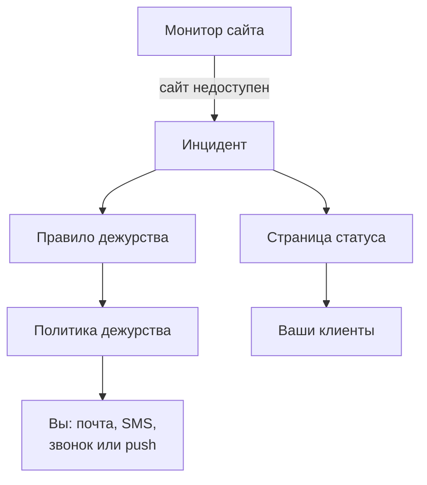

# Быстрый старт

Это руководство примерно за пятнадцать минут проведёт вас от новой учётной записи к работающей настройке: монитор проверяет ваш сайт каждые пять минут, политика дежурства вызывает вас, когда сайт падает, а страница статуса сообщает об этом клиентам. Руководство следует списку **Добро пожаловать в OneUptime 👋** на главной странице вашего проекта.

## Перед началом

- **Учётная запись.** В OneUptime Cloud зарегистрируйтесь на [oneuptime.com](https://oneuptime.com/accounts/register) и откройте ссылку из письма, которое придёт. В своей установке откройте её в браузере и зарегистрируйтесь: первая учётная запись становится главным администратором. Как установить OneUptime, описано в разделе [Docker Compose](/docs/installation/docker-compose).
- **Сайт, за которым нужно следить.** Любой адрес, который отвечает по HTTP или HTTPS, например главная страница вашей компании.

## Создайте проект

В OneUptime всё находится в проекте: мониторы, инциденты, политики дежурства, страницы статуса и люди, которые с ними работают.

:::steps
### Начните новый проект

При первом входе OneUptime показывает **Нет проектов**. Нажмите **Создать новый проект**. Если кто-то уже пригласил вас в проект, примите приглашение на той же странице.

### Дайте ему имя

Введите **Имя проекта**, например название вашей компании. В OneUptime Cloud на следующем шаге нужно выбрать тариф.

### Создайте его

Нажмите **Создать проект**. Откроется главная страница проекта со списком **Добро пожаловать в OneUptime 👋** вверху.
:::

## Отслеживайте свой сайт

:::steps
### Откройте создание монитора

В списке нажмите **Создайте первый монитор**. Можно также открыть **Мониторы** в меню **Продукты** и нажать **Создать монитор**.

### Выберите веб-сайт

В поле **Тип монитора** выберите **Веб-сайт**. Введите **Имя**, например `Website`, и нажмите **Далее**.

### Введите адрес

Введите полный адрес сайта в поле **URL веб-сайта**, например `https://example.com`. OneUptime сам добавит критерии: монитор переходит в состояние **Не в сети** и объявляет инцидент, когда сайт не отвечает или отвечает ошибкой. Нажмите **Далее**.

### Создайте монитор

Оставьте выбранные **Зонды** и **Интервал мониторинга** **Каждые 5 минут** и нажмите **Создать монитор**. Откроется страница монитора, и зонды начнут проверять ваш сайт.
:::

Чтобы проверить работу до сохранения, нажмите **Протестировать монитор** на втором шаге. Все остальные типы мониторов описаны в разделе [Создание монитора](/docs/monitor/create-monitor).

## Получайте вызов при сбое

Сейчас инцидент без владельцев отправляется по почте владельцам проекта, и вы в их числе. Чтобы вас вызывали, пока кто-нибудь не ответит, создайте политику дежурства и сделайте так, чтобы её запускал каждый инцидент.

:::steps
### Создайте политику дежурства

В списке нажмите **Настройте политику дежурств** или откройте **Дежурство** в меню **Продукты**. Нажмите **Создать: Политика дежурства** и введите **Имя**. В разделе **Кого оповестить первым?** нажмите **Добавить получателя** и выберите себя. Нажмите **Создать: Политика дежурства**.

### Запускайте её для каждого инцидента

Откройте **Инциденты** в меню **Продукты**, разверните **Правила** в боковом меню и выберите **Правила дежурства**. Нажмите **Создать: Incident On-Call Rule**, введите **Имя** и нажмите **Далее**. Оставьте **Критерии совпадения** пустыми, чтобы правило подходило к любому инциденту, и нажмите **Далее**. Выберите свою политику в поле **Политики дежурства** и нажмите **Создать: Incident On-Call Rule**.

### Выберите, как с вами связываться

Почта, с которой вы входите, уже служит способом связаться с вами. Чтобы получать ещё и SMS или звонки, откройте **Настройки пользователя** на панели под верхней панелью, перейдите в **Методы уведомлений** и на вкладке **Direct Contact** добавьте свой номер в разделе **Номера телефонов для SMS-уведомлений** или **Номера телефонов для уведомлений по звонку**. Нажмите **Подтвердить** и введите код, который пришлёт OneUptime. Подтверждённый номер сразу используется для вызовов дежурства.
:::

> [!NOTE]
> SMS и телефонные звонки в новом проекте выключены. Владелец проекта, Billing Admin или человек с правом Manage Billing включает их в карточке **Каналы уведомлений** в разделе **Настройки проекта → Уведомления → Настройки уведомлений**.

Об уровнях, ротациях и о том, сколько ждёт каждый уровень, читайте в разделах [Правила эскалации](/docs/on-call/escalation-rules) и [Расписания дежурств](/docs/on-call/schedules).

## Опубликуйте страницу статуса

:::steps
### Создайте страницу статуса

В списке нажмите **Опубликуйте страницу статуса** или откройте **Страницы состояния** в меню **Продукты**. Нажмите **Создать страницу статуса**, введите **Имя**, например `Acme Status`, и нажмите **Создать страницу статуса**.

### Добавьте свой монитор

Откройте новую страницу статуса. В её боковом меню в разделе **Ресурсы** выберите **Мониторы**; в проектах с включёнными группами мониторов этот пункт называется **Ресурсы**. Нажмите **Добавить монитор**, выберите монитор сайта и нажмите **Добавить монитор**. Строка показывает посетителям имя монитора; при желании измените его в поле **Отображаемое имя**.

### Откройте страницу

Выберите **Обзор** в боковом меню. Карточка **Status Page Preview URL** ведёт на вашу страницу статуса: откройте её, и ваш сайт будет показан как работающий.
:::

Новая страница статуса публична: открыть её может любой, у кого есть адрес. Как подключить свой домен, логотип и цвета, описано в разделе [Оформление и домены страницы статуса](/docs/status-pages/branding-and-domains).

## Пригласите команду

В списке нажмите **Пригласите команду** или откройте **Пользователи** в меню **Продукты**, в группе **Настройки**. Нажмите **Пригласить пользователя**, в поле **Электронная почта** введите адрес человека, а в поле **Команда** выберите команду: изначально выбрана команда участников. Нажмите **Пригласить**. OneUptime отправит приглашение по почте, а команда определяет, что человеку можно делать. См. [Пользователи, команды и разрешения](/docs/permissions/index).

## Проверьте

Объявите тестовый инцидент, чтобы увидеть всю цепочку в работе.

:::steps
### Объявите тестовый инцидент

Откройте **Инциденты** и нажмите **Объявить инцидент**. Введите **Заголовок**, например `Test incident`, выберите **Серьёзность инцидента** и нажмите **Далее**. В поле **Мониторы** выберите монитор сайта, чтобы инцидент появился на вашей странице статуса. Нажимайте **Далее**, пока не дойдёте до сводки, затем нажмите **Объявить инцидент**.

### Посмотрите, что произойдёт

В течение минуты-двух ваша политика дежурства вызовет вас, а инцидент появится на странице статуса.

### Устраните его

На странице инцидента нажмите **Устранить**. Вызовы прекратятся, и инцидент исчезнет со страницы статуса.
:::

> [!WARNING]
> Любой, кто откроет вашу страницу статуса, увидит тестовый инцидент, пока вы его не устраните. Проводите проверку до того, как поделитесь адресом страницы.

## Устранение неполадок

:::details Меня не вызвали
Откройте инцидент и выберите **Выполнения дежурств** в его боковом меню: там видно, запустилась ли ваша политика и кого она вызвала. Если не запустилась, проверьте, что правило дежурства включено и указывает эту политику. Если запустилась, проверьте, что ваши методы в разделе **Настройки пользователя → Методы уведомлений** подтверждены.
:::

:::details Инцидента нет на моей странице статуса
Страница статуса показывает инцидент, когда один из мониторов инцидента есть на странице. Проверьте, что в затронутых ресурсах инцидента указан ваш монитор и что монитор есть на странице статуса.
:::

:::details Монитор показывает, что сайт не в сети, но сайт работает
Откройте монитор и посмотрите, что получили зонды. См. раздел об устранении неполадок в статье [Мониторинг веб-сайта](/docs/monitor/website-monitor).
:::

## Дальнейшие шаги

:::cards
- [Основные понятия](/docs/introduction/core-concepts): Идеи, на которых держится то, что вы только что настроили.
- [Расписания дежурств](/docs/on-call/schedules): Распределить дежурства по команде.
- [Оформление и домены страницы статуса](/docs/status-pages/branding-and-domains): Сделать страницу статуса своей.
- [OpenTelemetry](/docs/telemetry/open-telemetry): Отправлять логи, метрики и трассировки из ваших приложений.
:::
