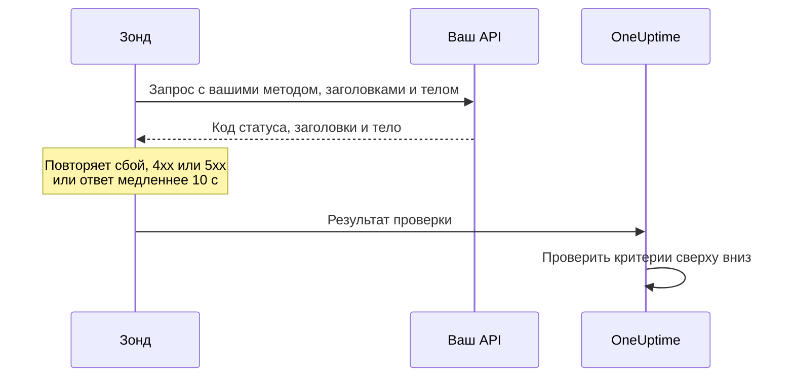

# Мониторинг API

Монитор API вызывает HTTP-эндпоинт по расписанию с выбранными вами методом, заголовками и телом и проверяет, что возвращается: код статуса, время ответа, заголовки и тело. Используйте его для эндпоинтов REST, JSON и GraphQL, проверок работоспособности и любых вызовов, от которых зависят ваши пользователи.

:::cards
- [Создать монитор](#создание-монитора-api): Шесть шагов в панели управления.
- [Параметры конфигурации](#параметры-конфигурации): Метод, заголовки, тело, перенаправления, сертификаты, тайм-ауты и повторные попытки.
- [Критерии мониторинга](#критерии-мониторинга): Что сразу считается работающим или упавшим.
- [Устранение неполадок](#устранение-неполадок): Когда не проходит проверка, которая должна проходить.
:::

## Как это работает

При каждой проверке зонд отправляет запрос, следует перенаправлениям и записывает код статуса, время ответа, заголовки и тело. Запрос, который завершается ошибкой, превышает тайм-аут, отвечает статусом `4xx` или `5xx` или длится дольше 10 секунд, повторяется — столько раз, сколько повторных попыток вы разрешили. Затем OneUptime пропускает результат через критерии монитора.



Зонд, потерявший собственное сетевое подключение, не сообщает никакого результата, поэтому не может пометить ваш API как не в сети.

## Перед началом

- **Роль, которая может создавать мониторы**: Project Owner, Project Admin, Project Member, Monitor Admin или Monitor Member либо пользовательская роль с разрешением Create Monitor.
- **Зонд, который может достучаться до API.** Зонды проекта по умолчанию выбираются для каждого нового монитора. Если перед API стоит брандмауэр, разрешите [IP-адреса зондов OneUptime Cloud](/docs/configuration/ip-addresses). API в частной сети нужен [пользовательский зонд](/docs/probe/custom-probe) внутри этой сети с разрешением обращаться к частным адресам: см. [Доступ к частной сети](/docs/self-hosted/private-network-access).
- **Учётные данные как секреты монитора.** Если API нужен ключ или токен, сначала сохраните его как [секрет монитора](/docs/monitor/monitor-secrets), чтобы монитор хранил только ссылку на него.

## Создание монитора API

:::steps
### Начните новый монитор

Перейдите в **Мониторы** и нажмите **Создать монитор**. В **Тип монитора** выберите **API**.

### Назовите его

Введите **Имя**, например `Orders API`, и нажмите **Далее**.

### Введите запрос

В **URL API** введите полный URL эндпоинта, например `https://api.example.com/health`. Выберите **Тип запроса API** (**GET**, если вы его не измените). Чтобы добавить заголовки или тело, откройте **Дополнительные поля** и заполните **Заголовки запроса** и **Тело запроса (в формате JSON)**.

### Протестируйте его

Нажмите **Протестировать монитор**, выберите зонд в **Выберите зонд** и нажмите **Запустить тест**. **Результат теста монитора** показывает, что ответил API.

### Проверьте критерии

**Критерии монитора** начинаются с [критериев по умолчанию](#критерии-по-умолчанию): не в сети, когда API не отвечает или отвечает ошибкой, в сети при любом статусе `2xx` или `3xx`. Чтобы проверять и то, что возвращает API, добавьте фильтр и нажмите **Далее**.

### Выберите зонды и создайте

Оставьте или измените **Зонды** и **Интервал мониторинга** (он начинается с **Каждые 5 минут**) и нажмите **Создать монитор**. Откроется страница монитора.
:::

## Параметры конфигурации

### URL API

Вызываемый эндпоинт в виде полного URL со схемой, например `https://api.example.com/v1/health`. В URL можно вставить [секрет монитора](/docs/monitor/monitor-secrets) как `{{monitorSecrets.NAME}}`.

### Динамические плейсхолдеры в URL

Когда перед API стоит CDN или кэширующий прокси, зонд может получить ответ из кэша, а не от вашего сервера. Чтобы обойти кэш, добавьте в URL плейсхолдер; зонд заменяет его новым значением при каждой проверке.

| Плейсхолдер | Заменяется на | Пример значения |
| --- | --- | --- |
| `{{timestamp}}` | Текущее время Unix в секундах | `1719500000` |
| `{{random}}` | Случайную уникальную строку из 32 шестнадцатеричных символов | `3f2b8c1d9e7a4b6c8d0e1f2a3b4c5d6e` |

URL с плейсхолдером:

```text
https://api.example.com/health?cb={{timestamp}}
```

Что запрашивает зонд при двух проверках с интервалом в пять минут:

```text
https://api.example.com/health?cb=1719500000
https://api.example.com/health?cb=1719500300
```

`{{random}}` используется так же: `https://api.example.com/health?nocache={{random}}`.

### Тип запроса API

HTTP-метод, который отправляется. **GET** используется по умолчанию; остальные — **POST**, **PUT**, **PATCH**, **DELETE** и **HEAD**. Если на запрос **HEAD** приходит ответ со статусом `4xx` или `5xx`, зонд повторяет его как `GET`.

### Дополнительные поля

Эти настройки свёрнуты в разделе **Дополнительные поля**. Свёрнутый заголовок перечисляет их и показывает, какие вы изменили.

| Поле | По умолчанию | Что делает |
| --- | --- | --- |
| **Заголовки запроса** | Нет | Отправляемые заголовки в виде пар имени и значения. Нажмите **Добавить: Request Header** для каждого. |
| **Тело запроса (в формате JSON)** | Нет | JSON-объект, отправляемый как тело, обычно с **POST**, **PUT** или **PATCH**. Должен быть корректным JSON. |
| **Не следовать перенаправлениям** | Выкл. | Оценивать первый ответ, а не следовать перенаправлениям. См. [ниже](#не-следовать-перенаправлениям). |
| **Разрешить самоподписанные сертификаты** | Выкл. | Пропускать проверку TLS-сертификата для собственного имени хоста монитора. |
| **Использовать клиентский сертификат (mTLS)** | Выкл. | Предъявлять клиентский сертификат и закрытый ключ. См. [Клиентский сертификат (mTLS)](#клиентский-сертификат-mtls). |
| **Тайм-аут запроса (секунды)** | `60` | Сколько ждать каждую попытку. Максимум — 60 секунд. |
| **Повторные попытки при сбое** | Значение зонда по умолчанию, обычно `3` | Сколько раз повторять неудачную попытку. Максимум — 3. См. [Повторные попытки и тайм-ауты](#повторные-попытки-и-тайм-ауты). |

В заголовках и теле запроса можно использовать [секреты монитора](/docs/monitor/monitor-secrets), например заголовок `Authorization` со значением `Bearer {{monitorSecrets.ApiKey}}`.

#### Не следовать перенаправлениям

По умолчанию зонд следует перенаправлениям (`301`, `302`, `303`, `307` и `308`), не более 10, и оценивает ответ, на котором оказывается. Включите **Не следовать перенаправлениям**, чтобы вместо этого оценивать сам ответ с перенаправлением. [Критерии по умолчанию](#критерии-по-умолчанию) считают ответ с перенаправлением работающим.

Когда зонд следует перенаправлению:

- `303`, а также `301` или `302` в ответ на `POST`, превращает запрос в `GET` без тела, как это делают браузеры.
- Ваши заголовки запроса отправляются только в собственный источник URL (та же схема, хост и порт). Перенаправление в другой источник отправляется без них.
- Перенаправление в другой источник проваливает проверку, если у запроса всё ещё есть тело или метод, отличный от `GET` или `HEAD`.
- **Разрешить самоподписанные сертификаты** следует перенаправлениям, которые остаются на собственном имени хоста монитора. Перенаправление на другое имя хоста проверяется как обычно.

#### Клиентский сертификат (mTLS)

Если API требует взаимного TLS, включите **Использовать клиентский сертификат (mTLS)** и заполните:

| Поле | Что ввести |
| --- | --- |
| **Клиентский сертификат (PEM)** | Клиентский сертификат в кодировке PEM, который предъявляется. |
| **Закрытый ключ клиента (PEM)** | Соответствующий закрытый ключ в кодировке PEM. |
| **Парольная фраза закрытого ключа клиента** | Необязательно. Парольная фраза, только если закрытый ключ зашифрован. |

Это эквивалент флагов `--cert` и `--key` в curl:

```bash
curl --cert client.crt --key client.key https://api.example.com/health
```

Чтобы не хранить ключ в настройках монитора, сохраните сертификат и ключ как [секреты монитора](/docs/monitor/monitor-secrets) и введите в эти поля `{{monitorSecrets.NAME}}`. Секреты подставляются на сервере, а их значения никогда не появляются в панели управления.

Клиентский сертификат предъявляется только пока запрос остаётся в источнике URL. После перенаправления в другой источник зонд продолжает без него.

#### Повторные попытки и тайм-ауты

**Повторные попытки при сбое** считает повторы _после_ первой попытки, поэтому `0` выполняет проверку один раз, а `2` — до трёх раз. Если поле пустое, используется значение зонда по умолчанию: 3, если только `PROBE_MONITOR_RETRY_LIMIT` зонда не задаёт другое. Между попытками зонд ждёт одну секунду, и каждая попытка получает полный **Тайм-аут запроса (секунды)**.

Повторяются такие сбои: ошибки соединения, тайм-ауты, ответы `4xx` и `5xx` и ответы медленнее 10 секунд. Не повторяются те, которые повтор не изменит: недопустимый или заблокированный URL, более 10 перенаправлений и ответ больше 512 КиБ.

## Критерии мониторинга

Критерии определяют, когда API считается в сети, деградировавшим или не в сети, и объявляется ли при этом инцидент или создаётся оповещение. Каждый критерий проверяет один или несколько фильтров:

| Фильтр | Условия | Что проверяет |
| --- | --- | --- |
| **Is Online** | **Истина**, **Ложь** | Ответил ли API вообще, независимо от кода статуса. |
| **Код статуса ответа** | **Equal To**, **Not Equal To**, **Greater Than**, **Less Than**, **Greater Than Or Equal To**, **Less Than Or Equal To** | HTTP-код статуса. |
| **Время ответа (в мс)** | **Greater Than**, **Less Than**, **Greater Than Or Equal To**, **Less Than Or Equal To** | Сколько длился запрос, включая перенаправления. |
| **Тело ответа** | **Содержит**, **Not Contains** | Текст в теле ответа. Сравнение учитывает регистр. |
| **Response Header** | **Содержит**, **Not Contains** | Есть ли в ответе заголовок с этим именем. Вводите имя в нижнем регистре, например `x-request-id`. |
| **Response Header Value** | **Содержит**, **Not Contains** | Имеет ли заголовок ровно это значение, сравниваемое в нижнем регистре, например `application/json`. |
| **JavaScript Expression** | **Evaluates To True** | Выражение над ответом. См. [Выражения JavaScript](/docs/monitor/javascript-expression). |
| **Is Request Timeout** | **Истина**, **Ложь** | Превышал ли запрос тайм-аут при каждой попытке. |

Ответ в формате JSON проверяется в компактной форме, без пробелов между ключами и значениями. Чтобы найти `"status": "ok"` с помощью **Тело ответа**, введите `"status":"ok"`.

**Добавить критерии** добавляет критерий, уже названный по его фильтру, например _Response Time (in ms) is above 3000_. Имя меняется вместе с фильтрами, пока вы не введёте своё. Описание необязательно: чтобы добавить его, откройте **Настройки** критерия.

При двух и более фильтрах **Условие совпадения** решает, должны ли совпасть **Все** или достаточно **Любой** из них. **Действия** критерия определяют, что он делает: меняет статус монитора, создаёт оповещение, объявляет инцидент или делает несколько из этого.

### Критерии по умолчанию

Новый монитор API начинает с двух критериев, поэтому работает без изменений:

- **Не в сети** — API не отвечает или отвечает кодом статуса `400` и выше (или ниже `200`). Монитор помечается как **Не в сети**, и создаётся инцидент. Инцидент разрешается сам, когда API возвращается.
- **В сети** — API отвечает любым кодом статуса `2xx` или `3xx`, например `200`, `201`, `202` или `204`. Монитор помечается как **Работает**.

В списке критериев они названы по монитору: _Check if (name) is offline_ и _Check if (name) is online_.

Поэтому эндпоинт, отвечающий `201 Created` или `204 No Content`, считается работающим. Если для вас исправным считается только один код статуса, измените оба критерия на странице монитора **Конфигурация → Критерии**: например **Код статуса ответа** / **Equal To** / `200` в критерии «в сети» и **Not Equal To** / `200` в критерии «не в сети» вместо двух фильтров по коду статуса в каждом. Чтобы проверять и то, что возвращает API, добавьте в критерий «не в сети» фильтр **Тело ответа** или **JavaScript Expression**.

Критерии проверяются сверху вниз, и первый совпавший решает, что произойдёт.

Если ни один не совпал, монитор возвращается к статусу по умолчанию: **Работает**, если вы не выберете другой в разделе **Дополнительные поля** под критериями. Свёрнутый заголовок **Дополнительные поля** показывает, какой это статус.

Мониторы, созданные до того, как OneUptime изменил эти значения по умолчанию, сохраняют критерии, с которыми были созданы, и считают работающим только `200`. Мониторы, созданные через API или Terraform, используют критерии, которые вы передаёте.

### Оценка за период времени

**Оценивать этот критерий в течение определённого периода времени** — флажок под фильтром, доступный для **Is Online**, **Код статуса ответа** и **Время ответа (в мс)**. Включите его, чтобы оценивать окно прошлых проверок, а не только последнюю: выберите агрегацию в **Оценить** и окно от 2 до 60 минут в **За последние (в минутах)**.

| Агрегация | Совпадает, когда |
| --- | --- |
| **Среднее**, **Сумма**, **Maximum Value**, **Minimum Value** | Это значение за окно удовлетворяет условию. Только для числовых фильтров. |
| **All Values** | Каждая проверка в окне удовлетворяет условию. |
| **Any Value** | Хотя бы одна проверка в окне удовлетворяет условию. |

**All Values** совпадает только тогда, когда окно действительно покрыто данными. У только что созданного монитора или монитора, проверки которого перестали записываться, недостаточно истории, чтобы что-то сказать о последних N минутах, поэтому критерий ждёт, а не срабатывает по единственному имеющемуся значению. **Any Value** — это настройка для «сообщи мне сразу, как только хоть одна проверка превысит порог», и она по-прежнему срабатывает немедленно.

**Если нет данных** определяет, что происходит, пока окно не может подкрепить критерий:

| Вариант | Что происходит | Для чего использовать |
| --- | --- | --- |
| **Ignore** (по умолчанию) | Критерий не совпадает. | Обычные пороговые оповещения. |
| **Триггер** | Отсутствие данных считается проблемой. | Проверки, где молчание само по себе — сбой. |
| **Treat As Zero** | Окно сравнивается как один ноль. | Счётчики, где отсутствие событий действительно означает ноль. |

### Примеры критериев

| Цель | Фильтр | Условие | Значение |
| --- | --- | --- | --- |
| Помечать API деградировавшим, когда он медленный | **Время ответа (в мс)** | **Greater Than** | `1000` |
| Не в сети, когда проверка работоспособности сообщает о проблеме | **Тело ответа** | **Not Contains** | `"status":"ok"` |
| То же самое, прочитанное из разобранного JSON | **JavaScript Expression** | **Evaluates To True** | `"{{responseBody.status}}" !== "ok"` |
| Принимать только `201` от `POST` | **Код статуса ответа** | **Equal To** | `201` |

## Устранение неполадок

:::details API отвечает на мои запросы, но монитор не в сети
Зонд получил другой ответ, чем вы. Корневая причина инцидента и **Журналы мониторинга** монитора показывают, что увидел зонд. Проверьте, что зонд отправляет то, что ожидает API: метод, заголовок `Authorization`, тело. Зонды также может блокировать брандмауэр или ограничитель частоты запросов перед API: разрешите [IP-адреса зондов OneUptime Cloud](/docs/configuration/ip-addresses).
:::

:::details Монитор отправляет `{{monitorSecrets.NAME}}` буквально
Монитор не может использовать секрет, или имя не совпадает. Кто может использовать секрет, см. в [Секреты мониторинга](/docs/monitor/monitor-secrets).
:::

:::details Проверка завершается ошибкой «unsafe cross-origin redirect»
API перенаправил запрос с телом или с методом, отличным от `GET` или `HEAD`, в другой источник, а зонд такие запросы не пересылает. Направьте монитор на URL, на который перенаправляет API, или включите **Не следовать перенаправлениям** и проверяйте само перенаправление.
:::

:::details Проверка завершается ошибкой «Remote response exceeded the allowed size.»
Зонд читает не более 512 КиБ ответа, а этот ответ больше. Вызывайте эндпоинт, который возвращает меньше, например с меньшим размером страницы.
:::

## Дальнейшие шаги

:::cards
- [Выражения JavaScript](/docs/monitor/javascript-expression): Проверять поля глубоко внутри ответа в формате JSON.
- [Секреты мониторинга](/docs/monitor/monitor-secrets): Не хранить ключи API и токены в настройках мониторов.
- [Мониторинг веб-сайта](/docs/monitor/website-monitor): Проверять веб-страницу вместо эндпоинта.
- [Шаблоны инцидентов и оповещений](/docs/monitor/incident-alert-templating): Подставлять сведения из ответа в заголовки инцидентов и оповещений.
:::
