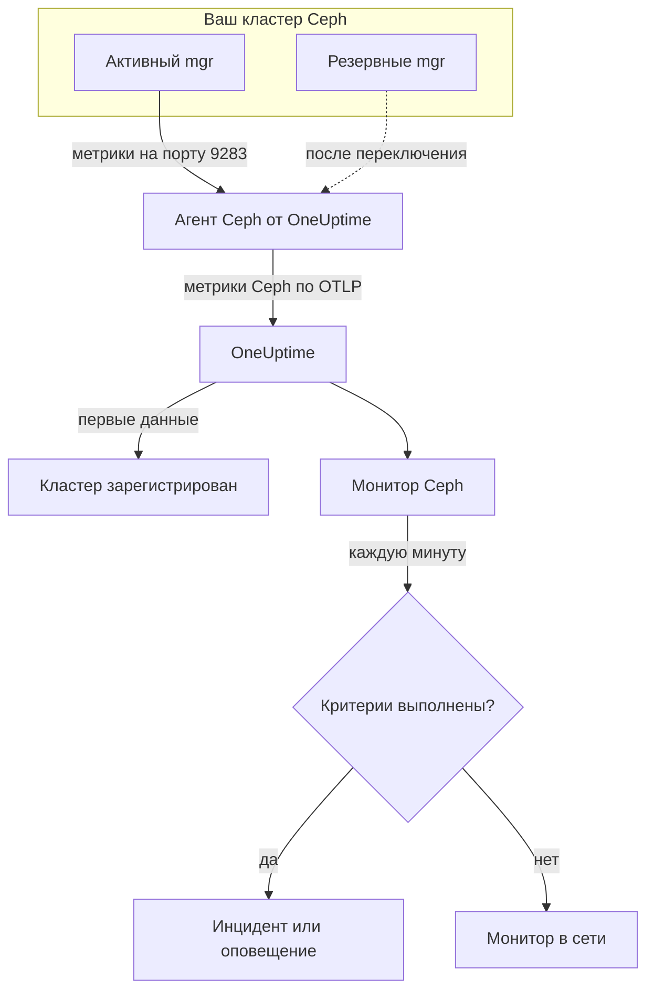

# Мониторинг Ceph

Монитор Ceph следит за одним кластером Ceph — его состоянием, проверками здоровья (health checks), кворумом мониторов, OSD, пулами и группами размещения (placement groups) — и сообщает вам, как только состояние ухудшается, OSD отключается или заканчивается ёмкость. Он читает метрики `ceph_*`, которые экспортирует модуль `prometheus` в Ceph mgr и собирает агент Ceph от OneUptime, поэтому ничего не опрашивается снаружи.

:::cards
- [Создать монитор](#создание-монитора-ceph): Шесть шагов в панели.
- [Шаблоны](#готовые-шаблоны-оповещений): 23 готовых оповещения о состоянии, OSD, группах размещения и ёмкости.
- [Проверки здоровья](#ряды-проверок-здоровья): Оповещать о любой проверке здоровья Ceph по её имени.
- [Метрики](#собираемые-метрики): Каждый ряд `ceph_*`, по которому монитор может оповещать.
:::

## Как это работает

Модуль `prometheus` в Ceph mgr отдаёт метрики кластера на порту 9283. Агент Ceph от OneUptime опрашивает каждый демон mgr каждые 30 секунд — активный отвечает, резервные ничего не возвращают, пока не примут роль на себя, — сохраняет собственные метки Ceph (`ceph_daemon`, `pool_id`) и отправляет метрики в OneUptime по OTLP с именем кластера, `ceph.cluster.name`. Первые данные регистрируют кластер.

Монитор Ceph привязан к одному кластеру. Каждую минуту он выполняет свой запрос по метрикам этого кластера и сравнивает результат со своими критериями.



## Перед началом

- **Включите модуль `prometheus` в mgr** на кластере:

  ```bash
  ceph mgr module enable prometheus
  ```

- **Установите агент Ceph** на машину, с которой доступен каждый демон mgr на порту 9283, и перечислите их все в `CEPH_MGR_ENDPOINTS`. Установка описана в [руководстве по агенту Ceph](/docs/telemetry/ceph).
- **Убедитесь, что кластер зарегистрирован.** Он появляется в разделе **Продукты → Инфраструктура → Ceph → Все кластеры** под именем из `CEPH_CLUSTER_NAME` агента примерно через минуту после первого опроса.
- **Для оповещений по проверкам здоровья** нужен Ceph Quincy или новее. Более старые версии не экспортируют `ceph_health_detail`.

## Создание монитора Ceph

:::steps
### Начните новый монитор

Перейдите в **Мониторы** и нажмите **Создать монитор**.

### Выберите Ceph

В разделе **Тип монитора** нажмите **Другие типы мониторов** и выберите **Ceph** в группе **Инфраструктура** или введите `ceph` в поле поиска. Введите **Имя** — оно используется в заголовках инцидентов и оповещений — и нажмите **Далее**.

### Выберите кластер

В разделе **Ceph Monitor Configuration** выберите кластер в поле **Ceph Cluster**. В списке есть каждый кластер, который уже присылал данные.

### Выберите, что отслеживать

Выберите одну из трёх вкладок:

- **Quick Setup** — нажмите на [шаблон](#готовые-шаблоны-оповещений). Он задаёт метрики, фильтры, агрегацию, диапазон времени и пороги и заменяет критерии ниже своими. **Диапазон времени** по-прежнему можно изменить.
- **Custom Metric** — выберите одну метрику в поле **Ceph Metric**, затем задайте **Агрегация** и **Диапазон времени**. **OSD** и **Pool ID** сужают её до одного демона или пула.
- **Расширенный** — сами составьте запросы и формулы в разделе **Выберите метрики**, например долю занятой ёмкости из `ceph_cluster_total_used_bytes / ceph_cluster_total_bytes`. Используйте **Group by** `ceph_daemon` или `pool_id`, чтобы оценивать каждый демон или пул отдельно.

### Проверьте критерии

Откройте каждый критерий в разделе **Критерии монитора** и проверьте **Метрика**, **Агрегация**, **Условие** и **Threshold**. Шаблон заполняет их сам. С **Custom Metric** или **Расширенный** монитор начинает с [критериев по умолчанию](#критерии-по-умолчанию), которые замечают только падение метрики до нуля, поэтому задайте собственный порог.

### Создайте монитор

Нажмите **Создать монитор**. OneUptime откроет страницу монитора и будет оценивать его каждую минуту. Инциденты и оповещения, которые он создаёт, также видны на страницах кластера **Инциденты** и **Оповещения**.
:::

> [!TIP]
> Чтобы настроить несколько шаблонов сразу, откройте кластер из **Продукты → Инфраструктура → Ceph** и перейдите в **Recommendations**. Выберите нужные шаблоны и тех, кого вызывать, и OneUptime создаст по монитору на каждый шаблон.

## Настройки монитора

| Поле | Вкладка | Назначение |
| --- | --- | --- |
| **Ceph Cluster** | Все | Обязательно. Ограничивает каждый запрос значением `resource.ceph.cluster.name`. |
| **OSD** | Custom Metric, Расширенный | Необязательно. Точное совпадение с меткой `ceph_daemon`, например `osd.3`. |
| **Pool ID** | Custom Metric, Расширенный | Необязательно. Точное совпадение с меткой `pool_id`, например `2`. |
| **Ceph Metric** | Custom Metric | Одна метрика из [каталога](#собираемые-метрики). |
| **Агрегация** | Custom Metric | Как объединяются значения: **Среднее**, **Максимум**, **Минимум**, **Сумма** или **Количество**. По умолчанию — обычная агрегация этой метрики. |
| **Диапазон времени** | Все | Скользящее окно, которое читает запрос, от **Past 1 Minute** до **Past 365 Days**. Новый монитор начинает с **Past 1 Minute**; шаблоны задают своё. |
| **Выберите метрики** | Расширенный | Конструктор запросов: **Метрика**, **Aggregate by**, **Filter by attributes**, **Group by**, а также **Добавить метрику** и **Добавить формулу** для объединения запросов. |

Ряды данных пулов несут только метку `pool_id`: имя пула есть только в `ceph_pool_metadata`. Фильтруйте и группируйте ряды пулов по `pool_id`, а имя смотрите в `ceph_pool_metadata`, когда оно нужно.

### Ряды проверок здоровья

`ceph_health_detail` экспортирует **один ряд на каждую активную проверку здоровья** с метками `name` (например, `OSD_NEARFULL` или `RECENT_CRASH`) и `severity`. Ряд существует, только пока срабатывает его проверка, поэтому отсутствие рядов означает, что всё в порядке. Чтобы оповещать о любой проверке здоровья Ceph, отфильтруйте по её `name`, срабатывайте по **Максимум** выше `0` и восстанавливайтесь при `0`, установив **Если нет данных** в **Treat As Zero**, — именно так устроены шаблоны проверок здоровья. `ceph_daemon_health_metrics` работает так же для каждого демона, с меткой `type` (например, `SLOW_OPS`) и `ceph_daemon`.

## Готовые шаблоны оповещений

**Quick Setup** предлагает 23 шаблона для состояния кластера, OSD, групп размещения и ёмкости. Каждый создаёт полный монитор — запросы, фильтры по меткам, группировку, критерий срабатывания и критерий восстановления. Пороги — это отправная точка, их можно изменить.

Шаблоны читают последние 5 минут, если в таблице не сказано иное. Критерий срабатывает, только если условие выполняется в каждую минуту окна, а критерий с порогом восстанавливается на 10 % дальше своего порога, чтобы значение, колеблющееся около границы, не вызывало дребезга. **Серьёзность** — это метка, которую показывает список выбора; инцидент и оповещение, созданные шаблоном, начинаются с самой высокой серьёзности инцидентов и оповещений в вашем проекте.

### Шаблоны состояния кластера

| Шаблон | Серьёзность | Что отслеживает | Срабатывает, когда | Восстанавливается, когда |
| --- | --- | --- | --- | --- |
| Cluster Health Error | Критический | `ceph_health_status`, Max, последняя минута | 2 или больше: `HEALTH_ERR` | Ниже 1,8: `HEALTH_WARN` или лучше |
| Cluster Health Warning | Warning | `ceph_health_status`, Max | 1 или больше: `HEALTH_WARN` или хуже | Ниже 0,9: `HEALTH_OK` |
| Monitor Quorum Degraded | Критический | `ceph_mon_quorum_status`, Min по `ceph_daemon`, последняя минута | Монитор опускается ниже 1 и выпадает из кворума. Один инцидент на монитор | Снова 1 |
| Slow Operations | Warning | `ceph_healthcheck_slow_ops`, Max | Выше 0: активна проверка `SLOW_OPS` кластера | При 0 |
| Daemon Slow Operations | Warning | `ceph_daemon_health_metrics` для `type = SLOW_OPS`, Max по `ceph_daemon` | Выше 0. Один инцидент на OSD или монитор | Ряд исчезает |
| Daemon Crash | Критический | `ceph_health_detail` для `name = RECENT_CRASH`, Max | Проверка активна: есть неархивированные сбои демонов. У mgr нет метрики `ceph_crash_*`, поэтому это единственный сигнал о сбоях | Сбои архивированы |
| Monitor Clock Skew | Warning | `ceph_health_detail` для `name = MON_CLOCK_SKEW`, Max | Проверка активна: часы мониторов расходятся сильнее допустимого (по умолчанию 0,05 с) | Проверка исчезает |
| Monitor Disk Critically Low | Критический | `ceph_health_detail` для `name = MON_DISK_CRIT`, Max | Проверка активна: на диске базы данных монитора свободно меньше 5 % (по умолчанию) | Проверка исчезает |
| Monitor Disk Space Low | Warning | `ceph_health_detail` для `name = MON_DISK_LOW`, Max | Проверка активна: свободно меньше 30 % (по умолчанию) | Проверка исчезает |

### Шаблоны OSD

| Шаблон | Серьёзность | Что отслеживает | Срабатывает, когда | Восстанавливается, когда |
| --- | --- | --- | --- | --- |
| OSD Down | Критический | `ceph_osd_up`, Min по `ceph_daemon` | OSD опускается ниже 1. Один инцидент на OSD | Снова 1 |
| OSD Out | Warning | `ceph_osd_in`, Min по `ceph_daemon` | OSD опускается ниже 1: исключён из распределения данных | Снова 1 |
| OSD High Latency | Warning | `ceph_osd_apply_latency_ms`, Avg по `ceph_daemon` | Выше 100 мс. Один инцидент на OSD | Не больше 90 мс |
| OSD Slow Heartbeats | Warning | `ceph_health_detail` для `name = OSD_SLOW_PING_TIME_FRONT` и `name = OSD_SLOW_PING_TIME_BACK`, Max | Активна одна из проверок: heartbeat в публичной сети или сети кластера идут медленно. Mgr не экспортирует показатель времени ping | Обе проверки исчезают |

### Шаблоны групп размещения

| Шаблон | Серьёзность | Что отслеживает | Срабатывает, когда | Восстанавливается, когда |
| --- | --- | --- | --- | --- |
| Inactive Placement Groups | Критический | `ceph_pg_total` − `ceph_pg_active`, Max по `pool_id` | Выше 0: группы размещения не могут обслуживать ввод-вывод, поэтому запросы клиентов к ним зависают. Один инцидент на пул | При 0 |
| Degraded Placement Groups | Warning | `ceph_pg_degraded`, Max по `pool_id` | Выше 0: у объектов меньше реплик, чем настроено | При 0 |
| Undersized Placement Groups | Warning | `ceph_pg_undersized`, Max по `pool_id` | Выше 0: группы размещения отображаются на меньшее число OSD, чем число их реплик | При 0 |
| Damaged Placement Groups | Критический | `ceph_health_detail` для `name = PG_DAMAGED` и `name = OSD_SCRUB_ERRORS`, Max | Активна одна из проверок: scrubbing нашёл повреждения или ошибки чтения | Обе проверки исчезают |

### Шаблоны ёмкости

| Шаблон | Серьёзность | Что отслеживает | Срабатывает, когда | Восстанавливается, когда |
| --- | --- | --- | --- | --- |
| Cluster Near Full | Warning | `ceph_cluster_total_used_bytes` ÷ `ceph_cluster_total_bytes` × 100 | Выше 85 %, стандартной доли nearfull в Ceph | Не больше 76,5 % |
| Cluster Full | Критический | Та же доля | Выше 95 %, стандартной доли full в Ceph, при которой запись останавливается во всём кластере | Не больше 85,5 % |
| Pool Near Full | Warning | `ceph_pool_stored` ÷ (`ceph_pool_stored` + `ceph_pool_max_avail`) × 100, по `pool_id` | Выше 85 % того, что может вместить пул. Один инцидент на пул | Не больше 76,5 % |
| OSD Nearfull | Warning | `ceph_health_detail` для `name = OSD_NEARFULL`, Max | Проверка активна: OSD превысил порог nearfull (по умолчанию 85 %). Отдельные OSD заполняются гораздо раньше, чем среднее по кластеру | Проверка исчезает |
| OSD Backfillfull | Warning | `ceph_health_detail` для `name = OSD_BACKFILLFULL`, Max | Проверка активна: backfill на OSD отклоняется (по умолчанию 90 %), и восстановление останавливается | Проверка исчезает |
| OSD Full | Критический | `ceph_health_detail` для `name = OSD_FULL`, Max, последняя минута | Проверка активна: OSD достиг порога full (по умолчанию 95 %), и запись отклоняется | Проверка исчезает |

- **Шаблоны отказов и кворума используют минимум**, чтобы один отключённый OSD или один монитор вне кворума вызывали срабатывание, а не скрывались за здоровым большинством.
- **Шаблоны счётчиков и проверок здоровья используют максимум**, чтобы хватило одного неудачного опроса.
- **Ряды групп размещения и пулов ведутся по пулам**: показателя для всего кластера нет, поэтому эти шаблоны группируют по `pool_id` и открывают по инциденту на пул.
- **Доли ёмкости** берут **Сумма** для обеих частей. Обе приходят из одного опроса mgr, поэтому результат — настоящий процент. **Inactive Placement Groups** использует вместо этого **Максимум** по пулу, потому что сумма в вычитании сложила бы опросы.
- **Шаблоны проверок здоровья** восстанавливаются, когда проверка исчезает: их критерии восстановления считают отсутствующий ряд равным 0.

Для некоторых оповещений шаблона нет. Для дисбаланса групп размещения нужна статистика по нескольким рядам, которую критерии вычислить не могут. Для прогноза ёмкости нужна кривая роста, которую вместо этого рисует панель кластера. Для прогноза отказов дисков и отставания scrubbing нет метрик mgr, а NVMe-oF, зеркалирование RBD и cephadm требуют других экспортёров.

## Собираемые метрики

Агент опрашивает каждый демон mgr каждые 30 секунд и сохраняет собственные метки Ceph, поэтому ряды по демонам несут `ceph_daemon` (`osd.3`, `mon.a`), а ряды по пулам — `pool_id`.

### Метрики состояния кластера

| Метрика | Единица | Описание |
| --- | --- | --- |
| `ceph_health_status` | — | Общее состояние: 0 = `HEALTH_OK`, 1 = `HEALTH_WARN`, 2 = `HEALTH_ERR`. |
| `ceph_health_detail` | количество | Один ряд на каждую **активную** проверку здоровья, с метками `name` и `severity`. Только начиная с Quincy. |
| `ceph_healthcheck_slow_ops` | количество | Медленные операции OSD и мониторов, о которых сообщает проверка `SLOW_OPS`. |
| `ceph_daemon_health_metrics` | количество | Метрики состояния по демонам, с ключами `type` (например, `SLOW_OPS`) и `ceph_daemon`. |
| `ceph_mon_quorum_status` | количество | 1, когда монитор в кворуме, по `ceph_daemon` (например, `mon.a`). |
| `ceph_mon_metadata` | количество | Метаданные монитора, всегда 1. Суммируйте, чтобы посчитать мониторы. |
| `ceph_cluster_total_bytes` | байты | Общая сырая ёмкость. |
| `ceph_cluster_total_used_bytes` | байты | Используемая сырая ёмкость. |

### Метрики OSD

| Метрика | Единица | Описание |
| --- | --- | --- |
| `ceph_osd_up` | количество | 1, когда OSD работает, по `ceph_daemon` (например, `osd.3`). |
| `ceph_osd_in` | количество | 1, когда OSD участвует в распределении данных. |
| `ceph_osd_apply_latency_ms` | мс | Время применения операции к нижележащему хранилищу. |
| `ceph_osd_commit_latency_ms` | мс | Время фиксации операции в журнале или WAL. |
| `ceph_osd_stat_bytes` | байты | Сырая ёмкость устройства OSD. |
| `ceph_osd_stat_bytes_used` | байты | Использованные сырые байты на OSD. Сравните с общим объёмом, чтобы найти неравномерно заполненные или почти полные OSD. |
| `ceph_osd_numpg` | количество | Группы размещения на OSD. |
| `ceph_osd_metadata` | количество | Метаданные OSD (имя хоста, класс устройства, версия), всегда 1. Суммируйте, чтобы посчитать OSD. |

### Метрики пулов

| Метрика | Единица | Описание |
| --- | --- | --- |
| `ceph_pool_stored` | байты | Пользовательские данные, хранящиеся в пуле. |
| `ceph_pool_max_avail` | байты | Сколько байтов ещё можно записать в пул с учётом его профиля репликации или erasure coding. |
| `ceph_pool_objects` | количество | Объекты в пуле. |
| `ceph_pool_rd` | операции | Операции чтения из пула. Счётчик за всё время работы. |
| `ceph_pool_wr` | операции | Операции записи в пул. Счётчик за всё время работы. |
| `ceph_pool_rd_bytes` | байты | Байты, прочитанные из пула. Счётчик за всё время работы. |
| `ceph_pool_wr_bytes` | байты | Байты, записанные в пул. Счётчик за всё время работы. |
| `ceph_pool_metadata` | количество | Метаданные пула, всегда 1 — единственный ряд, связывающий `pool_id` с именем. |

### Метрики групп размещения

Каждый ряд `ceph_pg_*` ведётся по пулу, с меткой `pool_id`; суммируйте по пулам, чтобы получить значение для всего кластера.

| Метрика | Единица | Описание |
| --- | --- | --- |
| `ceph_pg_total` | количество | Группы размещения в пуле. |
| `ceph_pg_active` | количество | Группы размещения в состоянии `active`, способные обслуживать ввод-вывод. |
| `ceph_pg_clean` | количество | Группы размещения в состоянии `clean`, полностью реплицированные. |
| `ceph_pg_degraded` | количество | Группы размещения в состоянии `degraded`. |
| `ceph_pg_undersized` | количество | Группы размещения в состоянии `undersized`. |
| `ceph_num_objects_degraded` | количество | Объекты, у которых меньше реплик, чем настроено. |
| `ceph_num_objects_misplaced` | количество | Объекты, лежащие не там, где их хочет видеть CRUSH. Данные в безопасности, неверно только размещение. |

## Критерии мониторинга

Критерий сравнивает один из запросов или формул монитора с порогом. У критериев монитора Ceph нет поля **Тип фильтра**: каждое правило проверяет значение метрики с такими полями.

| Поле | Назначение |
| --- | --- |
| **Метрика** | Проверяемый запрос или формула, по имени переменной. |
| **Агрегация** | Как значения в окне превращаются в один ответ: **Среднее**, **Сумма**, **Maximum Value**, **Minimum Value**, **All Values** (условию должно соответствовать каждое значение) или **Any Value** (достаточно одного). |
| **Условие** | **Greater Than**, **Less Than**, **Greater Than Or Equal To**, **Less Than Or Equal To** или **Equal To** — либо условие аномалии: **Anomalously High**, **Anomalously Low** или **Anomalous**. |
| **Threshold** | Значение для сравнения. Рядом есть список единиц, если у метрики есть единица. Не показывается для условий аномалии. |
| **Чувствительность** | Только для условий аномалии. **Low** (4σ), **Medium** (3σ, по умолчанию) или **High** (2σ). |
| **Окно базовой линии** | Только для условий аномалии. 14 дней (по умолчанию), 28, 60 или 90 дней истории. |
| **Если нет данных** | В разделе **Дополнительные поля**. Что происходит, когда в окне нет значений: **Ignore** (по умолчанию), **Treat As Zero** или **Триггер**. |

Условия аномалии сравнивают каждое значение с тем же часом недели в базовой линии. Они остаются в состоянии "Learning" и ничего не создают, пока в окне базовой линии не наберётся достаточно истории.

Каждый критерий также говорит, что делать при совпадении: изменить статус монитора, создать оповещение или объявить инцидент. Критерии проверяются сверху вниз, и решает первый совпавший.

### Критерии по умолчанию

Монитор, созданный не из шаблона, начинает с двух критериев:

| Порядок | Критерий | Совпадает, когда | Затем |
| --- | --- | --- | --- |
| 1 | Check if _имя монитора_ is offline | Любое значение первого запроса равно `0` | Переводит монитор в состояние **Не в сети** и объявляет инцидент "_имя монитора_ is offline", который разрешается сам, когда монитор восстанавливается. |
| 2 | Check if _имя монитора_ is online | Любое значение больше `0` | Переводит монитор в состояние **Работает**. |

Эти значения по умолчанию подходят немногим метрикам Ceph: `ceph_health_status` равен 0, когда кластер исправен. Выберите шаблон или задайте свои критерии.

> [!IMPORTANT]
> Тишина не совпадает ни с одним из критериев: кластер, который перестал присылать данные, оставляет монитор в прежнем состоянии. Чтобы узнавать о прекращении данных, установите **Если нет данных** в **Триггер** в одном из критериев.

## Устранение неполадок

:::details Кластера нет в списке Ceph Cluster
Кластеры регистрируются сами по данным агента. Проверьте, что агент запущен и отправляет данные (см. [руководство по агенту Ceph](/docs/telemetry/ceph)), и что задана `CEPH_CLUSTER_NAME`.
:::

:::details Метрики пропали после переключения mgr
Агент должен опрашивать **каждый** демон mgr, а не только активный: резервные ничего не возвращают, пока не примут роль на себя. Перечислите каждый mgr в `CEPH_MGR_ENDPOINTS`.
:::

:::details ceph_health_status равен 1, но ничего не срабатывает
Проверьте, что критерий использует **Greater Than Or Equal To** `1`, а не **Greater Than**, и что **Диапазон времени** монитора охватывает хотя бы один 30-секундный опрос.
:::

:::details Шаблоны проверок здоровья никогда не срабатывают
Шаблонам, которые отслеживают `ceph_health_detail`, — Daemon Crash, Monitor Clock Skew, OSD Nearfull, OSD Backfillfull, OSD Full, двум шаблонам для дисков мониторов, Damaged Placement Groups и OSD Slow Heartbeats — нужен модуль `prometheus` в mgr из Quincy или новее. Пока проверка активна, убедитесь, что ряд существует:

```bash
curl http://ACTIVE_MGR:9283/metrics | grep ceph_health_detail
```

Ряды проверок здоровья, включая `ceph_daemon_health_metrics`, существуют только во время срабатывания проверки, поэтому их отсутствие у исправного кластера ожидаемо.
:::

:::details Счётчики вроде ceph_pool_wr_bytes только растут
Ряды ввода-вывода пулов — это счётчики за всё время работы, а критерии сравнивают сырые значения: оператора скорости нет, и **Convert to per-second rate** в конструкторе запросов меняет только график. Показывайте их как скорость или оповещайте об их росте с помощью формулы, например запрос **Максимум** минус запрос **Минимум** того же счётчика.
:::

## Что дальше

:::cards
- [Агент Ceph](/docs/telemetry/ceph): Установка и обновление агента, данные которого читает этот монитор.
- [Мониторинг Proxmox](/docs/monitor/proxmox-monitor): Следите за кластером Proxmox VE, который использует хранилище.
- [Мониторинг систем хранения данных](/docs/monitor/storage-array-monitor): Такой же монитор для массивов Pure Storage.
- [Инциденты](/docs/incidents/index): Что происходит после того, как критерий объявил инцидент.
:::
