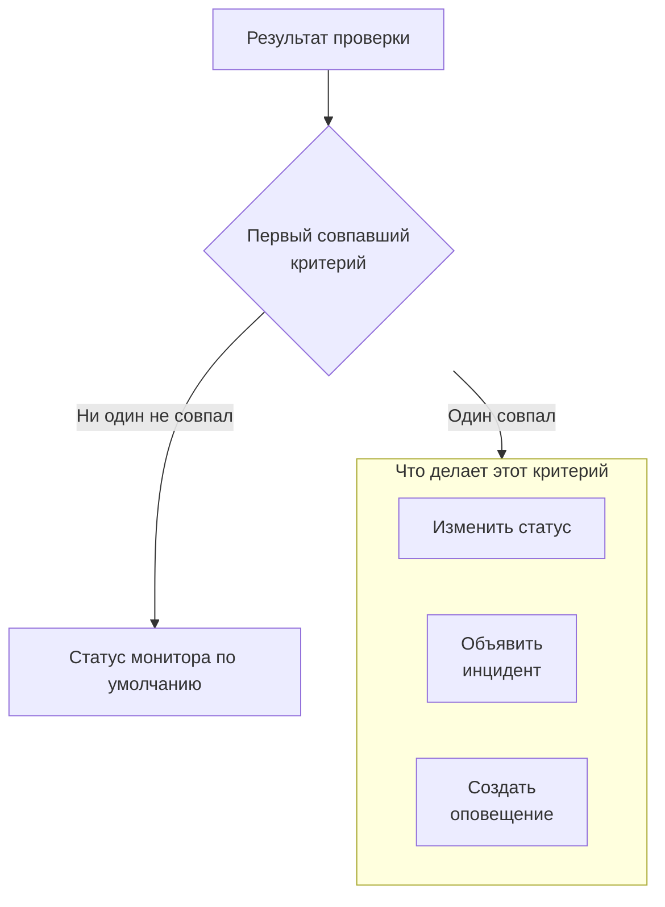

# Создание монитора

Монитор проверяет то, чем вы управляете, например веб-сайт, API, хост или кластер Kubernetes, и сообщает, когда это перестаёт работать. **Создать монитор** сначала спрашивает, что отслеживать, затем что проверять и потом как часто. Всё, кроме типа, имени и того, что проверять, начинается со значений по умолчанию, которые подходят большинству мониторов.

> [!NOTE]
> Чтобы создать монитор, нужна роль Project Owner, Project Admin, Project Member, Monitor Admin или Monitor Member либо пользовательская роль с разрешением Create Monitor.

## Информация о мониторе

Первый шаг спрашивает, что отслеживать и как назвать монитор.

:::steps
### Откройте «Создать монитор»

Перейдите в **Мониторы** и нажмите **Создать монитор**. Форма откроется на первом шаге, **Информация о мониторе**.

### Выберите тип монитора

Первый вопрос — **Тип монитора**: что вы хотите отслеживать?

- Шесть типов, которые создают чаще всего, идут первыми: **Веб-сайт**, **API**, **Ping**, **Порт**, **SSL Certificate** и **Incoming Request** — для heartbeat-сигналов от cron-задач и вебхуков.
- **Другие типы мониторов** показывает все остальные типы по категориям, например **Инфраструктура** (Kubernetes, Docker, хост) и **Телеметрия** (журналы, метрики, трассировки). **Manual** — монитор, статус которого вы задаёте сами, — находится в разделе **Другое**.
- Или введите текст в поле поиска. Оно знает слова, которыми вы уже пользуетесь, например `k8s`, `postgres`, `heartbeat` или `tls`, а **Enter** выбирает первое совпадение.

Выбранный тип сворачивается в одну строку. Нажмите **Изменить**, чтобы выбрать другой; нажмите **Escape** во время выбора, чтобы оставить прежний тип.

### Назовите монитор

Заполните **Имя**. Оно используется в оповещениях и в заголовках инцидентов. **Описание** и **Метки** необязательны и ждут в разделе **Дополнительные поля**.

Монитору типа **Manual** больше ничего не нужно, поэтому **Создать монитор** находится на этом шаге. Для любого другого типа нажмите **Далее**.
:::

## Критерии

Второй шаг спрашивает, что проверять, и определяет, что считается проблемой.

:::steps
### Укажите, что проверять

Этот шаг открывается на том, что нужно проверять. Для веб-сайта это его URL с примером в поле; другие типы запрашивают хост, запрос, кластер или фильтр журналов. Настройки, которые большинство мониторов никогда не меняет, например тайм-ауты и повторные попытки, свёрнуты в разделе **Дополнительные поля**.

Для монитора, который проверяют зонды, **Протестировать монитор** выполняет проверку один раз до сохранения: выберите зонд в **Выберите зонд** и нажмите **Запустить тест**. Ответ откроется в **Результат теста монитора**.

### Проверьте критерии

Ниже **Критерии монитора** определяют, когда монитор меняет статус, объявляет инцидент или создаёт оповещение. Новый монитор начинает с критериев, подходящих большинству мониторов, каждый свёрнут в одну строку, которая говорит, что он проверяет и что делает. Например, новый монитор веб-сайта помечается как не в сети и объявляет инцидент, когда сайт не отвечает или отвечает кодом статуса ошибки.

Нажмите на критерий, чтобы открыть и изменить его. **Добавить критерии** добавляет новый, открытый и готовый к заполнению. Чтобы изменить порядок, перетащите критерий за маркер слева от него.

### Перейдите к следующему шагу

Нажмите **Далее**. Ничего на этом шаге не помечается как незаполненное, пока вы не нажмёте **Далее**.
:::

### Как оцениваются критерии

Результат каждой проверки проходит через критерии сверху вниз, и первый совпавший решает, что произойдёт. Этот критерий может изменить статус монитора, объявить инцидент, создать оповещение или выполнить любое их сочетание. Если ни один не совпал, монитор показывает свой **Статус монитора по умолчанию**, который задаётся в разделе **Дополнительные поля** под критериями (**Работает**, если вы не выберете другой).

Инциденты и оповещения, настроенные на автоматическое разрешение, как у критериев по умолчанию, разрешаются сами, как только их критерий перестаёт совпадать. Монитор, который проверяют несколько зондов, меняется только тогда, когда зонды согласны: по умолчанию каждый включённый и подключённый зонд должен прийти к одному результату. Чтобы требовать меньше, задайте **Согласие зондов** на странице **Конфигурация → Зонды и интервал** монитора.

## Зонды и интервал

Мониторы, которые проверяют зонды, заканчиваются этим шагом: Веб-сайт, API, Ping, IP, Порт, SSL Certificate, DNS, DNSSEC, NTP, Домен, SQL Query, Database Health, Synthetic Monitor, Custom JavaScript Code и External Status Page. **Зонды** — это машины, которые выполняют проверки, и зонды проекта по умолчанию уже выбраны. **Интервал мониторинга** начинается с **Каждые 5 минут**.

:::steps
### Выберите зонды

Оставьте выбранные **Зонды** или выберите другие. Монитор без зондов никогда не проверяется. Чтобы проверять что-то в частной сети, запустите в этой сети [пользовательский зонд](/docs/probe/custom-probe) и выберите его здесь.

### Выберите, как часто проверять

Выберите **Интервал мониторинга**, от **Каждую минуту** до **Каждую неделю**. Мониторам типов Synthetic Monitor, Custom JavaScript Code и SSL Certificate предлагаются интервалы от 5 минут и больше.

### Создайте монитор

Нажмите **Создать монитор**. Откроется страница нового монитора. Чтобы позже изменить его зонды или интервал, откройте на этой странице **Конфигурация → Зонды и интервал**.
:::

Все остальные типы, кроме Manual, создаются на шаге **Критерии**.

## Начало с шаблона или ссылки

Шаблон монитора и ссылки, которые создают монитор в других местах OneUptime (на графике метрик, сетевом устройстве или правиле обнаружения), открывают **Создать монитор** с уже выбранным типом и заполненными остальными полями. Нажмите **Изменить**, чтобы выбрать другой тип. Форма шаблона использует тот же выбор типа: см. [Шаблоны мониторов](/docs/monitor/monitor-templates).

У каждого типа монитора есть своя страница с его настройками, критериями по умолчанию и примерами. Куда стоит перейти дальше:

:::cards
- [Мониторинг веб-сайта](/docs/monitor/website-monitor): Проверить, что страница загружается, и что она отвечает.
- [Мониторинг API](/docs/monitor/api-monitor): Вызвать эндпоинт с методом, заголовками и телом.
- [Шаблоны мониторов](/docs/monitor/monitor-templates): Создать много мониторов из одной конфигурации и держать их одинаковыми.
- [Инциденты](/docs/incidents/index): Что происходит после того, как монитор объявил инцидент.
:::
