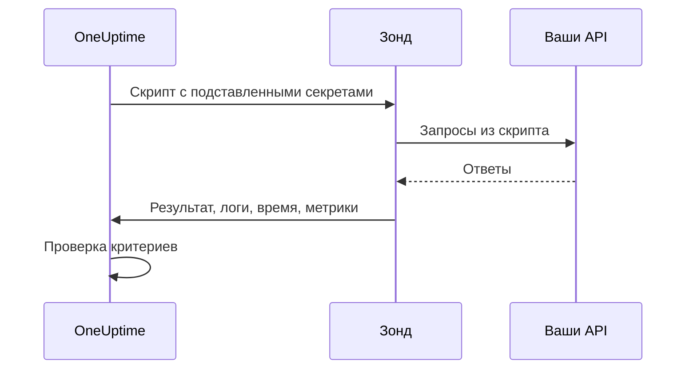

# Мониторинг собственного кода

Монитор собственного кода по расписанию запускает с зонда написанный вами скрипт на JavaScript. Используйте его для проверок, которые не выразить другими типами мониторов: вход в систему с последующим авторизованным вызовом API, транзакция из нескольких шагов или значение, которое вы вычисляете из нескольких ответов. Если скрипт выбрасывает ошибку, проверка не проходит; то, что скрипт возвращает, доступно вашим критериям и шаблонам инцидентов.

:::cards
- [Создайте монитор](#создание-монитора-собственного-кода): Напишите скрипт и выберите зонды, которые его запускают.
- [Напишите скрипт](#написание-скрипта): Готовая к запуску многошаговая проверка API, с которой можно начать.
- [Используйте секреты](#использование-секретов-мониторинга): Не храните пароли и токены в скрипте.
- [Собирайте пользовательские метрики](#пользовательские-метрики): Стройте графики любых чисел, которые вычисляет скрипт.
:::

## Как это работает

При каждой проверке зонд запускает ваш скрипт в изолированной песочнице JavaScript, где секреты мониторинга уже подставлены. Скрипт вызывает всё, что ему нужно, а затем возвращает результат или выбрасывает ошибку. Зонд сообщает результат, сообщения лога скрипта, время его работы и собранные метрики, а OneUptime проверяет по ним ваши критерии.



Песочница — это не Node.js: в ней нет `require`, `process`, `fetch` и файловой системы, есть только [модули, перечисленные ниже](#модули-доступные-в-скрипте).

## Перед началом

- **Зонд**, который может достучаться до каждого эндпоинта, вызываемого скриптом. Для эндпоинтов внутри вашей сети используйте [собственный зонд](/docs/probe/custom-probe).
- Чтобы обратиться к частному адресу (например, `10.0.0.5`), зонд должен это разрешать: задайте на этом зонде `PROBE_ALLOW_PRIVATE_NETWORK_MONITORS=true`. Адреса loopback, link-local и метаданных облака отклоняются всегда. См. [Доступ к частной сети](/docs/self-hosted/private-network-access).
- Все пароли, ключи API и токены, нужные скрипту, сохранённые как [секреты мониторинга](/docs/monitor/monitor-secrets).

## Создание монитора собственного кода

:::steps
### Начните новый монитор

Откройте **Мониторы** и нажмите **Создать монитор**. В разделе **Тип монитора** нажмите **Другие типы мониторов** и выберите **Custom JavaScript Code** в группе **Synthetic Monitoring** или введите `script` в поле поиска. Укажите **Имя** и нажмите **Далее**.

### Добавьте скрипт

Напишите скрипт в редакторе **Код JavaScript**. Начните с [примера ниже](#написание-скрипта).

### Протестируйте его

Нажмите **Протестировать монитор**, чтобы один раз запустить скрипт с зонда, и проверьте результат.

### Проверьте критерии

Монитор начинается с двух критериев: он переходит в офлайн и объявляет инцидент, когда скрипт завершается ошибкой, и становится онлайн, когда ошибки нет. Измените их или добавьте свои (см. [Критерии](#критерии)), затем нажмите **Далее**.

### Выберите зонды и создайте монитор

Выберите **Зонды**, которые могут достучаться до ваших эндпоинтов, и **Интервал мониторинга** (для мониторов собственного кода доступны интервалы от 5 минут и больше), затем нажмите **Создать монитор**.
:::

## Написание скрипта

Скрипт — это тело функции `async`: на верхнем уровне можно использовать `await`, вернуть результат через `return` и провалить проверку через `throw`. Этот пример выполняет вход, вызывает эндпоинт с полученным токеном и завершается ошибкой, если ответ не такой, как ожидалось:

```javascript title="Custom code monitor script"
// 1. Log in. axios rejects a 4xx or 5xx response, which fails the check.
const login = await axios.post("https://api.example.com/v1/login", {
  username: "monitoring@example.com",
  password: "{{monitorSecrets.ApiPassword}}",
});

// 2. Call an endpoint that needs the token.
const orders = await axios.get("https://api.example.com/v1/orders?limit=10", {
  headers: { Authorization: `Bearer ${login.data.token}` },
  timeout: 10000,
});

// 3. Fail the check when the data is wrong, not only when the request fails.
if (!Array.isArray(orders.data.items)) {
  throw new Error("The orders endpoint returned no items");
}

console.log(`Fetched ${orders.data.items.length} orders`);

// 4. Return what the criteria and incident templates should see.
return {
  data: orders.data.items.length,
};
```

| Чтобы | Сделайте так | Что записывает OneUptime |
| --- | --- | --- |
| Сообщить результат | `return { data: ... }` с любым значением JSON | **Результат**. Сохраняется только свойство `data`: `return 5` не записывает никакого результата. |
| Провалить проверку | `throw new Error("...")` | **Ошибка скрипта**, которую критерии по умолчанию превращают в инцидент. |
| Оставить след | `console.log(...)` | **Сообщения лога**, до 1 000 за запуск. |

Чтобы посмотреть запуск, откройте **Обзор** монитора: карточка **Сводка монитора** показывает зонд, время выполнения и ошибку, а **Показать больше деталей** показывает результат, ошибку скрипта и сообщения лога. В **Журналы мониторинга** есть такая же сводка для прошлых проверок.

> [!NOTE]
> `axios` в этой песочнице не следует перенаправлениям, а его запросы не идут через прокси, настроенный на зонде. Запрашивайте конечный URL.

## Использование секретов мониторинга

Ссылайтесь на секрет как `{{monitorSecrets.NAME}}` в любом месте скрипта. OneUptime заменяет ссылку значением секрета, как обычный текст, ещё до того, как скрипт попадёт на зонд. Поэтому заключайте секрет в кавычки, чтобы использовать его как строку, и оставляйте без кавычек, чтобы использовать как число или логическое значение:

```javascript
// Used as a string: wrap it in quotes.
const apiKey = "{{monitorSecrets.ApiKey}}";

// Used as a number or a boolean: leave it bare.
const retryLimit = {{monitorSecrets.RetryLimit}};
const verbose = {{monitorSecrets.Verbose}};

// Check the secret was filled in without logging the secret itself.
console.log(apiKey.length > 0);
```

Значение секрета, содержащее кавычку, ломает строку вокруг него. Ссылка, которую монитор не может использовать, остаётся в скрипте как есть. Как создать секрет и выбрать мониторы, которые могут его использовать, описано в разделе [Секреты мониторинга](/docs/monitor/monitor-secrets).

## Пользовательские метрики

Скрипт может собирать пользовательские метрики с помощью функции `oneuptime.captureMetric()`. Эти метрики хранятся в OneUptime, и их можно выводить на графиках дашбордов через Metric Explorer.

```javascript
oneuptime.captureMetric(name, value, attributes);
```

| Параметр | Тип | Описание |
| --- | --- | --- |
| `name` | string, обязательный | Имя метрики (например, `"api.response.time"`). Оно автоматически сохраняется с префиксом `custom.monitor.`. |
| `value` | number, обязательный | Числовое значение метрики. Значение, которое не является числом, игнорируется. |
| `attributes` | object, необязательный | Пары «ключ-значение» для дополнительного контекста. Записываются строки, числа и логические значения (числа и логические значения хранятся как текст, потому что атрибуты метрик — это измерения-разрезы, а не замеры). Значения любых других типов игнорируются. |

### Пример

```javascript
const response = await axios.get("https://api.example.com/health");

// Capture a simple metric
oneuptime.captureMetric("api.response.time", response.data.latency);

// Capture a metric with attributes
oneuptime.captureMetric("api.queue.depth", response.data.queueDepth, {
  region: "us-east-1",
  environment: "production",
});

return {
  data: response.data,
};
```

После сбора эти метрики появляются в Metric Explorer под именами вида `custom.monitor.api.response.time`, а также на странице монитора **Метрики** в разделе **Пользовательские метрики**. OneUptime добавляет к каждой точке данных монитор и зонд, поэтому по ним можно строить графики, настраивать оповещения и фильтровать по монитору, зонду или любым переданным вами пользовательским атрибутам.

### Ограничения

| Ограничение | Значение | При превышении |
| --- | --- | --- |
| Метрик за один запуск скрипта | 100 | Последующие вызовы игнорируются. |
| Длина имени метрики | 200 символов | Имя обрезается. |
| Атрибутов на метрику | 50 | Лишние атрибуты отбрасываются. |
| Длина ключа атрибута | 200 символов | Ключ обрезается. |
| Длина значения атрибута | 1000 символов | Значение обрезается. |

### Зарезервированные ключи атрибутов

Некоторые имена атрибутов принадлежат самому OneUptime, и скрипт не может их записывать. Если ваш скрипт задаёт такой атрибут, он отбрасывается (сама метрика всё равно записывается), а в серверные логи OneUptime пишется предупреждение с именем ключа. Это:

- Идентификация монитора: `monitorId`, `projectId`, `monitorName`, `probeName`, `probeId`, `isCustomMetric`.
- Всё в пространствах имён `oneuptime.` и `resource.`: в них хранятся идентификаторы, которые OneUptime проставляет при приёме данных.
- Атрибуты идентификации ресурса: `service.name`, `host.name`, `k8s.cluster.name`, `iot.fleet.name`, `proxmox.cluster.name`, `vmware.vcenter.name`, `ceph.cluster.name`, `storage.array.name` и `docker.swarm.cluster.name`.

Эти имена — не просто метки: OneUptime читает их как утверждение о том, какому ресурсу принадлежит точка данных. Метрика с `service.name: payments-api` появилась бы на вкладке «Метрики» этого сервиса, а если бы вы позже создали монитор метрик с группировкой по `service.name`, его оповещения были бы привязаны к этому сервису, вызывали бы владельцев сервиса и замолкали бы во время его окна обслуживания. Чтобы связать монитор с сервисом или хостом, используйте собственные метки монитора.

## Критерии

Критерии монитора собственного кода могут проверять:

| Тип фильтра | Что он проверяет | Условия фильтра |
| --- | --- | --- |
| **Ошибка** | Ошибку, которую выбросил скрипт, если она была. | Содержит, Not Contains, Equal To, Not Equal To, Is Empty, Is Not Empty |
| **Result Value** | `data`, которые вернул скрипт. Сравниваются как число, если это число. | Те же, плюс Greater Than, Less Than, Greater Than Or Equal To, Less Than Or Equal To, Истина и Ложь |
| **Время выполнения (в ms)** | Сколько работал скрипт. | Числовые сравнения |

Критерии по умолчанию помечают монитор как онлайн, когда **Ошибка** пуста, и как офлайн (с инцидентом, который закрывается сам, когда скрипт снова выполняется успешно), когда нет. В шаблонах инцидентов и оповещений запуск доступен как `{{result}}`, `{{scriptError}}`, `{{logMessages}}` и `{{executionTimeInMs}}`: см. [Шаблоны инцидентов и оповещений](/docs/monitor/incident-alert-templating).

### Оповещения по возвращённым данным

То, что скрипт возвращает как `data`, — это **Result Value** монитора, и критерий может его сравнивать: например, _Result Value is Equal To `UP`_.

Если `data` — объект или массив, заполните **Путь к полю (необязательно)** в фильтре Result Value, чтобы сравнивать одно поле, а не всё значение целиком. Для вложенных полей используйте точки, для элементов массива — `[n]`:

```javascript
const response = await axios.get("https://api.example.com/health");

return {
  data: {
    status: response.data.status, // "UP"
    cpu_busy_percent: response.data.cpu, // 42
    healthy: response.data.healthy, // true
    checks: response.data.checks, // [{ name: "db", latency: 12 }]
  },
};
```

| Путь к полю | Сравнивает | Пример условия |
| --- | --- | --- |
| `status` | `"UP"` | Not Equal To `UP` |
| `cpu_busy_percent` | `42` | Greater Than `90` |
| `healthy` | `true` | Ложь |
| `checks[0].latency` | `12` | Greater Than `500` |

Добавьте по одному фильтру на каждое поле, которое хотите проверять; у каждого фильтра может быть своё условие и своё значение.

- Оставьте путь к полю пустым, чтобы сравнивать значение целиком, как для скрипта, который возвращает одно число или одну строку.
- Greater Than, Less Than и другие числовые условия совпадают только с числом, поэтому возвращайте поле как `42`, а не `"42"`. Истина и Ложь совпадают только с логическим значением.
- Поле, которого нет в возвращённых данных (отсутствующий ключ или индекс за концом массива), сравнивается как пустое: с ним совпадает **Is Empty** и никакое другое условие.
- Поле, в имени которого есть точка, нельзя адресовать путём.
- В Terraform путь к полю задаёт `custom_code_monitor_options` фильтра: см. [Шаги монитора](/docs/terraform/monitor-steps#comparing-one-field-of-a-scripts-result).

## Модули, доступные в скрипте

| Имя | Что это |
| --- | --- |
| `axios` | HTTP-клиент на промисах: вызывайте `axios(...)` или `axios.get`, `post`, `put`, `patch`, `delete`, `head`, `options`, `request` и `create`. Размер запросов и ответов ограничен (по 10 МБ), перенаправления не выполняются, а прокси зонда не используется. |
| `crypto` | `createHash` и `createHmac` (вызовите `update()` один раз, затем `digest()`), `randomBytes`, `randomInt` и `randomUUID`. Это не модуль `crypto` из Node.js: шифров и подписей нет. |
| `http`, `https` | Только их класс `Agent`, чтобы передать его в `axios`, например `httpsAgent: new https.Agent({ rejectUnauthorized: false })`. `request` и `get` нет. |
| `console.log` | Выводит данные для отладки. Есть только `console.log`; `console.error` и остальных нет. |
| `oneuptime.captureMetric` | Записывает пользовательскую метрику. См. [Пользовательские метрики](#пользовательские-метрики). |
| `setTimeout`, `clearTimeout`, `sleep(ms)` | Ожидание внутри скрипта. Задержка никогда не выходит за тайм-аут скрипта. |

## Что нужно учитывать

- **Тайм-аут.** Скрипт, который работает дольше 60 секунд, останавливается, и проверка завершается ошибкой "Script execution timed out". На самостоятельно размещённом зонде лимит меняет `PROBE_CUSTOM_CODE_MONITOR_SCRIPT_TIMEOUT_IN_MS`.
- **Память.** Каждый запуск получает собственную песочницу с лимитом памяти 128 МБ.
- **Перенаправления.** `axios` их не выполняет, поэтому URL с перенаправлением приводит к ошибке запроса. Используйте конечный URL.

## Устранение неполадок

:::details Проверка завершается ошибкой "Script execution timed out"
Скрипт работал дольше лимита времени. Задайте каждому запросу собственный `timeout` (в миллисекундах), чтобы медленный эндпоинт быстро завершался ошибкой, в которой он назван.
:::

:::details Запрос завершается со статусом 301 или 302
`axios` здесь не выполняет перенаправления. Замените URL на адрес, на который идёт перенаправление.
:::

:::details Запрос к внутреннему адресу отклоняется
Зонд не разрешает адреса частных сетей. Задайте `PROBE_ALLOW_PRIVATE_NETWORK_MONITORS=true` на зонде внутри вашей сети и запускайте монитор с него (см. [Доступ к частной сети](/docs/self-hosted/private-network-access)).
:::

:::details Секрет не подставляется
Монитору не разрешено использовать этот секрет, или имя в ссылке не совпадает с именем секрета в точности. См. [Секреты мониторинга](/docs/monitor/monitor-secrets).
:::

## Следующие шаги

:::cards
- [Синтетический мониторинг](/docs/monitor/synthetic-monitor): Управляйте настоящим браузером вместо вызовов API.
- [Секреты мониторинга](/docs/monitor/monitor-secrets): Храните учётные данные, которые использует скрипт.
- [Шаблоны инцидентов и оповещений](/docs/monitor/incident-alert-templating): Добавляйте результат и логи скрипта в инциденты.
:::
