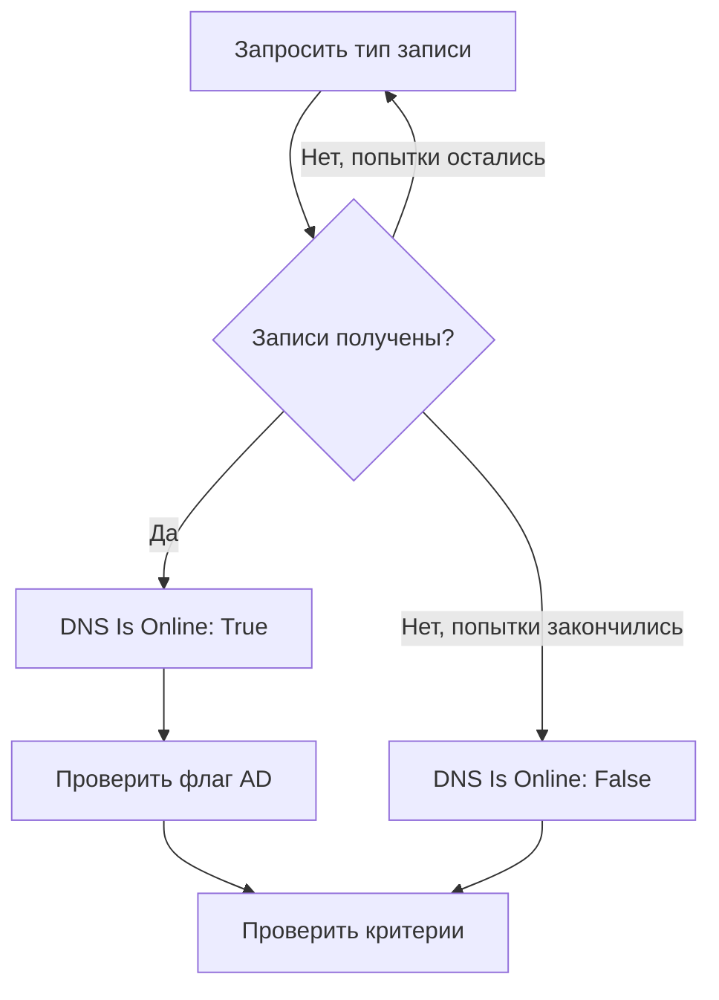

# Мониторинг DNS

Монитор DNS запрашивает DNS-запись по расписанию и проверяет ответ: что имя разрешается, насколько быстро и что говорят записи. Используйте его, чтобы заметить сбой DNS, изменившуюся или пропавшую запись или медленный резолвер раньше, чем это заметят пользователи.

:::cards
- [Создать монитор](#создание-монитора-dns): Шесть шагов в панели управления.
- [Параметры конфигурации](#параметры-конфигурации): Имя, тип записи и DNS-сервер.
- [Критерии мониторинга](#критерии-мониторинга): Разрешение имени, записи, время ответа и DNSSEC.
- [Устранение неполадок](#устранение-неполадок): Когда монитор и `dig` не согласны.
:::

## Как это работает

При каждой проверке зонд запрашивает у DNS-сервера один тип записи для одного имени, например записи `A` для `example.com`. Имя в сети, когда сервер отвечает хотя бы одной записью этого типа. Запрос, который завершается ошибкой, превышает тайм-аут или не возвращает ни одной записи, повторяется через секунду — столько раз, сколько повторных попыток вы задали. Затем зонд спрашивает валидирующий резолвер, несёт ли ответ флаг authenticated data (AD) из DNSSEC, и OneUptime пропускает результат через критерии монитора.



Зонд, потерявший собственное сетевое подключение, не сообщает никакого результата, поэтому не может пометить ваш DNS как не в сети.

## Перед началом

- **Роль, которая может создавать мониторы**: Project Owner, Project Admin, Project Member, Monitor Admin или Monitor Member либо пользовательская роль с разрешением Create Monitor.
- **Зонд, который может достучаться до DNS-сервера.** Зонды проекта по умолчанию выбираются для каждого нового монитора. Чтобы запрашивать DNS-сервер в частной сети, например внутренний резолвер, используйте [пользовательский зонд](/docs/probe/custom-probe) внутри этой сети.

## Создание монитора DNS

:::steps
### Начните новый монитор

Перейдите в **Мониторы** и нажмите **Создать монитор**. В **Тип монитора** нажмите **Другие типы мониторов** и выберите **DNS** в разделе **DNS Monitoring**.

### Назовите его

Введите **Имя**, например `example.com A records`, и нажмите **Далее**.

### Введите запрос

Введите **Доменное имя** для запроса, например `example.com`, и выберите его **Тип записи**. Чтобы запрашивать определённый сервер, укажите его в **DNS-сервер (необязательно)**; оставьте поле пустым, чтобы использовать собственный резолвер зонда.

### Протестируйте его

Нажмите **Протестировать монитор**, выберите зонд в **Выберите зонд** и нажмите **Запустить тест**. **Результат теста монитора** показывает записи, которые получил зонд.

### Проверьте критерии

**Критерии монитора** начинаются с [критериев по умолчанию](#критерии-по-умолчанию): не в сети, когда имя не разрешается, в сети, когда разрешается. Чтобы проверять, что говорят записи, добавьте фильтр **DNS Record Value**, затем нажмите **Далее**.

### Выберите зонды и создайте

Оставьте или измените **Зонды** и **Интервал мониторинга** (он начинается с **Каждые 5 минут**), затем нажмите **Создать монитор**. Откроется страница монитора.
:::

## Параметры конфигурации

| Поле | По умолчанию | Что ввести |
| --- | --- | --- |
| **Доменное имя** | Нет | Имя для запроса, например `example.com` или `_sip._tcp.example.com`. Для записи `PTR` — обратное имя, например `34.216.184.93.in-addr.arpa`. |
| **Тип записи** | `A` | Тип записи для запроса. См. [Типы записей](#типы-записей). |
| **DNS-сервер (необязательно)** | Резолвер зонда | DNS-сервер, который запрашивается вместо него, например `8.8.8.8` или `ns1.example.com`. Все типы записей, включая `CAA`, запрашиваются у него. |
| **Порт** (в **Дополнительные поля**) | `53` | Порт сервера из **DNS-сервер (необязательно)**. Проверка DNSSEC обращается на тот же порт. |
| **Тайм-аут (ms)** (в **Дополнительные поля**) | `5000` | Сколько ждать ответа, в миллисекундах. |
| **Повторные попытки** (в **Дополнительные поля**) | `3` | Повторные попытки после неудачи первой. `0` означает одну попытку. |

### Типы записей

Критерий с **DNS Record Value** сравнивает ваш текст с каждой записью в том виде, в каком её записывает зонд, поэтому придерживайтесь этого формата:

| Тип записи | Что содержит | Формат значения для критериев |
| --- | --- | --- |
| `A` | Адреса IPv4 | `93.184.216.34` |
| `AAAA` | Адреса IPv6 | `2606:2800:220:1:248:1893:25c8:1946` |
| `CNAME` | Имя, псевдонимом которого является это имя | `example.net` |
| `MX` | Почтовые серверы | `10 mail.example.com` (приоритет, затем сервер) |
| `NS` | Серверы имён | `ns1.example.com` |
| `TXT` | Текст, например записи SPF и записи подтверждения | `v=spf1 include:_spf.example.com ~all` |
| `SOA` | Начальная запись зоны (start of authority) | `ns1.example.com hostmaster.example.com 2024010101 7200 3600 1209600 3600` (сервер, контакт, серийный номер, refresh, retry, expire, минимальный TTL) |
| `PTR` | Имя, на которое указывает адрес (обратный DNS) | `server1.example.com` |
| `SRV` | Службы | `10 5 5060 sip.example.com` (приоритет, вес, порт, цель) |
| `CAA` | Центры сертификации, которым разрешено выпускать сертификаты для имени | `0 letsencrypt.org` (флаг, затем центр сертификации) |

Запись `TXT`, разбитая на несколько строк, объединяется в одно значение.

## Критерии мониторинга

Критерии определяют, когда имя считается в сети, деградировавшим или не в сети, и объявляется ли при этом инцидент или создаётся оповещение. Каждый критерий проверяет один или несколько фильтров:

| Фильтр | Условия | Что проверяет |
| --- | --- | --- |
| **DNS Is Online** | **Истина**, **Ложь** | Вернул ли запрос хотя бы одну запись этого типа. |
| **DNS Response Time (in ms)** | **Greater Than**, **Less Than**, **Greater Than Or Equal To**, **Less Than Or Equal To** | Сколько длился запрос. |
| **DNS Record Exists** | **Истина**, **Ложь** | Вернулась ли хоть одна запись этого типа. |
| **DNS Record Value** | **Содержит**, **Not Contains**, **Starts With**, **Ends With**, **Equal To**, **Not Equal To** | Значения записей. Фильтр совпадает, когда совпадает любая одна запись. |
| **DNSSEC Is Valid** | **Истина**, **Ложь** | Устанавливает ли валидирующий резолвер флаг AD в ответе. |

**DNS Record Value** совпадает, когда совпадает _любая_ из записей. При нескольких записях `A` условие **Equal To** `93.184.216.34` совпадает, когда одна из них — этот адрес, а **Not Equal To** совпадает, когда одна из них им не является.

**DNSSEC Is Valid** обращается к серверу из **DNS-сервер (необязательно)** на его **Порт** или к Google Public DNS (`8.8.8.8`), когда поле пустое, поэтому указанный вами сервер должен валидировать DNSSEC. У фильтра нет значения, и он не совпадает ни в одну сторону, когда зонд не может выполнить эту проверку. Для полной проверки подписанной зоны используйте [монитор DNSSEC](/docs/monitor/dnssec-monitor).

При двух и более фильтрах **Условие совпадения** решает, должны ли совпасть **Все** или достаточно **Любой** из них. **Действия** критерия определяют, что он делает: меняет статус монитора, создаёт оповещение, объявляет инцидент или делает несколько из этого.

### Критерии по умолчанию

Новый монитор DNS начинает с двух критериев:

- **Не в сети** — имя не разрешается или не имеет записи этого типа после всех повторных попыток. Монитор помечается как **Не в сети**, и создаётся инцидент с названием «_monitor name_ is offline». Инцидент разрешается сам, когда имя снова разрешается.
- **В сети** — имя разрешается. Монитор помечается как **Работает**.

Критерии проверяются сверху вниз, и первый совпавший решает, что произойдёт. Если ни один не совпал, монитор показывает статус по умолчанию: **Работает**, если вы не выберете другой в разделе **Дополнительные поля** под критериями.

### Оценка за период времени

**Оценивать этот критерий в течение определённого периода времени** — флажок под фильтром, доступный для **DNS Is Online** и **DNS Response Time (in ms)**. Включите его, чтобы оценивать окно прошлых проверок вместо последней: выберите агрегацию в **Оценить** и окно от 2 до 60 минут в **За последние (в минутах)**.

| Агрегация | Совпадает, когда |
| --- | --- |
| **Среднее**, **Сумма**, **Maximum Value**, **Minimum Value** | Это значение за окно удовлетворяет условию. Только для **DNS Response Time (in ms)**. |
| **All Values** | Каждая проверка в окне удовлетворяет условию. |
| **Any Value** | Хотя бы одна проверка в окне удовлетворяет условию. |

**All Values** совпадает только тогда, когда окно действительно покрыто данными. У только что созданного монитора или монитора, проверки которого перестали записываться, недостаточно истории, чтобы что-то сказать о последних N минутах, поэтому критерий ждёт, а не срабатывает по единственному имеющемуся значению. **Any Value** — это настройка для «сообщи мне сразу, как только хоть одна проверка превысит порог», и она по-прежнему срабатывает немедленно.

**Если нет данных** определяет, что происходит, пока окно не может подкрепить критерий:

| Вариант | Что происходит | Для чего использовать |
| --- | --- | --- |
| **Ignore** (по умолчанию) | Критерий не совпадает. | Обычные пороговые оповещения. |
| **Триггер** | Отсутствие данных считается проблемой. | Проверки, где молчание само по себе — сбой. |
| **Treat As Zero** | Окно сравнивается как один ноль. | Счётчики, где отсутствие событий действительно означает ноль. |

### Примеры критериев

| Цель | Фильтр | Условие | Значение |
| --- | --- | --- | --- |
| Не в сети, когда имя перестаёт разрешаться | **DNS Is Online** | **Ложь** | — |
| Оповещать, когда меняется единственная запись `A` имени | **DNS Record Value** | **Not Equal To** | `93.184.216.34` |
| Оповещать, когда запись `MX` указывает за пределы вашего домена | **DNS Record Value** | **Not Contains** | `example.com` |
| Помечать DNS деградировавшим, когда он медленный | **DNS Response Time (in ms)** | **Greater Than** | `500` |
| Оповещать, когда проверка DNSSEC не проходит | **DNSSEC Is Valid** | **Ложь** | — |

## Устранение неполадок

:::details Монитор показывает «не в сети», но у меня имя разрешается
Зонд обратился к другому серверу или запросил другой тип записи. Проверьте **Тип записи**: у имени только с `CNAME` или только с записями `AAAA` нет записи `A`. Сравните с `dig` к тому же серверу:

```bash
dig @8.8.8.8 example.com A
```
:::

:::details Критерий с Not Equal To срабатывает, хотя нужный адрес на месте
**DNS Record Value** совпадает, когда совпадает любая одна запись. При нескольких записях **Not Equal To** срабатывает, как только одна из них отличается. Чтобы проверить, что определённое значение есть среди записей, опирайтесь на порядок критериев, ведь побеждает первое совпадение:

1. Оставьте критерий «не в сети» по умолчанию наверху: **DNS Is Online** / **Ложь**.
2. Ниже добавьте критерий с **DNS Record Value** / **Equal To** / ожидаемым значением, который помечает монитор как **Работает**.
3. Ещё ниже добавьте критерий с **DNS Is Online** / **Истина**, который помечает монитор как **Не в сети** и объявляет инцидент. Он совпадает только с ответами без этого значения.
:::

:::details DNSSEC Is Valid никогда не совпадает
Сервер из **DNS-сервер (необязательно)** не валидирует DNSSEC и поэтому никогда не устанавливает флаг AD, или зонд не смог выполнить проверку. Оставьте поле пустым, чтобы валидировать через `8.8.8.8`, или используйте [монитор DNSSEC](/docs/monitor/dnssec-monitor).
:::

## Дальнейшие шаги

:::cards
- [Мониторинг DNSSEC](/docs/monitor/dnssec-monitor): Проверка цепочки доверия подписанной зоны.
- [Мониторинг домена](/docs/monitor/domain-monitor): Наблюдение за регистрацией домена и сроком её действия.
- [Пользовательские probes](/docs/probe/custom-probe): Запросы к внутренним DNS-серверам из вашей собственной сети.
- [Обзор инцидентов](/docs/incidents/index): Что происходит после того, как монитор объявил инцидент.
:::
