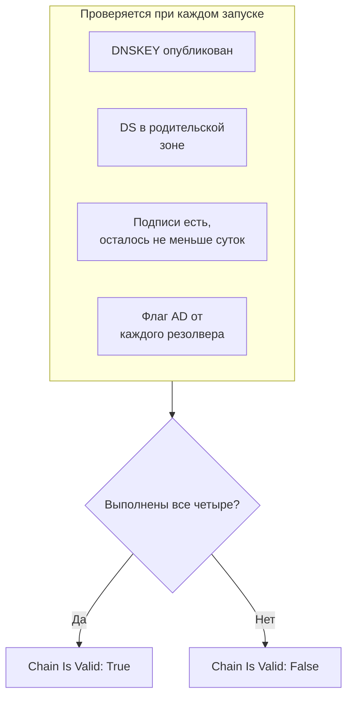

# Мониторинг DNSSEC

Монитор DNSSEC проверяет, что подписанная DNS-зона по-прежнему проходит валидацию: что она публикует свои ключи, что родительская зона за неё ручается, что её подписи не истекли и что валидирующие резолверы её принимают. Используйте его, чтобы заметить разорванную цепочку доверия до того, как резолверы начнут отвечать `SERVFAIL` для вашего домена.

:::cards
- [Создать монитор](#создание-монитора-dnssec): Шесть шагов в панели управления.
- [Что проверяется](#как-это-работает): Проверки, на которых держится действительная цепочка.
- [Критерии мониторинга](#критерии-мониторинга): Действительность цепочки, ключи, записи DS, подписи, резолверы и серверы имён.
- [Лучшие практики](#лучшие-практики): Пороги и резолверы, которые работают.
:::

## Как это работает

При каждой проверке зонд выполняет набор DNS-запросов к зоне:

| Запрос | К кому | Что сообщает |
| --- | --- | --- |
| `DNSKEY` | К первому резолверу из **Резолверы** | Публикует ли зона свои ключи подписи. |
| `DS` | К первому резолверу из **Резолверы** | Публикует ли родительская зона для этой зоны запись delegation signer. |
| `SOA`, с записями DNSSEC | К первому резолверу из **Резолверы** | Подписаны ли записи зоны (`RRSIG`, подписывающая её запись `SOA`) и когда истекает подпись, которая истекает раньше всех. |
| `A`, с валидацией DNSSEC | К каждому резолверу из **Резолверы** | Принимает ли зону каждый валидирующий резолвер, что он показывает флагом authenticated data (AD). |
| `NS`, затем `SOA` | К первому резолверу, затем к каждому названному им авторитетному серверу имён | Отдаёт ли каждый сервер имён один и тот же серийный номер SOA. Только когда включено **Проверить согласованность серверов имён**. |

Валидирующие резолверы проверяют цепочку доверия от корня вниз, поэтому флаг AD говорит о том, что держится вся цепочка. Цепочка считается действительной, когда выполнено всё это:

Подпись, у которой осталось меньше суток, уже считается нарушенной, поэтому вы узнаете об этом за сутки до того, как резолверы начнут отвергать зону. Проверка, обнаружившая разорванную цепочку или рассогласованные серверы имён, повторяется через секунду — столько раз, сколько повторных попыток вы задали, — прежде чем OneUptime пропустит результат через критерии монитора. Все запросы одной попытки делят общий срок в три раза больше **Тайм-аут (ms)**; попытка, у которой закончилось время, сообщает о тайм-ауте, а не выносит вердикт о зоне.

## Перед началом

- **Роль, которая может создавать мониторы**: Project Owner, Project Admin, Project Member, Monitor Admin или Monitor Member либо пользовательская роль с разрешением Create Monitor.
- **Подписанная зона.** Зона должна быть подписана, а её запись DS опубликована в родительской зоне через вашего регистратора.
- **Исходящий DNS с зонда** к указанным вами резолверам и, для проверки согласованности серверов имён, к авторитетным серверам имён зоны. Зонды проекта по умолчанию выбираются для каждого нового монитора.

## Создание монитора DNSSEC

:::steps
### Начните новый монитор

Перейдите в **Мониторы** и нажмите **Создать монитор**. В **Тип монитора** нажмите **Другие типы мониторов** и выберите **DNSSEC** в разделе **DNS Monitoring**.

### Назовите его

Введите **Имя**, например `example.com DNSSEC`, и нажмите **Далее**.

### Введите зону

В **Зона (доменное имя)** введите зону для валидации, например `example.com`. Оставьте **Резолверы** по умолчанию или перечислите свои через запятую. Оставьте **Проверить согласованность серверов имён** включённым, если только ваша сеть не блокирует DNS к произвольным серверам.

### Протестируйте его

Нажмите **Протестировать монитор**, выберите зонд в **Выберите зонд** и нажмите **Запустить тест**. **Результат теста монитора** показывает, что нашла каждая проверка.

### Проверьте критерии

**Критерии монитора** начинаются с [критериев по умолчанию](#критерии-по-умолчанию): не в сети, когда цепочка разорвана, в сети, когда она действительна. Чтобы получать предупреждение до истечения подписей, добавьте критерий (см. [Лучшие практики](#лучшие-практики)), затем нажмите **Далее**.

### Выберите зонды и создайте

Оставьте или измените **Зонды** и **Интервал мониторинга** (он начинается с **Каждые 5 минут**), затем нажмите **Создать монитор**. Откроется страница монитора.
:::

## Параметры конфигурации

| Поле | По умолчанию | Что ввести |
| --- | --- | --- |
| **Зона (доменное имя)** | Нет | Зона для валидации, например `example.com`. |
| **Резолверы** | `1.1.1.1, 8.8.8.8, 9.9.9.9` | Валидирующие резолверы для запросов, через запятую. Каждый должен вернуть флаг AD, чтобы цепочка считалась действительной. |
| **Проверить согласованность серверов имён** | Включено | Запрашивать каждый авторитетный сервер имён напрямую и сравнивать их серийные номера SOA. Выключите, если ваша сеть блокирует исходящий DNS к произвольным серверам. |
| **Предупреждение об истечении срока действия подписи (дней)** (в **Дополнительные поля**) | `7` | Сохраняется вместе с монитором. Фильтр **DNSSEC Signature Expires In Days** использует значение, которое вы задаёте ему в критерии, поэтому указывайте порог там. |
| **Тайм-аут (ms)** (в **Дополнительные поля**) | `10000` | Сколько ждать каждого DNS-запроса, в миллисекундах. Одна попытка может занять в сумме до трёх раз больше. |
| **Повторные попытки** (в **Дополнительные поля**) | `3` | Повторные попытки после неудачи первой. `0` означает одну попытку. |

## Критерии мониторинга

Критерии определяют, когда зона считается в сети, деградировавшей или не в сети, и объявляется ли при этом инцидент или создаётся оповещение. Каждый критерий проверяет один или несколько фильтров:

| Фильтр | Условия | Что проверяет |
| --- | --- | --- |
| **DNSSEC Chain Is Valid** | **Истина**, **Ложь** | Выполнены все четыре проверки выше: ключи опубликованы, DS есть в родительской зоне, подписи есть и у них осталось не меньше суток, и флаг AD пришёл от каждого резолвера. |
| **DNSSEC DNSKEY Record Exists** | **Истина**, **Ложь** | Зона публикует хотя бы одну запись DNSKEY. |
| **DNSSEC DS Record Exists At Parent** | **Истина**, **Ложь** | Родительская зона публикует для зоны запись DS. |
| **DNSSEC Signature Expires In Days** | **Greater Than**, **Less Than**, **Greater Than Or Equal To**, **Less Than Or Equal To** | Целые сутки до истечения подписи (RRSIG), которая истекает раньше всех. |
| **DNSSEC Resolver Consensus (AD Flag)** | **Истина**, **Ложь** | Каждый резолвер из **Резолверы** возвращает флаг AD. |
| **DNSSEC Nameservers Are Consistent** | **Истина**, **Ложь** | Каждый авторитетный сервер имён отвечает одним и тем же серийным номером SOA. Всегда **Истина**, пока **Проверить согласованность серверов имён** выключено. |

При двух и более фильтрах **Условие совпадения** решает, должны ли совпасть **Все** или достаточно **Любой** из них. **Действия** критерия определяют, что он делает: меняет статус монитора, создаёт оповещение, объявляет инцидент или делает несколько из этого.

### Критерии по умолчанию

Новый монитор DNSSEC начинает с двух критериев:

- **Цепочка разорвана** — **DNSSEC Chain Is Valid** равно **Ложь**. Монитор помечается как **Не в сети**, и создаётся инцидент с названием «_monitor name_ DNSSEC chain is broken». Инцидент разрешается сам, как только цепочка снова становится действительной.
- **Цепочка действительна** — монитор помечается как **Работает**.

Критерии проверяются сверху вниз, и первый совпавший решает, что произойдёт. Если ни один не совпал, монитор показывает статус по умолчанию: **Работает**, если вы не выберете другой в разделе **Дополнительные поля** под критериями.

Критерии по умолчанию сами не следят за истечением подписей или согласованностью серверов имён. Добавьте для них критерии, как показано ниже.

### Примеры критериев

| Цель | Фильтр | Условие | Значение |
| --- | --- | --- | --- |
| Не в сети, когда цепочка разорвана (по умолчанию) | **DNSSEC Chain Is Valid** | **Ложь** | — |
| Предупреждать до истечения подписей | **DNSSEC Signature Expires In Days** | **Less Than** | `7` |
| Заметить делегирование, потерявшее запись DS | **DNSSEC DS Record Exists At Parent** | **Ложь** | — |
| Заметить разногласия резолверов | **DNSSEC Resolver Consensus (AD Flag)** | **Ложь** | — |
| Заметить рассогласованные серверы имён | **DNSSEC Nameservers Are Consistent** | **Ложь** | — |

## Лучшие практики

1. **Выбирайте резолверы, которые всегда доступны.** Каждый резолвер должен вернуть флаг AD, чтобы цепочка считалась действительной, поэтому резолвер, до которого зонд не может достучаться, проваливает проверку, когда повторные попытки заканчиваются. Значения по умолчанию, `1.1.1.1`, `8.8.8.8` и `9.9.9.9`, обслуживают три разных оператора, что также позволяет заметить зону, которая проходит валидацию у одного резолвера, но не у другого.
2. **Получайте предупреждение до истечения подписей.** Программы подписи переподписывают зону до того, как её подписи истекут, поэтому подпись, близкая к истечению, означает, что переподписывание остановилось. Добавьте критерий с **DNSSEC Signature Expires In Days** / **Less Than** / `7`, который создаёт оповещение, и второй со значением `2`, который объявляет инцидент. Перетащите оба выше критерия, который помечает цепочку действительной, причём критерий на `2` дня — первым, потому что побеждает первый совпавший критерий. Выбирайте пороги ниже того срока, который ваша программа подписи обычно оставляет подписи перед переподписыванием, чтобы они молчали, пока переподписывание работает.
3. **Отслеживайте каждую подписанную зону.** Включите апекс-домен, подписанные поддомены и любую зону, делегированную другому оператору.
4. **Не выключайте проверку согласованности серверов имён,** и добавьте для неё критерий. Она замечает вторичный сервер, который перестал получать передачи зоны с первичного, — то, что одна лишь валидация DNSSEC может пропустить.

## Устранение неполадок

:::details Цепочка считается разорванной, но зона проходит валидацию в `dig`
Один из резолверов из **Резолверы** не вернул флаг AD: он был недоступен с зонда или не валидирует DNSSEC. Таблица **Resolver Checks** в **Результат теста монитора** и в сводке каждой проверки показывает ответ и ошибку каждого резолвера. Уберите резолверы, до которых зонд не может достучаться, и оставьте только валидирующие.
:::

:::details Серверы имён считаются рассогласованными сразу после изменения
Вторичные серверы некоторое время после изменения зоны могут отставать от первичного. Таблица **Nameserver Consistency** в сводке проверки показывает серийный номер SOA каждого сервера имён. Если один из них так и остаётся позади, этот вторичный сервер перестал получать передачи зоны. Если каждый сервер имён показывает ошибку, зонду, возможно, запрещено запрашивать их напрямую: выключите **Проверить согласованность серверов имён**.
:::

:::details Проверка сообщает о тайм-ауте
Все запросы одной попытки делят срок в три раза больше **Тайм-аут (ms)**. Медленный или недоступный резолвер расходует это время; уберите его из **Резолверы** или увеличьте тайм-аут.
:::

## Дальнейшие шаги

:::cards
- [Мониторинг DNS](/docs/monitor/dns-monitor): Проверка того, что имя разрешается, и того, что говорят его записи.
- [Мониторинг домена](/docs/monitor/domain-monitor): Наблюдение за регистрацией домена и сроком её действия.
- [Мониторинг SSL-сертификатов](/docs/monitor/ssl-certificate-monitor): Наблюдение за сертификатами, которые отдаёт домен.
- [Обзор инцидентов](/docs/incidents/index): Что происходит после того, как монитор объявил инцидент.
:::
