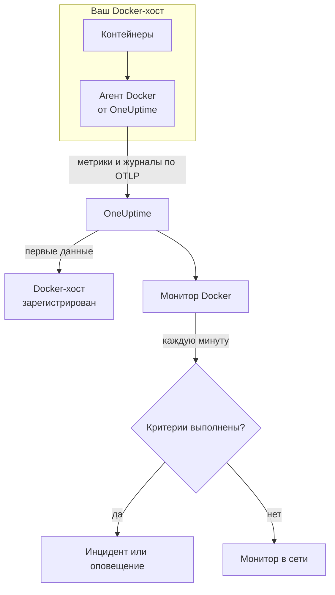

# Мониторинг Docker

Монитор Docker следит за контейнерами на одном Docker-хосте и сообщает, когда контейнер перегревается, исчерпывает память или зацикливается на падениях. Он читает метрики, которые агент Docker от OneUptime отправляет с хоста, поэтому ничего не опрашивается снаружи: установите агент, а затем создайте монитор из шаблона или собственного запроса.

:::cards
- [Создание монитора](#создание-монитора-docker): Шесть шагов в панели управления.
- [Шаблоны](#готовые-шаблоны-оповещений): Шесть готовых оповещений, по одному инциденту на контейнер.
- [Метрики](#собираемые-метрики): Что собирает агент и что означает каждая метрика.
- [Журналы](#собираемые-журналы): Журналы контейнеров и драйвер журналирования, который им нужен.
:::

## Как это работает

Агент Docker от OneUptime работает как контейнер на хосте. Каждые 30 секунд он читает статистику контейнеров из Docker Engine API, отслеживает файлы журналов контейнеров и отправляет и то, и другое в OneUptime по OTLP. Первые данные с хоста регистрируют его в OneUptime.

Монитор Docker привязан к одному хосту. Каждую минуту он выполняет свой запрос по метрикам контейнеров этого хоста и сравнивает результат со своими критериями.



## Перед началом работы

- **Установите агент Docker** на хост. [Руководство по агенту Docker](/docs/telemetry/docker-host) описывает установку, обновление и проверку.
- **Убедитесь, что хост зарегистрирован.** Он появляется в разделе **Продукты → Инфраструктура → Docker → Все хосты** под именем из `DOCKER_HOST_NAME` агента, как только приходят его первые данные.
- **Для журналов контейнеров** запускайте контейнеры с драйвером журналирования Docker `json-file`. См. [Требование к драйверу журналирования](#требование-к-драйверу-журналирования).

## Создание монитора Docker

:::steps
### Начните новый монитор

Перейдите в **Мониторы** и нажмите **Создать монитор**.

### Выберите Docker Container

В разделе **Тип монитора** нажмите **Другие типы мониторов** и выберите **Docker Container** в группе **Инфраструктура** или введите `docker` в поле поиска. Введите **Имя** – оно используется в заголовках инцидентов и оповещений – и нажмите **Далее**.

### Выберите хост

В разделе **Конфигурация монитора Docker** выберите хост в поле **Docker-хост**. В списке есть каждый хост, который присылал данные.

### Выберите, что отслеживать

Выберите одну из трёх вкладок:

- **Quick Setup** – нажмите на [шаблон](#готовые-шаблоны-оповещений). Он задаёт метрику, агрегацию, диапазон времени и пороги и заменяет критерии ниже своими. Поле **Диапазон времени** по-прежнему можно изменить.
- **Custom Metric** – выберите одну метрику в поле **Метрика Docker**, затем задайте **Агрегация** и **Диапазон времени**. **Имя контейнера** и **Образ контейнера** сужают её до части контейнеров.
- **Расширенный** – сами постройте запросы и формулы в разделе **Выберите метрики**. Используйте **Group by** `resource.container.name`, чтобы оценивать каждый контейнер отдельно.

### Проверьте критерии

Откройте каждый критерий в разделе **Критерии монитора** и проверьте его поля **Метрика**, **Агрегация**, **Условие** и **Threshold**. Шаблон заполняет их. С **Custom Metric** или **Расширенный** монитор начинает со [стандартных критериев](#стандартные-критерии), которые замечают только падение метрики до нуля, поэтому задайте собственный порог.

### Создайте монитор

Нажмите **Создать монитор**. OneUptime откроет страницу монитора и будет оценивать его каждую минуту. Инциденты и оповещения, которые он открывает, также видны на страницах хоста **Инциденты** и **Оповещения**.
:::

> [!TIP]
> Чтобы настроить сразу несколько шаблонов, откройте хост через **Продукты → Инфраструктура → Docker** и перейдите в **Recommendations**. Выберите нужные шаблоны и тех, кого вызывать, и OneUptime создаст по одному монитору на шаблон.

## Настройки монитора

| Поле | Вкладка | Что делает |
| --- | --- | --- |
| **Docker-хост** | Все | Обязательно. Ограничивает каждый запрос значением `resource.host.name` хоста. OneUptime также добавляет к каждому запросу `resource.container.runtime = docker`. |
| **Метрика Docker** | Custom Metric | Одна метрика из каталога агента, сгруппированная как CPU, память, сеть, блочный ввод-вывод и контейнер. |
| **Имя контейнера** | Custom Metric, Расширенный | Необязательно. Точное совпадение с `resource.container.name`, например `my-container`. |
| **Образ контейнера** | Custom Metric, Расширенный | Необязательно. Точное совпадение с `resource.container.image.name`, например `nginx:latest`. |
| **Агрегация** | Custom Metric | Как объединяются замеры: **Среднее**, **Максимум**, **Минимум**, **Сумма** или **Количество**. Начинается с обычной агрегации метрики. |
| **Диапазон времени** | Все | Скользящее окно, которое читает запрос, от **Past 1 Minute** до **Past 365 Days**. Новый монитор начинает с **Past 1 Minute**; шаблоны задают свой. |
| **Выберите метрики** | Расширенный | Конструктор запросов: **Метрика**, **Aggregate by**, **Filter by attributes**, **Group by**, а также **Добавить метрику** и **Добавить формулу** для объединения запросов. |

## Готовые шаблоны оповещений

**Quick Setup** предлагает шесть шаблонов. Каждый строит полный монитор: запрос, сгруппированный по `resource.container.name`, критерий, который срабатывает, и критерий, который восстанавливает. Каждый контейнер оценивается отдельно, поэтому один загруженный контейнер не скрывает другой, и каждый контейнер за порогом получает собственный инцидент и собственное оповещение. Пороги – отправная точка, их можно менять.

Если в таблице не сказано иное, критерий срабатывает, только когда условие выполняется в каждую минуту его окна, и восстанавливается на 10 % за порогом, чтобы значение, колеблющееся у границы, не переключалось туда-обратно.

| Шаблон | Серьёзность | Что отслеживает | Срабатывает, когда | Восстанавливается, когда |
| --- | --- | --- | --- | --- |
| High Container CPU Usage | Warning | `container.cpu.utilization`, Max по контейнеру, последние 5 минут | Выше 80 (% одного ядра) | 72 или ниже |
| High Container Memory Usage | Warning | `container.memory.percent`, Max по контейнеру, последние 5 минут | Выше 85 % | 76,5 % или ниже |
| Container Restart Loop | Критический | Рост `container.restarts` по контейнеру, последние 15 минут | Более 3 перезапусков в окне (Сумма) | 2,7 или меньше |
| Container CPU Throttling | Warning | Рост `container.cpu.throttling_data.throttled_time` в мс по контейнеру, последние 5 минут | Более 1000 мс в окне (Сумма) | 900 мс или меньше |
| High Container Process Count | Warning | `container.pids.count`, Max по контейнеру, последние 5 минут | Выше 2000 | 1800 или ниже |
| Container Down (Low Uptime) | Критический | `container.uptime`, Min по контейнеру, последняя 1 минута | Равно 0 | Выше 0 |

**Серьёзность** – это метка, которую показывает список выбора. Инцидент и оповещение, которые создаёт шаблон, начинаются с самого серьёзного уровня инцидентов и оповещений вашего проекта; измените их в критериях.

> [!NOTE]
> `container.cpu.utilization` – это число, которое выводит `docker stats`: 100 % – это одно полное ядро CPU, а не весь хост, поэтому контейнер, использующий два ядра, показывает 200. На многоядерном хосте порог 80 – это бюджет CPU, а не доля машины.

> [!NOTE]
> `container.memory.percent` делит на лимит памяти контейнера, если он задан, а иначе – на общую память **хоста**. Прежде чем считать превышение признаком скорого завершения из-за нехватки памяти, проверьте, был ли контейнер запущен с `--memory`.

> [!WARNING]
> `container.restarts` и `container.cpu.throttling_data.throttled_time` только растут, поэтому эти два шаблона оповещают о том, насколько они выросли в окне: запрос Максимум и запрос Минимум за каждую минуту, вычтенные формулой и просуммированные. При сборе агентом каждые 30 секунд это видит примерно половину реальной активности, и пороги уже это учитывают. Если увеличить `collection_interval` агента до 60 секунд или больше, в каждой минуте окажется один замер, и оба шаблона перестанут оповещать.

> [!CAUTION]
> **Container Down (Low Uptime)** не может поймать контейнер, который остановился и остаётся остановленным. Агент сообщает только о запущенных контейнерах, поэтому остановленный контейнер вообще не присылает данных, и его время работы никогда не равно 0. Для сервиса, который должен работать постоянно, также следите за тем, что он обслуживает, – например, с помощью [монитора API](/docs/monitor/api-monitor).

## Собираемые метрики

Агент использует приёмник OpenTelemetry `docker_stats` с сокетом Docker каждые 30 секунд. Метрики каждого контейнера несут его идентификацию в виде атрибутов ресурса: `resource.container.name`, `resource.container.image.name`, `resource.container.id`, `resource.container.runtime` (`docker`) и `resource.host.name`.

### CPU

| Метрика | Описание |
| --- | --- |
| `container.cpu.utilization` | Использование CPU, где 100 % – одно полное ядро CPU (столбец CPU% в `docker stats`). |
| `container.cpu.usage.total` | Время CPU, использованное с момента запуска контейнера, в наносекундах. Счётчик за всё время жизни. |
| `container.cpu.throttling_data.throttled_time` | Наносекунды, в течение которых контейнер ограничивался своим лимитом CPU с момента запуска. Счётчик за всё время жизни. |
| `container.cpu.throttling_data.throttled_periods` | Периоды ограничения с момента запуска контейнера. Счётчик за всё время жизни. |

### Память

| Метрика | Описание |
| --- | --- |
| `container.memory.usage.total` | Используемая память, в байтах. |
| `container.memory.usage.limit` | Лимит памяти, в байтах. |
| `container.memory.percent` | Использование памяти в процентах от лимита контейнера или от общей памяти хоста, если у контейнера нет лимита. |

### Сеть

| Метрика | Описание |
| --- | --- |
| `container.network.io.usage.rx_bytes` | Полученные байты. Счётчик за всё время жизни. |
| `container.network.io.usage.tx_bytes` | Отправленные байты. Счётчик за всё время жизни. |

### Блочный ввод-вывод

| Метрика | Описание |
| --- | --- |
| `container.blockio.io_service_bytes_recursive.read` | Байты, прочитанные с блочных устройств. |
| `container.blockio.io_service_bytes_recursive.write` | Байты, записанные на блочные устройства. |

### Контейнер

| Метрика | Описание |
| --- | --- |
| `container.uptime` | Секунды с момента запуска контейнера. Сообщают её только запущенные контейнеры. |
| `container.restarts` | Сколько раз контейнер перезапускался с момента создания. Счётчик за всё время жизни. |
| `container.pids.count` | Задачи в контейнере. Контроллер pids группы cgroup считает и потоки, и процессы. |

Список **Метрика Docker** также предлагает `container.cpu.usage.percpu`, `container.memory.rss`, `container.memory.cache` и счётчики сетевых пакетов. Поставляемая конфигурация агента их не включает, поэтому проверьте страницу хоста **Метрики**, прежде чем на них опираться. `container.cpu.throttling_data.throttled_periods` в списке нет; запрашивайте её через **Расширенный**.

## Критерии мониторинга

Критерий сравнивает один из запросов или формул монитора с порогом. У критериев монитора Docker нет поля **Тип фильтра**: каждое правило проверяет значение метрики с такими полями.

| Поле | Что делает |
| --- | --- |
| **Метрика** | Запрос или формула для проверки, по имени переменной. |
| **Агрегация** | Как значения в окне превращаются в один ответ: **Среднее**, **Сумма**, **Maximum Value**, **Minimum Value**, **All Values** (совпасть должно каждое значение) или **Any Value** (достаточно одного). |
| **Условие** | **Greater Than**, **Less Than**, **Greater Than Or Equal To**, **Less Than Or Equal To** или **Equal To** – или условие аномалии: **Anomalously High**, **Anomalously Low** или **Anomalous**. |
| **Threshold** | Значение для сравнения. Рядом стоит список единиц, если у метрики есть единица. Не показывается для условий аномалий. |
| **Чувствительность** | Только для условий аномалий. **Низкий** (4σ), **Средний** (3σ, по умолчанию) или **Высокий** (2σ). |
| **Окно базовой линии** | Только для условий аномалий. 14 дней (по умолчанию), 28, 60 или 90 дней истории. |
| **Если нет данных** | В разделе **Дополнительные поля**. Что происходит, когда в окне нет замеров: **Ignore** (по умолчанию), **Treat As Zero** или **Триггер**. |

Условия аномалий сравнивают каждое значение с тем же часом недели в базовой линии. Они остаются в состоянии «Learning» и ничего не создают, пока окно базовой линии не накопит достаточно истории.

Каждый критерий также указывает, что делать при совпадении: изменить статус монитора, создать оповещение или объявить инцидент. Критерии проверяются сверху вниз, и решает первый совпавший.

### Стандартные критерии

Монитор, который вы создаёте не из шаблона, начинает с двух критериев:

| Порядок | Критерий | Срабатывает, когда | Затем |
| --- | --- | --- | --- |
| 1 | Check if _monitor name_ is offline | Любое значение первого запроса равно `0` | Помечает монитор как **Не в сети** и объявляет инцидент «_monitor name_ is offline», который закрывается сам, когда монитор восстанавливается. |
| 2 | Check if _monitor name_ is online | Любое значение больше `0` | Помечает монитор как **Работает**. |

> [!IMPORTANT]
> Молчание не совпадает ни с одним из критериев: хост, который перестал присылать данные, оставляет монитор в прежнем состоянии. Чтобы узнавать о прекращении данных, установите для **Если нет данных** значение **Триггер** в одном из критериев. Время, когда OneUptime сам не принимал данные, никогда не считается отсутствием данных: проверка, окно которой включает такое время, вместо этого ждёт, как объясняет страница [Когда OneUptime не получает данные](/docs/monitor/when-oneuptime-is-not-receiving).

## Собираемые журналы

Агент также отслеживает файл `*-json.log` каждого контейнера и отправляет каждую строку как запись журнала OpenTelemetry с полями:

| Поле | Значение |
| --- | --- |
| `resource.host.name` | Хост, из `DOCKER_HOST_NAME`. |
| `resource.container.id` | Полный ID контейнера. |
| `resource.container.runtime` | Всегда `docker`. |
| `attributes["log.iostream"]` | `stdout` или `stderr`. |
| `severityText` / `severityNumber` | Берётся из ключевого слова уровня, если уровень указан в строке (`[ERROR]`, `app.INFO:`, `{"level":"warn"}`, `level=error`). Строка без уровня берёт его из своего потока: `stderr` – это `ERROR`, `stdout` – это `INFO`. |
| `body` | Строка, которую записал контейнер. Строки, начинающиеся с пробела или закрывающей скобки, например строки трассировки стека, присоединяются к предыдущей строке. |
| `time` | Отметка времени демона Docker для строки. |

Журналы видны на странице хоста **Журналы** и на странице каждого контейнера.

### Требование к драйверу журналирования

Агент может читать журналы только тех контейнеров, которые используют драйвер журналирования Docker `json-file`. Это драйвер Docker по умолчанию, но контейнер или весь демон могут использовать другой:

| Драйвер | Что видит агент |
| --- | --- |
| `json-file` | Каждую строку. |
| `local` | Ничего: файл двоичный, и агент не может его разобрать. |
| `journald`, `syslog`, `fluentd`, `gelf`, `awslogs`, `splunk`, … | Ничего: журналы уходят в другое место, поэтому отслеживать нечего. |
| `none` | Ничего: журналы отбрасываются. |

Проверьте драйвер контейнера и драйвер демона по умолчанию:

```bash
docker inspect <container> --format '{{.HostConfig.LogConfig.Type}}'
docker info --format '{{.LoggingDriver}}'
```

Переключитесь на `json-file`. Docker задаёт драйвер журналирования контейнера при его создании, поэтому после изменения пересоздайте каждый контейнер – перезапуск сохраняет старый драйвер.

:::tabs
@tab Docker Compose
Задайте драйвер для каждого сервиса, с ротацией:

```yaml title="docker-compose.yml"
services:
  my-app:
    image: my-app:latest
    logging:
      driver: "json-file"
      options:
        max-size: "100m"
        max-file: "5"
```

Затем пересоздайте сервис:

```bash
docker compose up -d --force-recreate <service>
```
@tab Демон Docker
Сделайте `json-file` драйвером по умолчанию для каждого контейнера, созданного после этого:

```json title="/etc/docker/daemon.json"
{
  "log-driver": "json-file",
  "log-opts": {
    "max-size": "100m",
    "max-file": "5"
  }
}
```

Перезапустите демон Docker, затем удалите и пересоздайте каждый контейнер:

```bash
docker rm -f <container>
docker run ... <image>
```
:::

## Устранение неполадок

:::details Хоста нет в списке Docker-хост
Хосты регистрируются сами по данным агента. Проверьте, что контейнер агента запущен и что хост есть в разделе **Продукты → Инфраструктура → Docker → Все хосты**. В [руководстве по агенту Docker](/docs/telemetry/docker-host) есть проверки, которые нужно выполнить на хосте.
:::

:::details Метрики приходят, а страница Журналы пуста
Контейнеры почти наверняка не используют драйвер журналирования `json-file`. Проверьте их командами из раздела [Требование к драйверу журналирования](#требование-к-драйверу-журналирования), переключите те, чьи журналы вам нужны, и пересоздайте их.
:::

:::details Агент пишет в журнал «no files match the configured criteria»
Агент ищет `/var/lib/docker/containers/*/*-json.log` и ничего не нашёл. Либо ни один контейнер на хосте не использует `json-file`, либо у агента нет подключения `/var/lib/docker/containers` (`-v /var/lib/docker/containers:/var/lib/docker/containers:ro`) или оно пустое, либо агент работает в Docker Desktop для macOS, где файлы контейнеров находятся внутри его виртуальной машины Linux.
:::

:::details Данные приходят под неправильным именем хоста
OneUptime определяет хост по `resource.host.name`, которое агент берёт из `DOCKER_HOST_NAME`. Если изменить `DOCKER_HOST_NAME` после первых данных, появится второй хост, а не переименуется первый, и монитор останется привязан к имени, с которым был создан.
:::

:::details Оповещение по CPU никогда не срабатывает
Сгруппируйте запрос по `resource.container.name` и агрегируйте через **Максимум**, как это делает шаблон **High Container CPU Usage**. Среднее по всем контейнерам на загруженном хосте тянут вниз простаивающие. Помните, что 100 % – это одно полное ядро, поэтому контейнеру, которому разрешено несколько ядер, нужен более высокий порог.
:::

:::details Шаблон зацикленных перезапусков или ограничения CPU перестал оповещать
Оба измеряют, насколько вырос счётчик между двумя замерами в одной минуте. Если `collection_interval` агента 60 секунд или больше, в каждой минуте один замер, рост всегда равен 0, и ни один из шаблонов не срабатывает. Оставьте значение агента по умолчанию – 30 секунд.
:::

## Дальнейшие шаги

:::cards
- [Агент Docker](/docs/telemetry/docker-host): Установка, обновление и устранение неполадок агента, данные которого читает этот монитор.
- [Мониторинг Podman](/docs/monitor/podman-monitor): Такой же монитор для хостов Podman.
- [Мониторинг Docker Swarm](/docs/monitor/docker-swarm-monitor): Отслеживайте задачи кластера Swarm.
- [Обзор инцидентов](/docs/incidents/index): Что происходит после того, как критерий объявил инцидент.
:::
