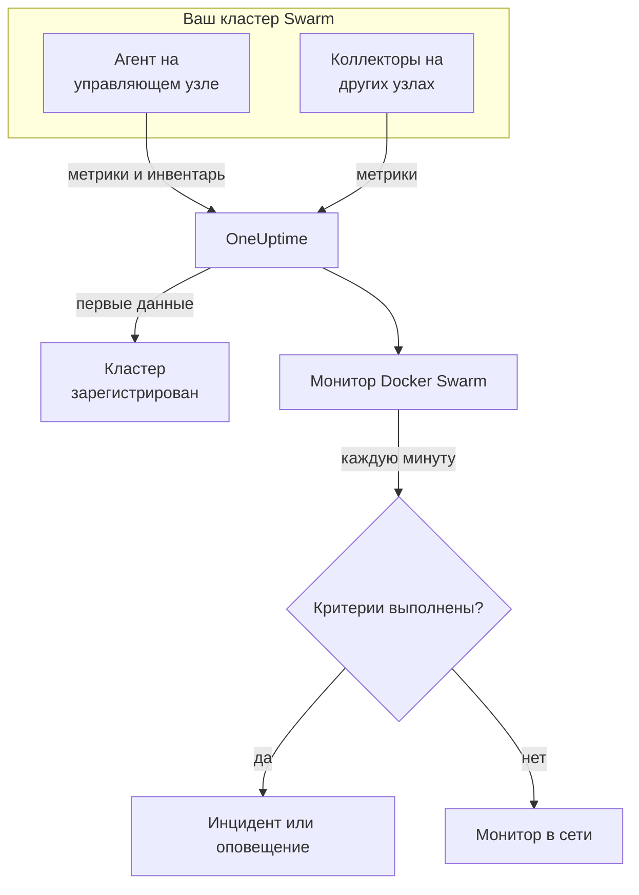

# Мониторинг Docker Swarm

Монитор Docker Swarm следит за контейнерами, стоящими за задачами сервисов кластера Swarm, и сообщает, когда задача перезапускается, перегревается или исчерпывает память. Он читает метрики контейнеров, которые отправляет агент Docker Swarm от OneUptime, поэтому ничего не опрашивается снаружи: установите агент, а затем создайте монитор из шаблона или собственного запроса.

:::cards
- [Создание монитора](#создание-монитора-docker-swarm): Шесть шагов в панели управления.
- [Шаблоны](#готовые-шаблоны-оповещений): Четыре готовых оповещения, по одному инциденту на задачу.
- [Метрики](#собираемые-метрики): Метрики контейнеров, по которым можно оповещать.
- [Фильтры](#настройки-монитора): Сузьте монитор до сервиса, задачи или образа.
:::

## Как это работает

Агент Docker Swarm от OneUptime работает на управляющем узле. Его коллектор каждые 30 секунд читает статистику контейнеров у демона Docker этого узла и помечает каждый пакет именем кластера, `docker.swarm.cluster.name`. Небольшой опросчик инвентаря рядом с ним каждые 5 минут читает узлы, сервисы и задачи кластера из Swarm API. Первые данные регистрируют кластер в OneUptime.

Коллектор видит только контейнеры на том узле, где он работает. Чтобы получать метрики со всех узлов, запустите коллектор на каждом узле с одним и тем же `DOCKER_SWARM_CLUSTER_NAME`.

Монитор Docker Swarm привязан к одному кластеру. Каждую минуту он выполняет свой запрос по метрикам контейнеров этого кластера и сравнивает результат со своими критериями.

## Перед началом работы

- **Установите агент Docker Swarm** на управляющий узел. [Руководство по агенту Docker Swarm](/docs/telemetry/docker-swarm) описывает установку и обновление, а также запуск коллектора на остальных узлах.
- **Убедитесь, что кластер зарегистрирован.** Он появляется в разделе **Продукты → Инфраструктура → Docker Swarm → Все кластеры** под именем из `DOCKER_SWARM_CLUSTER_NAME` агента, как только приходят его первые данные.

## Создание монитора Docker Swarm

:::steps
### Начните новый монитор

Перейдите в **Мониторы** и нажмите **Создать монитор**.

### Выберите Docker Swarm

В разделе **Тип монитора** нажмите **Другие типы мониторов** и выберите **Docker Swarm** в группе **Инфраструктура** или введите `swarm` в поле поиска. Введите **Имя** – оно используется в заголовках инцидентов и оповещений – и нажмите **Далее**.

### Выберите кластер

В разделе **Docker Swarm Monitor Configuration** выберите кластер в поле **Docker Swarm Cluster**. В списке есть каждый кластер, который присылал данные.

### Выберите, что отслеживать

Выберите одну из трёх вкладок:

- **Quick Setup** – нажмите на [шаблон](#готовые-шаблоны-оповещений). Он задаёт метрику, агрегацию, диапазон времени и пороги и заменяет критерии ниже своими. Поле **Диапазон времени** по-прежнему можно изменить.
- **Custom Metric** – выберите одну метрику в поле **Docker Swarm Metric**, затем задайте **Агрегация** и **Диапазон времени**. [Фильтры](#настройки-монитора) сужают её до части задач.
- **Расширенный** – сами постройте запросы и формулы в разделе **Выберите метрики**. Используйте **Group by** `resource.container.name`, чтобы оценивать каждую задачу отдельно.

### Проверьте критерии

Откройте каждый критерий в разделе **Критерии монитора** и проверьте его поля **Метрика**, **Агрегация**, **Условие** и **Threshold**. Шаблон заполняет их. С **Custom Metric** или **Расширенный** монитор начинает со [стандартных критериев](#стандартные-критерии), которые замечают только падение метрики до нуля, поэтому задайте собственный порог.

### Создайте монитор

Нажмите **Создать монитор**. OneUptime откроет страницу монитора и будет оценивать его каждую минуту. Инциденты и оповещения, которые он открывает, также видны на страницах кластера **Инциденты** и **Оповещения**.
:::

> [!TIP]
> Чтобы настроить сразу несколько шаблонов, откройте кластер через **Продукты → Инфраструктура → Docker Swarm** и перейдите в **Recommendations**. Выберите нужные шаблоны и тех, кого вызывать, и OneUptime создаст по одному монитору на шаблон.

## Настройки монитора

| Поле | Вкладка | Что делает |
| --- | --- | --- |
| **Docker Swarm Cluster** | Все | Обязательно. Ограничивает каждый запрос значением `resource.docker.swarm.cluster.name`. Это единственный атрибут ресурса, который проставляет агент, поэтому монитор не добавляет фильтр по `container.runtime` или `host.name`. |
| **Имя сервиса** | Custom Metric, Расширенный | Необязательно. Точное совпадение с `docker.swarm.service.name`, например `web`. |
| **Имя узла** | Custom Metric, Расширенный | Необязательно. Точное совпадение с `docker.swarm.node.name`, например `swarm-node-1`. |
| **Имя контейнера** | Custom Metric, Расширенный | Необязательно. Точное совпадение с `resource.container.name`. Контейнер задачи называется `<service>.<slot>.<taskid>`, например `web.1.abc123`. |
| **Образ контейнера** | Custom Metric, Расширенный | Необязательно. Точное совпадение с `resource.container.image.name`, например `nginx:latest`. |
| **Docker Swarm Metric** | Custom Metric | Одна метрика из [каталога](#собираемые-метрики). |
| **Агрегация** | Custom Metric | Как объединяются замеры: **Среднее**, **Максимум**, **Минимум**, **Сумма** или **Количество**. Начинается с обычной агрегации метрики. |
| **Диапазон времени** | Все | Скользящее окно, которое читает запрос, от **Past 1 Minute** до **Past 365 Days**. Новый монитор начинает с **Past 1 Minute**; шаблоны задают свой. |
| **Выберите метрики** | Расширенный | Конструктор запросов: **Метрика**, **Aggregate by**, **Filter by attributes**, **Group by**, а также **Добавить метрику** и **Добавить формулу** для объединения запросов. |

> [!WARNING]
> Поставляемый агент пока не задаёт `docker.swarm.service.name` и `docker.swarm.node.name`, поэтому монитор с заполненным **Имя сервиса** или **Имя узла** не находит данных. Сужайте вместо этого по **Образ контейнера** или группируйте по `resource.container.name`.

## Готовые шаблоны оповещений

**Quick Setup** предлагает четыре шаблона. Каждый строит полный монитор: запрос, сгруппированный по `resource.container.name`, критерий, который срабатывает, и критерий, который восстанавливает. Каждая задача оценивается отдельно и получает собственный инцидент и собственное оповещение, в первопричине которых перечислены затронутые задачи и их значения. Пороги – отправная точка, их можно менять.

Если в таблице не сказано иное, критерий срабатывает, только когда условие выполняется в каждую минуту его окна, и восстанавливается на 10 % за порогом, чтобы значение, колеблющееся у границы, не переключалось туда-обратно.

| Шаблон | Серьёзность | Что отслеживает | Срабатывает, когда | Восстанавливается, когда |
| --- | --- | --- | --- | --- |
| Task Down (Low Uptime) | Критический | `container.uptime`, Min по задаче, последняя 1 минута | Любое значение меньше 60 секунд | Каждое значение 66 секунд или больше |
| High Task CPU Usage | Warning | `container.cpu.utilization`, Avg по задаче, последние 5 минут | Выше 80 (% одного ядра) | 72 или ниже |
| High Task Memory Usage | Warning | `container.memory.percent`, Avg по задаче, последние 5 минут | Выше 85 % | 76,5 % или ниже |
| High Task Process Count | Warning | `container.pids.count`, Max по задаче, последние 5 минут | Выше 500 | 450 или ниже |

**Серьёзность** – это метка, которую показывает список выбора. Инцидент и оповещение, которые создаёт шаблон, начинаются с самого серьёзного уровня инцидентов и оповещений вашего проекта; измените их в критериях.

> [!NOTE]
> **Task Down (Low Uptime)** срабатывает на одном «молодом» замере, потому что перезапуск – это событие, а не уровень. Swarm даёт задаче-замене новый контейнер, а значит, и новый ряд, поэтому шаблон ищет время работы меньше минуты, а не 0. Развёртывание или увеличение числа реплик тоже вызывает срабатывание, и оповещение снимается, когда новые задачи проработают больше минуты. Задача, которая завершилась и не была заменена, ничего не присылает, поэтому её не поймать.

## Собираемые метрики

Коллектор агента использует приёмник OpenTelemetry `docker_stats`, поэтому метрики – это стандартные метрики контейнеров, по одному ряду на контейнер задачи. Метрик `docker_swarm_*` нет: узлы, сервисы и задачи отслеживаются как инвентарь на страницах кластера **Службы**, **Задачи**, **Узлы** и связанных с ними.

### CPU

| Метрика | Единица | Описание |
| --- | --- | --- |
| `container.cpu.utilization` | % | Использование CPU контейнером задачи, где 100 % – одно полное ядро CPU. |

### Память

| Метрика | Единица | Описание |
| --- | --- | --- |
| `container.memory.usage.total` | байты | Память, используемая контейнером задачи. |
| `container.memory.percent` | % | Используемая память в процентах от лимита контейнера или от общей памяти узла, если сервис не задаёт лимит. |

### Сеть

| Метрика | Единица | Описание |
| --- | --- | --- |
| `container.network.io.usage.rx_bytes` | байты | Байты, полученные контейнером задачи. Счётчик за всё время жизни. |
| `container.network.io.usage.tx_bytes` | байты | Байты, отправленные контейнером задачи. Счётчик за всё время жизни. |

### Контейнер

| Метрика | Единица | Описание |
| --- | --- | --- |
| `container.pids.count` | количество | Процессы внутри контейнера задачи. Резкий рост может означать fork-бомбу или утечку. |
| `container.uptime` | секунды | Сколько работает контейнер задачи. Перепланированная или перезапущенная задача начинает новый контейнер с 0. |

Каждый ряд несёт идентификацию контейнера в виде атрибутов ресурса: `resource.container.name` (`<service>.<slot>.<taskid>`), `resource.container.image.name` и `resource.docker.swarm.cluster.name`.

## Критерии мониторинга

Критерий сравнивает один из запросов или формул монитора с порогом. У критериев монитора Docker Swarm нет поля **Тип фильтра**: каждое правило проверяет значение метрики с такими полями.

| Поле | Что делает |
| --- | --- |
| **Метрика** | Запрос или формула для проверки, по имени переменной. |
| **Агрегация** | Как значения в окне превращаются в один ответ: **Среднее**, **Сумма**, **Maximum Value**, **Minimum Value**, **All Values** (совпасть должно каждое значение) или **Any Value** (достаточно одного). |
| **Условие** | **Greater Than**, **Less Than**, **Greater Than Or Equal To**, **Less Than Or Equal To** или **Equal To** – или условие аномалии: **Anomalously High**, **Anomalously Low** или **Anomalous**. |
| **Threshold** | Значение для сравнения. Рядом стоит список единиц, если у метрики есть единица. Не показывается для условий аномалий. |
| **Чувствительность** | Только для условий аномалий. **Низкий** (4σ), **Средний** (3σ, по умолчанию) или **Высокий** (2σ). |
| **Окно базовой линии** | Только для условий аномалий. 14 дней (по умолчанию), 28, 60 или 90 дней истории. |
| **Если нет данных** | В разделе **Дополнительные поля**. Что происходит, когда в окне нет замеров: **Ignore** (по умолчанию), **Treat As Zero** или **Триггер**. |

Условия аномалий сравнивают каждое значение с тем же часом недели в базовой линии. Они остаются в состоянии «Learning» и ничего не создают, пока окно базовой линии не накопит достаточно истории.

Каждый критерий также указывает, что делать при совпадении: изменить статус монитора, создать оповещение или объявить инцидент. Критерии проверяются сверху вниз, и решает первый совпавший.

### Стандартные критерии

Монитор, который вы создаёте не из шаблона, начинает с двух критериев:

| Порядок | Критерий | Срабатывает, когда | Затем |
| --- | --- | --- | --- |
| 1 | Check if _monitor name_ is offline | Любое значение первого запроса равно `0` | Помечает монитор как **Не в сети** и объявляет инцидент «_monitor name_ is offline», который закрывается сам, когда монитор восстанавливается. |
| 2 | Check if _monitor name_ is online | Любое значение больше `0` | Помечает монитор как **Работает**. |

> [!IMPORTANT]
> Молчание не совпадает ни с одним из критериев: кластер, который перестал присылать данные, оставляет монитор в прежнем состоянии. Чтобы узнавать о прекращении данных, установите для **Если нет данных** значение **Триггер** в одном из критериев. Время, когда OneUptime сам не принимал данные, никогда не считается отсутствием данных: проверка, окно которой включает такое время, вместо этого ждёт, как объясняет страница [Когда OneUptime не получает данные](/docs/monitor/when-oneuptime-is-not-receiving).

## Устранение неполадок

:::details Кластера нет в списке Docker Swarm Cluster
Кластеры регистрируются сами по данным агента. Проверьте, что агент работает на управляющем узле, что задан `DOCKER_SWARM_CLUSTER_NAME` и что кластер есть в разделе **Продукты → Инфраструктура → Docker Swarm → Все кластеры**. В [руководстве по агенту Docker Swarm](/docs/telemetry/docker-swarm) есть проверки, которые нужно выполнить на узле.
:::

:::details Метрики есть только у части задач
Коллектор читает демон Docker того узла, где он работает, поэтому видит только задачи на этом узле. Запустите коллектор на каждом узле с одним и тем же `DOCKER_SWARM_CLUSTER_NAME`.
:::

:::details Монитор с фильтром по сервису или узлу не находит данных
**Имя сервиса** и **Имя узла** сравниваются с `docker.swarm.service.name` и `docker.swarm.node.name`, которые поставляемый агент не задаёт. Очистите их и сужайте по **Образ контейнера** или группируйте по `resource.container.name`.
:::

:::details Все задачи видны как один ряд
Группируйте по атрибуту ресурса `resource.container.name`, как это делают шаблоны. Голое `container.name` ни с чем не совпадает, поэтому все задачи сливаются в один ряд с пустым именем.
:::

## Дальнейшие шаги

:::cards
- [Агент Docker Swarm](/docs/telemetry/docker-swarm): Установка и обновление агента, данные которого читает этот монитор.
- [Мониторинг Docker](/docs/monitor/docker-monitor): Следите за контейнерами одного Docker-хоста.
- [Обзор инцидентов](/docs/incidents/index): Что происходит после того, как критерий объявил инцидент.
- [Расписания дежурств](/docs/on-call/schedules): Решите, кого вызывать, когда задача ломается.
:::
