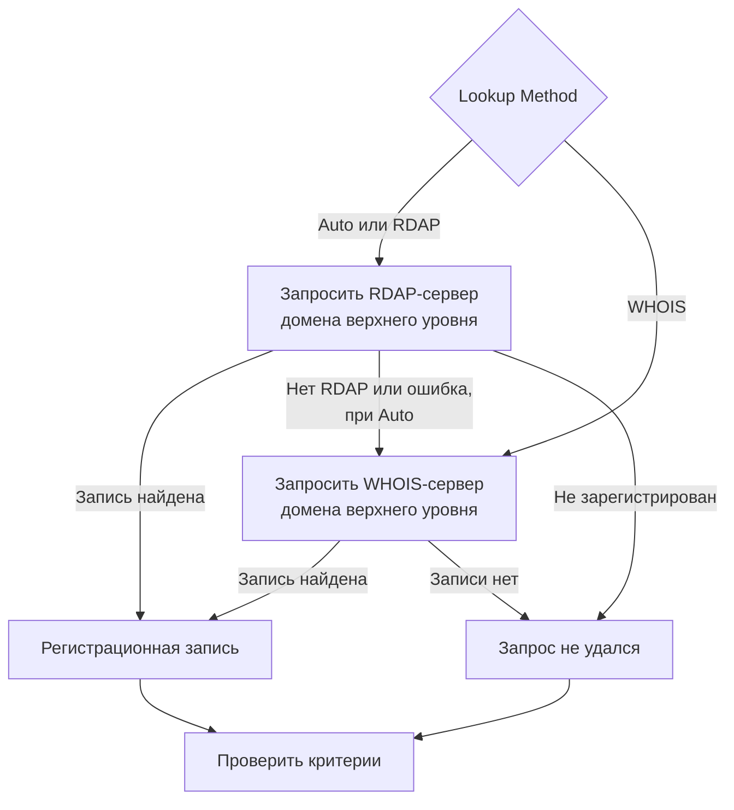

# Мониторинг домена

Монитор домена по расписанию читает регистрационную запись вашего домена, чтобы следить за датой истечения, регистратором, серверами имён и кодами статуса, и предупреждает вас до истечения срока регистрации. Используйте его для каждого домена, от которого зависят ваши сайты, API и почта: истёкшая регистрация выводит их из строя все сразу.

:::cards
- [Создать монитор](#создание-монитора-домена): Шесть шагов в панели управления.
- [Способы запроса](#способы-запроса): RDAP, WHOIS и почему **Auto** — значение по умолчанию.
- [Критерии по умолчанию](#критерии-по-умолчанию): Предупреждение об истечении за 30 дней, без настройки.
- [Устранение неполадок](#устранение-неполадок): Выведенные из эксплуатации серверы WHOIS, прокси и отсутствующие даты.
:::

## Как это работает

При каждой проверке зонд запрашивает регистрационную запись домена через RDAP или WHOIS, в зависимости от **Lookup Method**, и нормализует найденное: дату истечения, регистратора, серверы имён и коды статуса. Неудачный запрос повторяется — столько раз, сколько повторных попыток вы задали. Затем OneUptime пропускает запись через критерии монитора.

Если запрос не может получить регистрационные данные — потому что служба домена верхнего уровня выведена из эксплуатации или домен не зарегистрирован, — монитор сообщается как **не в сети** с причиной, показанной в ответе зонда монитора, а не как исправный с пустой датой истечения. Реестр, который отвечает «этот домен свободен» (например, `Status: free` у DENIC), рассматривается как **не зарегистрирован**, а не как исправная запись.

Интернационализированные доменные имена принимаются в обеих формах: `münchen.de` перед запросом преобразуется в свою A-метку (`xn--mnchen-3ya.de`).

## Перед началом

- **Роль, которая может создавать мониторы**: Project Owner, Project Admin, Project Member, Monitor Admin или Monitor Member либо пользовательская роль с разрешением Create Monitor.
- **Исходящий доступ с зонда** к реестрам. Зонды проекта по умолчанию выбираются для каждого нового монитора; [пользовательскому зонду](/docs/probe/custom-probe) нужен доступ к:

| Назначение | Протокол | Для чего |
| --- | --- | --- |
| `https://data.iana.org/rdap/dns.json` | HTTPS, порт 443 | Bootstrap-реестр RDAP от IANA, в котором указано, где находится RDAP-сервер каждого домена верхнего уровня. Загружается один раз и кэшируется на 24 часа. |
| RDAP-серверы реестров | HTTPS, порт 443 | Запросы RDAP. |
| Серверы WHOIS | TCP-порт 43 | Запросы WHOIS. |

Запросы RDAP учитывают настройки зонда `HTTP_PROXY_URL` / `HTTPS_PROXY_URL` / `NO_PROXY`. WHOIS работает через «сырой» сокет и их не учитывает. Если зонд не может достучаться до `data.iana.org`, **Auto** переходит на WHOIS и снова пробует IANA через пять минут.

## Создание монитора домена

:::steps
### Начните новый монитор

Перейдите в **Мониторы** и нажмите **Создать монитор**. В **Тип монитора** нажмите **Другие типы мониторов** и выберите **Домен** в разделе **Basic Monitoring**.

### Назовите его

Введите **Имя**, например `example.com registration`, и нажмите **Далее**.

### Введите домен

Введите **Доменное имя**, например `example.com`. Оставьте **Lookup Method** на **Auto**, если у вас нет причин поступить иначе (см. [Способы запроса](#способы-запроса)).

### Протестируйте его

Нажмите **Протестировать монитор**, выберите зонд в **Выберите зонд** и нажмите **Запустить тест**. **Результат теста монитора** показывает регистрационную запись, прочитанную зондом, и то, кто ответил: RDAP или WHOIS.

### Проверьте критерии

**Критерии монитора** начинаются с [критериев по умолчанию](#критерии-по-умолчанию): не в сети, когда регистрация истекла или её не удаётся прочитать, оповещение, когда она истекает через 30 дней или раньше. Измените их при необходимости и нажмите **Далее**.

### Выберите зонды и создайте

Оставьте или измените **Зонды** и **Интервал мониторинга** (он начинается с **Каждые 5 минут**), затем нажмите **Создать монитор**. Откроется страница монитора.
:::

## Параметры конфигурации

| Поле | По умолчанию | Что ввести |
| --- | --- | --- |
| **Доменное имя** | Нет | Зарегистрированный домен, например `example.com`. Вставленный адрес тоже подойдёт: `https://example.com/pricing` читается как `example.com`. |
| **Lookup Method** | **Auto** | **Auto**, **RDAP** или **WHOIS**. См. [Способы запроса](#способы-запроса). |
| **Тайм-аут (ms)** (в **Дополнительные поля**) | `10000` | Сколько ждать каждого запроса регистрации, в миллисекундах. |
| **Повторные попытки** (в **Дополнительные поля**) | `3` | Повторные попытки после неудачи первой. `0` означает одну попытку. |

Каждый неудачный запрос повторяется, с паузой в одну секунду между попытками. Это касается и случаев, когда реестр отвечает, что домен не зарегистрирован или что у него нет службы регистрации, — на случай, если ответ был временным сбоем. Только неправильно составленное доменное имя сообщается сразу, без запроса.

Тайм-аут применяется к каждому запросу, а не ко всей проверке: проверка с **Auto**, которая пробует RDAP, а затем переходит на WHOIS, может занять вдвое больше времени или ещё дольше.

### Способы запроса

Регистрационные данные можно прочитать по двум протоколам, и какой из них работает, зависит от домена верхнего уровня.

| Способ | Поведение |
| --- | --- |
| **Auto** | По умолчанию. Использует RDAP, когда домен верхнего уровня публикует службу RDAP, и переходит на WHOIS, когда не публикует или когда запрос RDAP не удаётся. |
| **RDAP** | Только RDAP. Завершается понятной ошибкой, если домен верхнего уровня не публикует службу RDAP. |
| **WHOIS** | Только WHOIS. |

**RDAP** ([RFC 9083](https://www.rfc-editor.org/rfc/rfc9083)) — обязательная по требованию ICANN замена WHOIS. Авторитетный сервер каждого домена верхнего уровня находится через [bootstrap-реестр IANA](https://www.rfc-editor.org/rfc/rfc9224), поэтому он остаётся правильным при переездах реестров. Каждый gTLD публикует такой сервер. Когда RDAP-сервер домена верхнего уровня сообщает, что домен не зарегистрирован, **Auto** принимает это как ответ и не обращается к WHOIS.

**WHOIS** не имеет аналогичного механизма обнаружения — клиенты поставляются с фиксированной таблицей соответствия доменов верхнего уровня хостам WHOIS, и эти таблицы устаревают. Каждый домен верхнего уровня Identity Digital (`.digital`, `.email`, `.life`, `.today`, `.zone` и около 290 других) по-прежнему сопоставлен выведенному из эксплуатации хосту, который теперь отвечает на любой запрос буквальным текстом `TLD is not supported.` вместо записи. WHOIS остаётся единственным вариантом для многих ccTLD, которые вообще не публикуют службу RDAP, например `.io`, `.co`, `.de`, `.ch` и `.jp`.

## Критерии мониторинга

Критерии определяют, когда домен считается в порядке или неисправным, и объявляется ли при этом инцидент или создаётся оповещение. Каждый критерий проверяет один или несколько фильтров:

| Фильтр | Условия | Что проверяет |
| --- | --- | --- |
| **Is Online** | **Истина**, **Ложь** | Удался ли сам запрос регистрации. |
| **Is Request Timeout** | **Истина**, **Ложь** | Превышал ли запрос тайм-аут при каждой попытке. |
| **Domain Expires In Days** | **Greater Than**, **Less Than**, **Greater Than Or Equal To**, **Less Than Or Equal To** | Дней до истечения регистрации, с округлением вверх до целого дня. |
| **Domain Is Expired** | **Истина**, **Ложь** | Прошла ли дата истечения. |
| **Domain Registrar** | **Содержит**, **Not Contains**, **Starts With**, **Ends With**, **Equal To**, **Not Equal To** | Имя регистратора. |
| **Domain Name Server** | **Содержит**, **Not Contains**, **Starts With**, **Ends With**, **Equal To**, **Not Equal To** | Серверы имён домена. Совпадает, когда совпадает любой из них. |
| **Domain Status Code** | **Содержит**, **Not Contains**, **Starts With**, **Ends With**, **Equal To**, **Not Equal To** | Коды статуса EPP домена. Совпадает, когда совпадает любой из них. |

Коды статуса нормализуются к их именам EPP (`clientTransferProhibited`) независимо от того, какой протокол ответил, поэтому критерий продолжает совпадать, когда **Auto** переключается между RDAP и WHOIS. _Имена_ регистраторов — это то, что публикует ответившая служба, и они могут немного различаться между двумя протоколами, поэтому для критерия с **Domain Registrar** предпочитайте **Содержит**, а не **Equal To**.

Даты нормализуются к ISO 8601. Дата, которую реестр публикует в форме, не поддающейся разбору, не сохраняется, поэтому критерий истечения не может принять решение и не совпадает, вместо того чтобы молча отвечать «не истёк» вечно.

При двух и более фильтрах **Условие совпадения** решает, должны ли совпасть **Все** или достаточно **Любой** из них. **Действия** критерия определяют, что он делает: меняет статус монитора, создаёт оповещение, объявляет инцидент или делает несколько из этого.

### Критерии по умолчанию

Новый монитор домена начинает с трёх критериев, поэтому он предупреждает вас до истечения регистрации без какой-либо настройки:

1. **Проверка домена не удалась** — регистрация истекла или её регистрационные данные не удалось прочитать. Монитор помечается как **Не в сети**, и создаётся инцидент с названием «_monitor name_ domain check failed». Инцидент разрешается сам, как только регистрация снова читается и действует.
2. **Домен скоро истекает** — регистрация не истекла, но истекает через 30 дней или раньше. Создаётся **оповещение** с названием «_monitor name_ domain expires soon».
3. **Домен не истёк** — монитор помечается как **Работает**.

Предупреждение «скоро истекает» — это оповещение, а не инцидент: оно не показывается на ваших страницах статуса, никого не вызывает, пока вы не добавите к нему политику дежурств, и не меняет статус монитора. Оно использует вторую серьёзность оповещений вашего проекта, **Low** в новом проекте. Как только продление появляется в регистрационной записи, оповещение разрешается само. Реестр, который не публикует дату истечения, не даёт предупреждению опоры, поэтому оно молчит.

Критерии проверяются сверху вниз, и первый совпавший решает, что произойдёт. Поэтому «скоро истекает» стоит выше «не истёк»: домен, срок которого вот-вот истечёт, ещё не истёк, так что он совпал бы с обоими.

Чтобы получать предупреждение раньше, измените значение фильтра **Domain Expires In Days** в критерии «скоро истекает», например на `60`. Чтобы вместо этого вызывать дежурного, откройте **Действия** этого критерия: включите **Когда фильтры совпадают, объявить инцидент.** или оставьте оповещение и добавьте к нему политику дежурств в **Политики дежурств**.

:::details Добавить предупреждение в монитор, созданный до его появления
У мониторов, созданных до того, как OneUptime добавил это предупреждение, нет критерия «скоро истекает». Чтобы добавить его:

1. Откройте на мониторе **Конфигурация → Критерии** и нажмите **Редактировать: Критерии мониторинга**.
2. Нажмите **Добавить критерии**. Установите его фильтр на **Domain Is Expired** / **Ложь**, нажмите **Добавить фильтр** и установите второй на **Domain Expires In Days** / **Less Than Or Equal To** / `30`. Оставьте **Условие совпадения** на **Все** (оно появляется под фильтрами, как только их становится два).
3. В **Действия** включите **Когда фильтры совпадают, создать оповещение.** и оставьте **Когда фильтры совпадают, изменить статус монитора.** выключенным, чтобы критерий создавал оповещение и не менял статус монитора.
4. Перетащите новый критерий выше критерия, который помечает монитор как работающий, и сохраните.
:::

### Примеры критериев

| Цель | Фильтр | Условие | Значение |
| --- | --- | --- | --- |
| Оповещать, когда домен истекает в течение 30 дней (по умолчанию) | **Domain Expires In Days** | **Less Than Or Equal To** | `30` |
| Не в сети, когда домен истёк | **Domain Is Expired** | **Истина** | — |
| Не в сети, когда регистрацию не удаётся прочитать | **Is Online** | **Ложь** | — |
| Оповещать, когда меняются серверы имён | **Domain Name Server** | **Not Contains** | `ns1.example.com` |
| Оповещать, когда домен разблокирован для переноса | **Domain Status Code** | **Not Contains** | `clientTransferProhibited` |

**Domain Name Server** и **Domain Status Code** совпадают, когда совпадает _любое_ одно значение, поэтому **Not Contains** совпадает, как только один сервер имён или один код статуса не содержит текста.

## Лучшие практики

1. **Оставляйте себе время на продление** — Предупреждение по умолчанию приходит за 30 дней до истечения. Если продление требует согласований или оплаты, которая занимает больше времени, увеличьте его до 60 дней.
2. **Учитывайте неудачные запросы** — Включите фильтр **Is Online** / **Ложь** в свой критерий «не в сети», чтобы нечитаемую регистрацию не приняли за исправную. У новых мониторов он есть в критериях по умолчанию; монитору, созданному до его появления, его нужно добавить вручную. Чтобы пережить сервер WHOIS, который время от времени ограничивает зонд, отметьте **Оценивать этот критерий в течение определённого периода времени** под этим фильтром и выберите **All Values**: тогда домен перейдёт в «не в сети», только когда не удался каждый запрос в окне.
3. **Отслеживайте все важные домены** — Включите основные домены, отдельно зарегистрированные поддомены и все домены, которые используются для почты или API.
4. **Следите за сменой регистратора** — Добавьте критерий с **Domain Registrar** / **Not Contains** / именем вашего регистратора, чтобы заметить несанкционированный перенос.

## Устранение неполадок

:::details Сервер WHOIS «answered without any registration data»
Хост WHOIS домена верхнего уровня выведен из эксплуатации, ограничивает зонд или временно неисправен. Выведенный из эксплуатации хост, например тот, что всё ещё сопоставлен доменам верхнего уровня Identity Digital, каждый раз отвечает `TLD is not supported.`. Если сбой сохраняется при **Lookup Method** на **WHOIS**, переключитесь на **Auto**, чтобы зонд читал службу RDAP домена верхнего уровня там, где она есть.
:::

:::details Проверка завершается ошибкой «No RDAP service is published»
Монитор использует **RDAP**, а домен верхнего уровня не публикует службу RDAP, как многие ccTLD. Переключите **Lookup Method** на **Auto**, который переходит на WHOIS.
:::

:::details Домен считается незарегистрированным
Реестр ответил, что домен свободен. Проверьте написание и то, что вы ввели зарегистрированный домен, например `example.com`, а не поддомен.
:::

:::details Запросы не проходят на зонде за прокси
RDAP идёт через настройки прокси зонда, WHOIS — нет. Разрешите исходящий TCP-порт 43 для WHOIS или используйте **Auto** либо **RDAP** для доменов верхнего уровня, которые публикуют службу RDAP.
:::

:::details Дата истечения пуста, и критерии истечения никогда не срабатывают
Реестр не публикует дату истечения или публикует её в форме, не поддающейся разбору. Без даты критерии истечения не могут принять решение, поэтому молчат. **Is Online** по-прежнему показывает, читается ли запись.
:::

## Дальнейшие шаги

:::cards
- [Мониторинг SSL-сертификатов](/docs/monitor/ssl-certificate-monitor): Предупреждение до истечения сертификатов на домене.
- [Мониторинг DNS](/docs/monitor/dns-monitor): Проверка того, что записи домена разрешаются, и того, что в них.
- [Мониторинг DNSSEC](/docs/monitor/dnssec-monitor): Проверка цепочки доверия подписанной зоны.
- [Правила эскалации](/docs/on-call/escalation-rules): Решите, кого вызывают оповещения и инциденты.
:::
