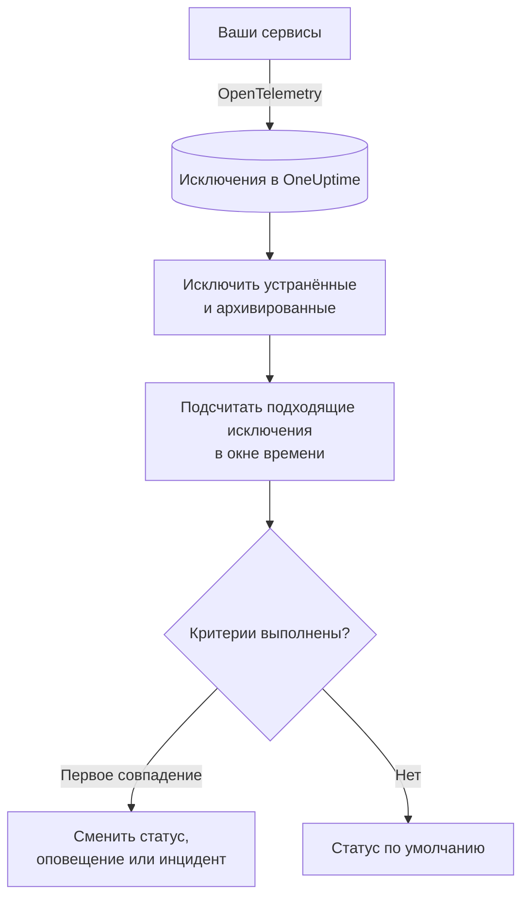

# Мониторинг исключений

Монитор исключений считает за окно времени исключения, о которых ваши сервисы сообщают в OneUptime и которые соответствуют вашим фильтрам (сообщение, тип исключения, окружение, сервис). Когда число удовлетворяет вашим критериям, он меняет статус монитора, создаёт оповещение или объявляет инцидент. Используйте его для оповещений о любом новом сбое в продакшене, об одном типе исключения или о внезапном росте ошибок.

:::cards
- [Создание монитора](#создание-монитора-исключений): Выберите, какие исключения считать и когда оповещать.
- [Окружения](#окружения): Ограничьте монитор окружением `production`.
- [Как он оценивается](#как-он-оценивается): Что учитывается и к чему приводит устранение исключения.
- [Критерии](#критерии): Условия и значения по умолчанию.
:::

## Как это работает



Каждую минуту OneUptime подсчитывает исключения, которые соответствуют фильтрам монитора и произошли в пределах его окна времени, не учитывая исключения, которые вы пометили как устранённые или архивировали. Он сравнивает это число с критериями монитора сверху вниз, и первый совпавший критерий решает, что произойдёт. Если не совпал ни один, монитор возвращается к своему статусу по умолчанию.

## Перед началом

- Ваши сервисы отправляют исключения в OneUptime через OpenTelemetry. См. [OpenTelemetry](/docs/telemetry/open-telemetry).
- Чтобы ограничить монитор окружением, ваши сервисы должны задавать атрибут ресурса `deployment.environment`.

## Создание монитора исключений

:::steps
### Начните новый монитор

Перейдите в **Мониторы** и нажмите **Создать монитор**.

### Выберите Exceptions

В разделе **Тип монитора** нажмите **Другие типы мониторов** и выберите **Исключения** в группе **Телеметрия** или введите `exceptions` в поле поиска. Введите **Имя** и нажмите **Далее**.

### Выберите, какие исключения считать

В **Конфигурация монитора исключений** задайте **Фильтровать по сообщению исключения**, **Типы исключений**, **Environments** и **Исключения монитора за (время)**. Фильтр, оставленный пустым, соответствует всем исключениям. **Предпросмотр исключений** под фильтрами показывает исключения, которым они соответствуют прямо сейчас.

### Сузьте выборку (необязательно)

Откройте **Дополнительные поля**, чтобы фильтровать по сервису телеметрии или сущности инфраструктуры или чтобы учитывать также устранённые и архивированные исключения.

### Задайте критерии

Карточка **Критерии монитора** начинается с двух критериев: не в сети, с инцидентом, когда подходит хотя бы одно исключение; в сети, когда не подходит ни одно. Измените их под то, о чём вы хотите получать оповещения (см. [Критерии](#критерии)).

### Создайте монитор

Нажмите **Создать монитор**. Монитор откроется на своей странице **Обзор**, и его первая оценка выполнится в течение минуты.
:::

## Что он запрашивает

| Поле | Чему соответствует | По умолчанию |
| --- | --- | --- |
| **Фильтровать по сообщению исключения** | Исключения, сообщение которых содержит этот текст, без учёта регистра. | Пусто: все исключения |
| **Типы исключений** | Исключения любого из этих типов через запятую, например `TypeError, NullReferenceException`. Имя типа должно совпадать точно. | Пусто: все типы |
| **Environments** | Исключения из любого из этих окружений через запятую (см. [Окружения](#окружения)). | Пусто: все окружения |
| **Исключения монитора за (время)** | Исключения за период от последних 5 секунд до последних 24 часов. | **Последняя 1 минута** |
| **Фильтровать по сервису телеметрии** (в **Дополнительные поля**) | Исключения любого из выбранных сервисов. | Пусто: все сервисы |
| **Filter by Infrastructure Entity** (в **Дополнительные поля**) | Исключения любого из выбранных хостов, подов, контейнеров и других сущностей. | Пусто: все сущности |
| **Включить устранённые исключения** (в **Дополнительные поля**) | Учитывать также исключения, помеченные как устранённые. | Выкл. |
| **Включить архивированные исключения** (в **Дополнительные поля**) | Учитывать также архивированные исключения. | Выкл. |

Чтобы исключение было учтено, должны совпасть все заданные вами фильтры.

### Окружения

Окружения берутся из атрибута ресурса OpenTelemetry `deployment.environment` каждого исключения — того же значения, по которому обозреватель исключений фильтрует с помощью `env:production`. Введите одно окружение или несколько через запятую; исключение учитывается, когда его окружение совпадает с любым из них.

Сравнение точное и с учётом регистра: `production` не совпадает с `Production` или `prod`. Исключения без окружения не учитываются, когда этот фильтр задан. Оставьте его пустым, чтобы учитывать исключения из всех окружений, в том числе без окружения.

Фильтр окружения сочетается со всеми остальными фильтрами, поэтому монитор, ограниченный одним сервисом телеметрии и `production`, учитывает только продакшен-исключения этого сервиса.

При создании монитора через API задайте `environments` в `exceptionMonitor` шага как список имён окружений:

```json
{
  "exceptionMonitor": {
    "telemetryServiceIds": [],
    "environments": ["production"],
    "exceptionTypes": [],
    "message": "",
    "includeResolved": false,
    "includeArchived": false,
    "lastXSecondsOfExceptions": 300
  }
}
```

## Как он оценивается

- **Каждую минуту.** Монитор исключений не проверяется зондами, поэтому у него нет интервала для настройки и нет страницы **Зонды и интервал**.
- **Возникновения, а не типы исключений.** Монитор учитывает каждый раз, когда подходящее исключение возникло в пределах **Исключения монитора за (время)**. Одно исключение, выброшенное 40 раз, даёт 40.
- **Устранённые и архивированные исключения не учитываются.** Если вы не включите **Включить устранённые исключения** или **Включить архивированные исключения**, возникновения исключения, которое вы пометили как устранённое или архивировали, не учитываются. Поэтому пометка исключения как устранённого может закрыть открытый им инцидент. Когда устранённое исключение возникает снова, оно автоматически снова становится неустранённым и учитывается.
- **Отсутствие исключений — это число 0.**
- **Простой самого OneUptime — это не тишина.** Пока окно времени содержит период, когда сам OneUptime не получал данные (перезапускался, обновлялся или догонял отставание), проверка ждёт: статус не меняется, и ни один инцидент или оповещение не открывается и не закрывается. См. [Когда OneUptime не получает данные](/docs/monitor/when-oneuptime-is-not-receiving).
- **Критерии сверху вниз.** Решает первый совпавший критерий, поэтому ставьте самый серьёзный первым.

Каждая смена статуса вместе с причиной записывается в **Хронология статуса** монитора.

## Критерии

У критериев монитора исключений один **Тип фильтра**: **Exception Count**, число исключений, совпавших в окне. Выберите **Условие фильтра** и **Значение**.

| Условие фильтра | Совпадает, когда число исключений… |
| --- | --- |
| **Greater Than** | выше значения |
| **Greater Than Or Equal To** | равно значению или выше |
| **Less Than** | ниже значения |
| **Less Than Or Equal To** | равно значению или ниже |
| **Equal To** | ровно равно значению |
| **Not Equal To** | любое, кроме этого значения |

У числа исключений нет условий аномалий: нет базовой линии, с которой их можно было бы сравнить.

Новый монитор исключений начинает с этих критериев:

| Критерий | Фильтр | Действие |
| --- | --- | --- |
| Check if … has exceptions | **Exception Count** **Greater Than** `0` | Переводит монитор в состояние «не в сети» и объявляет инцидент, который устраняется автоматически |
| Check if … has no exceptions | **Exception Count** **Equal To** `0` | Переводит монитор в состояние «в сети» |

## Разобранный пример: только продакшен-исключения

Вам нужен инцидент каждый раз, когда API выбрасывает исключение в продакшене, и ничего для staging. Вы устанавливаете **Environments** в `production`, а **Исключения монитора за (время)** в **Последние 5 минут** и оставляете критерии по умолчанию. За последние пять минут:

| Исключения | Окружение | Состояние | Учитывается? |
| --- | --- | --- | --- |
| `TypeError` × 3 | `production` | Активно | Да: 3 |
| `TypeError` × 40 | `staging` | Активно | Нет: другое окружение |
| `TimeoutError` × 2 | нет | Активно | Нет: нет окружения |
| `NullReferenceException` × 4 | `production` | Устранено после возникновения | Нет: устранено |

**Exception Count** равно 3, поэтому **Greater Than** `0` совпадает: монитор переходит в состояние «не в сети», и объявляется инцидент. Когда проходит пять минут без единого активного продакшен-исключения, совпадает критерий «в сети», и инцидент устраняется сам.

## Устранение неполадок

:::details Исключения видны в обозревателе, но монитор считает 0
Сравните значение **Environments** с фильтром `env:` обозревателя: сравнение точное и с учётом регистра, а исключения без окружения не учитываются, когда фильтр задан. Затем проверьте, не устранены ли или не архивированы ли эти исключения. Откройте страницу **Критерии** монитора (в разделе **Конфигурация**) и нажмите **Edit Monitoring Criteria**: **Предпросмотр исключений** показывает, чему соответствуют фильтры.
:::

:::details Инцидент устранился, когда я устранил исключение
Так и задумано. Устранённые исключения не учитываются, поэтому число упало, и критерий перестал совпадать. Если исключение возникнет снова, оно снова станет неустранённым и будет учитываться. Включите **Включить устранённые исключения**, чтобы учитывать их в любом случае.
:::

:::details Фильтр по типу исключения ничему не соответствует
**Типы исключений** сравниваются точно с именем типа, с которым было передано исключение, например `TypeError`. Скопируйте тип из обозревателя исключений.
:::

## Что дальше

:::cards
- [Мониторинг трассировок](/docs/monitor/traces-monitor): Оповещения о неудачных спанах и эндпоинтах.
- [Мониторинг журналов](/docs/monitor/logs-monitor): Оповещения об объёме и содержимом логов.
- [Шаблоны инцидентов и оповещений](/docs/monitor/incident-alert-templating): Пишите полезные заголовки и описания оповещений.
- [OpenTelemetry](/docs/telemetry/open-telemetry): Отправляйте исключения в OneUptime.
:::
