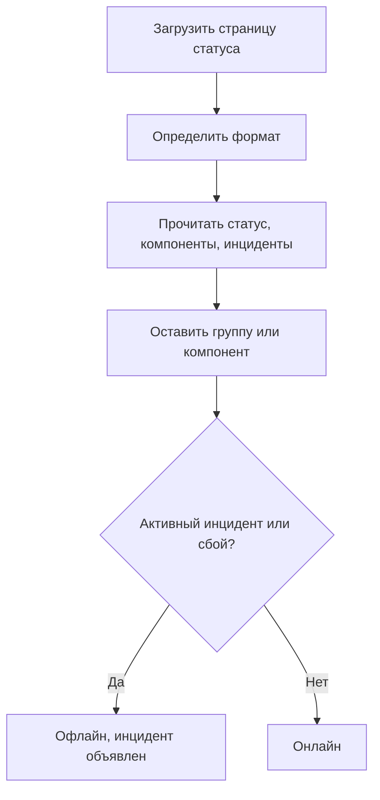

# Мониторинг внешней страницы статуса

Монитор внешней страницы статуса следит за публичной страницей статуса сервиса, от которого вы зависите, — AWS, GCP, Azure, GitHub, OpenAI, Anthropic и многих других — и оповещает вас, когда провайдер сообщает о сбое или снижении производительности. Используйте его, чтобы узнавать о проблемах у поставщиков сразу, как только они о них сообщают, и отличать их от собственных.

:::cards
- [Создайте монитор](#создание-монитора-внешней-страницы-статуса): Вставьте URL страницы статуса и выберите, за чем следить.
- [Сузьте область](#параметры-конфигурации): Следите за одной группой компонентов или одним компонентом.
- [Критерии](#критерии-мониторинга): Что по умолчанию считается сбоем.
- [Популярные страницы статуса](#url-популярных-страниц-статуса): URL сервисов, от которых зависит большинство команд.
:::

## Как это работает

При каждой проверке зонд загружает страницу статуса, определяет её формат и считывает общий статус, компоненты и активные инциденты. Если вы ограничили монитор группой компонентов или компонентом, учитываются только они. Затем критерии решают, онлайн монитор или офлайн.

С его помощью можно:

- Отслеживать доступность сторонних сервисов, от которых зависит ваше приложение
- Получать оповещения, когда у поставщиков случаются сбои
- Отслеживать статусы отдельных компонентов
- Ограничивать мониторинг одной группой компонентов (например, только "APIs" у OpenAI), чтобы посторонние инциденты в других частях страницы не срабатывали в вашем мониторе
- Замечать снижение производительности до того, как оно затронет ваших пользователей
- Сопоставлять собственные инциденты с проблемами поставщиков

## Поддерживаемые провайдеры

| Провайдер | Описание |
| ------------------------ | ---------------------------------------------------------------------- |
| **Auto** (по умолчанию) | Автоматически определяет формат страницы статуса |
| **Atlassian Statuspage** | Страницы статуса на Atlassian Statuspage (JSON API) |
| **incident.io** | Страницы статуса на incident.io (например, `https://status.openai.com`) |
| **RSS** | Страницы статуса с лентой RSS |
| **Atom** | Страницы статуса с лентой Atom |

### Автоопределение

Когда выбран **Auto**, OneUptime автоматически определяет формат страницы статуса в таком порядке:

1. Сначала пробует API страниц статуса incident.io (`/proxy/<host>`).
2. Затем пробует JSON API Atlassian Statuspage (`/api/v2/status.json`, `/api/v2/components.json` и `/api/v2/incidents/unresolved.json`).
3. Если не получилось, пытается разобрать страницу как ленту RSS или Atom.
4. В крайнем случае выполняет простую проверку доступности по HTTP.

> [!NOTE]
> incident.io проверяется первым, потому что некоторые страницы статуса incident.io (например, `https://status.openai.com`) также предоставляют ограниченный совместимый с Atlassian эндпоинт без групп компонентов и активных инцидентов. Проверка incident.io в первую очередь гарантирует, что используются более полные данные с группами.

Проверка доступности — это также запасной вариант, когда явно выбранный вами провайдер не срабатывает. Она сообщает только, отвечает ли страница (онлайн при ответе `2xx` или `3xx`), и не сообщает ни компонентов, ни инцидентов.

## Создание монитора внешней страницы статуса

:::steps
### Начните новый монитор

Откройте **Мониторы** и нажмите **Создать монитор**. В разделе **Тип монитора** нажмите **Другие типы мониторов** и выберите **External Status Page** в группе **Basic Monitoring** или введите `statuspage` в поле поиска. Укажите **Имя** и нажмите **Далее**.

### Введите URL страницы статуса

Введите **URL страницы статуса**. Оставьте **Провайдер** в значении **Auto**, если не знаете формат.

### При необходимости сузьте область

Откройте **Дополнительные поля**, чтобы ввести **Component Group Filter (Optional)**, например `APIs`, и **Фильтр по имени компонента (необязательно)**, чтобы следить за одним компонентом (внутри группы, если она задана).

### Протестируйте его

Нажмите **Протестировать монитор**, чтобы один раз загрузить страницу, и проверьте найденные провайдер, компоненты и инциденты.

### Проверьте критерии

Шаг критериев начинается с [критериев по умолчанию](#критерии-по-умолчанию), которые помечают монитор как офлайн, когда провайдер сообщает об активном инциденте или сбое в пределах области. При необходимости измените их, затем нажмите **Далее**.

### Выберите зонды и создайте монитор

Выберите **Зонды** и **Интервал мониторинга** (по умолчанию **Каждые 5 минут**), затем нажмите **Создать монитор**.
:::

## Параметры конфигурации

| Параметр | Что ввести | По умолчанию |
| --- | --- | --- |
| **URL страницы статуса** | URL страницы статуса. Для сайтов на Atlassian Statuspage и incident.io это обычно корневой URL (например, `https://status.example.com`). Для лент RSS/Atom введите URL самой ленты. | — |
| **Провайдер** | **Auto**, чтобы определить формат автоматически, или **Atlassian Statuspage**, **incident.io**, **RSS** либо **Atom**, если он известен. | **Auto** |
| **Component Group Filter (Optional)** | Группа, которой ограничивается монитор. В **Дополнительные поля**. | Все группы |
| **Фильтр по имени компонента (необязательно)** | Компонент, за которым нужно следить. В **Дополнительные поля**. | Все компоненты в пределах области |
| **Тайм-аут (ms)** | Максимальное время ожидания страницы статуса. В **Дополнительные поля**. | `10000` (10 секунд) |
| **Повторные попытки** | Сколько раз повторять с интервалом в секунду после неудачной первой попытки; `0` означает одну попытку. В **Дополнительные поля**. | `3` (до 4 попыток) |

### Component Group Filter

Если страница статуса распределяет компоненты по группам, монитор можно ограничить одной группой. Например, на `https://status.openai.com` значение `APIs` ограничивает монитор сервисами API OpenAI.

Когда задана группа компонентов, **число активных инцидентов** и **общий статус** вычисляются только по компонентам этой группы: инцидент в посторонней группе (например, ChatGPT) не сработает в мониторе, ограниченном группой "APIs".

Фильтрация по группе компонентов поддерживается для провайдеров **Atlassian Statuspage** и **incident.io**. Ленты RSS и Atom групп компонентов не предоставляют.

### Фильтр по имени компонента

Если страница статуса сообщает о нескольких компонентах, можно указать имя компонента, чтобы отслеживать только его. Фильтр совпадает с любым компонентом, имя которого содержит введённый текст, без учёта регистра: `actions` совпадает с компонентом "Actions".

Если задана и группа компонентов, фильтр по имени компонента применяется **внутри** этой группы, что позволяет выбрать один компонент в большой группе. Если ни один фильтр не задан, отслеживаются все компоненты в пределах области. Для ленты RSS или Atom фильтр по имени сравнивается с заголовками элементов ленты.

> [!WARNING]
> Фильтр, который ни с чем не совпадает, выглядит как исправный: без компонентов в области некому сообщить о сбое. Сверьте написание со страницей статуса и с помощью **Протестировать монитор** посмотрите, что оставляет фильтр.

## Критерии мониторинга

Вы можете настроить критерии, которые решают, когда внешний сервис считается онлайн или офлайн, на основе:

| Тип фильтра | Что он проверяет | Условия фильтра |
| --- | --- | --- |
| **External Status Page Is Online** | Доступна ли страница статуса и возвращает ли она данные о статусе | Истина или Ложь |
| **External Status Page Overall Status** | Общий статус, о котором сообщает страница | Equal To, Not Equal To, Содержит, Not Contains, Starts With, Ends With |
| **External Status Page Component Status** | Статус компонентов в пределах области (с учётом фильтров группы компонентов / имени компонента): Работает, Under Maintenance, Degraded Performance, Partial Outage, Major Outage или Full Outage | Equal To, Not Equal To, Содержит, Not Contains, Starts With, Ends With |
| **External Status Page Active Incidents** | Число активных сейчас инцидентов на странице статуса (в пределах группы компонентов / компонента, если задан фильтр) | Equal To, Not Equal To и числовые сравнения |
| **External Status Page Response Time (in ms)** | Сколько времени занимает загрузка данных страницы статуса | Greater Than, Less Than, Greater Than Or Equal To, Less Than Or Equal To |

Общий статус — это то, что пишет сама страница, поэтому его значения зависят от провайдера: Atlassian Statuspage сообщает собственное описание, например `All Systems Operational`; лента сообщает `operational` или `degraded_performance`; проверка доступности сообщает `reachable` или `unreachable`. Эти сравнения учитывают регистр. Для оповещений о сбоях обычно надёжнее **External Status Page Active Incidents** и **External Status Page Component Status**.

В ленте RSS или Atom активными инцидентами считаются элементы за последние 24 часа: элемент RSS — по дате публикации, запись Atom — по дате обновления.

### Критерии по умолчанию

По умолчанию OneUptime создаёт критерии на основе того, что действительно важно для страницы статуса, — её активных инцидентов и состояния компонентов, а не просто доступности:

| Критерий | Фильтры | Действие |
| --- | --- | --- |
| Offline | **Любой** из: страница не в сети; в пределах области есть хотя бы один активный инцидент; компонент в пределах области сообщает Degraded Performance, Partial Outage, Major Outage или Full Outage | Помечает монитор как офлайн и объявляет инцидент, который закрывается сам, когда критерий перестаёт совпадать |
| Online | **Все** из: страница в сети; в пределах области нет активных инцидентов | Помечает монитор как онлайн |

Поскольку число активных инцидентов и статусы компонентов учитывают фильтры группы компонентов / имени компонента, эти критерии по умолчанию автоматически нацелены только на важные для вас компоненты.

## Переменные шаблона

При создании инцидентов или оповещений из мониторов внешней страницы статуса в заголовках, описаниях и заметках по устранению можно использовать такие переменные (см. [Шаблоны инцидентов и оповещений](/docs/monitor/incident-alert-templating)):

| Переменная | Описание |
| ------------------------- | ------------------------------------------------------------------------------- |
| `{{isOnline}}`            | Доступна ли страница статуса (true/false) |
| `{{responseTimeInMs}}`    | Время ответа в миллисекундах |
| `{{failureCause}}`        | Причина сбоя, если есть |
| `{{overallStatus}}`       | Значение индикатора общего статуса |
| `{{activeIncidentCount}}` | Число активных инцидентов (в пределах фильтра, если он задан) |
| `{{componentStatuses}}`   | Массив JSON со статусами компонентов (`name`, `status`, `description`, `groupName`) |
| `{{provider}}`            | Определённый провайдер (Atlassian Statuspage, incident.io, RSS, Atom); пусто после проверки доступности |
| `{{componentGroup}}`      | Группа компонентов, которой ограничен монитор, если задана |
| `{{componentName}}`       | Компонент, которым ограничен монитор, если задан |

## URL популярных страниц статуса

Вот список страниц статуса популярных сервисов. Многие из них используют Atlassian Statuspage или incident.io, поэтому провайдер **Auto** определяет их автоматически. Страница, построенная ни на том, ни на другом и не являющаяся лентой, получает только проверку доступности; для таких страниц лучше отслеживать ленту RSS или Atom провайдера, если он её публикует.

| Сервис | URL страницы статуса |
| ---------------------------- | --------------------------------------------- |
| AWS                          | `https://health.aws.amazon.com/health/status` |
| Google Cloud Platform        | `https://status.cloud.google.com`             |
| Microsoft Azure              | `https://status.azure.com`                    |
| GitHub                       | `https://www.githubstatus.com`                |
| OpenAI                       | `https://status.openai.com`                   |
| Anthropic                    | `https://status.anthropic.com`                |
| Cloudflare                   | `https://www.cloudflarestatus.com`            |
| Datadog                      | `https://status.datadoghq.com`                |
| PagerDuty                    | `https://status.pagerduty.com`                |
| Twilio                       | `https://status.twilio.com`                   |
| Stripe                       | `https://status.stripe.com`                   |
| Slack                        | `https://status.slack.com`                    |
| Atlassian (Jira, Confluence) | `https://status.atlassian.com`                |
| Vercel                       | `https://www.vercel-status.com`               |
| Netlify                      | `https://www.netlifystatus.com`               |
| DigitalOcean                 | `https://status.digitalocean.com`             |
| Heroku                       | `https://status.heroku.com`                   |
| MongoDB Atlas                | `https://status.cloud.mongodb.com`            |
| Fastly                       | `https://status.fastly.com`                   |
| New Relic                    | `https://status.newrelic.com`                 |
| Sentry                       | `https://status.sentry.io`                    |
| CircleCI                     | `https://status.circleci.com`                 |

## Рекомендации

- **Используйте провайдер Auto**, если не знаете точный формат: автоопределение хорошо работает для большинства страниц статуса.
- **Ограничивайтесь группой компонентов**, если зависите только от части провайдера (например, только от "APIs" у OpenAI), чтобы посторонние инциденты не создавали шума.
- **Отслеживайте конкретные компоненты**, если зависите только от определённых сервисов.
- **Сочетайте с собственными мониторами** — используйте мониторы внешних страниц статуса вместе со своими мониторами API и сайтов. Когда оба падают одновременно, страница статуса поставщика быстрее укажет на первопричину.

## Устранение неполадок

:::details Монитор офлайн, но инцидент касается части сервиса, которой я не пользуюсь
Ограничьте монитор с помощью **Component Group Filter**, **Фильтр по имени компонента** или обоих. Тогда число активных инцидентов и статусы компонентов будут учитывать только то, что входит в область.
:::

:::details Монитор не переходит в офлайн даже во время сбоя
Возможно, фильтры ни с чем не совпадают, что выглядит как исправность, или страница получает только проверку доступности. Запустите **Протестировать монитор** и проверьте найденные провайдер и компоненты.
:::

:::details Auto выбирает не тот формат или не находит компонентов
Задайте в **Провайдер** тот, который, как вы знаете, использует страница. Для ленты RSS или Atom введите URL самой ленты, а не страницы статуса.
:::

:::details Внутренняя страница статуса недоступна
Зонд отклоняет адреса частных сетей, если ему не разрешено к ним обращаться. Задайте `PROBE_ALLOW_PRIVATE_NETWORK_MONITORS=true` на зонде внутри вашей сети — см. [Доступ к частной сети](/docs/self-hosted/private-network-access).
:::

## Следующие шаги

:::cards
- [Шаблоны инцидентов и оповещений](/docs/monitor/incident-alert-templating): Добавляйте статус провайдера в заголовки инцидентов.
- [Мониторинг API](/docs/monitor/api-monitor): Проверяйте свои эндпоинты рядом со статусом провайдера.
- [Создание монитора](/docs/monitor/create-monitor): Шаги, общие для всех типов мониторов.
:::
