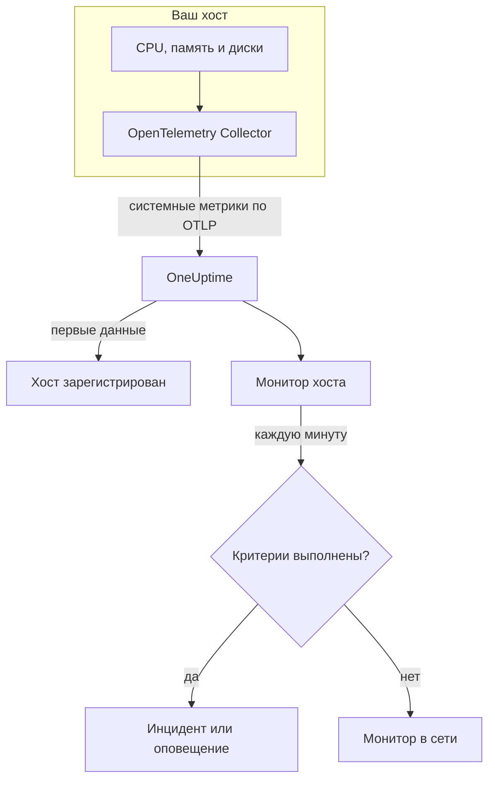

# Мониторинг хостов

Монитор хоста следит за одной машиной – её CPU, памятью, дисками, нагрузкой и процессами – и сообщает, когда она перегружена или заполняется. Он читает метрики OpenTelemetry `system.*`, которые OpenTelemetry Collector отправляет с хоста, – те же данные, что показывает продукт **Хосты**, поэтому ничего не опрашивается снаружи.

:::cards
- [Создание монитора](#создание-монитора-хоста): Шесть шагов в панели управления.
- [Шаблоны](#готовые-шаблоны-оповещений): Пять готовых оповещений для CPU, памяти, диска, нагрузки и процессов.
- [Метрики](#собираемые-метрики): Метрики хоста, по которым можно оповещать, и их единицы.
- [Хост или Server / VM?](#монитор-хоста-или-монитор-server-vm): Какой из двух мониторов машин использовать.
:::

## Как это работает

На хосте работает OpenTelemetry Collector с приёмником `hostmetrics`. Каждые 30 секунд он читает показатели CPU, памяти, диска, сети, нагрузки и процессов хоста и отправляет их в OneUptime по OTLP. Первые данные с хоста регистрируют его в разделе **Хосты**.

Монитор хоста привязан к одному хосту. Каждую минуту он выполняет свой запрос по метрикам этого хоста и сравнивает результат со своими критериями.

### Монитор хоста или монитор Server / VM?

В OneUptime есть два монитора для машин. Они могут работать на одном и том же хосте.

| | Монитор хоста | Монитор Server / VM |
| --- | --- | --- |
| **Агент** | OpenTelemetry Collector с приёмником `hostmetrics` | Инфраструктурный агент OneUptime |
| **Данные** | Метрики OpenTelemetry `system.*` и `process.*` – те же, что показывают графики на страницах раздела **Хосты** | Отчёт о состоянии, который агент отправляет монитору |
| **Критерии** | Пороги или обнаружение аномалий по любому запросу метрик или формуле | Встроенные проверки, например использование CPU, памяти и диска |
| **Настройка** | Установите коллектор; хост регистрируется сам | Создайте монитор, затем передайте его секретный ключ агенту |

Используйте монитор хоста, если хост уже отправляет данные OpenTelemetry или если вам нужны журналы и более богатые метрики от того же коллектора. Другой монитор описан на странице [Мониторинг сервера / ВМ](/docs/monitor/server-monitor).

## Перед началом работы

- **Запустите OpenTelemetry Collector на хосте** с приёмником `hostmetrics`. Страница [OpenTelemetry-коллектор на хосте](/docs/telemetry/host-otel-collector) охватывает Linux, macOS и Windows, а **Продукты → Инфраструктура → Хосты → Документация** даёт готовую конфигурацию.
- **Включите метрики использования.** `system.cpu.utilization`, `system.memory.utilization` и `system.filesystem.utilization` в приёмнике необязательны, а шаблонам CPU, памяти и файловой системы они нужны. Конфигурация из панели управления их включает.
- **Убедитесь, что хост зарегистрирован.** Он появляется в разделе **Продукты → Инфраструктура → Хосты → Все хосты** под своим `host.name`, как только приходят его первые данные.

## Создание монитора хоста

:::steps
### Начните новый монитор

Перейдите в **Мониторы** и нажмите **Создать монитор**.

### Выберите Хост

В разделе **Тип монитора** нажмите **Другие типы мониторов** и выберите **Хост** в группе **Инфраструктура**. Введите **Имя** – оно используется в заголовках инцидентов и оповещений – и нажмите **Далее**.

### Выберите хост

В разделе **Host Monitor Configuration** выберите машину в поле **Хост**. В списке есть каждый хост, который присылал данные.

### Выберите, что отслеживать

Выберите одну из трёх вкладок:

- **Quick Setup** – нажмите на [шаблон](#готовые-шаблоны-оповещений). Он задаёт метрику, агрегацию, диапазон времени и пороги и заменяет критерии ниже своими. Поле **Диапазон времени** по-прежнему можно изменить.
- **Custom Metric** – выберите одну метрику в поле **Host Metric**, затем задайте **Агрегация** и **Диапазон времени**.
- **Расширенный** – сами постройте запросы и формулы в разделе **Выберите метрики**, например фильтр по `state` или группировку по `mountpoint`.

### Проверьте критерии

Откройте каждый критерий в разделе **Критерии монитора** и проверьте его поля **Метрика**, **Агрегация**, **Условие** и **Threshold**. Шаблон заполняет их. С **Custom Metric** или **Расширенный** монитор начинает со [стандартных критериев](#стандартные-критерии), которые замечают только падение метрики до нуля, поэтому задайте собственный порог.

### Создайте монитор

Нажмите **Создать монитор**. OneUptime откроет страницу монитора и будет оценивать его каждую минуту. Инциденты и оповещения, которые он открывает, также видны на страницах хоста **Инциденты** и **Оповещения**.
:::

> [!TIP]
> Чтобы настроить сразу несколько шаблонов, откройте хост через **Продукты → Инфраструктура → Хосты** и перейдите в **Recommendations**. Выберите нужные шаблоны и тех, кого вызывать, и OneUptime создаст по одному монитору на шаблон.

## Настройки монитора

| Поле | Вкладка | Что делает |
| --- | --- | --- |
| **Хост** | Все | Обязательно. Ограничивает каждый запрос значением `resource.host.name` хоста. |
| **Host Metric** | Custom Metric | Одна метрика из [каталога](#собираемые-метрики), сгруппированная как CPU, память, диск, сеть, нагрузка и процессы. |
| **Агрегация** | Custom Metric | Как объединяются замеры: **Среднее**, **Максимум**, **Минимум**, **Сумма** или **Количество**. Начинается с обычной агрегации метрики. |
| **Диапазон времени** | Все | Скользящее окно, которое читает запрос, от **Past 1 Minute** до **Past 365 Days**. Новый монитор начинает с **Past 1 Minute**; шаблоны задают свой. |
| **Выберите метрики** | Расширенный | Конструктор запросов: **Метрика**, **Aggregate by**, **Filter by attributes**, **Group by**, а также **Добавить метрику** и **Добавить формулу** для объединения запросов. |

## Готовые шаблоны оповещений

**Quick Setup** предлагает пять шаблонов. Каждый строит полный монитор: запрос, критерий, который срабатывает, и критерий, который восстанавливает. Пороги – отправная точка, их можно менять.

Критерий срабатывает, только когда условие выполняется в каждую минуту его окна, и восстанавливается на 10 % за порогом, чтобы значение, колеблющееся у границы, не переключалось туда-обратно.

| Шаблон | Серьёзность | Что отслеживает | Срабатывает, когда | Восстанавливается, когда |
| --- | --- | --- | --- | --- |
| High CPU Utilization | Warning | `system.cpu.utilization` для состояний `user` и `system`, сложенных и показанных в процентах, последние 5 минут | Выше 80 % | 72 % или ниже |
| High Memory Utilization | Warning | `system.memory.utilization` для состояния `used`, в процентах, последние 5 минут | Выше 85 % | 76,5 % или ниже |
| High Filesystem Usage | Критический | `system.filesystem.utilization`, Max по `mountpoint` и `device`, в процентах, последние 5 минут | Выше 90 % | 81 % или ниже |
| High Load Average (1m) | Warning | `system.cpu.load_average.1m`, Avg, последние 5 минут | Выше 4 | 3,6 или ниже |
| High Process Count | Warning | `system.processes.count`, Max, последние 5 минут | Выше 2000 | 1800 или ниже |

**Серьёзность** – это метка, которую показывает список выбора. Инцидент и оповещение, которые создаёт шаблон, начинаются с самого серьёзного уровня инцидентов и оповещений вашего проекта; измените их в критериях.

- **CPU** – это время занятости (`user` плюс `system`), то же значение, что показывает на графиках **Обзор** хоста. Iowait и steal не учитываются.
- **Память** исключает буферы и страничный кеш, поэтому хост, память которого в основном занята кешем, не вызывает срабатывания.
- **Файловая система** открывает по инциденту на каждую точку монтирования. Псевдофайловые системы только для чтения, например монтирования snap типа `squashfs` или `devfs` в macOS, всегда заполнены на 100 %; исключите их в скрапере `filesystem` коллектора.
- **Средняя нагрузка** – это сырая длина очереди выполнения, не делённая на число ядер: 4 – это насыщение на хосте с 2 ядрами и обычное дело на хосте с 32, поэтому на больших хостах поднимите порог.
- **Число процессов** сравнивает наибольшее отдельное состояние процессов (`running`, `sleeping`, …), а не общее число на хосте, поэтому оно не совпадёт со списком процессов. Скрапер процессов работает только в Linux.

## Собираемые метрики

Список **Host Metric** предлагает эти метрики. Каждая несёт `resource.host.name`, по которому монитор ограничивает свои запросы одним хостом.

> [!IMPORTANT]
> Метрики использования – это доля от 0 до 1, а не проценты: для 80 % в пороге по сырой метрике используйте `0.8`. Шаблоны переводят значения в проценты формулой, поэтому их пороги – 80, 85 и 90.

### CPU

| Метрика | Единица | Описание |
| --- | --- | --- |
| `system.cpu.utilization` | доля | Доля времени CPU в каждом `state` (`user`, `system`, `idle`, …). Фильтруйте по `state`: среднее по всем состояниям никогда не достигает полезного порога. |
| `process.cpu.utilization` | доля | Использование CPU каждым процессом на хосте. |

### Память

| Метрика | Единица | Описание |
| --- | --- | --- |
| `system.memory.utilization` | доля | Доля физической памяти в каждом `state` (`used`, `free`, `cached`, …). Для занятой памяти фильтруйте по `state = used`. |
| `system.memory.usage` | байты | Использование памяти в байтах. |

### Диск

| Метрика | Единица | Описание |
| --- | --- | --- |
| `system.filesystem.utilization` | доля | Доля занятой ёмкости каждой файловой системы, по `mountpoint` и `device`. |
| `system.filesystem.usage` | байты | Использование файловой системы в байтах. |

### Сеть

| Метрика | Единица | Описание |
| --- | --- | --- |
| `system.network.io` | байты | Полученные и отправленные байты. Счётчик за всё время жизни. |

### Нагрузка

| Метрика | Единица | Описание |
| --- | --- | --- |
| `system.cpu.load_average.1m` | количество | Средняя нагрузка за последнюю минуту. |
| `system.cpu.load_average.5m` | количество | Средняя нагрузка за последние 5 минут. |
| `system.cpu.load_average.15m` | количество | Средняя нагрузка за последние 15 минут. |

### Процессы

| Метрика | Единица | Описание |
| --- | --- | --- |
| `system.processes.count` | количество | Процессы на хосте, по одному ряду на `status` процесса. |

Конструктор запросов на вкладке **Расширенный** перечисляет все метрики, которые отправляет хост, а не только эти.

## Критерии мониторинга

Критерий сравнивает один из запросов или формул монитора с порогом. У критериев монитора хоста нет поля **Тип фильтра**: каждое правило проверяет значение метрики с такими полями.

| Поле | Что делает |
| --- | --- |
| **Метрика** | Запрос или формула для проверки, по имени переменной. |
| **Агрегация** | Как значения в окне превращаются в один ответ: **Среднее**, **Сумма**, **Maximum Value**, **Minimum Value**, **All Values** (совпасть должно каждое значение) или **Any Value** (достаточно одного). |
| **Условие** | **Greater Than**, **Less Than**, **Greater Than Or Equal To**, **Less Than Or Equal To** или **Equal To** – или условие аномалии: **Anomalously High**, **Anomalously Low** или **Anomalous**. |
| **Threshold** | Значение для сравнения. Рядом стоит список единиц, если у метрики есть единица. Не показывается для условий аномалий. |
| **Чувствительность** | Только для условий аномалий. **Низкий** (4σ), **Средний** (3σ, по умолчанию) или **Высокий** (2σ). |
| **Окно базовой линии** | Только для условий аномалий. 14 дней (по умолчанию), 28, 60 или 90 дней истории. |
| **Если нет данных** | В разделе **Дополнительные поля**. Что происходит, когда в окне нет замеров: **Ignore** (по умолчанию), **Treat As Zero** или **Триггер**. |

Условия аномалий сравнивают каждое значение с тем же часом недели в базовой линии. Они остаются в состоянии «Learning» и ничего не создают, пока окно базовой линии не накопит достаточно истории.

Каждый критерий также указывает, что делать при совпадении: изменить статус монитора, создать оповещение или объявить инцидент. Критерии проверяются сверху вниз, и решает первый совпавший.

### Стандартные критерии

Монитор, который вы создаёте не из шаблона, начинает с двух критериев:

| Порядок | Критерий | Срабатывает, когда | Затем |
| --- | --- | --- | --- |
| 1 | Check if _monitor name_ is offline | Любое значение первого запроса равно `0` | Помечает монитор как **Не в сети** и объявляет инцидент «_monitor name_ is offline», который закрывается сам, когда монитор восстанавливается. |
| 2 | Check if _monitor name_ is online | Любое значение больше `0` | Помечает монитор как **Работает**. |

> [!IMPORTANT]
> Молчание не совпадает ни с одним из критериев: хост, который перестал присылать данные, оставляет монитор в прежнем состоянии. Чтобы узнавать, когда хост замолкает, установите для **Если нет данных** значение **Триггер** в одном из критериев. Время, когда OneUptime сам не принимал данные, никогда не считается отсутствием данных: проверка, окно которой включает такое время, вместо этого ждёт, как объясняет страница [Когда OneUptime не получает данные](/docs/monitor/when-oneuptime-is-not-receiving).

## Устранение неполадок

:::details Хоста нет в списке Хост
Хосты регистрируются сами по данным коллектора, которым нужны `host.name` и тип ОС хоста – оба приходят от процессора `resourcedetection` коллектора. Проверьте, что коллектор работает и что хост есть в разделе **Продукты → Инфраструктура → Хосты → Все хосты**. Конфигурация описана на странице [OpenTelemetry-коллектор на хосте](/docs/telemetry/host-otel-collector).
:::

:::details Порог CPU или памяти никогда не срабатывает
Метрики использования – это доли с максимумом `1.0`, поэтому введённый вручную порог `80` никогда не будет превышен: используйте `0.8` или начните с шаблона, который переводит значения в проценты. Также фильтруйте по `state` – `user` и `system` для CPU, `used` для памяти. Среднее по всем состояниям держится около 1, делённой на число состояний.
:::

:::details Инциденты срабатывают не для того хоста
Монитор ограничивает каждый запрос условием `resource.host.name`, равным выбранному хосту. Хосты, сообщающие одинаковое `host.name`, сливаются в один ряд, поэтому дайте каждому хосту уникальное имя.
:::

:::details High Filesystem Usage срабатывает для точки монтирования, которая всегда заполнена
Псевдофайловые системы только для чтения, например loop-монтирования snap типа `squashfs` в `/snap` или `devfs` в macOS, заполнены на 100 % по замыслу и никогда не восстанавливаются. Исключите их из скрапера `filesystem` коллектора.
:::

## Дальнейшие шаги

:::cards
- [OpenTelemetry-коллектор на хосте](/docs/telemetry/host-otel-collector): Установите и настройте коллектор, данные которого читает этот монитор.
- [Мониторинг сервера / ВМ](/docs/monitor/server-monitor): Монитор для машин, в который отправляет данные агент.
- [Мониторинг метрик](/docs/monitor/metrics-monitor): Оповещения по любой метрике на всех хостах и сервисах.
- [Обзор инцидентов](/docs/incidents/index): Что происходит после того, как критерий объявил инцидент.
:::
