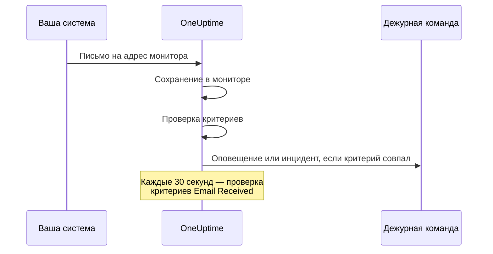

# Мониторинг входящих писем

Монитор входящих писем даёт вам адрес электронной почты, который принадлежит одному монитору. Всё, что умеет отправлять почту, — задание резервного копирования, устаревшая система, оповещения облачного провайдера — присылает туда свои результаты, а OneUptime проверяет каждое письмо по вашим критериям, чтобы пометить монитор как недоступный, открыть инцидент или создать оповещение и закрыть их, когда придёт сигнал «всё в порядке».

:::cards
- [Создайте монитор](#создание-монитора-входящих-писем): Получите адрес и направьте на него отправителя.
- [Подтвердите адрес](#подтверждение-адреса-у-отправителя): Прочитайте письмо с подтверждением от отправителя прямо в мониторе.
- [Напишите критерии](#доступные-типы-фильтров): Сопоставляйте тему, отправителя или текст или оповещайте, когда письма перестают приходить.
- [Используйте письмо в оповещениях](#переменные-шаблона): Подставляйте тему и текст в заголовки и описания.
:::

## Как это работает

Почта работает по модели push: ваша система отправляет, а OneUptime слушает. Каждое письмо проверяется по критериям монитора при поступлении. Критерии, которые ищут письма, которые *должны были* прийти, кроме того, проверяются по расписанию, каждые 30 секунд.



1. Когда вы создаёте монитор входящих писем, OneUptime выдаёт ему уникальный адрес электронной почты.
2. Каждое письмо, отправленное на этот адрес, сохраняется в мониторе и проверяется по его критериям сверху вниз; решает первый совпавший критерий.
3. Совпавший критерий может изменить статус монитора, создать оповещение и объявить инцидент. Инцидент с включённым **Автоустранение инцидента** или оповещение с включённым **Автоустранение оповещения** закрывается, когда позже совпадает другой критерий — например, тот, что помечает монитор как онлайн.

## Создание монитора входящих писем

:::steps
### Начните новый монитор

Откройте **Мониторы** и нажмите **Создать монитор**.

### Выберите Incoming Email

В разделе **Тип монитора** нажмите **Другие типы мониторов** и выберите **Incoming Email** в группе **Inbound Monitoring** или введите `email` в поле поиска. Укажите **Имя** и нажмите **Далее**.

### Проверьте критерии

Шаг **Критерии** начинается с [критериев по умолчанию](#что-вы-получаете-сразу), которые помечают монитор как офлайн, когда в письме упоминается `error`. Нажмите на критерий, чтобы изменить его, или нажмите **Добавить критерии**, чтобы добавить новый. Типичные настройки описаны в разделе [Примеры конфигураций](#примеры-конфигураций).

### Создайте монитор

Нажмите **Создать монитор**. Монитор открывается на странице **Обзор**, где карточка **Incoming Email Address** показывает адрес с кнопкой копирования, пока не придёт первое письмо.

### Отправляйте письма на адрес

Настройте свою систему так, чтобы она отправляла уведомления на этот адрес. Если отправитель сначала просит подтвердить адрес, см. [Подтверждение адреса у отправителя](#подтверждение-адреса-у-отправителя).
:::

> [!NOTE]
> Адрес содержит секретный ключ монитора, поэтому его видят только те, кто может редактировать мониторы. Все остальные видят, что сведения о настройке скрыты.

## Формат адреса электронной почты

Каждый монитор входящих писем получает уникальный адрес в таком формате:

```text
monitor-{secret-key}@{inbound-domain}
```

Секретный ключ — это UUID, например `monitor-3f2b8c1e-5d4a-4f6b-9a7c-2e1d0b9f8a6c@inbound.yourdomain.com`. После прихода первого письма адрес остаётся на странице монитора **Обзор** в карточке **Inbound email address** рядом со временем последнего письма. Страница монитора **Документация** тоже его показывает.

## Сброс или настройка адреса электронной почты

Откройте вкладку монитора **Настройки**. Карточка **Incoming Email Address** показывает текущий адрес и предлагает два способа его заменить:

| Действие | Что оно делает | Когда использовать |
| --- | --- | --- |
| **Reset Address** | Выдаёт монитору новый случайно сгенерированный адрес `monitor-{secret-key}@{inbound-domain}`. Если у монитора есть собственный адрес, сброс его удаляет. Сначала нужно подтвердить действие. | Адрес утёк, или вы хотите отрезать всё, что на него отправляет. |
| **Customize Address** | Позволяет выбрать часть до @, например `nightly-backups@{inbound-domain}`. Введите её в **Address name** — можно ввести имя или вставить адрес целиком — и нажмите **Save Address**. | Вам нужен адрес, который люди узнают. |

Оба действия завершаются показом нового адреса с кнопкой копирования.

> [!WARNING]
> **Старый адрес сразу перестаёт работать**: письма, отправленные на него, игнорируются, поэтому обновите все системы, которые отправляют письма этому монитору.

Правила для собственного адреса:

- От 3 до 64 символов: строчные буквы, цифры, точки (`.`), дефисы (`-`) и подчёркивания (`_`), без двух точек подряд. Адрес должен начинаться и заканчиваться буквой или цифрой. Прописные буквы автоматически переводятся в строчные.
- Домен — всегда домен сервера для входящей почты.
- Имя не должно уже использоваться другим монитором. Все проекты на сервере делят один домен для входящей почты, поэтому имя должно быть уникальным среди всех них.
- Имена вида `monitor-{id}` и `workflow-{id}` зарезервированы для сгенерированных адресов. Имена почтовых ящиков, принадлежащих самому домену, тоже зарезервированы: `abuse`, `admin`, `administrator`, `hostmaster`, `mailer-daemon`, `noc`, `postmaster`, `root`, `security` и `webmaster`.

Собственный адрес — такие же учётные данные, как и сгенерированный: любой, кто его знает, может отправлять письма, которые проверяет этот монитор. Сгенерированные адреса практически невозможно угадать, а короткое очевидное имя — можно. Если это для вас важно, выберите что-то трудноугадываемое.

Пользователи API могут сделать то же самое через Monitor API для существующего монитора: задайте `incomingEmailCustomLocalPart` равным имени, чтобы использовать собственный адрес, или `null`, чтобы вернуться к сгенерированному. Сброс означает запись нового `incomingEmailSecretKey` и установку `incomingEmailCustomLocalPart` в `null` в одном обновлении.

## Подтверждение адреса у отправителя

Некоторые сервисы не отправляют оповещения на новый адрес, пока кто-нибудь не докажет, что может читать там почту. Сначала они присылают письмо для подтверждения, и оно приходит в монитор, как любое другое письмо. Чтобы его прочитать:

:::steps
### Добавьте адрес в сервис

Добавьте адрес монитора в сервис и сохраните. Сервис отправит письмо для подтверждения.

### Откройте последнее письмо

Откройте монитор в OneUptime. На его странице **Обзор** карточка **Сводка монитора** показывает последнее письмо. Убедитесь, что **От** и **Тема** относятся к письму для подтверждения, затем нажмите **Показать больше деталей**.

### Скопируйте код или ссылку

Код или ссылка находится в **Тело письма (текст)**. **Тело письма (HTML)** показывает исходный код HTML, поэтому, если копируете ссылку оттуда, замените в ней каждое `&amp;` на `&`.

### Завершите подтверждение

Завершите подтверждение так, как сказано в письме.
:::

Если с тех пор пришло другое письмо, карточка больше не показывает письмо для подтверждения. Откройте **Журналы мониторинга**, найдите письмо для подтверждения по теме в столбце **Электронная почта** и нажмите **Просмотреть сводку** в этой строке.

> [!IMPORTANT]
> **Ваши критерии тоже его видят.** Письмо для подтверждения проверяется, как любое другое. Фраза вроде "if you received this in error" совпадает с критерием по умолчанию `error` и помечает монитор как офлайн. Чтобы этого избежать, на время подтверждения выключите **Проверять этот монитор** в карточке **Мониторинг** на странице монитора **Настройки** (потребуется подтверждение). Монитор с выключенным мониторингом всё равно сохраняет письмо, и карточка **Сводка монитора** по-прежнему его показывает. Но он ничего не проверяет, поэтому у письма не будет строки в **Журналы мониторинга**: прочитайте его до того, как придёт другое письмо. Когда закончите, нажмите **Включить мониторинг** на баннере вверху страниц монитора или снова включите переключатель.

**Подтверждение привязано к адресу.** Если вы [сбросите или измените адрес](#сброс-или-настройка-адреса-электронной-почты), сервис увидит нового получателя, и подтверждать придётся заново.

### Группы действий Azure Monitor

С июля 2026 года Azure постепенно вводит требование подтверждать каждого нового получателя типа **Email** в группе действий одноразовым кодом. Пока это не сделано, группа действий не отправляет на этот адрес ни оповещений, ни тестовых уведомлений.

:::steps
1. Добавьте в группу действий уведомление типа **Email** с адресом монитора и сохраните группу действий. Azure отправит письмо для подтверждения с адреса Microsoft, например `azure-noreply@microsoft.com`.
2. Прочитайте его в мониторе, как описано выше, и выполните инструкции в течение 30 минут после сохранения группы действий. Если срок кода истёк, откройте группу действий и выберите **Resend**.
3. Откройте группу действий и выберите **Test**, чтобы отправить тестовое уведомление. Оно приходит в монитор как настоящее оповещение, поэтому заодно показывает, совпадают ли ваши критерии с письмами Azure.
:::

Подтверждение действует для всех групп действий в одном клиенте Azure, поэтому каждый адрес достаточно подтвердить один раз.

### Amazon SNS

Подписка по электронной почте на тему SNS ничего не получает, пока её не подтвердят. Когда вы создаёте подписку, Amazon SNS отправляет на адрес письмо с подтверждением. Прочитайте его в мониторе, как описано выше, и откройте в браузере ссылку **Confirm subscription** из письма. SNS удаляет подписку, которую не подтвердили в течение 48 часов; если так случилось, создайте подписку заново.

## Что вы получаете сразу

Новый монитор входящих писем создаётся с двумя критериями, которые читают текст письма:

| Критерий | Тип фильтра | Условие фильтра | Значение | Действие |
| -------- | ----------- | ---------------- | ------- | -------------------------------------------- |
| Offline  | Email Body  | Содержит | `error` | Помечает монитор как офлайн, открывает инцидент |
| Online   | Email Body  | Not Contains | `error` | Помечает монитор как онлайн |

Это подходит для частого случая, когда задание или сторонний инструмент присылает свой результат по почте: письмо, в тексте которого упоминается `error`, переводит монитор в офлайн, а следующее письмо без этого слова возвращает монитор в онлайн и закрывает инцидент. Сравнение текста не учитывает регистр, поэтому `Error` и `ERROR` тоже совпадают.

Замените значение на то, что ваш отправитель действительно пишет (`FAILED`, `exit code 1` и так далее).

> [!NOTE]
> Эти критерии по умолчанию — **не** «выключатель мертвеца»: ничто здесь не срабатывает, когда письма перестают приходить. Критерии, которые читают только тему, отправителя, текст или получателя, проверяются, когда приходит письмо, и больше никогда. Чтобы получать оповещение о тишине, добавьте критерий **Email Received** / **Not Recieved In Minutes** — см. [Пример 3](#пример-3-heartbeat-монитор-нет-письма-оповещение).

## Доступные типы фильтров

Можно создавать критерии по этим полям письма:

| Тип фильтра | Описание |
| ------------------------- | ----------------------------------------------------------------------------------- |
| **Тема письма** | Строка темы входящего письма |
| **Email From Address** | Адрес отправителя: только сам адрес, в нижнем регистре, без отображаемого имени |
| **Email Body** | Текстовая часть тела письма |
| **Email To Address** | Адрес получателя |
| **Email Received** | Критерии по времени получения писем |
| **JavaScript Expression** | Собственное выражение JavaScript, которое должно давать истину |

Собственный адрес монитора скрывается до того, как какой-либо критерий прочитает письмо, поэтому в **Email To Address**, **Тема письма** и **Email Body** он читается как `[REDACTED]`.

## Условия фильтров

### Строковые фильтры (тема, отправитель, текст, получатель)

| Условие фильтра | Описание | Пример |
| ---------------- | ----------------------------------------- | ---------------------------------- |
| **Содержит** | Поле содержит указанный текст | Тема содержит "CRITICAL" |
| **Not Contains** | Поле не содержит указанный текст | Тема не содержит "TEST" |
| **Equal To** | Поле в точности совпадает с указанным текстом | Отправитель равен "alerts@service.com" |
| **Not Equal To** | Поле не совпадает с указанным текстом | Тема не равна "OK" |
| **Starts With** | Поле начинается с указанного текста | Тема начинается с "[ALERT]" |
| **Ends With** | Поле заканчивается указанным текстом | Тема заканчивается на "- Production" |
| **Is Empty** | Поле пустое | Текст пустой |
| **Is Not Empty** | В поле есть содержимое | Тема не пустая |

Все эти сравнения не учитывают регистр. Фильтр с пустым значением никогда не срабатывает.

### Фильтры по времени (Email Received)

Дашборд пишет эти условия как "Recieved".

| Условие фильтра | Описание | Пример |
| --------------------------- | ----------------------------------- | -------------------------------- |
| **Recieved In Minutes** | Письмо получено в течение X минут | Письмо получено за 30 минут |
| **Not Recieved In Minutes** | За X минут не получено ни одного письма | Нет писем за 60 минут |

Монитор, который ещё не получил ни одного письма, считает последним письмом момент своего создания.

### JavaScript Expression

| Условие фильтра | Описание |
| --------------------- | ------------------------------------- |
| **Evaluates To True** | Выражение возвращает истинное значение |

Выражение выполняется в песочнице, где не привязано ни одно поле письма, поэтому оно не может прочитать тему, отправителя, текст или получателя письма, вызвавшего проверку. Чтобы сопоставлять содержимое письма, используйте типы фильтров **Тема письма**, **Email From Address**, **Email Body** и **Email To Address**.

## Примеры конфигураций

Каждый пример — это пара критериев. У критерия есть фильтры, **Условие совпадения** (**Все** или **Любой** из его фильтров) и действия: изменить статус монитора, создать оповещение, объявить инцидент. Включите **Автоустранение оповещения** (или **Автоустранение инцидента**) в **Дополнительные поля** оповещения или инцидента, чтобы второй критерий закрывал то, что открыл первый.

### Пример 1: оповещение о критических письмах

| Критерий | Фильтры | Условие совпадения | Действия |
| --- | --- | --- | --- |
| Критическое письмо | **Тема письма** Содержит `CRITICAL`; **Тема письма** Содержит `ALERT`; **Тема письма** Содержит `ERROR` | **Любой** | Изменить статус на офлайн; создать оповещение |
| Письмо о восстановлении | **Тема письма** Содержит `RESOLVED`; **Тема письма** Содержит `RECOVERED` | **Любой** | Изменить статус на онлайн |

Поставьте критический критерий первым: критерии проверяются сверху вниз, и решает первый совпавший.

### Пример 2: мониторинг конкретного отправителя

| Критерий | Фильтры | Условие совпадения | Действия |
| --- | --- | --- | --- |
| Неудачное задание | **Email From Address** Equal To `monitoring@legacy-system.com`; **Тема письма** Содержит `Failed` | **Все** | Изменить статус на офлайн; объявить инцидент |
| Успешное задание | **Email From Address** Equal To `monitoring@legacy-system.com`; **Тема письма** Содержит `Success` | **Все** | Изменить статус на онлайн |

### Пример 3: heartbeat-монитор (нет письма = оповещение)

| Критерий | Фильтры | Действия |
| --- | --- | --- |
| Письмо опаздывает | **Email Received** Not Recieved In Minutes `60` | Изменить статус на офлайн; создать оповещение |
| Письмо пришло | **Email Received** Recieved In Minutes `60` | Изменить статус на онлайн |

Первый критерий срабатывает, когда за 60 минут не пришло ни одного письма, — это полезно для запланированных заданий и пакетных процессов, которые присылают письмо о завершении. Второй закрывает оповещение, как только письмо приходит. Минуты, когда сам OneUptime не принимал почту, в эти 60 не засчитываются, как объясняет раздел [Когда OneUptime не получает данные](/docs/monitor/when-oneuptime-is-not-receiving).

## Сценарии использования

| Сценарий | Что делает монитор |
| --- | --- |
| Интеграция с устаревшими системами | Превращает оповещения, которые старые системы присылают только по почте, в инциденты OneUptime и закрывает их, когда приходит письмо о восстановлении. |
| Сторонние сервисы | Принимает уведомления от облачных провайдеров (AWS, GCP, Azure), сканеров безопасности, инструментов резервного копирования и предупреждения об истечении сертификатов. |
| Запланированные задания | Оповещает, когда письмо о завершении задания опаздывает или когда задание присылает письмо о сбое. |
| Сбор оповещений | Собирает почтовые оповещения из Nagios, Zabbix и других инструментов, чтобы OneUptime был единым местом, где вы ими управляете. |

## Переменные шаблона

В заголовках, описаниях и заметках по устранению оповещений и инцидентов, которые создаёт этот монитор, можно использовать эти переменные. Формы оповещений и инцидентов критерия перечисляют их в **Переменные шаблона**, а раздел [Шаблоны инцидентов и оповещений](/docs/monitor/incident-alert-templating) объясняет синтаксис.

| Переменная | Описание |
| --------------------- | ----------------------------------------------------------------- |
| `{{emailSubject}}`    | Тема полученного письма |
| `{{emailFrom}}`       | Адрес отправителя |
| `{{emailTo}}`         | Кому было отправлено письмо, со скрытым собственным адресом этого монитора |
| `{{emailBody}}`       | Текст письма в виде обычного текста |
| `{{emailReceivedAt}}` | Когда письмо получено, в виде метки времени ISO 8601 в UTC |

- **Заголовок получает по одной строке каждой переменной.** В заголовке каждая переменная обрезается до одной строки длиной не больше 150 символов и заканчивается на `...`, если была длиннее. Заголовок не может быть длиннее 500 символов, а оповещение или инцидент со слишком длинным заголовком не создаётся вовсе, поэтому цитирование письма целиком помешало бы монитору оповещать о длинных письмах. Описания и заметки по устранению получают значение полностью.
- **Адрес этого монитора скрыт.** Адрес работает как пароль, поэтому он скрывается до сохранения письма, и `{{emailTo}}` читается как `monitor-[REDACTED]@{inbound-domain}` (или `[REDACTED]@{inbound-domain}` для собственного адреса).
- **Проверка пропавших писем использует последнее письмо.** Когда критерий **Email Received** открывает оповещение, потому что письмо не пришло вовремя, переменные описывают последнее письмо, полученное монитором. Если писем ещё не было, они пустые.

## Представление «Сводка монитора»

Когда монитор получил письмо, карточка **Сводка монитора** на его странице **Обзор** показывает самое новое:

- **Последнее письмо получено**: Когда было получено самое новое письмо
- **От**: Отправитель последнего письма
- **Тема**: Строка темы последнего письма

Нажмите **Показать больше деталей**, чтобы увидеть остальное:

- **Заголовки письма**: Полные заголовки последнего письма
- **Тело письма (текст)**: Текст письма в виде обычного текста
- **Тело письма (HTML)**: HTML-текст, показанный как исходный код HTML, а не отрисованный

### Предыдущие письма

Карточка показывает только самое новое письмо. Каждое письмо, которое проверяет монитор, также записывается в **Журналы мониторинга**: столбец **Электронная почта** показывает его тему и отправителя, а **Просмотреть сводку** в его строке показывает письмо целиком так же, как карточка. Монитор с выключенным мониторингом ничего не проверяет, поэтому получаемые им письма строк не получают. Если один из ваших критериев проверяет **Email Received**, монитор также пишет строку при каждой проверке пропавших писем. В таких строках столбец **Электронная почта** содержит "Scheduled check", а их **Просмотреть сводку** показывает самое новое письмо на момент проверки или "No email yet", если писем ещё не было. Журналы мониторинга по умолчанию хранятся один день. На самостоятельно размещённом сервере администратор может изменить это настройкой **Срок хранения логов монитора (дни)** в параметрах Admin Dashboard.

## Самостоятельное размещение

Если вы размещаете OneUptime самостоятельно, нужно настроить провайдера входящей почты. Сейчас поддерживается:

- **SendGrid Inbound Parse** - инструкции по настройке см. в разделе [Входящие письма SendGrid](/docs/self-hosted/sendgrid-inbound-email)

Пока он не настроен, карточка адреса монитора сообщает, что входящая почта не настроена.

## Что нужно учитывать

- **Безопасность адреса электронной почты**: Адрес монитора работает как пароль: любой, кто его знает, может отправлять монитору письма. Не публикуйте его и сбросьте на вкладке монитора **Настройки**, если он утёк.
- **Размер письма**: OneUptime принимает входящее письмо размером до 50 МБ вместе с вложениями. Вложения не сохраняются — только их имена, типы и размеры.
- **Время обработки**: Письма обрабатываются асинхронно. Между отправкой письма и созданием оповещения может пройти несколько секунд.
- **Без учёта регистра**: Все строковые сравнения (Содержит, Equal To и т. д.) не учитывают регистр.
- **Обычный текст**: Критерии по тексту письма читают его текстовую часть. У письма, отправленного только в HTML, для критериев пустой текст — значит, оно не содержит `error`, и критерии по умолчанию помечают монитор как онлайн.

## Устранение неполадок

### Письма не приходят

1. Проверьте, что адрес электронной почты указан верно (нет ли опечаток).
2. Проверьте, не ждёт ли отправитель подтверждения адреса. Группы действий Azure Monitor и Amazon SNS ничего не отправляют на новый адрес, пока он не подтверждён. См. [Подтверждение адреса у отправителя](#подтверждение-адреса-у-отправителя).
3. Проверьте, не блокируют ли письмо спам-фильтры.
4. Убедитесь, что провайдер входящей почты настроен правильно.
5. Поищите сообщения об ошибках в логах OneUptime.

### Оповещения не создаются

1. Убедитесь, что ваши критерии совпадают с содержимым письма. Помните, что собственный адрес монитора читается как `[REDACTED]`, а у письма только в HTML пустой текст.
2. Проверьте, что мониторинг включён: страница монитора **Настройки**, карточка **Мониторинг**.
3. Откройте **Журналы мониторинга** и нажмите **Просмотреть сводку** в строке письма, чтобы увидеть, что прочитали критерии.
4. Проверьте порядок критериев: решает первый совпавший.

### Оповещения не закрываются

1. Убедитесь, что критерии закрытия совпадают с письмом о восстановлении.
2. Проверьте, что в критерии, который открыл оповещение, включено **Автоустранение оповещения** (или **Автоустранение инцидента**).
3. Проверьте, что письмо о восстановлении отправляется на тот же адрес монитора.

## Следующие шаги

:::cards
- [Шаблоны инцидентов и оповещений](/docs/monitor/incident-alert-templating): Подставляйте тему и текст письма в оповещения.
- [Мониторинг входящих запросов](/docs/monitor/incoming-request-monitor): Принимайте heartbeat и вебхуки по HTTP.
- [Входящие письма SendGrid](/docs/self-hosted/sendgrid-inbound-email): Настройте входящую почту на самостоятельно размещённом сервере.
:::
