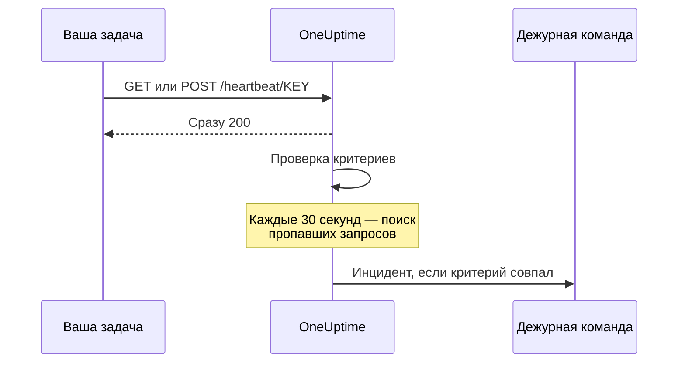

# Мониторинг входящих запросов

Монитор входящих запросов даёт вам URL, на который другие системы отправляют HTTP-запросы. OneUptime проверяет каждый запрос по вашим критериям и может менять статус монитора, объявлять инциденты и вызывать дежурную смену.

Он закрывает две разные задачи:

- **Мониторинг по heartbeat** — cron-задача, воркер или устройство обращается к URL по расписанию, и OneUptime открывает инцидент, когда сигналы перестают приходить.
- **Приём оповещений от другой системы** — Prometheus Alertmanager, Grafana или что угодно, что умеет отправлять JSON методом POST, присылает оповещения, а OneUptime превращает каждое из них в инцидент с эскалацией на дежурных и автоматическим закрытием при восстановлении.

Обе задачи используют один и тот же тип монитора. Различают их критерии, которые вы настраиваете.

:::cards
- [Создайте монитор](#создание-монитора-входящих-запросов): Получите URL для heartbeat за несколько шагов.
- [Отправьте heartbeat](#отправка-heartbeat): Из curl, cron, Node.js, Python или Go.
- [Оповещайте, когда сигналы пропадают](#пометить-как-офлайн-если-heartbeat-не-приходил-10-минут-выключатель-мертвеца): Превратите монитор в «выключатель мертвеца».
- [Принимайте оповещения](#приём-оповещений-от-другой-системы): Один инцидент на каждое оповещение Alertmanager или Grafana.
:::

## Как это работает

Никто не проверяет вашу систему снаружи: ваша система обращается к URL монитора, OneUptime сразу отвечает, а затем проверяет запрос по критериям монитора. Критерий, который отслеживает запросы, *переставшие* приходить, к тому же перепроверяется в фоне каждые 30 секунд, так что инцидент может открыть и тишина.



Используйте его, чтобы:

- Отслеживать cron-задачи и запланированные задания
- Проверять, что фоновые воркеры работают
- Отслеживать сервисы за файрволом, недоступные снаружи
- Принимать оповещения от Prometheus Alertmanager, Grafana и других систем оповещения
- Отслеживать heartbeat-сигналы от любой системы, умеющей работать с HTTP

## Создание монитора входящих запросов

:::steps
### Начните новый монитор

Откройте **Мониторы** и нажмите **Создать монитор**.

### Выберите Incoming Request

В разделе **Тип монитора** выберите **Incoming Request** — это один из распространённых типов вверху. Укажите **Имя** и нажмите **Далее**.

### Проверьте критерии

Шаг **Критерии** начинается с [критериев по умолчанию](#что-вы-получаете-сразу). Для heartbeat нажмите **Добавить критерии** и задайте новому критерию фильтр **Incoming Request** / **Not Recieved In Minutes**, который меняет статус на офлайн и объявляет инцидент, с включённым **Автоустранение инцидента**. Затем перетащите его в начало списка; почему, объясняет раздел [Примеры критериев](#примеры-критериев).

### Создайте монитор

Нажмите **Создать монитор**. Монитор открывается на странице **Обзор**, где карточка **Send the first heartbeat** показывает **Heartbeat URL** с кнопкой копирования и пример команды `curl`.

### Отправьте первый запрос

Настройте свой сервис на отправку запросов на этот URL (см. [Отправка heartbeat](#отправка-heartbeat)). Когда придёт первый запрос, карточка уступит место истории монитора, а карточка **Heartbeat URL** покажет URL и время последнего запроса.
:::

> [!NOTE]
> URL содержит секретный ключ монитора, поэтому его видят только те, кто может редактировать мониторы. Его всегда можно снова найти на странице монитора **Документация** в разделе **Конфигурация** бокового меню.

## URL для запросов

У вашего монитора есть уникальный URL в таком формате:

```text
https://oneuptime.com/heartbeat/YOUR_SECRET_KEY
```

Если вы размещаете OneUptime самостоятельно, замените `https://oneuptime.com` на URL своего экземпляра OneUptime.

Отправляйте на этот URL запросы **GET** или **POST**. HEAD принимается и обрабатывается как GET; PUT, PATCH и DELETE возвращают 404. Секретный ключ в пути — единственные учётные данные: ни заголовок, ни токен не нужны. Строки запроса игнорируются: передавайте то, что должны читать критерии, в теле или в заголовках.

> [!WARNING]
> Любой, кто знает этот URL, может пометить монитор как работающий, поэтому храните его как секрет. Если он утёк, откройте страницу монитора **Настройки** и нажмите **Сбросить секретный ключ входящего запроса**, а затем обновите каждого отправителя. Каждый заголовок, который вы отправляете, сохраняется в мониторе и виден всем, кто может его читать: не передавайте этому эндпоинту ключи API и токены в заголовках.

> [!IMPORTANT]
> OneUptime сразу отвечает `200` с пустым объектом JSON (`{}`) и обрабатывает запрос через очередь. Этот ответ записывается до любой проверки, поэтому `200` **не** подтверждает, что запрос принят: неверный секретный ключ, удалённый монитор и отключённый монитор тоже возвращают `200`. Чтобы убедиться, что запросы доходят, смотрите временную шкалу самого монитора.

### Отправка тела запроса

Если вам нужно обращаться к полям внутри тела — `{{requestBody.status}}` в заголовке инцидента, путь JSON в группировке инцидентов или критерий с выражением JavaScript, — отправляйте `Content-Type: application/json`. Эта документация везде исходит из этого формата. Тело должно быть объектом или массивом JSON: некорректный JSON или одиночное значение вроде `"error"` отклоняется с кодом `500`.

| Тип содержимого | Что видят критерии и шаблоны |
| --- | --- |
| `application/json` | Разобранный JSON. |
| `application/x-www-form-urlencoded` | Разобранную форму. Ключи в квадратных скобках становятся вложенными (`alerts[0][status]=firing`), и каждое значение — строка. |
| Любой другой или никакого | Пустое тело (`{}`), поэтому любая ссылка на `requestBody` ничего не даёт. |

Принимаются тела размером до 50 МБ; более крупное отклоняется с кодом `413`. Не сжимайте тело с помощью `Content-Encoding: gzip`: тогда оно не сохраняется как JSON, и пути внутрь него не разрешаются.

### Отправка heartbeat

Каждый пример отправляет один запрос. Замените `YOUR_SECRET_KEY` ключом из URL вашего монитора.

:::tabs
@tab curl
```bash
# Simple GET request
curl https://oneuptime.com/heartbeat/YOUR_SECRET_KEY

# POST request with a JSON body
curl -X POST https://oneuptime.com/heartbeat/YOUR_SECRET_KEY \
  -H "Content-Type: application/json" \
  -d '{"status": "healthy", "version": "1.2.3"}'
```
@tab Cron
```bash
# Send a heartbeat every 5 minutes
*/5 * * * * curl -fsS https://oneuptime.com/heartbeat/YOUR_SECRET_KEY > /dev/null

# Or ping only when the job succeeds, so a failed run counts as a missed heartbeat
0 2 * * * /usr/local/bin/backup.sh && curl -fsS https://oneuptime.com/heartbeat/YOUR_SECRET_KEY > /dev/null
```
@tab Node.js
```javascript title="heartbeat.mjs"
// Node.js 18 or later: fetch is built in. Run with `node heartbeat.mjs`.
const response = await fetch(
  "https://oneuptime.com/heartbeat/YOUR_SECRET_KEY",
  {
    method: "POST",
    headers: { "Content-Type": "application/json" },
    body: JSON.stringify({ status: "healthy", version: "1.2.3" }),
  },
);

console.log(response.status); // 200
```
@tab Python
```python title="heartbeat.py"
# Python 3, standard library only. Run with `python3 heartbeat.py`.
import json
import urllib.request

request = urllib.request.Request(
    "https://oneuptime.com/heartbeat/YOUR_SECRET_KEY",
    data=json.dumps({"status": "healthy", "version": "1.2.3"}).encode(),
    headers={"Content-Type": "application/json"},
    method="POST",
)

with urllib.request.urlopen(request, timeout=10) as response:
    print(response.status)  # 200
```
@tab Go
```go title="heartbeat.go"
// Run with `go run heartbeat.go`.
package main

import (
	"bytes"
	"fmt"
	"net/http"
)

func main() {
	body := []byte(`{"status": "healthy", "version": "1.2.3"}`)

	resp, err := http.Post(
		"https://oneuptime.com/heartbeat/YOUR_SECRET_KEY",
		"application/json",
		bytes.NewReader(body),
	)
	if err != nil {
		panic(err)
	}
	defer resp.Body.Close()

	fmt.Println(resp.StatusCode) // 200
}
```
@tab PowerShell
```powershell
# Windows PowerShell 5.1 or PowerShell 7
Invoke-RestMethod -Method Post `
  -Uri "https://oneuptime.com/heartbeat/YOUR_SECRET_KEY" `
  -ContentType "application/json" `
  -Body '{"status": "healthy", "version": "1.2.3"}'
```
:::

## Критерии мониторинга

Вы можете настроить критерии, которые решают, когда сервис считается онлайн, деградировавшим или офлайн. У каждого фильтра критерия есть **Тип фильтра** (на что смотреть), **Условие фильтра** (как сравнивать) и **Значение**.

### Что вы получаете сразу

Новый монитор входящих запросов создаётся с двумя критериями, которые читают тело запроса:

| Критерий | Тип фильтра | Условие фильтра | Значение | Действие |
| -------- | ------------ | ---------------- | ------- | -------------------------------------------- |
| Offline  | Тело запроса | Содержит | `error` | Помечает монитор как офлайн, открывает инцидент |
| Online   | Тело запроса | Not Contains | `error` | Помечает монитор как онлайн |

Это подходит для частого случая, когда отправитель сам сообщает о своём состоянии в полезной нагрузке: запрос, в теле которого упоминается `error`, переводит монитор в офлайн, а следующий запрос без этого слова возвращает монитор в онлайн и закрывает инцидент. Запрос совсем без тела считается «не содержащим `error`», поэтому простой heartbeat-сигнал держит монитор онлайн.

Замените значение на то, что ваш отправитель действительно присылает (`"status":"firing"`, `FAILED` и так далее): сравнение — это поиск подстроки с учётом регистра по всему телу, включая ключи, так что `{"error":null}` тоже совпадает с `error`.

> [!NOTE]
> Эти критерии по умолчанию — **не** «выключатель мертвеца»: ничто здесь не срабатывает, когда запросы перестают приходить. Если нужно оповещение о тишине, добавьте критерий **Incoming Request** / **Not Recieved In Minutes**, как описано ниже.

### Доступные типы фильтров

| Тип фильтра | Проверяет | Примечания |
| --------------------- | ------------------------------------------------------ | -------------------------------------------------------------------------------------------- |
| Incoming Request | Был ли получен запрос в пределах временного окна | Единственная проверка, которая может сработать, когда ничего не приходит |
| Тело запроса | Тело запроса | Поиск подстроки. Тела-объекты сравниваются как компактный JSON |
| Request Header | Имена заголовков запроса | Точное сравнение с целым именем заголовка без учёта регистра |
| Request Header Value | Значения заголовков запроса | Точное сравнение с целым значением заголовка без учёта регистра |
| JavaScript Expression | Любое выражение над `requestBody` и `requestHeaders` | Самый гибкий вариант: см. [Выражения JavaScript](/docs/monitor/javascript-expression) |

### Условия фильтров

У каждого типа фильтра свой набор условий:

| Тип фильтра | Условия |
| --- | --- |
| **Incoming Request** | **Recieved In Minutes** — запрос получен за указанное число минут. **Not Recieved In Minutes** — за указанное число минут не получено ни одного запроса. (Дашборд пишет их именно так.) |
| **Тело запроса**, **Request Header**, **Request Header Value** | **Содержит** и **Not Contains** |
| **JavaScript Expression** | **Evaluates To True** |

> [!NOTE]
> Имена и значения заголовков сравниваются в нижнем регистре и целиком, а не как подстрока: `application/json` не совпадает с `application/json; charset=utf-8`. Подстроку ищет только **Тело запроса**. Заголовки, которые добавляет ваш прокси или собственный балансировщик нагрузки OneUptime (`x-forwarded-for`, `x-real-ip`), тоже сохраняются.

Тела-объекты сравниваются как компактный JSON без пробелов, поэтому фильтр **Тело запроса** / **Содержит** нужно писать как `"status":"firing"`: если скопировать `"status": "firing"` из отформатированной полезной нагрузки, совпадения не будет никогда.

### Примеры критериев

#### Пометить как офлайн, если heartbeat не приходил 10 минут («выключатель мертвеца»)

| Поле | Значение |
| --- | --- |
| **Тип фильтра** | Incoming Request |
| **Условие фильтра** | Not Recieved In Minutes |
| **Значение** | `10` |

#### Пометить как деградировавший по содержимому тела запроса

| Поле | Значение |
| --- | --- |
| **Тип фильтра** | Тело запроса |
| **Условие фильтра** | Содержит |
| **Значение** | `"status":"degraded"` |

> [!IMPORTANT]
> Поставьте «выключатель мертвеца» **выше** критериев по умолчанию. Критерии проверяются сверху вниз, и решает первый совпавший. Фоновая проверка перечитывает последний запрос, поэтому онлайн-критерий по умолчанию ("Request Body Not Contains `error`") продолжает с ним совпадать, и критерий ниже него никогда не получает очереди. **Добавить критерии** добавляет критерий в конец: перетащите его наверх.

> [!WARNING]
> Монитор перепроверяется в фоне, только если хотя бы один из его критериев проверяет **Incoming Request**. Монитор, критерии которого проверяют только тело запроса, Request Header или выражение JavaScript, проверяется, когда приходит запрос, и больше никогда, поэтому сам по себе он не может перейти в офлайн. Если нужна тревога о пропавшем heartbeat, нужен критерий **Incoming Request**.

Фоновая проверка считает целые минуты и срабатывает, как только прошло *больше* заданного значения: "Not Recieved In Minutes: 10" срабатывает примерно через 11 минут после последнего запроса (проверка выполняется каждые 30 секунд). Монитор, который ещё не получил ни одного запроса, рассматривается так, будто время его создания — это последний запрос, поэтому такой же критерий на совсем новом мониторе срабатывает примерно через 11 минут после создания, даже если отправителя так и не подключили. В значение засчитываются только минуты, когда OneUptime принимал данные: минуты, пока сам OneUptime перезапускается, обновляется или навёрстывает отставание, не считаются, как объясняет раздел [Когда OneUptime не получает данные](/docs/monitor/when-oneuptime-is-not-receiving).

## Приём оповещений от другой системы

Alertmanager, Grafana и похожие инструменты отправляют методом POST документ JSON, описывающий одно или несколько оповещений. По умолчанию критерий открывает **один** инцидент, поэтому полезная нагрузка с пятью оповещениями дала бы один инцидент. Группировка инцидентов меняет это: она извлекает значение из полезной нагрузки и открывает **отдельный инцидент для каждого уникального значения**, и все они могут быть открыты одновременно.

```mermaid title="Группировка инцидентов: один инцидент на оповещение в полезной нагрузке"
flowchart TB
    payload["Полезная нагрузка вебхука"] --> keys["Один ключ на оповещение"]
    keys --> state{"Оповещение устранено?"}
    state -->|Нет| open["Открыть или оставить его инцидент"]
    state -->|Да| resolve["Закрыть его инцидент"]
```

### Включение группировки инцидентов

:::steps
1. Откройте критерий и разверните **Настройки**.
2. Включите **Group incidents and alerts by a payload field**.
3. Заполните **Open a separate incident for each…**. Чтобы каждый инцидент закрывался сам, заполните также поле и значение в **Auto-resolve each incident when…** (см. ниже). Затем сохраните монитор.
:::

| Поле | Пример | Что делает |
| ---------------------------------- | ---------------------------------------- | ---------------------------------------------------------------------- |
| Open a separate incident for each… | `requestBody.alerts[*].labels.alertname` | Путь, уникальные значения которого разделяют инциденты |
| Field that signals recovery | `requestBody.alerts[*].status` | Путь, по которому решается, что оповещение восстановилось |
| Value that means recovered | `resolved` | Точное значение, означающее восстановление |
| Max incidents per request | `100` (по умолчанию) | Предохранитель, чтобы поле с множеством значений не открыло неограниченное число инцидентов |

### Синтаксис путей

Пути должны начинаться с буквального префикса `requestBody.`. Путь без него — `alerts[*].labels.alertname` — молча ни с чем не совпадает. Обёртка `{{ }}` необязательна: `requestBody.status` и `{{requestBody.status}}` работают одинаково.

- `[*]` разворачивается по массиву — один инцидент на каждое **уникальное** значение. Два элемента с одинаковым значением сливаются в один инцидент, а его состояние (активно/устранено) берётся из **первого** совпавшего элемента. **Подстановочным знаком является только первый `[*]` в пути**; `requestBody.groups[*].alerts[*].name` ни с чем не совпадает.
- `[0]` и `[last]` выбирают один элемент и могут стоять после `[*]`.
- Значения-объекты и массивы, пустые строки и null пропускаются. `0` и `false` — допустимые ключи.
- Тело должно быть объектом JSON; полезная нагрузка, верхний уровень которой — массив, не группируется.

### Закрытие управляется событиями

Вебхук описывает только то, что есть в этой полезной нагрузке, поэтому OneUptime никогда не закрывает инцидент из-за того, что его ключ перестал появляться. Инцидент закрывается, только когда полезная нагрузка явно сообщает, что этот ключ восстановился. Должны выполняться оба условия:

1. **Field that signals recovery** и **Value that means recovered** заполнены и совпадают с полезной нагрузкой. Сравнение точное и с учётом регистра: `Resolved` не совпадает с `resolved`.
2. В инциденте критерия включено **Автоустранение инцидента** (в **Дополнительные поля** формы инцидента). Без этого совпавшие события восстановления игнорируются, и инциденты остаются открытыми. (То же относится к оповещениям и **Автоустранение оповещения**.) У офлайн-критерия по умолчанию эта настройка изначально включена; у инцидента, который вы сами добавляете в критерий, — выключена.

**Max incidents per request** ограничивает извлечение, а не только создание. Ключи сверх лимита невидимы и для восстановления, поэтому в полезной нагрузке, где уникальных ключей больше лимита, оповещение со статусом `resolved` за пределами лимита не закроет свой инцидент.

> [!NOTE]
> Когда один монитор получает запросы быстрее, чем OneUptime их проверяет, OneUptime проверяет самый новый и пропускает промежуточные, поэтому всплеск вебхуков может оставить активное или устранённое оповещение непроверенным. На самостоятельно размещённом сервере `INCOMING_REQUEST_INGEST_COALESCE_ENABLED=false` в окружении приложения OneUptime заставляет проверять каждый запрос отдельно.

> [!WARNING]
> Если **Field that signals recovery** содержит `[*]`, а **Open a separate incident for each…** — нет, ничего никогда не закроется. Используйте `[*]` либо в обоих полях, либо ни в одном. Путь восстановления без `[*]` вычисляется по всей полезной нагрузке, поэтому `status: resolved` на уровне полезной нагрузки закрывает каждый ключ в ней, включая оповещения, собственный статус которых всё ещё активен.

### Названия инцидентов

Ключ группировки доступен шаблонам инцидентов и оповещений как переменная, названная по **последнему сегменту пути**:

| Путь | Переменная |
| ---------------------------------------- | ----------------- |
| `requestBody.alerts[*].labels.alertname` | `{{alertname}}`   |
| `requestBody.alerts[*].fingerprint`      | `{{fingerprint}}` |
| `requestBody.commonLabels.severity`      | `{{severity}}`    |

Рядом доступна и вся полезная нагрузка, поэтому работают и заголовок инцидента `{{alertname}}`, и описание со ссылкой на `{{requestBody.commonAnnotations.summary}}`. См. [Шаблоны инцидентов и оповещений](/docs/monitor/incident-alert-templating).

> [!WARNING]
> Имя переменной — часть идентификатора, по которому OneUptime сопоставляет событие восстановления с открытым инцидентом. Если сменить путь группировки на путь с другим последним сегментом, все инциденты, открытые по старому пути, останутся «сиротами»: их уже нельзя закрыть автоматически, и закрывать их придётся вручную.

`[*]` работает **только** в двух полях путей группировки. В других местах он не разрешается, а неразрешённый заполнитель выводится **дословно**, а не заменяется пустотой: заголовок `{{requestBody.alerts[*].labels.alertname}}` отображается с фигурными скобками. Заголовок `{{requestBody.alerts[0].annotations.summary}}` разрешается, но всегда читает первое оповещение в полезной нагрузке, а не то, ради которого открыт этот инцидент. Предпочитайте переменную группировки плюс общие поля `commonAnnotations` полезной нагрузки.

### Разобранный пример

Полную конфигурацию Alertmanager см. в разделе [Prometheus Alertmanager](/docs/integrations/prometheus-alertmanager). Для Grafana см. [Grafana](/docs/integrations/grafana).

## Рекомендации

1. **Задайте подходящее временное окно** — если ваша cron-задача запускается каждые 5 минут, установите порог "Not Recieved In Minutes" на 10–15 минут, чтобы учесть случайные задержки, и поставьте этот критерий первым.
2. **Передавайте полезные данные** — отправляйте информацию о состоянии в теле запроса, чтобы настраивать детальные критерии.
3. **Используйте POST с `Content-Type: application/json`** — от этого зависит всё, что читает содержимое тела.
4. **Не смешивайте две задачи в одном мониторе** — у монитора, принимающего событийные оповещения, нет регулярного ритма, поэтому критерий "Not Recieved In Minutes" на нём будет постоянно переключаться. Для «выключателя мертвеца» используйте отдельный монитор.
5. **Следите за самим мониторингом** — убедитесь, что сервис, отправляющий запросы, правильно обрабатывает ошибки, чтобы неудачные запросы не оставались незамеченными.

## Устранение неполадок

:::details Отправитель получает 200, но в мониторе ничего не появляется
`200` отправляется до проверки запроса, поэтому не доказывает, что запрос принят. Убедитесь, что секретный ключ в URL совпадает с **Heartbeat URL** монитора и что монитор не отключён. Затем посмотрите на временной шкале монитора, доходят ли запросы.
:::

:::details Монитор не переходит в офлайн, когда heartbeat перестаёт приходить
Тишину может заметить только критерий **Incoming Request** (**Not Recieved In Minutes**). Добавьте его, если его нет, и перетащите выше критериев по умолчанию: онлайн-критерий по умолчанию совпадает с последним запросом при каждой фоновой проверке, а решает первый совпавший критерий.
:::

:::details Фильтр «Тело запроса» никогда не срабатывает
Отправляйте `Content-Type: application/json` и пишите значение как компактный JSON — `"status":"firing"`, без пробела после двоеточия. Без типа содержимого JSON или формы тело не разбирается.
:::

:::details Фильтр «Request Header» никогда не срабатывает
Имена и значения заголовков сравниваются целиком. Указывайте полное значение, например `application/json; charset=utf-8`, а не его часть.
:::

:::details Отправитель получает 500
В запросе указан `Content-Type: application/json`, но его тело не является объектом или массивом JSON. Отправьте корректный JSON или другой тип содержимого.
:::

## Следующие шаги

:::cards
- [Prometheus Alertmanager](/docs/integrations/prometheus-alertmanager): Полная настройка приёма входящих оповещений.
- [Grafana](/docs/integrations/grafana): То же самое для оповещений Grafana.
- [Шаблоны инцидентов и оповещений](/docs/monitor/incident-alert-templating): Все переменные, доступные в заголовках и описаниях.
- [Выражения JavaScript](/docs/monitor/javascript-expression): Синтаксис выражений и правила кавычек.
:::
