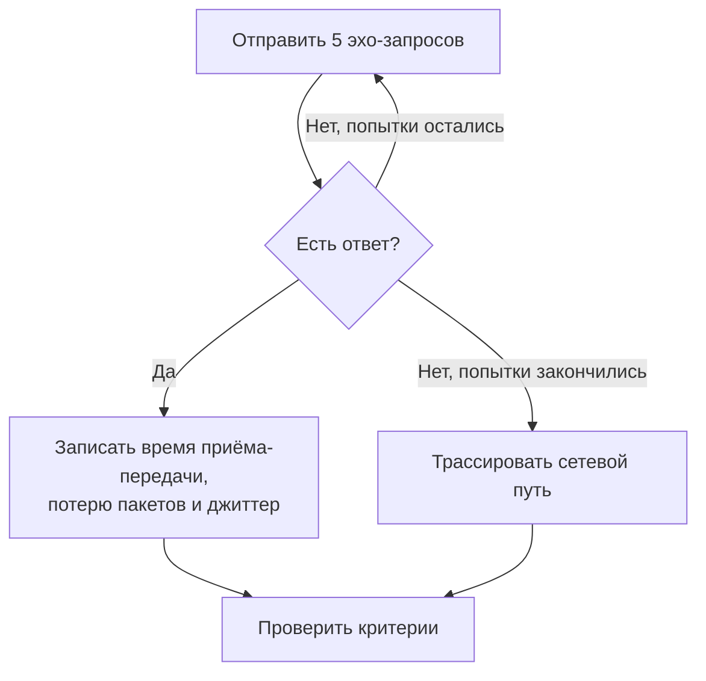

# Мониторинг IP

Монитор IP проверяет, что адрес IPv4 или IPv6 отвечает на ping (эхо-запросы ICMP), и измеряет время приёма-передачи, потерю пакетов и джиттер. Используйте его для инфраструктуры, которую вы знаете по адресу, например шлюза, виртуального IP балансировщика нагрузки или сервера с фиксированным адресом.

:::cards
- [Создать монитор](#создание-монитора-ip): Шесть шагов в панели управления.
- [Параметры конфигурации](#параметры-конфигурации): Адрес, тайм-аут и повторные попытки.
- [Критерии мониторинга](#критерии-мониторинга): Доступность, задержка, потеря пакетов и джиттер.
- [Устранение неполадок](#устранение-неполадок): Когда адрес доступен, а монитор говорит, что он не в сети.
:::

## Как это работает

Монитор IP выполняет ту же проверку, что и [монитор ping](/docs/monitor/ping-monitor). При каждой проверке зонд отправляет на адрес пять эхо-запросов. Если вернулся хотя бы один ответ, адрес в сети, и зонд записывает среднее время приёма-передачи как время ответа, а также потерю пакетов, джиттер и самый быстрый и самый медленный ответы. Если ответа нет, зонд пробует снова — столько раз, сколько повторных попыток вы разрешили. Затем OneUptime пропускает результат через критерии монитора.

Когда проверка не проходит, зонд также трассирует маршрут до адреса и прикладывает найденное к результату как **Network Path at Time of Failure**, чтобы вы видели, где оборвался маршрут.

Какой использовать:

| Монитор | Принимает | Используйте, когда |
| --- | --- | --- |
| **IP** | Только IP-адрес | Вы следите за самим адресом, и он не меняется. |
| [Ping](/docs/monitor/ping-monitor) | Имя хоста или IP-адрес | Вы знаете хост по имени; имя разрешается при каждой проверке, поэтому монитор следует за изменениями DNS. |

> [!NOTE]
> Некоторые хостинг-провайдеры блокируют ICMP на машинах, где работает зонд. Зонд, который вообще не может отправлять ping, вместо этого проверяет TCP-порт `80` по адресу, чтобы монитор всё равно сообщал, доступен ли он. Потеря пакетов и джиттер тогда не измеряются.

Зонд, потерявший собственное сетевое подключение, не сообщает никакого результата, поэтому не может пометить ваш адрес как не в сети.

## Перед началом

- **Роль, которая может создавать мониторы**: Project Owner, Project Admin, Project Member, Monitor Admin или Monitor Member либо пользовательская роль с разрешением Create Monitor.
- **Зонд, который может достучаться до адреса**, с разрешённым по пути ICMP. Зонды проекта по умолчанию выбираются для каждого нового монитора. Если перед ним стоит брандмауэр, разрешите эхо-запросы ICMP с [IP-адресов зондов OneUptime Cloud](/docs/configuration/ip-addresses). Частному адресу нужен [пользовательский зонд](/docs/probe/custom-probe) в этой сети, а адресу IPv6 — зонд с подключением по IPv6.

## Создание монитора IP

:::steps
### Начните новый монитор

Перейдите в **Мониторы** и нажмите **Создать монитор**. В **Тип монитора** нажмите **Другие типы мониторов** и выберите **IP** в разделе **Basic Monitoring**.

### Назовите его

Введите **Имя**, например `Office gateway`, и нажмите **Далее**.

### Введите адрес

В **IP-адрес** введите адрес IPv4 или IPv6 для проверки, например `192.168.1.1` или `2001:db8::1`. Имя хоста не принимается: поле показывает ошибку. Чтобы пинговать хост по имени, используйте [монитор ping](/docs/monitor/ping-monitor).

### Протестируйте его

Нажмите **Протестировать монитор**, выберите зонд в **Выберите зонд** и нажмите **Запустить тест**. **Результат теста монитора** показывает время приёма-передачи и потерю пакетов, которые увидел зонд.

### Проверьте критерии

**Критерии монитора** начинаются с [критериев по умолчанию](#критерии-по-умолчанию): не в сети, когда адрес не отвечает, в сети, когда отвечает. Измените их при необходимости и нажмите **Далее**.

### Выберите зонды и создайте

Оставьте или измените **Зонды** и **Интервал мониторинга** (он начинается с **Каждые 5 минут**) и нажмите **Создать монитор**. Откроется страница монитора.
:::

## Параметры конфигурации

| Поле | По умолчанию | Что ввести |
| --- | --- | --- |
| **IP-адрес** | Нет | Адрес IPv4, например `192.168.1.1`, или адрес IPv6, например `2001:db8::1`. Квадратные скобки вокруг адреса IPv6 удаляются. |
| **Тайм-аут запроса (секунды)** (в **Дополнительные поля**) | `60` | Сколько ждать ответа в каждой попытке. Максимум — 60 секунд. |
| **Повторные попытки при сбое** (в **Дополнительные поля**) | Значение зонда по умолчанию, обычно `3` | Сколько раз повторять неудачную попытку. Максимум — 3. |

**Повторные попытки при сбое** считает повторы _после_ первой попытки, поэтому `0` выполняет проверку один раз, а `2` — до трёх раз. Если поле пустое, используется значение зонда по умолчанию: 3, если только `PROBE_MONITOR_RETRY_LIMIT` зонда не задаёт другое. Повторяется любой сбой, включая тайм-ауты, с паузой в одну секунду между попытками. Успешная проверка, ответы которой заняли больше 10 секунд, тоже проверяется повторно.

## Критерии мониторинга

Критерии определяют, когда адрес считается в сети, деградировавшим или не в сети, и объявляется ли при этом инцидент или создаётся оповещение. Каждый критерий проверяет один или несколько фильтров:

| Фильтр | Условия | Что проверяет |
| --- | --- | --- |
| **Is Online** | **Истина**, **Ложь** | Получил ли ответ хотя бы один эхо-запрос. |
| **Время ответа (в мс)** | **Greater Than**, **Less Than**, **Greater Than Or Equal To**, **Less Than Or Equal To** | Среднее время приёма-передачи ответов. |
| **Packet Loss (in %)** | **Greater Than**, **Less Than**, **Greater Than Or Equal To**, **Less Than Or Equal To** | Доля из пяти эхо-запросов, не получивших ответа. |
| **Jitter (in ms)** | **Greater Than**, **Less Than**, **Greater Than Or Equal To**, **Less Than Or Equal To** | Стандартное отклонение времени приёма-передачи по пакетам одной проверки. |
| **Is Request Timeout** | **Истина**, **Ложь** | Превышал ли ping тайм-аут при каждой попытке. |

При двух и более фильтрах **Условие совпадения** решает, должны ли совпасть **Все** или достаточно **Любой** из них. **Действия** критерия определяют, что он делает: меняет статус монитора, создаёт оповещение, объявляет инцидент или делает несколько из этого.

### Критерии по умолчанию

Новый монитор IP начинает с двух критериев:

- **Не в сети** — адрес не отвечает ни на один эхо-запрос или вообще недоступен после всех повторных попыток. Монитор помечается как **Не в сети**, и создаётся инцидент с названием «_monitor name_ is offline». Инцидент разрешается сам, когда адрес снова отвечает.
- **В сети** — адрес отвечает. Монитор помечается как **Работает**.

Критерии проверяются сверху вниз, и первый совпавший решает, что произойдёт. Если ни один не совпал, монитор показывает статус по умолчанию: **Работает**, если вы не выберете другой в разделе **Дополнительные поля** под критериями.

### Оценка за период времени

**Оценивать этот критерий в течение определённого периода времени** — флажок под фильтром, доступный для **Is Online**, **Время ответа (в мс)**, **Packet Loss (in %)** и **Jitter (in ms)**. Включите его, чтобы оценивать окно прошлых проверок, а не только последнюю: выберите агрегацию в **Оценить** и окно от 2 до 60 минут в **За последние (в минутах)**.

| Агрегация | Совпадает, когда |
| --- | --- |
| **Среднее**, **Сумма**, **Maximum Value**, **Minimum Value** | Это значение за окно удовлетворяет условию. Только для числовых фильтров. |
| **All Values** | Каждая проверка в окне удовлетворяет условию. |
| **Any Value** | Хотя бы одна проверка в окне удовлетворяет условию. |

**All Values** совпадает только тогда, когда окно действительно покрыто данными. У только что созданного монитора или монитора, проверки которого перестали записываться, недостаточно истории, чтобы что-то сказать о последних N минутах, поэтому критерий ждёт, а не срабатывает по единственному имеющемуся значению. **Any Value** — это настройка для «сообщи мне сразу, как только хоть одна проверка превысит порог», и она по-прежнему срабатывает немедленно.

**Если нет данных** определяет, что происходит, пока окно не может подкрепить критерий:

| Вариант | Что происходит | Для чего использовать |
| --- | --- | --- |
| **Ignore** (по умолчанию) | Критерий не совпадает. | Обычные пороговые оповещения. |
| **Триггер** | Отсутствие данных считается проблемой. | Проверки, где молчание само по себе — сбой. |
| **Treat As Zero** | Окно сравнивается как один ноль. | Счётчики, где отсутствие событий действительно означает ноль. |

### Примеры критериев

| Цель | Фильтр | Условие | Значение |
| --- | --- | --- | --- |
| Не в сети, когда адрес недоступен | **Is Online** | **Ложь** | — |
| Оповещать при высокой задержке | **Время ответа (в мс)** | **Greater Than** | `100` |
| Помечать адрес деградировавшим на канале с потерями | **Packet Loss (in %)** | **Greater Than** | `20` |
| Оповещать о нестабильном соединении | **Jitter (in ms)** | **Greater Than** | `30` |

## Устранение неполадок

:::details Адрес доступен, но монитор говорит, что он не в сети
Адрес или брандмауэр перед ним не отвечает на эхо-запросы ICMP от зонда. Разрешите эхо-запросы ICMP от зондов или вместо этого отслеживайте сервис по этому адресу с помощью [монитора портов](/docs/monitor/port-monitor). **Network Path at Time of Failure** в неудачной проверке показывает, как далеко дошёл маршрут.
:::

:::details Адрес IPv6 всегда даёт сбой
У зонда, выполнившего проверку, нет подключения по IPv6; об этом говорит сообщение об ошибке. Запустите монитор на зонде с IPv6: см. [Пользовательские probes](/docs/probe/custom-probe).
:::

:::details Потеря пакетов и джиттер пусты
Зонд, выполнивший проверку, не может отправлять ping, поэтому вместо этого проверил TCP-порт `80`, который не измеряет ни то, ни другое. Запустите монитор на зонде, которому разрешено отправлять ICMP.
:::

## Дальнейшие шаги

:::cards
- [Мониторинг Ping](/docs/monitor/ping-monitor): Пинговать хост по имени, следуя за изменениями DNS.
- [Мониторинг портов](/docs/monitor/port-monitor): Проверять сервис по адресу, а не только адрес.
- [Пользовательские probes](/docs/probe/custom-probe): Проверять частные адреса и адреса IPv6 из вашей собственной сети.
- [Инциденты](/docs/incidents/index): Что происходит после того, как монитор объявил инцидент.
:::
