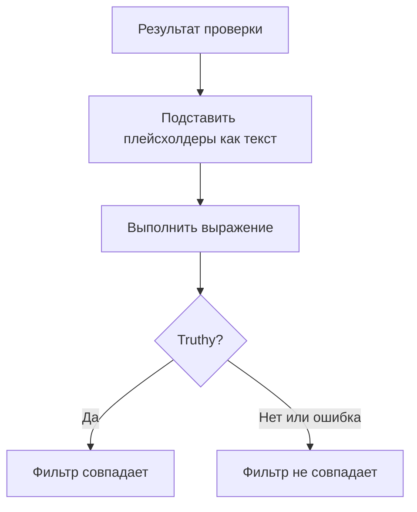

# Выражения JavaScript

Фильтр критерия **JavaScript Expression** решает, выполнен ли критерий монитора, с помощью строки JavaScript вместо фиксированного сравнения. Используйте его, когда встроенные фильтры не могут выразить условие, — поле глубоко внутри JSON-ответа, два значения, сравниваемые друг с другом, или несколько проверок, объединённых через `&&` и `||`.

:::cards
- [Как это работает](#как-это-работает): Плейсхолдеры подставляются, затем выражение выполняется.
- [Переменные](#переменные-по-типам-мониторов): Что даёт каждый тип монитора.
- [Примеры](#примеры): Выражения для API, входящих запросов и баз данных.
- [Правила кавычек](#правила-кавычек): Ошибка, которую совершают почти все.
:::

## Как это работает

Перед выполнением выражения каждый плейсхолдер `{{variable}}` в нём заменяется значением из последней проверки монитора — в виде обычного текста. Затем результат выполняется как JavaScript. Если он даёт истинное значение (truthy), фильтр совпадает; всё остальное, включая ошибку, означает, что он не совпадает.



Поскольку плейсхолдеры заменяются как текст, `{{responseBody.item}}` становится «сырым» значением. Строку нужно заключить в кавычки, чтобы она стала строкой JavaScript; число или логическое значение — не нужно, см. [Правила кавычек](#правила-кавычек). Выражения выполняются на сервере OneUptime в изолированной песочнице.

## Добавление фильтра JavaScript Expression

:::steps
### Откройте критерии

На мониторе откройте **Конфигурация → Критерии** и нажмите **Редактировать: Критерии мониторинга** или используйте шаг **Критерии** в **Создать монитор**. Работайте в критерии, который хотите изменить, или нажмите **Добавить критерии** для нового.

### Добавьте фильтр

В **Фильтры** нажмите **Добавить фильтр** и установите его **Тип фильтра** на **JavaScript Expression**. **Условие фильтра** — **Evaluates To True**.

### Напишите выражение

Введите выражение в **Значение**, используя [переменные типа монитора](#переменные-по-типам-мониторов). Ссылка под фильтром, **Read documentation for using JavaScript expressions here.**, открывает эту страницу.

### Сохраните

Сохраните монитор. Фильтр вычисляется при следующей проверке монитора.
:::

## Переменные по типам мониторов

Выражения JavaScript доступны для мониторов типов Website, API, Incoming Request, Incoming Email, SQL Query и Database Health.

### Мониторы веб-сайтов и API

| Переменная | Описание | Тип |
| --- | --- | --- |
| `responseBody` | Тело ответа. Если тело ответа — JSON, оно разбирается; иначе, например для HTML или XML, это строка. | `string` или `JSON` |
| `responseHeaders` | Заголовки ответа с именами в нижнем регистре. | `Dictionary<string>` |
| `responseStatusCode` | Код статуса ответа. | `number` |
| `responseTimeInMs` | Время ответа в миллисекундах. | `number` |
| `isOnline` | Считает ли монитор ответ «в сети». | `boolean` |

### Мониторы входящих запросов

| Переменная | Описание | Тип |
| --- | --- | --- |
| `requestBody` | Тело запроса. | `string` или `JSON` |
| `requestHeaders` | Заголовки запроса с именами в нижнем регистре. | `Dictionary<string>` |

### Мониторы SQL-запросов

| Переменная | Описание | Тип |
| --- | --- | --- |
| `rowCount` | Число строк, которые вернул запрос. | `number` |
| `scalarValue` | Первый столбец первой строки. | любой |
| `firstRow` | Первая строка в виде пар «столбец — значение». | `JSON` |
| `executionTimeInMs` | Сколько длился запрос, в миллисекундах. | `number` |
| `queryError` | Ошибка запроса, если она была. | `string` |
| `isOnline` | Была ли база данных доступна и выполнился ли запрос. | `boolean` |

### Мониторы состояния баз данных

`isOnline`, `engineVersion`, `connectionError`, `collectedGroups`, `unavailableGroups` и `metrics`. См. [Переменные выражений JavaScript](/docs/monitor/database-health-monitor#переменные-выражений-javascript) на странице мониторинга состояния баз данных.

### Мониторы входящих писем

Фильтр доступен, но к нему не привязаны поля письма: выражение не может прочитать тему, отправителя, тело или получателя. Используйте вместо этого типы фильтров для писем — см. [Мониторинг входящих писем](/docs/monitor/incoming-email-monitor#доступные-поля-для-критериев).

## Примеры

Каждая строка ниже — одно полное выражение. Для такого тела ответа в JSON:

```json
{
  "item": "hello",
  "count": 3,
  "items": [{ "name": "hello" }]
}
```

| Выражение | Совпадает, когда |
| --- | --- |
| `"{{responseBody.item}}" === "hello"` | Поле `item` равно `hello`. |
| `{{responseBody.count}} > 2` | Поле `count` больше 2. |
| `"{{responseBody.items[0].name}}" === "hello"` | У первого элемента `items` имя `hello`. |
| `{{responseStatusCode}} === 200 && {{responseTimeInMs}} < 500` | Статус равен 200, и ответ занял меньше полсекунды. |
| `/hel+o/.test("{{responseBody.item}}")` | Поле `item` соответствует регулярному выражению. |
| `"{{responseHeaders.content-type}}".startsWith("application/json")` | Ответ — JSON. Имена заголовков в нижнем регистре. |

Объединяйте условия через `&&` и `||` и группируйте их скобками:

```javascript
({{responseStatusCode}} === 200 || {{responseStatusCode}} === 204) && {{responseTimeInMs}} < 1000
```

Для монитора входящих запросов, который получает `{"status": "degraded", "region": "eu"}` как `Content-Type: application/json`:

```javascript
"{{requestBody.status}}" === "degraded" && "{{requestBody.region}}" === "eu"
```

Для монитора SQL-запросов, запрос которого возвращает количество, — оповещение при большом количестве или медленном запросе:

```javascript
{{scalarValue}} > 50 || {{executionTimeInMs}} > 2000
```

Для монитора состояния баз данных читайте одну метрику, обращаясь по индексу ко всему объекту `metrics`, — имена рядов содержат точки, поэтому их нельзя поместить внутрь фигурных скобок:

```javascript
{{metrics}}['oneuptime.monitor.database.connections.used.percent'] > 90
```

## Правила кавычек

`{{var}}` заменяется значением в виде текста. Чтобы сравнить строку, заключите её в кавычки, как в `"{{responseBody.item}}" === "hello"`; чтобы сравнить число, оставьте его без кавычек, как в `{{responseStatusCode}} === 200`.

| Тип значения | Как писать | Пример |
| --- | --- | --- |
| Строка | В кавычках | `"{{responseBody.status}}" === "ok"` |
| Число | Без кавычек | `{{responseTimeInMs}} < 500` |
| Логическое значение | Без кавычек | `{{isOnline}} === true` |
| Объект или массив | Без кавычек, затем обращение по индексу | `{{responseHeaders}}['content-type']` |

На что обратить внимание:

- **Плейсхолдер в кавычках сам по себе всегда истинен.** `"{{responseBody.healthy}}"` — это непустая строка `"false"`, когда поле равно `false`. Сравните его: `"{{responseBody.healthy}}" === "true"` — или оставьте без кавычек: `{{responseBody.healthy}} === true`.
- **Значения не экранируются.** Значение, содержащее двойную кавычку или перевод строки, преждевременно завершает строку, и выражение завершается ошибкой. Чтобы искать текст на HTML-странице, используйте вместо этого фильтр **Тело ответа**.
- **Отсутствующий путь остаётся как написан.** Если в проверке нет такого поля, `{{responseBody.item}}` остаётся в выражении как есть, что обычно является синтаксической ошибкой, — поэтому фильтр не совпадает.

## Ограничения

На выполнение выражения отводится 5 секунд. Выражение, которое выполняется дольше или выбрасывает ошибку, не совпадает, а ошибка записывается в журнал сервера OneUptime.

## Устранение неполадок

:::details Выражение никогда не совпадает
Сначала проверьте кавычки: строковый плейсхолдер без кавычек превращается в голое слово, а это синтаксическая ошибка, и ошибка никогда не совпадает. Затем проверьте, что путь есть в результате проверки, — плейсхолдер для отсутствующего пути не подставляется.
:::

:::details Выражение всегда совпадает
Плейсхолдер в кавычках сам по себе — непустая строка, а она всегда truthy. Сравните его со значением.
:::

## Дальнейшие шаги

:::cards
- [Шаблоны инцидентов и оповещений](/docs/monitor/incident-alert-templating): Те же плейсхолдеры в заголовках и описаниях инцидентов.
- [Мониторинг API](/docs/monitor/api-monitor): Проверка HTTP-эндпоинта и его ответа.
- [Мониторинг входящих запросов](/docs/monitor/incoming-request-monitor): Оценка запросов, которые вам отправляют другие системы.
:::
