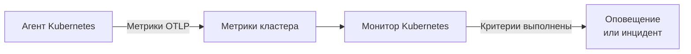

# Мониторинг Kubernetes

Монитор Kubernetes оповещает по метрикам, которые агент Kubernetes от OneUptime отправляет из кластера: узлы, поды, контейнеры, рабочие нагрузки, автомасштабировщики и плоскость управления. Начните с готового шаблона оповещения, выберите одну метрику или напишите собственный запрос, а затем задайте порог, при котором открывается оповещение или инцидент.

:::cards
- [Установка агента](/docs/monitor/kubernetes-agent): Одна команда Helm подключает кластер к OneUptime.
- [Создание монитора](#создание-монитора-kubernetes): Выберите кластер, затем шаблон, метрику или запрос.
- [Шаблоны оповещений](#готовые-шаблоны-оповещений): Семнадцать готовых оповещений, от CrashLoopBackOff до etcd.
- [Критерии](#критерии-мониторинга): Статические пороги и обнаружение аномалий.
:::

## Как это работает

Агент отправляет метрики кластера в OneUptime по OTLP, помечая каждую именем кластера (`k8s.cluster.name`, параметр `clusterName` чарта). Первые данные с новым именем регистрируют кластер в разделе **Kubernetes**, и с этого момента кластер можно выбрать в мониторе Kubernetes. Каждую минуту монитор запрашивает эти метрики за свой **Диапазон времени**, агрегирует их и сравнивает результат со своими критериями.

## Перед началом работы

- В кластере работает агент Kubernetes от OneUptime. См. [Агент Kubernetes (установка через Helm)](/docs/monitor/kubernetes-agent); кластер появляется в разделе **Kubernetes** через несколько минут после установки.
- Для шаблонов плоскости управления (**etcd No Leader**, **API Server Request Saturation**, **Scheduler Backlog**): сбор метрик плоскости управления агентом, `controlPlane.enabled`. Управляемые кластеры (EKS, GKE, AKS) не открывают эти конечные точки, поэтому там такие мониторы никогда не получают данных.

## Создание монитора Kubernetes

:::steps
### Начните новый монитор

Перейдите в **Мониторы** и нажмите **Создать монитор**. В разделе **Другие типы мониторов** выберите **Kubernetes** – или введите `k8s` в поле поиска.

### Выберите кластер

Выберите его в поле **Kubernetes-кластер**. В списке есть каждый кластер, из которого агент присылал данные.

### Выберите, что отслеживать

Используйте одну из трёх вкладок:

| Вкладка | Что вы выбираете |
| --- | --- |
| **Quick Setup** | [Готовый шаблон оповещения](#готовые-шаблоны-оповещений). Он заполняет метрику, область, диапазон времени и критерии; поле **Диапазон времени** по-прежнему можно изменить. |
| **Custom Metric** | Одну метрику из [каталога метрик](#каталог-метрик), затем её **Область ресурса**, фильтры, **Агрегация** (Среднее, Максимум, Минимум, Сумма или Количество) и **Диапазон времени**. |
| **Расширенный** | **Область ресурса**, фильтры и **Диапазон времени**, а также собственные запросы метрик и формулы в разделе **Выберите метрики** с живым графиком результата. |

### Задайте критерии

Задайте, когда монитор меняет статус и когда открывает оповещение или инцидент, – см. [Критерии мониторинга](#критерии-мониторинга). Шаблон уже заполнил их: проверьте пороги, уровни серьёзности и политики дежурств.

### Сохраните монитор

Заполните форму до конца и сохраните. Монитор появится в разделе **Мониторы**, и его статус будет следовать вашим критериям с первой оценки.
:::

## Параметры конфигурации

### Область ресурса и фильтры

**Область ресурса** задаёт уровень, на котором оценивается метрика, и определяет, какие фильтры показывает форма. Все фильтры необязательны.

| Область | Что отслеживает | Фильтры |
| --- | --- | --- |
| Кластер | Весь кластер | — |
| Пространство имен | Ресурсы в пространстве имён | **Пространство имен** |
| Рабочая нагрузка | Deployment, statefulset, daemonset, job или cronjob | **Пространство имен**, **Имя рабочей нагрузки** |
| Узел | Узел кластера | **Имя узла** |
| Под | Под | **Пространство имен**, **Имя пода** |

### Диапазон времени

**Диапазон времени** – это окно, которое охватывает запрос метрики при каждой оценке монитора, от **Past 1 Minute** до **Past 365 Days**. Короткие окна (от 1 до 15 минут) подходят для оповещений; длинные сглаживают шумные метрики.

### Запросы метрик и формулы

На вкладке **Расширенный** каждый запрос указывает метрику, способ агрегации её значений и необязательные фильтры по атрибутам. **Формула** объединяет запросы с помощью арифметики – например, шаблоны загрузки узла делят использование на выделяемую ёмкость.

## Каталог метрик

Вкладка **Custom Metric** предлагает эти метрики, сгруппированные по типу ресурса:

| Категория | Метрики |
| --- | --- |
| Под | Pod CPU Usage, Pod Memory Usage, Pod Phase (Code), Pod Filesystem Usage, Pod Memory Limit Utilization, Pod CPU Limit Utilization, Pod Network I/O (Cumulative, Both Directions) |
| Узел | Node CPU Usage, Node Allocatable CPU, Node Memory Usage, Node Filesystem Usage, Node Allocatable Memory, Node Ready Condition, Node Filesystem Available |
| Контейнер | Container Restarts, Container CPU Limit, Container CPU Request, Container Memory Limit, Container Memory Request, Container Ready |
| Рабочая нагрузка | Deployment Available Replicas, Deployment Desired Replicas, DaemonSet Misscheduled Nodes, DaemonSet Ready Nodes, StatefulSet Ready Replicas, Job Failed Pods, Job Successful Pods |
| HPA | HPA Current Replicas, HPA Desired Replicas, HPA Max Replicas, HPA Min Replicas |
| Плоскость управления | etcd Has Leader, API Server In-Flight Requests, Scheduler Pending Pods |

> [!NOTE]
> **Pod CPU Usage** и **Node CPU Usage** измеряются в ядрах, а не в процентах: `0.18` – это 0,18 ядра. **Pod Phase (Code)** – это код (1 Pending, 2 Running, 3 Succeeded, 4 Failed, 5 Unknown): агрегируйте его через «Максимум» или «Минимум», но никогда не через «Сумма». Метрики плоскости управления приходят только тогда, когда включён сбор метрик плоскости управления агентом.

## Критерии мониторинга

### Что оценивается

Эти мониторы всегда оценивают **Metric Value** – значение настроенного запроса метрики или формулы. В форме критерия нет выбора типа фильтра; она показывает поля **Метрика**, **Агрегация**, **Условие** и **Threshold**.

### Типы агрегации

| Агрегация | Описание |
| --- | --- |
| Среднее | Среднее значение за временное окно |
| Сумма | Сумма всех значений |
| Maximum Value | Наибольшее значение во временном окне |
| Minimum Value | Наименьшее значение во временном окне |
| All Values | Все значения должны соответствовать критерию |
| Any Value | Хотя бы одно значение должно соответствовать |

### Условия

Статические пороги сравниваются с введённым значением **Threshold**: **Greater Than**, **Less Than**, **Greater Than Or Equal To**, **Less Than Or Equal To** и **Equal To**.

Обнаружению аномалий относительно базовой линии порог не нужен. Выберите одно из этих условий, и форма вместо порога покажет **Чувствительность** и **Окно базовой линии**:

| Условие | Срабатывает, когда значение |
| --- | --- |
| **Anomalously High** | Поднимается выше ожидаемого диапазона |
| **Anomalously Low** | Опускается ниже ожидаемого диапазона |
| **Anomalous** | Выходит из ожидаемого диапазона в любую сторону |

Каждое значение сравнивается с базовой линией для того же часа недели, построенной по полю **Окно базовой линии** (по умолчанию 14 дней; 28, 60 или 90 дней). **Чувствительность** задаёт ширину ожидаемого диапазона: **Низкий (4σ — только вопиющие отклонения)**, **Средний (3σ — рекомендуется)**, используемый по умолчанию, или **Высокий (2σ — более шумно, очень стабильные сервисы)**. Условия аномалий остаются в состоянии «Learning» и не создают оповещений, пока не накопится история метрики не меньше выбранного окна базовой линии.

**Если нет данных** в разделе **Дополнительные поля** решает, что происходит, когда запрос ничего не возвращает за окно: **Ignore** (по умолчанию) не срабатывает, **Триггер** считает молчание проблемой, а **Treat As Zero** сравнивает ноль. Время, когда OneUptime сам не принимал данные, никогда не считается отсутствием данных: проверка, окно которой включает такое время, вместо этого ждёт, как объясняет страница [Когда OneUptime не получает данные](/docs/monitor/when-oneuptime-is-not-receiving).

## Готовые шаблоны оповещений

Вкладка **Quick Setup** перечисляет эти шаблоны, сгруппированные по категориям. Каждый заполняет два критерия: один помечает монитор как не в сети и открывает инцидент и оповещение, пока условие выполняется, а второй возвращает монитор в сеть, когда условие снимается.

| Шаблон | Категория | Срабатывает, когда | Серьёзность |
| --- | --- | --- | --- |
| CrashLoopBackOff Detection | Рабочая нагрузка | Контейнер перезапускался более 5 раз с момента создания его пода | Критический |
| Pod Stuck in Pending | Планирование | Какой-либо под находится в фазе Pending в каждом замере 15-минутного окна | Warning |
| Node Not Ready | Узел | Узел сообщает NotReady | Критический |
| High Node CPU Utilization | Узел | Среднее использование CPU узлом выше 90 % его выделяемого CPU | Warning |
| High Node Memory Utilization | Узел | Среднее использование памяти узлом выше 85 % его выделяемой памяти | Warning |
| Deployment Replica Mismatch | Рабочая нагрузка | У deployment меньше доступных реплик, чем требуется, в течение 15 минут | Warning |
| Job Failures | Рабочая нагрузка | У job есть неудачные поды | Warning |
| etcd No Leader | Плоскость управления | У etcd нет избранного лидера | Критический |
| API Server Request Saturation | Плоскость управления | API-сервер держит 200 или больше одновременных запросов в течение всего окна | Критический |
| Scheduler Backlog | Планирование | Очередь ожидающих подов планировщика не пуста в течение 5 минут | Warning |
| High Node Disk Usage | Хранилище | Файловая система узла заполнена более чем на 90 % | Warning |
| DaemonSet Misscheduled Nodes | Рабочая нагрузка | DaemonSet запускает поды на узлах, которые больше не соответствуют его селектору узлов, affinity или tolerations | Warning |
| High Node CPU Request Commitment | Узел | Сумма CPU-запросов контейнеров на узле превышает 90 % его выделяемого CPU | Warning |
| High Node Memory Request Commitment | Узел | Сумма запросов памяти контейнеров на узле превышает 90 % его выделяемой памяти | Warning |
| HPA Saturated at Max Replicas | Рабочая нагрузка | HPA работает на 90 % или более своего `maxReplicas` | Критический |
| Pod Memory Saturating Container Limit | Рабочая нагрузка | Под использует более 90 % лимита памяти своих контейнеров | Критический |
| Pod CPU Saturating Container Limit | Рабочая нагрузка | Под использует более 90 % лимита CPU своих контейнеров | Warning |

Шаблоны на метриках отдельных объектов оценивают каждый узел, под, deployment, job, DaemonSet или HPA по отдельности, поэтому кластер с несколькими нездоровыми подами получает инцидент на каждый под, а не один на весь кластер.

> [!NOTE]
> **CrashLoopBackOff Detection** читает общее число перезапусков контейнера для его текущего пода, а не скорость. Контейнер, который зациклился на падениях, а затем восстановился, держит оповещение открытым, пока его под не будет заменён.

### Ловите причины, а не только симптомы

Шаблоны уровня узла (High Node CPU Utilization, High Node Memory Utilization, Node Not Ready, Pod Stuck in Pending) срабатывают в *конце* цепочки исчерпания ресурсов, когда кластер уже деградировал. Три шаблона срабатывают в её *начале*, где обычно и находится решение:

- **Pod Memory Saturating Container Limit** и **Pod CPU Saturating Container Limit** ловят рабочую нагрузку, упёршуюся в собственные лимиты. Превышение лимита памяти – это немедленный OOMKill; превышение лимита CPU заставляет ядро ограничивать под, и он замедляется, никогда не выдавая ошибку. Оба случая – обычная причина CrashLoopBackOff и необъяснимых задержек.
- **HPA Saturated at Max Replicas** ловит автомасштабировщик, у которого не осталось запаса. Рабочая нагрузка со слишком низкими лимитами на под ограничивается или убивается, что раздувает ту самую метрику, по которой масштабируется HPA, – и автомасштабировщик продолжает добавлять реплики, каждой из которых так же не хватает ресурсов, пока не упрётся в потолок. Решение – поднять лимиты; поднятие `maxReplicas` только ухудшает ситуацию.

Включайте их вместе в каждом пространстве имён, где работает автомасштабируемая нагрузка: такое сочетание отличает «действительно нужно больше мощностей» от «слишком мало ресурсов на под».

> [!NOTE]
> Два шаблона лимитов пода делят использование пода на **сумму** лимитов его контейнеров, поэтому поды с sidecar-контейнерами измеряются правильно. Значение памяти пода от kubelet включает освобождаемый страничный кеш, поэтому нагрузка, активно работающая с файлами, может долго держаться высоко по шаблону памяти, так и не получив OOMKill: читайте это как «приближается к лимиту», а не «вот-вот будет убит».

## Устранение неполадок

:::details Кластера нет в списке Kubernetes-кластер
Кластеры регистрируются сами по данным агента, под тем `clusterName`, с которым был установлен агент. Проверьте, что поды агента работают и что кластер есть в разделе **Продукты → Инфраструктура → Kubernetes → Все кластеры**. Страница [Агент Kubernetes (установка через Helm)](/docs/monitor/kubernetes-agent) описывает установку и то, что проверить, если данные не приходят.
:::

:::details Шаблон плоскости управления никогда не срабатывает
**etcd No Leader**, **API Server Request Saturation** и **Scheduler Backlog** читают метрики, которые собирает только сбор метрик плоскости управления агентом. Включите `controlPlane.enabled` в значениях Helm агента; по умолчанию он выключен. Управляемые кластеры (EKS, GKE, AKS) не открывают эти конечные точки, поэтому на них эти мониторы никогда не получают данных.
:::

:::details Порог CPU никогда не срабатывает
**Pod CPU Usage** и **Node CPU Usage** измеряются в ядрах, а не в процентах, поэтому порог `80` означает 80 ядер. Задайте порог в ядрах или начните с **High Node CPU Utilization** или **Pod CPU Saturating Container Limit**, которые сравнивают процент.
:::

:::details CrashLoopBackOff Detection остаётся открытым после восстановления пода
Шаблон читает общее число перезапусков контейнера для его текущего пода, поэтому число не уменьшается, после того как превысило 5. Оповещение закрывается, когда под заменяется, например при новом развёртывании, вытеснении или освобождении узла.
:::

## Дальнейшие шаги

:::cards
- [Агент Kubernetes (установка через Helm)](/docs/monitor/kubernetes-agent): Установка, обновление и настройка агента через Helm.
- [Агент Kubernetes](/docs/telemetry/kubernetes-agent): Фильтры пространств имён, метрики плоскости управления, фильтры серьёзности журналов и ИИ-агент.
- [Мониторинг метрик](/docs/monitor/metrics-monitor): Оповещения по любой метрике, включая пользовательские метрики агента и метрики eBPF.
- [Шаблоны инцидентов и оповещений](/docs/monitor/incident-alert-templating): Добавляйте нарушивший порог под или узел в заголовки инцидентов.
:::
