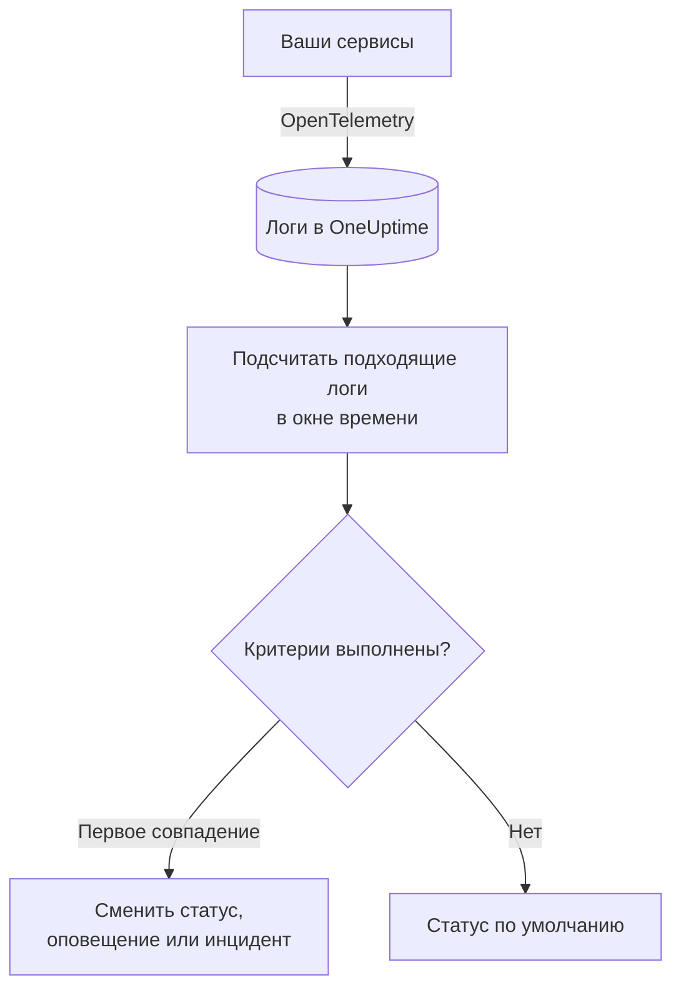
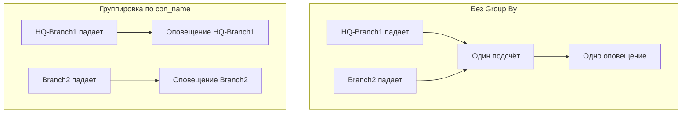

# Мониторинг журналов

Монитор логов считает за окно времени логи, которые ваши сервисы отправляют в OneUptime и которые соответствуют вашим фильтрам (текст, уровень важности, сервис, атрибуты). Когда число удовлетворяет вашим критериям, он меняет статус монитора, создаёт оповещение или объявляет инцидент. Используйте его, чтобы заметить всплеск ошибок, конкретное сообщение об ошибке или сервис, который перестал писать логи.

:::cards
- [Создание монитора](#создание-монитора-логов): Выберите, какие логи считать и когда оповещать.
- [Как он оценивается](#как-он-оценивается): Окно времени, подсчёт и цикл в одну минуту.
- [Критерии](#критерии): Пороги, обнаружение аномалий и значения по умолчанию.
- [Оповещения по группам](#оповещения-по-группам-group-by): Одно оповещение на туннель, пользователя или интерфейс.
:::

## Как это работает



Каждую минуту OneUptime подсчитывает логи, которые соответствуют фильтрам монитора и поступили в пределах его окна времени. Он сравнивает это число с критериями монитора сверху вниз, и первый совпавший критерий решает, что произойдёт. Если не совпал ни один, монитор возвращается к своему статусу по умолчанию.

## Перед началом

- Ваши сервисы отправляют логи в OneUptime через OpenTelemetry (или через другой источник логов, который принимает OneUptime). См. [OpenTelemetry](/docs/telemetry/open-telemetry).
- Чтобы фильтровать или группировать по значению внутри строки лога, например по имени туннеля или пользователя, сначала превратите его в атрибут с помощью [конвейера логов](/docs/telemetry/log-pipelines).

## Создание монитора логов

:::steps
### Начните новый монитор

Перейдите в **Мониторы** и нажмите **Создать монитор**.

### Выберите Logs

В разделе **Тип монитора** нажмите **Другие типы мониторов** и выберите **Журналы** в группе **Телеметрия** или введите `logs` в поле поиска. Введите **Имя** и нажмите **Далее**.

### Выберите, какие логи считать

В **Конфигурация монитора логов** задайте **Логи монитора, содержащие этот текст**, **Логи монитора за (время)** и **Уровень важности лога**. Фильтр, оставленный пустым, соответствует всем логам. **Предпросмотр логов** под фильтрами показывает логи, которым они соответствуют прямо сейчас.

### Сузьте выборку (необязательно)

Откройте **Дополнительные поля**, чтобы фильтровать по сервису телеметрии, сущности инфраструктуры или атрибуту. Чтобы получать одно оповещение на туннель, пользователя или интерфейс, а не одно на весь монитор, добавьте атрибут в **Group by Attributes** (см. [Оповещения по группам](#оповещения-по-группам-group-by)).

### Задайте критерии

Карточка **Критерии монитора** начинается с двух критериев: не в сети, с инцидентом, когда ни один лог не подходит; в сети, когда подходит хотя бы один. Измените их под то, о чём вы хотите получать оповещения (см. [Критерии](#критерии)).

### Создайте монитор

Нажмите **Создать монитор**. Монитор откроется на своей странице **Обзор**, и его первая оценка выполнится в течение минуты.
:::

## Что он запрашивает

| Поле | Чему соответствует | По умолчанию |
| --- | --- | --- |
| **Логи монитора, содержащие этот текст** | Логи, тело которых содержит этот текст, без учёта регистра. | Пусто: все логи |
| **Логи монитора за (время)** | Логи за период от последних 5 секунд до последних 24 часов. | **Последняя 1 минута** |
| **Уровень важности лога** | Логи с любым из выбранных уровней важности. | Пусто: все уровни |
| **Group by Attributes** | Не фильтр: считает отдельно каждую комбинацию значений этих атрибутов. | Пусто: один подсчёт |
| **Фильтровать по сервису телеметрии** (в **Дополнительные поля**) | Логи любого из выбранных сервисов. | Пусто: все сервисы |
| **Filter by Infrastructure Entity** (в **Дополнительные поля**) | Логи любого из выбранных хостов, подов, контейнеров и других сущностей. | Пусто: все сущности |
| **Фильтровать по атрибутам** (в **Дополнительные поля**) | Логи, атрибуты которых удовлетворяют всем условиям. У каждого условия свой оператор, например «равно» или «содержит». | Пусто: без условий |

Чтобы лог был учтён, должны совпасть все заданные вами фильтры.

### Уровень важности логов

Каждый лог хранится с одним из семи уровней важности. Для логов OpenTelemetry он берётся из числового уровня важности лога, поэтому выбирайте по уровню важности, а не по тексту, который напечатал ваш логгер:

| Уровень важности | Числовые уровни OpenTelemetry |
| --- | --- |
| **Трассировка** | 1–4 |
| **Debug** | 5–8 |
| **Information** | 9–12 |
| **Warning** | 13–16 |
| **Ошибка** | 17–20 |
| **Fatal** | 21–24 |
| **Не указано** | Всё остальное |

## Как он оценивается

- **Каждую минуту.** Монитор логов не проверяется зондами, поэтому у него нет интервала для настройки и нет страницы **Зонды и интервал**.
- **Одно число на оценку.** Монитор считает логи, которые соответствуют всем фильтрам и поступили в пределах **Логи монитора за (время)** до оценки. При **Последние 5 минут** каждая оценка смотрит на пять минут назад, поэтому окна последовательных оценок перекрываются.
- **Отсутствие логов — это число 0.** Сервис, который перестал писать логи, даёт 0, и именно это ищет критерий «не в сети» по умолчанию.
- **Простой самого OneUptime — это не тишина.** Пока окно времени содержит период, когда сам OneUptime не получал данные (перезапускался, обновлялся или догонял отставание), проверка ждёт: статус не меняется, и ни один инцидент или оповещение не открывается и не закрывается. См. [Когда OneUptime не получает данные](/docs/monitor/when-oneuptime-is-not-receiving).
- **Критерии сверху вниз.** Решает первый совпавший критерий, поэтому ставьте самый серьёзный первым. Сгруппированный монитор работает иначе: он проверяет все критерии для каждой группы (см. [Оценка критериев отличается](#оценка-критериев-отличается)).

Каждая смена статуса вместе с причиной записывается в **Хронология статуса** монитора.

## Критерии

У критериев монитора логов один **Тип фильтра**: **Log Count**, число логов, совпавших в окне. Выберите **Условие фильтра** и, для порогового условия, **Значение**.

| Условие фильтра | Совпадает, когда число логов… |
| --- | --- |
| **Greater Than** | выше значения |
| **Greater Than Or Equal To** | равно значению или выше |
| **Less Than** | ниже значения |
| **Less Than Or Equal To** | равно значению или ниже |
| **Equal To** | ровно равно значению |
| **Anomalously High** | выше ожидаемого диапазона для этого часа недели |
| **Anomalously Low** | ниже этого диапазона |
| **Anomalous** | вне этого диапазона в любую сторону |

У условий аномалий нет **Значение**. Выберите **Чувствительность** (Low, Medium — по умолчанию — или High) и **Окно базовой линии** в 14 (по умолчанию), 28, 60 или 90 дней. OneUptime переводит число в скорость в минуту и сравнивает её с тем же часом недели за это окно. Базовая линия охватывает только сервисы и уровни важности монитора: его текстовые фильтры и фильтры по атрибутам в неё не входят. Пока у этого часа недели недостаточно истории, критерий ещё обучается и не срабатывает.

Новый монитор логов начинает с этих критериев:

| Критерий | Фильтр | Действие |
| --- | --- | --- |
| Check if … is offline | **Log Count** **Equal To** `0` | Переводит монитор в состояние «не в сети» и объявляет инцидент, который устраняется автоматически |
| Check if … is online | **Log Count** **Greater Than** `0` | Переводит монитор в состояние «в сети» |

> [!TIP]
> Чтобы получать оповещения об ошибках, а не о тишине, установите **Уровень важности лога** в **Ошибка** и измените критерий «не в сети» на **Log Count** **Greater Than** число ошибок, которое вы допускаете в окне.

## Разобранный пример: всплеск ошибок

Вам нужен инцидент, когда сервис оформления заказов пишет больше 50 ошибок за пять минут:

- **Уровень важности лога**: **Ошибка**
- **Логи монитора за (время)**: **Последние 5 минут**
- **Фильтровать по сервису телеметрии**: `checkout`
- Критерий 1: **Log Count** **Greater Than** `50`: перевести монитор в состояние «не в сети» и объявить инцидент
- Критерий 2: **Log Count** **Less Than Or Equal To** `50`: перевести монитор в состояние «в сети»

Четыре последовательные оценки:

| Время | Логов ошибок за последние 5 минут | Совпавший критерий | Что происходит |
| --- | --- | --- | --- |
| 10:00 | 12 | 2 | Монитор в сети. |
| 10:01 | 64 | 1 | Монитор переходит в состояние «не в сети», и объявляется инцидент. |
| 10:02 | 81 | 1 | Остаётся не в сети. Инцидент уже открыт, поэтому второй не объявляется. |
| 10:06 | 9 | 2 | Монитор снова в сети, и инцидент устраняется сам, потому что включено **Автоустранение инцидента**. |

Поскольку окна перекрываются, один всплеск ошибок держит число высоким ещё до пяти минут после его окончания. Для монитора, который должен восстанавливаться быстрее, используйте более короткое окно.

## Оповещения по группам (Group By)

**Group by Attributes** разбивает подсчёт монитора логов на отдельный подсчёт для каждой уникальной комбинации значений атрибутов (по одному на IPsec-туннель, на VPN-пользователя, на интерфейс межсетевого экрана) и оценивает критерии для каждой группы отдельно. Это аналог [Group By](/docs/monitor/metrics-monitor#оповещения-по-сериям-group-by) монитора метрик для логов.

### Одно оповещение на группу

Без Group By монитор, который следит за завершёнными IPsec-туннелями, — это один общий подсчёт на весь монитор, и он поднимает **одно оповещение на весь монитор**. Пока это оповещение открыто, падение второго туннеля ничего нового не даёт: монитор уже оповещает.

С Group By по имени туннеля завершение туннеля `HQ-Branch1` открывает собственное оповещение, а завершение туннеля `Branch2` через десять минут открывает рядом **второе, отдельное оповещение**.



### Независимое устранение

Оповещение или инцидент каждой группы устраняется отдельно. Как только группа перестаёт удовлетворять критериям (`HQ-Branch1` больше не пишет завершений в пределах окна времени), её оповещение устраняется, а оповещение `Branch2` остаётся открытым, пока не прекратится и `Branch2`. Восстановление одной группы никогда не закрывает оповещение другой.

Монитор логов видит события, а не состояния: оповещение группы устраняется, как только эта группа в течение целого окна времени не записала ничего, что удовлетворяет критериям, независимо от того, поднялся туннель снова или нет.

### Пример: одно оповещение на IPsec-туннель Sophos

Здесь предполагается, что строки syslog межсетевого экрана разбиваются на атрибуты [парсером Key=Value](/docs/telemetry/log-pipelines#keyvalue-parser) без целевого префикса, так что имя туннеля — это атрибут `con_name`:

```text
log_component="IPSec" con_name="HQ-Branch1" status="Terminated" message="IPSec Connection HQ-Branch1 between 10.171.4.117 and 10.171.4.118 for Child HQ-Branch1 terminated."
```

:::steps
1. Создайте монитор типа **Журналы**.
2. Установите **Логи монитора, содержащие этот текст** в `terminated`, а **Логи монитора за (время)** в **Последние 5 минут**.
3. В **Дополнительные поля** добавьте фильтр по атрибуту `log_component` = `IPSec`.
4. В **Group by Attributes** добавьте `con_name`.
5. Добавьте критерий с фильтром **Log Count** **Greater Than** `0`, который создаёт оповещение или инцидент с заголовком `IPsec tunnel {{con_name}} terminated`.
:::

Теперь каждый туннель, записавший завершение, получает собственное оповещение (`IPsec tunnel HQ-Branch1 terminated`, `IPsec tunnel Branch2 terminated`), и каждое устраняется отдельно.

### Значения группы в заголовках и описаниях

Значение каждого атрибута Group By — это [переменная шаблона](/docs/monitor/incident-alert-templating) в заголовке, описании и заметках по устранению оповещения или инцидента, так же как метки серии метрики: группировка по `con_name` даёт вам `{{con_name}}`. Ключ с точками читается как путь, поэтому `sophos.con_name` — это `{{sophos.con_name}}`. Если заголовок ещё не называет группу, группа добавляется к нему (`IPsec tunnel terminated - Con Name: HQ-Branch1`), а `{{seriesResourceSuffix}}` и `{{seriesResourceSummary}}` работают так же, как в мониторах метрик.

### Как считаются группы

- До 10 атрибутов. Каждая уникальная комбинация их значений — это группа.
- Лог, у которого нет атрибута Group By, учитывается с **пустым значением** для него, поэтому логи без атрибута образуют собственную группу, оповещение которой не называет для него никакого значения. Если все оповещения приходят без значения группы, проверьте ключ атрибута: конвейер логов с целевым префиксом сохраняет `con_name` как `sophos.con_name`.
- Значения группы длиннее 256 символов обрезаются до 256.
- За одну проверку оценивается не более **100 групп**: 100 групп с наибольшим числом логов. Если совпадает больше групп, остальные в этой проверке пропускаются и записывается предупреждение; сузьте фильтры монитора, чтобы охватить их.

### Оценка критериев отличается

- **Оцениваются все критерии**, как в сгруппированном мониторе метрик, поэтому разные группы могут одновременно удовлетворять разным критериям. Группа, удовлетворяющая двум критериям, всё равно получает одно оповещение — от первого; поэтому упорядочивайте критерии от самого серьёзного к наименее серьёзному.
- **Группа существует, только если она что-то записала в окне времени.** Поэтому критерии **Equal To 0** и **Less Than** срабатывают только для групп, которые записали хотя бы раз; чтобы получать оповещение, когда логи перестают приходить совсем, используйте монитор без Group By.
- **Обнаружение аномалий** (**Anomalously High**, **Anomalously Low**, **Anomalous**) не оценивается по группам (его базовая линия охватывает весь монитор), поэтому в сгруппированном мониторе эти фильтры никогда не совпадают.
- Статус монитора следует первому критерию, которому удовлетворяет какая-либо группа. Если ни одна группа не удовлетворяет ни одному критерию, монитор возвращается к своему статусу по умолчанию.

## Устранение неполадок

:::details Монитор не в сети, но мой сервис пишет логи
Число было 0, значит, фильтры не соответствуют ни одному логу, который отправляет сервис. Откройте страницу **Критерии** монитора (в разделе **Конфигурация**) и нажмите **Edit Monitoring Criteria**: **Предпросмотр логов** показывает, что фильтры выбирают прямо сейчас. Чаще всего причина в уровне важности, выбранном по тексту, который печатает логгер, а не по числовому уровню (см. [Уровень важности логов](#уровень-важности-логов)), в фильтре по сервису или атрибуту, который не совпадает, и в окне времени короче интервала между логами сервиса.
:::

:::details Был всплеск, но оповещения не было
Критерии проверяются сверху вниз, и решает первое совпадение. Широкий критерий выше ожидаемого, например **Log Count** **Greater Than** `0`, совпадает первым и останавливает остальные. Поставьте самый серьёзный критерий наверх.
:::

:::details Критерий аномалии никогда не срабатывает
Он ещё обучается: у часа недели, с которым он сравнивает, пока недостаточно истории. В мониторе с **Group by Attributes** условия аномалий никогда не совпадают; используйте там порог.
:::

:::details Оповещения групп приходят без значения группы
Логи без атрибута Group By учитываются с пустым значением. Проверьте точное имя ключа в обозревателе логов: конвейер логов с целевым префиксом сохраняет `con_name` как `sophos.con_name`.
:::

## Что дальше

:::cards
- [Конвейеры логов](/docs/telemetry/log-pipelines): Разбивайте строки логов на атрибуты для фильтрации и группировки.
- [Шаблоны инцидентов и оповещений](/docs/monitor/incident-alert-templating): Подставляйте значения групп и числа в заголовки и описания.
- [Мониторинг метрик](/docs/monitor/metrics-monitor): Оповещения по метрике, по хосту или по контейнеру.
- [Мониторинг трассировок](/docs/monitor/traces-monitor): Такие же оповещения о неудачных спанах.
:::
