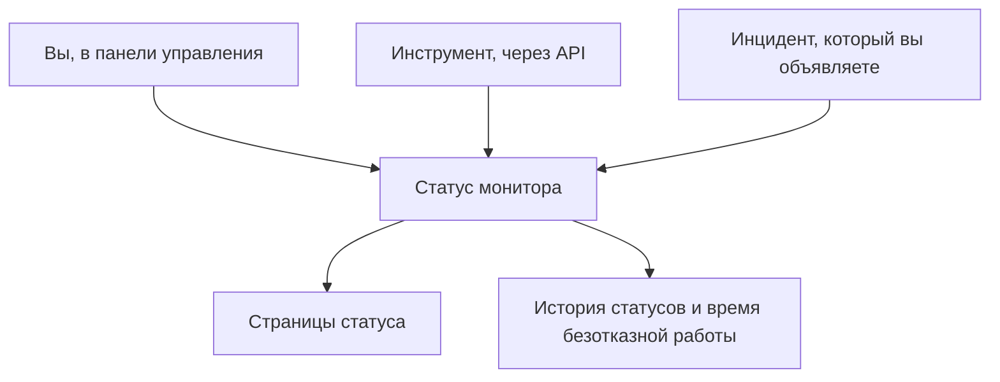

# Ручной мониторинг

У ручного монитора нет автоматических проверок: его статус — тот, который вы задаёте в панели управления или через API. Используйте его, чтобы показывать на страницах статуса и в инцидентах то, что OneUptime не может проверить сам, — зависимость от стороннего сервиса, физическую систему, бизнес-процесс.

:::cards
- [Создать монитор](#создание-ручного-монитора): Один шаг в панели управления.
- [Изменить его статус](#обновление-статуса): В панели управления или из ваших собственных инструментов через API.
- [Инциденты и оповещения](#инциденты-и-оповещения): Объявите инцидент и задайте статус за один шаг.
:::

## Когда использовать ручной монитор

| Сценарий | Описание |
| --- | --- |
| Сторонние сервисы | Отслеживайте статус внешних сервисов, от которых вы зависите, но которые не можете мониторить напрямую. |
| Физическая инфраструктура | Представляйте оборудование или физические системы без сетевого мониторинга. |
| Бизнес-процессы | Отслеживайте нетехнические процессы, которые влияют на статус сервиса. |
| Статус через API | Позвольте вашим собственным инструментам задавать статус через API OneUptime. |
| Заглушки на страницах статуса | Показывайте на странице статуса компоненты, которыми управляют вне OneUptime. |

Поставщику, который публикует страницу статуса, такой монитор не нужен: [монитор внешней страницы статуса](/docs/monitor/external-status-page-monitor) следит за этой страницей за вас.

## Как это работает

У ручного монитора нет интервала мониторинга, зондов и критериев. Его статус остаётся таким, каким вы его задали, пока его не изменят вы, инструмент через API или объявленный вами инцидент, — и новый статус показывается везде, где показывается монитор.



Каждое изменение — это запись в **Хронология статуса** монитора, поэтому его время безотказной работы и история статусов сохраняются, как у любого другого монитора. Ручной монитор не является активным монитором, поэтому в OneUptime Cloud он ничего не добавляет к вашему счёту.

## Создание ручного монитора

:::steps
### Начните новый монитор

Перейдите в **Мониторы** и нажмите **Создать монитор**.

### Выберите Manual

В **Тип монитора** нажмите **Другие типы мониторов** и выберите **Manual** в разделе **Другое**.

### Назовите и создайте его

Введите **Имя** — и, если хотите, **Описание** в **Дополнительные поля**, — затем нажмите **Создать монитор**. Ручному монитору больше ничего не нужно, поэтому он создаётся с этого первого шага.
:::

## Обновление статуса

### В панели управления

:::steps
1. Откройте монитор и нажмите **Хронология статуса** в его боковом меню.
2. Нажмите **Создать: Монитор Статус Событие**.
3. Выберите **Статус монитора**. **Начинается** — сейчас; укажите более раннее время, если изменение произошло раньше.
4. Нажмите **Создать: Монитор Статус Событие**. Новый статус сразу появляется на мониторе и на каждой странице статуса, где он указан.
:::

### Через API

Отправьте новый статус как событие статуса монитора с [API-ключом](/docs/api-reference/api-reference) вашего проекта в заголовке `ApiKey`:

```bash
curl -X POST https://oneuptime.com/api/monitor-status-timeline \
  -H "ApiKey: $ONEUPTIME_API_KEY" \
  -H "Content-Type: application/json" \
  -d '{"data": {"monitorId": "<monitor id>", "monitorStatusId": "<monitor status id>"}}'
```

- `monitorId` — ID монитора: нажмите на строку **ID** на его странице, чтобы скопировать его.
- `monitorStatusId` — статус, который нужно задать: в **Мониторы → Настройки → Статус монитора** выберите **Показать ID** в строке этого статуса.
- `startsAt` необязателен. Если его не указать, изменение начинается сейчас.
- В самостоятельно размещённой установке отправляйте запрос на свой хост вместо `oneuptime.com`.

Отправка статуса, который у монитора уже есть, отклоняется с `Monitor Status cannot be same as previous status.` и ничего не записывает, поэтому инструмент, который отчитывается при каждом запуске, может игнорировать этот ответ.

## Инциденты и оповещения

Ручной монитор выбирается так же, как любой другой, везде, где выбираются мониторы:

- Объявите инцидент и выберите монитор в **Мониторы**. С **Изменить статус монитора на** объявление инцидента также задаёт статус монитора, а его разрешение возвращает монитор в рабочее состояние, если на нём не остаётся другого открытого инцидента. См. [Объявление инцидента](/docs/incidents/declaring-incidents#шаг-2-затронутые-ресурсы).
- Создайте по нему оповещение — для проблемы, которой ваша команда должна заняться, не сообщая клиентам.
- Добавьте его на страницу статуса, чтобы показывать клиентам зависимость, за которой вы следите вручную.

## Дальнейшие шаги

:::cards
- [Создание монитора](/docs/monitor/create-monitor): Типы мониторов, которые проверяют всё за вас.
- [Мониторинг внешней страницы статуса](/docs/monitor/external-status-page-monitor): Автоматически следите за страницей статуса поставщика вместо этого.
- [Обзор страниц статуса](/docs/status-pages/index): Показывайте статус монитора своим клиентам.
:::
