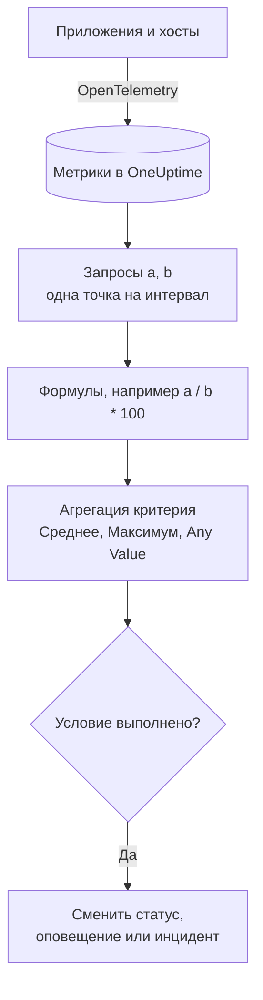

# Мониторинг метрик

Монитор метрик запрашивает метрики, которые ваши приложения и инфраструктура отправляют в OneUptime, объединяет их формулами, когда нужно отношение или сумма, и сравнивает результат с вашими критериями за скользящий диапазон времени. Используйте его для частоты запросов, доли ошибок, глубины очередей, CPU, памяти и диска (любого числового ряда), с одним оповещением на хост или контейнер, если вы его сгруппируете.

:::cards
- [Создание монитора](#создание-монитора-метрик): Запросы, формулы, диапазон времени и критерии.
- [Как он оценивается](#как-он-оценивается): Точки данных, формулы и агрегация критериев.
- [Разобранный пример](#разобранный-пример-растущая-очередь): Одни и те же данные при каждой агрегации.
- [Оповещения по сериям](#оповещения-по-сериям-group-by): Одно оповещение на хост, контейнер или точку монтирования.
:::

## Как это работает

Каждую минуту OneUptime выполняет каждый запрос метрик монитора за его диапазон времени. Запрос возвращает одну точку данных на временной интервал, а формулы объединяют запросы интервал за интервалом. Затем каждый критерий сводит точки данных проверяемого запроса или формулы (к их среднему, их максимуму или к проверке каждой точки) и сравнивает результат со своим порогом.

## Перед началом

- Ваши приложения или инфраструктура отправляют метрики в OneUptime через OpenTelemetry. См. [OpenTelemetry](/docs/telemetry/open-telemetry).
- Узнайте имя метрики и атрибуты, по которым хотите фильтровать или группировать. Списки **Метрика** и **Group by** предлагают только имена и атрибуты, которые OneUptime уже получил.

## Создание монитора метрик

:::steps
### Начните новый монитор

Перейдите в **Мониторы** и нажмите **Создать монитор**.

### Выберите Metrics

В разделе **Тип монитора** нажмите **Другие типы мониторов** и выберите **Метрики** в группе **Телеметрия** или введите `metrics` в поле поиска. Введите **Имя** и нажмите **Далее**.

### Выберите диапазон времени

В **Конфигурация монитора метрик** выберите **Диапазон времени**: насколько далеко назад смотрит каждая оценка. Он начинается с **Past 1 Minute**.

### Добавьте запросы метрик

В **Выберите метрики** выберите **Метрика** и способ её агрегации в **Aggregate by**. Откройте **Filters & grouping**, чтобы фильтровать по атрибутам или группировать через **Group by**. Нажмите **Добавить метрику** для ещё одного запроса или **Добавить формулу**, чтобы объединить их. График под запросами показывает предпросмотр диапазона времени, чтобы вы видели значения, которые будут проверять критерии.

### Задайте критерии

В **Критерии монитора** каждый критерий выбирает проверяемую **Метрика** (запрос или формулу), свою **Агрегация**, **Условие** и **Threshold**. Критерии, с которыми начинается новый монитор, описаны в разделе [Критерии](#критерии).

### Создайте монитор

Нажмите **Создать монитор**. Монитор откроется на своей странице **Обзор**, и его первая оценка выполнится в течение минуты.
:::

## Что он запрашивает

### Запросы метрик

| Поле | Что делает | По умолчанию |
| --- | --- | --- |
| **Метрика** | Запрашиваемая метрика. | Обязательно |
| **Aggregate by** | Как значения в каждом временном интервале объединяются в одну точку данных: Сред., Сумма, Min, Max, Количество или процентиль (P50, P75, P90, P95 или P99). | Сред. |
| **Filter by attributes** (в **Filters & grouping**) | Только серии, атрибуты которых удовлетворяют этим условиям. | Без фильтра |
| **Group by** (в **Filters & grouping**) | Одна серия на каждое уникальное значение этих атрибутов (см. [Оповещения по сериям](#оповещения-по-сериям-group-by)). | Одна серия |

Каждый запрос и каждая формула получают переменную (`a`, `b`, `c` и так далее) в порядке их добавления.

### Формулы

Формула объединяет переменные запросов с помощью `+`, `-`, `*`, `/`, `%`, `^` и скобок, интервал за интервалом. Переменные можно писать с `$` в начале или без него:

- `a / b * 100`: доля `a` от `b` в процентах
- `a + b`: сумма двух метрик
- `a - b`: разница между ними

### Скользящее окно времени

**Диапазон времени** задаёт, насколько далеко назад смотрит каждая оценка: **Past 1 Minute**, **Past 5 Minutes**, **Past 10 Minutes**, **Past 15 Minutes**, **Past 30 Minutes**, **Past 1 Hour**, **Past 2 Hours**, **Past 3 Hours**, **Past 6 Hours**, **Past 12 Hours**, **Past 1 Day**, **Past 2 Days**, **Past 3 Days**, **Past 7 Days**, **Past 14 Days**, **Past 30 Days**, **Past 60 Days**, **Past 90 Days**, **Past 180 Days** или **Past 365 Days**.

Чем длиннее диапазон, тем шире каждый временной интервал, так что одна точка данных охватывает больше времени:

| Диапазон времени | Одна точка данных на |
| --- | --- |
| От Past 1 Minute до Past 3 Hours | минуту |
| Past 6 Hours, Past 12 Hours | 5 минут |
| Past 1 Day | 15 минут |
| Past 2 Days, Past 3 Days | 30 минут |
| Past 7 Days | час |
| Past 14 Days, Past 30 Days | день |
| От Past 60 Days до Past 180 Days | неделю |
| Past 365 Days | месяц |

## Как он оценивается

- **Каждую минуту.** Монитор метрик не проверяется зондами, поэтому у него нет интервала для настройки и нет страницы **Зонды и интервал**.
- **Сначала запросы, потом формулы.** Каждый запрос возвращает одну точку данных на каждый временной интервал диапазона, используя свой **Aggregate by**. Формулы вычисляются для каждого интервала из точек данных запросов.
- **Затем агрегация критерия.** Каждый критерий сводит точки данных своей **Метрика** к тому, что он сравнивает с порогом:

| Агрегация | Условие проверяется по… |
| --- | --- |
| Среднее | среднему точек данных |
| Сумма | сумме точек данных |
| Maximum Value | наибольшей точке данных |
| Minimum Value | наименьшей точке данных |
| All Values | каждой точке данных: условию должны удовлетворять все |
| Any Value | каждой точке данных: достаточно, чтобы условию удовлетворяла одна |

- **Критерии сверху вниз.** В мониторе без Group By решает первый совпавший критерий, поэтому ставьте самый серьёзный первым. Сгруппированный монитор проверяет все критерии для каждой серии (см. [Оценка критериев отличается](#оценка-критериев-отличается)).
- **Отсутствие данных — это не ноль.** Когда запрос не возвращает точек данных в диапазоне времени, критерий делает то, что указано в его настройке **Если нет данных** в разделе **Дополнительные поля**: **Ignore** (по умолчанию: критерий не совпадает), **Treat As Zero** или **Триггер**.
- **Простой самого OneUptime — это не тишина.** Пока диапазон времени содержит период, когда сам OneUptime не получал данные (перезапускался, обновлялся или догонял отставание), проверка ждёт: статус не меняется, и ни один инцидент или оповещение не открывается и не закрывается, что бы ни было указано в **Если нет данных**. См. [Когда OneUptime не получает данные](/docs/monitor/when-oneuptime-is-not-receiving).

## Критерии

Эти мониторы всегда оценивают **Metric Value**: агрегированное значение настроенного запроса метрик или формулы. В форме критерия нет выбора типа фильтра; она показывает **Метрика**, **Агрегация**, **Условие** и **Threshold**. Если у метрики есть единица измерения, выберите единицу порога рядом с ним.

| Условие | Совпадает, когда значение… |
| --- | --- |
| **Greater Than** | выше порога |
| **Greater Than Or Equal To** | равно порогу или выше |
| **Less Than** | ниже порога |
| **Less Than Or Equal To** | равно порогу или ниже |
| **Equal To** | ровно равно порогу |
| **Anomalously High** | выше ожидаемого диапазона для этого часа недели |
| **Anomalously Low** | ниже этого диапазона |
| **Anomalous** | вне этого диапазона в любую сторону |

У условий аномалий нет порога. Вместо него форма показывает **Чувствительность** (Low, Medium — по умолчанию — или High) и **Окно базовой линии** (14 дней по умолчанию, 28, 60 или 90) и сравнивает каждую точку данных с базовой линией того же часа недели, построенной по этому окну. Пока у этого часа недели недостаточно истории, критерий ещё обучается и не создаёт оповещений.

Новый монитор метрик начинает с двух критериев для своего первого запроса, оба с агрегацией **Any Value**:

| Критерий | Условие | Действие |
| --- | --- | --- |
| Check if … is offline | **Equal To** `0` | Переводит монитор в состояние «не в сети» и объявляет инцидент, который устраняется автоматически |
| Check if … is online | **Greater Than** `0` | Переводит монитор в состояние «в сети» |

> [!NOTE]
> Критерий «не в сети» срабатывает на переданное значение 0, а не на тишину. Чтобы получать оповещение, когда метрика перестаёт приходить, установите её **Если нет данных** в **Триггер**.

## Разобранный пример: растущая очередь

Вам нужен инцидент, когда очередь оформления заказов остаётся глубокой. Запрос `a` — это gauge `checkout.queue.depth` с **Aggregate by** Max, а **Диапазон времени** — **Past 5 Minutes**. Одна оценка видит эти пять минутных точек данных:

| Минута | 10:01 | 10:02 | 10:03 | 10:04 | 10:05 |
| --- | --- | --- | --- | --- | --- |
| `a` | 640 | 980 | 1 500 | 1 620 | 1 100 |

Критерий с **Метрика** `a`, **Условие** **Greater Than** и **Threshold** `1000` даёт разный ответ для каждой **Агрегация**:

| Агрегация | Сравнивается с 1 000 | Совпадает? |
| --- | --- | --- |
| Среднее | 1 168 | Да |
| Сумма | 5 840 | Да |
| Maximum Value | 1 620 | Да |
| Minimum Value | 640 | Нет |
| All Values | 640, 980, 1 500, 1 620, 1 100 | Нет: две точки не выше 1 000 |
| Any Value | 640, 980, 1 500, 1 620, 1 100 | Да: 1 500 выше |

**Среднее** оповещает о затяжном отставании и игнорирует одну глубокую минуту; **All Values** ждёт, пока каждая минута диапазона станет глубокой; **Any Value** оповещает на первой глубокой минуте.

## Оповещения по сериям (Group By)

**Group by** в запросе метрик разбивает этот запрос на одну серию на каждое уникальное значение атрибута (одну на хост, одну на контейнер, одну на точку монтирования), и монитор с заданным Group By оценивает каждую серию независимо. Эта единственная настройка — разница между «парк нездоров» и «нездоров `prod-db-01`».

### Одно оповещение на группу

С Group By по `host.name` монитор использования диска, следящий за пятьюдесятью хостами, поднимает **одно оповещение (или инцидент) на каждый хост выше порога**. Заполнение хоста A открывает собственное оповещение; заполнение хоста B через десять минут открывает рядом второе, отдельное оповещение.

Без Group By тот же монитор — это один скаляр: запрос сводит все хосты в одно число, и монитор поднимает **одно оповещение на весь монитор**. Пока это оповещение открыто, второй хост выше порога ничего не даёт (монитор уже оповещает, так что поднимать нечего), и дежурный инженер так и не узнаёт о хосте B. **Настройка Group By — это способ получать оповещения по хостам.** Если вас должны вызывать по хосту, контейнеру или точке монтирования, задайте её.

### Независимое устранение

Каждое оповещение группы следит за своей группой. Когда хост A снова опускается ниже порога, его оповещение устраняется само, а оповещение хоста B остаётся открытым, пока хост B не восстановится. Восстановление одной группы никогда не закрывает оповещение другой.

### Оценка критериев отличается

- **Сгруппированные мониторы оценивают все критерии.** Поэтому уровни серьёзности могут срабатывать для разных групп одновременно: при «Critical: больше 95» над «Warning: больше 80» хост на 96 % открывает критическое оповещение, а хост на 85 % — предупреждение в той же проверке. Хост, превысивший оба уровня, всё равно получает ровно одно оповещение — от первого совпавшего критерия, поэтому **упорядочивайте критерии от самого серьёзного**.
- **Несгруппированные мониторы останавливаются на первом совпавшем критерии.** Срабатывает только этот критерий — ещё одна причина ставить критерий оповещения выше «здорового»: широкий «здоровый» критерий, поставленный первым, совпадает почти при каждой проверке и не даёт критерию оповещения под ним вообще оцениваться.

| Хост | Занято на диске | Critical (> 95) | Warning (> 80) | Поднятое оповещение |
| --- | --- | --- | --- | --- |
| `prod-db-01` | 96 % | Да | Да | Critical |
| `prod-db-02` | 85 % | Нет | Да | Warning |
| `prod-db-03` | 40 % | Нет | Нет | Нет |

### Выбор атрибута для группировки

Группируйте по атрибуту, который действительно обозначает отдельную вещь, из-за которой вы бы кого-то вызвали: по атрибуту хоста для метрики хостов всего парка, по атрибуту контейнера или пода для метрики контейнеров, по атрибуту точки монтирования или устройства для метрики файловой системы или дискового ввода-вывода, по атрибуту интерфейса для сетевой метрики. Список **Group by** заполняется атрибутами, которые ваш коллектор действительно отправляет, поэтому выбирайте из списка, а не вводите ключ вручную.

Не группируйте метрику, которая уже является одним скаляром для всей системы (флаг лидера всего кластера, отставание планировщика или CPU одного хоста в мониторе одного хоста). Группировка таких метрик даёт ровно одну серию и меняет только заголовки оповещений.

Значения атрибута группировки также доступны как [переменные шаблона](/docs/monitor/incident-alert-templating) в заголовке, описании и заметках по устранению оповещения или инцидента: группировка по `host.name` позволяет заголовку звучать как `Disk almost full on {{host.name}}`.

## Устранение неполадок

:::details График показывает превышение, но монитор не оповестил
Сначала проверьте **Агрегация** критерия: **All Values** совпадает, только когда каждая точка данных в диапазоне превышает порог, а **Среднее** сглаживает короткий пик. Затем проверьте, что **Метрика** критерия — это тот запрос или та формула, которые вы имеете в виду (`a` — не формула `c`), и что порог указан в той единице, о которой вы думаете.
:::

:::details Метрика перестала приходить, и ничего не произошло
Диапазон времени без точек данных — это не значение 0. При **Если нет данных** со значением по умолчанию, **Ignore**, критерий не совпадает. Установите его в **Триггер** в разделе **Дополнительные поля** критерия, чтобы получать оповещение о тишине.
:::

:::details Я получаю одно оповещение на весь парк
У запроса нет **Group by**, поэтому все хосты сводятся в одно число. Сгруппируйте запрос по атрибуту хоста, контейнера или точки монтирования (см. [Оповещения по сериям](#оповещения-по-сериям-group-by)).
:::

:::details Критерий аномалии никогда не срабатывает
Он ещё обучается: у часа недели, с которым он сравнивает, пока недостаточно истории в пределах **Окно базовой линии**.
:::

## Что дальше

:::cards
- [Шаблоны инцидентов и оповещений](/docs/monitor/incident-alert-templating): Подставляйте хост и значение в заголовки оповещений.
- [Мониторинг журналов](/docs/monitor/logs-monitor): Оповещения об объёме и содержимом логов, по группам.
- [Мониторинг хостов](/docs/monitor/host-monitor): Готовые проверки CPU, памяти и диска для ваших хостов.
- [OpenTelemetry](/docs/telemetry/open-telemetry): Отправляйте метрики в OneUptime.
:::
