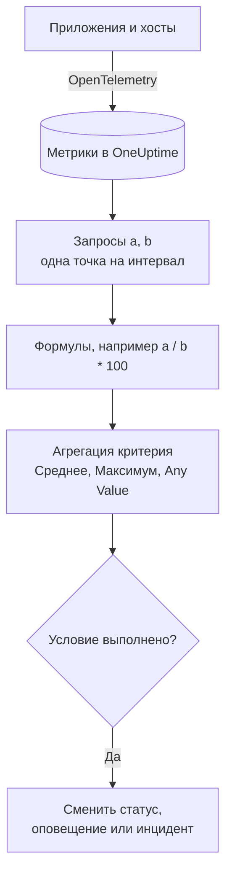

# Мониторинг метрик

Монитор метрик запрашивает метрики, которые ваши приложения и инфраструктура отправляют в OneUptime, объединяет их формулами, когда нужно отношение или сумма, и сравнивает результат с вашими критериями за скользящий диапазон времени. Используйте его для частоты запросов, доли ошибок, глубины очередей, CPU, памяти и диска (любого числового ряда), с одним оповещением на хост или контейнер, если вы его сгруппируете.

:::cards
- [Создание монитора](#создание-монитора-метрик): Запросы, формулы, диапазон времени и критерии.
- [Как он оценивается](#как-он-оценивается): Точки данных, формулы и агрегация критериев.
- [Разобранный пример](#разобранный-пример-растущая-очередь): Одни и те же данные при каждой агрегации.
- [Оповещения по сериям](#оповещения-по-сериям-group-by): Одно оповещение на хост, контейнер или точку монтирования.
:::

## Как это работает

```mermaid title="От запросов метрик к статусу, каждую минуту"
flowchart TB
    Src["Приложения и хосты"] -->|OpenTelemetry| Store[("Метрики в OneUptime")]
    Store --> Query["Запросы a, b<br/>одна точка на интервал"]
    Query --> Formula["Формулы, например a / b * 100"]
    Formula --> Reduce["Агрегация критерия<br/>Среднее, Максимум, Any Value"]
    Reduce --> Check{"Условие выполнено?"}
    Check -->|Да| Act["Сменить статус,<br/>оповещение или инцидент"]
```

Каждую минуту OneUptime выполняет каждый запрос метрик монитора за его диапазон времени. Запрос возвращает одну точку данных на временной интервал, а формулы объединяют запросы интервал за интервалом. Затем каждый критерий сводит точки данных проверяемого запроса или формулы (к их среднему, их максимуму или к проверке каждой точки) и сравнивает результат со своим порогом.

## Перед началом

- Ваши приложения или инфраструктура отправляют метрики в OneUptime через OpenTelemetry. См. [OpenTelemetry](/docs/telemetry/open-telemetry).
- Узнайте имя метрики и атрибуты, по которым хотите фильтровать или группировать. Списки **Метрика** и **Группировать по** предлагают только имена и атрибуты, которые OneUptime уже получил.

## Создание монитора метрик

:::steps
### Начните новый монитор

Перейдите в **Мониторы** и нажмите **Создать монитор**. Или постройте в обозревателе метрик график, за которым хотите следить, и нажмите **Создать монитор из этого представления**: новый монитор начинает с его запросов.

### Выберите Metrics

В разделе **Тип монитора** нажмите **Другие типы мониторов** и выберите **Метрики** в группе **Телеметрия** или введите `metrics` в поле поиска. Введите **Имя** и нажмите **Далее**.

### Добавьте запросы метрик

В разделе **Отслеживаемая метрика** выберите **Метрика** и способ её агрегации в **Aggregate by**. Откройте **Filters & grouping**, чтобы фильтровать по атрибутам или группировать через **Группировать по**. Нажмите **Добавить метрику** для ещё одного запроса или **Добавить формулу**, чтобы объединить их. График под запросами показывает последние часы, а значение из правила — красной линией, чтобы вы видели значения, которые будет проверять правило.

### Укажите, когда оповещать

В разделе **Когда оповещать** выберите в **Как измерять** способ измерения метрики, затем **Временное окно**, **Условие** и **Значение**. Когда у шага больше одного запроса или формулы, выберите также **Метрика**, которую читает правило. Предложение под ними пересказывает правило простыми словами.

### Выберите, что произойдёт

В разделе **Что произойдёт** выберите **Создать оповещение**, **Объявить инцидент** или **Оба** и задайте заголовок и серьёзность. Пока правило совпадает, монитор показывает статус, указанный в **Дополнительные поля**; когда оно перестаёт совпадать, монитор возвращается к статусу по умолчанию, а оповещение или инцидент устраняется сам.

### Создайте монитор

Нажмите **Создать монитор**. Монитор откроется на своей странице **Обзор**, и его первая оценка выполнится в течение минуты.
:::

## Что он запрашивает

### Запросы метрик

| Поле | Что делает | По умолчанию |
| --- | --- | --- |
| **Метрика** | Запрашиваемая метрика. | Обязательно |
| **Aggregate by** | Как значения в каждом временном интервале объединяются в одну точку данных: Сред., Сумма, Min, Max, Количество или процентиль (P50, P75, P90, P95 или P99). | Сред. |
| **Filter by attributes** (в **Filters & grouping**) | Только серии, атрибуты которых удовлетворяют этим условиям. | Без фильтра |
| **Группировать по** (в **Filters & grouping**) | Одна серия на каждое уникальное значение этих атрибутов (см. [Оповещения по сериям](#оповещения-по-сериям-group-by)). | Одна серия |

Каждый запрос и каждая формула получают переменную (`a`, `b`, `c` и так далее) в порядке их добавления.

### Формулы

Формула объединяет переменные запросов с помощью `+`, `-`, `*`, `/`, `%`, `^` и скобок, интервал за интервалом. Переменные можно писать с `$` в начале или без него:

- `a / b * 100`: доля `a` от `b` в процентах
- `a + b`: сумма двух метрик
- `a - b`: разница между ними

### Скользящее окно времени

**Временное окно** в **Когда оповещать** задаёт, насколько далеко назад смотрит каждая оценка: **Последняя 1 минута**, **Последние 5 минут**, **Последние 10 минут**, **Последние 15 минут**, **Последние 30 минут**, **Последний 1 час**, **Последние 2 часа**, **Последние 3 часа**, **Последние 6 часов**, **Последние 12 часов**, **Последние 24 часа**, **Последние 2 дня**, **Последние 3 дня**, **Последние 7 дней**, **Последние 14 дней**, **Последние 30 дней**, **Последние 60 дней**, **Последние 90 дней**, **Последние 180 дней** или **Последние 365 дней**.

Чем длиннее окно, тем шире каждый временной интервал, так что одна точка данных охватывает больше времени:

| Временное окно | Одна точка данных на |
| --- | --- |
| От Последняя 1 минута до Последние 3 часа | минуту |
| Последние 6 часов, Последние 12 часов | 5 минут |
| Последние 24 часа | 15 минут |
| Последние 2 дня, Последние 3 дня | 30 минут |
| Последние 7 дней | час |
| Последние 14 дней, Последние 30 дней | день |
| От Последние 60 дней до Последние 180 дней | неделю |
| Последние 365 дней | месяц |

## Как он оценивается

- **Каждую минуту.** Монитор метрик не проверяется зондами, поэтому у него нет интервала для настройки и нет страницы **Зонды и интервал**.
- **Сначала запросы, потом формулы.** Каждый запрос возвращает одну точку данных на каждый временной интервал диапазона, используя свой **Aggregate by**. Формулы вычисляются для каждого интервала из точек данных запросов.
- **Затем мера правила.** Правило сводит точки данных своей метрики к тому, что оно сравнивает со своим значением, как указано в **Как измерять**:

| Как измерять | В собственных критериях | Условие проверяется по… |
| --- | --- | --- |
| Среднее значение | Среднее | среднему точек данных |
| Сумма | Сумма | сумме точек данных |
| Наибольшее значение | Maximum Value | наибольшей точке данных |
| Наименьшее значение | Minimum Value | наименьшей точке данных |
| Каждое значение (всё окно) | All Values | каждой точке данных: условию должны удовлетворять все, и они должны покрывать весь диапазон времени |
| Любое значение (в любой момент) | Any Value | каждой точке данных: достаточно, чтобы условию удовлетворяла одна |

- **Критерии сверху вниз.** В мониторе без Group By решает первый совпавший критерий, поэтому ставьте самый серьёзный первым. Сгруппированный монитор проверяет все критерии для каждой серии (см. [Оценка критериев отличается](#оценка-критериев-отличается)).
- **Отсутствие данных — это не ноль.** Когда запрос не возвращает точек данных в диапазоне времени, правило делает то, что указано в **Если данных нет** в разделе **Дополнительные поля** блока **Когда оповещать**: **Ничего** (по умолчанию: правило не совпадает), **Считать нулём** или **Оповещать, как при срабатывании**.
- **Каждому значению нужен весь диапазон времени.** Серия удовлетворяет правилу, измеряемому как **Каждое значение (всё окно)**, только когда её точки данных покрывают диапазон времени — от его начала до текущего момента, без пропуска больше чем в одну точку данных. Когда все данные монитора приходят с задержкой, как у CloudWatch, место текущего момента занимает самая новая точка данных. Хост, контейнер или deployment, который только начал присылать данные или какое-то время молчал, ждёт, пока у него не наберутся данные за весь диапазон времени, а журнал оценки показывает, сколько уже есть: `Waiting for 15 minutes of data: 2 of 15 minutes so far`. Серия, у которой оповещение или инцидент уже открыт, оценивается только по своим точкам данных, поэтому короткий пропуск в её данных его не устраняет. Если метрика присылает данные реже, чем длится диапазон времени, одна точка данных считается за весь диапазон, как только ей исполнится несколько минут; чтобы судить, как долго держится значение, сделайте диапазон времени не короче двух интервалов отправки.
- **Простой самого OneUptime — это не тишина.** Пока диапазон времени содержит период, когда сам OneUptime не получал данные (перезапускался, обновлялся или догонял отставание), проверка ждёт: статус не меняется, и ни один инцидент или оповещение не открывается и не закрывается, что бы ни было указано в **Если данных нет**. См. [Когда OneUptime не получает данные](/docs/monitor/when-oneuptime-is-not-receiving).

## Критерии

Эти мониторы всегда оценивают **Metric Value**: агрегированное значение настроенного запроса метрик или формулы. **Когда оповещать** задаёт один критерий из **Как измерять**, **Временное окно**, **Условие** и **Значение**. Если у метрики есть единица измерения, выберите единицу значения рядом с ним. Его **Условие** — **Выше**, **Не ниже**, **Ниже**, **Не выше**, **Ровно**, **Необычно высоко**, **Необычно низко** или **Необычно высоко или низко**. Для нескольких критериев, например уровней серьёзности, нажмите **Изменить как собственные критерии** в разделе **Дополнительные поля** блока **Что произойдёт**: у каждого критерия там есть **Метрика**, **Агрегация**, **Условие** и **Порог**.

| Условие | Совпадает, когда значение… |
| --- | --- |
| **Больше** | выше порога |
| **Больше или равно** | равно порогу или выше |
| **Меньше** | ниже порога |
| **Меньше или равно** | равно порогу или ниже |
| **Равно** | ровно равно порогу |
| **Anomalously High** | выше ожидаемого диапазона для этого часа недели |
| **Anomalously Low** | ниже этого диапазона |
| **Anomalous** | вне этого диапазона в любую сторону |
| **Нет данных** | отсутствует: за окно запрос ничего не прислал |
| **Есть данные** | присутствует: за окно запрос что-то прислал |

У условий аномалий нет порога. Вместо него **Когда оповещать** показывает **Чувствительность** (Низкий, Средний — по умолчанию — или Высокий), а собственные критерии — ещё и **Окно базовой линии** (14 дней по умолчанию, 28, 60 или 90), и каждая точка данных сравнивается с базовой линией того же часа недели, построенной по этому окну. Пока у этого часа недели недостаточно истории, критерий ещё обучается и не создаёт оповещений.

Монитор метрик, созданный в «Создать монитор», начинает с одного правила для своего первого запроса: **Среднее значение** за **Последние 5 минут**, **Выше** **Значение**, которое вы введёте, и **Создать оповещение**.

Новый монитор метрик, созданный через API или Terraform без критериев, начинает с двух критериев для своего первого запроса, оба с агрегацией **Any Value**:

| Критерий | Условие | Действие |
| --- | --- | --- |
| Check if … is offline | **Равно** `0` | Переводит монитор в состояние «не в сети» и объявляет инцидент, который устраняется автоматически |
| Check if … is online | **Больше** `0` | Переводит монитор в состояние «в сети» |

> [!NOTE]
> Критерий «не в сети» срабатывает на переданное значение 0, а не на тишину. Чтобы получать оповещение, когда метрика перестаёт приходить, установите её **Если нет данных** в **Триггер**.

## Разобранный пример: растущая очередь

Вам нужен инцидент, когда очередь оформления заказов остаётся глубокой. Запрос `a` — это gauge `checkout.queue.depth` с **Aggregate by** Max, а **Временное окно** — **Последние 5 минут**. Одна оценка видит эти пять минутных точек данных:

| Минута | 10:01 | 10:02 | 10:03 | 10:04 | 10:05 |
| --- | --- | --- | --- | --- | --- |
| `a` | 640 | 980 | 1 500 | 1 620 | 1 100 |

Правило **Выше** `1000` даёт разный ответ для каждого варианта **Как измерять**:

| Как измерять | Сравнивается с 1 000 | Совпадает? |
| --- | --- | --- |
| Среднее значение | 1 168 | Да |
| Сумма | 5 840 | Да |
| Наибольшее значение | 1 620 | Да |
| Наименьшее значение | 640 | Нет |
| Каждое значение (всё окно) | 640, 980, 1 500, 1 620, 1 100 | Нет: две точки не выше 1 000 |
| Любое значение (в любой момент) | 640, 980, 1 500, 1 620, 1 100 | Да: 1 500 выше |

**Среднее значение** оповещает о затяжном отставании и игнорирует одну глубокую минуту; **Каждое значение (всё окно)** ждёт, пока каждая минута диапазона станет глубокой; **Любое значение (в любой момент)** оповещает на первой глубокой минуте.

## Оповещения по сериям (Group By)

**Группировать по** в запросе метрик разбивает этот запрос на одну серию на каждое уникальное значение атрибута (одну на хост, одну на контейнер, одну на точку монтирования), и монитор с заданным Group By оценивает каждую серию независимо. Эта единственная настройка — разница между «парк нездоров» и «нездоров `prod-db-01`».

### Одно оповещение на группу

С Group By по `host.name` монитор использования диска, следящий за пятьюдесятью хостами, поднимает **одно оповещение (или инцидент) на каждый хост выше порога**. Заполнение хоста A открывает собственное оповещение; заполнение хоста B через десять минут открывает рядом второе, отдельное оповещение.

Без Group By тот же монитор — это один скаляр: запрос сводит все хосты в одно число, и монитор поднимает **одно оповещение на весь монитор**. Пока это оповещение открыто, второй хост выше порога ничего не даёт (монитор уже оповещает, так что поднимать нечего), и дежурный инженер так и не узнаёт о хосте B. **Настройка Group By — это способ получать оповещения по хостам.** Если вас должны вызывать по хосту, контейнеру или точке монтирования, задайте её.

### Независимое устранение

Каждое оповещение группы следит за своей группой. Когда хост A снова опускается ниже порога, его оповещение устраняется само, а оповещение хоста B остаётся открытым, пока хост B не восстановится. Восстановление одной группы никогда не закрывает оповещение другой.

### Оценка критериев отличается

- **Сгруппированные мониторы оценивают все критерии.** Поэтому уровни серьёзности могут срабатывать для разных групп одновременно: при «Critical: больше 95» над «Warning: больше 80» хост на 96 % открывает критическое оповещение, а хост на 85 % — предупреждение в той же проверке. Хост, превысивший оба уровня, всё равно получает ровно одно оповещение — от первого совпавшего критерия, поэтому **упорядочивайте критерии от самого серьёзного**.
- **Несгруппированные мониторы останавливаются на первом совпавшем критерии.** Срабатывает только этот критерий — ещё одна причина ставить критерий оповещения выше «здорового»: широкий «здоровый» критерий, поставленный первым, совпадает почти при каждой проверке и не даёт критерию оповещения под ним вообще оцениваться.

| Хост | Занято на диске | Critical (> 95) | Warning (> 80) | Поднятое оповещение |
| --- | --- | --- | --- | --- |
| `prod-db-01` | 96 % | Да | Да | Critical |
| `prod-db-02` | 85 % | Нет | Да | Warning |
| `prod-db-03` | 40 % | Нет | Нет | Нет |

### Выбор атрибута для группировки

Группируйте по атрибуту, который действительно обозначает отдельную вещь, из-за которой вы бы кого-то вызвали: по атрибуту хоста для метрики хостов всего парка, по атрибуту контейнера или пода для метрики контейнеров, по атрибуту точки монтирования или устройства для метрики файловой системы или дискового ввода-вывода, по атрибуту интерфейса для сетевой метрики. Список **Группировать по** заполняется атрибутами, которые ваш коллектор действительно отправляет, поэтому выбирайте из списка, а не вводите ключ вручную.

Не группируйте метрику, которая уже является одним скаляром для всей системы (флаг лидера всего кластера, отставание планировщика или CPU одного хоста в мониторе одного хоста). Группировка таких метрик даёт ровно одну серию и меняет только заголовки оповещений.

Значения атрибута группировки также доступны как [переменные шаблона](/docs/monitor/incident-alert-templating) в заголовке, описании и заметках по устранению оповещения или инцидента: группировка по `host.name` позволяет заголовку звучать как `Disk almost full on {{host.name}}`.

## Устранение неполадок

:::details График показывает превышение, но монитор не оповестил
Сначала проверьте **Как измерять**: **Каждое значение (всё окно)** совпадает, только когда каждая точка данных в диапазоне выходит за значение, а **Среднее значение** сглаживает короткий пик. **Каждое значение (всё окно)** также ждёт, пока у серии не будет данных за весь диапазон времени, поэтому хост или deployment, который только начал присылать данные, ещё не оценивается. Затем проверьте, что правило читает тот запрос или ту формулу, которые вы имеете в виду (`a` — это не формула `c`), и что **Значение** указано в той единице, которую вы думаете.
:::

:::details Метрика перестала приходить, и ничего не произошло
Диапазон времени без точек данных — это не значение 0. При **Если данных нет** со значением по умолчанию, **Ничего**, правило не совпадает. Установите его в **Оповещать, как при срабатывании** в разделе **Дополнительные поля** блока **Когда оповещать**, чтобы получать оповещение о тишине.
:::

:::details Я получаю одно оповещение на весь парк
У запроса нет **Группировать по**, поэтому все хосты сводятся в одно число. Сгруппируйте запрос по атрибуту хоста, контейнера или точки монтирования (см. [Оповещения по сериям](#оповещения-по-сериям-group-by)).
:::

:::details Критерий аномалии никогда не срабатывает
Он ещё обучается: у часа недели, с которым он сравнивает, пока недостаточно истории в пределах **Окно базовой линии**.
:::

## Что дальше

:::cards
- [Шаблоны инцидентов и оповещений](/docs/monitor/incident-alert-templating): Подставляйте хост и значение в заголовки оповещений.
- [Мониторинг журналов](/docs/monitor/logs-monitor): Оповещения об объёме и содержимом логов, по группам.
- [Мониторинг хостов](/docs/monitor/host-monitor): Готовые проверки CPU, памяти и диска для ваших хостов.
- [OpenTelemetry](/docs/telemetry/open-telemetry): Отправляйте метрики в OneUptime.
:::
