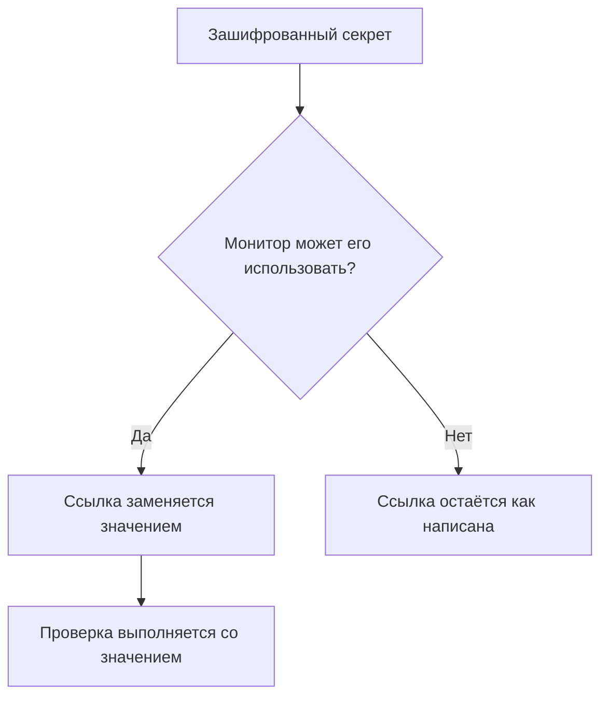

# Секреты мониторинга

Секреты мониторинга хранят пароли, API-ключи и токены, которые нужны вашим мониторам, вне самого монитора. Вы один раз сохраняете значение в зашифрованном виде, выбираете, какие мониторы могут его использовать, и ссылаетесь на него как `{{monitorSecrets.NAME}}` там, где оно нужно монитору.

:::cards
- [Добавить секрет](#добавление-секрета): Сохраните значение и выберите, кто может его использовать.
- [Выбрать доступ](#выбор-мониторов-которые-могут-использовать-секрет): Все мониторы, определённые мониторы или мониторы с метками.
- [Использовать секрет](#использование-секрета): Где работает `{{monitorSecrets.NAME}}`.
:::

## Как секреты попадают в монитор

Секрет хранится в зашифрованном виде и после сохранения больше никогда не показывается. Прежде чем передать монитор зонду, OneUptime заменяет каждую ссылку, которую монитор может использовать, расшифрованным значением; ссылка, которую монитор использовать не может, остаётся как написана.

Зонд, выполняющий проверку, получает значение, поэтому монитор, использующий секрет, должен работать на зондах, которым вы доверяете: собственных зондах OneUptime или [пользовательском зонде](/docs/probe/custom-probe), который вы запускаете сами.

## Перед началом

- **Тариф Growth или выше** в OneUptime Cloud. У самостоятельно размещённых установок тарифов нет.
- **Роль, которая может управлять секретами**: Project Owner, Project Admin или пользовательская роль с разрешением Create Monitor Secret.

## Работа с секретами

### Добавление секрета

:::steps
1. Перейдите в **Мониторы → Настройки → Секреты** и нажмите **Создать: Монитор Секрет**.
2. Введите **Имя** и **Значение секрета**. Имя — это то, на что вы ссылаетесь, например `ApiKey`. Оно может содержать только буквы, цифры, дефисы (`-`) и подчёркивания (`_`), и у двух секретов в одном проекте не может быть одинакового имени.
3. На шаге **Доступ** выберите, какие мониторы могут его использовать (см. следующий раздел), затем нажмите **Создать: Монитор Секрет**.
:::

> [!IMPORTANT]
> Секреты шифруются и надёжно хранятся. Значение секрета после сохранения больше никогда не показывается — ни в таблице, ни в форме редактирования, ни через API. Если вы потеряете значение, вам придётся получить его там, откуда оно взялось, и задать заново. Чтобы сменить секрет, используйте кнопку **Обновить значение секрета** в его строке; удалять и создавать его заново не нужно.

### Выбор мониторов, которые могут использовать секрет

У каждого секрета один из трёх вариантов доступа:

| Вариант | Какие мониторы могут использовать секрет | Для чего использовать |
| --- | --- | --- |
| **Все мониторы** | Каждый монитор в проекте, включая мониторы, которые вы создадите позже. | Учётные данные, общие для многих мониторов. |
| **Определённые мониторы** | Только выбранные вами мониторы. Это значение по умолчанию, и секреты, созданные до появления этих вариантов, работают именно так. | Учётные данные для одного или нескольких мониторов. |
| **Мониторы с метками** | Мониторы, у которых есть хотя бы одна из выбранных вами меток. Добавление одной из этих меток монитору даёт ему доступ, а удаление метки лишает доступа при следующем запуске монитора. | Учётные данные для группы мониторов, которая со временем меняется. |

Вариант можно изменить в любой момент кнопкой **Редактировать** в строке секрета. Сохраняется только список выбранного варианта: переключение на **Все мониторы** очищает списки мониторов и меток секрета, а переключение между **Определённые мониторы** и **Мониторы с метками** очищает список, с которого вы переключились.

Секрет никогда не доступен мониторам из другого проекта.

> [!WARNING]
> Любой, кто может редактировать монитор, которому доступен секрет, может отправить этот секрет туда, куда подключается монитор. При варианте **Все мониторы** это любой, кто может создавать или редактировать мониторы в проекте. При варианте **Мониторы с метками** сюда также входит любой, кто может добавить монитору одну из этих меток.

Через API вариант доступа задаётся полем `monitorAccess`: `All Monitors`, `Specific Monitors` или `Monitors With Labels`. Поля `monitors` и `labels` содержат списки. Секрет, созданный без `monitorAccess`, получает `Specific Monitors`.

### Использование секрета

Чтобы использовать секрет, напишите `{{monitorSecrets.SECRET_NAME}}` в поле, которое принимает секреты. Например, заголовок запроса `Authorization: Bearer {{monitorSecrets.ApiKey}}` отправляет значение секрета `ApiKey`.

Секреты принимают эти типы мониторов и поля:

| Тип монитора | Поля |
| --- | --- |
| API | URL, заголовки и тело запроса, а также клиентский сертификат, закрытый ключ и парольная фраза (mTLS) |
| Веб-сайт | URL, а также клиентский сертификат, закрытый ключ и парольная фраза (mTLS) |
| Ping, IP, Порт, NTP, SSL Certificate | Проверяемый хост или URL |
| DNS | Доменное имя и DNS-сервер |
| DNSSEC, Домен | Доменное имя |
| SQL Query | Хост, имя базы данных, имя пользователя, пароль и запрос |
| Database Health | Хост, имя базы данных, имя пользователя и пароль |
| External Status Page | URL страницы статуса |
| Synthetic Monitor, Custom JavaScript Code | Скрипт |
| Network Device | Строка сообщества SNMP, а также ключи аутентификации и шифрования SNMPv3 |

Секреты подставляются до запуска скрипта монитора Synthetic Monitor или Custom JavaScript Code, поэтому ссылка вроде `{{monitorSecrets.ApiKey}}` внутри скрипта при выполнении уже является расшифрованным значением.

Если монитор ссылается на секрет, который не может использовать, ссылка остаётся как есть и не заменяется значением.

Когда вы тестируете монитор до его сохранения, подставляются только секреты, доступные для **Все мониторы**, потому что новый монитор ещё не входит ни в один список и не имеет меток. После сохранения монитора тесты используют каждый секрет, который монитору доступен.

## Устранение неполадок

:::details `{{monitorSecrets.NAME}}` отправляется буквально
Монитор не может использовать секрет, или имя не совпадает. Проверьте вариант доступа секрета кнопкой **Редактировать** в его строке и убедитесь, что имя в ссылке точно совпадает с именем секрета.
:::

:::details При тестировании нового монитора секрет не подставляется
Пока монитор не сохранён, подставляются только секреты, доступные для **Все мониторы**. Сохраните монитор и протестируйте его снова.
:::

:::details Поле игнорирует секрет
Секреты принимают только поля из таблицы выше. В любом другом поле `{{monitorSecrets.NAME}}` отправляется как написано.
:::

## Дальнейшие шаги

:::cards
- [Мониторинг API](/docs/monitor/api-monitor): Отправка секрета в заголовке запроса.
- [Синтетический мониторинг](/docs/monitor/synthetic-monitor): Использование секрета в браузерном скрипте.
- [Мониторинг SQL-запросов](/docs/monitor/sql-monitor): Хранение пароля базы данных в зашифрованном виде.
:::
