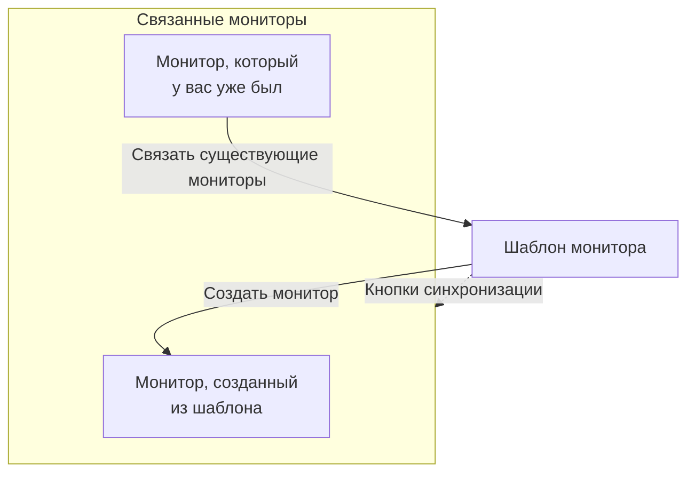

# Шаблоны мониторов

Шаблон монитора — это сохранённая конфигурация монитора (тип, критерии, интервал, метки и значения пользовательских полей по умолчанию), из которой мониторы создаются одним щелчком. Мониторы, созданные из шаблона или связанные с ним, остаются связанными: измените шаблон, а затем синхронизируйте изменение со всеми. Используйте шаблоны, когда многие мониторы должны вести себя одинаково, например одна и та же проверка работоспособности на каждом сервисе или одни и те же проверки API в продакшене и на staging.

:::cards
- [Создать шаблон](#создание-шаблона): Четыре шага, как в «Создать монитор».
- [Создать из него мониторы](#создание-мониторов-из-шаблона): Один щелчок, или свяжите мониторы, которые у вас уже есть.
- [Синхронизировать изменения](#синхронизация-изменений-со-связанными-мониторами): Что копирует каждая кнопка синхронизации.
- [Сохранить значения каждого монитора](#сохранение-значений-каждого-монитора): Защитить адрес назначения или заголовки от синхронизации.
:::

## Как работают шаблоны

Шаблон сам ничего не отслеживает. Мониторы создаются из него или связываются с ним, а страница шаблона показывает их как **Связанные мониторы**. Когда вы меняете шаблон, на этих мониторах ничего не меняется, пока вы не выполните синхронизацию: каждая кнопка синхронизации копирует одну часть шаблона на каждый связанный монитор, а защищённые поля сохраняют собственное значение каждого монитора.



## Перед началом

- **Роль, которая может создавать шаблоны**: Project Owner, Project Admin, Project Member, Monitor Admin или Monitor Member либо пользовательская роль с разрешением Create Monitor Template. Для изменения шаблона нужны те же роли или разрешение Edit Monitor Template.
- **Разрешение на обновление связанных мониторов.** Синхронизация записывает изменения в каждый связанный монитор от вашего имени и пропускает мониторы, на которые не распространяются ваши разрешения.

## Создание шаблона

:::steps
### Откройте шаблоны

Перейдите в **Мониторы → Настройки → Шаблоны** и нажмите **Создать: Монитор Шаблон**.

### Назовите шаблон

В разделе **Информация о шаблоне** введите **Название шаблона**, например `Production API Health`, и **Описание шаблона**, затем нажмите **Далее**.

### Задайте значения монитора по умолчанию

В разделе **Значения монитора по умолчанию** выберите **Тип монитора** с помощью того же выбора, что и в «Создать монитор». При желании введите **Название монитора по умолчанию**; если оставить его пустым, каждый монитор получит имя ресурса, который он отслеживает. **Описание монитора по умолчанию** и **Метки** ждут в разделе **Дополнительные поля**. Нажмите **Далее**.

### Задайте критерии и интервал

В разделе **Критерии** укажите, что проверять, и критерии, как в [Создать монитор](/docs/monitor/create-monitor#критерии). Карточка **Template sync settings** вверху позволяет защитить поля от синхронизации (см. [Сохранить значения каждого монитора](#сохранение-значений-каждого-монитора)). Для типа монитора, который проверяют зонды, последний шаг, **Интервал**, запрашивает **Интервал мониторинга**. Нажмите **Создать: Монитор Шаблон** на последнем шаге.
:::

Шаблон добавляется в список. Откройте его, чтобы увидеть страницу с карточкой для каждой части: **Информация о шаблоне**, **Значения монитора по умолчанию**, **Критерии мониторинга**, **Интервал мониторинга** (с **Минимальное согласие зондов**), **Метки**, **Custom Field Defaults** (если в проекте есть пользовательские поля мониторов) и **Связанные мониторы**. Каждую часть вы меняете в её собственной карточке, например через **Редактировать: Критерии** или **Редактировать: Интервал**.

## Создание мониторов из шаблона

- **Новый монитор.** Нажмите **Создать монитор** в строке шаблона в списке или **Создать монитор из шаблона** на его странице. **Создать монитор** откроется с уже заполненными типом и настройками шаблона; измените то, что нужно, и создайте монитор. Новый монитор будет связан с шаблоном.
- **Мониторы, которые у вас уже есть.** В разделе **Связанные мониторы** нажмите **Связать существующие мониторы** и выберите их. Они сохранят свои настройки до синхронизации.

Значения, заданные в **Custom Field Defaults**, записываются в каждый монитор, созданный из шаблона, включая мониторы, которые создают из него правила автоматического импорта и политики оповещений.

## Синхронизация изменений со связанными мониторами

Редактирование шаблона меняет только шаблон. Чтобы скопировать изменение на связанные мониторы, используйте кнопку синхронизации на карточке, которую вы изменили. Каждая кнопка показывает, сколько мониторов она затронет, например **Sync Criteria to 3 Linked Monitors**, и неактивна, пока ничего не связано. Синхронизацию нельзя отменить.

| Кнопка | Копирует на каждый связанный монитор | Не трогает |
| --- | --- | --- |
| **Синхронизировать критерии со связанными мониторами** | Критерии и настройки шага, например адреса назначения и параметры запроса, кроме защищённых полей | Интервал мониторинга, минимальное согласие зондов, имя, описание, метки и значения пользовательских полей |
| **Синхронизировать интервал со связанными мониторами** | Интервал мониторинга и минимальное согласие зондов | Критерии, имя, описание, метки и значения пользовательских полей |
| **Синхронизировать метки со связанными мониторами** | Метки, и ничего больше | Всё остальное |
| **Sync Custom Fields to Linked Monitors** | Пользовательские поля, для которых в шаблоне задано значение по умолчанию, вместо того, что было у каждого монитора | Пользовательские поля, которые шаблон оставляет пустыми, и всё остальное |

Чтобы синхронизировать один монитор, нажмите **Синхронизировать из шаблона** в его строке в разделе **Связанные мониторы**. Это копирует критерии и настройки шага (кроме защищённых полей), интервал мониторинга, минимальное согласие зондов и метки, а имя, описание и значения пользовательских полей монитора не трогает. **Отвязать от шаблона** отсоединяет монитор; он сохраняет свои настройки.

После синхронизации сводка показывает, сколько мониторов обновлено. **Синхронизировано частично** означает, что у некоторых связанных мониторов осталась прежняя конфигурация, обычно потому, что на них не распространяются ваши разрешения.

## Сохранение значений каждого монитора

Синхронизация критериев копирует и настройки шага, например адреса назначения, заголовки запроса и тайм-ауты, если вы не защитите эти поля. Защитите поле, чтобы каждый связанный монитор сохранил своё собственное значение.

:::steps
### Откройте шаблон

Перейдите в **Мониторы → Настройки → Шаблоны** и откройте шаблон.

### Измените его критерии

На карточке **Критерии мониторинга** нажмите **Редактировать: Критерии**.

### Защитите поля

В разделе **Template sync settings** отметьте **Do not sync this field** рядом с каждым полем, которое нужно сохранить на связанных мониторах.

### Сохраните

Сохраните изменения. Карточка **Критерии мониторинга** и подтверждение каждой синхронизации перечисляют защищённые поля.

### Синхронизируйте

Используйте **Синхронизировать критерии со связанными мониторами** или **Синхронизировать из шаблона** на отдельном связанном мониторе.
:::

Например, защитите **Monitor destination** и **Request headers** в шаблоне API. Мониторы продакшена и staging сохранят свои URL и заголовки, а оба получат обновлённые критерии шаблона и другие незащищённые настройки.

Доступные параметры зависят от типа монитора. Среди них адреса назначения и порты, параметры HTTP-запросов, подключения к базам данных, настройки DNS, селекторы инфраструктуры и запросы телеметрии. Связанные учётные данные, например клиентский сертификат и его закрытый ключ, сохраняются вместе.

### Как работают исключения

- Отмеченные поля сохраняют текущее значение каждого существующего монитора, включая пустое или незаданное значение. Заголовки запроса и другие коллекции сохраняются целиком.
- Неотмеченные поля по-прежнему синхронизируются из шаблона. Снимите отметку с защищённого поля и сохраните, чтобы при следующей синхронизации скопировать его значение из шаблона.
- Исключения действуют для массовой и одиночной синхронизации. Они хранятся в шаблоне, а не выбираются отдельно для каждой синхронизации.
- Новые мониторы по-прежнему начинают со значений полей шаблона. Исключения влияют только на синхронизацию существующих мониторов.
- Критерии синхронизируются всегда. Синхронизация только критериев не трогает интервал мониторинга, метки и другие настройки уровня монитора.
- У существующих шаблонов нет исключений полей, пока вы их не настроите. Мониторы сетевых устройств по-прежнему автоматически сохраняют собственную привязку к устройству.

Для шаблонов с несколькими шагами защищённые значения сопоставляются по ID шагов. Независимо созданные мониторы с одним шагом тоже могут получать шаблон с одним шагом. Если защищённый шаг сопоставить нельзя, синхронизация отклоняется до обновления какого-либо монитора, чтобы новый или переупорядоченный шаг не мог случайно скопировать адрес назначения или учётные данные другого шага.

> [!IMPORTANT]
> Прежде чем менять тип монитора сохранённого шаблона (через **Редактировать: Значения монитора по умолчанию**), удалите в **Редактировать: Критерии** исключения, которые не относятся к новому типу. Все исключения шаблона должны существовать для его типа монитора.

## Настройка через API

Каждый шаг шаблона принимает массив `doNotSyncFields` в своём объекте `MonitorStep.value`. Для монитора API защитите его адрес назначения и всю коллекцию заголовков так:

```json title="monitorSteps (excerpt)"
{
  "_type": "MonitorSteps",
  "value": {
    "monitorStepsInstanceArray": [
      {
        "_type": "MonitorStep",
        "value": {
          "id": "<step id>",
          "doNotSyncFields": ["monitorDestination", "requestHeaders"]
        }
      }
    ]
  }
}
```

Не указывайте массив или задайте его как `[]`, чтобы синхронизировать все поддерживаемые настройки шага. Неподдерживаемые имена полей и поля, которые не относятся к типу монитора шаблона, отклоняются. Синхронизацией управляет массив шаблона; такие метаданные на связанном мониторе его не переопределяют.

:::details Имена полей для doNotSyncFields по типам мониторов
| Тип монитора | Имена полей |
| --- | --- |
| Веб-сайт, API, Ping, IP, Порт, SSL Certificate, NTP | `monitorDestination`, `requestTimeoutInMs`, `retryCount` |
| Только API | `requestHeaders`, `requestType`, `requestBody` |
| Веб-сайт и API | `doNotFollowRedirects`, `allowSelfSignedCertificates`, `tlsClientAuthentication` (клиентский сертификат, ключ и парольная фраза вместе) |
| Порт, NTP | `monitorDestinationPort` |
| Synthetic Monitor, Custom JavaScript Code | `customCode` |
| Synthetic Monitor | `browserTypes`, `screenSizeTypes`, `retryCountOnError` |
| DNS | `dnsMonitor.queryName`, `dnsMonitor.recordType`, `dnsMonitor.resolver` (DNS-сервер и порт вместе), `dnsMonitor.timeout`, `dnsMonitor.retries` |
| Домен | `domainMonitor.domainName`, `domainMonitor.lookupMethod`, `domainMonitor.timeout`, `domainMonitor.retries` |
| DNSSEC | `dnssecMonitor.domainName`, `dnssecMonitor.resolvers`, `dnssecMonitor.checkNameserverConsistency`, `dnssecMonitor.signatureExpiryWarningDays`, `dnssecMonitor.timeout`, `dnssecMonitor.retries` |
| SQL Query | `sqlMonitor.connection`, `sqlMonitor.connectionTimeoutInMs`, `sqlMonitor.statementTimeoutInMs`, `sqlMonitor.query`, `sqlMonitor.maxRows` |
| Database Health | `databaseMonitor.connection`, `databaseMonitor.connectionTimeoutInMs`, `databaseMonitor.statementTimeoutInMs`, `databaseMonitor.enabledMetricGroups` |
| External Status Page | `externalStatusPageMonitor.statusPageUrl`, `externalStatusPageMonitor.provider`, `externalStatusPageMonitor.components`, `externalStatusPageMonitor.timeout`, `externalStatusPageMonitor.retries` |
| Журналы, Security Events, Трассировки, ИИ / LLM, Метрики, Исключения | `logMonitor`, `securityEventsMonitor`, `traceMonitor`, `llmMonitor`, `metricMonitor`, `exceptionMonitor` (вся конфигурация монитора) |

Мониторы инфраструктуры (Kubernetes, Docker, Хост, Podman, Proxmox, Docker Swarm, Ceph, Система хранения, IoT Device) предлагают свой селектор ресурсов, фильтры, запросы метрик и временное окно запроса. Их имена перечислены в **Template sync settings** в шаблоне этого типа.
:::

## Устранение неполадок

:::details Синхронизация сообщает «Синхронизировано частично»
Некоторые связанные мониторы не были обновлены, обычно потому, что на них не распространяются ваши разрешения. Попросите того, кто может обновлять все связанные мониторы, снова запустить синхронизацию.
:::

:::details Синхронизация завершается ошибкой «a template step cannot be matched to an existing monitor step»
Защищённое поле не удалось сопоставить с шагом одного из мониторов, поэтому синхронизация остановилась до изменения любого из них. Дайте шагам шаблона те же ID, что и шагам мониторов, или используйте шаблон с одним шагом для мониторов с одним шагом.
:::

:::details Кнопки синхронизации неактивны
С шаблоном ещё не связан ни один монитор. Создайте монитор из шаблона или нажмите **Связать существующие мониторы** в разделе **Связанные мониторы**.
:::

:::details Сохранение завершается ошибкой «Unsupported do not sync field»
Имя в `doNotSyncFields` не является полем типа монитора шаблона. Сверьте его с именами полей выше.
:::

## Дальнейшие шаги

:::cards
- [Создание монитора](/docs/monitor/create-monitor): Форма, которую заполняет шаблон.
- [Мониторинг API](/docs/monitor/api-monitor): Настройки, которые несёт шаблон API.
- [Секреты мониторинга](/docs/monitor/monitor-secrets): Использовать учётные данные в нескольких мониторах без копирования.
- [Шаги мониторов в Terraform](/docs/terraform/monitor-steps): Управлять мониторами и их шагами как кодом.
:::
