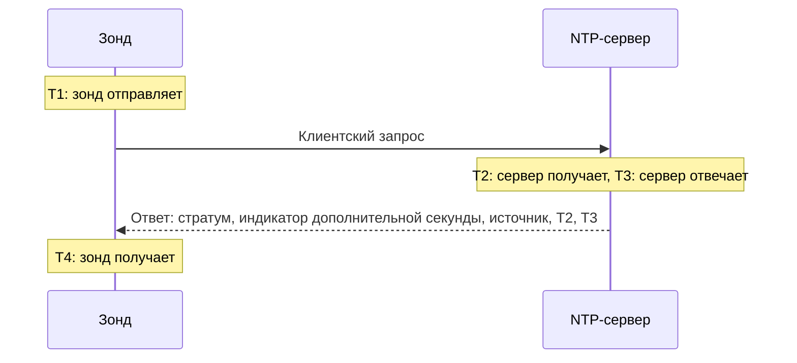

# Мониторинг NTP

Монитор NTP проверяет, что сервер времени отвечает на UDP-порту 123 и отдаёт точное время: что он синхронизирован, находится на разумном стратуме и что его часы совпадают с часами зонда. Используйте его для серверов времени, которыми вы управляете сами, например для GPS-часов в дата-центре или внутренних серверов, с которыми синхронизируются ваши машины, а также для публичных серверов, от которых вы зависите.

:::cards
- [Создание монитора](#создание-монитора-ntp): Шесть шагов в панели управления.
- [Что считывает проверка](#что-считывает-проверка): Стратум, смещение часов, индикатор дополнительной секунды и остальная часть ответа.
- [Критерии мониторинга](#критерии-мониторинга): Доступность, синхронизация, стратум и смещение.
- [Устранение неполадок](#устранение-неполадок): Когда сервер работает, а монитор говорит обратное.
:::

## Как это работает

При каждой проверке зонд отправляет один клиентский запрос SNTP (NTP версии 4, режим клиента) со случайного локального порта на UDP-порт сервера и ждёт ответа. Учитывается только настоящий ответ на этот запрос: зонд записывает 64 случайных бита в метку времени отправки запроса и игнорирует любой пакет, который не возвращает их обратно, короче пакета NTP или пришёл не в режиме сервера. Устаревший ответ на одну из прошлых проверок или поддельный ответ никогда не заставит упавший сервер выглядеть живым.

По четырём меткам времени зонд вычисляет **смещение часов**, ((T2 − T1) + (T3 − T4)) / 2: насколько часы сервера расходятся с часами зонда. Положительное смещение означает, что сервер спешит. Формула предполагает, что запрос и ответ идут одинаковое время, поэтому путь, который в одну сторону намного медленнее, может исказить смещение на величину до половины времени приёма-передачи.

> [!NOTE]
> Смещение измеряется относительно собственных часов зонда. Зонды OneUptime Cloud держат свои часы синхронизированными. На [пользовательском зонде](/docs/probe/custom-probe) тоже держите часы хоста синхронизированными, с помощью chrony или systemd-timesyncd, иначе оповещение о смещении может касаться зонда, а не сервера.

Сервер, который ответил, повторно не опрашивается, даже если в ответе нет точного времени. Молчание, отклонённый порт и неудачный DNS-запрос повторяются с новым запросом. Если сервер не отвечает вовсе, зонд также трассирует маршрут до него и прикладывает найденное как **Network Path at Time of Failure**. Зонд, потерявший собственное сетевое подключение, не сообщает никакого результата, поэтому он не может отметить ваш сервер как не в сети.

## Перед началом

- **Роль, которая может создавать мониторы**: Project Owner, Project Admin, Project Member, Monitor Admin или Monitor Member, либо пользовательская роль с разрешением Create Monitor.
- **Зонд, который может достучаться до UDP-порта 123 на сервере.** Любой зонд может проверить публичный сервер времени. Для сервера в частной сети используйте [пользовательский зонд](/docs/probe/custom-probe) внутри этой сети. Межсетевой экран перед сервером должен пропускать UDP, а не только TCP, с [IP-адресов зондов OneUptime Cloud](/docs/configuration/ip-addresses) или с вашего пользовательского зонда.

## Создание монитора NTP

:::steps
### Начните новый монитор

Откройте **Мониторы** и нажмите **Создать монитор**. В разделе **Тип монитора** введите `ntp` в поле поиска и выберите **NTP**. Он также есть в разделе **Другие типы мониторов**, в группе Сеть.

### Дайте ему имя

Введите **Имя**, например `GPS-сервер времени`, и нажмите **Далее**.

### Укажите сервер

В поле **NTP-сервер** введите имя хоста или IP-адрес сервера, например `time.example.com` или `192.168.1.10`. Запрос отправляется на порт 123. Чтобы использовать другой порт, откройте **Дополнительные поля** и укажите **Порт**.

### Проверьте его

Нажмите **Протестировать монитор**, выберите зонд в списке **Выберите зонд** и нажмите **Запустить тест**. **Результат теста монитора** показывает, ответил ли сервер, синхронизирован ли он, его стратум и насколько отклоняются его часы.

### Просмотрите критерии

**Критерии монитора** начинаются с [критериев по умолчанию](#критерии-по-умолчанию): не в сети, когда сервер не отдаёт точное время, в сети, когда отдаёт. Измените их при необходимости и нажмите **Далее**.

### Выберите зонды и создайте

Оставьте или измените **Зонды** и **Интервал мониторинга** (по умолчанию **Каждые 5 минут**) и нажмите **Создать монитор**. Откроется страница монитора.
:::

## Параметры конфигурации

| Поле | По умолчанию | Что вводить |
| --- | --- | --- |
| **NTP-сервер** | Нет | Сервер, например `time.example.com`, `192.168.1.10` или `2001:db8::123`. Введите только хост, без `udp://`. Порт, записанный после хоста, например `time.example.com:1123`, используется вместо поля **Порт**. |
| **Порт** (в **Дополнительные поля**) | `123` | UDP-порт, на котором сервер отвечает по NTP, от `1` до `65535`. Оставьте пустым для `123`. |
| **Тайм-аут запроса (секунды)** (в **Дополнительные поля**) | `5` | Сколько одна попытка ждёт ответа, включая DNS-запрос. Максимум — 60 секунд. |
| **Повторные попытки при сбое** (в **Дополнительные поля**) | Значение зонда по умолчанию, обычно `3` | Сколько раз повторять попытку, не получившую ответа. Максимум — 3. |

**Повторные попытки при сбое** считает повторы _после_ первой попытки, поэтому `0` выполняет проверку один раз, а `2` — до трёх раз, с паузой в одну секунду между попытками. Если поле пустое, используется значение зонда по умолчанию: 3, если только `PROBE_MONITOR_RETRY_LIMIT` зонда не задаёт другое.

## Что считывает проверка

Страница монитора показывает последнюю проверку от каждого зонда:

| Поле | Что это значит |
| --- | --- |
| **Синхронизирован** | Ответил ли сервер со стратумом от 1 до 15, без тревоги в индикаторе дополнительной секунды и с настоящими метками времени в ответе. |
| **Смещение часов** | Насколько часы сервера расходятся с часами зонда и в какую сторону. У исправного сервера это несколько миллисекунд. |
| **Стратум** | Сколько переходов отделяет сервер от эталонных часов: 1 для сервера с собственным GPS- или атомным источником, 2 для сервера, синхронизирующегося с сервером стратума 1, и так далее. 16 означает, что сервер не синхронизирован. |
| **Источник** | С чем синхронизируется сервер: имя источника, например `GPS`, `PPS` или `NIST`, на стратуме 1, адрес вышестоящего сервера начиная со стратума 2. |
| **Индикатор дополнительной секунды** | 0, когда дополнительная секунда не ожидается, 1 или 2, когда в конце дня секунда будет добавлена или убрана, 3, когда сервер сообщает, что его часы не синхронизированы. |
| **Корневая дисперсия** | Собственная оценка сервера, насколько его время может отличаться от истинного. Она растёт, пока сервер не может достучаться до своего источника. ntpd перестаёт доверять серверу, когда половина его корневой задержки плюс это значение превышает 1,5 секунды. |
| **Корневая задержка** | Время приёма-передачи от сервера до его эталонных часов. |
| **Время ответа** | От отправки запроса зондом до получения ответа, без DNS-запроса. |
| **Время сервера** | Часы сервера в момент отправки ответа. |

Сервер, который отказывается сообщить время, вместо этого присылает **kiss-o'-death**: ответ со стратумом 0 и кодом из четырёх букв. Самые частые коды: `RATE` (сервер ограничивает частоту запросов зонда), `DENY` и `RSTR` (его правила доступа отклоняют зонд) и `INIT` (он ещё не синхронизировался). Проверка показывает код и считает, что сервер отвечает, но не синхронизирован.

## Критерии мониторинга

Критерии решают, когда сервер считается в сети, деградированным или не в сети, и объявляется ли при этом инцидент или создаётся оповещение. Каждый критерий проверяет один или несколько фильтров:

| Фильтр | Условия | Что проверяет |
| --- | --- | --- |
| **NTP Is Online** | **Истина**, **Ложь** | Ответил ли сервер на запрос зонда ответом NTP. Kiss-o'-death тоже считается ответом. |
| **NTP Is Synchronized** | **Истина**, **Ложь** | Отдаёт ли ответивший сервер синхронизированное время. Если сервер не отвечает, этот фильтр не проверяется; для этого используйте **NTP Is Online**. |
| **NTP Stratum** | **Greater Than**, **Greater Than Or Equal To**, **Less Than**, **Less Than Or Equal To**, **Equal To**, **Not Equal To** | Стратум сервера. 0 в kiss-o'-death считается как 16, не синхронизирован. |
| **NTP Clock Offset (in ms)** | **Greater Than**, **Less Than**, **Greater Than Or Equal To**, **Less Than Or Equal To** | Насколько часы сервера расходятся с часами зонда, в любую сторону. |
| **NTP Response Time (in ms)** | **Greater Than**, **Less Than**, **Greater Than Or Equal To**, **Less Than Or Equal To** | От запроса до ответа. |
| **NTP Root Dispersion (in ms)** | **Greater Than**, **Less Than**, **Greater Than Or Equal To**, **Less Than Or Equal To** | Собственная оценка сервера своей максимальной погрешности. |

Если фильтров два или больше, **Условие совпадения** решает, должны ли совпасть **Все** или достаточно **Любой**. **Действия** критерия решают, что он делает: меняет статус монитора, создаёт оповещение, объявляет инцидент или любое их сочетание.

### Критерии по умолчанию

Новый монитор NTP начинается с двух критериев:

- **Не в сети** — сервер не отвечает, не синхронизирован или его часы расходятся с часами зонда на `1000` мс или больше. Монитор отмечается как **Не в сети**, и создаётся инцидент с названием "_имя монитора_ is not serving good time". Он закрывается сам, когда сервер снова отдаёт точное время.
- **В сети** — сервер отвечает, синхронизирован, и его часы расходятся с часами зонда меньше чем на `1000` мс. Монитор отмечается как **Работает**.

Критерии проверяются сверху вниз, и первый совпавший решает, что произойдёт. Сервер, который отвечает с неверным временем, намеренно считается упавшим: каждый клиент, который на него опирается, тоже взял бы это время.

### Оценка за период времени

**Оценивать этот критерий в течение определённого периода времени** — это флажок под каждым фильтром NTP. Включите его, чтобы оценивать окно прошлых проверок вместо последней: выберите агрегацию в поле **Оценить** и окно от 2 до 60 минут в поле **За последние (в минутах)**. Стратум, смещение и корневая дисперсия есть только у проверок, на которые сервер ответил, поэтому у окна молчания нет данных для этих фильтров, и тогда решает **Если нет данных**.

### Примеры критериев

| Цель | Фильтр | Условие | Значение |
| --- | --- | --- | --- |
| Оповестить, когда GPS-сервер переходит на сетевой источник | **NTP Stratum** | **Greater Than** | `1` |
| Оповестить, когда часы уплывают | **NTP Clock Offset (in ms)** | **Greater Than** | `100` |
| Оповестить, когда растёт граница погрешности сервера | **NTP Root Dispersion (in ms)** | **Greater Than** | `500` |
| Оповестить, когда ответы становятся медленными | **NTP Response Time (in ms)** | **Greater Than** | `1000` |

## Устранение неполадок

:::details Сервер работает, но монитор говорит, что он не ответил
Запрос или ответ потерялся по дороге. Так выглядит межсетевой экран, который пропускает TCP, но не UDP, правило ntpd `restrict` или chrony `allow`, в которое не входит адрес зонда, или сервер, который слушает только на внутреннем интерфейсе. **Network Path at Time of Failure** показывает, докуда дошёл маршрут. Пропустите зонд или проверяйте сервер с [пользовательского зонда](/docs/probe/custom-probe) внутри сети.
:::

:::details Монитор говорит, что сервер отклонил запрос
Хост ответил, что на этом UDP-порту никто не слушает (ICMP port unreachable): служба NTP остановлена или слушает на другом порту. Запустите службу или укажите в поле **Порт** тот, который она использует.
:::

:::details Сервер отвечает kiss-o'-death
`RATE` означает, что сервер ограничивает частоту запросов зонда. Зонд спрашивает один раз за проверку, поэтому помогает более длинный **Интервал мониторинга** или исключение адресов зонда из ограничения на сервере. `DENY` и `RSTR` означают, что правила доступа сервера отклоняют зонд. `INIT` и `STEP` означают, что сервер ещё не синхронизировался, что нормально в первые минуты после запуска.
:::

:::details Все мониторы NTP на одном зонде показывают похожее смещение
Уходят часы зонда, а не серверов. Проверьте, что хост зонда держит свои часы синхронизированными, или запустите мониторы на другом зонде.
:::

:::details Смещение скачет от проверки к проверке
Зонд далеко от сервера, или путь в одну сторону медленнее, чем в другую. Используйте зонд ближе к серверу или оценивайте смещение за несколько минут с помощью **Оценивать этот критерий в течение определённого периода времени** и **Среднее**.
:::

## Следующие шаги

:::cards
- [Мониторинг Ping](/docs/monitor/ping-monitor): Проверить, что сам хост доступен.
- [Мониторинг портов](/docs/monitor/port-monitor): Проверить TCP-службы на том же хосте.
- [Пользовательские probes](/docs/probe/custom-probe): Проверять серверы времени в вашей собственной сети.
- [Шаблоны инцидентов и оповещений](/docs/monitor/incident-alert-templating): Добавить стратум и смещение в заголовок инцидента.
:::
