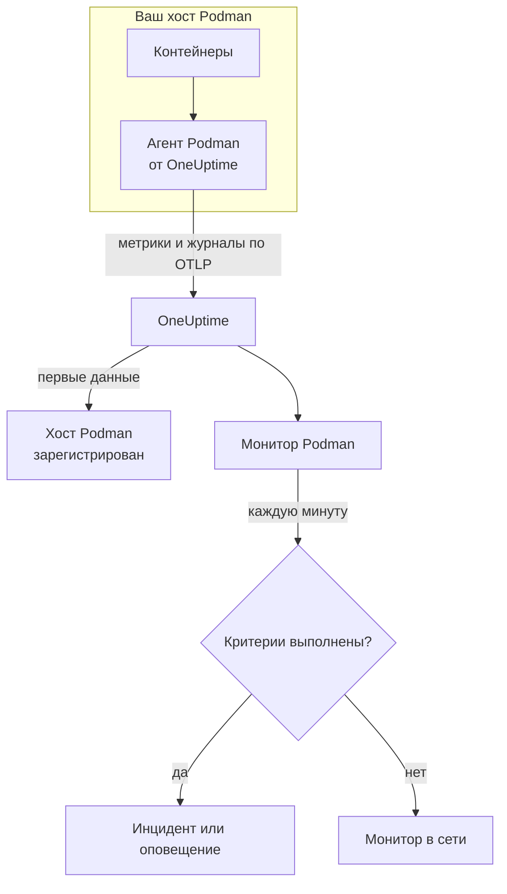

# Мониторинг Podman

Монитор Podman следит за контейнерами на одном хосте Podman и сообщает, когда контейнер перегревается, исчерпывает память или постоянно перезапускается. Он читает метрики, которые агент Podman от OneUptime отправляет с хоста, поэтому ничего не опрашивается снаружи: установите агент, а затем создайте монитор из шаблона или собственного запроса.

:::cards
- [Создание монитора](#создание-монитора-podman): Шесть шагов в панели управления.
- [Шаблоны](#готовые-шаблоны-оповещений): Пять готовых оповещений, по одному инциденту на контейнер.
- [Метрики](#собираемые-метрики): Что собирает агент и что означает каждая метрика.
- [Журналы](#собираемые-журналы): Журналы контейнеров и драйвер журналирования, который им нужен.
:::

## Как это работает

Агент Podman от OneUptime работает как контейнер на хосте. Каждые 30 секунд он читает статистику контейнеров через Docker-совместимый API-сокет Podman, отслеживает файлы журналов контейнеров и отправляет и то, и другое в OneUptime по OTLP. Первые данные с хоста регистрируют его в OneUptime.

Монитор Podman привязан к одному хосту. Каждую минуту он выполняет свой запрос по метрикам контейнеров этого хоста и сравнивает результат со своими критериями.



## Перед началом работы

- **Установите агент Podman** на хост. [Руководство по агенту Podman](/docs/telemetry/podman-host) описывает установку, обновление и проверку. Агенту нужен API-сокет Podman по пути `/run/podman/podman.sock`.
- **Убедитесь, что хост зарегистрирован.** Он появляется в разделе **Продукты → Инфраструктура → Podman → Все хосты** под именем из `PODMAN_HOST_NAME` агента, как только приходят его первые данные.
- **Для журналов контейнеров** запускайте контейнеры с драйвером журналирования `k8s-file`. См. [Требование к драйверу журналирования](#требование-к-драйверу-журналирования).

## Создание монитора Podman

:::steps
### Начните новый монитор

Перейдите в **Мониторы** и нажмите **Создать монитор**.

### Выберите Podman Container

В разделе **Тип монитора** нажмите **Другие типы мониторов** и выберите **Podman Container** в группе **Инфраструктура** или введите `podman` в поле поиска. Введите **Имя** – оно используется в заголовках инцидентов и оповещений – и нажмите **Далее**.

### Выберите хост

В разделе **Podman Monitor Configuration** выберите хост в поле **Podman Host**. В списке есть каждый хост, который присылал данные.

### Выберите, что отслеживать

Выберите одну из трёх вкладок:

- **Quick Setup** – нажмите на [шаблон](#готовые-шаблоны-оповещений). Он задаёт метрику, агрегацию, диапазон времени и пороги и заменяет критерии ниже своими. Поле **Диапазон времени** по-прежнему можно изменить.
- **Custom Metric** – выберите одну метрику в поле **Podman Metric**, затем задайте **Агрегация** и **Диапазон времени**. **Имя контейнера** и **Образ контейнера** сужают её до части контейнеров.
- **Расширенный** – сами постройте запросы и формулы в разделе **Выберите метрики**. Используйте **Group by** `resource.container.name`, чтобы оценивать каждый контейнер отдельно.

### Проверьте критерии

Откройте каждый критерий в разделе **Критерии монитора** и проверьте его поля **Метрика**, **Агрегация**, **Условие** и **Threshold**. Шаблон заполняет их. С **Custom Metric** или **Расширенный** монитор начинает со [стандартных критериев](#стандартные-критерии), которые замечают только падение метрики до нуля, поэтому задайте собственный порог.

### Создайте монитор

Нажмите **Создать монитор**. OneUptime откроет страницу монитора и будет оценивать его каждую минуту. Инциденты и оповещения, которые он открывает, также видны на страницах хоста **Инциденты** и **Оповещения**.
:::

> [!TIP]
> Чтобы настроить сразу несколько шаблонов, откройте хост через **Продукты → Инфраструктура → Podman** и перейдите в **Recommendations**. Выберите нужные шаблоны и тех, кого вызывать, и OneUptime создаст по одному монитору на шаблон.

## Настройки монитора

| Поле | Вкладка | Что делает |
| --- | --- | --- |
| **Podman Host** | Все | Обязательно. Ограничивает каждый запрос значением `resource.host.name` хоста. OneUptime также добавляет к каждому запросу `resource.container.runtime = podman`. |
| **Podman Metric** | Custom Metric | Одна метрика из каталога агента, сгруппированная как CPU, память, сеть, блочный ввод-вывод и контейнер. |
| **Имя контейнера** | Custom Metric, Расширенный | Необязательно. Точное совпадение с `resource.container.name`, например `my-container`. |
| **Образ контейнера** | Custom Metric, Расширенный | Необязательно. Точное совпадение с `resource.container.image.name`, например `nginx:latest`. |
| **Агрегация** | Custom Metric | Как объединяются замеры: **Среднее**, **Максимум**, **Минимум**, **Сумма** или **Количество**. Начинается с обычной агрегации метрики. |
| **Диапазон времени** | Все | Скользящее окно, которое читает запрос, от **Past 1 Minute** до **Past 365 Days**. Новый монитор начинает с **Past 1 Minute**; шаблоны задают свой. |
| **Выберите метрики** | Расширенный | Конструктор запросов: **Метрика**, **Aggregate by**, **Filter by attributes**, **Group by**, а также **Добавить метрику** и **Добавить формулу** для объединения запросов. |

## Готовые шаблоны оповещений

**Quick Setup** предлагает пять шаблонов. Каждый строит полный монитор: запрос, сгруппированный по `resource.container.name`, критерий, который срабатывает, и критерий, который восстанавливает. Каждый контейнер оценивается отдельно и получает собственный инцидент и собственное оповещение. Пороги – отправная точка, их можно менять.

Критерий срабатывает, только когда условие выполняется в каждую минуту его окна, и восстанавливается на 10 % за порогом, чтобы значение, колеблющееся у границы, не переключалось туда-обратно.

| Шаблон | Серьёзность | Что отслеживает | Срабатывает, когда | Восстанавливается, когда |
| --- | --- | --- | --- | --- |
| High Container CPU Usage | Warning | `container.cpu.utilization`, Avg по контейнеру, последние 5 минут | Выше 80 (% одного ядра) | 72 или ниже |
| High Container Memory Usage | Warning | `container.memory.percent`, Avg по контейнеру, последние 5 минут | Выше 85 % | 76,5 % или ниже |
| High Container Restart Count | Критический | `container.restarts`, Max по контейнеру, последние 5 минут | Более 5 перезапусков всего | 4,5 или меньше |
| High Container Process Count | Warning | `container.pids.count`, Max по контейнеру, последние 5 минут | Выше 500 | 450 или ниже |
| Container Restarted (Low Uptime) | Критический | `container.uptime`, Min по контейнеру, последняя 1 минута | Меньше 120 секунд | 132 секунды или больше |

**Серьёзность** – это метка, которую показывает список выбора. Инцидент и оповещение, которые создаёт шаблон, начинаются с самого серьёзного уровня инцидентов и оповещений вашего проекта; измените их в критериях.

Два процентных шаблона используют **Среднее**: их метрики уже являются процентами на контейнер, поэтому среднее за минуту – это устойчивое значение. Число перезапусков и число процессов используют **Максимум**, где сигналом служит один замер за порогом.

> [!NOTE]
> `container.cpu.utilization` – это число, которое выводит `podman stats`: 100 % – это одно полное ядро CPU, а не вся квота CPU контейнера. Контейнер, которому выделено несколько ядер, в нормальном состоянии показывает значительно больше 100, поэтому для таких контейнеров поднимите порог.

> [!NOTE]
> `container.restarts` – это накопительный итог, который ведёт Podman, а не число перезапусков в окне. Поэтому **High Container Restart Count** остаётся открытым, пока контейнер не будет пересоздан, что сбрасывает счётчик.

> [!CAUTION]
> `container.uptime` существует только для запущенных контейнеров. Контейнер, который остановился и остаётся остановленным, не присылает данных, поэтому **Container Restarted (Low Uptime)** ловит перезапуски и новые развёртывания, а не окончательную остановку. Контейнер, рассчитанный на работу меньше двух минут, всю свою жизнь остаётся в состоянии оповещения.

Шаблона для ограничения CPU нет. Метрики ограничения, которые собирает агент, только растут, и оповещение «ограничивался хоть раз» сработало бы один раз и никогда не снялось бы. Обе метрики по-прежнему собираются, так что по ним можно строить графики.

## Собираемые метрики

Агент использует приёмник OpenTelemetry `docker_stats`, направленный на Docker-совместимый сокет Podman `/run/podman/podman.sock`, каждые 30 секунд. Метрики каждого контейнера несут его идентификацию в виде атрибутов ресурса: `resource.container.name`, `resource.container.image.name`, `resource.container.id`, `resource.container.runtime` (`podman`) и `resource.host.name`.

### CPU

| Метрика | Описание |
| --- | --- |
| `container.cpu.utilization` | Использование CPU контейнером, где 100 % – одно полное ядро CPU. |
| `container.cpu.usage.total` | Время CPU, использованное с момента запуска контейнера, в наносекундах. Счётчик за всё время жизни. |
| `container.cpu.throttling_data.throttled_time` | Наносекунды, в течение которых контейнер ограничивался своим лимитом CPU. Счётчик за всё время жизни. |
| `container.cpu.throttling_data.throttled_periods` | Периоды ограничения с момента запуска контейнера. Счётчик за всё время жизни. |

### Память

| Метрика | Описание |
| --- | --- |
| `container.memory.usage.total` | Используемая память, в байтах. |
| `container.memory.usage.limit` | Лимит памяти, в байтах. |
| `container.memory.percent` | Использование памяти в процентах от лимита контейнера или от памяти хоста, если у контейнера нет лимита. |

### Сеть

| Метрика | Описание |
| --- | --- |
| `container.network.io.usage.rx_bytes` | Полученные байты. Счётчик за всё время жизни. |
| `container.network.io.usage.tx_bytes` | Отправленные байты. Счётчик за всё время жизни. |

### Блочный ввод-вывод

| Метрика | Описание |
| --- | --- |
| `container.blockio.io_service_bytes_recursive.read` | Байты, прочитанные с блочных устройств. |
| `container.blockio.io_service_bytes_recursive.write` | Байты, записанные на блочные устройства. |

### Контейнер

| Метрика | Описание |
| --- | --- |
| `container.uptime` | Секунды с момента запуска контейнера. Сообщают её только запущенные контейнеры. |
| `container.restarts` | Сколько раз контейнер перезапускался. Накопительный итог. |
| `container.pids.count` | Задачи в контейнере. Контроллер pids группы cgroup считает и потоки, и процессы. |

Список **Podman Metric** также предлагает `container.cpu.usage.percpu`, `container.memory.rss`, `container.memory.cache` и счётчики сетевых пакетов. Поставляемая конфигурация агента их не включает, поэтому проверьте страницу хоста **Метрики**, прежде чем на них опираться. `container.cpu.throttling_data.throttled_periods` в списке нет; запрашивайте её через **Расширенный**.

## Критерии мониторинга

Критерий сравнивает один из запросов или формул монитора с порогом. У критериев монитора Podman нет поля **Тип фильтра**: каждое правило проверяет значение метрики с такими полями.

| Поле | Что делает |
| --- | --- |
| **Метрика** | Запрос или формула для проверки, по имени переменной. |
| **Агрегация** | Как значения в окне превращаются в один ответ: **Среднее**, **Сумма**, **Maximum Value**, **Minimum Value**, **All Values** (совпасть должно каждое значение) или **Any Value** (достаточно одного). |
| **Условие** | **Greater Than**, **Less Than**, **Greater Than Or Equal To**, **Less Than Or Equal To** или **Equal To** – или условие аномалии: **Anomalously High**, **Anomalously Low** или **Anomalous**. |
| **Threshold** | Значение для сравнения. Рядом стоит список единиц, если у метрики есть единица. Не показывается для условий аномалий. |
| **Чувствительность** | Только для условий аномалий. **Низкий** (4σ), **Средний** (3σ, по умолчанию) или **Высокий** (2σ). |
| **Окно базовой линии** | Только для условий аномалий. 14 дней (по умолчанию), 28, 60 или 90 дней истории. |
| **Если нет данных** | В разделе **Дополнительные поля**. Что происходит, когда в окне нет замеров: **Ignore** (по умолчанию), **Treat As Zero** или **Триггер**. |

Условия аномалий сравнивают каждое значение с тем же часом недели в базовой линии. Они остаются в состоянии «Learning» и ничего не создают, пока окно базовой линии не накопит достаточно истории.

Каждый критерий также указывает, что делать при совпадении: изменить статус монитора, создать оповещение или объявить инцидент. Критерии проверяются сверху вниз, и решает первый совпавший.

### Стандартные критерии

Монитор, который вы создаёте не из шаблона, начинает с двух критериев:

| Порядок | Критерий | Срабатывает, когда | Затем |
| --- | --- | --- | --- |
| 1 | Check if _monitor name_ is offline | Любое значение первого запроса равно `0` | Помечает монитор как **Не в сети** и объявляет инцидент «_monitor name_ is offline», который закрывается сам, когда монитор восстанавливается. |
| 2 | Check if _monitor name_ is online | Любое значение больше `0` | Помечает монитор как **Работает**. |

> [!IMPORTANT]
> Молчание не совпадает ни с одним из критериев: хост, который перестал присылать данные, оставляет монитор в прежнем состоянии. Чтобы узнавать о прекращении данных, установите для **Если нет данных** значение **Триггер** в одном из критериев. Время, когда OneUptime сам не принимал данные, никогда не считается отсутствием данных: проверка, окно которой включает такое время, вместо этого ждёт, как объясняет страница [Когда OneUptime не получает данные](/docs/monitor/when-oneuptime-is-not-receiving).

## Собираемые журналы

Агент также отслеживает файл `ctr.log` каждого контейнера и отправляет каждую строку как запись журнала OpenTelemetry с полями:

| Поле | Значение |
| --- | --- |
| `resource.host.name` | Хост, из `PODMAN_HOST_NAME`. |
| `resource.container.id` | Полный ID контейнера. |
| `resource.container.runtime` | Всегда `podman`. |
| `attributes["log.iostream"]` | `stdout` или `stderr`. |
| `severityText` / `severityNumber` | Берётся из ключевого слова уровня, если уровень указан в строке (`[ERROR]`, `app.INFO:`, `{"level":"warn"}`, `level=error`). Строка без уровня берёт его из своего потока: `stderr` – это `ERROR`, `stdout` – это `INFO`. |
| `body` | Строка, которую записал контейнер. Строки, начинающиеся с пробела или закрывающей скобки, например строки трассировки стека, присоединяются к предыдущей строке. |
| `time` | Отметка времени Podman для строки. |

Журналы видны на странице хоста **Журналы** и на странице каждого контейнера.

### Требование к драйверу журналирования

Агент читает файлы, которые пишет драйвер журналирования Podman `k8s-file`, по пути `/var/lib/containers/storage/overlay-containers/*/userdata/ctr.log`. Podman с правами root по умолчанию использует `journald`, который вместо этого пишет в журнал systemd, поэтому читать нечего:

| Драйвер | Что видит агент |
| --- | --- |
| `k8s-file` (или `json-file`, который Podman обрабатывает так же) | Каждую строку. |
| `journald` | Ничего: журналы находятся в журнале systemd. |
| `none` | Ничего: журналы отбрасываются. |

Метрики не зависят от драйвера журналирования: хост, контейнеры которого используют `journald`, по-прежнему присылает метрики, только его страница **Журналы** остаётся пустой.

Проверьте драйвер контейнера и драйвер Podman по умолчанию:

```bash
podman inspect <container> --format '{{.HostConfig.LogConfig.Type}}'
podman info --format '{{.Host.LogDriver}}'
```

Переключитесь на `k8s-file`. Podman задаёт драйвер журналирования контейнера при его создании, поэтому после изменения пересоздайте каждый контейнер – перезапуск сохраняет старый драйвер.

:::tabs
@tab podman run
Запустите контейнер с этим драйвером:

```bash
podman run --log-driver k8s-file ... <image>
```

Чтобы переключить существующий контейнер, удалите его и запустите снова:

```bash
podman rm -f <container>
podman run --log-driver k8s-file ... <image>
```
@tab Podman Compose
Задайте драйвер для каждого сервиса:

```yaml title="docker-compose.yml"
services:
  my-app:
    image: my-app:latest
    logging:
      driver: "k8s-file"
      options:
        max-size: "100m"
```

Затем пересоздайте сервис:

```bash
podman compose up -d --force-recreate <service>
```
@tab containers.conf
Сделайте `k8s-file` драйвером по умолчанию для каждого контейнера, созданного после этого, в `/etc/containers/containers.conf` (rootful) или `~/.config/containers/containers.conf` (rootless):

```toml title="containers.conf"
[containers]
log_driver = "k8s-file"
```

Затем удалите и пересоздайте каждый контейнер.
:::

## Устранение неполадок

:::details Хоста нет в списке Podman Host
Хосты регистрируются сами по данным агента. Проверьте, что контейнер агента запущен, что API-сокет Podman включён и что хост есть в разделе **Продукты → Инфраструктура → Podman → Все хосты**. В [руководстве по агенту Podman](/docs/telemetry/podman-host) есть проверки, которые нужно выполнить на хосте.
:::

:::details Метрики приходят, а страница Журналы пуста
Контейнеры почти наверняка используют `journald`. Переключите те, чьи журналы вам нужны, на `k8s-file` (см. [Требование к драйверу журналирования](#требование-к-драйверу-журналирования)) и пересоздайте их.
:::

:::details Агент пишет в журнал «no files match the configured criteria»
Агент ищет `/var/lib/containers/storage/overlay-containers/*/userdata/ctr.log` и ничего не нашёл. Либо ни один контейнер на хосте не использует `k8s-file`, либо у агента нет подключения `/var/lib/containers/storage` или оно пустое, либо агент и контейнеры работают в разных режимах – контейнеры без root хранят данные там, куда не дотягивается путь для режима с root, и наоборот.
:::

:::details Данные приходят под неправильным именем хоста
OneUptime определяет хост по `resource.host.name`, которое агент берёт из `PODMAN_HOST_NAME`. Если изменить `PODMAN_HOST_NAME` после первых данных, появится второй хост, а не переименуется первый, и монитор останется привязан к имени, с которым был создан.
:::

:::details Оповещение по CPU никогда не срабатывает
Сгруппируйте запрос по `resource.container.name`, как это делает шаблон **High Container CPU Usage**, чтобы каждый контейнер оценивался отдельно. Среднее по всем контейнерам на загруженном хосте тянут вниз простаивающие. Помните, что 100 % – это одно полное ядро, поэтому контейнеру, которому разрешено несколько ядер, нужен более высокий порог.
:::

:::details Оповещение о числе перезапусков никогда не снимается
`container.restarts` – накопительный итог, поэтому сам он не опускается ниже порога. Устраните причину, а затем пересоздайте контейнер, чтобы сбросить счётчик, или поднимите порог.
:::

## Дальнейшие шаги

:::cards
- [Агент Podman](/docs/telemetry/podman-host): Установка, обновление и устранение неполадок агента, данные которого читает этот монитор.
- [Мониторинг Docker](/docs/monitor/docker-monitor): Такой же монитор для хостов Docker.
- [Обзор инцидентов](/docs/incidents/index): Что происходит после того, как критерий объявил инцидент.
- [Расписания дежурств](/docs/on-call/schedules): Решите, кого вызывать, когда контейнер ломается.
:::
